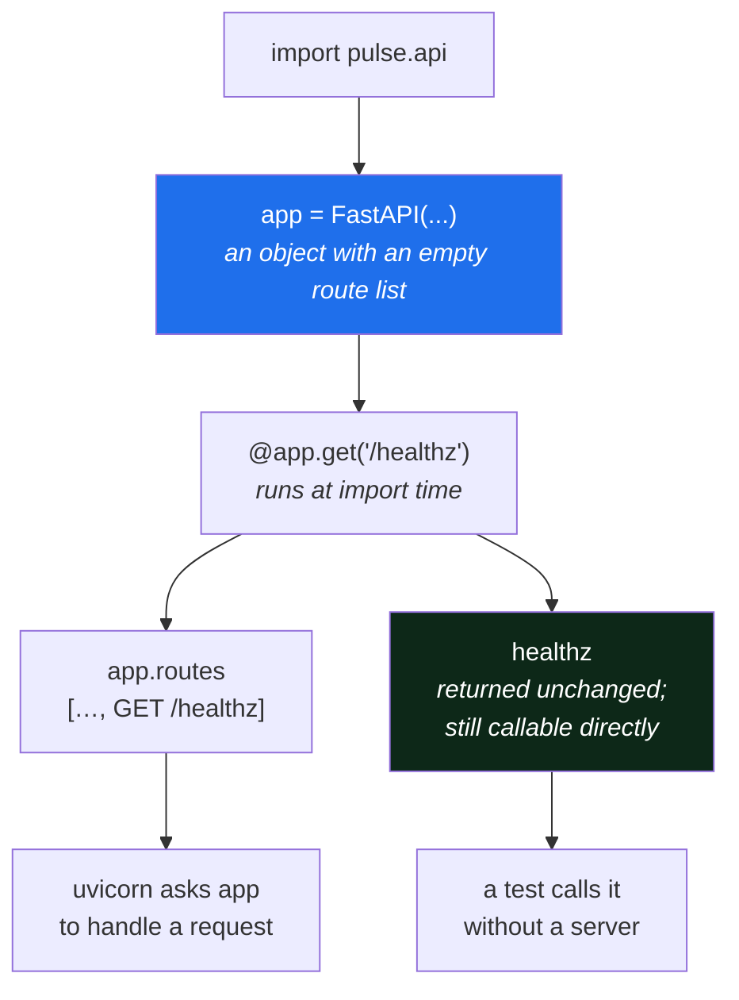

# 2.1 — The application object and the first route

## One-line answer

`app = FastAPI()` creates an ordinary Python object that holds a routing table, and a decorator adds
one row to it — there is no magic anywhere, and being able to print the table is what makes the whole
thing debuggable.

---

## The story

🎬 **The scene.** A small office with one telephone and a person who answers it. Someone rings and
asks for accounts. The person looks at a list taped to the desk, finds *accounts — extension 214*, and
puts the call through.

😬 **The naive fix.** The office grows and the list gets long, so somebody makes a *better* system: the
receptionist memorises it. Faster, tidier, no bit of paper.

💥 **Why it fails.** A caller asks for a department that has moved. The receptionist says "there's no
such department", confidently, and the caller goes away. Nobody can check whether that was true,
because the list is not anywhere. When the receptionist is off, nobody can answer the phone at all.

💡 **The insight.** The list taped to the desk was not primitive — it was **inspectable**. Anyone could
read it, anyone could see that the entry was stale, and anyone could take over. A routing table you can
look at is worth more than a routing table that is faster, because the question you will actually have
is *"why did that call not get through?"*

---

## The idea in plain language

Two lines of Python, and both are more ordinary than they look.

**`app = FastAPI()`** calls a class and gets back an object. That object holds, among other things, a
**list of routes**: each one a path, a set of methods, and the function to call. It is a plain
attribute you can print. When [1.2](../01-what-we-are-building/1.2-what-an-http-framework-gives-you.md)
said the application is "a callable taking `scope, receive, send`", this object is that callable —
`FastAPI` implements the ASGI interface, so uvicorn can hand it a request.

**`@app.get("/healthz")`** is a **decorator**. If the word is unfamiliar: a decorator is a function that
takes the function written below it and does something with it. These two are the same:

```text
@app.get("/healthz")
def healthz(): ...

# is exactly:
def healthz(): ...
healthz = app.get("/healthz")(healthz)
```

`app.get("/healthz")` returns a function; that function is called with `healthz`; it **appends a row to
the routing table** and hands the function back unchanged. There is nothing else happening. The
function is still a normal function you can call directly from a test — which is why
[4.1](../04-testing-it/4.1-the-first-real-test.md) can exercise the API without a server running.

### What the decorator records

Three things, and the third is the one people do not realise is being read:

**The path** — `"/healthz"`. Matched literally. Paths with parameters (`/tickets/{id}`) are matched by
pattern, which `pulse` does not need today.

**The method** — `get` in `@app.get`, `post` in `@app.post`. A path and a method together identify a
route; the same path with a different method is a *different* route, which is why requesting `/predict`
with `GET` produces `405 Method Not Allowed` rather than `404`.

**The function's type annotations.** `def healthz() -> dict[str, str]` — FastAPI reads that return
annotation, and reads the parameter annotations, and uses them to build validation and the OpenAPI
document. **The type hints are not documentation here; they are the configuration.** That is the single
most surprising thing about this framework and the reason the repository's house rule — type hints on
all public functions — stops being a style preference on this file.

### The routes you did not write

The application object arrives with routes already in it. Printing them is worth doing once:

```text
['/openapi.json', '/docs', '/docs/oauth2-redirect', '/redoc', '/healthz', '/version', '/predict']
```

Four of those seven are FastAPI's. `/openapi.json` is the machine-readable description of your API;
`/docs` and `/redoc` are two human interfaces onto it; `/docs/oauth2-redirect` supports authentication
flows you are not using. **They are enabled by default and they are a decision you have not made yet** —
[3.3](../03-running-it/3.3-the-interactive-docs-and-why-you-turn-them-off.md) is where you make it.

---

## Why Kriya needs it

Day 63 is *"The first metric"*, and Day 69 is distributed tracing.

Both work by **middleware** — code that wraps every request, on the way in and the way out, recording
how long it took and what it returned. Middleware is registered on this same `app` object, and it sees
the route's path as a label. That means the label set on your latency metric is decided by your
routing table: a route declared as `/tickets/{id}` produces one label; the same thing hand-parsed from
a wildcard produces a *different label per ticket*, which is unbounded cardinality and trap #2 from the
plan's §5.1 — *the metric that is not a metric*.

**The routing table is where your future metric labels come from.** That is not obvious today and it is
why the decorator's arguments deserve more thought than they usually get.

---

## The mechanism

Create the package and the application object. Two files, and the first one has three lines.

```python
# pulse/__init__.py
"""pulse — the service this curriculum operates."""

__version__ = "0.1.0"
```

**Line by line:**

- `pulse/__init__.py` is what makes the `pulse` directory an importable package. Without it,
  `from pulse.api import app` fails and uvicorn reports *"Could not import module"*
  ([5.1](../05-failure/5.1-the-four-errors-of-a-first-run.md)).
- The docstring is the package's, and it is one sentence. This repository's house style asks for
  docstrings on public things; a package's job is to say what it is, once.
- `__version__ = "0.1.0"` — **the single place the version is written.** It is read by `/version`
  ([2.3](2.3-version-what-is-actually-running.md)), by the `FastAPI(...)` constructor below, and by the
  tests. One definition, three readers. On Day 16 it becomes the thing a release tag agrees with, and a
  version defined in two places is a version that will eventually disagree with itself.

Now the application:

```python
# pulse/api.py
"""pulse v0 — three routes and no cleverness.

Day 3 of the Kriya plan. The model does not exist yet; /predict returns a
stub whose *shape* is the contract later days must keep.
"""

from fastapi import FastAPI

from pulse import __version__

app = FastAPI(title="pulse", version=__version__)
```

**Line by line:**

- The module docstring says what this file is *and what it deliberately is not*. The second half is the
  part that survives: six months from now the useful sentence is the one explaining why `/predict`
  returns a stub, because that is the thing a reader would otherwise assume was a bug.
- `from fastapi import FastAPI` — the class. One import, and it is the only thing this file needs from
  the framework so far.
- `from pulse import __version__` — an **absolute import**, naming the package. Not `from . import`.
  Absolute imports work identically whether the module is run as a script, imported by a test, or
  loaded by uvicorn; relative imports change meaning depending on how the module was reached, and the
  resulting `ImportError: attempted relative import with no known parent package` is a genuinely
  confusing message to meet on your first day.
- `app = FastAPI(...)` — a module-level name. **uvicorn finds this by name**, which is what the
  `pulse.api:app` argument means ([1.2](../01-what-we-are-building/1.2-what-an-http-framework-gives-you.md)).
  Calling it something else is fine as long as the command matches; calling it `app` is the convention
  every piece of documentation you will read assumes.
- `title="pulse"` and `version=__version__` — these go into the OpenAPI document and the `/docs` page.
  Passing `__version__` rather than a literal is the same one-definition rule: the API description and
  the `/version` endpoint cannot disagree, because they read the same name.

And the first route:

```python
@app.get("/healthz")
def healthz() -> dict[str, str]:
    """Can this process answer? Nothing else. See ADR-0005."""
    return {"status": "ok"}
```

**Line by line:**

- `@app.get("/healthz")` registers `GET /healthz`. `get` rather than `post` because this reads state and
  changes nothing — an HTTP method is a promise about effects, and honouring it is what lets caches,
  proxies and health checkers behave correctly. Day 8.
- `/healthz` rather than `/health` — a convention widely used to mark an endpoint as machine-facing
  rather than a page for humans. The `z` suffix has no technical meaning; it exists so the name is
  unlikely to collide with a real resource. **Consistency matters more than the choice**, and the
  wrong-path `404` in [1.2](../01-what-we-are-building/1.2-what-an-http-framework-gives-you.md) is what
  inconsistency costs.
- `def` rather than `async def`. FastAPI runs a plain `def` route in a thread pool, so blocking code in
  it cannot stall the event loop — the failure named in
  [1.2](../01-what-we-are-building/1.2-what-an-http-framework-gives-you.md)'s production section. This
  is the right default until Day 110 explains when it is not.
- `-> dict[str, str]` — the return annotation. FastAPI reads it to build the OpenAPI schema. It also
  means a future change returning something else is a type error your editor catches.
- The docstring's *"See ADR-0005"* is the proximity rule from
  [Day 1, part 2.1](../../../day-001-what-operations-actually-is/parts/02-the-repo-remembers/2.1-why-the-chat-is-not-the-memory.md):
  the question *"why does this not check the database?"* gets asked at this function, so the pointer
  lives at this function. Three words, and they prevent the most likely wrong change anyone will make
  to this file.
- `return {"status": "ok"}` — a dictionary, which FastAPI serialises to JSON. Why a dictionary rather
  than the bare string `"ok"`: a JSON object can gain a field without breaking a client that reads
  `status`, and a bare string cannot gain anything at all.

Now look at what the object holds:

```bash
uv run python -c "from pulse.api import app; print(type(app)); print([r.path for r in app.routes])"
```

**Line by line:** importing the module runs it, which runs the decorators, which fills the routing
table. `app.routes` is a plain list. Printing it proves there is no registry, no scanner and no magic —
just a list that got appended to at import time.

Observed on **2026-08-24** (with all three routes written):

```text
<class 'fastapi.applications.FastAPI'>
['/openapi.json', '/docs', '/docs/oauth2-redirect', '/redoc', '/healthz', '/version', '/predict']
```



---

## When it breaks

The characteristic failure is a route that exists in the file and not in the table, and there are two
ways to cause it. Both are quiet.

**The decorator with no parentheses.** `@app.get` instead of `@app.get("/healthz")`:

```text
Traceback (most recent call last):
  File "/app/pulse/api.py", line 12, in <module>
    @app.get
     ^^^^^^^
TypeError: FastAPI.get() missing 1 required positional argument: 'path'
```

**What it says:** `get()` needs a path.
**What it actually means:** a decorator that takes arguments is called *twice* — once with its
arguments, once with the function. Writing `@app.get` skips the first call, so Python tries to hand the
function straight to `app.get` as its `path`. **This is loud and immediate, at import time**, which is
the good case.

**The module that is never imported.** This one is silent, and it is the real trap. If routes are
defined in a file that nothing imports, the decorators never run, the table stays empty, and every
request gets:

```text
HTTP/1.1 404 Not Found
date: Mon, 24 Aug 2026 09:39:19 GMT
server: uvicorn
```

**What it says:** not found.
**What it actually means:** *possibly* a typo in the path — and *possibly* that the entire module
defining your routes was never loaded. The two are indistinguishable from the client. There is no
error, no warning, and no traceback, because nothing went wrong: an unimported module is not an error
condition.

**The smallest fix** is not to guess: **print the routing table.** The `python -c` command above
answers "is this route registered?" in one line and definitively, and it is the first thing to run when
a route that obviously exists returns `404`. This is why the table being inspectable matters more than
it being fast — the story at the top of this part, in the actual failure.

---

## In production

**What a professional writes instead of the teaching version.** Once there is more than a handful of
routes they stop defining them all on `app` and use `APIRouter` — a routing table fragment that can be
defined in its own module and mounted onto the application with a prefix. Two reasons, and the second
is the operational one: it keeps files small, and it makes the *mount point* an explicit, greppable
line, so "where does `/v2/predict` come from?" has an answer that is not a search. `pulse` gets there
around Day 125, when the assistant arrives; three routes in one file is the honest shape today.

**What degrades at scale.** Route ordering and overlap. With three literal paths nothing can be
ambiguous. With parameterised routes, `/tickets/{id}` and `/tickets/new` both match `/tickets/new`, and
which one wins depends on declaration order — a bug that is invisible in review and obvious in
production. The professional habit is to keep literal routes above parameterised ones and to have a
test per route that asserts the *right function* answered, not just that something did.

**The failure that only shows with real traffic.** Unbounded label cardinality from the routing table,
as described in *Why Kriya needs it*. It is worth restating because it costs money and dashboards: if a
metric is labelled with the raw request path rather than the *route template*, then a million distinct
ticket ids become a million distinct time series, and your metrics backend falls over. FastAPI knows the
template — the route object has it — and Day 63 uses it. **The mistake is easy, the failure is delayed
by weeks, and the recovery involves deleting data.**

**The review comment a senior engineer leaves.** *"This route is defined but I can't tell from the diff
whether the module gets imported. Add a test that asserts the path is in `app.routes` — a `404` in
staging looks identical to a typo and we'll waste an afternoon on it."*

**The signal you would alert on.** Nothing from the routing table itself — it is a startup-time
structure. The related runtime signal, from Day 63, is **request count by route and status**, and the
useful alert on it is a *sudden* rise in `404`s: a spike of not-founds usually means a client is
calling a path you removed or renamed, which is a change-management failure rather than a bug, and it
is invisible in error-rate metrics that only count `5xx`.

**Blast radius.** This part creates two files and registers one read-only route that returns a constant.
Worst case: the module fails to import and uvicorn refuses to start — loud, immediate, no traffic
served. Who can trigger it: anyone editing the file. What bounds it: the failure is at import time
rather than request time, which is the good place for a failure to be, and it is exactly the property
Day 9 makes deliberate for configuration.

**Cost:** `0` model calls, `0` tokens, `0` CI minutes. The `python -c` import costs a fraction of a
second and no network.

**The interview question.** *"What does the route decorator actually do?"* It sounds like trivia and it
is a quick way to find out whether someone thinks the framework is magic. The answer is short — it
appends a row to a list on the application object at import time and returns the function unchanged —
and the follow-up that matters is *"so what happens if the module is never imported?"*, because the
answer is a silent `404` and knowing that saves an afternoon.

---

## Check yourself

```bash
uv run python -c "from pulse.api import app; print('/healthz' in [r.path for r in app.routes])"
```

`True`. The route is in the table, verified without starting a server — which is the same trick
[4.1](../04-testing-it/4.1-the-first-real-test.md) uses to test the whole API.

**Say out loud, without scrolling up:** *a route you can see in the file returns `404`. Name the two
possible causes and the one command that tells them apart.*
