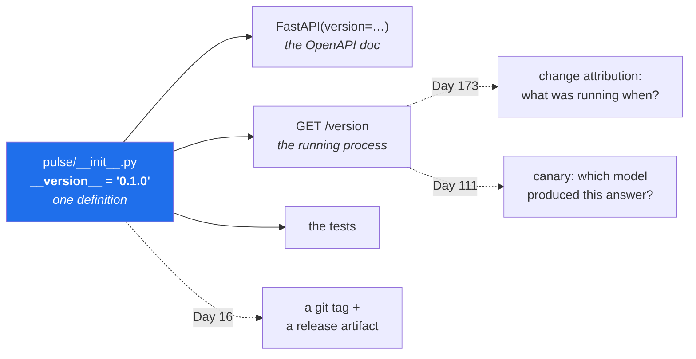

# 2.3 — `/version` — what is actually running

## One-line answer

*What changed?* is the fourth operator question and it is unanswerable unless the running system can
tell you what it is — so the service reports its own version, from one definition, without being asked
nicely.

---

## The story

🎬 **The scene.** A car goes into a garage with an intermittent fault. The mechanic asks what has been
done to it recently. The owner says a service, a few months ago, somewhere else, and possibly a part
was replaced but they are not sure which.

😬 **The naive fix.** Start diagnosing from the symptom. It is a real fault and it can be found by
investigation.

💥 **Why it fails.** It takes three days. The fault was a batch of faulty parts, recalled two months
ago, and the recall notice names the part number. Had anyone been able to read the number off the part
in ten seconds, the diagnosis would have been a phone call. **The information existed, was cheap to
obtain, and was not attached to the thing.**

💡 **The insight.** Serial numbers on parts are not bureaucracy — they are what makes "what is this,
exactly?" a ten-second question instead of a three-day investigation. The value is not in the number.
It is in the number being **readable off the running object**, without paperwork, by whoever is
standing there.

---

## The idea in plain language

At some point — and it will be much sooner than you expect — you will need to answer *"is the fix
deployed?"* or *"which version is serving this traffic?"*, and every way of answering it from outside
the running system is unreliable:

| How you might answer | Why it is wrong |
| --- | --- |
| "the last commit on main" | main is what will deploy, not what did |
| "the pipeline says it succeeded" | it deployed *something*, somewhere, at some point |
| "the image tag" | tags are mutable; `:latest` is a lie by Day 27 |
| "someone said they deployed it" | this is the chat, not the memory |
| **ask the running process** | it is the only source that cannot be stale |

The last row is the only one that is *definitionally* correct: a process reporting its own version
cannot be describing a different process.

### What goes in it

Three fields today, and each is a different kind of answer:

**`service`** — which service this is. Trivial with one service and essential with forty, because a
misrouted request answered by the wrong service is otherwise indistinguishable from a bug.

**`version`** — the code. `0.1.0` today; from Day 16 it agrees with a git tag and a release artifact.

**`model_version`** — `"none"`, because there is no model. This is the field that makes the endpoint
worth building today rather than on Day 109. **A service that contains a model has two versions**, and
they change independently: a model can be swapped without a deploy, and a deploy can happen without a
model change. *"Which model is serving?"* is a question `/version` answers and `git log` never can.

Note what is **not** in it. No configuration, no environment name, no database connection string, no
feature flags. Everything you add is something an unauthenticated caller can read, and
[3.3](../03-running-it/3.3-the-interactive-docs-and-why-you-turn-them-off.md) is about that boundary.

### One definition, several readers

`__version__` is defined once, in `pulse/__init__.py`
([2.1](2.1-the-application-object-and-the-first-route.md)), and read by:

- the `FastAPI(version=...)` constructor, so the OpenAPI document agrees;
- the `/version` route, so the running service agrees;
- the tests, so the assertion cannot drift from the value
  ([4.1](../04-testing-it/4.1-the-first-real-test.md));
- and from Day 16, the release process, so the tag agrees.

**Four readers, one definition.** The alternative — a literal in each place — is not a style problem;
it is a guarantee that one of them will eventually be wrong, and it will be the one you are reading
during an incident.

---

## Why Kriya needs it

Day 173 is *"Change attribution — which deploy caused this?"*, and Day 111 is the first model canary.

Change attribution works by correlating an incident's timeline against a list of deploys. That list has
to say *what was running when*, and the only reliable source is the running thing itself: a scraper or a
metric that records the version each instance reports, so the deploy timeline is observed rather than
assumed.

Day 111 is the sharper case. Two model versions serve simultaneously, and every prediction has to be
attributable to one of them or the comparison is meaningless. The `model_version` field in `/version` —
and, on Day 109, in the `/predict` response too — is what makes it possible. **Adding it today costs a
line; adding it on Day 111 means every stored prediction from before the change is unattributable.**

---

## The mechanism

```python
@app.get("/version")
def version() -> dict[str, str]:
    """What is actually running here."""
    return {"service": "pulse", "version": __version__, "model_version": "none"}
```

**Line by line:**

- `@app.get("/version")` — `GET`, unauthenticated, cheap. Anything that has to be *asked for* by a
  human with credentials will not be there when you need it at 3am.
- `-> dict[str, str]` — every value a string, including `model_version`. **Deliberate:** a version is
  an identifier, not a number. `0.10.0` is greater than `0.9.0` and `"0.10.0" < "0.9.0"` as strings, so
  the moment you treat versions as sortable you need a real comparison — and a field that is sometimes
  a number and sometimes `"none"` is worse than one that is always a string.
- `"service": "pulse"` — a literal, and this is the one place a literal is right. The service's *name*
  is not derived from anything; it is what this thing is called.
- `__version__` — read from the single definition, never retyped.
- `"model_version": "none"` — the honest value. Not `null`, not an omitted key, not `""`. **A key that
  is sometimes absent forces every consumer to handle two shapes**; a key that is always present with
  an explicit "there isn't one" forces nobody to do anything. This is the same argument as the `never`
  column in
  [Day 2, part 3.3](../../../day-002-shape-of-production-system/parts/03-state/3.3-what-you-can-lose-and-what-you-cannot.md):
  write the bad value rather than leaving a blank.

Ask it:

```bash
curl -sS -i http://127.0.0.1:8000/version
```

**Line by line:** `-i` to see the headers as well as the body, for the same reason as in
[2.2](2.2-healthz-the-endpoint-that-must-not-lie.md) — the status line is what a machine reads and the
body is what a person reads.

Observed on **2026-08-24**:

```text
HTTP/1.1 200 OK
date: Mon, 24 Aug 2026 09:38:54 GMT
server: uvicorn
content-length: 60
content-type: application/json

{"service":"pulse","version":"0.1.0","model_version":"none"}
```

And confirm the two places agree, which is the property the single definition buys:

```bash
uv run python -c "
import json, urllib.request
from pulse import __version__
served = json.load(urllib.request.urlopen('http://127.0.0.1:8000/version'))['version']
print(f'source={__version__} served={served} agree={served == __version__}')"
```

**Line by line:**

- `urllib.request` from the standard library rather than a client package — this is a two-line check
  and adding a dependency for it would be the anti-pattern from
  [Day 2, part 2.2](../../../day-002-shape-of-production-system/parts/02-dependencies/2.2-every-dependency-is-a-decision.md).
- The comparison is between the version **imported from the source** and the version **served over
  HTTP by the running process**. Those are genuinely two different things: the second could be an older
  process still running from before your edit, which is exactly the situation the endpoint exists to
  reveal.
- Printing `agree=` rather than asserting, because this is a diagnostic rather than a test. The
  assertion version lives in [4.1](../04-testing-it/4.1-the-first-real-test.md).

```text
source=0.1.0 served=0.1.0 agree=True
```



---

## When it breaks

The characteristic failure is the endpoint that is confidently wrong, and there are two ways to get
there.

**The version that was hard-coded in two places.** Somebody bumps the package version and not the
route, or the reverse:

```text
$ curl -sS http://127.0.0.1:8000/version
{"service":"pulse","version":"0.1.0","model_version":"none"}
$ uv run python -c "from pulse import __version__; print(__version__)"
0.2.0
```

**What it says:** the service is `0.1.0`.
**What it actually means:** unknown — either the running process is genuinely old, or the route has a
stale literal. **Those two have completely different responses** (redeploy versus fix a bug) and you
cannot tell them apart from the outside. An endpoint whose failure mode is *ambiguity* is worse than no
endpoint, because you will act on it.

**The smallest fix** is the single definition, which makes this failure structurally impossible rather
than merely unlikely.

**The version that is right and stale.** More common and much more confusing:

```text
$ curl -sS http://127.0.0.1:8000/version
{"service":"pulse","version":"0.1.0","model_version":"none"}
```

…after you have edited the code, saved it, and are certain the fix is in. The endpoint is telling the
truth: **the process you are talking to was started before your edit and is still running the old
code.** Python loads modules once, at import; editing a file does nothing to a running process.

This is the single most common confusion of a first day with a web framework, and the give-away is that
`/version` and your editor disagree. The fixes, in order of how much you should like them:

- restart the server — always correct;
- run it with `--reload` during development, which watches files and restarts for you
  ([3.1](../03-running-it/3.1-the-server-the-port-and-the-process.md));
- and on Windows, check you are not talking to a **second** server that bound the same port — from
  [Day 2, part 2.3](../../../day-002-shape-of-production-system/parts/02-dependencies/2.3-the-dependency-that-fails-slowly.md),
  `netstat -ano | grep :8000` may show two listeners and your `curl` may be reaching the wrong one.

**That third possibility is genuinely nasty** and it is the reason this endpoint earns its place on day
one: without it, "my change is not taking effect" is a mystery; with it, it is a two-second check.

---

## In production

**What a professional writes instead of the teaching version.** They put the **git commit hash** in it,
not just the semantic version, because two builds can share a version and differ. The hash is injected
at build time — a build argument in the Dockerfile, an environment variable, or a generated file — so
the artifact carries the exact commit it was built from. That closes the loop from
[Day 1, part 1.3](../../../day-001-what-operations-actually-is/parts/01-what-ops-is/1.3-the-four-questions-an-operator-answers.md):
*what changed?* becomes `git log` between two hashes you can read off two running systems. Day 16 adds
it, and it needs a build process to inject it, which is why it is not here yet.

**What degrades at scale.** Asking. With one instance, `curl /version` is the answer. With three
hundred, you need the *distribution* — how many instances are on each version — because a deploy in
progress means several answers are simultaneously correct, and a stuck deploy means one instance has
been on the old version for a week and nobody noticed. The scaled version is a **metric**: a gauge
labelled with the version, so the dashboard shows the mix. Day 63 builds it, and it is one of the most
useful panels you will ever have.

**The failure that only shows with real traffic.** Version skew during a rolling deploy. For a few
minutes both versions serve, and if they disagree about a response shape or a database schema, a client
gets one shape and then the other. Every instance is healthy, every version is correct, and the *system*
is briefly inconsistent. This is why Day 43 (rollouts) and Day 18 (deployment strategies) treat
"can these two versions coexist?" as a design requirement rather than an accident, and why database
migrations get their own careful treatment on Day 232.

**The review comment a senior engineer leaves.** *"`/version` returns the package version but not the
commit. Two builds off different branches can both say `0.4.2`, and when we're comparing a canary
against production that's exactly when we'll need to tell them apart. Inject the short hash at build
time."*

**The signal you would alert on.** Not the endpoint itself — but the **build-info gauge** derived from
it is worth two alerts, and neither is obvious. First: **more than one version serving for longer than
a deploy should take**, which catches a stuck rollout that no error rate would show. Second: **the
running version is not the expected version**, which catches a rollback that nobody recorded and a
deploy that silently did not happen. Both are *drift* alerts — reality disagreeing with the record —
and they are the same shape as
[Day 1, part 2.5](../../../day-001-what-operations-actually-is/parts/02-the-repo-remembers/2.5-generated-files-you-never-edit.md)'s
generated-file problem, at runtime.

**Blast radius.** This endpoint is unauthenticated and readable by anyone who can reach the port, which
is the decision worth naming rather than assuming. Worst case: it tells an attacker exactly which
version you are running, which is a genuine reconnaissance aid — a known vulnerability in a named
version is a much easier target than an unknown one. Who can trigger it: anyone who can reach the
service. What bounds it: today, the loopback bind; in production, the fact that the endpoint reports a
version and *nothing else* — no configuration, no paths, no hostnames, no dependency versions. **The
bound is what you left out.** Teams with a stricter posture put it behind an internal-only route, and
that is a defensible trade against the 3am usefulness of it being trivially reachable.

**Cost:** `0` model calls, `0` tokens. Sixty bytes and negligible CPU per request; from Day 63 the
scaled version costs one metric series per instance-version pair, which is bounded and small.

**The interview question.** *"How do you know what version is running in production?"* The weak answer
is the CI pipeline or the git log. The strong answer is *"I ask the running process"*, followed
immediately by the reason: everything else describes what *should* be running, and the gap between
should and is is precisely what you are trying to find. The best answers add the fleet-level version:
"and I'd want it as a metric, because with more than a few instances the answer is a distribution."

---

## Check yourself

```bash
curl -sS http://127.0.0.1:8000/version && uv run python -c "from pulse import __version__; print(__version__)"
```

Two answers to the same question, from two different places. They agree today. The day they do not is
the day this endpoint earns its keep.

**Say out loud, without scrolling up:** *your edit does not seem to have taken effect and `/version`
reports the old value. Name the three possible causes, and which one is specific to this machine.*
