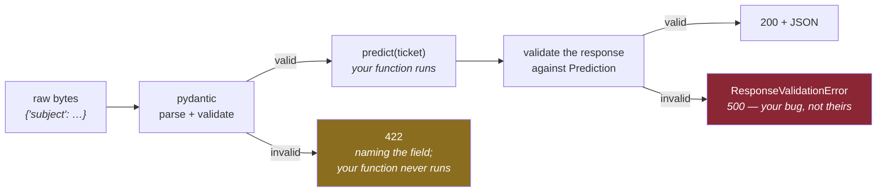

# 2.4 — `/predict` — the contract before the model

## One-line answer

Two class definitions decide what a client may send, what it will get back and how it is refused —
and those three things are the part of an endpoint that outlives every implementation of it.

---

## The story

🎬 **The scene.** A country changes the shape of its plug sockets. Not the voltage, not the frequency —
the plug. Everything electrical in every home stops fitting.

😬 **The naive fix.** Adapters. Everyone buys an adapter, and it works.

💥 **Why it fails.** For decades. Every device sold has to choose, every hotel has a drawer of adapters,
every traveller carries a bag of them, and the cost is paid a few pence at a time by tens of millions
of people forever. Nobody made a catastrophic decision — somebody chose a slightly different shape, and
the shape turned out to be the thing everything else was built against.

💡 **The insight.** The interesting property of a plug is not that it conducts electricity. It is that
it is an **agreement between things that were built separately and cannot be changed together**. The
cost of getting the shape wrong is not paid by the person who chose it, and it is not paid once.

---

## The idea in plain language

An **API contract** is the agreement between your service and everyone who calls it: what a request
must contain, what a response will contain, and what happens when a request is wrong. Once anyone
depends on it, changing it means changing them — and you frequently cannot, because "them" includes
software you do not control, running on machines you cannot reach.

That asymmetry is why the contract is worth deciding on a day when there is nothing behind it. **The
model is an implementation detail. The contract is not.**

### The three parts of the contract

**What comes in.** A ticket has a `subject` and a `body`. Both required, both strings, both with length
limits. Bounds are part of the contract, not a nicety: an endpoint that accepts a fifty-megabyte body
has agreed to receive one.

**What goes out.** A `priority`, a `queue`, and a `model_version`. The last one is the field with no
implementation today and the largest future value — the reason is in
[2.3](2.3-version-what-is-actually-running.md), and it is Day 111's canary.

**What happens when it is wrong.** A `422` with a body naming the offending field. Not a `500`, not a
`200` with an error inside it, not a traceback. **The error shape is part of the contract**, and it is
the part most often left to whatever the framework happens to do — which here is good, and worth
understanding rather than inheriting.

### What pydantic actually does

`Ticket` and `Prediction` are **pydantic models** — classes that describe a shape, from which pydantic
builds a validator. FastAPI reads the type annotation on the route's parameter, finds a pydantic model,
and inserts three steps you did not write: parse the JSON body, validate it against the model, and pass
the resulting object to your function. If validation fails your function is never called, and the
client gets a `422`.

This is worth being precise about because it is the difference between a framework and a library: the
validation is **not something you call**, it is something that happens because of a type annotation.
The type hints are the configuration, as
[2.1](2.1-the-application-object-and-the-first-route.md) said.

### Why validate at all

Three reasons, in increasing order of importance:

**Errors are cheaper at the boundary.** A missing field caught by the validator produces one clear
message naming the field. The same missing field caught inside a model's feature extraction produces a
`KeyError` twelve frames deep, and the response is a `500`.

**The failure is the client's, and the message should say so.** `422` means *you sent something I
cannot process*; `500` means *I am broken*. Getting this backwards makes your error rate look like your
fault and makes the client think the problem is yours — which is a *diagnosis* problem, not a
politeness one, and it is why Day 8 spends a day on status codes.

**The boundary is where you know the most.** At the edge you have the raw input and the schema; deeper
in, you have only the parts you extracted. Validation late is validation with less information. This is
the exact idea that returns on Day 90 as **data validation at the boundary** for the training pipeline,
and it is one of the most transferable ideas in this curriculum.

---

## Why Kriya needs it

Day 109 is *"`pulse` serves a registry model behind a latency objective"*, and Day 111 is the canary.

On Day 109 the body of this function changes and **nothing else does**. The route, the request model,
the response model, the validation, the tests, the metrics and the objective all already exist. That is
the payoff for defining the contract today, and it is why the day is *"serve a model"* rather than
*"build an API and serve a model"*.

Nearer, and worth knowing: Day 90 validates the *training* data with the same library and the same
idea, and Day 115's drift detection compares live request fields against the training distribution —
which is only possible because requests have a declared schema. **An endpoint that accepts arbitrary
JSON cannot have drift detection**, because there is nothing to compare.

---

## The mechanism

Two model classes and one route.

```python
class Ticket(BaseModel):
    """One support ticket, as it arrives from a client."""

    subject: str = Field(min_length=1, max_length=200)
    body: str = Field(min_length=1, max_length=5_000)
```

**Line by line:**

- `class Ticket(BaseModel)` — inheriting from pydantic's `BaseModel` is what turns a class definition
  into a validator. The class body is a *description*; pydantic compiles it.
- `subject: str` — required, because it has no default. A field with a default is optional; a field
  without one is not. That single rule decides the required/optional split for the whole model, and it
  is why the missing-field error in *When it breaks* says `Field required` rather than anything about
  `None`.
- `Field(min_length=1, ...)` — `min_length=1` refuses the empty string. **This matters more than it
  looks**: `""` is a valid `str`, so without it a ticket with an empty subject is accepted, reaches the
  model on Day 109, and produces a confident prediction from nothing. Refusing it here is refusing it
  everywhere downstream, forever.
- `max_length=200` and `max_length=5_000` — **the bound, in the same change as the capability**
  (Principle 13). An endpoint that accepts a body of any size has agreed to allocate memory for any
  size, which is a denial-of-service vector that costs nothing to close today. The numbers are
  judgements: a subject is a headline, a body is a paragraph or two. **They will be wrong**, and being
  wrong in a declared field that returns a clear `422` is a much better position than being unbounded.
- The docstring says *"as it arrives from a client"*, which marks this as the wire format rather than
  an internal type. On Day 109 there will be a *feature* representation as well, and they are not the
  same object — conflating them is how a change to your model's inputs becomes a breaking API change.

```python
class Prediction(BaseModel):
    """What /predict promises to return, today and after the model exists."""

    priority: str
    queue: str
    model_version: str
```

**Line by line:**

- No `Field(...)` constraints, because these are outputs. **Constraints on a response are a different
  kind of thing** — they would be assertions about your own correctness, and FastAPI *does* enforce
  them, which is the `ResponseValidationError` in
  [4.2](../04-testing-it/4.2-making-the-test-go-red.md).
- `priority: str` rather than an enumeration, deliberately, and this is a real trade worth stating. An
  `Enum` would be stricter and better documented, and it would also mean that adding a new priority
  level on Day 109 is a **breaking change to the schema** for every client that validates against it.
  A plain string keeps the door open. The stricter version arrives when the values are actually known;
  guessing them today and locking them in is the mistake this whole part is about avoiding.
- `model_version: str` on the **response**, not only on `/version`. The reason is Day 111: with two
  model versions serving simultaneously, a prediction is only useful for comparison if it says which
  model made it. Per-response, not per-service.

```python
@app.post("/predict")
def predict(ticket: Ticket) -> Prediction:
    """The shape of the answer, before there is a model to produce it."""
    return Prediction(priority="unknown", queue="unrouted", model_version="none")
```

**Line by line:**

- `@app.post` — `POST` rather than `GET`, because the request carries a body. A `GET` with a body is
  legal and widely mishandled by proxies and caches, and semantically this is *"here is some data,
  process it"*, which is what `POST` means. Day 8.
- `ticket: Ticket` — the annotation that triggers everything. FastAPI sees a pydantic model on a
  parameter and concludes it comes from the request body. **The parameter name does not matter; the
  annotation does.**
- `-> Prediction` — the return annotation, which FastAPI uses as the **response model**: it validates
  what you return, serialises it, and puts the schema in the OpenAPI document. This is not
  documentation — returning the wrong shape is an error at runtime, which is exactly what
  [4.2](../04-testing-it/4.2-making-the-test-go-red.md) demonstrates.
- `ticket` is **unused** in the body, and that is honest rather than sloppy: there is no model, so
  nothing can be computed from it. The validation still ran, which is the part that is real today. Note
  that `ruff` will not complain — an unused *argument* is not an unused *variable* — and the day it
  becomes used is Day 109.
- `"unknown"` and `"unrouted"` rather than `"high"` and `"billing"`. **A stub must not look like an
  answer.** Plausible fake values are how a stub reaches production and nobody notices; values that
  obviously mean *nothing computed this* cannot.

Run the happy path:

```bash
curl -sS -i -X POST http://127.0.0.1:8000/predict \
  -H 'content-type: application/json' \
  -d '{"subject":"cannot log in","body":"password reset loops"}'
```

**Line by line:**

- `-X POST` sets the method. `curl` would infer it from `-d`, and stating it is worth the four
  characters when the command is going into a document somebody will copy.
- `-H 'content-type: application/json'` — **required.** Without it `curl` sends
  `application/x-www-form-urlencoded`, FastAPI will not parse the body as JSON, and you get a
  confusing `422` about a missing field that is plainly present. This is the single most common
  self-inflicted error when testing an API by hand.
- `-d '{...}'` — the body, in single quotes so the shell leaves the double quotes alone.

Observed on **2026-08-24**:

```text
HTTP/1.1 200 OK
date: Mon, 24 Aug 2026 09:38:54 GMT
server: uvicorn
content-length: 64
content-type: application/json

{"priority":"unknown","queue":"unrouted","model_version":"none"}
```



---

## When it breaks

Three refusals, all observed on **2026-08-24**, and the differences between them are the lesson.

**A missing field:**

```text
HTTP/1.1 422 Unprocessable Entity
content-type: application/json

{"detail":[{"type":"missing","loc":["body","body"],"msg":"Field required","input":{"subject":"cannot log in"}}]}
```

**What it says:** a required field is missing.
**What it actually means:** read `loc`: `["body", "body"]`. The first `"body"` is *where* — the request
body rather than a query parameter or a header. The second is the *field name*, which happens also to
be called `body`. **`loc` is a path**, and on a nested model it would be
`["body", "ticket", "subject"]`. That path is the whole value of the message: it points at the exact
position, which a human-readable sentence cannot.

Note `input` echoes what you sent. Useful for debugging and **a genuine consideration**: if a client
ever posts something sensitive to a field that fails validation, that value appears in the error
response and, if you log errors, in your logs. Day 156 (PII) revisits it.

**A constraint violation:**

```text
{"detail":[{"type":"string_too_short","loc":["body","subject"],"msg":"String should have at least 1 character","input":"","ctx":{"min_length":1}}]}
```

**What it says:** the subject was too short.
**What it actually means:** `min_length=1` did its job on an empty string. `ctx` carries the
constraint that failed — `{"min_length": 1}` — so a client can render a useful message without knowing
your schema in advance. `type` is `string_too_short`, a **stable machine-readable code**: clients
should branch on `type`, never on `msg`, because `msg` is prose and prose changes between versions.

**Malformed JSON:**

```text
{"detail":[{"type":"json_invalid","loc":["body",1],"msg":"JSON decode error","input":{},"ctx":{"error":"Expecting property name enclosed in double quotes"}}]}
```

**What it says:** the body is not JSON.
**What it actually means:** it failed before any field was looked at. `loc` is `["body", 1]` — a
character offset, not a field name — and `ctx.error` is the underlying parser's message. **This is
still a `422`, not a `400`**, which is a FastAPI choice worth knowing: some APIs return `400` for
unparseable and `422` for parseable-but-invalid. Neither is wrong; being *consistent* is what matters,
and knowing which yours does is what stops you writing a client that handles the wrong one.

And two refusals from the routing layer, which are not validation at all:

```text
HTTP/1.1 405 Method Not Allowed
date: Mon, 24 Aug 2026 09:39:19 GMT
server: uvicorn
allow: POST
```

**What it says:** wrong method.
**What it actually means:** the path matched and the method did not — which is why it is `405` and not
`404`. **The `allow: POST` header tells you what to do instead**, and it is generated from the routing
table with no work from you. That header is the difference between an error and an instruction.

**The smallest fix** for all five: send the right thing. The point of showing them together is that
each one names *exactly* what was wrong, which is what a well-defined contract buys you and what a
hand-rolled `if "subject" not in payload` would not.

---

## In production

**What a professional writes instead of the teaching version.** They version the contract from the
start — `/v1/predict` — because the first breaking change is not a question of *if*. And they are
disciplined about the difference between the wire model and the internal one: `Ticket` is what arrives
over HTTP, and the feature vector the model consumes is a separate type. Merging them is convenient for
exactly as long as it takes for a model change to require a request change, at which point every client
has to be updated for a reason that has nothing to do with them.

**What degrades at scale.** Validation cost, and it is measurable rather than theoretical. Pydantic
compiles validators and is fast, but at high request rates on large bodies it is a real fraction of CPU
per request — and `max_length=5_000` is what stops that fraction being unbounded. The other thing that
degrades is **schema evolution**: with three clients you can coordinate a change; with three hundred you
cannot, and the only workable rule is *add optional fields, never remove or repurpose*. Day 138 makes
this concrete for prompt and retrieval schemas.

**The failure that only shows with real traffic.** Valid-but-wrong input. Every field present, every
type correct, every length within bounds — and the content is not what you assumed: a subject in a
different language, a body that is base64, a ticket that is entirely whitespace, a client that sends
`"null"` as a string. The schema cannot catch any of it, and the model on Day 109 will produce a
confident prediction from all of it. **Schema validation is necessary and nowhere near sufficient**,
and the thing that actually catches this is monitoring the *distribution* of live inputs — Day 115.

**The review comment a senior engineer leaves.** *"`priority` is a plain string in the response. If it's
really an enum, say so and the clients get validation for free; if we don't know the values yet, add a
comment saying that, because otherwise the next person will 'tidy' it into an enum and break every
client the first time we add a level."*

**The signal you would alert on.** **The `422` rate, as a proportion of requests, split by route.** It
is a much better signal than it sounds and it is usually not collected. A sudden rise means a client
has changed and is now sending something you refuse — a client-side deploy you did not know about,
which is invisible in your own change log. It is not a `5xx` so it will not appear in an error-rate
alert, and it means real users are failing. And the deliberate non-alert: **a steady low `422` rate is
normal and should not page anyone** — it is people typing things wrong, and the contract working.

**Blast radius.** This route accepts arbitrary input from anyone who can reach the port, which makes it
the first genuine attack surface in this curriculum. Worst case: a body large enough to exhaust memory,
or a rate of requests high enough to saturate the process. Who can trigger it: anyone, unauthenticated,
with no rate limit. What bounds it **today**: the `max_length` constraints, the fact that the handler
allocates nothing and calls nothing, and the loopback bind. What does **not** bound it today: there is
no rate limit, no authentication and no request-size limit above the field level — all three are real
gaps, and they are Days 9, 217 and 37. **Naming what is unbounded is the honest half of a blast-radius
statement.**

**Cost:** `0` model calls, `0` tokens. Sixty-four bytes per response, negligible CPU. From Day 109 this
route is the expensive one in the service and the whole latency budget from
[Day 2, part 1.3](../../../day-002-shape-of-production-system/parts/01-the-request-path/1.3-latency-adds-up-along-the-path.md)
starts applying to it.

**The interview question.** *"How do you handle invalid input?"* The weak answer is "validation". The
strong answer distinguishes the three cases — malformed, schema-invalid, and valid-but-wrong — and says
what catches each: a parser, a schema, and monitoring. Most candidates name the first two. The third is
where machine-learning systems actually fail, and saying so is what shows you have operated one.

---

## Check yourself

```bash
curl -sS -X POST http://127.0.0.1:8000/predict -H 'content-type: application/json' -d '{"subject":"","body":"x"}' | python -c "import sys,json; d=json.load(sys.stdin)['detail'][0]; print(d['type'], d['loc'], d['ctx'])"
```

The machine-readable parts of a refusal: the stable `type`, the `loc` path, and the constraint that
failed. Those three, not the prose, are what a client should branch on.

**Say out loud, without scrolling up:** *there is no model, so what real work does `/predict` do today
— and name the one field in the response whose value is entirely about a day two hundred days away.*
