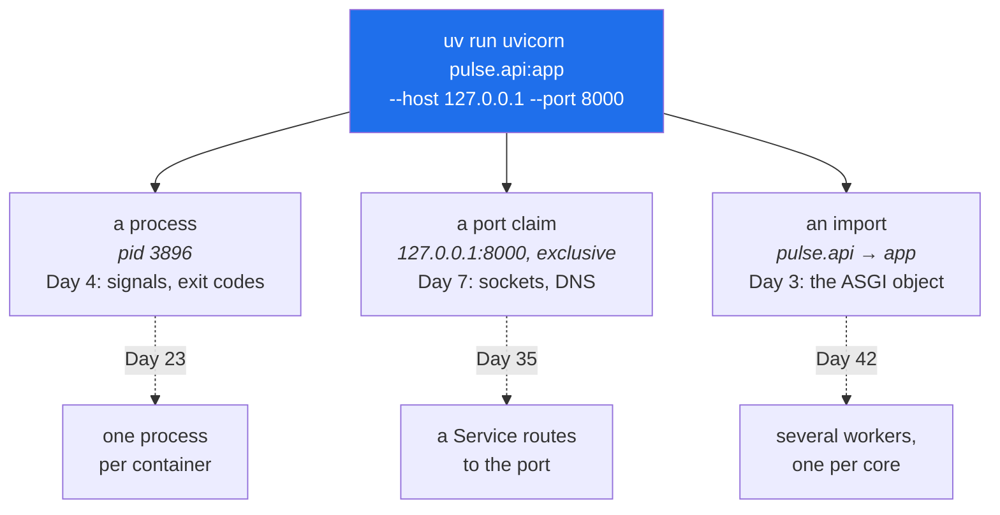

# 3.1 — The server, the port and the process

## One-line answer

`uvicorn pulse.api:app --host 127.0.0.1 --port 8000` starts **one operating-system process** that
claims **one port** and imports **one Python object**, and every part of that sentence is something you
will have to reason about separately for the next two hundred days.

---

## The story

🎬 **The scene.** A street market. To trade you need three separate things: a person, a pitch, and
something to sell. The market gives out pitches by number, one trader per pitch, first come first
served.

😬 **The naive fix.** A trader turns up, finds her usual spot already taken by somebody who arrived
earlier, and sets up next to them and sells anyway. Same goods, same customers, roughly the same place.

💥 **Why it fails.** Customers looking for pitch 14 find two stalls. Some buy from one and some from the
other. Deliveries meant for one arrive at the other. Nobody is doing anything wrong and the situation
is incoherent, and the incoherence is *intermittent*, because it depends on which stall a given
customer happens to walk up to.

💡 **The insight.** The pitch number is not a location. It is an **exclusive claim**. Its whole value is
that exactly one trader holds it, so that "go to pitch 14" identifies one thing. The moment two things
answer to one address, every question about that address has two answers and you cannot tell which one
you got.

---

## The idea in plain language

Three separate ideas hide inside one command, and separating them is the point of this part.

**The process.** An operating-system process is a running program with its own memory, its own process
identifier, and a parent. You start it, you can list it, you can signal it, and it can exit with a
status. Everything on Day 4, covering processes, signals and exit codes, is about this object, and
today is where you first hold one.

**The port.** A number from 0 to 65535 that a process **claims** on a network interface, so that
incoming packets addressed to it are delivered to that process. The claim is *exclusive*, normally
meaning one listener per interface and port. Day 7 is the full treatment, and today the only property
that matters is exclusivity, along with the surprising way Windows relaxes it.

**The application.** The Python object from
[2.1](../02-the-service/2.1-the-application-object-and-the-first-route.md), found by importing a module
and looking up a name. It has no idea a port exists.

The command names all three. `uvicorn` is the program that becomes the process, `--port 8000` is the
claim, and `pulse.api:app` is the module and attribute to import.

### `--host` is a security decision

`--host 127.0.0.1` binds to the **loopback interface**, which is the address a machine uses to talk to
itself. Nothing outside the machine can reach it, whatever the network allows.

`--host 0.0.0.0` binds to **every** interface, so anything that can route to your machine can reach the
service.

The default varies by tool and by version, and **the correct habit is to state it explicitly every
time**, because the two differ by six characters and by an entire security posture. On Day 23 the
container version needs `0.0.0.0`, because a container's loopback is not the host's, and that is a
decision you make with a network boundary in place rather than a default you inherit.

### One process, one core

A uvicorn process runs Python code on **one CPU core**. On the reference machine, which has four cores
(Addendum 02 §3.1), three quarters of the machine is idle while `pulse` is busy. That is correct today,
because one process is one thing to reason about, and it is wrong in production, where you run several
workers. Day 42 makes the decision properly, alongside requests and limits, and the note here exists so
that the number does not surprise you when you measure something.

---

## Why Kriya needs it

Day 4 is *"Linux for operators I: processes, signals, exit codes, and what 'the service died' really
means"*, and Day 26 is container restart policies.

Day 4 needs a process to look at, signal and kill, and this is it. When you send it `SIGTERM` and watch
it shut down cleanly, or fail to, you are exercising the *lifespan* half of the ASGI protocol from
[1.2](../01-what-we-are-building/1.2-what-an-http-framework-gives-you.md), which is what the `Waiting
for application shutdown` line in [3.2](3.2-reading-the-startup-output.md) is.

Day 26's restart policy is a rule about what to do when this process exits, and it cannot be reasoned
about without knowing that a process *has* an exit status and that the status means something, which is
why [5.1](../05-failure/5.1-the-four-errors-of-a-first-run.md) makes you read one.

---

## The mechanism

```bash
uv run uvicorn pulse.api:app --host 127.0.0.1 --port 8000
```

**Line by line:**

- `uv run` executes the command inside this project's environment, so `uvicorn` is the pinned `0.52.4`
  and it can import `pulse`. That is Day 0's rule that one tool owns the interpreter, in
  [1.4](../../../day-000-toolchain-skeleton-driver/parts/01-the-toolchain/1.4-the-venv-you-never-activate.md).
  A bare `uvicorn` may resolve to a different installation with no `pulse` on its path.
- `uvicorn` is the program. It becomes the process.
- `pulse.api:app` is **module, colon, attribute**. Uvicorn imports `pulse.api` and looks up `app`. Both
  halves fail differently and both messages name which half, which is
  [5.1](../05-failure/5.1-the-four-errors-of-a-first-run.md). It is a *string*, resolved at runtime,
  which is why a typo here is a startup error rather than something your editor catches.
- `--host 127.0.0.1` is the interface, stated explicitly, always, for the reason above.
- `--port 8000` is the claim. `8000` is conventional for a development HTTP service. Anything above
  1024 needs no special privilege and anything below 1024 does, which is a Day 28 subject, when the
  container runs as a non-root user.

Leave it running and use a second terminal. To see what you have from the outside:

```bash
netstat -ano | grep ":8000.*LISTENING"
```

**Line by line:**

- `netstat -ano` lists network connections. `-a` means all, `-n` means numeric, so it does not resolve
  names, which is much faster and avoids a DNS lookup confusing the output, and `-o` includes the
  owning process id.
- The `grep` narrows it to a listener on 8000. **`LISTENING` is the state that matters.** A line in
  `TIME_WAIT` is a closed connection lingering rather than a server, and confusing the two is a common
  first-week mistake.
- The last column is the process id, which is what connects the *port* idea to the *process* idea.
  **This is the command that answers "what is on my port?"**, and you will run it constantly.

Observed on **2026-08-24**:

```text
  TCP    127.0.0.1:8000         0.0.0.0:0              LISTENING       3896
```

**Read the columns.** `127.0.0.1:8000` is the local address, on loopback, so the bind worked as asked.
`0.0.0.0:0` is the remote address, which is meaningless for a listener. `LISTENING` is the state.
`3896` is the process id, and it is the handle you need in order to stop it.

```bash
taskkill //PID 3896 //F
netstat -ano | grep ":8000.*LISTENING" || echo "8000 free"
```

**Line by line:**

- `taskkill //PID 3896 //F` is the Windows way to end a process by id. **The doubled slashes are a Git
  Bash quirk.** Git Bash's MSYS layer rewrites arguments that look like Unix paths, so `/PID` would be
  mangled into a Windows path, and `//PID` is how you escape that. It bites in exactly one place per
  session and is worth knowing rather than rediscovering. On Linux the equivalent is `kill 3896`.
- `//F` forces it. Without it, `taskkill` asks the process to close politely, which is the right first
  attempt in production and is the difference between `SIGTERM` and `SIGKILL` on Day 4.
- The `netstat` check afterwards, **every time**. From
  [Day 2, part 2.3](../../../day-002-shape-of-production-system/parts/02-dependencies/2.3-the-dependency-that-fails-slowly.md):
  a `kill` that reports success is not proof the port is free. Verify.

For development there is one more flag.

```bash
uv run uvicorn pulse.api:app --host 127.0.0.1 --port 8000 --reload
```

**Line by line:** `--reload` watches the source files and restarts the process when one changes. It
solves the *"my edit is not taking effect"* confusion from
[2.3](../02-the-service/2.3-version-what-is-actually-running.md), because Python imports a module once
and a running process never sees your edit. **It is a development flag only.** It costs a file-watching
thread, it restarts on any change including a half-saved file, and it is not what you want supervising
a production process, where restarts are an orchestrator's job (Day 34).



---

## When it breaks

The port is the thing that breaks, and on this machine it breaks in a way that is worth meeting
deliberately.

**The expected failure, where the port is taken.** Start a second server on 8000 while the first is
running.

```text
INFO:     Started server process [16196]
INFO:     Waiting for application startup.
INFO:     Application startup complete.
ERROR:    [Errno 10048] error while attempting to bind on address ('127.0.0.1', 8000): [winerror 10048] only one usage of each socket address (protocol/network address/port) is normally permitted
INFO:     Waiting for application shutdown.
INFO:     Application shutdown complete.
```

**What it says:** something already holds that address.

**What it actually means:** exactly that, and **read the order of those lines, because it is
surprising**. `Application startup complete` is printed *before* the bind fails. The application was
imported and started successfully, and the *server* then failed to claim the port. Those are the two
programs from [1.2](../01-what-we-are-building/1.2-what-an-http-framework-gives-you.md), failing
independently, and a reader who skims to the first `INFO` line would conclude the service is running.

Here is the real exit status, checked with no pipe in the way.

```text
$ uv run uvicorn pulse.api:app --host 127.0.0.1 --port 8000 > /dev/null 2>&1; echo "real exit=$?"
real exit=3
```

**It is non-zero, which is what matters.** A supervisor, a container runtime or a CI step reads that
number rather than the message. Note the care taken to get it: piping the command through `tail`
earlier reported `exit=0`, because in a pipeline `$?` is the *last* command's status. That is the
`pipefail` lesson from Day 0, in
[4.2](../../../day-000-toolchain-skeleton-driver/parts/04-the-driver/4.2-set-euo-pipefail.md), met in
the wild.

**The unexpected failure, where the port is taken and nothing complains.** From
[Day 2, part 2.3](../../../day-002-shape-of-production-system/parts/02-dependencies/2.3-the-dependency-that-fails-slowly.md),
observed on this machine with Python's standard-library `HTTPServer`:

```text
$ netstat -ano | grep ":8777.*LISTENING"
  TCP    127.0.0.1:8777         0.0.0.0:0              LISTENING       17464
  TCP    127.0.0.1:8777         0.0.0.0:0              LISTENING       19356
```

**Two processes, one port, and no error.** Python's `HTTPServer` sets `allow_reuse_address`, and on
Windows that flag permits a second live socket rather than refusing, where Linux would refuse. Requests
go to whichever socket the operating system picks.

**What it actually means:** the market pitch from the story. Your edit "does not take effect" for half
your requests, a restart "does not help", and the behaviour is intermittent and depends on nothing you
can see. **This is one of the most disorienting failures in this whole phase**, and the only defence is
the habit: after every `kill`, run `netstat` and count the listeners.

Uvicorn does *not* set that flag, which is why the first failure above is a clean refusal, but the
standard-library servers from Day 2 do, and mixed experiments on one machine will meet it.

**The smallest fix** for either one is to find the process id with `netstat -ano`, kill it, and verify
with `netstat` again. **Never** by picking a different port and moving on, because that leaves an
orphan running and postpones the confusion to a worse moment.

---

## In production

**What a professional writes instead of the teaching version.** They do not run this command at all. In
production the process is started by something that supervises it, whether that is a container runtime,
a systemd unit or a Kubernetes kubelet, and that supervisor owns the restart policy, the port mapping
and the process's lifetime. The command survives, but its arguments come from configuration rather than
from a shell, and `--reload` is absent. The single most consequential change is **several workers**,
because one process uses one core. That is Day 42.

**What degrades at scale.** Port allocation stops being something a human chooses. On one machine you
pick 8000. On a cluster, a hundred instances of a dozen services cannot each pick a number, so the
platform allocates them and a Service abstracts the whole thing away (Day 35). What survives from today
is the *exclusivity* property, and the failure it produces at scale is not "port in use" but **port
exhaustion**, where a machine runs out of ephemeral client ports because connections are being opened
faster than they leave `TIME_WAIT`. Same resource, opposite end, and it shows up as a service that
cannot make outbound calls while looking completely healthy. That is Day 7.

**The failure that only shows with real traffic.** A process that binds the port and cannot serve. It
happens during a slow start, because uvicorn binds early, so the port is claimed and the connection
succeeds while the application is still loading. On Day 109 that is a model file taking tens of
seconds. A load balancer sees an open port and sends traffic, and the requests queue or fail. The port
being open is *not* evidence of readiness, which is why Kubernetes has a `startupProbe` separate from
liveness and readiness (Day 41), and it is the same distinction as
[2.2](../02-the-service/2.2-healthz-the-endpoint-that-must-not-lie.md)'s.

**The review comment a senior engineer leaves.** *"This start script binds `0.0.0.0` with no comment. In
the container that is right, and on a developer's laptop it means the whole office network can reach
their branch. Make it a variable with the safe default, and say in the Dockerfile why the container
overrides it."*

**The signal you would alert on.** Two, and neither of them is obvious from today's vantage point.
**Process restart count**, because a process that keeps restarting is `CrashLoopBackOff` (Day 40) and
each individual restart looks like a normal event, so only the *rate* reveals it. And **listener
presence**, because something should periodically confirm the port is actually accepting connections
from outside the machine, which is a synthetic check rather than a self-report and is the only signal
that survives the process lying about itself. Neither exists today, and both are on
[Day 2's blast-radius map](../../../day-002-shape-of-production-system/parts/04-blast-radius/4.2-drawing-the-blast-radius-map.md)
as *"a user tells us"*.

**Blast radius.** This is the first command in the curriculum that makes your machine listen for
network connections. The worst case is that, bound to `0.0.0.0`, `pulse` is reachable by anything on
your network, which today serves three harmless routes and tomorrow will not. Anybody who can route to
the machine on port 8000 can trigger it, unauthenticated, with no rate limit. What bounds it is the
explicit `--host 127.0.0.1`, the field length limits from
[2.4](../02-the-service/2.4-predict-the-contract-before-the-model.md), and a process you can kill in
one command. What does **not** bound it is that nothing limits the request rate and nothing
authenticates a caller. Both are real gaps and both are dated, on Days 37 and 217.

**Cost:** `0` model calls and `0` tokens. One process at roughly 60 MB resident on this machine, holding
one port, for as long as you leave it running. **This is the first day in the plan whose resident-memory
row is not zero**, and from here it never returns to zero.

**The interview question.** *"Walk me through what happens when you start your service."* It is a
gentle-sounding question with a lot of room in it, and the answer that lands separates the three
things: a process is created, it claims a port exclusively, and it imports and runs your application
object. Then it names a failure mode for each. Candidates who describe it as one event have not
debugged a start-up failure.

---

## Check yourself

```bash
netstat -ano | grep ":8000.*LISTENING" && curl -sS -o /dev/null -w '%{http_code}\n' http://127.0.0.1:8000/healthz
```

One listener, and it answers. If `netstat` prints two lines, stop and read the *When it breaks* section
again before you do anything else.

**Say out loud, without scrolling up:** *`Application startup complete` was printed and then the server
failed. Which of the two programs succeeded, and what does that tell you about where to look?*
