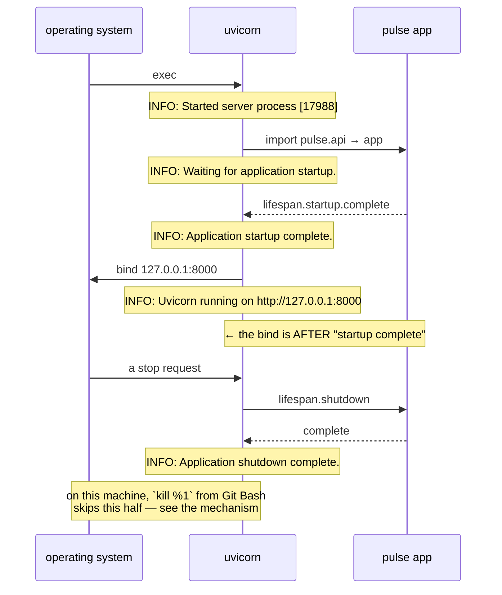

# 3.2 — Reading the startup output

## One-line answer

Five lines appear when `pulse` starts, and each one marks a distinct stage that can fail on its own.
Reading them in order is how you tell *which* stage failed, and it is the cheapest diagnostic skill in
operations.

---

## The story

🎬 **The scene.** Your internet is down and you are on the phone to the provider. The person on the
line does not ask "is it working?". She works through a list. Is the power light on? Is the second
light on? Is it flashing or solid? Can your phone see the network? Can you open a web page?

😬 **The naive fix.** Skip all that. You have already tried it, you have restarted the router twice,
and you would like her to just fix it.

💥 **Why it fails.** Without the list there is one piece of information, which is that it does not
work, and she has no idea whether the fault is in your flat, in the street or in your laptop. With the
list, the answer "the second light is flashing" tells her precisely which of the three it is, and she
stops asking. The list is not there to remind her what to do. It is there so that **the last confirmed
step names the problem**.

💡 **The insight.** A sequence of small confirmations is worth far more than a single verdict at the
end, and the reason is diagnosis rather than procedure. **"It did not start" is one bit of information.
"It got to step four and stopped" is an address.**

---

## The idea in plain language

Uvicorn prints a short, fixed sequence when it starts. It looks like noise and it is a checklist.

```text
INFO:     Started server process [17988]
INFO:     Waiting for application startup.
INFO:     Application startup complete.
INFO:     Uvicorn running on http://127.0.0.1:8000 (Press CTRL+C to quit)
```

That is four lines and four stages, in this order.

| Line | Stage | What has happened | What has **not** yet |
| --- | --- | --- | --- |
| `Started server process [17988]` | the process exists | uvicorn is running, and that is its process id | the app has not been imported |
| `Waiting for application startup.` | the lifespan handshake begins | the ASGI app was imported successfully | its startup hooks have not finished |
| `Application startup complete.` | the app is ready | any startup hooks ran without raising | **the port has not been claimed** |
| `Uvicorn running on http://…` | the port is claimed | it is listening and will accept connections | nothing has been requested yet |

**The third row is the one that catches people**, and it is exactly the surprise from
[3.1](3.1-the-server-the-port-and-the-process.md). The application reports itself started *before* the
server binds. So a run that prints three lines and then an error has a perfectly healthy application
and a server problem, and a run that fails at line two has the reverse. **The order of these lines is
the two-programs boundary from
[1.2](../01-what-we-are-building/1.2-what-an-http-framework-gives-you.md), made visible.**

### The lifespan protocol, briefly

Lines two and three are the ASGI **lifespan** events. The interface from
[1.2](../01-what-we-are-building/1.2-what-an-http-framework-gives-you.md) has a `scope["type"]` that
can be `"lifespan"` as well as `"http"`, and it is how a server tells an application *"we are
starting"* and *"we are stopping"*.

`pulse` registers no startup hooks today, so the handshake is instant. It will not stay that way.
Loading the model on Day 109 happens here, and it is the difference between a service that starts in a
moment and one that takes tens of seconds, which is exactly why Kubernetes has a separate
`startupProbe` on Day 41. **Today's instant startup is a number worth remembering**, because the day it
stops being instant you will want to know what it used to be.

### The access log

Once it is running, every request produces a line.

```text
INFO:     127.0.0.1:63433 - "GET /healthz HTTP/1.1" 200 OK
```

That is the client address and port, then the request line, then the status. This is an **access log**,
the oldest form of web-service observability, and it is worth registering both what it gives you and
what it does not.

It gives you which path, which method, which status, and from where. That is enough to answer *"is it
correct?"* crudely and *"is it up?"* completely.

It does not give you **how long the request took**. There is no duration in that line. So question
three from
[Day 1, part 1.3](../../../day-001-what-operations-actually-is/parts/01-what-ops-is/1.3-the-four-questions-an-operator-answers.md),
which is *is it fast enough?*, is unanswerable from this log, at all, ever. That gap is why Phase 7
exists, and noticing it now rather than being told about it later is the point of reading the output
carefully.

It also goes to **standard output, unstructured, and nothing collects it.** When the terminal closes,
it is gone. That is
[Day 2's](../../../day-002-shape-of-production-system/parts/04-blast-radius/4.2-drawing-the-blast-radius-map.md)
*"nobody notices"* row, honestly, until Day 67.

---

## Why Kriya needs it

Day 40 is *"The Kubernetes failure lab: ImagePullBackOff, Pending, CrashLoopBackOff, Evicted"*, and Day
67 is structured logging.

On Day 40 the only window into a crashing container is `kubectl logs`, and what it shows is exactly
this output. A pod that crashes after printing two lines has a different problem from one that crashes
after four, and being able to say which without thinking about it is what makes that day tractable
rather than exhausting.

Day 67 replaces these lines with structured JSON carrying a request id, a duration and a level, because
the failure named above, meaning no duration, no collection and no structure, is not fixable by reading
harder.

---

## The mechanism

Start it in the background, capture the output, and read it.

```bash
uv run uvicorn pulse.api:app --host 127.0.0.1 --port 8000 > server.log 2>&1 &
curl -sS -o /dev/null http://127.0.0.1:8000/healthz
curl -sS -o /dev/null http://127.0.0.1:8000/version
curl -sS -o /dev/null http://127.0.0.1:8000/nope
cat server.log
```

**Line by line:**

- `> server.log 2>&1` sends standard output **and** standard error to the file. `2>&1` has to come
  after the redirect, and the reason is worth knowing: redirections are applied left to right, so
  `2>&1` means *"make stream 2 go wherever stream 1 currently goes"*. Reversed, it would point standard
  error at the terminal and then move standard output to the file.
- **You need both streams here, and the reason is a genuine surprise.** Separating them on this machine
  on 2026-08-24 showed that uvicorn's **startup lines go to standard error** and its **access-log lines
  go to standard output**, which is two different streams for two kinds of message from one program.
  Capture only one and you get either a log with no requests in it or a log with no startup in it, and
  in both cases you will conclude that something is broken which is not.
- `&` backgrounds it. There is a race here, because the server may not be listening when the next line
  runs, which is
  [Day 2, part 1.1](../../../day-002-shape-of-production-system/parts/01-the-request-path/1.1-a-request-is-a-path-not-a-function-call.md),
  and if the first `curl` is refused, run it again.
- Three requests, deliberately including one that fails, because a log with only successes teaches you
  the shape of success.
- `cat server.log` reads it, which is the whole point.

Observed on **2026-08-24**:

```text
INFO:     Started server process [17988]
INFO:     Waiting for application startup.
INFO:     Application startup complete.
INFO:     Uvicorn running on http://127.0.0.1:8000 (Press CTRL+C to quit)
INFO:     127.0.0.1:63433 - "GET /healthz HTTP/1.1" 200 OK
INFO:     127.0.0.1:63434 - "GET /version HTTP/1.1" 200 OK
INFO:     127.0.0.1:63435 - "GET /nope HTTP/1.1" 404 Not Found
```

**Read the client ports: 63433, 63434, 63435.** Three different numbers for three requests from the
same machine, and they are consecutive because the requests were consecutive. Those are **ephemeral
ports**, which the operating system picks one of per outgoing connection, and they are the finite
resource mentioned in
[Day 2, part 1.1](../../../day-002-shape-of-production-system/parts/01-the-request-path/1.1-a-request-is-a-path-not-a-function-call.md).
Noticing that they climb is the first hint of a real production failure mode: a service making many
short-lived outbound connections exhausts them and cannot connect to anything, while looking perfectly
healthy. That is Day 7.

**Read the last line as a diagnosis.** `GET /nope` gave a `404`. That is not a crash and not an error
in your code. It is a request for a path that does not exist. The access log turned "it does not work"
into "you asked for a path that is not there" in one line, which is what an access log is *for*.

Now stop it, and read what you get, which on this machine is **nothing**, and that is the finding.

```bash
kill %1
tail -3 server.log
```

**Line by line:** `kill %1` addresses the most recent background job. On Linux that sends `SIGTERM`,
which is a *request* to stop, and uvicorn catches it, runs the ASGI shutdown handshake, and prints two
more lines. `tail -3` reads the end of the log.

Observed on **2026-08-24**: the process ended and **no shutdown lines were written at all.** The log
still ends at the `404`.

**What that means, honestly:** Git Bash's `kill` against a native Windows process does not deliver a
catchable signal the way it would on Linux, because the process is terminated rather than asked to
stop. So **the graceful-shutdown path is not being exercised on this machine by this command**, and you
should not conclude from a clean-looking log that your service shuts down cleanly.

The shutdown lines are real and uvicorn does print them. You can see them in the failed-bind output in
*When it breaks* below, where uvicorn shuts *itself* down.

```text
INFO:     Waiting for application shutdown.
INFO:     Application shutdown complete.
```

**Why this matters beyond a shell quirk.** On Day 43 a rolling deploy sends `SIGTERM` and expects the
process to finish in-flight requests before exiting, and a service that never runs that path drops
requests on every deploy. Day 4 is where you produce a real signal and watch the handshake happen, and
the honest position today is that you have seen the lines uvicorn prints when it stops itself and you
have *not* yet verified what your service does when something else asks it to stop. **Write that down
as a gap rather than assuming it works.**



---

## When it breaks

The value of the sequence is that a failure tells you where it stopped. Here are three failures, at
three different lines, all observed on **2026-08-24**.

**Stopped before line one, where the application could not be imported.**

```text
ERROR:    Error loading ASGI app. Could not import module "pulse.app".
```

**What it says:** the module named on the command line does not exist.

**What it actually means:** uvicorn never got as far as starting a server process. **No `INFO` line was
printed at all**, which is itself the diagnosis. The failure is in the argument or in the code rather
than in the network.

**Stopped at line two, where the application imported and its startup raised.** Today `pulse` has no
startup hook so this cannot happen, and from Day 9 it can. The shape is this.

```text
INFO:     Started server process [16196]
INFO:     Waiting for application startup.
ERROR:    Traceback (most recent call last):
  ...
RuntimeError: missing required environment variable: PULSE_DATABASE_URL
ERROR:    Application startup failed. Exiting.
```

**What it says:** startup failed.

**What it actually means:** line one printed and line three did not, so the process exists and the
application refused. **That is the good failure Day 9 builds deliberately**, which is to refuse at
startup rather than on the first request that needs the value.

**Stopped at line four, where the application is fine and the port is not.**

```text
INFO:     Started server process [16196]
INFO:     Waiting for application startup.
INFO:     Application startup complete.
ERROR:    [Errno 10048] error while attempting to bind on address ('127.0.0.1', 8000): [winerror 10048] only one usage of each socket address (protocol/network address/port) is normally permitted
INFO:     Waiting for application shutdown.
INFO:     Application shutdown complete.
```

**What it says:** the address is in use.

**What it actually means:** three `INFO` lines succeeded, so your code is fine. **A reader who stops at
`Application startup complete` concludes the service is running**, and that is precisely the mistake
this part exists to prevent, because the reassuring line comes *before* the failing one.

**The smallest fix** in each case: check the `module:attribute` argument, supply the missing
environment variable, or find and kill the process holding the port
([3.1](3.1-the-server-the-port-and-the-process.md)). **The diagnostic move that gets you there in
seconds is counting how many `INFO` lines you got.**

---

## In production

**What a professional writes instead of the teaching version.** They stop reading logs with their eyes
and make them **structured**, meaning one JSON object per line, with a level, a timestamp, a request id
and a duration. The reason is not tidiness. An unstructured line cannot be filtered, aggregated or
joined, so *"how many 404s on /predict in the last hour, by client"* is a text-processing exercise
instead of a query. Day 67 does this, and the single most important field it adds is the one missing
from today's access log, which is **how long the request took**.

**What degrades at scale.** Volume, immediately and expensively. One line per request at a thousand
requests per second is 86 million lines a day, and log storage costs real money and real disk. The
professional decisions are *sampling*, meaning keep all errors and a fraction of successes, *levels*,
meaning do not log at `INFO` per request in production, and *retention*, which is Day 68. The mistake
that costs the most is logging at high volume with no plan, filling a disk, and taking the service down
with the very thing that was supposed to help you understand it, which is the `disk full` row on
[Day 2's blast-radius map](../../../day-002-shape-of-production-system/parts/04-blast-radius/4.2-drawing-the-blast-radius-map.md).

**The failure that only shows with real traffic.** Logging on the request path, synchronously, to
something slow. If writing a log line blocks, whether because of a full disk, a slow network collector
or a lock, then every request waits for it, and you have made your observability a hard dependency of
your availability. It is the same failure as
[Day 2, part 2.3](../../../day-002-shape-of-production-system/parts/02-dependencies/2.3-the-dependency-that-fails-slowly.md)
with logging as the slow dependency, and it is the reason the `OTEL` row on the blast-radius map says
*"drop spans, keep serving, count the drops"*.

**The review comment a senior engineer leaves.** *"This logs the full request body at INFO. That is a
privacy problem the first time somebody pastes a password into a ticket, and it is a disk problem the
first time we get real traffic. Log the ticket id and the length, not the content."*

**The signal you would alert on.** From an access log, exactly one thing is worth paging on: **the rate
of `5xx` responses as a proportion of all responses**. Not the count, but a proportion, because ten
errors a second is fine at a million requests and an outage at twenty. And there are two things
explicitly *not* to alert on. `4xx` is clients being wrong, and a steady rate of it is normal, as
[2.4](../02-the-service/2.4-predict-the-contract-before-the-model.md) explained. Individual log lines
are not incidents either, and alerting on one is how alert fatigue begins. The genuinely useful absence
alert is **no access-log lines at all for a period when there should be traffic**, which catches the
case where the service is up and unreachable.

**Blast radius.** Reading logs changes nothing. The two hazards are real anyway. **Redirection**,
because `> server.log` truncates, and pointing it at a file you care about destroys that file. And
**content**, because from the moment `pulse` logs anything derived from a request, the log is a place
personal data can end up. Any caller can trigger the second, by putting something sensitive in a
ticket. What bounds it today is that `pulse` logs nothing of its own and uvicorn's access log records
only the path and status, never the body. **That is an accident of the default rather than a
decision**, and it becomes a decision on Day 67.

**Cost:** `0` model calls and `0` tokens. On disk it is a few bytes per request, unbounded and
uncollected today, which is fine at this scale and is the thing Day 68 puts a bound on.

**The interview question.** *"A service will not start. How do you approach it?"* The answer that lands
is this part: read the startup output and find out how far it got, because each line is a stage that
can fail independently. Then name the specific trap, which is that the "startup complete" line comes
before the port bind, so a service can report itself started and then fail. Candidates who answer
"check the logs" without saying *what they are reading them for* have not done this under pressure.

---

## Check yourself

```bash
grep -c '^INFO' server.log && grep '404' server.log
```

Count the startup confirmations, and then find the request that failed. Two questions, *how far did it
get* and *what went wrong afterwards*, answered from one file.

**Say out loud, without scrolling up:** *name the four startup lines in order, and say which of the two
programs from part 1.2 owns each one.*
