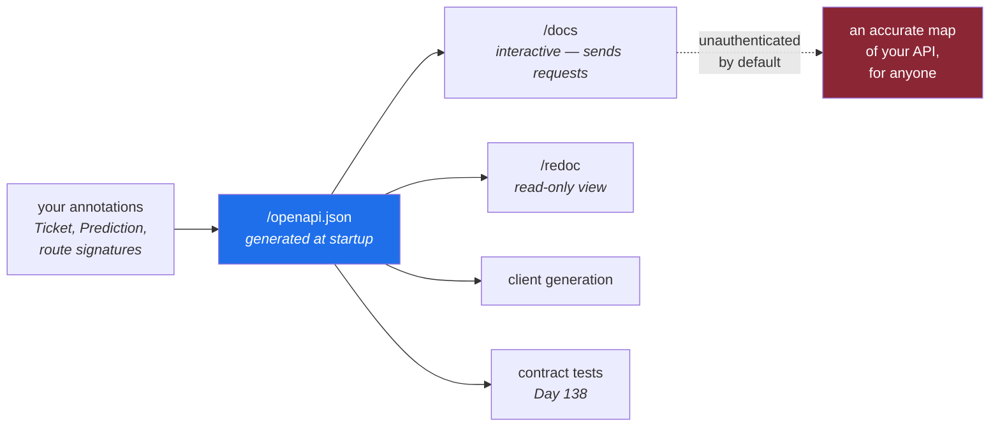

# 3.3 — The interactive docs, and why you will turn them off

## One-line answer

FastAPI publishes a machine-readable description of your API and two human pages onto it, for free and
by default — and "by default" is the part worth thinking about, because a default is a decision
somebody else made about what your service exposes.

---

## The story

🎬 **The scene.** A new office building. The lifts have a control panel behind a small unlocked door for
engineers: floor overrides, door timings, a test mode.

😬 **The naive fix.** Leave it. It came like that from the manufacturer, engineers need it, and it is
just a panel — you have to know what the buttons do.

💥 **Why it fails.** Not on day one. Eighteen months later somebody bored discovers it, and the lifts
spend an afternoon stopping at floors nobody selected. Nothing was hacked. **A capability intended for
one audience was reachable by another**, because nobody decided who the panel was for — the
manufacturer decided, in a factory, for a generic building.

💡 **The insight.** The panel is genuinely useful and should exist. What was missing is not a lock; it
is a **decision**, made by somebody who knows this building, about who can reach it. Defaults are
decisions taken by people who have never seen your situation, and the cost of leaving them is invisible
until it is not.

---

## The idea in plain language

Printing `pulse`'s routing table
([2.1](../02-the-service/2.1-the-application-object-and-the-first-route.md)) showed seven routes for
three you wrote:

```text
['/openapi.json', '/docs', '/docs/oauth2-redirect', '/redoc', '/healthz', '/version', '/predict']
```

Four are FastAPI's, and they are one thing plus three views of it.

**`/openapi.json`** is the artifact. **OpenAPI** is a specification for describing an HTTP API in a
machine-readable way: every path, every method, every parameter, every response shape. FastAPI
generates it from your function signatures and pydantic models — the same annotations that drive
validation ([2.4](../02-the-service/2.4-predict-the-contract-before-the-model.md)) — so it cannot drift
from the code the way a hand-written document does. **That is a genuinely rare property** and it is
worth appreciating: it is the [Day 2, part 4.3](../../../day-002-shape-of-production-system/parts/04-blast-radius/4.3-the-map-is-wrong.md)
drift problem, solved by generation rather than by checking.

**`/docs`** and **`/redoc`** are two browser interfaces rendered from it. `/docs` lets you *send*
requests from the page, which is why it is called interactive. `/docs/oauth2-redirect` supports
authentication flows `pulse` does not have.

### What the document is actually good for

Not the pretty page. Three things, and none of them require a human:

**Generating clients.** Given the document, tooling can produce a typed client in most languages, so a
caller does not hand-write request construction and cannot get a field name wrong.

**Contract testing.** You can assert that today's document is compatible with yesterday's — that no
field was removed, no required field added — and fail the build if not. That is Day 138's subject for
prompt and retrieval schemas, and it is the mechanical answer to
[2.4](../02-the-service/2.4-predict-the-contract-before-the-model.md)'s *"the contract outlives the
implementation"*.

**Telling you what you actually published.** Which is the operational use, and the one people skip.

### Why you will turn the pages off

Three reasons, in increasing order of seriousness.

**They describe your attack surface, accurately and helpfully.** Every path, every field, every
constraint, every error shape. That is a gift to anyone probing your service, and it is a much better
map than they could build by guessing. This is *reconnaissance*, not a vulnerability — but a system
that hands out an accurate map is measurably easier to attack than one that does not.

**They are unauthenticated by default.** Nothing in the default configuration limits who can read them.
Combined with [2.3](../02-the-service/2.3-version-what-is-actually-running.md)'s `/version`, an
unauthenticated caller can learn what you run, which version, and every operation it supports.

**`/docs` can send requests.** It is not a viewer, it is a client. On a service with a write path
reachable from a browser, that is a control panel with the door left open.

**The nuance that matters:** the right answer is rarely *"delete them"*. They are genuinely useful and
turning them off entirely is a real cost. The usual production answer is: keep them in development,
disable them in production **or** put them behind authentication, and *decide* rather than inherit.
`pulse` makes that decision on Day 9, when configuration comes from the environment and the switch can
depend on it.

---

## Why Kriya needs it

Day 217 is *"API security — authentication, authorisation and the endpoints you did not mean to
publish"*, and Day 9 is configuration from the environment.

Day 9 is the mechanism: `docs_url=None if ENV == "production" else "/docs"` needs an `ENV`, and there
is no configuration today. That is why this part explains the decision and defers the switch — a
deferred explanation with an address, which is the rule in plan §17.4.

Day 138 is the other half: the OpenAPI document becomes an artifact you diff between builds, so a
breaking change to the contract fails the pipeline instead of failing a client.

---

## The mechanism

Look at the document, not the page. It is JSON, and reading it is more informative than clicking
through the interface.

```bash
curl -sS http://127.0.0.1:8000/openapi.json | python -c "
import sys, json
d = json.load(sys.stdin)
print('openapi', d['openapi'])
print('paths  ', list(d['paths']))
print('schemas', list(d['components']['schemas']))"
```

**Line by line:**

- `curl -sS` fetches it; the document is generated once at startup and served from memory, so this
  costs nothing.
- Piping into `python -c` rather than reading raw JSON, because the raw document is a few thousand
  characters and the three interesting facts are buried. **Extract, then read** — the same instinct as
  `git diff --stat` before `git diff`.
- `d['openapi']` is the **specification version**, which is not your API's version. Two different
  numbers in one document that both look like versions is a classic confusion.
- `d['paths']` lists what you published. **This is the operational question** — not "what did I write?"
  but "what is reachable?", and they differ more often than you would like.
- `d['components']['schemas']` lists the object shapes. Note it will contain shapes you did not define.

Observed on **2026-08-24**:

```text
openapi 3.1.0
paths   ['/healthz', '/version', '/predict']
schemas ['HTTPValidationError', 'Prediction', 'Ticket', 'ValidationError']
```

**Three observations, and the third is the interesting one.**

`3.1.0` is the OpenAPI specification version FastAPI targets. Your service is `0.1.0`. Unrelated
numbers.

The three paths are the three you wrote. `/docs` and `/openapi.json` are **not** in the document,
because the document describes your API rather than the tooling around it — so *reading the OpenAPI
document does not tell you the docs pages exist.* That is a small, real lesson about inventories: a
description generated by a system usually omits the system itself.

**Four schemas for two models.** You defined `Ticket` and `Prediction`. `ValidationError` and
`HTTPValidationError` were added by FastAPI, and they are the shape of the `422` bodies from
[2.4](../02-the-service/2.4-predict-the-contract-before-the-model.md) — `type`, `loc`, `msg`. **Your
error format is part of your published contract**, whether you wrote it or not, and clients will depend
on it.

Now confirm the pages are reachable:

```bash
curl -sS -o /dev/null -w 'docs %{http_code}\n' 'http://127.0.0.1:8000/docs'
curl -sS -o /dev/null -w 'redoc %{http_code}\n' 'http://127.0.0.1:8000/redoc'
```

**Line by line:**

- `-o /dev/null` throws away the HTML — you want the status, not the page.
- `-w 'docs %{http_code}\n'` prints just the code, with a label so two runs are distinguishable.
- **The URLs are in single quotes, and here is why.** Written unquoted with a `%{...}` template
  containing a leading-slash path, Git Bash's MSYS layer rewrote `/docs` inside the format string into
  a Windows path and printed `C:/Program Files/Git/docs -> 200`. **A real, observed, deeply confusing
  output** — the status code was correct and the label was mangled by the shell. Quoting removes it.
  This is the same class of quirk as the doubled slashes in `taskkill //PID`
  ([3.1](3.1-the-server-the-port-and-the-process.md)).

```text
docs 200
redoc 200
```

Both reachable, unauthenticated, from anything that can reach the port.



---

## When it breaks

Two failures. The first is the one people notice; the second is the one that matters.

**The document that is wrong because the annotation was.** If a route returns something its annotation
does not describe, the published contract is a lie — and FastAPI turns that into a runtime error rather
than letting it through:

```text
fastapi.exceptions.ResponseValidationError: 2 validation errors:
  {'type': 'missing', 'loc': ('response', 'queue'), 'msg': 'Field required', 'input': {'priority': 'unknown'}}
  {'type': 'missing', 'loc': ('response', 'model_version'), 'msg': 'Field required', 'input': {'priority': 'unknown'}}
```

**What it says:** the response did not match `Prediction`.
**What it actually means:** the annotation is not decoration — it is enforced in both directions.
Returning the wrong shape is a `500`, which is correct: **the client did nothing wrong, so this is not
a `422`.** It is your bug and the status code says so. [4.2](../04-testing-it/4.2-making-the-test-go-red.md)
produces this deliberately.

**The endpoint nobody meant to publish.** This one has no error message at all, which is why it is
worse:

```text
$ curl -sS http://pulse.example/openapi.json | python -c "import sys,json; print(list(json.load(sys.stdin)['paths']))"
['/healthz', '/version', '/predict', '/admin/reload-model', '/debug/config']
```

**What it says:** five paths.
**What it actually means:** somebody added two routes for their own convenience — one that reloads the
model, one that dumps the configuration — and **the documentation generator published both, accurately,
to anyone who asks.** Nothing failed. No warning was printed. The routes work exactly as intended, for
an audience nobody intended.

`/debug/config` is the worse of the two: configuration frequently contains connection strings and
provider keys, which is why Day 9 puts secrets in the environment and Day 17 scans for them.
`/admin/reload-model` is a **write path**, unauthenticated, and by
[Day 2, part 4.1](../../../day-002-shape-of-production-system/parts/04-blast-radius/4.1-what-a-blast-radius-is.md)'s
three questions: the worst thing it can do is swap the model, anyone who can reach the port can trigger
it, and nothing bounds it.

**The smallest fix** is not to delete the routes — they are useful. It is to make *"what is reachable?"*
a question somebody asks, which is exactly the `curl … /openapi.json` command above. **Run it against
your own service and read the list.** Almost everyone who does this for the first time finds something.

---

## In production

**What a professional writes instead of the teaching version.** They make the docs conditional on
environment and treat the OpenAPI document as a **build artifact**: generated in CI, committed or
published, and diffed against the previous release so a breaking change is a failing build rather than
a broken client. The shape, once Day 9 supplies configuration:

- `docs_url` and `redoc_url` set to `None` outside development, or served behind authentication;
- `/openapi.json` generated at build time and checked into the artifact, so consumers can read it
  without reaching your service at all.

The second point is the one people miss: **the document's most valuable audience is other teams'
build systems**, and they should not have to call your production service to get it.

**What degrades at scale.** Document size and generation cost. With three routes it is a few kilobytes,
generated once. With three hundred it is megabytes, and the interactive page becomes slow enough that
nobody uses it — at which point you have paid for a feature nobody consumes. The scaled answer is
tagging (grouping routes so the page is navigable) and, past a certain size, a static published portal
rather than a live endpoint.

**The failure that only shows with real traffic.** A schema change that is technically compatible and
practically breaking. You add a field: compatible. You make an optional field required: breaking, and
every client that omitted it starts getting `422` — with no error on your side, because refusing is
what you asked for. Your error rate stays clean, your `4xx` rate rises, and the people affected are the
ones who cannot see your dashboard. **This is why the `422` rate by route is worth alerting on**
([2.4](../02-the-service/2.4-predict-the-contract-before-the-model.md)) and why the contract diff on
Day 138 is a gate rather than a report.

**The review comment a senior engineer leaves.** *"This adds `/admin/reload-model`. It is
unauthenticated, it changes what the service serves, and it will appear in `/openapi.json` for anyone
who asks. Put it behind auth, or on a separate internal-only port, and add `include_in_schema=False`
so we are not advertising it."*

**The signal you would alert on.** Nothing from the docs endpoints directly — and it is worth being
explicit that a spike in traffic to `/docs` or `/openapi.json` from outside is *not* worth a page,
because it is indistinguishable from a developer being curious and will produce false alarms. The
alertable version arrives later and is much better: **the published contract changed** — a CI check
comparing this build's OpenAPI document against the last release, failing on a removed field or a
newly-required one. A gate at build time, not a page at 3am, because that is when the change is
cheap to reverse.

**Blast radius.** Today these routes are enabled and unauthenticated, bound to loopback. Worst case
once the bind is not loopback: an accurate, structured description of every endpoint, field and
constraint, plus an in-browser client able to invoke them — handed to anyone who can reach the port.
Who can trigger it: anyone, with a browser, no credentials. What bounds it **today**: the loopback bind
and the fact that `pulse` has no write path and no secrets. What bounds it **from Day 9**: a
configuration switch that disables the pages outside development. **Both halves of that sentence are
part of the answer** — naming the date the real bound arrives is what stops "we'll deal with it later"
from being a wish.

**Cost:** `0` model calls, `0` tokens. The document is generated once at startup and cached; the pages
are static assets served from the package. Negligible memory, and it grows with the number of routes.

**The interview question.** *"What's exposed on your service that you didn't write?"* It is a good
question because most people have never checked. The strong answer names the auto-generated
endpoints — docs, schema, metrics, health, profiling — says which are enabled in production and why,
and admits that the way to find out is to ask the running service rather than to read the code, because
the code does not list what the framework added.

---

## Check yourself

```bash
curl -sS http://127.0.0.1:8000/openapi.json | python -c "import sys,json; print(list(json.load(sys.stdin)['paths']))"
```

The list of everything you have published. Compare it with the three routes you meant to write, and
remember that `/docs` and `/openapi.json` themselves are reachable and **not** in this list.

**Say out loud, without scrolling up:** *the OpenAPI document lists three paths and your service serves
seven. Name the four missing ones and say why a generated inventory omits them.*
