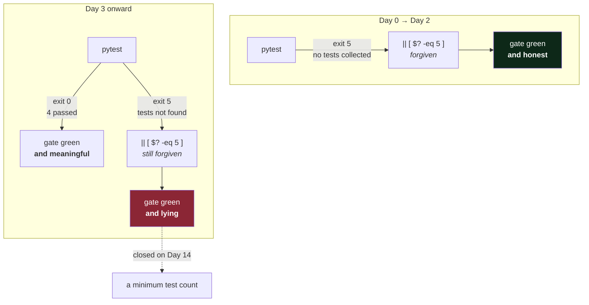

# 4.1 — The first real test, and the end of the exit-5 exemption

## One-line answer

Four tests, no server, no port — and the gate's three-day-old exemption for *"no tests collected"*
quietly stops being a fair description and becomes a place a regression could hide.

---

## The story

🎬 **The scene.** A shop with an alarm system installed but not yet armed, because the fitters are
still coming and going. The panel shows a green light meaning *"no faults"*.

😬 **The naive fix.** The fitters finish. Nobody arms it. The green light is still there and still
means what it always meant.

💥 **Why it fails.** Six weeks later there is a break-in and no alarm. The panel was truthful the whole
time — *no faults* was correct, because a system that is not armed cannot have a fault. The green light
never changed, and everybody had learned to read it as "we are protected".

💡 **The insight.** There was a moment when the meaning of the green light changed: the day the fitters
left. Before it, "not armed" was accurate. After it, the same display meant something completely
different and looked identical. **The dangerous transition is not a light going out — it is a light
that stays on while the thing behind it changes.**

---

## The idea in plain language

Since Day 0, `./o check` has run this:

```text
uv run python -m pytest -q -m "not live and not cluster" || [ $? -eq 5 ]
```

`pytest` exits with status `5` when it collects no tests, and `|| [ $? -eq 5 ]` forgives that. On Day 0
this was correct: there were no tests, and an empty suite is not a failure when nothing exists to test.

`docs/INCIDENTS.md` row 4 recorded, on Day 0, both the discovery and its expiry date:

> *"**The first time the test step had ever run a test.** Every prior green came from pytest exiting
> `5` … noted that the exemption expires on Day 3, when real tests exist and an empty suite would
> become a silent regression."*

**Today is Day 3.** From the moment `tests/test_api.py` exists, "no tests collected" stops meaning
*"there is nothing to test"* and starts meaning *"the tests did not run"* — a broken import, a renamed
directory, a misconfigured path. Same exit code, same forgiving `||`, same green gate, completely
different world. That is the alarm panel.

### Testing an API without a server

The obvious way to test an HTTP service is to start it and make requests. It works, and it is the wrong
default: you need a free port, you have to wait for startup
([Day 2, part 1.1](../../../day-002-shape-of-production-system/parts/01-the-request-path/1.1-a-request-is-a-path-not-a-function-call.md)'s
race), you have to clean up, and on this machine a leftover process may silently keep the port
([3.1](../03-running-it/3.1-the-server-the-port-and-the-process.md)).

`TestClient` avoids all of it. It takes the ASGI application object directly and calls it **in
process** — same routing, same validation, same serialisation, no socket. It works because of
[1.2](../01-what-we-are-building/1.2-what-an-http-framework-gives-you.md)'s boundary: the application
is a callable, and a test can be the thing that calls it.

What it therefore does **not** test: the server, the port, the network, TLS, the process, timeouts.
Those are real and they are somebody else's tests — Day 14 for the pipeline, Day 26 for the container
health check, Day 39 for the deploy. **Knowing what a test does not cover is what stops a green suite
being mistaken for a working system.**

### What to assert on

Four tests, one per property of the contract from
[2.4](../02-the-service/2.4-predict-the-contract-before-the-model.md):

| Test | Property | Why it is worth a test |
| --- | --- | --- |
| `/healthz` returns `200` and exactly `{"status": "ok"}` | the health contract | something will poll it and act on it (Day 41) |
| `/version` reports `__version__` | one definition, several readers | catches the drift from [2.3](../02-the-service/2.3-version-what-is-actually-running.md) |
| `/predict` returns the three agreed keys | the response contract | Day 111's canary depends on `model_version` |
| `/predict` refuses a ticket with no body | **the failure contract** | the path that is never exercised by hand |

The fourth is the one beginners skip and it is the most valuable. **The happy path gets tested by every
manual `curl` you ever run; the refusal path gets tested by nobody**, and it is the one that changes
silently when a field's constraints are edited.

---

## Why Kriya needs it

Day 14 is *"Quality gates — lint, format, types, tests, and a gate that refuses rather than warns"*,
and Day 13 puts `./o check` in a pipeline.

From Day 13 this suite runs on every push, without being asked, which is what turns it from a *does it
work?* answer into an *is it working?* answer
([Day 1, part 1.2](../../../day-001-what-operations-actually-is/parts/01-what-ops-is/1.2-does-it-work-versus-is-it-working.md)).
Day 14 is where the exit-5 exemption is finally removed and replaced with a minimum, because by then
"the tests did not run" is the only thing that status can mean.

Longer term: Day 147 builds an **evalset** for the assistant — a test suite whose assertions are
statistical rather than exact. It is the same machinery, `pytest`, with a different notion of passing,
and it is much easier to reason about once you have watched an ordinary suite go red for a real reason.

---

## The mechanism

One file, four tests.

```python
# tests/test_api.py — the first real tests in this repository. Day 3.
from fastapi.testclient import TestClient

from pulse import __version__
from pulse.api import app

client = TestClient(app)


def test_healthz_answers_200_and_says_nothing_else() -> None:
    response = client.get("/healthz")
    assert response.status_code == 200
    assert response.json() == {"status": "ok"}


def test_version_reports_the_running_version() -> None:
    body = client.get("/version").json()
    assert body["version"] == __version__


def test_predict_returns_the_agreed_shape() -> None:
    response = client.post("/predict", json={"subject": "s", "body": "b"})
    assert response.status_code == 200
    assert set(response.json()) == {"priority", "queue", "model_version"}


def test_predict_refuses_a_ticket_with_no_body() -> None:
    response = client.post("/predict", json={"subject": "s"})
    assert response.status_code == 422
    assert response.json()["detail"][0]["loc"] == ["body", "body"]
```

**Line by line:**

- `from fastapi.testclient import TestClient` — re-exported by FastAPI, and it actually lives in
  `starlette`, which is why the deprecation warning in
  [1.3](../01-what-we-are-building/1.3-choosing-the-pieces-and-pinning-them.md) came from
  `starlette.testclient`. **A traceback naming a package you did not install is your dependency tree**,
  not a mystery.
- `client = TestClient(app)` at module level, so it is created once. It wraps the ASGI object and gives
  it a requests-style interface. **No server starts. No port is claimed.**
- Test names that are sentences. `test_predict_refuses_a_ticket_with_no_body` is what appears in the
  failure output, so the name is the first line of the diagnosis. `test_predict_2` is a name that makes
  you open the file.
- `-> None` on each test — the repository's house rule that public functions carry type hints. It costs
  nothing and keeps one rule rather than two.
- `assert response.status_code == 200` **before** asserting on the body. If the status is wrong the
  body is probably an error object, and asserting on it first produces a `KeyError` that hides the
  actual problem. **Assert outside-in.**
- `assert response.json() == {"status": "ok"}` — the *whole* body, not just the `status` key. For a
  health endpoint that is deliberate: [2.2](../02-the-service/2.2-healthz-the-endpoint-that-must-not-lie.md)'s
  entire argument is about what it must **not** contain, and an equality assertion is what fails when
  somebody helpfully adds a database check.
- `assert body["version"] == __version__` — comparing the served value against the imported one, not
  against the literal `"0.1.0"`. A literal would have to be edited on every version bump, and a test
  you edit routinely is a test you eventually edit wrongly.
- `set(response.json()) == {...}` — `set()` of a dictionary gives its keys. This asserts the **shape**
  and deliberately not the values, because the values are a stub that changes on Day 109 and the shape
  is the contract that must not.
- `response.json()["detail"][0]["loc"] == ["body", "body"]` — asserting on the *machine-readable* part
  of the error, the `loc` path from
  [2.4](../02-the-service/2.4-predict-the-contract-before-the-model.md). Not on `msg`, which is prose
  and changes between library versions. **A test that asserts on prose breaks on upgrades for no
  reason**, and a suite that breaks for no reason gets ignored.

Run it:

```bash
uv run python -m pytest -q
```

**Line by line:** `python -m pytest` rather than a bare `pytest`, so the current directory is on the
import path and `from pulse.api import app` resolves — this is exactly what `./o check` runs. `-q` is
quiet, set as a default in `pyproject.toml`'s `addopts` on Day 0.

Observed on **2026-08-24**, and the first run had something in it worth reading:

```text
....                                                                     [100%]
============================== warnings summary ===============================
.venv\Lib\site-packages\fastapi\testclient.py:1
  ...\fastapi\testclient.py:1: StarletteDeprecationWarning: Using `httpx` with
  `starlette.testclient` is deprecated; install `httpx2` instead.
    from starlette.testclient import TestClient as TestClient  # noqa

-- Docs: https://docs.pytest.org/en/stable/how-to/capture-warnings.html
4 passed, 1 warning in 0.48s
```

**Four passed, one warning** — and the warning is the whole reason
[1.3](../01-what-we-are-building/1.3-choosing-the-pieces-and-pinning-them.md) pins `httpx2` rather than
`httpx`. After that pin:

```text
....                                                                     [100%]
4 passed in 0.45s
```

And now the thing that has actually changed about the repository — the gate:

```bash
./o check
```

**Line by line:** the same five checks as Day 0. What is different is that the third one now runs
tests instead of collecting none, so its green means something it has never meant before.



---

## When it breaks

Two failures, and the second is the one this part exists for.

**The test that fails for a real reason.** Change `/healthz` to return `"OK"` instead of `"ok"`:

```text
F...                                                                     [100%]
================================== FAILURES ===================================
_______________ test_healthz_answers_200_and_says_nothing_else ________________

    def test_healthz_answers_200_and_says_nothing_else() -> None:
        response = client.get("/healthz")
        assert response.status_code == 200
>       assert response.json() == {"status": "ok"}
E       AssertionError: assert {'status': 'OK'} == {'status': 'ok'}
E
E         Differing items:
E         {'status': 'OK'} != {'status': 'ok'}
E         Use -v to get more diff

tests\test_api.py:14: AssertionError
=========================== short test summary info ===========================
FAILED tests/test_api.py::test_healthz_answers_200_and_says_nothing_else - As...
1 failed, 3 passed in 0.42s
```

**What it says:** one assertion failed, with both values shown.
**What it actually means:** the gate works. Read the shape of the output rather than the content:
`F...` shows which of four failed and in what position; the `>` marks the failing line; `E` lines are
the explanation; the last line is the summary a pipeline quotes. **`1 failed, 3 passed` is the
information a green run cannot give you** — that the other three still work, so this is a specific
regression rather than a broken suite.

**The test suite that does not run.** Rename the directory, or break an import, and:

```text
no tests ran in 0.01s
```

```text
$ ./o check
...
OK all green
```

**What it says:** all green.
**What it actually means:** `pytest` exited `5`, `|| [ $? -eq 5 ]` forgave it, and **the gate is now
telling you nothing at all.** Every one of your four tests could be failing. There is no error, no
warning, and the output is one line shorter than it was — which nobody notices.

This is the alarm panel from the story, and it is a **known, deliberate, dated gap**: correct on Day 0,
wrong from today, closed on Day 14 with a minimum test count. Recording it is the point —
`docs/INCIDENTS.md` row 4 predicted the expiry three days ago, and today's row confirms it arrived.

**The smallest fix** available today, if you want one before Day 14, is one line — assert the count
alongside the exit code. It is worth *seeing* the fix and worth *not* applying it yet: Day 14 does this
properly alongside coverage and the other quality gates, and a one-off patch here would be a change
that is not in the plan (Principle 14).

---

## In production

**What a professional writes instead of the teaching version.** They separate tests by what they need,
and they mark them, because a suite that takes too long stops being run before every change. This
repository already has the markers, defined in `pyproject.toml` on Day 0: `live` for anything hitting a
real API, `cluster` for anything needing a running cluster, `slow` for the rest. `./o check` runs
`-m "not live and not cluster"`, so the default suite is fast and offline. **Today's four tests need
none of the markers**, which is the property that makes them worth having: they run in under half a
second and cannot be flaky, because there is no network in them.

**What degrades at scale.** Test-suite duration, and then trust. A suite that takes a few seconds runs
constantly; one that takes half an hour runs in CI only, and then people push and hope. The lever is
the pyramid: many fast in-process tests like these, fewer integration tests that use real
infrastructure, very few end-to-end tests. The other thing that degrades is **flakiness**: one test
that fails one run in fifty destroys the suite's authority, because a red run stops meaning "something
is broken" and starts meaning "run it again". A flaky test is worse than no test and should be fixed or
deleted the day it is noticed.

**The failure that only shows with real traffic.** Everything `TestClient` does not touch. It calls the
application in process, so it cannot catch: a server misconfiguration, a port not exposed by the
container, TLS, a reverse proxy that strips a header, a timeout, a connection pool, or anything about
concurrency. **A perfectly green suite is fully compatible with a service nobody can reach**, which is
why Day 39's gate is *"serve a real request through a Service and an Ingress"* rather than *"the tests
pass"*.

**The review comment a senior engineer leaves.** *"These tests all assert the happy path. Add one that
asserts what happens with a malformed body — that's the branch nobody exercises by hand, and it's the
one that'll change silently when someone edits the model."*

**The signal you would alert on.** Not from tests at runtime — they do not run in production. Two
build-time gates, both arriving on Day 13/14: the suite's **exit status**, and **the number of tests
collected**, because that is the signal that catches the failure above. And one runtime signal that is
genuinely derived from tests: from Day 147 the evalset runs against **live sampled traffic** as well as
in CI, and *that* is alertable — a quality score falling below a threshold on real requests is a page,
because it means the system is getting worse without anything failing.

**Blast radius.** These tests read only. `TestClient` does not open a socket, does not touch the
filesystem beyond importing modules, and `pulse` has no write path. Worst case: a test that passes for
the wrong reason and gives false confidence — which is precisely what
[4.2](4.2-making-the-test-go-red.md) exists to rule out, by making each one fail on purpose before
trusting it. **A test you have never seen fail is not evidence** (Principle 11).

**Cost:** `0` model calls, `0` tokens, `0` MB resident — nothing is left running. Under half a second
of local CPU per run. From Day 13, a few seconds of CI minutes per push, which is the first non-zero
entry that row will ever have.

**The interview question.** *"How do you test an HTTP API?"* The answer that lands distinguishes the
levels and is honest about the boundary: in-process tests against the application object for routing,
validation and shape — fast, deterministic, run constantly — and then a smaller number of tests that
actually go over a socket, because the in-process ones cannot see the server, the port or the network.
The follow-up that separates people who have shipped: *"what does a green suite not tell you?"*

---

## Check yourself

```bash
uv run python -m pytest -q && uv run python -m pytest --collect-only -q | tail -1
```

The suite passes, and then how many tests it found. **Hold that second number in your head** — the day
it silently becomes zero is the day the gate stops meaning anything, and until Day 14 nothing else will
tell you.

**Say out loud, without scrolling up:** *the exemption for exit code 5 was correct on Day 0 and is a
hole today. Nothing about the gate changed — so what did?*
