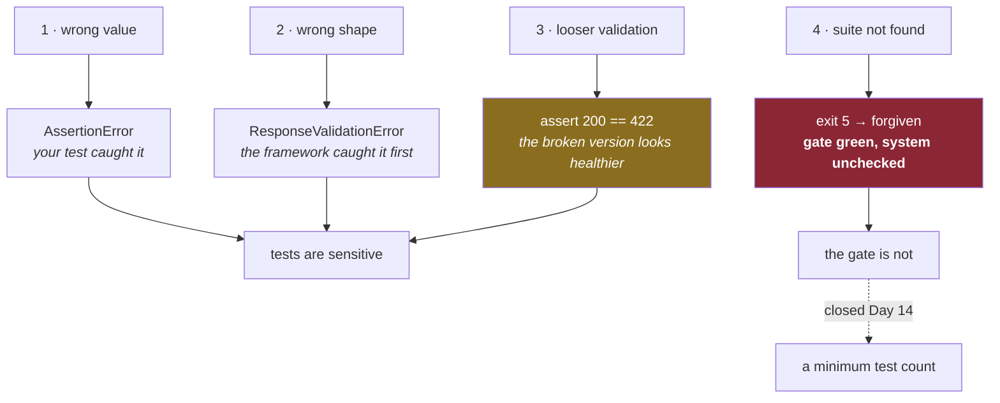

# 4.2 — Making the tests go red — four breakages on purpose

## One-line answer

Break each test in a different way before trusting any of them, because a test that has only ever
passed is indistinguishable from a test that cannot fail — and one of today's four breakages produces
a failure from a mechanism you did not write.

---

## The story

🎬 **The scene.** A parachute packer. Every parachute is packed, inspected, and signed for. The
inspection is thorough and the paperwork is complete.

😬 **The naive fix.** Trust the paperwork. Every chute for eleven years has been signed off and none
has failed.

💥 **Why it fails.** Nobody has ever *deployed* one from the store to check. A batch has a fault the
inspection does not look for — the inspection checks the fold, and the fault is in the release
mechanism, which is not part of the fold. Eleven years of clean records are eleven years of evidence
about the fold, and no evidence at all about the thing that matters.

💡 **The insight.** A clean record proves the check ran; it says nothing about whether the check *can
detect the fault you care about*. The only way to know is to introduce the fault deliberately and see
whether the check notices. **Every safety system needs a test of the test**, and it has to be done by
somebody willing to break something on a good day.

---

## The idea in plain language

You have four passing tests
([4.1](4.1-the-first-real-test.md)). Principle 11 says every gate must be able to go red, and a passing
test gives you no evidence about that. So you break each one — **differently**, because a test can be
insensitive in several distinct ways:

| Breakage | What it proves the test can see |
| --- | --- |
| 1. change a returned value | the assertion compares values, not just types |
| 2. return the wrong *shape* | the response model is enforced, not decorative |
| 3. loosen a validation constraint | the refusal path is actually tested |
| 4. rename the test file | **the suite runs at all** |

The fourth is the odd one out and it is the point of the exercise. Breakages 1–3 test your assertions.
Breakage 4 tests the thing *underneath* them — the exit-5 hole from
[4.1](4.1-the-first-real-test.md) — and it is the only one that produces a **green** gate on a broken
system.

### Do this before you commit

All four are one-line edits with one-line reversals, and the whole exercise is cheap only if the
repository is clean when you start: `git status --short` should print nothing, so `git checkout -- .`
restores everything and you can be certain nothing survived.

---

## Why Kriya needs it

Principle 11 — *every gate must be able to go red* — and Day 14, where these tests become a merge gate.

From Day 14 a failing test blocks a change. That is real authority, and giving authority to a check
nobody has tested is how you end up with a pipeline that is green because it is not looking. Day 0's
`docs/INCIDENTS.md` rows 2 to 6 are five deliberate breakages of the five gate steps, and today adds
the tests to that set.

There is a longer arc: Day 147 builds an evalset for the assistant, where "passing" is statistical.
Making a *statistical* gate go red on purpose is much harder and much more important, and the habit has
to exist before then.

---

## The mechanism

Four breakages. Each one: make the edit, run the suite, read the output, revert, confirm green.

### Breakage 1 — change a returned value

In `pulse/api.py`, change `/healthz` to return `{"status": "OK"}`.

```bash
uv run python -m pytest -q
```

**Line by line:** the same command as always. What changes is the code under it, which is the correct
way round — **you are testing the test, not the runner.**

Observed on **2026-08-24**:

```text
F...                                                                     [100%]
================================== FAILURES ===================================
_______________ test_healthz_answers_200_and_says_nothing_else ________________

    def test_healthz_answers_200_and_says_nothing_else() -> None:
        response = client.get("/healthz")
        assert response.status_code == 200
>       assert response.json() == {"status": "ok"}
E       AssertionError: assert {'status': 'OK'} == {'status': 'ok'}
E
E         Differing items:
E         {'status': 'OK'} != {'status': 'ok'}
E         Use -v to get more diff

tests\test_api.py:14: AssertionError
=========================== short test summary info ===========================
FAILED tests/test_api.py::test_healthz_answers_200_and_says_nothing_else - As...
1 failed, 3 passed in 0.42s
```

**Read `F...` first.** Four characters, one per test, in order: the first failed and three passed. That
single line tells you the scope of the damage before you read a word of the traceback, and on a suite
of four hundred it is the difference between "one thing broke" and "everything broke".

**Then read the `>`.** It marks the failing line — not the top of the function, the exact assertion. And
the `E` lines show **both** values, which is why `assert a == b` is enough and a hand-written
`assert a == b, "healthz was wrong"` would be worse: pytest's rewriting shows you the data, and your
message would replace it with prose.

Revert, and confirm `4 passed`.

### Breakage 2 — return the wrong shape

In `/predict`, return `{"priority": "unknown"}` — two fields short of `Prediction`.

```text
E               fastapi.exceptions.ResponseValidationError: 2 validation errors:
E                 {'type': 'missing', 'loc': ('response', 'queue'), 'msg': 'Field required', 'input': {'priority': 'unknown'}}
E                 {'type': 'missing', 'loc': ('response', 'model_version'), 'msg': 'Field required', 'input': {'priority': 'unknown'}}
E
E                 File "...\pulse\api.py", line 42, in predict
E                   POST /predict

.venv\Lib\site-packages\fastapi\routing.py:324: ResponseValidationError
=========================== short test summary info ===========================
FAILED tests/test_api.py::test_predict_returns_the_agreed_shape - fastapi.exc...
1 failed, 3 passed in 0.73s
```

**This is the interesting one and it is worth slowing down for.** The failure is **not an
`AssertionError`** — your assertion never ran. FastAPI validated the response against the `-> Prediction`
annotation, found two fields missing, and raised before the test could look at anything.

**Three things follow from that.**

`loc` starts with `('response', ...)` rather than `('body', ...)`. The same error machinery as the
`422`s in [2.4](../02-the-service/2.4-predict-the-contract-before-the-model.md), pointed the other way:
**pydantic validates what you send as well as what you receive.**

The type annotation is **enforced**, not documentation. Returning the wrong shape is a runtime error, and
in production it would be a `500` — correctly, because the client did nothing wrong.

**Your test would have caught it anyway**, and would have given a worse message. The framework caught it
first and named the two missing fields; `set(response.json()) == {...}` would have reported an unequal
set. Two overlapping safety nets, and it is worth knowing which one fires first.

Revert, and confirm `4 passed`.

### Breakage 3 — loosen a constraint

In `Ticket`, change `body: str = Field(min_length=1, max_length=5_000)` to `body: str = ""`.

**Line by line:** giving the field a default makes it **optional**
([2.4](../02-the-service/2.4-predict-the-contract-before-the-model.md)'s rule: a field with a default
is not required), so a request without it is now accepted, and `test_predict_refuses_a_ticket_with_no_body`
should notice.

```text
...F                                                                     [100%]
_________________ test_predict_refuses_a_ticket_with_no_body __________________

    def test_predict_refuses_a_ticket_with_no_body() -> None:
        response = client.post("/predict", json={"subject": "s"})
>       assert response.status_code == 422
E       assert 200 == 422
E        +  where 200 = <Response [200 OK]>.status_code

tests	est_api.py:30: AssertionError

FAILED tests/test_api.py::test_predict_refuses_a_ticket_with_no_body - assert...
1 failed, 3 passed in 0.41s
```

**`...F` — the fourth test, this time.** And the failure is `200 == 422`: the service *accepted*
something it should have refused. **This is the breakage that matters most**, because it is the only
one where the broken system looks *more* successful than the working one. A change that makes an
endpoint accept more input produces no errors, no tracebacks and a lower error rate, and the only thing
standing between it and production is a test asserting on a refusal.

Revert, and confirm `4 passed`.

### Breakage 4 — stop the suite from running

Rename the file so `pytest` cannot find it:

```bash
mv tests/test_api.py tests/api_tests.py
uv run python -m pytest -q; echo "pytest exit=$?"
./o check; echo "gate exit=$?"
```

**Line by line:**

- `pytest` collects files matching `test_*.py` by default. `api_tests.py` does not match, so the file is
  invisible — **no error, because an unmatched filename is not an error condition.** This simulates a
  broken import, a moved directory or a misconfigured `testpaths` just as well, and it is easier to
  reverse.
- Running `pytest` **and** `./o check` separately, because the two disagree and the disagreement is the
  finding.

```text
no tests ran in 0.01s
pytest exit=5
```

```text
All checks passed!
...
OK all green
gate exit=0
```

**Four tests, all effectively deleted, and the gate is green.** `pytest` reported honestly — exit `5`,
*"no tests ran"* — and `|| [ $? -eq 5 ]` in `o` forgave it, exactly as designed on Day 0 and exactly
wrongly from today.

**This is the alarm panel from [4.1](4.1-the-first-real-test.md)'s story**, produced deliberately. The
green light did not change. What changed was what it was standing in front of.

`mv tests/api_tests.py tests/test_api.py`, and confirm `4 passed` and a green gate.



---

## When it breaks

The drill itself has two failure modes and both are worth naming.

**You forget to revert.** The suite stays red, `./o done 3` refuses to commit, and the output names
the test. **This is the good failure** — the system caught you. The reversal is `git checkout -- .`,
which is only safe because you started clean.

**You revert breakage 4 incorrectly.** Rename it to `tests/test_apis.py` or leave it in the wrong
directory and the suite is collected — or is not — and you have no idea which, because the gate is
green either way:

```text
$ ./o check
OK all green
```

**What it says:** everything is fine.
**What it actually means:** unknown. This is the hole you just demonstrated, met accidentally, five
minutes later. **The only way to be sure is to count**, which is why
[4.1](4.1-the-first-real-test.md)'s check-yourself command ends with `--collect-only`:

```text
$ uv run python -m pytest --collect-only -q | tail -1
4 tests collected in 0.44s
```

**Four.** That number, not the gate's green, is the evidence. Until Day 14 adds a minimum count to the
gate, **checking it is a manual habit**, and the honest thing to do is write that down rather than
trust yourself to remember.

---

## In production

**What a professional does differently.** They run this drill continuously rather than once, using
**mutation testing**: a tool makes small automatic changes to the code — flipping a comparison,
changing a constant, removing a line — and reports which ones the suite fails to notice. Every
surviving mutant is a gap. It is the same idea as these four breakages, done exhaustively by a machine,
and it is the only technique that measures whether a suite is *sensitive* rather than merely present.
Coverage measures which lines ran; mutation measures which changes were caught, and those are very
different questions.

**What degrades at scale.** The willingness to do it. Breaking things on purpose is easy on four tests
and feels reckless on four thousand, so it stops happening exactly when the suite is large enough to be
untrustworthy. The professional counter-measure is to make it routine rather than heroic: a mutation
run in a nightly job, and a standing rule that a bug fix ships with a test that **fails before the
fix** — which is the same drill, attached to work you were doing anyway.

**The failure that only shows with real traffic.** A test that passes because of the *fixture*, not the
code. `TestClient` is created once at module level, and if a later test mutated shared state the
earlier ones might pass only because of ordering. `pulse` has no state today
([Day 2, part 3.1](../../../day-002-shape-of-production-system/parts/03-state/3.1-stateless-is-a-claim-about-the-process.md)),
so this cannot happen yet — but it is the standard reason a suite passes locally and fails in CI, where
tests may run in a different order or in parallel. The defence is that tests share nothing mutable, and
the way you find out is running them in a random order.

**The review comment a senior engineer leaves.** *"This PR fixes a bug and adds a test. Did you run the
test against the old code and watch it fail? If not, we don't know it tests the fix — I've seen a test
added next to a bug fix that passed on the broken version too."*

**The signal you would alert on.** From Day 13, two build-time signals, and the second is the one this
part argues for: the suite's **exit status**, and the **number of tests collected**, which must not fall
between commits. A test count that drops silently is the exit-5 hole in slow motion, and it is invisible
in every other measure. What you would *not* alert on: a coverage percentage crossing a threshold —
it is easy to game, it moves for reasons unrelated to quality, and teams learn to write tests that
touch lines rather than tests that catch changes.

**Blast radius.** This drill edits tracked source files and renames a test file, all reversibly. Worst
case: you leave a breakage in and commit it — which breakage 3 makes genuinely dangerous, because a
loosened validation constraint is a change that makes the service *accept more* and produces no errors
at all. Who can trigger it: you. What bounds it: everything is tracked, the repository was clean before
you started, and `git checkout -- .` restores all of it. **Do the drill before you commit, never
after**, and confirm with `git status --short` that nothing survived.

**Cost:** `0` model calls, `0` tokens, `0` MB resident. Four test runs at under half a second each.

**The interview question.** *"How do you know your tests are any good?"* Coverage is the answer that
does not land, because a line can be executed by a test that asserts nothing. The answer that lands:
*"I've watched each of them fail. When I fix a bug I write the test first and confirm it fails against
the broken code — and for the suite as a whole, mutation testing tells you which changes slip through,
which is the question coverage doesn't ask."*

---

## Check yourself

```bash
git status --short && uv run python -m pytest --collect-only -q | tail -1 && ./o check
```

Nothing modified, four tests collected, gate green. **All three, in that order** — the middle one is
the check that today's fourth breakage proved the gate cannot make for you.

**Say out loud, without scrolling up:** *three of the four breakages turned the suite red. Name the one
that did not, say what it turned green instead, and say which day closes it.*
