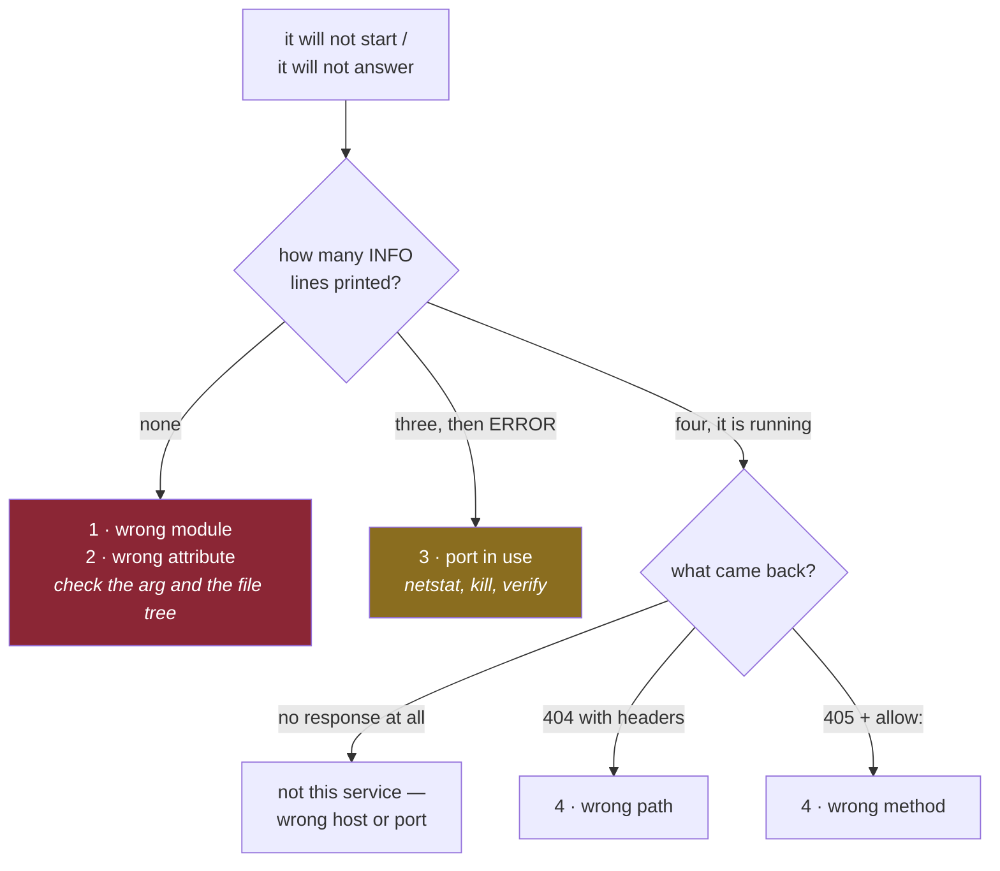

# 5.1 — The four errors of a first run

## One-line answer

Four errors account for almost every failed first start, they can be told apart in seconds once you
know their shapes, and the fastest way to learn them is to cause each one deliberately while nothing is
at stake.

---

## The story

🎬 **The scene.** A trainee at a garage is handed a car that will not start. He has been taught the
theory thoroughly and this is the first real one.

😬 **The naive fix.** Start at the beginning of what he knows and work through it: fuel, ignition,
compression, electrics. Methodical, complete, and it takes two hours.

💥 **Why it fails.** It does not fail exactly, because he finds it. But the mechanic at the next bay
would have found it in ninety seconds, and not because she knows more theory. She knows that **four
things cause nine out of ten cars that will not start**, and each one makes a different noise. She
listens, eliminates three, and is looking at the right component before the trainee has opened the
bonnet.

💡 **The insight.** Being good at diagnosis is mostly a **short list of common causes, each attached to
a recognisable signature**. It is not deeper theory, and it cannot be worked out from first principles
fast enough. It is a lookup table, and you build it by seeing each entry once, which is the
first-symptom column from
[Day 1, part 2.3](../../../day-001-what-operations-actually-is/parts/02-the-repo-remembers/2.3-the-first-symptom-column.md),
being built rather than described.

---

## The idea in plain language

There are four errors. Every one of them was produced on this machine on **2026-08-24** while writing
this day, and each has a distinct signature.

| # | Error | Signature | Which side |
| --- | --- | --- | --- |
| 1 | wrong module | `Could not import module "pulse.app"` | **before** any `INFO` line |
| 2 | wrong attribute | `Attribute "application" not found in module` | **before** any `INFO` line |
| 3 | port already in use | `[Errno 10048] … bind on address` | **after** `Application startup complete` |
| 4 | wrong path in the request | `404 Not Found` with `server: uvicorn` | after the server is running |

**The "which side" column is the whole diagnostic method**, and it comes from
[3.2](../03-running-it/3.2-reading-the-startup-output.md): count the `INFO` lines. Zero means the
application could not be loaded. Three means the application is fine and the server could not claim the
port. A response with headers means both are fine and you asked for the wrong thing.

Notice what the four are *not*. None of them is a bug in your code. Three are arguments and one is a
request. **The first thing that goes wrong is almost never the logic**, and expecting that saves the
hour the trainee lost.

---

## Why Kriya needs it

Day 40 is *"The Kubernetes failure lab: ImagePullBackOff, Pending, CrashLoopBackOff, Evicted"*, and Day
30 is the container failure lab.

Those days are the same exercise with more layers. `CrashLoopBackOff` means the process inside the
container exits over and over, and the only window into *why* is the output from
[3.2](../03-running-it/3.2-reading-the-startup-output.md), so a pod that dies after zero `INFO` lines
has a different problem from one that dies after three, and by Day 40 you want to know that without
thinking about it.

Error 3 in particular reappears in a new costume. In a container, "port already in use" usually means
two processes in one container, or a host port bound twice, and the message is the same `[Errno 98]` or
`[Errno 10048]` you meet today.

---

## The mechanism

Cause each one. All four are one command and none of them leaves anything behind.

### 1 — the module does not exist

```bash
uv run uvicorn pulse.app:app --host 127.0.0.1 --port 8001
```

**Line by line:** it says `pulse.app` instead of `pulse.api`, so uvicorn tries to import a module that
is not there. The port is `8001` throughout this part, so that a server you left running on `8000` from
[3.1](../03-running-it/3.1-the-server-the-port-and-the-process.md) does not confuse the results, except
for error 3, where the collision is the point.

```text
ERROR:    Error loading ASGI app. Could not import module "pulse.app".
```

**What it says:** the module could not be imported.

**What it actually means:** **no `INFO` line was printed at all**, which is the diagnosis. Uvicorn never
started a server process, the failure is in the argument or in your package layout, and nothing about
the network is involved. The most common real causes are a typo, a missing `__init__.py`, which is
[2.1](../02-the-service/2.1-the-application-object-and-the-first-route.md), or running from the wrong
directory so that `pulse` is not on the import path.

**Smallest fix:** check the module path against the file tree. `ls pulse/` settles it.

### 2 — the attribute does not exist

```bash
uv run uvicorn pulse.api:application --host 127.0.0.1 --port 8001
```

**Line by line:** the module is right and the attribute is wrong. `pulse.api` imports, and there is no
name `application` in it.

```text
ERROR:    Error loading ASGI app. Attribute "application" not found in module "pulse.api".
```

**What it says:** the module loaded and the attribute did not exist.

**What it actually means:** the second half of `module:attribute` is wrong, **and the message tells you
which half**, which is a small kindness worth noticing. Two adjacent things can fail and the error
distinguishes them, so you do not have to try both.

There is a nastier version of this one with an identical message: the module imported **but raised
partway through**, so the name was never defined. That is rare today, because `api.py` has no side
effects, and it becomes common from Day 9, when the module reads configuration at import time and is
able to refuse.

**Smallest fix:** run `grep -n '^app' pulse/api.py`, or print the module's names.

### 3 — the port is already in use

With a server already running on 8000, start another.

```bash
uv run uvicorn pulse.api:app --host 127.0.0.1 --port 8000
```

**Line by line:** this is the same command as the one that worked, unchanged, on the same port. **That
is the point.** Nothing about the invocation is wrong, and the failure comes entirely from the state of
the machine rather than from anything you typed.

```text
INFO:     Started server process [16196]
INFO:     Waiting for application startup.
INFO:     Application startup complete.
ERROR:    [Errno 10048] error while attempting to bind on address ('127.0.0.1', 8000): [winerror 10048] only one usage of each socket address (protocol/network address/port) is normally permitted
INFO:     Waiting for application shutdown.
INFO:     Application shutdown complete.
```

**What it says:** the address is in use.

**What it actually means:** three `INFO` lines succeeded first. **Your application is completely fine.**
This is the surprise from [3.1](../03-running-it/3.1-the-server-the-port-and-the-process.md): uvicorn
binds *after* the lifespan handshake, so `Application startup complete` appears before the failure, and
a reader who skims concludes the service is running.

`10048` is the Windows error number, and on Linux the same condition is `[Errno 98] Address already in
use`. **Both numbers are worth recognising**, because you will be reading Linux tracebacks from
containers on this Windows machine from Day 21 onward.

And here is the exit status, which is what a supervisor actually reads.

```bash
uv run uvicorn pulse.api:app --host 127.0.0.1 --port 8000 > /dev/null 2>&1; echo "real exit=$?"
```

**Line by line:** the redirect discards the output so that only the status remains. **Do not pipe this
into `tail`**, because in a pipeline `$?` is the *last* command's status, so a pipe reports `exit=0` and
the failure disappears. That is the `pipefail` lesson from Day 0, in
[4.2](../../../day-000-toolchain-skeleton-driver/parts/04-the-driver/4.2-set-euo-pipefail.md), met in
the wild, and it was observed exactly this way while writing this part.

```text
real exit=3
```

**Smallest fix:** find and kill the holder.

```bash
netstat -ano | grep ":8000.*LISTENING"
taskkill //PID <pid> //F
netstat -ano | grep ":8000.*LISTENING" || echo "8000 free"
```

**Line by line:** `netstat -ano` gives the owning process id in the last column, from
[3.1](../03-running-it/3.1-the-server-the-port-and-the-process.md). `taskkill //PID … //F` ends it,
with Git Bash's doubled slashes. **And then you check again**, because on this machine a `kill` that
reports success is not proof the port is free, as
[Day 2, part 2.3](../../../day-002-shape-of-production-system/parts/02-dependencies/2.3-the-dependency-that-fails-slowly.md)
showed.

### 4 — the path is wrong

```bash
curl -sS -i http://127.0.0.1:8000/health | head -3
```

**Line by line:** it says `/health`, not `/healthz`. `-i` shows the headers, and `head -3` keeps it to
the status line and the first two headers, which is all you need.

```text
HTTP/1.1 404 Not Found
date: Mon, 24 Aug 2026 09:39:19 GMT
server: uvicorn
```

**What it says:** not found.

**What it actually means:** **everything worked.** The connection was accepted, the request was parsed,
the routing table was consulted, and no route matched, so FastAPI generated a `404` and uvicorn sent it.
The `server: uvicorn` header is the tell, because **a response with headers came from a running
application**. Compare that with a refused connection, which produces no HTTP response at all, in
[Day 2, part 1.1](../../../day-002-shape-of-production-system/parts/01-the-request-path/1.1-a-request-is-a-path-not-a-function-call.md).

Here is the near neighbour, worth causing at the same time because it looks similar and is not.

```bash
curl -sS -i http://127.0.0.1:8000/predict | head -4
```

**Line by line:** the *path* is right this time and the method is wrong, because a bare `curl` sends
`GET` and `/predict` is registered for `POST`. `head -4` keeps one more line than the previous command,
because this response carries a fourth header that the `404` does not.

```text
HTTP/1.1 405 Method Not Allowed
date: Mon, 24 Aug 2026 09:39:19 GMT
server: uvicorn
allow: POST
```

**What it says:** wrong method.

**What it actually means:** the path matched and the method did not, hence `405` rather than `404`.
**And `allow: POST` tells you what to do instead**, generated from the routing table, which is
[2.1](../02-the-service/2.1-the-application-object-and-the-first-route.md). `404` against `405` is a
genuinely useful distinction. One means *this path does not exist*, the other means *this path exists
and you asked wrongly*, and confusing them sends you looking for a missing route that is right there.

**Smallest fix:** read the routing table, which settles both in one command.

```bash
uv run python -c "from pulse.api import app; print([(r.path, getattr(r, 'methods', None)) for r in app.routes])"
```

**Line by line:** it uses `getattr(r, 'methods', None)` because not every route object has a `methods`
attribute, since the docs routes do not, and a bare `r.methods` would raise on them. **Defensive access
on an object you did not define** is the right instinct in a diagnostic one-liner.



---

## When it breaks

The four above are the errors. What breaks *this method* is a fifth case that does not fit the table,
and it is the one that costs the most time on this machine.

```text
$ netstat -ano | grep ":8777.*LISTENING"
  TCP    127.0.0.1:8777         0.0.0.0:0              LISTENING       17464
  TCP    127.0.0.1:8777         0.0.0.0:0              LISTENING       19356
```

**Two listeners on one port**, observed on 2026-08-24 with Python's standard-library `HTTPServer`, from
[Day 2, part 2.3](../../../day-002-shape-of-production-system/parts/02-dependencies/2.3-the-dependency-that-fails-slowly.md).
`HTTPServer` sets `allow_reuse_address`, and on Windows that permits a second live socket rather than
refusing, where Linux would give you error 3.

**What it says:** nothing. There is no error at all.

**What it actually means:** requests go to whichever socket the operating system picks. Your edit takes
effect for some requests and not others, a restart "does not help", and `/version` reports two different
answers on consecutive calls, from
[2.3](../02-the-service/2.3-version-what-is-actually-running.md). **Every symptom is intermittent and
nothing in the four-error table matches**, because the table assumes exclusivity and this machine did
not enforce it.

**Uvicorn does not set that flag**, which is why error 3 above is a clean refusal, so this specific trap
appears when you mix the Day 2 experiments with today's server on one machine, which is exactly what
this curriculum has you do.

**The smallest fix** is the habit rather than a command. **After every kill, run `netstat` and count the
lines.** One listener, or you do not know what you are talking to.

---

## In production

**What a professional does differently.** They make the four errors impossible rather than
recognisable, wherever that is cheap. The module and attribute arguments come from a start script or a
container `CMD` that is version-controlled and tested, so they cannot be mistyped at 3am. The port comes
from configuration rather than from a hand-typed flag, which is Day 9. And crucially, **the process is
supervised**, so a failure to start is a restart with a recorded reason rather than a terminal somebody
closed. What remains is the diagnostic skill, and it remains valuable, because it is what you use when
the supervised process is failing and the only artifact is a log.

**What degrades at scale.** The signal-to-noise of the message. On one machine you read the error. In a
cluster, an identical failure produces `CrashLoopBackOff`, which is *not* an error message. It is a
statement that a container has exited repeatedly, with the actual reason one `kubectl logs --previous`
away. Day 40 is largely about the reflex of getting from a status to the underlying output, and the
reason today matters is that the underlying output is exactly what you are reading now.

**The failure that only shows with real traffic.** A start-up failure that is intermittent. All four
errors here are deterministic, because they happen every time. The production version is a process that
starts successfully nine times out of ten and fails on the tenth, because a dependency is briefly
unavailable during startup, or because two instances race for the same resource. **A supervisor hides
this**, because it restarts, the second attempt succeeds, and the only trace is a restart count that
nobody is watching. That is why `restart count` is one of the two alertable signals below, and why it is
a *rate* rather than an event.

**The review comment a senior engineer leaves.** *"The start command in this Dockerfile hard-codes the
port and binds `0.0.0.0` with no comment. Take the port from the environment so that the container and
the compose file cannot disagree, and add a line saying why `0.0.0.0` is right inside a container and
wrong outside one."*

**The signal you would alert on.** Two, and neither of them is *"the service failed to start"*, because
a single failed start is often normal, whether from a deploy, a node restart or a scale-up. **Restart
rate**, because a process restarting repeatedly is not recovering, and the rate tells that apart from
routine churn. And **time since the last successful start**, which catches the case where nothing is
restarting because nothing is running. Both are absence-shaped signals, which is the pattern from
[Day 1, part 1.6](../../../day-001-what-operations-actually-is/parts/01-what-ops-is/1.6-toil-and-the-line-you-automate.md):
alert on not having succeeded rather than on having failed. Neither exists today, and
[Day 2's blast-radius map](../../../day-002-shape-of-production-system/parts/04-blast-radius/4.2-drawing-the-blast-radius-map.md)
records the gap.

**Blast radius.** Errors 1 and 2 start no process at all. Error 3 starts a process that exits
immediately. Error 4 makes one read-only request. The worst case for the whole exercise is that you
kill the wrong process, which is why the `netstat` line and the `taskkill` line are separate steps with
the process id read from the first, and **never a scripted kill by name**, which on a machine running
several Python processes would take out your editor's language server as readily as your test server.
What bounds it is the loopback binds, a port that is not `8000` for errors 1 and 2, and a verification
step after every kill.

**Cost:** `0` model calls, `0` tokens and `0` MB resident when you are done. Four short-lived processes.

**The interview question.** *"Your service will not start. Walk me through the first two minutes."* The
answer that lands is a *triage order* rather than a list of possibilities. Read the output and count how
far it got, because that eliminates whole categories at once: nothing printed means it could not load
the code, startup-complete-then-error means the code is fine and the environment is not, and a response
with headers means both are fine and the request was wrong. Candidates who start with "check the logs"
without saying what they are reading them *for* have not done this under pressure.

---

## Check yourself

```bash
uv run uvicorn pulse.app:app --port 8001 2>&1 | head -1; uv run uvicorn pulse.api:application --port 8001 2>&1 | head -1
```

Two errors, one line each, and the difference between them is which half of `module:attribute` was
wrong. Read them side by side once and you will never confuse them again.

**Say out loud, without scrolling up:** *the output ends with `Application startup complete` followed by
an error. Which of the two programs from part 1.2 is fine, and what does that eliminate?*
