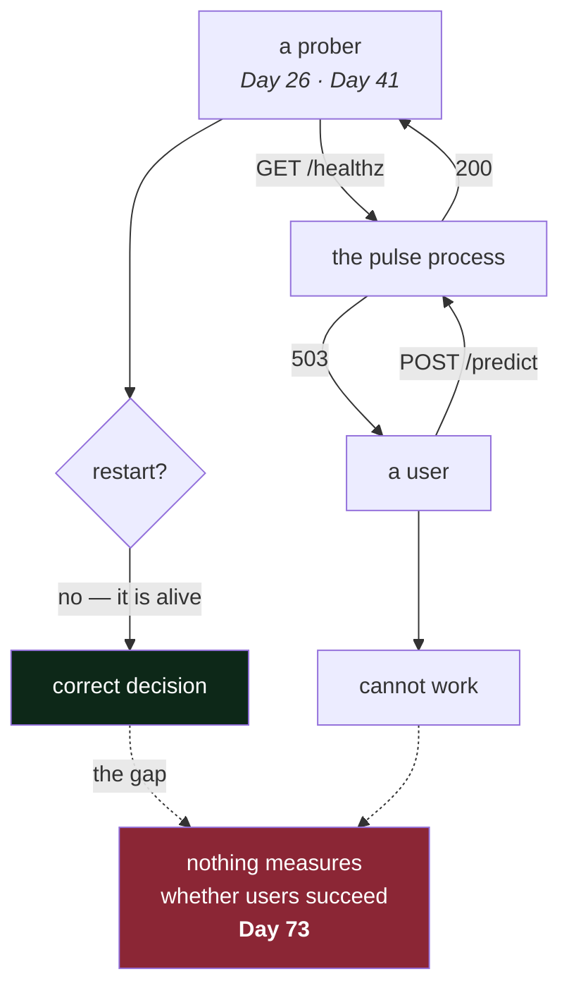

# 5.2 — The health check that lies

## One-line answer

`/healthz` returns `200` while `/predict` returns nothing at all, and it is **not a bug**, which is the
uncomfortable and important thing to understand before anything is given the power to act on that
`200`.

---

## The story

🎬 **The scene.** A night watchman at a warehouse. Every hour he walks to a station on the wall, turns
a key, and a clock records that the key was turned. Twelve stations, twelve keys, all night.

😬 **The naive fix.** Management is satisfied. The clock shows twelve turns a night, every night, for
years. The record is complete and nobody has ever missed one.

💥 **Why it fails.** There is a burglary and the record is perfect. Every key was turned on time. The
watchman was walking a route and turning keys, which is *exactly what was being measured*, and at no
point was anybody measuring whether he looked at anything. The system did not fail. It measured what it
measured, faithfully, for years, and everybody read it as something else.

💡 **The insight.** The clock never lied. **The lie was in the reading**, and it was created the moment
somebody decided that twelve key-turns meant "the warehouse is secure". A measurement takes on a
meaning it does not have as soon as it is the only measurement, and the fix is not a better clock. It
is knowing precisely what the clock can and cannot tell you, and having a second thing that measures
the part it does not.

---

## The idea in plain language

[2.2](../02-the-service/2.2-healthz-the-endpoint-that-must-not-lie.md) argued that `/healthz` has to
check the process and nothing else, because a health check that touches a shared dependency turns a
dependency outage into a total outage.

This part is the **cost** of that decision, stated honestly and demonstrated, because a design whose
downside you have not seen is a design you will abandon the first time it embarrasses you.

The cost is that **`/healthz` returning `200` is not evidence that the service is useful**. It is
evidence of one thing only: this process can accept a connection and run a function. A process can do
that while any of the following is true.

- Its database connection pool is exhausted, so every `/predict` fails.
- Its model file failed to load, so `/predict` has nothing to serve.
- Its provider quota is spent, so `/assist` returns errors.
- It is out of memory and every allocation of any size fails.
- It is so overloaded that real requests time out while the constant-returning route still answers.

The last one deserves attention, because it is the least intuitive. `/healthz` is *cheap*, since it
allocates nothing, takes no lock and calls nothing, so it is the **last route to become slow**. A
process that cannot serve a single real request will happily answer its health check, and the very
properties that make the check safe are what make it survive conditions that kill everything else.

### So is it a bad check?

No, and this is the judgement worth carrying out of today. There are two questions and they need two
answers.

| Question | Signal | Consumer | Action on "no" |
| --- | --- | --- | --- |
| is this process alive? | **liveness**, meaning `/healthz` | the supervisor | **restart it** |
| can it usefully serve? | **readiness**, from Day 41 | the load balancer | **stop sending traffic** |

Restarting fixes a wedged process and fixes nothing else. So liveness has to depend on nothing
external, because otherwise you restart every instance for a problem a restart cannot touch, which is
[2.2](../02-the-service/2.2-healthz-the-endpoint-that-must-not-lie.md).

**Today `pulse` has only the first, deliberately**, because there is no supervisor and no load
balancer, and a check with no consumer is not a check, from
[Day 1, part 1.2](../../../day-001-what-operations-actually-is/parts/01-what-ops-is/1.2-does-it-work-versus-is-it-working.md).
The gap is real, it is on
[Day 2's blast-radius map](../../../day-002-shape-of-production-system/parts/04-blast-radius/4.2-drawing-the-blast-radius-map.md),
and it closes on Day 41.

### The thing that actually catches a useless service

Neither check does. **The user-facing objective** on Day 73 does: *"99% of `/predict` requests succeed
in under 400 ms."* That measures the outcome people care about, and it is the only signal that is true
whatever the health check says. Liveness and readiness are inputs to *automation*, and the SLO is the
input to *people*. Confusing the two is how organisations end up with dashboards full of green
components and a product nobody can use, which is the damp-patch failure from
[Day 1, part 1.5](../../../day-001-what-operations-actually-is/parts/01-what-ops-is/1.5-the-five-kinds-of-ops-are-one-job.md).

---

## Why Kriya needs it

Day 41 is *"Probes: liveness, readiness, startup, and the liveness probe that took production down"*,
and Day 73 is the first SLO.

Day 41 gives an automated system the power to destroy your process based on this endpoint's answer. The
failure lab on that day is a liveness probe restarting healthy pods during a slow database query, which
is the cascade from [2.2](../02-the-service/2.2-healthz-the-endpoint-that-must-not-lie.md), produced
deliberately. **You will only find that day instructive rather than confusing if you have already seen
a health check be right and useless**, which is what you do here.

Day 26 is nearer, where a container `HEALTHCHECK` polls this route with a weaker consequence, namely a
container marked unhealthy. It is a good place to watch the mechanism before it can restart anything.

---

## The mechanism

Simulate the failure `/healthz` cannot see. `pulse` has no dependencies yet, so you make the *route*
fail while the process stays perfectly healthy.

Add a temporary route to `pulse/api.py`. This is a drill, and you remove it afterwards.

```python
# TEMPORARY — Day 3 part 5.2 drill. Delete after the exercise.
DEPENDENCY_IS_UP = False


@app.post("/predict-with-dependency")
def predict_with_dependency(ticket: Ticket) -> Prediction:
    """Stands in for a /predict that needs something it cannot reach."""
    if not DEPENDENCY_IS_UP:
        raise HTTPException(status_code=503, detail="classification unavailable: model not loaded")
    return Prediction(priority="unknown", queue="unrouted", model_version="none")
```

**Line by line:**

- The comment names the day, the part and the fact that it is temporary. **A deliberate breakage that
  outlives its drill is an incident you caused**, and Day 0's `docs/INCIDENTS.md` rows end with exactly
  that lesson.
- `DEPENDENCY_IS_UP = False` is a module-level constant standing in for a dependency check. Note that it
  is in-process state, which
  [Day 2, part 3.1](../../../day-002-shape-of-production-system/parts/03-state/3.1-stateless-is-a-claim-about-the-process.md)
  says is a bug, and here it is fine, because it is a constant that never changes and dies with the
  process. **The rule is about state that outlives a request rather than about every module-level
  name.**
- It is a *separate* route rather than an edit to `/predict`, so that the four tests from
  [4.1](../04-testing-it/4.1-the-first-real-test.md) stay green. The drill is about `/healthz`, and a
  red suite would be noise.
- `raise HTTPException(status_code=503, ...)` is FastAPI's way to return an error status from a handler.
  **It is `503`, not `500`.** `503 Service Unavailable` means *temporary, try again, not your fault*,
  and `500` means *I have a bug*. Verified against RFC 9110 §15.6.4 on 2026-08-24. The distinction
  matters because clients, proxies and retry policies all behave differently, and because your own
  error-rate metric will be read differently.
- `detail=` names **which** capability is gone. A `503` with no body tells an operator that something is
  unavailable, and this one tells them what, which is the difference between a page and a diagnosis.
- The import for it goes at the top: `from fastapi import FastAPI, HTTPException`.

Now run both endpoints against the same process.

```bash
curl -sS -o /dev/null -w 'healthz -> %{http_code}\n' http://127.0.0.1:8000/healthz
curl -sS -i -X POST http://127.0.0.1:8000/predict-with-dependency \
  -H 'content-type: application/json' \
  -d '{"subject":"cannot log in","body":"password reset loops"}' | head -6
```

**Line by line:**

- The first `curl` asks the health question and prints only the status, which is the thing a probe
  reads.
- The second asks the *real* question and shows the headers, because the status line and the body
  together are what an operator needs.
- **Both go to the same process, in the same second.** That is the entire experiment.

Observed on **2026-08-24**:

```text
healthz -> 200
```

```text
HTTP/1.1 503 Service Unavailable
date: Mon, 24 Aug 2026 09:38:54 GMT
server: uvicorn
content-length: 57
content-type: application/json

{"detail":"classification unavailable: model not loaded"}
```

**Read those two together and sit with the discomfort.** The instance is healthy. The service is
useless. **Both statements are true, at the same instant, about the same process**, and there is no
contradiction, because they are answers to different questions.

Now the part that matters: **what would a supervisor do?** It polls `/healthz`, sees `200`, and does
nothing. That is *correct*, because the process is alive, and restarting it would not load a model that
is not there. The system correctly declines to take an action that would not help. And every user is
still getting a `503`, and **nothing anywhere is alerting**, because nothing is watching the route that
fails.



**Remove the temporary route before you finish**, and confirm with `git diff` that nothing of it
survives.

---

## When it breaks

The drill above is the failure. What breaks *around* it is the reaction to it, and there are two wrong
turns worth naming, because both of them feel like fixes.

**Wrong turn one: make `/healthz` check the dependency.** It is the obvious response, since *"the health
check should have known"*, and it produces this, from
[2.2](../02-the-service/2.2-healthz-the-endpoint-that-must-not-lie.md):

```text
HTTP/1.1 500 Internal Server Error
content-type: application/json

{"detail":"Internal Server Error"}
```

```text
Traceback (most recent call last):
  File "/app/pulse/api.py", line 22, in healthz
    db.execute("SELECT 1")
psycopg.OperationalError: connection failed: could not connect to server: Connection refused
```

**What it says:** the health endpoint failed because the database is unreachable.

**What it actually means:** every instance now fails its liveness probe **at the same moment**, all of
them are restarted, none of them recovers, and the partial outage you were trying to detect has become
a total one. You have converted "some routes return `503`" into "there is no service", and the mechanism
you used was the health check.

**Wrong turn two: catch the error and return `200` anyway.** Somebody adds the dependency check, sees
the cascade, and wraps it in a `try/except` that returns `{"status": "ok", "db": "down"}` with a `200`.

**What it says:** healthy, with a note.

**What it actually means:** an endpoint that *appears* to check something and does not act on it. Nobody
parses the body, because probes read the status, as
[2.2](../02-the-service/2.2-healthz-the-endpoint-that-must-not-lie.md) explained, so the note is
invisible to every automated consumer and the next reader will believe the dependency is being checked.
**A check that pretends is worse than a check that abstains**, because abstention is honest and pretence
is trusted.

**The right response to today's drill is neither of those.** It is that liveness stays narrow, a
*readiness* endpoint is added on Day 41 with a consumer that can act on it appropriately, and a
**user-outcome signal** is added on Day 73 so that a service returning `503` to everybody is visible to
a human regardless of what either probe says. Three mechanisms, three different jobs, and the mistake is
trying to make one of them do all three.

---

## In production

**What a professional writes instead of the teaching version.** They write both endpoints and they are
strict about the split. Liveness depends on nothing external and is answered by a constant. Readiness
checks the dependencies this instance needs and is allowed to fail. And there is a detail people miss:
readiness should check **only what *this instance* needs in order to serve**, rather than the health of
the whole system. If every instance's readiness depends on one shared dependency, readiness has the same
simultaneity problem as liveness, because every instance leaves the load balancer at once, and you have
rebuilt the cascade with a different endpoint. The mitigation is that removal from a load balancer is
reversible and a restart is not, so the blast radius is smaller. It is smaller, not zero.

**What degrades at scale.** The gap between "healthy" and "useful" widens with every dependency. For one
process with no dependencies, liveness is nearly a complete answer. For a service with a database, a
registry, an index and a provider, liveness answers perhaps a tenth of the question, and the other nine
tenths need a readiness check that is itself a design problem. Check them all and one flaky dependency
takes you out of rotation. Check none and readiness is liveness with a different name. **There is no
clean answer, and the professional move is to know which dependencies are on the serving path for which
route**, which is precisely
[Day 2, part 2.1](../../../day-002-shape-of-production-system/parts/02-dependencies/2.1-hard-and-soft-dependencies.md)'s
per-route classification table.

**The failure that only shows with real traffic.** The health check that stays fast because it is the
only thing that can. Under heavy load, with a saturated thread pool, a blocked event loop or a full
queue, real requests are queueing for seconds and `/healthz` still returns in a millisecond, because it
needs no resource that is contended. So the probe says healthy, the load balancer keeps sending traffic,
and the instance sinks further. **This is the strongest argument for measuring the user's outcome rather
than the process's opinion of itself**, and it is why Day 73's SLO is written against request success
and latency rather than against health checks.

**The review comment a senior engineer leaves.** *"This readiness check pings all four dependencies. The
index is a soft dependency, and we said we degrade without it. If it flaps, this takes the whole fleet
out of rotation for something we already decided we can serve without. Check only what this route cannot
serve without."*

**The signal you would alert on.** This is the part worth getting right, and it is three signals with
three different consumers.

- **The fraction of instances failing readiness**, rather than any single one, which is normal churn. A
  fleet moving together means a shared dependency, and that is a page.
- **Restart rate**, because a process restarting repeatedly means the restart is not fixing anything,
  which is Day 40's `CrashLoopBackOff`, and it is invisible if you look only at whether instances are
  currently up.
- **The user-outcome signal**, meaning the success rate of real requests, which is the *only* one of the
  three that would have caught today's drill. **Neither probe would have fired.** Every instance was
  alive, nothing restarted, and every user got a `503`.

And there is an explicit non-alert: **do not page on a single liveness failure.** It is a normal event,
the system handles it, and paging on it is how alert fatigue starts.

**Blast radius.** The drill adds a temporary route that returns `503` and touches nothing. The worst
case is that you leave it in and commit a route that always fails, which is why the code carries a
`TEMPORARY` comment naming the day, and why the checklist has a box for removing it. Only somebody
calling that path can trigger it. What bounds it is that it is a separate path, so `/predict` and the
four tests are unaffected, and `git diff` shows whether it survived. **The larger blast radius is
conceptual and it belongs to Day 41**, because the moment a supervisor can act on `/healthz`, this
endpoint gains the power to destroy every instance you have. Everything narrow about it is the bound on
that power.

**Cost:** `0` model calls and `0` tokens. One extra route on an already-running process, and a few bytes
per request, with `0` MB additional resident.

**The interview question.** *"Your health check is green and users are complaining. What is going on?"*
It is one of the best questions in this space, because the naive answer is *"the health check is
broken"*. The answer that lands is that the health check is almost certainly correct and is answering a
narrower question than the complaint, since it says the process is alive rather than that the service is
useful, and the things that catch the gap are a readiness signal and, above all, a measurement of
whether real requests are succeeding. The best answers add the reason liveness *must* be narrow, because
that is the part that shows you have seen the cascade.

---

## Check yourself

```bash
curl -sS -o /dev/null -w 'healthz %{http_code}  ' http://127.0.0.1:8000/healthz && curl -sS -o /dev/null -w 'predict-with-dependency %{http_code}\n' -X POST http://127.0.0.1:8000/predict-with-dependency -H 'content-type: application/json' -d '{"subject":"s","body":"b"}'
```

You get `healthz 200  predict-with-dependency 503`, on one line, from one process. Then delete the
temporary route and confirm with `git diff` that it is gone.

**Say out loud, without scrolling up:** *the health check said `200` and every user got a `503`. Name
the two things that would have caught it, say which day each of them arrives, and say which of the two
would have woken somebody.*
