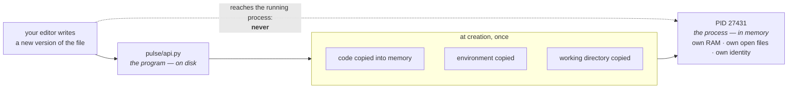

# 1.1 — A process is not a program

## One-line answer

A program is a file on disk that does nothing; a process is a running instance of that file with its
own memory, its own open files and its own identity — and **every operational verb you will ever use
acts on the process, never on the program**.

---

## The story

🎬 **The scene.** A recipe card sits in a drawer. It says: boil water, add rice, wait, drain. The card
has been in that drawer for years. Nothing has ever been cooked by it.

Now three people in three kitchens take a photocopy each and start cooking. One is at the boiling
step, one has burnt hers and started over, one has walked away and left the pan on. There is one
recipe and three completely different situations.

😬 **The naive fix.** Someone says: "the rice is burning — fix the recipe."

💥 **Why it fails.** The recipe is fine. The recipe is *identical* in all three kitchens. What differs
is where each cook has got to, what is in each pan, and whether anyone is watching. Editing the card
in the drawer changes nothing on any stove right now. It changes what happens the *next* time somebody
starts cooking.

💡 **The insight.** The thing you can read is not the thing that is happening. **The instructions and
the activity are separate objects with separate lives**, and almost every confused conversation about
a running system comes from someone talking about one while someone else is talking about the other.

---

## The idea in plain language

Your computer stores files. One of those files is `python.exe`, or `/usr/bin/python`. It is a
**program**: a sequence of machine instructions sitting on a disk. Left alone, it consumes disk space
and does absolutely nothing else. You can copy it, delete it, email it. It has no state, no memory
usage, no CPU usage, and no opinions.

When you type `uv run uvicorn pulse.api:app`, the operating system does something specific: it creates
a **process**. A process is the operating system's word for *one running activity*. Creating it means
the kernel — the part of the operating system that owns the hardware — sets aside:

- a private region of memory that only this activity can see;
- a numbered list of open files and network connections;
- a record of which user started it and therefore what it is allowed to do;
- a unique number identifying it, so you can talk about *this* activity rather than *that* one;
- bookkeeping about how much processor time it has consumed.

None of that exists on disk. All of it exists only while the process lives, and all of it disappears
when it ends.

The relationship is one-to-many and it goes in a direction people find surprising:

| | Program | Process |
| --- | --- | --- |
| Where it lives | on disk | in memory |
| How many of it | one file | as many as you start |
| Has memory usage | no | yes |
| Has an identity number | no | yes |
| Editing it affects | future runs | nothing currently running |
| Survives a reboot | yes | no |

**The row that matters operationally is the second-to-last one.** You edit `pulse/api.py`, save, and
refresh the browser, and nothing changes. That is not a bug and it is not a caching problem. The
process that is serving you was created from the *old* content and has been holding its own copy in
memory ever since. Day 3 met this already, in
[3.2 — reading the startup output](../../../day-003-pulse-v0/parts/03-running-it/3.2-reading-the-startup-output.md),
as one of the three reasons an edit appears not to take effect. Today you learn *why*, and the why is
this sentence: **the process is not reading the file.**

### The word "instance", and why it is worth having

You will hear "three instances of `pulse`". That means three processes, all created from the same
program, all doing similar work, each with its own memory and its own identity. They can be at
different points, hold different data, and fail independently — exactly like the three kitchens.

When Day 34 tells Kubernetes "I want three replicas", it is asking for three processes, not three
copies of the program. The program is downloaded once and shared. **Replication is a statement about
processes.** So is scaling, so is restarting, so is killing, so is a memory limit.

### What is *not* part of a process

This list is as useful as the one above, because these are the things people assume travel with a
process and do not:

- **The terminal you started it from.** It is attached today, and part
  [1.2](1.2-pid-parent-and-the-process-tree.md) shows what happens when it goes away.
- **The current directory at the time you typed the command** — that gets *copied* at creation. If you
  change directory afterwards, the running process does not move.
- **Environment variables you set after it started.** Also copied at creation. This is the single most
  common cause of "I set the variable, why does it not see it", and Day 9 builds the whole
  configuration story on top of it.
- **The file's contents.** Copied at creation. Hence the edit that does nothing.

Every item on that list is the same rule wearing a different hat: **a process is a snapshot taken at
creation, and afterwards it is on its own.**

---

## Why Kriya needs it

Day 6 asks *"why was my process simply `Killed`?"* — and the answer only makes sense if you already
believe that the thing killed was an activity with a memory footprint, not a file. A file cannot be
killed for using too much memory.

Day 26 configures a container restart policy. "Restart" means: the process ended, so create a new one
from the same program. If you think the program and the process are the same object, "restart" sounds
like it should fix a bad line of code. It cannot, and understanding why saves you an evening on that
day.

Day 34 asks Kubernetes for three replicas of `pulse` and Day 41 gives a probe the power to destroy one
of them. Both days are entirely about processes, and neither ever touches the program.

And Day 109, when `pulse` finally loads a real model: the model is loaded into the *process's* memory
at startup. Three replicas means three copies of the model in RAM, on a machine with a finite amount
of it. That arithmetic is unavoidable and it is a direct consequence of this part.

---

## The mechanism

Start `pulse` and then look at the thing you started, from outside.

```bash
uv run uvicorn pulse.api:app --host 127.0.0.1 --port 8000 &
```

**Line by line:**

- `uv run` — runs the command inside the project's virtual environment, so `uvicorn` and `pulse` are
  the versions this repository pinned rather than whatever is installed system-wide
  ([Day 0, part 1.5](../../../day-000-toolchain-skeleton-driver/parts/01-the-toolchain/1.5-the-interpreter-your-editor-picked.md)).
- `uvicorn pulse.api:app` — the server program, told which application object to serve. The colon
  separates the module path from the name inside it.
- `--host 127.0.0.1` — bind to the loopback address only, so nothing outside this machine can reach
  it. Day 7 explains what that choice actually excludes.
- `--port 8000` — the doorway number. Day 7, part 1.1.
- `&` — **the important character today.** It tells the shell to start the process and immediately give
  you the prompt back, rather than waiting for it to finish. Without it, your terminal is occupied and
  you cannot type the next command. With it, you now have two processes: your shell, and the server.

The shell prints something like this immediately:

```text
[1] 27431
```

That is the shell's job number in brackets and then **the number that matters**: the process
identifier. Yours will differ; the number is assigned by the kernel and is not predictable.

Now ask the operating system what it thinks is running:

```bash
ps -o pid,ppid,stat,etime,rss,args -p 27431
```

**Line by line:**

- `ps` — "process status". It reports on processes that exist right now. There is no `ps` for programs,
  because there is nothing to report about a file that is not running.
- `-o pid,ppid,stat,etime,rss,args` — choose the columns explicitly instead of accepting the default
  five. Defaults differ between systems and between the two `ps` traditions; naming the columns means
  the command means the same thing on your laptop and on a server, which is why every `ps` in this
  curriculum names them.
- `pid` — the process identifier. `ppid` — the identifier of whatever created it
  ([1.2](1.2-pid-parent-and-the-process-tree.md)). `stat` — the process state
  ([1.4](1.4-process-states-and-the-d-that-will-not-die.md)). `etime` — elapsed time since it started.
  `rss` — resident set size, the physical memory it is actually occupying, in kibibytes (Day 6, part
  1.2). `args` — the full command line it was started with.
- `-p 27431` — restrict to this one process. Replace with your own number.

Observed on **2026-08-24**:

```text
    PID    PPID STAT     ELAPSED   RSS COMMAND
  27431   26902 S          00:41 61284 python .venv/Scripts/uvicorn pulse.api:app --host 127.0.0.1 --port 8000
```

**Read that line as six separate facts, because it is six separate facts.** It has an identity
(`27431`). It has a parent (`26902` — your shell). It is in state `S`. It has existed for forty-one
seconds. It is occupying about 60 MB of physical memory — a number that did not exist before you
started it and will not exist afterwards. And it remembers the exact command line it was born with,
which is often the only surviving evidence of how a mystery process on a server got there.

Now do the thing that proves the point. Edit the program while the process runs:

```bash
grep -n '"status"' pulse/api.py
sed -i 's/"status": "ok"/"status": "EDITED"/' pulse/api.py
curl -sS http://127.0.0.1:8000/healthz
```

**Line by line:**

- `grep -n '"status"'` — find the line first and print its number. Never run a substitution without
  looking at what it will hit; `-n` gives you the line number so you can undo by hand if needed.
- `sed -i 's/old/new/'` — edit the file in place. `-i` means "in place", which is exactly what makes
  this a genuine edit to the program on disk rather than a preview.
- `curl -sS .../healthz` — ask the *process* what it says. `-s` suppresses the progress meter, `-S`
  keeps errors visible; that pair is the sane default for any script.

```text
22:    return {"status": "ok"}
{"status":"ok"}
```

**The file on disk now says `EDITED`. The running process still says `ok`.** Confirm it:

```bash
grep -n '"status"' pulse/api.py
```

**Line by line:** the same search again, now against the modified file — this is the control that
proves the edit actually landed and that the discrepancy is in the process, not in your `sed`.

```text
22:    return {"status": "EDITED"}
```

Two different answers to "what does `/healthz` return", both correct, because they are answers about
two different objects.



Put the file back before you forget:

```bash
sed -i 's/"status": "EDITED"/"status": "ok"/' pulse/api.py
git diff --stat pulse/api.py
```

**Line by line:**

- The reverse substitution restores the original text.
- `git diff --stat` is the *proof*, not a formality. A drill that leaves the repository modified is an
  incident you caused ([Day 3](../../../day-003-pulse-v0/LESSON.md), §4). Empty output means clean.

---

## When it breaks

**The edit that does nothing.** This is the failure, and it is a failure of belief rather than of
software. You change a line, reload, and see the old behaviour. The instinct is to suspect a cache, a
proxy, or the browser. Observed shape:

```text
$ curl -sS http://127.0.0.1:8000/healthz
{"status":"ok"}
```

with `pulse/api.py` on disk clearly saying `EDITED`.

**What it says:** the server returned the old value.
**What it actually means:** you are talking to a process created before the edit. There is no cache
involved and nothing is broken.
**The smallest fix:** end the process and start a new one. `kill 27431`, then start it again. Part
[2.2](../02-signals/2.2-sigterm-and-sigkill-the-request-and-the-order.md) explains what `kill`
actually does, and it is not what the name suggests.

**The stale process nobody noticed.** The more expensive version of the same thing. You start `pulse`,
forget it is running, start it again in a new terminal, and get:

```text
ERROR:    [Errno 10048] error while attempting to bind on address ('127.0.0.1', 8000): only one usage of each socket address (protocol/network address/port) is normally permitted
```

On Linux and inside WSL2 the same condition reads:

```text
ERROR:    [Errno 98] error while attempting to bind on address ('127.0.0.1', 8000): address already in use
```

**What it says:** something already owns port 8000.
**What it actually means:** a *process* you forgot about is still alive and still holding that
doorway. The program is irrelevant; the port belongs to a running activity.
**The smallest fix:** find it and end it.

```bash
netstat -ano | grep ':8000' | grep LISTENING
```

Numeric addresses (`-n`, so it does not try to resolve names and hang), all sockets (`-a`), and the
owning process identifier (`-o`) — that last flag is the whole point, because it converts "port 8000
is busy" into "process 27431 is holding it". On Linux, `ss -lptn 'sport = :8000'` is the modern
equivalent, covered on Day 7.

```text
  TCP    127.0.0.1:8000         0.0.0.0:0              LISTENING       27431
```

The last column is a process identifier. Everything you do next acts on that number.

---

## In production

**What a professional writes instead of the teaching version.** They stop starting processes by hand
at all. A production process is created by something whose job is creating processes — a container
runtime (Day 25), a supervisor, or a Kubernetes kubelet (Day 33) — because a human-started process has
three properties that are unacceptable: it dies when the terminal closes, nobody knows the arguments it
was given, and nothing restarts it. The `&` you typed above is the toy version of that whole
discipline, and part [1.2](1.2-pid-parent-and-the-process-tree.md) shows exactly how it betrays you.

**What degrades at scale.** Identity. On your laptop there is one `pulse` process and you know its
number. In a real system there are dozens, on many machines, being created and destroyed continuously,
and a process identifier is only unique on one machine at one moment — it is reused. So production
stops using the PID as a name and starts using stable labels: container name, pod name, service name,
instance identifier. **When Day 67 makes `pulse` emit structured logs, one of the fields will be an
instance identifier, and this is why.** A log line that says "the process restarted" is useless if you
cannot say *which* one.

**The failure that only shows with real traffic.** Divergence between instances. Three processes from
one program are supposed to be interchangeable, and then one of them was created before a
configuration change, or picked up a different environment, or has been running long enough to have
leaked memory the others have not. It answers differently. Users see a bug that reproduces one time in
three, which is the hardest kind to chase — and it is *invisible* if you think of the deployment as
"the program", because the program is obviously identical. The fix is to make instance identity
visible in every response and every log line, and to prefer replacing processes over mutating them
(Day 18's deployment strategies exist entirely to control this).

**The review comment a senior engineer leaves.** *"You've changed the config file and reloaded the
proxy, but the worker processes were forked before that and are still serving the old config. Check
the worker start times before you declare this deployed."*

**The signal you would alert on.** Not the existence of a process — that is trivially true or
trivially false. What you alert on is **process age relative to the last deploy**: an instance whose
start time predates the current release means the deploy did not actually replace it, which is a
silent and very common partial-deploy failure. You would also alert on **restart count**, because a
process being recreated repeatedly is the shape of a crash loop (Day 30). You would *not* page a human
for a single process ending; that is normal and it is what the supervisor is for.

**Blast radius.** This part introduces no new capability — it starts one local process and ends it.
Worst case: a forgotten process holding port 8000 and about 60 MB of RAM until you reboot. Who can
trigger it: only you, at this keyboard. What bounds it: `--host 127.0.0.1` means nothing outside this
machine can reach it, and one process on a machine with about 11.7 GiB of RAM
(`docs/PACKAGES.md`, Day 0) is not a capacity risk. The real bound is the habit of running
`netstat -ano | grep ':8000'` before you start anything.

**Cost.** `0` model calls, `0` tokens, `0` CI minutes, `0` disk. About **60 MB of RAM** while the
process is alive, which is the same number Day 3's budget recorded — and it belongs to the process, so
it returns to zero the moment the process ends. That is the whole distinction, expressed in megabytes.

**The interview question.** *"You deployed a fix and the bug is still there. Walk me through it."* The
answer that lands starts with the distinction rather than with a tool: *"First I check whether the
running processes are actually the new ones — start time against deploy time, or the version endpoint
if the service has one. Most 'the fix didn't work' turns out to be 'the fix isn't running': an
instance that wasn't replaced, a worker forked before the reload, or a rolling deploy that stalled
half-way. Only once I've confirmed the new code is genuinely in the process do I go and look at the
code."* That answer demonstrates you have been burnt by this, which is the thing being probed.

---

## Check yourself

```bash
ps -o pid,ppid,lstart,rss,args -p $(netstat -ano | grep ':8000.*LISTENING' | awk '{print $NF}' | head -1)
```

One command that goes from *a port* to *the full identity of the process holding it*, including
`lstart` — the wall-clock time it was created. That timestamp is the single most useful column on this
line in a real incident, because comparing it to your deploy time answers "is this even the new code?"

**Say out loud, without scrolling up:** *you edited a file, saved it, and the running service still
returns the old answer. Name the three things that were copied at process creation, and say which one
is responsible.*
