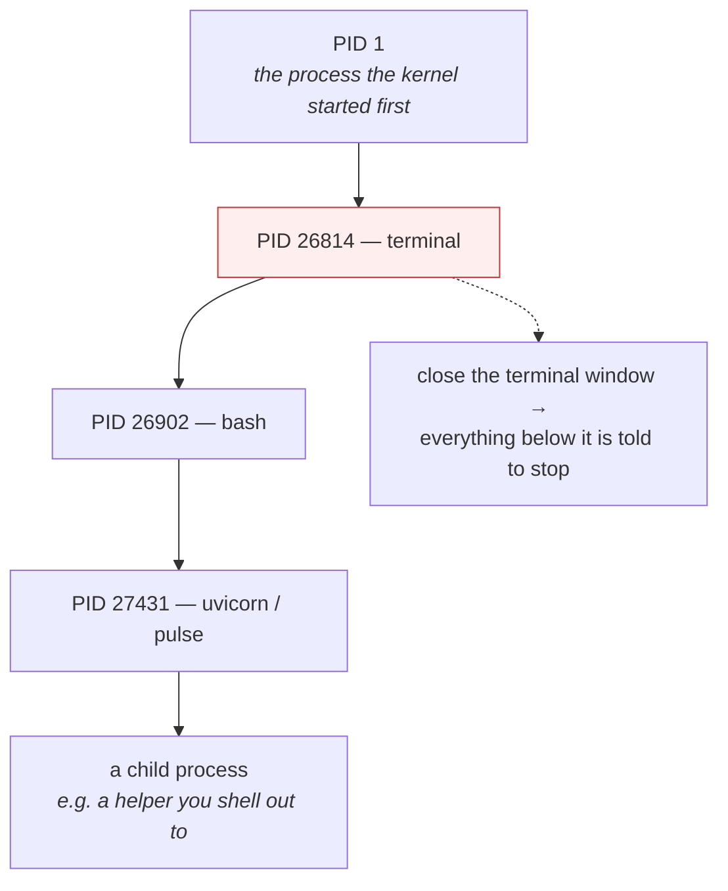

# 1.2 — The PID, the parent, and the process tree

## One-line answer

Every process is created by exactly one other process and remembers which one, so the processes on a
machine form a single tree, and **that tree is what decides who gets told when something dies, who
clears up afterwards, and what happens to your service when you close the terminal**.

---

## The story

🎬 **The scene.** A school trip. The head of year is in charge, three teachers each have a group of
ten, and each group has two parent helpers who are each responsible for five named children. Nobody is
on two lists, and every child knows exactly whose list they are on.

Halfway round, one child feels sick and wants to sit down. Who needs to know? Not the head of year. The
helper whose list she is on, because that is the person who was counting her and who has to decide what
happens next.

😬 **The naive fix.** A new rule is issued to make things simpler: anybody leaving their group tells
the head of year directly.

💥 **Why it fails.** The head of year now gets messages all afternoon about children she has never met,
and has no idea who was with whom or whether it matters. Meanwhile the helper, standing in front of an
exhibit counting to five and getting four, is told nothing at all. The information went to the person
who could not act on it, and did not go to the person who could.

💡 **The insight.** *Whose list you are on* is not administrative trivia. It is the answer to *who needs
to know when you stop*, and it is the answer to *who is responsible for you now*. A hierarchy of
who-took-charge-of-whom is really a hierarchy of accountability, and building it any other way means
bad news arrives at the wrong desk.

---

## The idea in plain language

Part [1.1](1.1-a-process-is-not-a-program.md) established that a process is a running activity with an
identity number. That number is called the **PID**, short for process identifier. It is an integer,
assigned by the kernel, and it is unique among the processes alive on that machine at that moment.

Every process also carries a second number, the **PPID**, or parent process identifier, which is the
PID of the process that created it. This is not optional and it is not something you configure. A
process can only come into existence because another process asked for it, so there is always exactly
one parent.

That single rule produces a structure. If every process has one parent, then the processes on a machine
form a **tree**: one root, and every other process hanging below it.

The root is the process the kernel starts first when the machine boots. It has **PID 1**, and it is the
only process with no real parent. Everything else on the machine descends from it. Part
[4.3](../04-the-service-died/4.3-zombies-orphans-and-pid-1.md) shows why PID 1 has responsibilities
that no other process has, and why getting it wrong inside a container is a genuine production bug.

### Why the tree exists at all, and the three jobs it does

**One: it decides who is told.** When a process ends, the kernel sends a notification to *its parent*
and to nobody else. That notification carries how it ended, whether normally or violently, and with
what exit code, which is section
[3](../03-exit-codes/3.1-the-exit-code-is-the-whole-return-value.md). The parent is the only one who
finds out, and if the parent is not paying attention, the information is simply lost.

**Two: it decides who clears up.** A finished process leaves a small record behind, holding its
identity and how it ended, and that record occupies a slot in the kernel's table of processes. It is
removed only when the parent collects it. A parent that never collects leaves those records lying
around, which is the **zombie** problem, and again part
[4.3](../04-the-service-died/4.3-zombies-orphans-and-pid-1.md) is where it bites.

**Three: it decides what dies together.** Related processes are grouped, and some events, notably
pressing `Ctrl-C` and closing a terminal, are delivered to a whole group at once rather than to one
process. This is why `Ctrl-C` stops a pipeline of five commands rather than just the last one, and it
is why closing a terminal can take your service with it. Section
[2](../02-signals/2.1-what-a-signal-actually-is.md) covers the delivery mechanism, and the grouping is
what makes it hit more than one target.

### The word "orphan", and why it is not a tragedy

If a parent ends before its child, the child is left with a PPID pointing at something that no longer
exists. The kernel does not leave it dangling. It **re-parents** the child, giving it a new parent,
usually PID 1, or, on modern Linux, a designated "subreaper" process closer by.

This is normal, routine, and it is how every background daemon on a Unix machine came to exist. An
orphan is not broken. But it *has* lost the process that knew what it was for, which is why an orphaned
service keeps running long after anybody remembers starting it. That is the situation part
[1.1](1.1-a-process-is-not-a-program.md) called "the stale process nobody noticed".

---

## Why Kriya needs it

Day 26 configures a container `HEALTHCHECK` and a restart policy, and both of them depend on a
supervisor noticing that a process ended. The noticing is exactly the parent-notification mechanism
above, and if your container's PID 1 is a shell that ignores its children, the supervisor sees a
healthy container wrapped around a dead service.

Day 30 is the container failure lab, and one of its exhibits is a container that will not stop when
asked, because the signal went to PID 1, PID 1 was a shell, and the shell did not pass it on. That day
is unreadable without the tree.

Day 33 introduces the Pod: several containers, several processes, sharing a lifecycle. "The Pod is the
unit" is a statement about which processes live and die together, which is this part's third job.

And on Day 41, when a liveness probe restarts a container, what is destroyed is a subtree, meaning the
process and everything it created. If your service shells out to a helper, that helper goes too, and
whether it goes *cleanly* depends on things this section teaches.

---

## The mechanism

Start `pulse` in the background from your shell, and then look at the chain of ancestry above it.

```bash
uv run uvicorn pulse.api:app --host 127.0.0.1 --port 8000 &
SERVER_PID=$!
echo "server=$SERVER_PID  shell=$$"
```

**Line by line:**

- `&` starts it and returns the prompt, as in [1.1](1.1-a-process-is-not-a-program.md).
- `SERVER_PID=$!` captures `$!`, which is the shell variable holding the PID of the **most recently
  backgrounded** process. Capturing it into a name immediately is a habit worth forming, because two
  commands later `$!` has moved on and you would be back to grepping `ps` for something you already
  knew.
- `$$` is the PID of the **shell itself**. Printing both together is what makes the parent relationship
  visible in the next command, rather than something you take on trust.

```text
server=27431  shell=26902
```

Now walk up the tree from the server.

```bash
ps -o pid,ppid,args -p "$SERVER_PID"
ps -o pid,ppid,args -p "$(ps -o ppid= -p "$SERVER_PID" | tr -d ' ')"
```

**Line by line:**

- The first `ps` prints the server's own row, including its PPID.
- The second one is the walk. `ps -o ppid= -p "$SERVER_PID"` prints *only* the parent's PID, and the
  trailing `=` after `ppid` suppresses the column header, which is the difference between output a
  human reads and output a script can use.
- `tr -d ' '` strips the padding spaces `ps` adds for alignment. Without it the value carries leading
  whitespace and the outer `ps -p` rejects it. This is a small thing that costs people ten minutes the
  first time.
- Wrapping it in `"$( ... )"` substitutes the result as the argument. The quotes matter for the same
  reason the `tr` does.

Observed on **2026-08-24**:

```text
    PID    PPID COMMAND
  27431   26902 python .venv/Scripts/uvicorn pulse.api:app --host 127.0.0.1 --port 8000
    PID    PPID COMMAND
  26902   26814 /usr/bin/bash --login -i
```

The server's parent is your shell, and the shell's parent is the terminal program that started it. Keep
walking and you reach PID 1.

For the whole picture at once, ask for the tree rather than the list.

```bash
ps -ef --forest | grep -A2 -B2 uvicorn
```

**Line by line:**

- `-e` means every process on the machine rather than just yours.
- `-f` is the "full" format, which includes PPID and the complete command line.
- `--forest` draws the parent-and-child relationships with lines instead of leaving you to match PIDs
  by eye. This is the flag that turns a list into a tree, and it is the reason to prefer this command
  over the plain one.
- `grep -A2 -B2` gives two lines of context either side, so that you can see the parent above and any
  children below rather than one isolated row.

```text
UID          PID    PPID  C STIME TTY          TIME CMD
nisha      26814       1  0 09:12 ?        00:00:00 /usr/bin/mintty
nisha      26902   26814  0 09:12 pty0     00:00:00  \_ /usr/bin/bash --login -i
nisha      27431   26902  2 09:38 pty0     00:00:01      \_ python .venv/Scripts/uvicorn pulse.api:app --host 127.0.0.1 --port 8000
```

**Read the indentation rather than the numbers.** There are three levels: the terminal, the shell it
started, and the server the shell started. That third row is your service, and it is a leaf hanging off
a chain that begins with a window on your desktop. Which is precisely the problem the next section
describes.



### Making the fragility visible

Do not just read this. Cause it. Open a **second** terminal and check that the server is alive.

```bash
curl -sS -o /dev/null -w 'healthz -> %{http_code}\n' http://127.0.0.1:8000/healthz
```

**Line by line:** `-o /dev/null` throws the body away, because you only want the status, and
`-w '%{http_code}'` prints the status code and nothing else, which makes this command safe to put in a
loop or a script. This is the smallest possible "is it up" probe, and you will type it for the next two
hundred days.

```text
healthz -> 200
```

Now close the **first** terminal, the window, with the X, the way you would at the end of a session.
Then in the second terminal, ask again.

```text
$ curl -sS -o /dev/null -w 'healthz -> %{http_code}\n' http://127.0.0.1:8000/healthz
curl: (7) Failed to connect to 127.0.0.1 port 8000 after 0 ms: Could not connect to server
```

**Your service is gone, and you never told it to stop.** Closing the window ended the terminal process,
the kernel notified everything in its group, and the shell and the server went with it. Nothing
malfunctioned. The tree did exactly what it is for.

---

## When it breaks

**"I started the service and it died when I logged off."** This is the classic, and it is the reason
the tree is worth an entire part. Here is what you see on the machine you left it running on.

```text
$ ssh user@host
$ ps -o pid,args -p 27431
    PID COMMAND
$
```

The output is empty, and `ps` exits non-zero.

**What it says:** there is no process with that identifier.

**What it actually means:** your session ended, the terminal's group was told to stop, and your service
was in that group. It was not a crash. There is no error in any log, because nothing went wrong.

**The smallest fix on the spot:** start it detached from the session. `nohup uv run uvicorn ... &`
arranges for the hangup notification to be ignored, and `disown` removes the job from the shell's list
so that the shell stops caring about it. **Both are workarounds.** The real fix is not to start
long-lived processes from an interactive session at all, which is what containers on Day 25 and
Kubernetes on Day 33 exist to do, and why this curriculum stops doing it by hand around Day 25.

**The parent that is not the parent you expected.** You wrap the server in a shell script, then try to
stop the server by stopping the script, and the server keeps running.

```text
$ ./run-pulse.sh &
[1] 30122
$ kill 30122
$ curl -sS -o /dev/null -w '%{http_code}\n' http://127.0.0.1:8000/healthz
200
```

**What it says:** you killed something, and the service is still answering.

**What it actually means:** you killed the *script*, which was the parent. Its child, meaning the actual
server, was orphaned and re-parented, and it is now happily running with no relationship to anything you
have a handle on. The tree is real: acting on a parent does not automatically act on a child.

**The smallest fix:** `exec` the server from the script, so that the script's process *becomes* the
server instead of creating a second one below it. Part
[4.3](../04-the-service-died/4.3-zombies-orphans-and-pid-1.md) covers `exec` and why it is the single
most important word in a container entrypoint.

**The orphan you cannot find.** Days later, port 8000 is busy and no terminal you have open is running
anything.

```text
$ netstat -ano | grep ':8000.*LISTENING'
  TCP    127.0.0.1:8000         0.0.0.0:0              LISTENING       30124
$ ps -o pid,ppid,lstart,args -p 30124
    PID    PPID                  STARTED COMMAND
  30124       1 Sat Aug 22 19:04:11 2026 python .venv/Scripts/uvicorn pulse.api:app --host 127.0.0.1 --port 8000
```

**What it says:** a process from two days ago, whose parent is PID 1.

**What it actually means:** it is an orphan. The `PPID 1` is the tell, because it did not start life
that way. It was adopted when its real parent went away. `lstart` gives you the date, which is usually
enough to remember what you were doing.

**The smallest fix:** `kill 30124`. The lesson is the diagnosis rather than the fix: **`PPID 1` on a
process you started interactively means "nobody is watching this any more".**

---

## In production

**What a professional writes instead of the teaching version.** They never rely on the tree for the
lifecycle of a service, because the tree is tied to a login session and a login session is tied to a
human. Instead the service is started by a long-lived supervisor whose entire job is to be a reliable
parent: it survives logouts, it collects exit statuses, it records how the process ended, and it decides
whether to create a replacement. In this curriculum that supervisor is a container runtime from Day 25
and a kubelet from Day 33. The `&` and `nohup` era ends there.

**What degrades at scale.** The tree stops being the useful abstraction and the *group* takes over.
With one service on one machine you can read `ps --forest` and understand everything. With dozens of
processes across a fleet, what you actually need to know is "which processes belong to this workload",
and the answer comes from cgroups (Day 6, part 3.1) and labels rather than from ancestry. **Ancestry
answers "who started this", and grouping answers "what should die together".** They coincide on a
laptop and diverge in production, and the tools follow the grouping.

**The failure that only shows with real traffic.** Child processes that outlive their parent under
load. A service that shells out for every request, to a converter, a model runner or a report
generator, accumulates orphans whenever it is restarted mid-request. Each orphan holds memory and
possibly a file or a port. Nothing alerts, because the service itself is healthy, and the machine simply
runs slower every week. This is one of the most under-diagnosed forms of resource leak, and it is
invisible unless somebody looks at `PPID 1` counts.

**The review comment a senior engineer leaves.** *"The entrypoint script starts the app in the
background and then waits. That means PID 1 is the shell, so `SIGTERM` goes to the shell and never
reaches the app, and every deploy will take the full termination grace period and then hard-kill you.
Use `exec` so that the app becomes PID 1."*

**The signal you would alert on.** Two, and neither of them is "a process ended".

- **The count of processes whose PPID is 1 and which are not supposed to be daemons.** A rising number
  is a leak, and it is the earliest available symptom of the orphan problem above.
- **Zombie count**, from `ps -o stat= | grep -c Z`, because a growing zombie count means a parent has
  stopped collecting its children and will eventually exhaust the process table, which is
  [4.3](../04-the-service-died/4.3-zombies-orphans-and-pid-1.md).

You would **not** alert on an individual re-parenting event. It is normal, it happens constantly, and
paging on it would be noise.

**Blast radius.** This part introduces the ability to end a process by ending its ancestor, either
deliberately or by accident. The worst case on this machine is that closing a terminal stops `pulse`
and anything else that shell started, losing in-flight requests with no record. Anybody with the window
can trigger it, including a laptop lid. What bounds it today is that the process holds no durable state
and there are no real users, so the loss is a restart. **What will bound it later** is precisely the
thing Day 25 introduces, which is a supervisor that is not a terminal, plus the graceful shutdown
handling in part [4.1](../04-the-service-died/4.1-graceful-shutdown-for-pulse.md), so that even a
correct stop drains rather than drops.

**Cost.** `0` model calls, `0` tokens, `0` CI minutes and `0` disk. Each process's PID and PPID cost a
few bytes of kernel bookkeeping, and the tree itself is free. `ps -ef --forest` on this machine reads a
few hundred entries and returns immediately.

**The interview question.** *"You run `docker stop` and it takes ten seconds every time before the
container dies. Why?"* The answer that lands names the tree: *"`docker stop` sends `SIGTERM` to PID 1
inside the container and then waits before hard-killing it. If PID 1 is a shell wrapping the real
process, the shell gets the signal and the app never does, so nothing shuts down until the grace period
expires and everything is killed outright. The fix is `exec` in the entrypoint, so that the app *is*
PID 1 and receives the signal directly."* Then comes the honest extension: *"the same shape causes
zombies, because a shell used as PID 1 is usually not reaping either."*

---

## Check yourself

```bash
ps -eo pid,ppid,stat,lstart,args | awk '$2 == 1 {print}' | head -20
```

That is every process on this machine whose parent is PID 1. Some of them are legitimate system
daemons. **Look for anything you recognise as something you started by hand**, because that is an
orphan, and it is running with nobody watching it.

**Say out loud, without scrolling up:** *you close a terminal window and your service dies. Explain
which process received what, and why the service was included, and then say what you would change so
that it does not happen again.*
