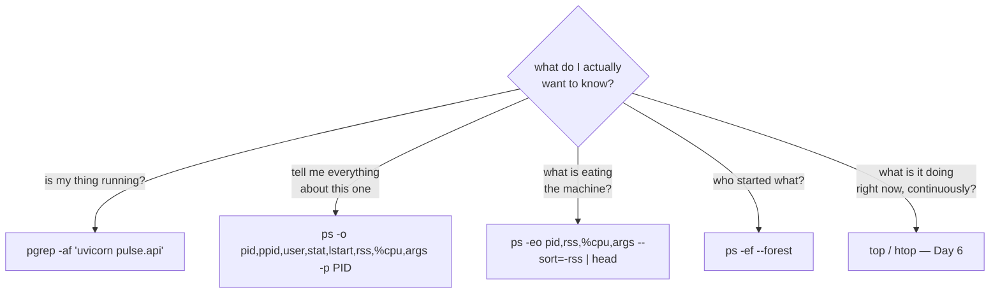

# 1.3 — Reading `ps`, and finding your service when you have lost it

## One-line answer

`ps` is the one command that turns "something is wrong with the machine" into "this specific activity,
started at this time, by this user, with these arguments", and the skill is not typing it but choosing
the columns that answer the question you actually have.

---

## The story

🎬 **The scene.** Three in the morning in a block of flats, and the fire alarm is going off. A new
caretaker runs up the stairs towards the noise, finds a corridor of eight identical doors, and stands
there.

The caretaker who has done the job for years does not go up at all. He goes to the panel in the lobby,
which lists every zone in the building, which one triggered, and at what time. Ten seconds later he is
at the right door.

😬 **The naive fix.** Fit a louder alarm, so that the right flat is more obvious.

💥 **Why it fails.** The alarm has already told you that something is wrong. It cannot tell you *which*
of the eight situations you are in, because it does not know the difference between a flat with a burnt
slice of toast in it and a flat with nobody home. Louder does not become more specific.

💡 **The insight.** In an emergency, the useful information is almost never the alarm. It is the
**inventory**: what is here, since when, whose it is, and what it was doing. The person who reads the
panel first looks slower for ten seconds and is faster by minutes.

---

## The idea in plain language

`ps` prints a table. Each row is one process that exists right now, and each column is one fact about
it. That is the entire idea.

What makes it awkward is history. There are two ancient traditions of `ps`, one from BSD Unix and one
from System V Unix, and Linux implements both at once. So `ps aux` and `ps -ef` do almost the same
thing with different spellings, `ps aux` has no dash and `ps -ef` does, and neither of them is
"correct". You will see both in every runbook you ever read, so you should be able to read both, and
you should type neither.

**What you should type instead is `ps -o`**, which says: give me exactly these columns. The reason is
not tidiness. It is that a default column set is a guess about your question, and it is usually the
wrong guess, because the defaults leave out the parent, leave out the start time, leave out memory, and
truncate the command line, which are four of the five things you actually want.

### The columns worth knowing, and what question each one answers

| Column | Prints | The question it answers |
| --- | --- | --- |
| `pid` | the process identifier | which activity am I talking about? |
| `ppid` | the parent's identifier | who started this, and is anybody watching it? ([1.2](1.2-pid-parent-and-the-process-tree.md)) |
| `user` | the owning user | what is it allowed to do? (Day 5, section 2) |
| `stat` | the process state | is it running, waiting, stopped or dead? ([1.4](1.4-process-states-and-the-d-that-will-not-die.md)) |
| `lstart` | the full start timestamp | is this the version I just deployed? |
| `etime` | elapsed time since it started | how long has this been going on? |
| `rss` | resident memory, in kibibytes | how much physical memory is it holding? (Day 6, part 1.2) |
| `%cpu` | share of processor time | is this the thing burning the machine? (Day 6, section 2) |
| `args` | the full command line | what was it actually told to do? |

**`lstart` and `args` are the two that beginners leave out and professionals always include.** `lstart`
matters because comparing a process's birthday against your deploy time settles the single most common
false diagnosis in operations, from [1.1](1.1-a-process-is-not-a-program.md). `args` matters because
the command line is often the only surviving record of intent, since it tells you which config file,
which port, which worker count and which environment, and those are facts that exist nowhere else once
the terminal is gone.

### The difference between `ps` and everything that looks like it

`ps` is a **snapshot**. It reads the process table once and prints it. It tells you what is true at one
instant and nothing at all about a trend.

`top`, and `htop`, are the opposite. They re-read continuously and sort by resource use, which makes
them good for *"what is eating this machine right now"* and bad for *"what was true when the alert
fired"*. Day 6 uses them properly.

The distinction matters more than it sounds. A snapshot can be pasted into an incident record, and an
incident record with a `ps` line in it is evidence. A screen that refreshes every second cannot be
pasted anywhere, and the thing you saw is gone.

---

## Why Kriya needs it

Day 6 asks you to explain a memory number, and the first step is always `ps -o pid,rss,args` on the
right process, because you cannot reason about a resource until you can name the consumer.

Day 30 is the container failure lab, where a container is running and the service inside it is not. The
tool that tells those two situations apart is `ps` run *inside* the container, comparing what you
expected PID 1 to be against what it actually is.

Day 62 makes `pulse` expose its first metrics, and one of the earliest is process start time. That
metric exists because the `lstart` column is so useful that people got tired of running `ps` by hand
and standardised it. The metric is this column, scraped.

Day 84, the incident lab, gives you a symptom and no cause. Every path through that day starts with an
inventory command, because you cannot triage what you cannot enumerate.

---

## The mechanism

Start `pulse` if it is not running, and then build up the command that actually answers a question.

**The wrong first instinct, which is to grep for the name.**

```bash
ps -ef | grep uvicorn
```

**Line by line:** `-e` for every process, `-f` for the full format, and then filter the text. It works,
and it has a flaw you will hit every single time.

```text
nisha      27431   26902  0 09:38 pty0     00:00:01 python .venv/Scripts/uvicorn pulse.api:app --host 127.0.0.1 --port 8000
nisha      27998   26902  0 09:44 pty0     00:00:00 grep uvicorn
```

**The second row is the `grep` itself.** It matched because its own command line contains the word you
searched for. That is harmless when you are reading with your eyes and actively dangerous the moment
you put it in a script, because a pipeline that counts matches always finds at least one, so "is the
service running" answers *yes* forever, including after the service has died.

**The fix, and why it is spelled that way.**

```bash
ps -ef | grep '[u]vicorn'
```

**Line by line:** `[u]vicorn` is a character class containing exactly one character, so it matches the
literal text `uvicorn`, and the `grep` process's own command line contains the *brackets*, so it does
not match itself. It is a trick, it is universal, and it is worth knowing because you will read it in
other people's scripts.

```text
nisha      27431   26902  0 09:38 pty0     00:00:01 python .venv/Scripts/uvicorn pulse.api:app --host 127.0.0.1 --port 8000
```

**The better tool for the same job.**

```bash
pgrep -af uvicorn
```

**Line by line:**

- `pgrep` searches the process table directly rather than searching text output, so it cannot match
  itself and needs no bracket trick.
- `-a` prints the full command line alongside the PID instead of the PID alone.
- `-f` matches against the **whole command line** rather than just the executable name. That matters
  enormously here, because the executable is `python` and the word `uvicorn` appears only in the
  arguments. Without `-f` this command finds nothing at all, which is a confusing way to conclude that
  your service is down.

```text
27431 python .venv/Scripts/uvicorn pulse.api:app --host 127.0.0.1 --port 8000
```

**Now the inventory command worth memorising.**

```bash
ps -o pid,ppid,user,stat,lstart,rss,%cpu,args -p "$(pgrep -f 'uvicorn pulse.api' | head -1)"
```

**Line by line:**

- `-o pid,ppid,user,stat,lstart,rss,%cpu,args` gives the facts from the table above, in the order you
  read them: identity, ancestry, authority, state, age, memory, processor, intent.
- `args` goes **last** deliberately. It is the only variable-width column, so anything after it gets
  pushed around and becomes hard to read or to parse.
- `pgrep -f 'uvicorn pulse.api'` matches on a phrase specific enough to exclude an editor window that
  happens to have the word open. Being specific in the pattern is cheaper than filtering afterwards.
- `| head -1` means that if there are somehow two, you take one and move on, because you are diagnosing
  rather than enumerating. When you *do* want all of them, drop this and use
  `-p "$(pgrep -f ... | paste -sd,)"`.

Observed on **2026-08-24**:

```text
    PID    PPID USER     STAT                  STARTED   RSS %CPU COMMAND
  27431   26902 nisha    S    Mon Aug 24 09:38:12 2026 61284  0.3 python .venv/Scripts/uvicorn pulse.api:app --host 127.0.0.1 --port 8000
```

**Read it left to right as a sentence.** Process 27431, created by your shell 26902, owned by you,
sleeping, started at 09:38:12 this morning, holding about 60 MB of physical memory, using essentially
no processor, and told to serve `pulse.api:app` on loopback port 8000.

Every one of those clauses is something you would otherwise have had to guess.

### Sorting, for when you do not know what you are looking for

```bash
ps -eo pid,ppid,stat,rss,%cpu,args --sort=-rss | head -12
```

**Line by line:**

- `-e` means every process, because the premise here is that you do not know which one matters.
- `--sort=-rss` sorts by resident memory, with the `-` meaning descending. It is the single most useful
  sort in operations, because "the machine is slow" is usually "one process is holding all the memory".
- `head -12` gives the header plus eleven rows. Beyond about ten rows you are reading rather than
  triaging.

```text
    PID    PPID STAT   RSS %CPU COMMAND
   2104    1988 Sl  1842316  4.1 /opt/Microsoft/msedge/msedge
   3320    1988 Sl   612440  1.2 /opt/Microsoft/msedge/msedge --type=renderer
  27431   26902 S     61284  0.3 python .venv/Scripts/uvicorn pulse.api:app --host 127.0.0.1 --port 8000
```

**Note where `pulse` sits.** About 60 MB, third on the list, thirty times smaller than a browser. Write
that number down, because Day 6 asks you to reason about it, and Day 109 will change it by an order of
magnitude when a model gets loaded into that same process.

Swap the sort key to find a different kind of problem.

```bash
ps -eo pid,stat,etime,%cpu,args --sort=-%cpu | head -6
```

**Line by line:** the same shape, sorted by processor share instead. `etime` replaces `rss` because
when you are chasing processor use, *how long it has been doing that* is the follow-up question. A
process at 100% for three seconds is working, and one at 100% for three days is stuck.



---

## When it breaks

**`pgrep` finds nothing and the service is running.** This is the commonest `pgrep` mistake.

```text
$ pgrep uvicorn
$ echo $?
1
```

The output is empty and the exit code is 1.

**What it says:** no process matched.

**What it actually means:** no process whose *executable name* is `uvicorn`. The executable is `python`
and `uvicorn` is an argument, and without `-f`, `pgrep` never looks at the arguments.

**The smallest fix:** `pgrep -f uvicorn`. **The lesson worth keeping:** an empty result from a process
search is not evidence of absence until you know what the search was matching against.

**`ps` truncates the thing you needed.** You run a plain `ps aux`, and the answer is cut off at the
terminal width.

```text
nisha    27431  0.3  0.5 412048 61284 pty0     S    09:38   0:01 python .venv/Scripts/uvicorn pulse.api:app --host 127.0.
```

**What it says:** the command line, ending mid-word.

**What it actually means:** `ps` is formatting for your terminal and has thrown the rest away. The port,
the worker count and the config path, which are the arguments most likely to be the cause, are exactly
the ones at the end and exactly the ones cut.

**The smallest fix:** `ps -eo args --no-headers -p PID | cat`, or add `-ww`.

```bash
ps -ww -o pid,args -p 27431
```

**Line by line:** `-ww` means "unlimited width, twice", where one `w` widens and two removes the limit
entirely. Piping to `cat` achieves the same thing by convincing `ps` that it is not writing to a
terminal. Use one of them any time you are reading a command line that matters.

**The PID that is now somebody else.** This is the subtle one, and it is why scripts that store a PID
and act on it later are dangerous.

```text
$ ps -o pid,lstart,args -p 27431
    PID                  STARTED COMMAND
  27431 Mon Aug 24 11:02:55 2026 /usr/bin/git status
```

**What it says:** process 27431 is `git status`.

**What it actually means:** your server ended and the kernel later reused the number. PIDs are
recycled, because they are unique among *living* processes and never across time. Anything that saved
`27431` five minutes ago and sends a kill to it now is killing an innocent bystander.

**The smallest fix when it matters:** check `lstart` and `args` before acting on a stored PID, or stop
using PIDs entirely and let a supervisor own the lifecycle, which is Day 25. This is one of several
reasons the industry moved to process managers rather than PID files.

---

## In production

**What a professional writes instead of the teaching version.** They keep two commands in muscle memory
and stop improvising: one `pgrep -af <pattern>` to confirm existence, and one long `ps -o ...` with
`lstart` and `args` to get the full identity. They also paste the output into the incident record
before they change anything, because `ps` output is *evidence with a timestamp* and it stops existing
the moment the process does. An incident write-up saying "the process was using a lot of memory" is
worth much less than one containing the row.

**What degrades at scale.** `ps` only sees one machine, and by Day 33 the thing you care about is spread
over several. The `ps` skills transfer directly, because `kubectl get pods -o wide` is an inventory
command with columns, and the columns you want are the same ones: identity, age, state, node, restart
count. But the *reflex* has to change from "log in and run `ps`" to "query the control plane", because
logging into machines to run `ps` does not scale past a handful and is often not permitted at all. Day
62 finishes the transition by turning these facts into metrics that are collected without anybody
logging in anywhere.

**The failure that only shows with real traffic.** The process that looks fine in `ps` and is useless.
`ps` reports existence, memory and processor, and none of those is the same as *serving requests
successfully*. A process that has deadlocked shows `S` for sleeping, 0% processor and stable memory,
which is indistinguishable in `ps` from a healthy idle process. **This is the honest limit of the
tool**, and it is precisely why Day 73's service level objectives measure request success rather than
process health. `ps` tells you what exists, and only the request path tells you whether it works.

**The review comment a senior engineer leaves.** *"This health script does `ps -ef | grep myapp | wc
-l` and compares it to 1. That always returns at least one because of the grep itself, so it can never
report down. Use `pgrep -f`, and check the exit code rather than counting lines."*

**The signal you would alert on.** Not `ps` output directly, because it is a manual snapshot, and the
point of Day 62 is to stop needing it. The metrics that come from these columns and *are* worth
alerting on are **process start time**, to detect instances older than the current release, **resident
memory as a fraction of the limit**, which is Day 6, and **restart count**, which is Day 30. You would
**not** alert on process count alone, because a service with a worker pool changes its process count
constantly and legitimately, and alerting on it produces noise that teaches people to ignore alerts.

**Blast radius.** `ps` and `pgrep` are read-only, so they cannot change anything, and their worst case
is a confusing table. **The blast radius arrives when you pipe them into something that acts**, and the
classic is `pkill -f <pattern>`, which kills *everything matching* and has taken out unrelated services
on shared machines when the pattern was broader than the author realised. Anybody who runs the pipeline
can trigger it. What bounds it is running the `pgrep` first and reading the list before you replace it
with `pkill`. **Never let the first time you see the match set be the moment it dies.**

**Cost.** `0` model calls, `0` tokens, `0` CI minutes, `0` disk and no measurable memory. Reading the
process table on this machine covers a few hundred entries and returns immediately. Running it in a
tight loop is the only way to make it cost anything, which is what monitoring agents do carefully and
what a `while true` loop does badly.

**The interview question.** *"A machine is slow. You have a shell and nothing else. What do you run?"*
The answer that lands is ordered and explains the ordering: *"First `ps -eo pid,ppid,stat,rss,%cpu,args
--sort=-rss | head` to see whether one process is holding the memory, then the same sorted by `%cpu`,
because those two cover most of it and both are snapshots I can paste into the incident. Then `ps -o
lstart` on whatever I found, because the start time usually tells me whether this began with the
deploy. I would reach for `top` only if I needed to watch it change, and I would want the snapshot
first so that I have evidence."* The ordering is the answer, and the tools are just vocabulary.

---

## Check yourself

```bash
pgrep -af 'uvicorn pulse.api' && ps -ww -o pid,ppid,stat,lstart,rss,%cpu,args -p "$(pgrep -f 'uvicorn pulse.api' | head -1)"
```

One line that answers *does it exist* and then *what exactly is it*. The `&&` means the second half only
runs if the first found something, so a dead service produces silence and a non-zero exit rather than a
confusing error, which is exactly the behaviour you want when this ends up inside a script.

**Say out loud, without scrolling up:** *name the two `ps` columns most people leave out, and say what
false conclusion each one prevents.*
