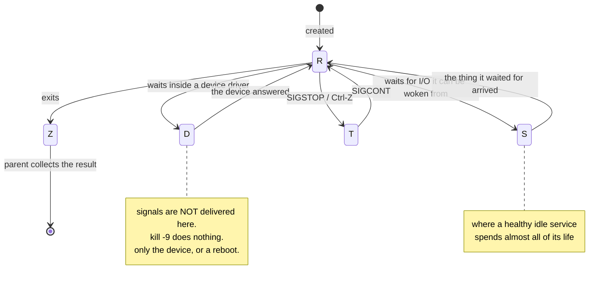

# 1.4 — Process states, and the `D` that will not die

## One-line answer

A process is almost never "running" — it is in one of a small set of states, and the state tells you
whether it is using the processor, waiting for something, ignoring you, or already dead, which is four
completely different problems wearing the same symptom.

---

## The story

🎬 **The scene.** A café with one member of staff and four customers standing at the counter, none of
them being served.

The first is waiting to be asked what she wants. The second has ordered and is waiting for the coffee
machine. The third has been told the card machine is offline and is standing there because leaving
feels rude. The fourth has already paid, collected her coffee, and is standing at the counter because
she is texting.

😬 **The naive fix.** The manager sees four people not moving and hires a second member of staff.

💥 **Why it fails.** Only one of the four was blocked on staff availability. Doubling the staff serves
the first customer faster and does nothing at all for the other three, because their problems are the
machine, an external system, and a person who is not actually waiting for anything. The queue looks the
same from the doorway and has four different causes.

💡 **The insight.** *"Not making progress"* is a symptom, not a diagnosis. The useful question is
**what specifically is each one waiting for** — and until you can distinguish those, every fix you try
is a guess with a one-in-four chance.

---

## The idea in plain language

At any instant, a process on Linux is in one of a handful of states. The kernel tracks this because it
has to: with four processor cores and hundreds of processes, it needs to know which ones are even
*candidates* for running.

`ps` prints the state in the `stat` column as a single letter, sometimes followed by extra letters that
are flags rather than states.

| Letter | Name | What it means, plainly |
| --- | --- | --- |
| `R` | running or runnable | using a processor right now, or ready to and waiting only for a free core |
| `S` | interruptible sleep | waiting for something, and **can be woken by a signal** |
| `D` | uninterruptible sleep | waiting for something, and **cannot be woken by anything** |
| `T` | stopped | suspended, deliberately, and not being scheduled at all |
| `Z` | zombie | finished, but its parent has not collected the result yet |
| `I` | idle | a kernel thread with nothing to do (Linux 4.2 and later) |

Extra characters may follow the state letter: `s` means it is a session leader, `l` means it is
multi-threaded, `+` means it is in the foreground of a terminal, `<` and `N` describe scheduling
priority. So `Sl+` reads as *sleeping, multi-threaded, in the foreground* — three facts, not one state.

### The two that people confuse, and the one distinction that matters

Almost every process on a healthy machine is in `S`. Your service spends nearly all of its life there,
waiting for a request to arrive. **`S` is not a problem. `S` is the normal state of a working
service.** A newcomer looking at `ps` and seeing `S` everywhere often concludes the machine is asleep;
it is doing exactly what it should.

`R` is comparatively rare, because a process only occupies a core for the microseconds it is actually
computing. Seeing sustained `R` on one process is meaningful — it means genuine processor work, which
Day 6 goes into.

**`D` is the one worth this entire part.** It also means "waiting", but with one devastating extra
property: the process cannot be interrupted. Not by `Ctrl-C`. Not by `kill`. **Not by `kill -9`.** The
whole of section [2](../02-signals/2.1-what-a-signal-actually-is.md) is about sending signals to
processes, and a process in `D` will not receive any of them until it leaves that state on its own.

Why does such a state exist? Because some waits happen in the middle of an operation that cannot safely
be abandoned half-done — typically a read or write against a device driver. If the kernel let you
interrupt a process while a disk controller was part-way through a transfer, the kernel's own data
structures would be left inconsistent. So it marks the process uninterruptible and refuses to deliver
anything until the device answers.

Which is fine when the device answers. **The problem is a device that does not** — a failing disk, a
network filesystem whose server has gone away, a storage volume that has been detached underneath a
running machine. Then the process sits in `D` indefinitely, immune to every tool you have, and the only
remedies are fixing the device or rebooting the machine.

### `T` and `Z`, briefly, because they look alarming and usually are not

`T` means stopped. You did this — with `Ctrl-Z`, or a debugger, or a deliberate `kill -STOP`. It is
frozen, holding all its memory and its ports, being given no processor time whatsoever. It resumes when
told to. Part [2.4](../02-signals/2.4-the-signals-you-cannot-catch.md) covers the mechanism, because
`SIGSTOP` is the *other* signal that cannot be caught.

`Z` means finished-but-not-collected. A zombie is not running, uses no processor and holds no memory —
it is a record, not an activity. One zombie is meaningless. A growing count of them means a parent has
stopped doing its job, which is part
[4.3](../04-the-service-died/4.3-zombies-orphans-and-pid-1.md).

---

## Why Kriya needs it

Day 6 asks you to interpret a slow machine. A machine where processes sit in `D` and a machine where
they sit in `R` are two entirely different incidents — one is storage, one is processor — and the state
column is the fastest way to tell them apart, faster than any dashboard.

Day 30's container failure lab includes a container that will not stop. One of the causes is a process
in `D` inside it, and the symptom is a `docker stop` that hangs until the timeout and then reports
success while the process is still there.

Day 41 lets a liveness probe restart a container. A process stuck in `D` fails its probe, gets
restarted, and the restart does not work — because the kill cannot be delivered. That is
`CrashLoopBackOff`'s ugly cousin, and it is on Day 41's failure list for exactly this reason.

Day 118 monitors a model server whose inference blocks on reading a large file from a mounted volume.
If that volume stalls, the symptom is `D`, the latency graph goes flat rather than up, and the
instinct — restart it — does not work.

---

## The mechanism

Look at the state of your own service, then produce three of the states deliberately.

```bash
ps -o pid,stat,wchan:20,args -p "$(pgrep -f 'uvicorn pulse.api' | head -1)"
```

**Line by line:**

- `stat` — the state letter plus its flags, as above.
- `wchan:20` — **the new column, and the useful one.** `wchan` is the *wait channel*: the name of the
  kernel function the process is currently sleeping inside. It converts "it is waiting" into "it is
  waiting for **this**". The `:20` sets the column width, because these names are long and the default
  truncates them into uselessness.
- Note the ordering: state, then reason for the state, then identity. That is the order you read them
  in.

Observed on **2026-08-24**:

```text
    PID STAT WCHAN                COMMAND
  27431 Sl   ep_poll              python .venv/Scripts/uvicorn pulse.api:app --host 127.0.0.1 --port 8000
```

**`Sl` and `ep_poll` together are a complete sentence.** Sleeping, multi-threaded, and specifically
asleep inside the kernel's event-polling call — which is precisely what a server with no traffic should
be doing: parked, waiting for a connection to arrive, costing nothing. If you learn to recognise one
`wchan` value in your life, make it this one, because it is what "a healthy idle server" looks like
from the outside.

### Produce `R` on purpose

```bash
python -c "
while True:
    pass
" &
BUSY=$!
sleep 1
ps -o pid,stat,%cpu,wchan:20,args -p "$BUSY"
```

**Line by line:**

- `python -c "while True: pass"` — a loop that computes nothing and never sleeps. This is the smallest
  possible processor-bound process.
- `&` and `BUSY=$!` — background it and capture the PID, as in
  [1.2](1.2-pid-parent-and-the-process-tree.md).
- `sleep 1` — give the scheduler a moment before measuring, because `%cpu` is an average since start
  and reading it instantly gives a meaningless number.

```text
    PID STAT %CPU WCHAN                COMMAND
  30455 S    98.7 -                    python -c \nwhile True:\n    pass\n
```

**Two things to notice, and one of them is a trap.** `%CPU` is 98.7 — this process is genuinely
consuming a core. But `STAT` says `S`, not `R`, and `WCHAN` is `-`.

That is not a mistake. `ps` samples the state at the instant it looks, and a process being timesliced
across four cores is `R` only during the slices it actually holds a core. The `-` in `wchan` is the
real tell: **it is not sleeping on anything**, which is what distinguishes a busy process from an idle
one far more reliably than the state letter. Run the command a few times and you will see the letter
flip between `R` and `S` while `%CPU` stays pinned.

**Clean up before you continue:**

```bash
kill "$BUSY"
```

**Line by line:** `kill` sends the polite termination request covered in
[2.2](../02-signals/2.2-sigterm-and-sigkill-the-request-and-the-order.md). A Python loop with no
handler takes it and stops. Do this now — a spinning process on a four-core machine will distort every
measurement you take for the rest of the day.

### Produce `T` on purpose

```bash
kill -STOP "$(pgrep -f 'uvicorn pulse.api' | head -1)"
ps -o pid,stat,wchan:20,args -p "$(pgrep -f 'uvicorn pulse.api' | head -1)"
curl -sS -m 3 -o /dev/null -w 'healthz -> %{http_code}\n' http://127.0.0.1:8000/healthz
```

**Line by line:**

- `kill -STOP` — send the suspend signal. This is not termination; it freezes the process where it
  stands, keeping every byte of its memory and every one of its open connections.
- The `ps` confirms the new state before you test the consequence, so you know the setup worked.
- `curl -m 3` — **`-m` is essential here.** It caps the whole operation at three seconds. Without it,
  this `curl` waits on a connection that will never be answered, and you sit there wondering whether
  the command is broken. Day 7, section 4 is entirely about this instinct.

```text
    PID STAT WCHAN                COMMAND
  27431 Tl   do_signal_stop       python .venv/Scripts/uvicorn pulse.api:app --host 127.0.0.1 --port 8000
curl: (28) Operation timed out after 3001 milliseconds with 0 bytes received
```

**Read the pair together.** The process exists, holds its memory, and still owns port 8000 — so the
connection is *accepted* by the kernel and then nothing ever answers it. From the client's side this is
indistinguishable from a hung server. From `ps` it is obvious in one letter.

**This is the most valuable thing in this part**, because it is a perfect miniature of the failure mode
Day 41 calls "the health check that passes on a useless process". The port is open, the process is
alive, and no request will ever complete.

Bring it back:

```bash
kill -CONT "$(pgrep -f 'uvicorn pulse.api' | head -1)"
curl -sS -m 3 -o /dev/null -w 'healthz -> %{http_code}\n' http://127.0.0.1:8000/healthz
```

**Line by line:** `-CONT` is the resume signal, the counterpart to `-STOP`. The process picks up
exactly where it was — including, on a real server, part-way through requests whose clients gave up
long ago. The `curl` afterwards is the proof that resumption worked, not decoration.

```text
healthz -> 200
```



---

## When it breaks

**The process that ignores `kill -9`.** The one everybody hears about and few have seen. Observed on a
machine whose network filesystem server had gone away:

```text
$ ps -o pid,stat,wchan:24,args -p 4412
    PID STAT WCHAN                    COMMAND
   4412 D    nfs_wait_bit_killable    cp /mnt/share/model.bin /tmp/
$ kill -9 4412
$ ps -o pid,stat -p 4412
    PID STAT
   4412 D
```

**What it says:** `kill -9` succeeded — it printed nothing and returned zero — and the process is still
there.
**What it actually means:** the signal was *recorded* but cannot be *delivered*, because a process in
`D` is not in a position to be interrupted. `kill` returning success means "the kernel accepted your
request", never "the process died". The `wchan` names the culprit exactly: it is blocked inside the
network filesystem client.
**The smallest fix:** there is not one at the process level, and that is the lesson. You fix the
device: restore the server, or force-unmount the filesystem with `umount -f`, or reboot. **A process in
`D` is not a process problem.** The single most useful thing you can do is read `wchan`, because it
tells you which subsystem to go and look at.

**The state that changes while you read it.** You run `ps` twice and get two different answers:

```text
$ ps -o pid,stat -p 30455
    PID STAT
  30455 R
$ ps -o pid,stat -p 30455
    PID STAT
  30455 S
```

**What it says:** the process changed state between two commands.
**What it actually means:** nothing is wrong. `ps` is a snapshot
([1.3](1.3-reading-ps-and-finding-your-service.md)), and states change thousands of times a second.
**The smallest fix:** stop treating a single sample as a measurement. If you need to know how a process
*spends* its time rather than where it was at one instant, sample repeatedly, or use the accounting
counters Day 6 introduces. **One `ps` tells you the state; only many of them tell you the behaviour.**

**Zombies that look like a leak and are not.** You find a screenful of `Z`:

```text
$ ps -eo pid,ppid,stat,args | awk '$3 ~ /^Z/'
  31002   30988 Z    [python] <defunct>
  31003   30988 Z    [python] <defunct>
  31004   30988 Z    [python] <defunct>
```

**What it says:** three defunct processes, all with the same parent.
**What it actually means:** they are finished and consume no memory or processor — `<defunct>` and the
square brackets mean there is nothing left but the record. **The problem is not the zombies; it is
process 30988**, which created three children and never collected their results. The fix is always in
the parent, never in the zombie: you cannot kill a zombie, because it is already dead.
**The smallest fix:** end or fix the parent. When the parent goes, PID 1 adopts the zombies and reaps
them immediately. Part [4.3](../04-the-service-died/4.3-zombies-orphans-and-pid-1.md) explains why
this is a container-shaped problem specifically.

---

## In production

**What a professional writes instead of the teaching version.** They read the state column *first*,
before latency graphs, because it partitions the problem in one glance: `R` means go look at processor
and code, `D` means go look at storage or the network filesystem, `T` means somebody or something
suspended it, `Z` means a parent is not reaping. That partition takes a second and eliminates three
quarters of the search space, which is why experienced operators run `ps` before they open a dashboard.

**What degrades at scale.** Individual states stop being readable and the *aggregate* becomes the
signal. Nobody looks at one process's state across a fleet; they look at the count of processes in `D`
per machine, which is a direct measure of storage trouble, and at run-queue length, which is a direct
measure of processor contention. Day 6 introduces pressure stall information, which is exactly this
idea done properly by the kernel: instead of you sampling states, the kernel tells you what fraction of
time tasks spent stalled on each resource.

**The failure that only shows with real traffic.** `D` under concurrency. One process reading from a
degraded disk is slow. A hundred worker processes all blocking on the same degraded disk is a machine
that appears completely healthy by every metric you normally watch — the processor is idle (they are
not computing), memory is stable (nothing is allocating), the processes exist, and the ports are open —
and serves nothing at all. **A flat processor graph during an outage is one of the strongest hints of a
`D` problem**, and it is exactly the shape that a processor-and-memory dashboard is blind to.

**The review comment a senior engineer leaves.** *"Your restart script does `kill -9` and then assumes
the process is gone. Check that the PID actually disappeared before you start the replacement — if the
old one was blocked on I/O it is still holding the port, and your new instance will fail to bind and
crash-loop while the real problem is a disk."*

**The signal you would alert on.** Not process state directly, but two aggregates derived from it:
**count of processes in `D` on a machine**, sustained — a handful transiently is normal, a sustained
double-digit count means storage is failing and you want to know before the service does; and
**zombie count trend**, because it only ever grows when something is broken and it eventually exhausts
the process table. You would **not** alert on `R` — a process using a processor is a process doing its
job — nor on `T`, which is almost always a human with a debugger.

**Blast radius.** This part introduces `kill -STOP`, which is a genuine new capability and a dangerous
one. Worst case: you freeze a process that holds a lock, a port, or an open transaction, and everything
depending on it hangs — while every "is the process alive" check keeps saying yes, so nothing alerts
and nothing self-heals. Who can trigger it: any user who owns the process, plus root for anything.
What bounds it today: `pulse` holds no locks and has no users, and `SIGCONT` reverses it completely.
**What would bound it in production is that you would never do it there** — `SIGSTOP` on a live service
is a debugging tool of last resort, and the safer version is to remove the instance from the load
balancer first so it is not holding requests hostage while you look at it.

**Cost.** `0` model calls, `0` tokens, `0` CI minutes, `0` disk. Reading state costs nothing. **The
processor-burning loop in the mechanism above costs one full core for as long as you leave it running**
— on a four-core machine that is a quarter of your capacity, so kill it, and note that this is the
first command in this curriculum that has a real resource cost while it runs.

**The interview question.** *"You run `kill -9` and the process is still there. What is going on?"*
The answer that lands is specific rather than mystical: *"It is almost certainly in uninterruptible
sleep — state `D` — blocked inside a driver, usually storage or a network filesystem. Signals are not
delivered in that state, so `kill -9` is queued and never acted on. `kill` returning success only means
the kernel accepted the request. I would read `wchan` to find out which subsystem it is stuck in and go
fix that, because there is no process-level remedy short of a reboot."* Then the honest caveat: *"the
other possibility is that it is already a zombie and I am trying to kill something that has already
exited — `ps` shows `Z` and `<defunct>`, and the fix is in the parent."*

---

## Check yourself

```bash
ps -eo stat --no-headers | cut -c1 | sort | uniq -c | sort -rn
```

A one-line census of every process state on your machine. `cut -c1` takes only the state letter and
discards the flags, so `Sl+` and `Ss` both count as `S`. You should see `S` dominate overwhelmingly,
`I` for kernel threads, a small number of `R`, and ideally **no `D` and no `Z` at all** — that is what
a healthy machine looks like, and knowing its normal shape is what lets you notice an abnormal one.

**Say out loud, without scrolling up:** *your service is not responding and the processor graph is
completely flat. Name the state you suspect, the column that would confirm it, and why restarting will
not help.*
