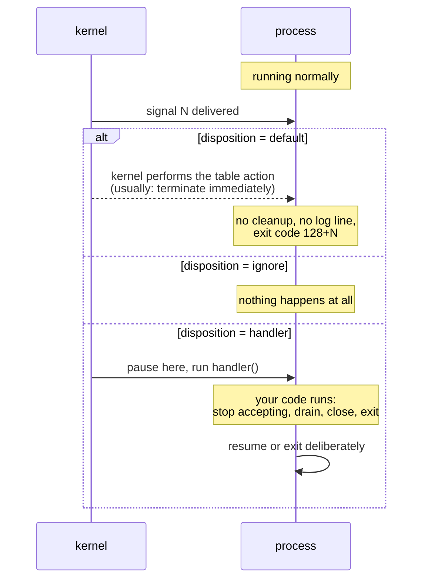

# 2.1 — What a signal actually is

## One-line answer

A signal is a single number delivered to a running process by the kernel, carrying no message and no
data. It is a doorbell with a fixed set of rings, and everything an operator does to a live process is
one of those rings.

---

## The story

🎬 **The scene.** The dashboard of a car. There is a row of little symbols, and each one can be off,
amber or red. Amber means look into this soon. Red means stop the car now.

The lights carry no words. There is no way for the car to light the oil symbol and add "you are about
half a litre low, and there is a garage in four miles". The whole vocabulary is the set of symbols
printed on the dashboard, agreed in advance by everybody who makes cars.

😬 **The naive fix.** Somebody wants to send a longer message, so they invent a code. Two quick flashes
of the amber light means one thing, and three means another.

💥 **Why it fails.** The driver is watching the road. She catches the second flash and not the first, or
sees them run together into one. Worse, if the car flashes twice while she is overtaking and not
looking down, she sees a single amber when she finally glances at it. **The lights were never a
channel. They have no memory and no queue.** They only ever tell you the *current situation*, not how
many times it changed.

💡 **The insight.** Some ways of communicating carry content, and some carry only *notification*. A
notification is fast, cheap and impossible to misroute, and the price is that it can say nothing beyond
the fixed vocabulary, and that identical notifications can collapse into one. Trying to build a
conversation on top of it is how people get hurt.

---

## The idea in plain language

A **signal** is the oldest way for one process to communicate with another in Unix, and the simplest.
It is a small integer, delivered by the kernel to a process, chosen from a list that has been fixed for
decades.

Verified against `man7.org/linux/man-pages/man7/signal.7.html` on **2026-08-24**, here are the ones an
operator meets.

| Name | Number | Default action | What it conventionally means |
| --- | --- | --- | --- |
| `SIGHUP` | 1 | terminate | "hangup detected on controlling terminal or death of controlling process" |
| `SIGINT` | 2 | terminate | "interrupt from keyboard", which is `Ctrl-C` |
| `SIGQUIT` | 3 | terminate and dump core | "quit from keyboard" |
| `SIGKILL` | 9 | terminate | "kill signal", and it cannot be caught |
| `SIGSEGV` | 11 | terminate and dump core | "invalid memory reference" |
| `SIGPIPE` | 13 | terminate | "broken pipe: write to pipe with no readers" |
| `SIGTERM` | 15 | terminate | "termination signal", the polite one |
| `SIGCHLD` | 17 | ignore | "child stopped, terminated, or continued" |
| `SIGCONT` | 18 | continue | resume a stopped process |
| `SIGSTOP` | 19 | stop | "stop process", and it cannot be caught |

**The numbers are not decoration.** They come back in section
[3](../03-exit-codes/3.2-128-plus-n-when-a-signal-becomes-an-exit-code.md), where a process killed by
signal *N* reports exit code `128 + N`, which is why `137` and `143` are numbers you will learn to read
on sight.

### What "delivered" actually means

When a signal arrives, the kernel interrupts the process, literally between two machine instructions,
and does one of three things depending on what the process has arranged in advance. That arrangement is
called the **disposition**.

1. **The default action.** The process said nothing about this signal, so the kernel does what the table
   says. For most signals that means terminating the process immediately.
2. **Ignore.** The process asked for this signal to be discarded, so nothing happens at all.
3. **A handler.** The process registered a function to be called. The kernel pauses whatever it was
   doing, runs that function, and then resumes. This is how graceful shutdown works, in
   [2.3](2.3-catching-a-signal-in-python.md).

**A process that has not thought about signals gets option 1 for everything**, which is why an
unprepared program dies instantly and without cleanup the first time anybody tries to stop it politely.
That is the entire problem this section exists to fix.

### The three properties that surprise people

**A signal carries no payload.** There is no "shut down because we are deploying" as opposed to "shut
down because you are using too much memory". The process receives a number and has to infer everything
else. That is why `SIGTERM` conventions matter so much: the meaning lives in shared convention rather
than in the message.

**Signals are not queued.** If ten identical signals arrive while the process is not in a position to
handle them, it sees *one*. The kernel tracks "is this signal pending" as a single bit rather than as a
count. So a handler that assumes it will be called once per event is wrong, and code that counts signals
is broken by design. Real-time signals, numbered 32 and above, do queue, and you will not need them, so
knowing they exist is enough.

**Dispositions are inherited, but not uniformly.** The manual page is precise about this, and the
asymmetry catches people out. Verbatim: *"A child created via fork(2) inherits a copy of its parent's
signal dispositions."* And then: *"During an execve(2), the dispositions of handled signals are reset to
the default; the dispositions of ignored signals are left unchanged."*

Read that twice. **Handlers do not survive starting a new program, and ignores do.** So a shell script
that ignores `SIGTERM` and then runs your server hands your server a permanently ignored `SIGTERM`, and
your service becomes unstoppable by normal means for a reason that is nowhere in its own source code.
This is a genuine production bug, and it is nearly impossible to find if you do not know that sentence
exists.

### Who can send a signal

Not everybody to everybody. The rule is ownership: you may signal a process you own, and the root user
may signal anything. The kernel itself sends signals too, and those are the interesting ones. `SIGSEGV`
arrives when a program touches memory it does not own, `SIGPIPE` when it writes to a connection the
other side has closed, and `SIGKILL` from the out-of-memory killer, which is the whole of Day 6,
section 4.

---

## Why Kriya needs it

Day 26 sets a container restart policy and Day 30 breaks it. Both revolve around what a runtime sends
when it wants a container to stop and what the process inside does about it, which is this part, twice.

Day 41 gives a Kubernetes probe the power to terminate a container. That termination is a signal, sent
to PID 1 inside the container, followed by a grace period and then an uncatchable one. Every argument on
that day about `terminationGracePeriodSeconds` is an argument about the gap between those two signals.

Day 19 is *"rollback is a feature"*, and a rollback that drops in-flight requests is not one. Draining
cleanly on shutdown starts with catching a signal, which is part
[4.1](../04-the-service-died/4.1-graceful-shutdown-for-pulse.md).

Day 68 rotates log files, and the conventional way to tell a long-running process to reopen its log file
is `SIGHUP`, which is a signal whose default action would kill it, repurposed by convention into
"reload". That convention only works because a process can install a handler, which is
[2.3](2.3-catching-a-signal-in-python.md).

---

## The mechanism

Every signal you will send comes from the same command, and its name is a lie.

```bash
kill -l
```

**Line by line:** `kill` is the command that sends signals. Despite the name, sending `SIGKILL` is only
one of the things it does, and most of what you send with it does not kill anything. `-l` lists the
signals this system knows, which is the fastest way to check a number-to-name mapping without leaving
the terminal.

Observed on **2026-08-24**:

```text
 1) SIGHUP       2) SIGINT       3) SIGQUIT      4) SIGILL       5) SIGTRAP
 6) SIGABRT      7) SIGEMT       8) SIGFPE       9) SIGKILL     10) SIGBUS
11) SIGSEGV     12) SIGSYS      13) SIGPIPE     14) SIGALRM     15) SIGTERM
16) SIGURG      17) SIGSTOP     18) SIGTSTP     19) SIGCONT     20) SIGCHLD
```

⚠️ **Look carefully at 17, 18, 19 and 20 and compare them with the table earlier in this part.** They do
not match. This listing is from Git Bash on Windows, which uses the Cygwin numbering, and the table
above is Linux on x86. **`SIGSTOP` is 17 here and 19 on Linux. `SIGCHLD` is 20 here and 17 on Linux.**

That is not a curiosity. It is a warning with teeth: **always send signals by name, never by number.**
`kill -TERM` means the same thing everywhere. `kill -15` means the same thing on Linux and something you
have to check anywhere else. The only numbers worth memorising are 9 and 15, and even those you should
type as names.

Now send one and watch it work. Start `pulse`, and then interrupt it the way you already know how.

```bash
uv run uvicorn pulse.api:app --host 127.0.0.1 --port 8000
```

**Line by line:** there is no `&` this time. Run it in the foreground deliberately, so that your
terminal is attached to it and `Ctrl-C` has somewhere to go.

Press `Ctrl-C`. Observed:

```text
INFO:     Started server process [31220]
INFO:     Waiting for application startup.
INFO:     Application startup complete.
INFO:     Uvicorn running on http://127.0.0.1:8000 (Press CTRL+C to quit)
^CINFO:     Shutting down
INFO:     Waiting for application shutdown.
INFO:     Application shutdown complete.
INFO:     Finished server process [31220]
```

**You have just sent a signal.** `Ctrl-C` is not a keyboard shortcut the program implements. The
terminal driver turns that keypress into `SIGINT` and delivers it to the foreground process group, which
is [1.2](../01-the-process/1.2-pid-parent-and-the-process-tree.md), the third job of the tree. Uvicorn
has installed a handler for it, which is why you got four orderly log lines instead of an abrupt
disappearance. A program without a handler would have printed nothing at all.

**Send exactly the same thing without touching the keyboard**, to prove that they are the same
mechanism.

```bash
uv run uvicorn pulse.api:app --host 127.0.0.1 --port 8000 &
sleep 2
kill -INT "$!"
```

**Line by line:**

- `&` backgrounds it, so your keyboard is not connected to it and `Ctrl-C` is not available.
- `sleep 2` lets the server finish starting. Signalling a process mid-startup is a legitimate test and a
  confusing first experiment.
- `kill -INT "$!"` sends `SIGINT` by name to the process just backgrounded. **The output is identical to
  `Ctrl-C`**, because it is identical, since the terminal was only ever a way of generating this.

```text
INFO:     Started server process [31288]
INFO:     Waiting for application startup.
INFO:     Application startup complete.
INFO:     Uvicorn running on http://127.0.0.1:8000 (Press CTRL+C to quit)
INFO:     Shutting down
INFO:     Waiting for application shutdown.
INFO:     Application shutdown complete.
INFO:     Finished server process [31288]
```

### Watching the default action, where nothing has a handler

```bash
sleep 300 &
SLEEPER=$!
kill -TERM "$SLEEPER"
wait "$SLEEPER"
echo "exit code: $?"
```

**Line by line:**

- `sleep 300` is the ideal subject, because it installs no handlers at all, so everything it does is the
  kernel default.
- `kill -TERM` is the polite termination request from
  [2.2](2.2-sigterm-and-sigkill-the-request-and-the-order.md).
- `wait "$SLEEPER"` blocks until that background job finishes and **collects its result**. This is the
  parent doing its job from [1.2](../01-the-process/1.2-pid-parent-and-the-process-tree.md), and without
  it the shell would not know how the child ended.
- `$?` is the exit code of the last completed command, which after `wait` is the child's. Section
  [3](../03-exit-codes/3.1-the-exit-code-is-the-whole-return-value.md) is entirely about this number.

```text
Terminated
exit code: 143
```

**`143` is `128 + 15`, and 15 is `SIGTERM`.** No handler ran, no cleanup happened, and no message was
printed by the program itself, because the word `Terminated` came from the shell rather than from
`sleep`. That is what "default action" looks like, and it is what your service does too until you write
the handler in [2.3](2.3-catching-a-signal-in-python.md).



---

## When it breaks

**The signal that goes to the wrong process.** You background a pipeline and try to stop it.

```text
$ uv run uvicorn pulse.api:app --port 8000 | tee server.log &
[1] 31402
$ kill -TERM 31402
$ curl -sS -o /dev/null -w '%{http_code}\n' http://127.0.0.1:8000/healthz
200
```

**What it says:** you killed the job and the server answered anyway.

**What it actually means:** `$!` gave you the PID of the *last* process in the pipeline, which is `tee`
rather than the server. You terminated the log writer. The server is still running, now writing into a
pipe with no reader, and the next time it writes, **the kernel sends it `SIGPIPE`**, whose default
action is termination. So it will die, later, for a reason that has nothing to do with what you
intended.

**The smallest fix:** signal the right process, with `pkill -f 'uvicorn pulse.api'`, or capture the PID
properly rather than relying on `$!` across a pipeline. **The lesson:** `$!` is the last process, and a
pipeline is several.

**The handler that never runs because the process is in `D`.** This was covered in
[1.4](../01-the-process/1.4-process-states-and-the-d-that-will-not-die.md), and it is a signal problem
seen from the other side.

```text
$ kill -TERM 4412
$ ps -o pid,stat,wchan:24 -p 4412
    PID STAT WCHAN
   4412 D    nfs_wait_bit_killable
```

**What it says:** `kill` succeeded and nothing happened.

**What it actually means:** the signal is *pending*, recorded as a bit on the process, and it will be
delivered the moment the process becomes interruptible, which may be never. `kill` reports whether the
kernel accepted the request, and never whether the process reacted.

**The smallest fix:** none at the process level. Fix the device.

**The ignored signal inherited from a wrapper.** This is the one that is genuinely hard to find.

```text
$ docker stop pulse
pulse
$ echo $?
0
```

There are ten seconds of nothing, then it returns, and the container log shows no shutdown lines at all.

**What it says:** the stop succeeded.

**What it actually means:** `SIGTERM` was sent, the process ignored it, because a wrapper script had set
it to ignored before starting it and *"the dispositions of ignored signals are left unchanged"* across
`exec`, the runtime waited out its grace period, and then it sent `SIGKILL`, which cannot be ignored. It
"worked", violently, every single time, adding ten seconds to every deploy and dropping every in-flight
request.

**The smallest fix:** find the wrapper and stop it ignoring the signal, because `trap - TERM` in a shell
script resets the disposition to the default. The diagnostic that finds it is reading
`/proc/<pid>/status` for the `SigIgn` mask, which is the only place this state is visible.

---

## In production

**What a professional writes instead of the teaching version.** They treat "does this program handle
`SIGTERM`" as a checklist item for anything that goes into a container, at the same level as "does it log
to stdout" and "does it read config from the environment". It is not an optimisation, it is a
requirement, because every orchestrator in existence stops workloads by sending `SIGTERM`, and a program
that does not handle it is a program whose every single stop is a hard kill.

**What degrades at scale.** The grace period becomes a real cost. One instance taking the full grace
period before being hard-killed is unnoticeable. A rolling deploy across a hundred instances, each
taking its full grace period because none of them handles the signal, turns a brief deploy into one that
drags on for a large multiple of it, and drops every in-flight request on the way. **The cost of not
handling a signal is paid once per instance per deploy, forever.**

**The failure that only shows with real traffic.** Signal delivery during startup. A process that is
still loading, whether that is a model, a large cache or a warm connection pool, has usually not
installed its handlers yet, so a `SIGTERM` arriving in that window gets the default action and kills it
outright, mid-load. Under a rolling deploy with a fast scale-down this happens regularly, and it looks
like random crashes during deployment with no stack trace and no shutdown log. Day 41's `startupProbe`
exists partly to keep this window from being entered.

**The review comment a senior engineer leaves.** *"The entrypoint traps `SIGTERM` and calls `cleanup`,
but `cleanup` does not exit, so after it runs the shell goes back to waiting and the container never
stops. Trap handlers have to end with an explicit exit, or the orchestrator will hard-kill you after the
grace period every time."*

**The signal you would alert on.** The signal-related fact worth alerting on is **the proportion of
terminations that were `SIGKILL` rather than clean exits**, because that number should be near zero and
every non-zero value is either a shutdown handler that does not work or a grace period that is too
short. On Kubernetes this surfaces as the termination reason and exit code, which is Day 40. You would
**not** alert on individual signals, because `SIGTERM` is sent on every ordinary deploy and paging on it
would mean paging on every deploy.

**Blast radius.** This part introduces the ability to send any signal to any process you own. The worst
case on this machine is sending `SIGKILL` to the wrong PID, which is trivially easy since PIDs are
recycled, from [1.3](../01-the-process/1.3-reading-ps-and-finding-your-service.md), and destroying an
unrelated program with unsaved state and no warning. You can trigger it for your own processes, and root
for everything. What bounds it is nothing technical, which is the honest answer. **The bound is
procedural.** Run `ps -o pid,lstart,args -p <pid>` and read the row *before* you signal it. That habit is
the entire safety mechanism, and it is why every kill in this curriculum is preceded by a lookup.

**Cost.** `0` model calls, `0` tokens, `0` CI minutes, `0` disk and `0` measurable memory. Delivering a
signal costs the kernel a bit-flip and an interrupt. The cost of signals is never resource use. It is the
requests you drop when you handle them badly.

**The interview question.** *"What is the difference between `SIGTERM` and `SIGKILL`?"* This is asked
constantly and usually answered too shallowly. The answer that lands names the mechanism rather than the
manners: *"`SIGTERM` is delivered to the process, so the process gets to decide what happens. It can
install a handler, stop accepting new work, finish what is in flight, close connections and exit
cleanly. `SIGKILL` is never delivered at all, because the kernel just removes the process, so no handler
runs and no cleanup happens. That is why every orchestrator sends `SIGTERM` first and `SIGKILL` only
after a grace period, and why a service that does not handle `SIGTERM` drops requests on every single
deploy."* Then comes the detail that shows real use: *"and neither one reaches a process in
uninterruptible sleep."*

---

## Check yourself

```bash
uv run uvicorn pulse.api:app --host 127.0.0.1 --port 8000 & sleep 2; kill -INT "$!"; wait "$!"; echo "exit code: $?"
```

Start it, send `SIGINT` by name, wait for it, and print how it ended. **Note the exit code and keep
it**, because section [3](../03-exit-codes/3.1-the-exit-code-is-the-whole-return-value.md) explains why
it is the number it is, and part [2.3](2.3-catching-a-signal-in-python.md) explains why uvicorn's is not
simply `128 + 2`.

**Say out loud, without scrolling up:** *a signal carries no data, so how does a process know the
difference between "shut down, we are deploying" and "shut down, you are using too much memory"? Say
what the answer implies about writing shutdown code.*
