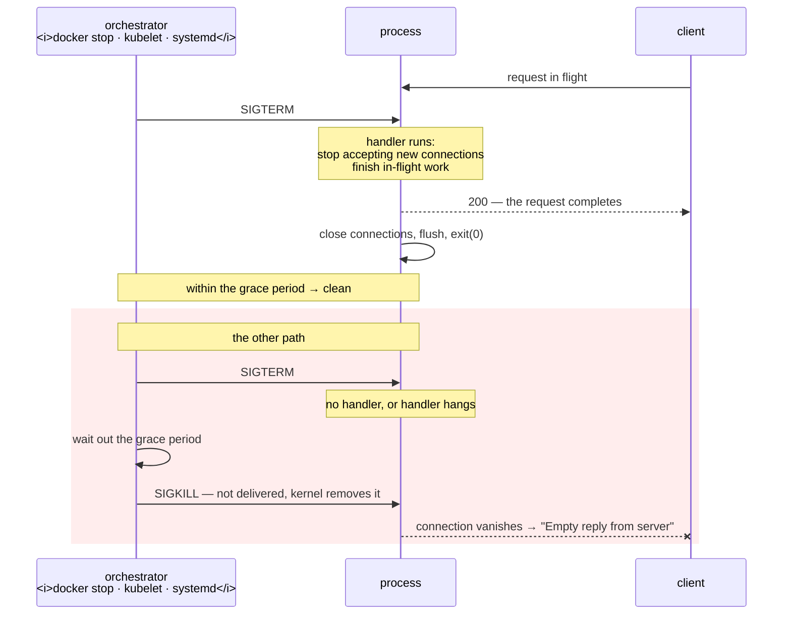

# 2.2 — `SIGTERM` and `SIGKILL` — the request and the order

## One-line answer

`SIGTERM` asks a process to stop and lets it decide how; `SIGKILL` does not ask and is not delivered
to the process at all — and the entire discipline of stopping a service safely lives in the gap between
those two, which is called the grace period.

---

## The story

🎬 **The scene.** A restaurant kitchen at closing time. The manager puts her head round the door and
says: "last orders are in, we are closing — finish what you have on."

The chef does not down tools. He plates the three dishes already cooking, turns off the gas, puts the
stock in the fridge, and walks out. It takes a few minutes and the kitchen is left clean.

😬 **The naive fix.** A new manager decides this is slow and wants closing to be instant, so she pulls
the main breaker at exactly closing time.

💥 **Why it fails.** The kitchen goes dark mid-service. Three plates are half-made and go in the bin.
The stock is left out on the side and is ruined by morning. The fridge door was open and nobody closed
it. The next morning the chef spends an hour on cleanup that would have taken minutes, and one customer
paid for a dish she never received.

**And here is the part that stings:** pulling the breaker genuinely was faster. The kitchen was
definitely closed at closing time. The cost did not appear at the moment of the decision — it appeared
in the bin, in the ruined stock, and in the customer.

💡 **The insight.** There are two ways to stop something, and they differ in *who decides how*. The
first hands the decision to the thing that knows what is in flight. The second takes that decision
away, and pays for it in the mess left behind. **You want the first one, and you need the second one to
exist** — because a chef who refuses to leave has to be removable somehow.

---

## The idea in plain language

Both signals end a process. That is where the similarity ends.

**`SIGTERM`, number 15, is a request.** It is delivered to the process. The process can install a
handler and run whatever code it likes: stop accepting new work, finish requests already in flight,
flush buffers to disk, close database connections cleanly, deregister from a load balancer, and *then*
exit. Or it can ignore the signal entirely and keep running. Or it can do nothing about it, in which
case the kernel's default action terminates it immediately.

**`SIGKILL`, number 9, is not a request and it is not delivered.** Verified against
`man7.org/linux/man-pages/man7/signal.7.html` on **2026-08-24**: *"The signals SIGKILL and SIGSTOP
cannot be caught, blocked, or ignored."* There is no handler, because there is nothing to hand the
signal to — the kernel removes the process from the system. No code of yours runs. No buffer is
flushed. No connection is closed politely; the other end simply sees the connection vanish.

| | `SIGTERM` (15) | `SIGKILL` (9) |
| --- | --- | --- |
| Delivered to the process | yes | **no** |
| Can be caught | yes | **no** |
| Can be ignored | yes | **no** |
| Runs your cleanup code | if you wrote it | never |
| In-flight requests | can be finished | dropped |
| Buffered writes | can be flushed | lost |
| Works on a process in state `D` | no | **no** |
| Guaranteed to work | no | yes, except in `D` |

**Read the last two rows together.** `SIGKILL` is the guaranteed one, *and* it is not actually
guaranteed, because a process in uninterruptible sleep receives nothing
([1.4](../01-the-process/1.4-process-states-and-the-d-that-will-not-die.md)). People describe `kill -9`
as "the one that always works". It is the one that always works on a process that is in a position to
be killed at all.

### The grace period — the shape every stop has

Nobody sends only one of these. The universal pattern, implemented identically by `docker stop`, by
Kubernetes, by systemd and by every process manager worth using, is:

1. Send `SIGTERM`.
2. Wait, for a configured number of seconds. **This is the grace period.**
3. If the process is still there, send `SIGKILL`.

That is the whole algorithm, and every argument you will ever have about shutdown is an argument about
step 2's number. Too short and you hard-kill services that were legitimately mid-request. Too long and
every deploy crawls, and a wedged process takes an age to clear.

**The grace period is a bet about your slowest legitimate request.** If `pulse` will one day take a
while to run an inference (Day 109), the grace period has to be longer than that, or a deploy will kill
requests that were about to succeed.

### Why `SIGKILL` must exist even though it is destructive

Because `SIGTERM` can be ignored. A process with a bug in its handler, a process wedged in a loop, a
process whose handler itself hangs waiting on something dead — all of these will sit there forever
under `SIGTERM` alone. **A system where "stop" can be refused indefinitely is a system with no
recovery.** So the escalation exists, and the correct attitude to it is: it is a backstop that should
almost never fire, and every time it does fire, that is a fact worth recording.

---

## Why Kriya needs it

Day 26 sets a container restart policy and Day 30 breaks it. `docker stop` is exactly the three-step
algorithm above with a default grace period, and the failure lab includes the container that always
takes the full period — which is diagnosed entirely from this part.

Day 41 configures `terminationGracePeriodSeconds` in a Pod spec. That field is step 2. Choosing it
requires knowing your slowest request, and choosing it badly is a documented outage shape.

Day 19 is *"rollback is a feature"*, and a rollback that drops in-flight requests is a partial outage
you performed on yourself. Draining depends on `SIGTERM` reaching code that knows how to drain, which
is [2.3](2.3-catching-a-signal-in-python.md) and
[4.1](../04-the-service-died/4.1-graceful-shutdown-for-pulse.md).

Day 6's out-of-memory killer sends `SIGKILL`, never `SIGTERM` — deliberately, because the machine is
out of memory and cannot afford to wait for anyone's cleanup. Understanding *why* it makes that choice
is most of understanding exit code 137.

---

## The mechanism

Watch the same process end two ways, and compare what is left behind.

**First, the request.** Start `pulse` in the background and send `SIGTERM`:

```bash
uv run uvicorn pulse.api:app --host 127.0.0.1 --port 8000 &
PULSE=$!
sleep 2
kill -TERM "$PULSE"
wait "$PULSE"
echo "exit code: $?"
```

**Line by line:**

- `PULSE=$!` — capture the PID immediately, before anything else can move `$!`
  ([1.2](../01-the-process/1.2-pid-parent-and-the-process-tree.md)).
- `sleep 2` — let startup complete. Signalling mid-startup is a real scenario and a bad first
  experiment ([2.1](2.1-what-a-signal-actually-is.md), *In production*).
- `kill -TERM "$PULSE"` — **by name, not by number**, for the portability reason in
  [2.1](2.1-what-a-signal-actually-is.md): signal numbers differ between Linux and the Cygwin layer Git
  Bash uses.
- `wait "$PULSE"` — block until it is finished and collect the result, so `$?` is *its* exit code and
  not the exit code of `kill`.

Observed on **2026-08-24**:

```text
INFO:     Started server process [31654]
INFO:     Waiting for application startup.
INFO:     Application startup complete.
INFO:     Uvicorn running on http://127.0.0.1:8000 (Press CTRL+C to quit)
INFO:     Shutting down
INFO:     Waiting for application shutdown.
INFO:     Application shutdown complete.
INFO:     Finished server process [31654]
exit code: 0
```

**Four lines of shutdown, and exit code `0`.** Uvicorn caught the signal, ran its shutdown sequence, and
exited *normally* — which is why the code is `0` rather than `143`. A process that catches a
termination signal and exits deliberately chooses its own exit code, and choosing `0` is the way it says
"I was asked to stop, and I stopped correctly". Section
[3](../03-exit-codes/3.1-the-exit-code-is-the-whole-return-value.md) is about why that distinction
matters to everything watching.

**Now the order.** Same process, different ending:

```bash
uv run uvicorn pulse.api:app --host 127.0.0.1 --port 8000 &
PULSE=$!
sleep 2
kill -KILL "$PULSE"
wait "$PULSE"
echo "exit code: $?"
```

**Line by line:** identical in every respect except `-KILL` in place of `-TERM`. That one word is the
whole experiment — everything else is held constant so the difference in output is attributable to the
signal and nothing else.

```text
INFO:     Started server process [31702]
INFO:     Waiting for application startup.
INFO:     Application startup complete.
INFO:     Uvicorn running on http://127.0.0.1:8000 (Press CTRL+C to quit)
exit code: 137
```

**Compare the two outputs side by side and notice what is missing.** No `Shutting down`. No `Waiting
for application shutdown`. No `Finished server process`. Uvicorn has perfectly good code for all three
and none of it ran, because nothing was delivered to it.

And the exit code is `137`, not `0`. `137` is `128 + 9`
([3.2](../03-exit-codes/3.2-128-plus-n-when-a-signal-becomes-an-exit-code.md)) — the shell's way of
reporting "this did not exit, it was killed by signal 9". **Anything watching this process can tell the
difference between the two endings from the number alone**, which is the entire reason exit codes are
worth a section.

### Watching the difference cost you a request

The comparison above loses nothing because nothing was in flight. Make something be in flight.

In terminal one:

```bash
uv run uvicorn pulse.api:app --host 127.0.0.1 --port 8000
```

**Line by line:** no `&` and no output redirection — run it in the foreground on purpose, so its log
lines appear as they happen and you can see exactly how far the shutdown sequence got before the
process disappeared. That visibility is the whole point of this experiment.

In terminal two, start a request and immediately kill the server from a third terminal — or use one
command that does both:

```bash
curl -sS -m 10 http://127.0.0.1:8000/healthz & sleep 0.2; pkill -KILL -f 'uvicorn pulse.api'; wait
```

**Line by line:**

- `curl ... &` — start the request in the background so the shell continues.
- `sleep 0.2` — long enough for the connection to be established, short enough that it is still open.
- `pkill -KILL -f 'uvicorn pulse.api'` — `pkill` sends a signal to processes matching a pattern; `-f`
  matches the whole command line, which is required here because the executable is `python`
  ([1.3](../01-the-process/1.3-reading-ps-and-finding-your-service.md)). **`pkill` is the dangerous
  member of this family** — read its *Blast radius* note below before you make a habit of it.
- `wait` — let the backgrounded `curl` finish so you see its output rather than a stray line later.

```text
curl: (52) Empty reply from server
```

**That is what a dropped request looks like from the client's side.** Not a `503`, not an error page,
not a retryable status — an empty reply, because the connection was accepted and then the process
holding it ceased to exist mid-sentence. A client library will usually surface this as a connection
error, and whether it retries is a decision Day 7, part 5.2 examines carefully.

Now repeat the whole thing with `-TERM` instead of `-KILL` and watch the request complete before the
server exits. **That difference is the entire value of graceful shutdown**, and part
[4.1](../04-the-service-died/4.1-graceful-shutdown-for-pulse.md) builds it properly.



---

## When it breaks

**`kill` reports success and the process is still there.** Two different causes, distinguished by one
column:

```text
$ kill -TERM 4412
$ echo $?
0
$ ps -o pid,stat,wchan:24 -p 4412
    PID STAT WCHAN
   4412 D    nfs_wait_bit_killable
```

**What it says:** the kill succeeded.
**What it actually means:** `kill` returns whether the *kernel accepted the request*, never whether the
process reacted. Here it is pending against a process in uninterruptible sleep and will never be
delivered ([1.4](../01-the-process/1.4-process-states-and-the-d-that-will-not-die.md)).
**The smallest fix:** none at the process level — `kill -9` will do nothing either. Fix the device.

The other cause, same symptom, different `stat`:

```text
$ ps -o pid,stat,args -p 4620
    PID STAT COMMAND
   4620 S    /bin/sh /app/entrypoint.sh
```

**What it actually means:** the process caught `SIGTERM` and chose not to exit, or it ignored it
outright. State `S` rather than `D` is the discriminator: this one *can* receive signals and is
declining to act. `SIGKILL` will work here.

**`kill: (31402) - No such process`.** You are acting on a stale PID:

```text
$ kill -TERM 31402
bash: kill: (31402) - No such process
```

**What it says:** there is no process with that identifier.
**What it actually means:** either it already exited, or — worse and quieter — the number has been
recycled and now belongs to something else entirely, in which case you would get *no error at all* and
would have killed a stranger ([1.3](../01-the-process/1.3-reading-ps-and-finding-your-service.md)).
**The smallest fix:** `ps -o pid,lstart,args -p <pid>` before every kill. The error message is the good
outcome; silence is the one to fear.

**The `pkill` that took out more than you meant.** The most expensive mistake in this part:

```text
$ pkill -KILL -f python
```

**What it says:** nothing. It succeeds silently.
**What it actually means:** every process on the machine whose command line contains `python` is now
gone — your server, your editor's language server, a background job, and on a shared machine, other
people's work. There is no confirmation, no list, and no undo.
**The smallest fix, which is a habit rather than a command:** run the match first and read it.

```bash
pgrep -af python
```

**Line by line:** the identical pattern, through the tool that only *lists*. If the list contains
something you did not expect, your pattern is wrong, and you found out for free. Only once the list is
exactly what you intend do you re-run it as `pkill`.

---

## In production

**What a professional writes instead of the teaching version.** They never send `SIGKILL` as a first
action, and they treat every `SIGKILL` that the *system* had to send as a defect to be investigated
rather than a normal event. The escalation exists as a backstop; a system where it fires routinely is a
system that is dropping requests routinely, and the fact is usually invisible because the deploy
"succeeded" every time.

**What degrades at scale.** The grace period's cost multiplies and its correctness gets harder. With
one instance you can pick a number by feel. With a hundred instances and a rolling deploy, an
over-long grace period on a process that does not handle `SIGTERM` is a deploy that takes the grace
period times the number of batches; an under-long one on a service with slow requests drops a
percentage of traffic on every single release. **Both errors are silent** — neither produces an alert
by default — which is why Day 73's error-budget view is where they eventually show up, as a small
recurring dip that correlates with deploys.

**The failure that only shows with real traffic.** The handler that is correct and too slow. Under no
load, shutdown finishes instantly and everything looks perfect. Under real load there are hundreds of
open connections, some with slow clients, and "finish in-flight work" now genuinely takes longer than
the grace period — so the tail of every deploy is hard-killed. The graph shape is distinctive: a small
error spike at the *end* of each rollout batch rather than the start. The fix is usually to stop
accepting new connections immediately and put a hard cap on the drain, rather than to lengthen the
grace period indefinitely.

**The review comment a senior engineer leaves.** *"`terminationGracePeriodSeconds: 5` with a model that
can take longer than that to answer means we hard-kill real requests on every deploy. Either raise the
grace period above the p99 of `/predict`, or make the handler refuse new work and return early — but
right now this is a guaranteed error budget spend per release."*

**The signal you would alert on.** **The count of terminations by `SIGKILL`**, or equivalently the count
of exits with code 137 or 143-after-grace. It should be approximately zero, and every occurrence means
either a broken handler or a grace period that is too short. This is one of the rare signals where the
alert threshold is genuinely "any", because the event is not supposed to happen at all. You would
**not** alert on `SIGTERM` — it is sent on every deploy, and alerting on it means alerting on normal
operations, which is how people learn to ignore alerts.

**Blast radius.** This part introduces `kill -KILL` and `pkill`, which are the most destructive commands
in this curriculum so far. Worst case: `pkill -KILL -f <broad pattern>` on a shared machine destroys
unrelated processes belonging to other people, with no confirmation, no list and no undo — and if any
of them held unflushed data, that data is gone. Who can trigger it: any user, for their own processes;
root, for everything on the machine. What bounds it: **nothing technical whatsoever**, which is the
honest and uncomfortable answer. The bounds are procedural and they are the whole safety system —
always `pgrep` before you `pkill`, always `ps -o lstart,args` before you `kill`, and never use `-9`
until `-TERM` has been given time and has visibly failed.

**Cost.** `0` model calls, `0` tokens, `0` CI minutes, `0` disk, `0` measurable memory or processor.
The cost of these commands is never resources. **The cost is the dropped requests**, and the unit to
measure it in is your error budget (Day 73) — a hard kill during a deploy spends error budget exactly
as if the service had crashed, because from the client's side it did.

**The interview question.** *"Walk me through what happens between `kubectl delete pod` and the process
being gone."* The answer that lands is the sequence with the decision points named: *"The Pod is marked
terminating and taken out of the Service endpoints, so new traffic stops arriving. The kubelet sends
`SIGTERM` to PID 1 in each container. The application's handler should stop accepting connections and
finish what is in flight. The kubelet waits `terminationGracePeriodSeconds`; if the process is still
there at the end of it, it sends `SIGKILL`, which is not delivered to the process at all — the kernel
just removes it, so no cleanup runs and in-flight requests become connection errors for the client.
The two things that go wrong are an app that does not handle `SIGTERM` at all, so every stop is
effectively a hard kill, and a grace period shorter than the slowest real request."* Then the detail
that shows experience: *"and the endpoint removal is asynchronous, so there is usually a short window
where the Pod is terminating and still receiving traffic — which is why services often sleep briefly at
the start of their handler before they begin draining."*

---

## Check yourself

```bash
for SIG in TERM KILL; do
  uv run uvicorn pulse.api:app --host 127.0.0.1 --port 8000 >/tmp/pulse-$SIG.log 2>&1 &
  P=$!; sleep 2; kill -$SIG "$P"; wait "$P"; echo "$SIG -> exit $?  |  shutdown lines: $(grep -c 'Shutting down\|Application shutdown complete' /tmp/pulse-$SIG.log)"
done
```

Both endings, one command, with the two facts that distinguish them printed side by side: the exit code
and **the number of shutdown log lines the process managed to write**. `TERM` gives you a `0` and two
lines. `KILL` gives you `137` and zero lines. That second number is graceful shutdown, counted.

**Say out loud, without scrolling up:** *why does a process killed with `SIGKILL` write no shutdown log
line, even though its shutdown code is perfectly good and definitely present in the binary?*
