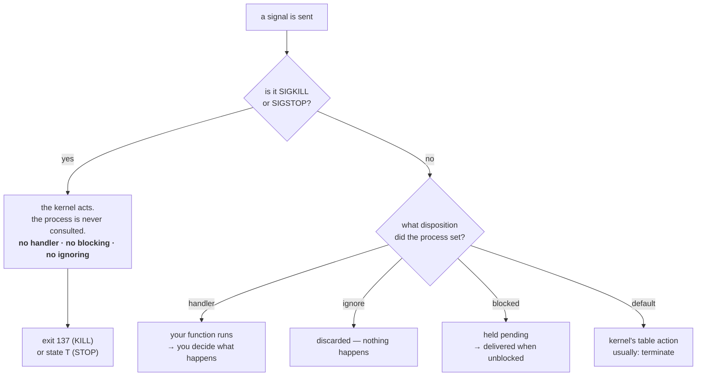

# 2.4 — The signals you cannot catch

## One-line answer

Exactly two signals — `SIGKILL` and `SIGSTOP` — are enforced by the kernel and never reach the process,
which is what makes them the only reliable controls in the system and, for the same reason, the only
ones that guarantee your cleanup code will not run.

---

## The story

🎬 **The scene.** A hire car with a manual handbrake and, separately, an ignition key.

The driver decides where the car goes. She can be asked to stop and she can decline — she might be in
the middle of a junction, or she might simply not want to. The asking is a conversation.

Underneath the car there is a wheel clamp. It is not a conversation. Nobody asks the driver anything,
and her opinion is not consulted. The wheel is held and the car does not move.

😬 **The naive fix.** The rental company decides clamping is unpleasant, and removes the clamps. From
now on, drivers will simply be *asked* to stop.

💥 **Why it fails.** It works for every reasonable driver, which is nearly all of them. Then one car is
left running in a loading bay with nobody in it and the doors locked. There is now no mechanism in the
world that stops it. The polite system had no floor underneath it, and the one situation it was needed
for is exactly the situation where asking does not work — because if asking worked, you would not have
needed the clamp.

💡 **The insight.** Any system built entirely on cooperation fails precisely in the cases where
cooperation has broken down. **You need one control that does not require the cooperation of the thing
being controlled** — and its whole value is that it cannot be refused, which is also the reason it is
brutal. You keep it, you use it last, and you notice every time it fires.

---

## The idea in plain language

Verified against `man7.org/linux/man-pages/man7/signal.7.html` on **2026-08-24**, one sentence
covers it: *"The signals SIGKILL and SIGSTOP cannot be caught, blocked, or ignored."*

Three verbs, and they close three different loopholes:

- **Caught** — you cannot install a handler, so no code of yours runs.
- **Blocked** — you cannot temporarily defer it while you finish something. Other signals can be
  blocked, held pending, and released; these cannot.
- **Ignored** — you cannot set the disposition to discard it, and equally importantly *a parent cannot
  set it to ignored on your behalf* the way it can for other signals
  ([2.1](2.1-what-a-signal-actually-is.md)).

That last point closes the loophole that would otherwise make the whole thing pointless. If ignoring
were inheritable for `SIGKILL`, one carelessly-written wrapper script could produce a process nobody on
the machine could remove.

### What the two of them actually do

| | `SIGKILL` (9) | `SIGSTOP` (19 on Linux) |
| --- | --- | --- |
| Effect | the kernel removes the process | the kernel suspends it |
| Reversible | no | yes, with `SIGCONT` |
| Memory released | yes, immediately | **no — it holds everything** |
| Open ports released | yes | **no — it keeps listening** |
| Process still in `ps` | no | yes, in state `T` |
| Your cleanup code runs | never | never (it is not gone, it is frozen) |

**The `SIGSTOP` column is the one worth staring at.** A stopped process is worse than a dead one from
the point of view of everything around it: it still owns port 8000, so nothing else can bind it; it
still holds its 60 MB of memory; it still holds any lock or database connection it had; and every
health check that merely asks "does the process exist" says yes. Requests arrive, the kernel accepts
the connections into the queue, and nothing ever answers.

You produced exactly this in [1.4](../01-the-process/1.4-process-states-and-the-d-that-will-not-die.md)
and watched `curl` time out. This part explains why no amount of handler-writing could have prevented
it.

### Why the kernel enforces this rather than trusting programs

Because the alternative has a failure mode with no floor. Three concrete situations need a control that
cannot be declined:

- **A process with a bug in its shutdown handler.** It catches `SIGTERM`, deadlocks in the handler, and
  is now permanently unstoppable through the polite path. Very common; part
  [2.3](2.3-catching-a-signal-in-python.md) lists the shapes.
- **A machine that is out of memory.** The out-of-memory killer must free memory *now*, and waiting for
  a graceful shutdown means waiting for a process that may itself need to allocate in order to shut
  down. It sends `SIGKILL`, and Day 6 section 4 is entirely about that decision.
- **A hostile or runaway process.** A program written specifically to be unstoppable is trivial to
  write if every signal is catchable.

**So the guarantee runs in one direction only:** you can always be removed, and you can never rely on
getting a chance to tidy up. Every piece of production advice about durability — write your data before
you acknowledge it, make operations idempotent, assume the process can vanish between any two
instructions — descends from that one asymmetry.

### The honest caveat

`SIGKILL` is guaranteed *to be applied*, not guaranteed *to take effect immediately*. A process in
uninterruptible sleep receives nothing at all until it leaves that state
([1.4](../01-the-process/1.4-process-states-and-the-d-that-will-not-die.md)). So the accurate sentence
is: **`SIGKILL` cannot be refused by the process, but it can be delayed indefinitely by a device.**
People who say `kill -9` always works have not yet met a failing disk.

---

## Why Kriya needs it

Day 6 ends with a process that was simply `Killed`, exit code 137. The reason there is no traceback, no
log line and no cleanup is this part: the out-of-memory killer uses the uncatchable one, on purpose.

Day 30's container failure lab includes `exit 137` from a container that hit its memory limit and
`docker stop` taking the full grace period before hard-killing. Both are this part with a runtime
wrapped around it.

Day 41's `terminationGracePeriodSeconds` is precisely the delay before the uncatchable signal is sent.
The field exists because the polite signal can be refused; the number is how long you are willing to
wait before you stop asking.

Day 89 onward writes data. Every rule about writing data safely — write-then-rename, transactions,
acknowledge only after durability — exists because the process can be removed between any two
instructions with no warning and no opportunity to finish. This part is the reason those rules are not
paranoia.

---

## The mechanism

Prove all three verbs — cannot be caught, cannot be blocked, cannot be ignored — in one program.

```python
# days/day-004-linux-for-operators-i/lab/uncatchable.py
import os
import signal
import sys
import time

CATCHABLE = signal.SIGTERM
UNCATCHABLE = signal.SIGKILL


def on_signal(signum: int, frame) -> None:
    print(f"[handler] caught {signal.Signals(signum).name}", flush=True)


signal.signal(CATCHABLE, on_signal)
print(f"[main] installed a handler for {CATCHABLE.name} — fine", flush=True)

try:
    signal.signal(UNCATCHABLE, on_signal)
    print("[main] installed a handler for SIGKILL — this should not print", flush=True)
except (OSError, ValueError, RuntimeError) as exc:
    print(f"[main] refused: {type(exc).__name__}: {exc}", flush=True)

print(f"[main] pid={os.getpid()} alive; try TERM, then KILL", flush=True)
while True:
    time.sleep(0.5)
```

**Line by line:**

- `CATCHABLE = signal.SIGTERM` and `UNCATCHABLE = signal.SIGKILL` — named constants so the two
  `signal.signal` calls below differ in exactly one thing. The point of the experiment is the contrast,
  and naming the variable after the claim makes the contrast the subject of the code.
- The first `signal.signal(CATCHABLE, ...)` succeeds silently. That is the control: it proves the
  handler and the mechanism are fine.
- The second is wrapped in `try` because **it raises**. This is the demonstration — the refusal is not
  a warning, a no-op, or a silently-ignored request. The operating system rejects it and Python turns
  that rejection into an exception.
- `except (OSError, ValueError, RuntimeError)` — three types because the exact one differs by platform
  and Python version. Catching the specific set rather than bare `Exception` follows the repository's
  rule (`CLAUDE.md`: raise and catch specific exceptions), and printing `type(exc).__name__` means the
  program *reports* which one it actually got instead of you having to guess.
- `while True: time.sleep(0.5)` — stay alive so you can signal it. `sleep` rather than a busy loop, for
  the core-burning reason in [1.4](../01-the-process/1.4-process-states-and-the-d-that-will-not-die.md).

Run it:

```bash
uv run python days/day-004-linux-for-operators-i/lab/uncatchable.py &
UC=$!
sleep 1
```

**Line by line:** background it, capture the PID, pause so the startup lines appear before your next
prompt rather than interleaved with it.

Observed on **2026-08-24**:

```text
[main] installed a handler for SIGTERM — fine
[main] refused: OSError: [Errno 22] Invalid argument
[main] pid=32410 alive; try TERM, then KILL
```

**`OSError: [Errno 22] Invalid argument`.** That is the kernel saying no. Not "unsupported", not a
warning — the system call to change the disposition of signal 9 fails with `EINVAL`, because there is
no valid way to express what you asked for. On some platforms the same refusal surfaces as
`ValueError: invalid signal value`, which is why the `except` names three types.

Now send the catchable one and watch the handler run and the process survive:

```bash
kill -TERM "$UC"
sleep 0.5
ps -o pid,stat,args -p "$UC"
```

**Line by line:** send it, give the interpreter a moment to reach an instruction boundary
([2.3](2.3-catching-a-signal-in-python.md)), then confirm the process is still there. The `ps` is the
proof — without it you would only have the handler's own claim.

```text
[handler] caught SIGTERM
    PID STAT COMMAND
  32410 S    python days/day-004-linux-for-operators-i/lab/uncatchable.py
```

**The process caught `SIGTERM` and simply did not stop.** It printed a line and carried on, because the
handler does not exit and the default action was replaced. This is a perfectly legal, perfectly common
program — and it is exactly the situation that would be unrecoverable if there were no floor
underneath it.

Now use the floor:

```bash
kill -KILL "$UC"
wait "$UC"
echo "exit code: $?"
```

**Line by line:** `-KILL` by name rather than `-9`, for the portability reason in
[2.1](2.1-what-a-signal-actually-is.md). `wait` collects the child's result so `$?` is the *process's*
ending and not `kill`'s — without it you would read `0` and learn nothing, because `kill` succeeded.

```text
exit code: 137
```

**No handler line. No message from the program at all.** `137` is `128 + 9`
([3.2](../03-exit-codes/3.2-128-plus-n-when-a-signal-becomes-an-exit-code.md)), and the silence is the
signature: a process that leaves no final log line and reports `137` was not shut down, it was removed.

### The blocking loophole, closed

`SIGTERM` can be *blocked* — deferred while you do something you cannot be interrupted during. Prove
that `SIGKILL` cannot:

```python
# days/day-004-linux-for-operators-i/lab/blocking.py
import os
import signal
import time

blocked = signal.pthread_sigmask(signal.SIG_BLOCK, {signal.SIGTERM, signal.SIGKILL})
pending_before = signal.sigpending()
print(f"[main] pid={os.getpid()} asked to block TERM and KILL", flush=True)
print(f"[main] previously blocked: {blocked}", flush=True)

time.sleep(3)
print(f"[main] pending while blocked: {signal.sigpending()}", flush=True)
print(f"[main] still here after 3s, pending_before={pending_before}", flush=True)
time.sleep(30)
```

**Line by line:**

- `signal.pthread_sigmask(signal.SIG_BLOCK, {...})` — add these signals to the set the thread is
  currently blocking. `SIG_BLOCK` means "add to the existing mask" rather than replacing it, which is
  the safe choice in real code because it does not silently unblock something someone else blocked.
- Passing both `SIGTERM` and `SIGKILL` in one set is the experiment: identical treatment, and only one
  of them will actually be blocked. **The call does not error** — it accepts `SIGKILL` and silently
  declines to block it, which is worth knowing because it means there is no exception to catch here.
- `signal.sigpending()` — the set of signals that have been sent but not yet delivered because they are
  blocked. This is how you *see* the blocking working: a blocked `SIGTERM` shows up here, a `SIGKILL`
  never does, because it was never blocked to begin with.
- `time.sleep(3)` then `time.sleep(30)` — a window to send signals into from another terminal.

```text
$ uv run python days/day-004-linux-for-operators-i/lab/blocking.py &
[1] 32502
[main] pid=32502 asked to block TERM and KILL
[main] previously blocked: set()
$ kill -TERM 32502
$ kill -KILL 32502
[1]+  Killed                  uv run python days/day-004-linux-for-operators-i/lab/blocking.py
```

**The `SIGTERM` was absorbed and the process kept running.** The `SIGKILL` ended it instantly, and the
`[main] pending while blocked:` line — which would have shown `{<Signals.SIGTERM: 15>}` had the process
survived to print it — never appeared, because there was no chance to print anything. The blocking
request was accepted for one signal and quietly not honoured for the other.



---

## When it breaks

**The container that always takes the full grace period.** The most common production shape of this
part:

```text
$ time docker stop pulse
pulse

real    0m10.412s
```

with no shutdown lines in the container log at all.

**What it says:** the stop took the full default grace period and then succeeded.
**What it actually means:** `SIGTERM` was sent and nothing acted on it — because the process ignored
it, or PID 1 was a shell that did not forward it
([1.2](../01-the-process/1.2-pid-parent-and-the-process-tree.md)), or the handler was blocked
([2.3](2.3-catching-a-signal-in-python.md)). The runtime then sent the uncatchable one, which always
works. **Every single stop is a hard kill**, and it is invisible because the command reports success.
**The smallest fix:** find out which of the three it is. `docker exec` a `ps` and check whether PID 1
is what you think it is; that answers it most of the time.

**The frozen process that looks alive to everything.** `SIGSTOP`'s production face:

```text
$ ps -o pid,stat,rss,args -p 27431
    PID STAT   RSS COMMAND
  27431 Tl   61284 python .venv/Scripts/uvicorn pulse.api:app --host 127.0.0.1 --port 8000
$ netstat -ano | grep ':8000.*LISTENING'
  TCP    127.0.0.1:8000         0.0.0.0:0              LISTENING       27431
$ curl -sS -m 3 http://127.0.0.1:8000/healthz
curl: (28) Operation timed out after 3002 milliseconds with 0 bytes received
```

**What it says:** the process exists, holds its memory, owns the port, and answers nothing.
**What it actually means:** state `T`. It is suspended, not broken and not dead. Nothing it could have
done would have prevented this, because `SIGSTOP` is not delivered to it.
**The smallest fix:** `kill -CONT <pid>`. **The diagnostic worth keeping:** any time a service accepts
connections and never answers, `stat` is the first column to read, because `T` and `D` both produce
that exact symptom and both are invisible to a process-existence health check.

**The data that was not there after a restart.** The consequence, rather than an error message:

```text
$ ls -la data/
-rw-r--r-- 1 nisha nisha      0 Aug 24 11:47 results.json
```

A zero-byte file where a completed write should be.

**What it says:** the file exists and is empty.
**What it actually means:** the process wrote into a buffer, the buffer was not flushed, and the
process was removed by `SIGKILL` before anything reached the disk. `open()` created the file
immediately; the contents never existed outside memory. **No error was ever raised anywhere** — the
program believed it had written successfully, because from its point of view it had.
**The smallest fix, which is a design rule rather than a command:** write to a temporary file, flush,
`fsync`, then rename over the target. Rename is atomic, so a reader sees either the old file or the
complete new one and never a half-written one. Day 89 makes this a standing rule for every artifact
this curriculum produces, and this part is why.

---

## In production

**What a professional writes instead of the teaching version.** They design on the assumption that the
process can vanish between any two instructions, because these two signals mean it genuinely can. In
practice that means: never acknowledge work before it is durable; make every operation safe to repeat,
because a job killed mid-flight will be retried by something; write files atomically; and keep the
in-memory state that only exists in one process as small as you can bear. **None of that is signal
handling.** It is the architecture you adopt once you accept that your cleanup code is not guaranteed
to run — which is the real lesson of this part.

**What degrades at scale.** The probability. On one machine, a hard kill is a rare event you might
never see. Across a large fleet with frequent deploys, autoscaling, node replacement and occasional
memory pressure, some process somewhere is being hard-killed continuously — so any failure mode that
requires "the process was removed without cleanup" stops being hypothetical and becomes a daily
occurrence. Systems that were fine at ten instances start losing data at a thousand, and the code did
not change.

**The failure that only shows with real traffic.** In-flight state at kill time. With one request at a
time, a hard kill loses one request. Under real concurrency it loses every open connection at once,
plus anything buffered, plus any partially-written file, plus any distributed operation that had
completed its first step and not its second. **The last one is the expensive category**: money moved
and not recorded, a message consumed and not acknowledged, a row inserted and its index update lost.
This is where idempotency stops being a design nicety and becomes the thing that keeps your data
correct.

**The review comment a senior engineer leaves.** *"This worker acknowledges the message before it
processes it. If the pod is OOM-killed mid-processing — and it will be, we run close to the limit — the
message is gone and the work never happened, with nothing in any log to say so. Acknowledge after the
work is durable, and make the handler idempotent so a redelivery is harmless."*

**The signal you would alert on.** **The rate of uncatchable terminations** — processes ending with
exit code 137, or a container termination reason of `OOMKilled` or `Error` rather than `Completed`.
This should be near zero and every occurrence is worth a look, because each one means cleanup did not
run and something may be inconsistent. On Kubernetes this is available without any instrumentation, as
the container's last termination state (Day 40). You would **not** alert on `SIGSTOP` — it is
essentially never sent in production, and if it is, a human sent it and knows.

**Blast radius.** This part introduces nothing new to send — `kill -KILL` arrived in
[2.2](2.2-sigterm-and-sigkill-the-request-and-the-order.md) — but it introduces `SIGSTOP`, which is
**more dangerous than `SIGKILL` in one specific way**: a killed process releases its port, its memory
and its locks, and a stopped one releases nothing while continuing to look alive to every simple check.
Worst case: you freeze a process holding a database lock, and every other instance blocks behind it
while all their health checks stay green. Who can trigger it: any user owning the process. What bounds
it: `SIGCONT` reverses it completely and instantly, and `pulse` today holds no locks, no durable state
and no real traffic. **What would bound it in production is not doing it** — take the instance out of
the load balancer first, and prefer a debugger or a thread dump to freezing a live process.

**Cost.** `0` model calls, `0` tokens, `0` CI minutes, `0` disk, `0` extra memory. A stopped process
costs exactly what it cost before it was stopped — about 60 MB for `pulse` — and keeps costing it,
which is the point of the memory row in the table above.

**The interview question.** *"Why can't you catch `SIGKILL`?"* — the shallow answer is "because the
manual says so". The answer that lands explains the design: *"Because a system where every stop can be
refused has no recovery path for the cases that matter — a process wedged in its own shutdown handler,
or one the OOM killer needs to remove right now to save the machine. So the kernel keeps exactly two
signals for itself and never delivers them to the process. The cost of that guarantee is that no
cleanup code is ever guaranteed to run, which is why anything that matters has to be written durably
before it is acknowledged rather than flushed on the way out."* Then the detail that shows you have
used it: *"and it is still not absolute — a process in uninterruptible sleep will not die from `kill
-9` either, because nothing is being delivered to it at all."*

---

## Check yourself

```bash
uv run python days/day-004-linux-for-operators-i/lab/uncatchable.py & UC=$!; sleep 1; kill -TERM "$UC"; sleep 0.5; ps -o pid,stat --no-headers -p "$UC" && echo "survived TERM"; kill -KILL "$UC"; wait "$UC"; echo "after KILL: exit $?"
```

One line that shows both halves: the process survives the signal it was allowed to catch, and does not
survive the one it was not. The `&&` makes "survived TERM" print only if the process is genuinely still
in the table, so the claim is checked rather than asserted.

**Say out loud, without scrolling up:** *`SIGSTOP` does not kill anything and is arguably more
dangerous to a running system than `SIGKILL`. Give three specific resources a stopped process keeps
holding, and say which health check would fail to notice.*
