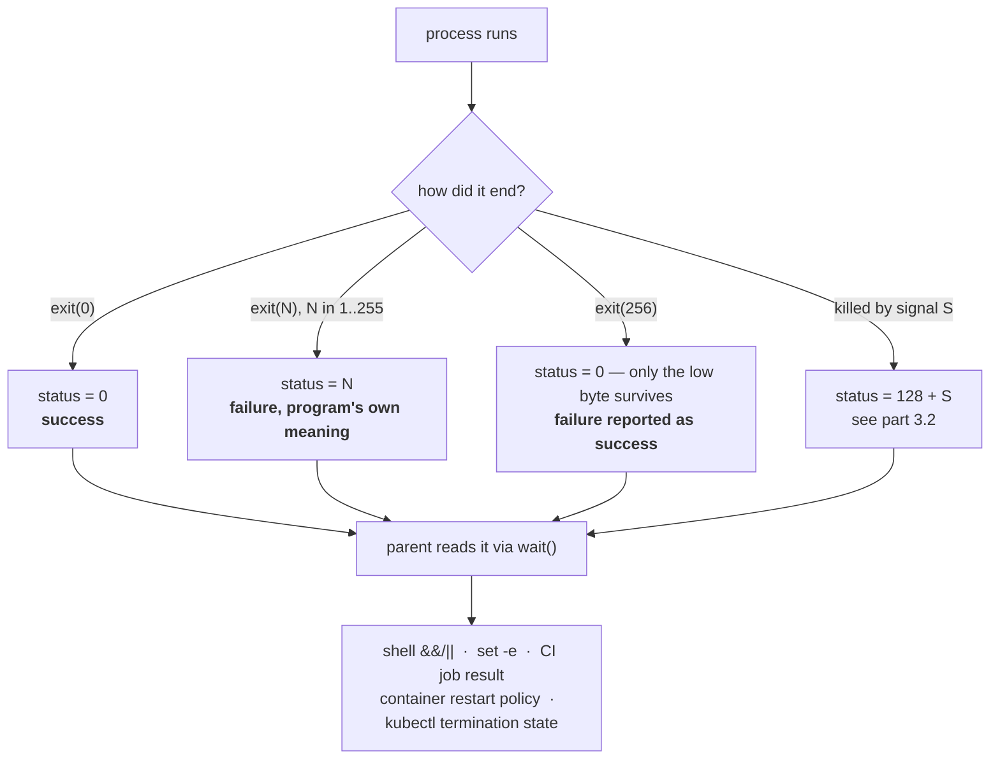

# 3.1 — The exit code is the whole return value

## One-line answer

When a process ends, the only thing it hands back to whatever started it is a single number between 0
and 255. Everything it printed was for humans, and **every automated decision about whether it worked is
made from that number alone**.

---

## The story

🎬 **The scene.** A delivery driver gets back to the depot. The person routing the vans asks one
question: "Did it get there?"

He says yes or no. That is the whole exchange. Not the traffic, not the weather, and not the fact that
the doorbell was broken so he had to go round the back. Yes or no, and she moves on to the next job.

😬 **The naive fix.** A new driver decides that yes-or-no is too crude and starts giving a full account
of each delivery: what happened, what he tried, and what was odd about the building.

💥 **Why it fails.** She has ninety parcels to route and thirty seconds per driver. She listens to a
two-minute story that ends without ever saying whether the parcel was delivered, guesses "probably
fine", and moves on. The next day a customer complains. The story did contain the answer, because he did
say "so in the end I left it with the neighbour", and it was buried in the middle of something nobody
had time to unpick.

💡 **The insight.** A system that has to act on the outcome needs the outcome in a form it can act on
*immediately and unambiguously*. **The narrative is for the person who investigates afterwards, and the
verdict is for the machine that decides what happens next.** Confusing the two means the machine makes
its decision from whatever it managed to guess.

---

## The idea in plain language

Every process, when it ends, produces exactly one number. It is called the **exit code**, or the exit
status, or the return code, which are three names for the same thing.

Verified against `man7.org/linux/man-pages/man3/exit.3.html` on **2026-08-24**: *"The exit() function
causes normal process termination and the least significant byte of status (i.e., status & 0xFF) is
returned to the parent (see wait(2))."*

There are two facts packed into that sentence.

**It is one byte.** Not an integer, not a string, and not a structure. The range is 0 to 255. If a
program calls `exit(256)`, the parent sees `0`, because 256 in binary is a 1 followed by eight zeroes
and only the low eight bits survive. This is a real bug shape, because a script that exits with a count
of failures reports success the moment there are exactly 256 of them.

**Only the parent gets it.** The exit code is delivered to the process that created this one, from
[1.2](../01-the-process/1.2-pid-parent-and-the-process-tree.md), and to nobody else. If the parent is
not paying attention, the number is simply lost.

### The one convention that matters

**Zero means success. Anything else means failure.**

That is backwards from most programming, where zero is falsy and non-zero is truthy, and it trips people
up forever. The reason it is that way round is worth knowing. There is only one way to succeed and many
different ways to fail, so success gets the single value and failure gets the other 255. A program can
use `1` for "bad input", `2` for "file not found" and `3` for "permission denied", and the caller can
tell them apart.

Verified against the same page: *"The C standard specifies two constants, EXIT_SUCCESS and
EXIT_FAILURE, that may be passed to exit() to indicate successful or unsuccessful termination."*

### The codes with conventional meanings

Most are program-specific, and a handful are near-universal because the shell assigns them.

| Code | Means | Where it comes from |
| --- | --- | --- |
| `0` | success | the program |
| `1` | general failure | the program, usually |
| `2` | misuse of a shell builtin, or bad arguments | convention |
| `126` | found, and not executable | the shell |
| `127` | command not found | the shell |
| `128+N` | terminated by signal N | the shell, from `wait` ([3.2](3.2-128-plus-n-when-a-signal-becomes-an-exit-code.md)) |
| `130` | terminated by `SIGINT`, which is `Ctrl-C` | `128 + 2` |
| `137` | terminated by `SIGKILL` | `128 + 9` |
| `143` | terminated by `SIGTERM` | `128 + 15` |

**`127` is the single most useful one to recognise on sight.** It means the shell could not find the
command at all, whether from a typo, a missing package or a `PATH` problem, and it is completely
different from the command running and failing. People spend a long time debugging a program's logic
when the program never ran.

### Where the number goes, and what reads it

Almost everything you will build in the next two hundred days makes a decision from this number.

- **The shell.** `&&` runs the next command only on `0`, and `||` only on non-zero. `set -e` aborts the
  script on the first non-zero, which is exactly what `o` does, and why Day 0's gate stopped at the
  first failing check.
- **Your test runner.** `pytest` exits `0` when tests pass, `1` when they fail, and `5` when it
  collected nothing.
- **CI.** Day 13's pipeline decides whether a job is green purely by the exit code of each step, and it
  does not read your log output at all.
- **Container runtimes.** Day 26's restart policy branches on it, because `on-failure` means "restart if
  the exit code was not zero".
- **Kubernetes.** Day 40 reads it as the container's termination state, and it is the difference between
  `Completed` and `Error` in `kubectl get pods`.

**None of those read your log lines.** A program that prints `ERROR: could not connect` in red and then
exits `0` is a program that CI will pass, a container runtime will not restart, and Kubernetes will mark
`Completed`. This is the most common way a broken pipeline stays green for weeks.

---

## Why Kriya needs it

Day 13 builds the first CI pipeline, and a pipeline is nothing but a sequence of exit codes with rules
attached. Day 14 turns those rules into gates that refuse rather than warn, and "refuses" means
"propagates a non-zero exit code".

Day 26 sets a container restart policy, which is a rule over exit codes. Day 30's failure lab includes a
container that exits `0` when it should not, so nothing restarts it and the service quietly disappears.

Day 40 debugs a Pod, and the first thing you read from `kubectl describe` is the last termination state,
meaning the exit code and the reason. `137` and `OOMKilled` on that line answer the whole question in one
glance, if you can read them.

Day 0's `o` driver already lives on this. Its `check` command chains steps with `set -e`, and its `done`
command refuses to commit when the checklist has unticked boxes, by exiting non-zero.
`docs/INCIDENTS.md` row 4 is entirely about pytest's exit code `5` being forgiven, and Day 14 closes
that gap.

---

## The mechanism

The variable that holds the number is `$?`, and it is more fragile than it looks.

```bash
uv run python -c "import sys; sys.exit(0)"
echo "exit code: $?"
uv run python -c "import sys; sys.exit(3)"
echo "exit code: $?"
```

**Line by line:**

- `python -c "..."` runs a program given on the command line, which is the smallest way to produce an
  exact exit code on demand.
- `sys.exit(0)` and `sys.exit(3)` end the process with that number. `sys.exit` with an integer sets the
  exit code, and **`sys.exit("some message")` is different**, because it prints the string to standard
  error and exits `1`, which is a trap worth knowing.
- `echo "exit code: $?"` reads `$?`, which holds the exit code of the **most recently completed
  command**. The words "most recently" are the fragile part, because running anything at all between the
  command and the `echo` overwrites it.

Observed on **2026-08-24**:

```text
exit code: 0
exit code: 3
```

**Prove the fragility, because it will cost you otherwise.**

```bash
uv run python -c "import sys; sys.exit(3)"
echo "checking..."
echo "exit code: $?"
```

**Line by line:** there is an innocuous `echo` between the command and the inspection. `echo` succeeds,
so it sets `$?` to `0`, and the real answer is gone.

```text
checking...
exit code: 0
```

**The number you wanted is unrecoverable.** The habit that prevents this is to capture it into a named
variable on the very next line.

```bash
uv run python -c "import sys; sys.exit(3)"
RC=$?
echo "checking..."
echo "exit code: $RC"
```

**Line by line:** `RC=$?` sits on the immediately following line, before anything else can run. From
then on the value has a name and cannot be clobbered. **Every script in this curriculum that cares about
an exit code does this**, and the ones that do not are the ones with intermittent bugs.

```text
checking...
exit code: 3
```

### Watching the shell make decisions from it

```bash
uv run python -c "import sys; sys.exit(0)" && echo "ran because the previous succeeded"
uv run python -c "import sys; sys.exit(1)" && echo "this will not print"
uv run python -c "import sys; sys.exit(1)" || echo "ran because the previous failed"
```

**Line by line:**

- `&&` runs the right-hand side only if the left-hand side exited `0`.
- `||` runs the right-hand side only if the left-hand side exited non-zero.
- These are not "and" and "or" in the logical sense. They are **control flow driven entirely by the exit
  code**, and they are how nearly every shell script makes a decision.

```text
ran because the previous succeeded
ran because the previous failed
```

### The one that catches everyone: the pipeline

```bash
uv run python -c "import sys; sys.exit(3)" | cat
echo "exit code: $?"
```

**Line by line:** this pipes a failing command into `cat`, which always succeeds. `$?` reports the exit
code of the **last** command in the pipeline rather than the first.

```text
exit code: 0
```

**A failing command has become a succeeding pipeline.** This is not a bug, it is the defined behaviour,
and it is why `curl -f https://... | bash` is such a notorious pattern. If the download fails, `bash`
still runs and receives an error page as its script.

There are two ways to see the truth.

```bash
uv run python -c "import sys; sys.exit(3)" | cat
echo "PIPESTATUS: ${PIPESTATUS[@]}"
set -o pipefail
uv run python -c "import sys; sys.exit(3)" | cat
echo "with pipefail: $?"
set +o pipefail
```

**Line by line:**

- `${PIPESTATUS[@]}` is an array holding the exit code of **every** stage of the last pipeline. Reading
  it is how you find out which stage actually failed. It is overwritten by the next command, exactly
  like `$?`.
- `set -o pipefail` changes the rule, so that the pipeline's exit code becomes the rightmost non-zero
  one, or zero if all of them succeeded. **This is what you want in almost every script you write.**
- `set +o pipefail` turns it off again, so that this shell session behaves normally for the rest of the
  day. Leaving options set in an interactive shell is a good way to confuse yourself later.

```text
PIPESTATUS: 3 0
with pipefail: 3
```

**`3 0` reads directly:** the first stage exited 3 and the second exited 0. That array is the honest
account the single number could not give you.



---

## When it breaks

**`bash: pulse: command not found`, exit 127.** This is the first exit code most people meet.

```text
$ pulse --version
bash: pulse: command not found
$ echo $?
127
```

**What it says:** the shell could not find anything called `pulse`.

**What it actually means:** the program never ran. Nothing of yours executed, so nothing of yours can be
at fault. This is a `PATH` problem, a typo, or a missing install.

**The smallest fix:** `type pulse` or `command -v pulse`, to see what the shell resolves it to.

**Why it deserves its own number:** `127` is emphatically not "the program failed". Treating them the
same is how people spend an evening reading the source of something that was never invoked. Day 0's part
on the interpreter your editor picked is the same lesson from another angle.

**Permission denied, exit 126.** This is the near neighbour.

```text
$ ./o check
bash: ./o: Permission denied
$ echo $?
126
```

**What it says:** the file was found and could not be executed.

**What it actually means:** it exists and lacks the execute bit, which is a different problem from
`127`, and the two codes exist specifically so that a script can tell them apart.

**The smallest fix:** `chmod +x o`. Day 5, section 2 explains the bit you are setting and why it lives
on the file rather than on you.

**The script that reports success while failing.** This is the expensive one.

```bash
#!/usr/bin/env bash
uv run ruff check .
uv run python -m pytest -q
echo "all checks passed"
```

**Line by line:**

- There are two checks, run in sequence, with no `&&` between them and no `set -e` at the top.
- The final `echo` runs unconditionally, and, because it succeeds, **it sets the script's own exit code
  to `0`**, since a script's exit code is that of its last command.

```text
$ ./bad-gate.sh; echo "gate said: $?"
error: Failed to parse pulse/api.py:14:1: Expected an expression
FAILED tests/test_api.py::test_healthz - assert 500 == 200
all checks passed
gate said: 0
```

**What it says:** two visible failures and then "all checks passed", with exit 0.

**What it actually means:** the script never looked at any exit code. CI reads `0` and marks the build
green, and the failures are in the log where nobody will read them. **This is the single most common way
a broken gate stays green**, and it is why `o` starts with `set -e`.

**The smallest fix:** `set -euo pipefail` at the top of every script you write.

```bash
set -euo pipefail
```

**Line by line:** `-e` exits on the first non-zero command. `-u` treats an unset variable as an error,
which catches typo'd variable names before they silently expand to nothing. `-o pipefail` makes a
pipeline fail if any stage failed, as demonstrated above. **These three go together and you should type
them as one unit.** The whole of Day 0's gate depends on the first of them.

**The exit code that wrapped around.** This is rare, memorable and genuinely nasty.

```text
$ uv run python -c "import sys; sys.exit(256)"; echo $?
0
$ uv run python -c "import sys; sys.exit(300)"; echo $?
44
```

**What it says:** exiting with 256 reports success, and 300 reports 44.

**What it actually means:** only the low byte survives, because `256 & 0xFF == 0` and `300 & 0xFF == 44`.

**The smallest fix:** never derive an exit code from a count. Use `1` for failure and put the count in
the output where a human can read it. A script that does `exit $(grep -c ERROR log)` is a script that
reports success on a very bad day.

---

## In production

**What a professional writes instead of the teaching version.** They treat the exit code as the API of a
command-line program and design it deliberately: `0` for success, `1` for "the thing you asked for did
not work", and distinct codes for the failures a caller might want to handle differently, usually
"invalid input" against "transient, retry me" against "permanently broken, do not retry". Then they
document them, because an undocumented exit code is one nobody will ever branch on. Standard tools do
this, because `curl` has dozens and `rsync` has around a dozen, and their manual pages list them
precisely because scripts depend on them.

**What degrades at scale.** The single byte stops being enough. A distributed job that fails needs to say
*why* in a form other systems can route on, and 256 values shared across every program in the fleet is
not a namespace. So production keeps the exit code for the immediate parent's decision, which is restart
or not, and moves the diagnosis to structured output: a JSON result document, a status field on an API
object, a span with an error attribute. **The exit code answers "should I retry?" and it never answers
"what went wrong?"** Day 67's structured logging and Day 71's traces exist to carry the second question.

**The failure that only shows with real traffic.** Partial success. A batch process handles ten thousand
records, nine of which fail. What is the exit code? Zero says everything worked and the nine are lost
silently. Non-zero says nothing worked, and something upstream may re-run the whole batch, duplicating
9,991 successes. **Neither is true, and the exit code has no way to say so.** This is a genuine
limitation rather than a bug, and the production answer is to make the batch's real output a durable
record of per-item outcomes, and use the exit code only for "did the process itself run to completion".
Day 96 hits this directly with data pipelines.

**The review comment a senior engineer leaves.** *"The entrypoint runs the migration and then starts the
server, with no `&&` and no `set -e`. If the migration fails, the server starts anyway against an
un-migrated database, and the container reports healthy. Chain them, or check the exit code
explicitly."*

**The signal you would alert on.** **The distribution of exit codes** for anything that runs repeatedly,
whether that is a job, a container or a CI step. Not any individual exit, which is often expected, but
the *rate of non-zero exits*, and specifically a change in which codes appear. A job that has always
exited `0` and starts exiting `1` is a regression, and one that starts exiting `137` is a resource
problem, from [3.2](3.2-128-plus-n-when-a-signal-becomes-an-exit-code.md), and a completely different
investigation. Being able to split the alert by code is worth more than the alert itself. You would
**not** alert on a single failed run of something with a retry policy, because that is the retry policy
doing its job.

**Blast radius.** Exit codes are read-only observations and introduce no capability of their own. **The
blast radius belongs to what acts on them.** The worst case is that a program which exits `0` when it
failed causes every automated consumer downstream to proceed on a false premise, so CI merges broken
code, a restart policy leaves a dead service down, and a pipeline promotes a bad artifact. Anybody who
writes a script without `set -e` can trigger it, which is everybody at least once. What bounds it is
`set -euo pipefail` at the top of every script, and the discipline of testing the failure path, which is
Principle 11, and why every day in this curriculum ships a check that can go red.

**Cost.** `0` model calls, `0` tokens, `0` CI minutes, `0` disk and `0` memory. An exit code is one byte
in a kernel structure. **The cost of getting it wrong is measured in CI minutes and in incidents**,
because a gate that cannot fail costs you the entire value of the gate, which Day 0 recorded as
`docs/INCIDENTS.md` row 4 before this day existed.

**The interview question.** *"Your CI job is green but the tests clearly failed in the log. What do you
check?"* The answer that lands goes straight to the mechanism: *"The exit code of the step, and how the
script propagates it. Almost always the script runs several commands in sequence with no `set -e`, so
only the last one's status becomes the script's status, and if the last command is an `echo` or a
cleanup step, it succeeds and masks everything. The other classic is a pipeline, because `pytest | tee
log` reports `tee`'s status rather than pytest's, unless you set `pipefail`. I would add `set -euo
pipefail` and then deliberately break a test to confirm that the job actually goes red, because a gate
nobody has watched fail is not a gate."*

---

## Check yourself

```bash
( set -euo pipefail; uv run python -c "import sys; sys.exit(3)" | cat; echo "unreachable" ); echo "subshell exit: $?"
```

That is a subshell with the three options set, running a failing command through a pipe. The `echo
"unreachable"` genuinely does not run, and the subshell's exit code is `3` rather than `0`. Remove
`pipefail` from the options and run it again, and the same command now prints `unreachable` and reports
`0`. **That difference is one shell option, and it is the difference between a gate and a decoration.**

**Say out loud, without scrolling up:** *name the three exit codes that mean the program never ran, ran
and could not be executed, and ran and was killed, and say why lumping all three under "it failed" would
send you to the wrong place.*
