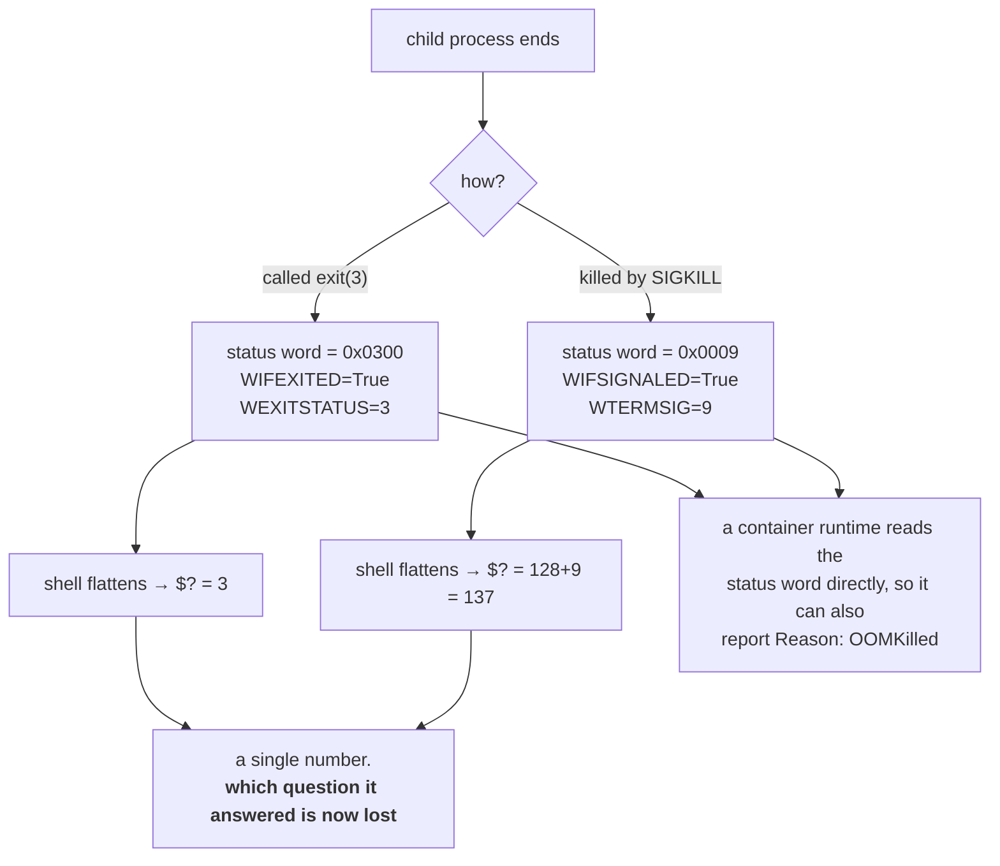

# 3.2 — `128 + N` — when a signal becomes an exit code

## One-line answer

A process killed by a signal never chose an exit code, so the shell invents one — `128` plus the signal
number — which is why `137` and `143` are not arbitrary numbers but sentences you can read.

---

## The story

🎬 **The scene.** A hospital records office. Every patient file has a discharge field with two possible
kinds of entry.

Most say what the patient said on the way out: *"went home, feeling better"*, *"discharged himself
against advice"*. The patient spoke and somebody wrote it down.

A few say something different, in a different handwriting: *"did not leave — was carried out by the fire
service"*. The patient said nothing at all. Somebody else observed what happened and recorded it,
because the field cannot be left blank.

😬 **The naive fix.** A records clerk decides the two kinds of entry are confusing and standardises
them: every file now just says *"left the building"*.

💥 **Why it fails.** Six months later somebody asks how many patients left under their own power. The
answer is unrecoverable. The distinction that was thrown away — *did they decide, or was it decided for
them* — was the only interesting thing in the field, and it was the thing that told you whether to
investigate.

💡 **The insight.** When a slot must always be filled, and sometimes the subject cannot fill it,
somebody else fills it on their behalf. **The value of the convention is that you can tell which of the
two happened**, and a scheme that makes the two indistinguishable has destroyed the information it was
supposed to carry.

---

## The idea in plain language

Part [3.1](3.1-the-exit-code-is-the-whole-return-value.md) said every process hands back one number. But
a process killed by `SIGKILL` never ran a line of its own code on the way out
([2.4](../02-signals/2.4-the-signals-you-cannot-catch.md)) — so it never chose a number. Something has
to go in the slot.

The kernel's answer is not a number at all. Verified against `man7.org/linux/man-pages/man2/wait.2.html`
on **2026-08-24**, the parent gets a *status word* that it inspects with macros:

- `WIFEXITED()` — *"returns true if the child terminated normally, that is, by calling exit(3) or
  _exit(2), or by returning from main()."*
- `WEXITSTATUS()` — *"returns the exit status of the child. This consists of the least significant 8
  bits of the status argument that the child specified in a call to exit(3) or _exit(2)."*
- `WIFSIGNALED()` — *"returns true if the child process was terminated by a signal."*
- `WTERMSIG()` — *"returns the number of the signal that caused the child process to terminate."*
- `WCOREDUMP()` — *"returns true if the child produced a core dump."*

**So at the kernel level there is no ambiguity whatsoever.** The parent asks two separate questions —
*did it exit or was it signalled?* and then *with what?* — and gets two separate answers.

### Where `128 + N` comes from

The shell wants to give you a single number, because `$?` is one variable. So it flattens the status
word by convention:

- if `WIFEXITED`, report `WEXITSTATUS` — the number the program chose;
- if `WIFSIGNALED`, report **`128 + WTERMSIG`** — the signal number, offset.

`128` is chosen because a legal exit code is 0 to 255 and programs conventionally use small numbers, so
the range from 129 upward is unlikely to collide with anything a program would pick deliberately.

**This is a shell convention, not a kernel rule.** The kernel never produces the number `137`; `bash`
does, on your behalf, so that `$?` can hold the answer.

### The three you should recognise on sight

| Exit code | Arithmetic | Signal | What actually happened |
| --- | --- | --- | --- |
| `130` | `128 + 2` | `SIGINT` | somebody pressed `Ctrl-C` |
| `137` | `128 + 9` | `SIGKILL` | it was hard-killed — by you, by a grace period expiring, or by the out-of-memory killer |
| `143` | `128 + 15` | `SIGTERM` | it was asked to stop and did not handle it, so the kernel's default action terminated it |

**`137` is the one that will follow you through this entire curriculum.** It is the exit code of a
container that hit its memory limit (Day 6, Day 30), of a Pod that overran its grace period (Day 41),
and of anything the out-of-memory killer chose. When you see `137`, the question is never "what bug is
in the code" — it is "who killed it, and why".

**`143` is the tell that a process has no `SIGTERM` handler.** A well-behaved service catches `SIGTERM`,
drains, and calls `exit(0)`, so it reports `0` — you saw exactly this in
[2.2](../02-signals/2.2-sigterm-and-sigkill-the-request-and-the-order.md), where uvicorn exited `0` on
`SIGTERM` and `137` on `SIGKILL`. A service reporting `143` is a service where the default action
happened, which means nothing was drained and nothing was flushed.

### The collision the convention cannot avoid

A program is free to call `exit(137)` deliberately. Nothing prevents it, and the shell cannot tell the
difference — both produce `$? == 137`.

**The kernel can tell the difference**, because `WIFEXITED` and `WIFSIGNALED` are separate questions.
The information is lost only in the flattening. In practice this ambiguity almost never bites, because
programs do not choose numbers above 128 — but it is why a container runtime, which reads the status
word directly rather than through a shell, can report `OOMKilled` as a *reason* alongside the code
`137`. That reason is not derived from the number; it is a separate fact the runtime observed.

**When you have the reason, trust the reason. When you only have the number, `137` means "something
killed it" and you go looking for who.**

---

## Why Kriya needs it

Day 6's title is *"why your process was simply `Killed`"* and the answer is `137` plus the out-of-memory
killer. That day cannot be written without this one.

Day 30's container failure lab lists `exit 137` as one of its exhibits, and distinguishing "the memory
limit killed it" from "the grace period expired and the runtime killed it" is exactly the skill this
part builds — same number, two causes, different fixes.

Day 40 reads `kubectl describe pod` and finds `Last State: Terminated, Reason: OOMKilled, Exit Code:
137`. Three fields, and you now know that the number and the reason are separately-sourced facts.

Day 26's restart policy branches on the exit code, so `on-failure` treats `143` as a failure worth
restarting and `0` as a clean stop. A service that exits `143` on every ordinary deploy is a service
that gets restarted when it was supposed to be stopping.

---

## The mechanism

Produce all three numbers deliberately and read them back.

```bash
for SIG in INT TERM KILL; do
  sleep 60 &
  P=$!
  sleep 0.3
  kill -"$SIG" "$P"
  wait "$P" 2>/dev/null
  echo "SIG$SIG -> exit $?"
done
```

**Line by line:**

- `sleep 60` is the perfect subject: it installs no handlers at all, so every ending is the kernel's
  default action ([2.1](../02-signals/2.1-what-a-signal-actually-is.md)) and nothing is confused by a
  program's own choices.
- `P=$!` immediately, before anything else moves it
  ([1.2](../01-the-process/1.2-pid-parent-and-the-process-tree.md)).
- `sleep 0.3` — let the process actually exist before you signal it. Without this the kill sometimes
  races the fork and you get `No such process`.
- `kill -"$SIG"` — by name, quoted so the loop variable expands cleanly. Names rather than numbers, for
  the Cygwin-numbering reason in [2.1](../02-signals/2.1-what-a-signal-actually-is.md).
- `wait "$P" 2>/dev/null` — collect the status. The redirection suppresses the shell's own `Terminated`
  job-control message, which would otherwise interleave with the output and make the table hard to read.
- `echo "... exit $?"` on the very next line, because `$?` is destroyed by anything that runs after it
  ([3.1](3.1-the-exit-code-is-the-whole-return-value.md)).

Observed on **2026-08-24**:

```text
SIGINT -> exit 130
SIGTERM -> exit 143
SIGKILL -> exit 137
```

**Three signals, three numbers, and the arithmetic is visible:** 128+2, 128+15, 128+9. Note that these
are the *Linux* signal numbers even though this is Git Bash — the Cygwin layer maps its own numbering to
the Linux one when reporting status, which is another reason to send by name and read the resulting code
rather than trying to do the arithmetic in your head from a `kill -l` listing.

### Seeing what the shell is hiding

Python can ask the kernel the two questions separately, which is the honest version:

```python
# days/day-004-linux-for-operators-i/lab/wait_status.py
import os
import signal
import subprocess
import sys

proc = subprocess.Popen([sys.executable, "-c", "import time; time.sleep(60)"])
pid = proc.pid
print(f"[main] child pid={pid}", flush=True)

os.kill(pid, signal.SIGKILL)
waited_pid, status = os.waitpid(pid, 0)

print(f"[main] raw status word: {status} (0x{status:04x})", flush=True)
print(f"[main] WIFEXITED   = {os.WIFEXITED(status)}", flush=True)
print(f"[main] WIFSIGNALED = {os.WIFSIGNALED(status)}", flush=True)
if os.WIFSIGNALED(status):
    sig = os.WTERMSIG(status)
    print(f"[main] WTERMSIG    = {sig} ({signal.Signals(sig).name})", flush=True)
    print(f"[main] shell would report: {128 + sig}", flush=True)
else:
    print(f"[main] WEXITSTATUS = {os.WEXITSTATUS(status)}", flush=True)
```

**Line by line:**

- `subprocess.Popen([sys.executable, "-c", ...])` — start a child. `sys.executable` rather than the
  string `"python"`, so it uses **this** interpreter — the one inside `.venv` — rather than whatever
  `PATH` resolves to (Day 0's interpreter lesson, applied).
- `os.kill(pid, signal.SIGKILL)` — the system call `kill` the command is named after. `os.kill` sends a
  signal; it does not necessarily kill.
- `os.waitpid(pid, 0)` — block until the child ends and return `(pid, status)`. **`status` here is the
  raw status word, not an exit code.** The `0` is the flags argument; zero means "wait for it to
  finish".
- `f"0x{status:04x}"` — print it in hexadecimal too, because the structure is byte-wise and hex makes it
  visible: the signal number lives in the low byte, the exit status in the next one up.
- `os.WIFEXITED` / `os.WIFSIGNALED` — the two macros from the manual page, exposed in Python under the
  same names. **Asking both is the point**: exactly one of them is true, and which one is the fact the
  shell throws away.
- `signal.Signals(sig).name` — turn the number into `SIGKILL`, as in
  [2.3](../02-signals/2.3-catching-a-signal-in-python.md).
- `128 + sig` — compute what the shell would have shown, so the two views sit next to each other.

```text
[main] child pid=33104
[main] raw status word: 9 (0x0009)
[main] WIFEXITED   = False
[main] WIFSIGNALED = True
[main] WTERMSIG    = 9 (SIGKILL)
[main] shell would report: 137
```

**The raw status word is `9`, not `137`.** The kernel stored the signal number in the low byte and set no
exit status at all. `137` exists nowhere in this data — it is manufactured by the shell at the moment it
needs a single number. That is the whole of this part in one line of output.

Compare with a normal exit by changing one line:

```python
proc = subprocess.Popen([sys.executable, "-c", "import sys; sys.exit(3)"])
```

**Line by line:** the same child, ending by its own choice with `3` instead of being killed. Everything
else in the program is unchanged, so the difference in output is attributable only to how the process
ended.

```text
[main] child pid=33118
[main] raw status word: 768 (0x0300)
[main] WIFEXITED   = True
[main] WIFSIGNALED = False
[main] WEXITSTATUS = 3
```

**`0x0300` — the `3` is in the *second* byte.** That is the layout: exit status in the high byte, signal
number in the low byte, and the macros are just readable names for the shifting and masking. `768` is
`3 << 8`.



---

## When it breaks

**`exit 137` and no explanation anywhere.** The canonical production mystery:

```text
$ docker ps -a --filter name=pulse --format '{{.Names}}\t{{.Status}}'
pulse   Exited (137) 4 seconds ago
```

with an application log that ends mid-sentence and contains no error at all.

**What it says:** the container exited with 137.
**What it actually means:** the process was `SIGKILL`ed, so no shutdown code ran and no final log line
was written ([2.4](../02-signals/2.4-the-signals-you-cannot-catch.md)). **The absence of an error in the
log is evidence, not a gap** — it is exactly what a hard kill looks like.
**The smallest fix:** find out who sent it. There are only three candidates and one command distinguishes
them:

```bash
docker inspect pulse --format '{{.State.OOMKilled}} {{.State.ExitCode}} {{.State.Error}}'
```

**Line by line:** `docker inspect` reads the runtime's own record rather than the flattened exit code, so
`.State.OOMKilled` is a genuine boolean the runtime observed — the thing the number `137` cannot tell
you. Printing all three together answers "was it memory, and if not, what".

```text
true 137
```

**`true` means the kernel's out-of-memory killer chose it** (Day 6, section 4). `false 137` means
something else sent the signal — most often a `docker stop` whose grace period expired, or a human.

**`exit 143` on every single deploy.** Quiet and expensive:

```text
$ kubectl get pods -l app=pulse
NAME                     READY   STATUS        RESTARTS   AGE
pulse-7c9f5d8b4-x2kpq    1/1     Terminating   0          8m
$ kubectl describe pod pulse-7c9f5d8b4-x2kpq | grep -A3 'Last State'
    Last State:     Terminated
      Reason:       Error
      Exit Code:    143
```

**What it says:** the previous container terminated with an error, code 143.
**What it actually means:** it received `SIGTERM` and had no handler, so the kernel's default action
terminated it — mid-request, with nothing flushed. And **it is reported as `Reason: Error`**, which is
technically true and misleading, because from the operator's point of view this was an ordinary planned
shutdown that happened to be violent.
**The smallest fix:** handle `SIGTERM` and exit `0`
([2.3](../02-signals/2.3-catching-a-signal-in-python.md),
[4.1](../04-the-service-died/4.1-graceful-shutdown-for-pulse.md)). **The tell to remember: a clean
shutdown reports `0`. If you see `143` you have never been shutting down cleanly, on any deploy, ever.**

**`130` in a CI log.** Confusing because nobody pressed anything:

```text
Command exited with code 130
##[error]Process completed with exit code 130.
```

**What it says:** the process was interrupted.
**What it actually means:** `128 + 2` is `SIGINT`, and in CI nobody has a keyboard. The runner sent it —
almost always because the **job timed out** and the runner interrupts before it kills. Reading it as
"someone cancelled" sends you looking for a person; reading it as "the job exceeded its limit" sends you
to the right place.
**The smallest fix:** look at the job's elapsed time against its configured limit before you look at
anything else. Day 13 sets that limit for the first time.

---

## In production

**What a professional writes instead of the teaching version.** They stop reading exit codes through a
shell wherever a richer source exists. `kubectl describe` gives exit code *and* reason *and* the
termination timestamp; `docker inspect` gives the `OOMKilled` boolean; systemd's `systemctl status`
gives the signal name directly. **All of those read the status word rather than a flattened number**, so
they can distinguish things `$?` cannot. Reaching for the richer source first is the habit; `$?` is what
you use when it is all you have.

**What degrades at scale.** The number stops being enough to route on. In a fleet, "some containers exit
137" is a fact about hundreds of events with at least three distinct causes — memory limits, grace
period overruns, and node evictions — and they need different owners and different fixes. So production
does not alert on the code; it alerts on the *reason*, and uses the code only to group. **A dashboard of
exit codes without reasons is a dashboard that tells you something is wrong and never what**, which is
the definition of an alert that gets ignored.

**The failure that only shows with real traffic.** The grace-period overrun that is indistinguishable
from a memory kill. Both produce `137`. Under light load a service drains inside its grace period every
time, and you never see it; under real load draining takes longer than the grace period for a fraction
of instances, and those get hard-killed — producing a low, steady background of `137` that looks exactly
like intermittent memory pressure. **The discriminator is the `OOMKilled` flag**, and teams without it
have spent weeks raising memory limits to fix a shutdown problem.

**The review comment a senior engineer leaves.** *"This alert fires on `exit != 0`, so it fires on 143
too — which is every normal shutdown for this workload because we never handled `SIGTERM`. Either fix
the handler so clean stops report 0, or the alert is going to be ignored within a week and then it is
worse than nothing."*

**The signal you would alert on.** **The rate of terminations by signal, split by signal number** — and
in Kubernetes, split by termination reason rather than by code. `137` with `OOMKilled: true` is a
capacity problem and should page during business hours. `137` with `OOMKilled: false` is a shutdown
problem and belongs in a deploy report. `143` is a missing signal handler, which is a defect ticket, not
a page. **The value of splitting by code is that it routes the alert to a different fix**; a single
"non-zero exit" alert cannot do that. You would **not** alert on `130`, which in CI just means the job
hit its own limit and the CI system already reports it.

**Blast radius.** Reading exit codes changes nothing; this part introduces no capability. **The blast
radius is in what you conclude.** Worst case: mistaking `137` for an application bug and rewriting code
for a week while a memory limit sits ten megabytes too low — or the reverse, raising memory limits
repeatedly to fix a grace-period problem, which costs real capacity across a fleet and never works.
Who can trigger it: anyone reading a number without its reason. What bounds it: always fetch the reason
alongside the code, and record both in `docs/INCIDENTS.md` so the mapping from symptom to cause is
written down the first time you learn it — which is exactly what that ledger's *first symptom* column is
for.

**Cost.** `0` model calls, `0` tokens, `0` CI minutes, `0` disk, `0` memory. Reading a status word costs
nothing. **The cost of misreading one is measured in days**, and the `docker inspect` above is the
cheapest possible insurance against it.

**The interview question.** *"Your pod's exit code is 137. What happened, and what do you do next?"* The
answer that lands refuses to guess and names the discriminator: *"137 is `128 + 9`, so it was
`SIGKILL`ed — no cleanup ran, which is why the log just stops. That gives me three candidates: the
kernel's OOM killer because it exceeded its memory limit, the kubelet because it overran
`terminationGracePeriodSeconds` during a normal shutdown, or a node eviction. The number alone cannot
tell them apart, so I check the termination reason — `OOMKilled` true or false — because memory and
shutdown are completely different fixes and I have watched people raise memory limits for weeks to fix
a slow drain."* Then the detail that shows depth: *"and if it were 143 rather than 137, that is
`SIGTERM` with no handler, which means we have never shut down cleanly on any deploy."*

---

## Check yourself

```bash
for S in INT TERM KILL; do sleep 30 & P=$!; sleep 0.3; kill -$S $P; wait $P 2>/dev/null; printf 'SIG%-5s -> %3d  (128 + %d)\n' "$S" "$?" "$(kill -l "$S" 2>/dev/null || echo '?')"; done
```

All three, with the arithmetic printed alongside so you can check it rather than trust it. `kill -l
TERM` prints the numeric value of a named signal — the reverse lookup of `kill -l` with no argument —
which is how you verify that `143` really is `128 + 15` on *this* system rather than assuming it.

**Say out loud, without scrolling up:** *`137` appears in your logs. Name the three things that could
have sent that signal, and the one field — not the exit code — that tells you which.*
