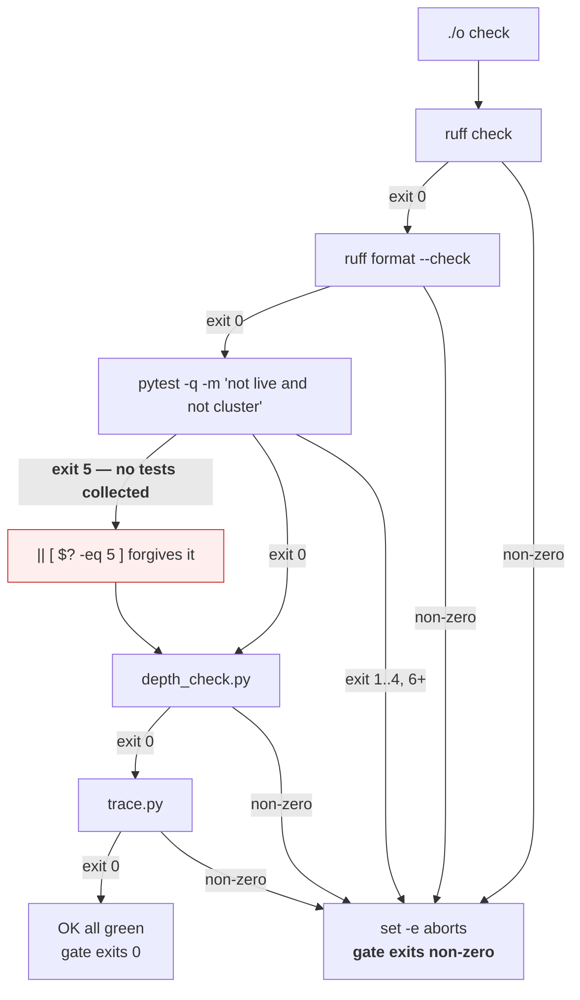

# 3.3 — The exit code your gate already reads

## One-line answer

`./o check` has been making every decision it makes from exit codes since Day 0 — and reading its source
now, with signals and status words understood, turns a script you were told to trust into a mechanism
you can audit and break on purpose.

---

## The story

🎬 **The scene.** A rented flat with a smoke alarm on the hallway ceiling. It has been there since
before you moved in. It has never made a sound.

Every day you walk under it. It is white, it is round, and as far as you know it works, because that is
what those things do.

😬 **The naive fix.** You leave it alone. It has never gone off, which feels like evidence.

💥 **Why it fails.** "It has never gone off" is evidence of exactly one thing: there has been no fire.
It is equally consistent with a working alarm, a dead battery, an alarm somebody disconnected during a
kitchen incident four tenants ago, and a plastic shell with nothing inside it. **You have no way to
distinguish those four situations except by pressing the button** — and the reason nobody presses the
button is that it is loud and nothing has ever gone wrong.

💡 **The insight.** A safety device that has never activated has never been tested. The whole point of
the test button is to let you find out which of the four situations you are in *while it is cheap*,
rather than during the one event it exists for. **A gate nobody has watched fail is not a gate; it is a
decoration you believe in.**

---

## The idea in plain language

Day 0 gave you a driver called `o` with a `check` command, and told you it runs lint, format, tests,
depth and traceability, and refuses if any of them fails. You have been running it ever since.

Everything in that sentence is an exit code claim:

- "runs lint" — starts a process.
- "fails" — that process exited non-zero.
- "refuses" — the script propagates the non-zero code rather than swallowing it.

Parts [3.1](3.1-the-exit-code-is-the-whole-return-value.md) and
[3.2](3.2-128-plus-n-when-a-signal-becomes-an-exit-code.md) gave you the vocabulary to read all three.
This part uses it on the one script that decides whether your work is allowed into the repository.

### Why this is Principle 4, not busywork

The plan's Principle 4 is **build first, adopt after**: hand-roll the mechanism once so the tool is a
convenience rather than a mystery. Day 0 handed you `o` as a working tool, which was the right way round
— you needed a gate before you needed to understand gates. Today the understanding arrives, and the
right thing to do with it is to point it at the tool you have been trusting.

There is a second reason, and it is Principle 11: **every gate must be able to go red.** Day 0 already
made you prove that once, and `docs/INCIDENTS.md` rows 2 through 5 are the record. But it also recorded
something with an expiry date — row 4 noted that pytest's exit code `5` is forgiven, which was correct
when there were no tests and became wrong on Day 3 when four appeared. **That expiry has now passed**,
and this part is where you look at it with the knowledge to understand it.

### The three shapes a gate can have

| Shape | What it does with a failing step | Consequence |
| --- | --- | --- |
| **no propagation** | prints the failure, continues, exits 0 | CI is green while the code is broken — the worst outcome |
| **`set -e`** | aborts on the first non-zero exit | later checks never run, so you fix one thing at a time |
| **collect-then-report** | runs everything, remembers failures, exits non-zero | full picture in one run, more code to get right |

`o` uses `set -e`, which is the right default for a small gate: it is the shape that is hardest to get
wrong. The cost is real and worth naming — **a lint error hides a test failure**, because the run stops
at the first problem. You saw exactly that on Day 0, recorded as `docs/INCIDENTS.md` row 2: *"The gate
stopped at check 1 of 5 and never ran the other four."*

---

## Why Kriya needs it

Day 13 builds the first CI pipeline, and it will run `./o check`. Whatever this script's exit code
semantics are, they become the semantics of your build. A gap here becomes a gap in CI on that day.

Day 14 is *"quality gates — a gate that refuses rather than warns"*, and it closes the pytest exit-5
hole with a minimum test count. That day is the direct sequel to this part, and it will make much more
sense if you have already read the `|| [ $? -eq 5 ]` line and understood exactly what it forgives.

Day 17 adds secret scanning to CI. `docs/INCIDENTS.md` row 9 — the fake key appended to a tracked
`.env.example`, which produced `exit=0, all five checks green` — is a hole in this same script, found on
Day 0 and closed on Day 17.

Day 19 is *rollback is a feature*, and a rollback decision is an exit code from a verification step. The
habit of asking "what does this script actually return, and when" starts here.

---

## The mechanism

Read the gate. It is short, and you now have the vocabulary for every line of it.

```bash
sed -n '1,6p' o
```

**Line by line:** `sed -n '1,6p'` prints lines 1 to 6 and nothing else — `-n` suppresses the default
printing so only the `p` command produces output. Reading the top of a script first is the habit: the
options set there govern everything below.

Observed on **2026-08-24** (your copy may differ if you have edited it — read yours, not this):

```text
#!/usr/bin/env bash
# Project Kriya daily driver. Replaces `make`, which is not installed on Windows.
# Written on Day 0; every later day assumes it. See days/day-000-*/parts/04-the-driver/.
set -euo pipefail

cd "$(dirname "$0")"
```

**`set -euo pipefail` is the entire safety model of this script**, and you met all three options in
[3.1](3.1-the-exit-code-is-the-whole-return-value.md): abort on the first non-zero exit, treat unset
variables as errors, and make a pipeline fail if any stage failed. Without the first one, every check
below would run and the script would exit with whatever the last one returned. The `cd "$(dirname
"$0")"` on the next line is a smaller but related discipline — the script moves to its own directory so
every relative path below means the same thing regardless of where you invoked it from.

Now the part that matters today:

```bash
grep -n 'pytest' o
```

**Line by line:** find every line mentioning the test runner, with line numbers so you can look at the
surrounding context. Searching for the specific thing you are investigating beats reading the whole file
top to bottom.

```text
85:    # pytest exits 5 for "no tests collected". Before the first test exists an empty suite is not a
87:    uv run python -m pytest -q -m "not live and not cluster" || [ $? -eq 5 ]
```

**This is the line Day 0's incident row 4 predicted would expire.** Read it as three parts:

- `uv run python -m pytest -q -m "not live and not cluster"` — run the offline suite. `-m "not live and
  not cluster"` deselects the markers declared in `pyproject.toml`, so this never hits a real API or a
  real cluster.
- `|| [ $? -eq 5 ]` — **the exemption.** `||` runs the right-hand side only when the left-hand side
  failed ([3.1](3.1-the-exit-code-is-the-whole-return-value.md)). `[ $? -eq 5 ]` is a test that succeeds
  when the exit code was exactly `5`.
- Because the whole compound command now succeeds when pytest exits `5`, `set -e` does not abort. **Exit
  code 5 is pytest's "no tests were collected".**

**Why it was right and why it is now wrong.** On Day 0 there were no test files at all, so pytest exited
`5` on every run and the gate would have been permanently red. Forgiving it was correct. From Day 3
there are four tests, and `5` no longer means "nothing to run" — it means **"the tests did not run, and
you cannot tell why"**: a renamed file, a broken `testpaths`, a collection error masked into the same
code. The gate reports green.

### Make it go red — and make it stay green when it should not

This is the Principle 11 exercise, and there are two halves. Do both.

**Half one: prove the gate still works.**

```bash
printf 'def test_deliberate():\n    assert 1 == 2\n' > tests/test_gate_probe.py
./o check
echo "gate exit: $?"
```

**Line by line:**

- `printf` rather than an editor, so the file's exact content is in the command and reproducible.
  `\n` for newlines because `printf` interprets them, unlike `echo` on some shells.
- A test that cannot pass — the smallest possible genuine failure.
- `./o check` runs the full gate; `echo "gate exit: $?"` immediately after, before anything can clobber
  it ([3.1](3.1-the-exit-code-is-the-whole-return-value.md)).

```text
FAILED tests/test_gate_probe.py::test_deliberate - assert 1 == 2
1 failed, 4 passed in 0.51s
gate exit: 1
```

**`1`, not `0`.** The exemption did not swallow a real failure — `[ $? -eq 5 ]` is false when the code is
`1`, so the `||` fails, and `set -e` aborts. This is the control experiment, and it is what
`docs/INCIDENTS.md` row 4 confirmed on Day 0.

```bash
rm tests/test_gate_probe.py
./o check
echo "gate exit: $?"
```

**Line by line:** remove the probe and confirm the gate returns to green. **Always run the restore step
and check it** — a drill that leaves the repository broken is an incident you caused (Day 3, §4).

**Half two: prove the hole is real.**

```bash
git mv tests/test_api.py tests/api_tests.py
./o check
echo "gate exit: $?"
uv run python -m pytest --collect-only -q | tail -2
```

**Line by line:**

- `git mv` rather than `mv`, so the rename is staged and `git status` shows you exactly what you did —
  which makes undoing it one command instead of a memory exercise.
- The new name does not match `test_*.py`, so pytest's default collection ignores it entirely. **The
  file is still there, the tests are still correct, and nothing runs them.**
- `--collect-only -q` counts what pytest would run without running it, and `tail -2` gets the summary
  line. This is the manual count Day 3's hub already told you was the only available evidence.

```text
OK all green
gate exit: 0
no tests ran in 0.02s
```

**Read those three lines together.** The gate says everything is fine. The gate's exit code says
everything is fine. And zero tests exist as far as the runner is concerned. **The gate is green and the
test suite is not running**, which is precisely the situation the exemption was written to permit and
precisely the situation you now never want to permit again.

Put it back:

```bash
git mv tests/api_tests.py tests/test_api.py
uv run python -m pytest --collect-only -q | tail -1
git status --short
```

**Line by line:** rename back, confirm collection is restored by counting again rather than assuming,
and `git status --short` as the proof that the working tree is clean. Three commands, and the third one
is the one people skip.

```text
4 tests collected in 0.44s
```



---

## When it breaks

**The gate that is green because it stopped early.** Day 0 recorded this as incident row 2, and it is
worth reproducing with your new vocabulary:

```text
$ ./o check
F401 [*] `os` imported but unused
 --> .probe\bad.py:1:8
Found 1 error.
$ echo $?
1
```

**What it says:** one lint error, exit 1.
**What it actually means:** the gate is correct *and* it has told you about one problem out of a
possibly larger number, because `set -e` aborted at check one of five. Your tests may also be failing
and you have no idea.
**The smallest fix:** none — this is the intended behaviour of `set -e` and the tradeoff was chosen
deliberately. **The thing to know is that a red gate is a lower bound on your problems, never a
complete list.** When you have fixed the lint error, run it again; there may be more behind it.

**The exemption swallowing something that is not an empty suite.** The hole with teeth:

```text
$ ./o check
ERROR tests/test_api.py - ModuleNotFoundError: No module named 'httpx2'
!!!!!!!!!!!!!!!!!!! Interrupted: 1 error during collection !!!!!!!!!!!!!!!!!!!!
$ echo $?
1
```

**What it says:** a collection error, exit 1 — so the gate correctly went red.
**What it actually means:** this particular collection failure produces `2`, not `5`, so the exemption
does not apply and the gate catches it. **Good news, and worth verifying rather than assuming**, because
the exemption's safety depends entirely on which failures produce `5` and which do not.

Check it for yourself rather than trusting the paragraph above:

```bash
uv run python -m pytest -q tests/does_not_exist.py; echo "missing path -> $?"
uv run python -m pytest -q --ignore=tests; echo "nothing to collect -> $?"
```

**Line by line:** two different ways of ending up with no tests — pointing at a path that is not there,
and excluding everything. Printing each exit code immediately shows you which of them lands on `5` and
therefore which of them the gate would forgive. **This is the experiment that tells you how big the hole
actually is**, and it takes one line.

```text
ERROR: file or directory not found: tests/does_not_exist.py
missing path -> 4
no tests ran in 0.01s
nothing to collect -> 5
```

**`4` for a bad path, `5` for an empty collection.** So a typo'd path is caught and a genuinely empty
suite is forgiven — which is the exemption behaving exactly as documented, and is still wrong from Day 3
onward for the reason above.

**The check that passed because nothing was checked.** The general shape, and it is not limited to
pytest:

```text
$ uv run ruff check nonexistent_dir/
warning: No Python files found under the given path(s)
$ echo $?
0
```

**What it says:** the linter succeeded.
**What it actually means:** it linted nothing. **Zero files with zero problems is indistinguishable from
a thousand files with zero problems, if you only read the exit code.**
**The smallest fix, and the general principle:** a gate should assert on the *quantity* it checked, not
only on the absence of failures. Day 14 does exactly this for tests with a minimum count, and the same
idea applies to every check in the script.

---

## In production

**What a professional writes instead of the teaching version.** They make the gate assert a floor as
well as a ceiling. It is not enough that nothing failed; something must have *run*. Concretely: a
minimum test count, a minimum number of files linted, a coverage threshold that fails when coverage
data is missing rather than treating absence as zero problems. The rule of thumb is **"absence of
failure is not evidence of checking"**, and every mature CI configuration has been bitten into learning
it at least once.

**What degrades at scale.** `set -e` stops being acceptable. With five checks that finish quickly, "stop
at the first failure and run it again" is fine. With a pipeline of thirty jobs, several of which take a
long while, a developer who has to make thirty round trips to find thirty problems will start batching
guesses, and the feedback loop breaks down. So real pipelines move to the collect-then-report shape:
every check runs, failures are aggregated, and the job exits non-zero once at the end with a full
report. Day 14 makes this transition, and this part is where you should notice the current script cannot.

**The failure that only shows with real traffic.** The gate that degrades silently as the project grows.
On Day 3 the exemption is a known, documented hole with a dated expiry. On Day 60 it is a line nobody has
read in two months, in a script everybody trusts, in a repository where somebody has just reorganised the
test layout. Nothing announces the change; the suite simply stops being collected and the gate keeps
saying green. **This class of decay is why `docs/INCIDENTS.md` row 4 named an expiry condition rather
than just describing the behaviour** — a hole with a date attached gets closed, and one without becomes
part of the furniture.

**The review comment a senior engineer leaves.** *"This CI step is `pytest || true` so the pipeline
doesn't break while we stabilise the suite. That means the test job can never fail, so from now on it
carries no information at all — and nobody will remember to take it out. If the suite is unstable, quarantine
the flaky tests by name and keep the gate real."*

**The signal you would alert on.** For a gate, the signal worth watching is **the ratio of red runs to
total runs, over time**. A gate that never goes red is either a perfect team or a broken gate, and the
second is far more common — so a check that has not failed in a long time is a check to go and test on
purpose. That is a report you read weekly, not a page. You would **not** alert on an individual failing
build: that is the system working, the developer already knows, and paging on it is how alert fatigue
starts.

**Blast radius.** This part introduces the act of *modifying the gate*, which is the most consequential
capability on this day. Worst case: an edit that makes the gate incapable of failing — a stray `|| true`,
an over-broad exemption, a `set +e` — and from that moment every check in this repository reports green
regardless of the truth, silently, until somebody notices a bug that all five checks should have caught.
Who can trigger it: anyone who edits `o`, which is you. What bounds it: **the drill in this part is the
bound.** After any change to the gate, deliberately break something and confirm it goes red, then
restore and confirm it goes green. Both halves — a gate that cannot fail and a gate that cannot pass are
equally useless. Record what you did in `docs/INCIDENTS.md`, with the first symptom before the cause.

**Cost.** `0` model calls, `0` tokens, `0` disk beyond a temporary test file. `0` CI minutes today,
because there is no pipeline until Day 13 — **and this is the last day that row is zero for free**, since
from Day 13 every run of this gate costs CI minutes against a free-tier budget. A gate that aborts early
is cheaper than one that runs everything, which is a real argument for `set -e` that has nothing to do
with correctness.

**The interview question.** *"How do you know your CI is actually testing anything?"* The answer that
lands is a practice rather than a tool: *"Because I have watched it fail. Any time I touch the pipeline
I deliberately break something — a failing assertion, a lint error, a missing file — and confirm the job
goes red, then restore it and confirm it goes green. The failure mode I am guarding against is a gate
that reports success because it checked nothing: an empty test collection, a linter pointed at the wrong
directory, a step with `|| true` left in from a bad week. Those all produce exit 0 and look identical to
success, so the only way to distinguish them is to assert a floor — a minimum test count — and to press
the test button occasionally."*

---

## Check yourself

```bash
git mv tests/test_api.py tests/api_tests.py && ./o check; echo "gate with no tests collected: $?"; git mv tests/api_tests.py tests/test_api.py && uv run python -m pytest --collect-only -q | tail -1 && git status --short && echo "restored clean"
```

The whole drill in one line: hide the suite, run the gate, print its exit code, restore, count the
collected tests, and prove the working tree is clean. **The number you are looking for is a `0` from a
gate that tested nothing** — and having seen it once, you will recognise it on Day 14 when you close it.

**Say out loud, without scrolling up:** *`./o check` prints `OK all green` and exits 0. Name two
completely different situations that produce exactly that output, and say what you would add to the
script to tell them apart.*
