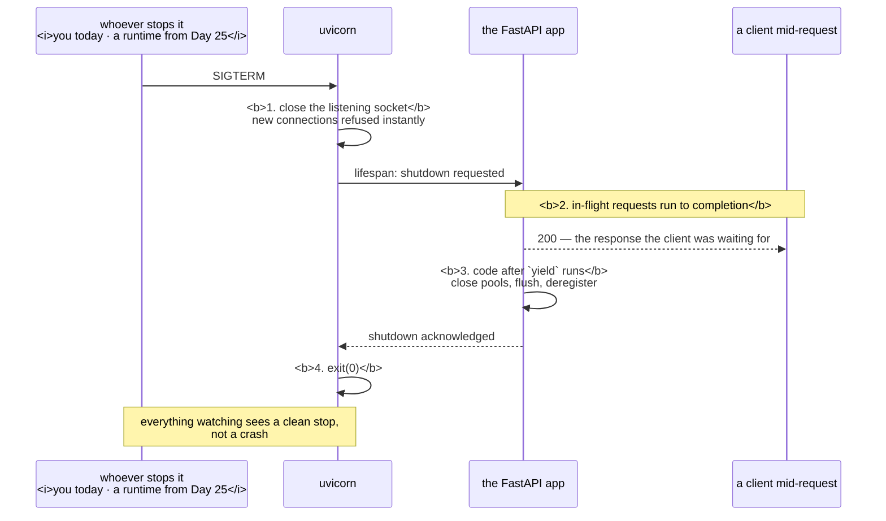

# 4.1 — Graceful shutdown for `pulse`

## One-line answer

Graceful shutdown is four things in a fixed order — stop accepting new work, finish what is in flight,
release what you hold, exit `0` — and `pulse` already does three of them because uvicorn does, which
makes today about *proving* it rather than writing it.

---

## The story

🎬 **The scene.** A small bakery at closing time. The owner has a routine and it never varies.

First she turns the sign on the door to CLOSED and slides the bolt. Anyone arriving now is not let in.
Then she serves the four people already inside — every one of them, unhurried. Then she counts the till,
turns off the ovens, puts the trays in the sink and locks up. Then she goes home.

😬 **The naive fix.** A relief manager decides the routine is fussy and does it in a different order:
serves who he can, then turns the sign, then leaves.

💥 **Why it fails.** While he is serving the queue, more people come in — because the sign still says
OPEN. The queue never empties. At the point he decides he has had enough, there are three people
standing at the counter who came in believing they would be served, and he walks past them to the door.
The ovens are still on.

**And the ordering is the whole of it.** He did all the same things. He did them in the wrong sequence,
so the step that was supposed to bound the work happened after the work.

💡 **The insight.** Shutting down cleanly is not a list of tasks, it is a **sequence**, and the first
step is always the one that stops the situation getting worse. Anything that finishes work before it
stops accepting work is not draining — it is racing.

---

## The idea in plain language

"Graceful shutdown" means the process ends without anybody outside noticing anything except that it went
away. Concretely, four steps, and the order is not negotiable:

1. **Stop accepting new work.** Close the listening socket — the doorway on port 8000 — so new
   connections are refused immediately rather than accepted and abandoned. From this instant the amount
   of outstanding work can only go down.
2. **Finish what is in flight.** Let requests that were already being handled run to completion and send
   their responses. This is the part that has to fit inside the grace period
   ([2.2](../02-signals/2.2-sigterm-and-sigkill-the-request-and-the-order.md)).
3. **Release what you hold.** Close database connections, flush buffered writes to disk, flush buffered
   log lines, deregister from anything you registered with.
4. **Exit `0`.** Deliberately, so that everything watching knows this was an intended stop and not a
   crash ([3.2](../03-exit-codes/3.2-128-plus-n-when-a-signal-becomes-an-exit-code.md)).

**Step 1 before step 2 is the whole trick.** If you drain first and close the door second, new
connections keep arriving into the pool you are trying to empty.

### What `pulse` already has, and what it does not

You did not write any of this and it is already working, which is worth being precise about rather than
vague. Uvicorn installs handlers for `SIGTERM` and `SIGINT`
([2.1](../02-signals/2.1-what-a-signal-actually-is.md)) and runs the sequence above. You watched it in
[2.2](../02-signals/2.2-sigterm-and-sigkill-the-request-and-the-order.md):

```text
INFO:     Shutting down
INFO:     Waiting for application shutdown.
INFO:     Application shutdown complete.
INFO:     Finished server process [31654]
```

Those four lines are steps 1 to 4 announcing themselves. `Shutting down` is the socket closing.
`Waiting for application shutdown` is the drain. `Application shutdown complete` is the release.
`Finished server process` is the exit, and the code was `0`.

**What `pulse` does not have is anything of its own to release.** No database, no open files, no
registration, no buffered writes. Step 3 is empty, legitimately, today. That changes on Day 25 when
Postgres arrives, and on Day 109 when a model is loaded, and the hook where it will go is the one this
part introduces.

### The lifespan hook — where your step 3 goes

Uvicorn drives the application's lifecycle through the ASGI **lifespan** protocol: it tells the
application when it has started and when it is about to stop, and waits for the application to
acknowledge each. FastAPI exposes this as a single async context manager passed to the application
object.

**Why a context manager rather than two callbacks:** because setup and teardown for one resource end up
in one function, next to each other, and it is much harder to add a `connect` without its matching
`close` when the two are two halves of the same `with` block.

Verified against `fastapi.tiangolo.com/advanced/events/` on **2026-08-24**, which documents `lifespan`
and states that the older `@app.on_event("startup")` and `@app.on_event("shutdown")` decorators are
deprecated in favour of it. **This is a live-docs check that matters**: the deprecated form is what most
existing tutorials show, and Day 3 already met a version of this trap with `starlette.testclient` and
`httpx2` ([Day 3, part 1.3](../../../day-003-pulse-v0/parts/01-what-we-are-building/1.3-choosing-the-pieces-and-pinning-them.md)).

---

## Why Kriya needs it

Day 25 adds Postgres and a connection pool. A pool that is not closed on shutdown leaves connections
occupied on the server until they time out, and a service that restarts frequently exhausts the
connection limit — a classic, and it is step 3.

Day 41 sets `terminationGracePeriodSeconds` for `pulse` in Kubernetes. That number has to be larger
than the drain measured here, and this part is where you first measure it.

Day 18 chooses a deployment strategy and Day 19 rehearses rollback. Both move traffic between instances
while requests are in flight; both are only non-disruptive if the instance being removed drains rather
than vanishes.

Day 109 loads a model at startup. That is the same lifespan hook, on the other side — and it introduces
the slow-startup problem that makes Day 41's `startupProbe` necessary.

---

## The mechanism

First measure what you have. Put a request in flight and stop the server while it is running.

To do that you need a request that takes a measurable amount of time, and `pulse` has none — every route
answers instantly. So add one **temporarily**, in the lab, and take it out again.

```python
# days/day-004-linux-for-operators-i/lab/slow_probe.py
# A temporary copy of pulse with one slow route, so shutdown has something to drain.
# This is a DRILL. It does not go into pulse/ and it is deleted at the end of the day.
import asyncio

from fastapi import FastAPI

from pulse import __version__

app = FastAPI(title="pulse-drill", version=__version__, docs_url=None, redoc_url=None)


@app.get("/healthz")
def healthz() -> dict[str, str]:
    return {"status": "ok"}


@app.get("/slow")
async def slow(seconds: float = 5.0) -> dict[str, float]:
    """Sleep, then answer. Stands in for the inference that arrives on Day 109."""
    await asyncio.sleep(seconds)
    return {"slept": seconds}
```

**Line by line:**

- The header comment says what it is and when it dies. **A drill file with no expiry note becomes
  permanent**, and the seventh `TODO(me)` on Day 3 was exactly this lesson.
- `from pulse import __version__` — reuse the single definition of the version rather than repeating the
  literal ([Day 3, part 2.3](../../../day-003-pulse-v0/parts/02-the-service/2.3-version-what-is-actually-running.md)).
- `docs_url=None, redoc_url=None` — no interactive documentation, matching what `pulse` itself does and
  for the same reason ([Day 3, part 3.3](../../../day-003-pulse-v0/parts/03-running-it/3.3-the-interactive-docs-and-why-you-turn-them-off.md)).
- `async def slow` with `await asyncio.sleep(seconds)` — **`async` and `await` matter here.**
  `asyncio.sleep` yields control back to the event loop, so this route occupies a connection without
  occupying a thread, which is exactly how a real slow request behaves. `time.sleep` in a plain `def`
  would block a thread-pool worker instead and would test something different.
- `seconds: float = 5.0` — a query parameter with a default, so you can vary the drill without editing
  the file. FastAPI turns any non-path argument with a simple type into a query parameter and validates
  it ([Day 3, part 2.4](../../../day-003-pulse-v0/parts/02-the-service/2.4-predict-the-contract-before-the-model.md)).

Run it and drain it:

```bash
cd days/day-004-linux-for-operators-i/lab
uv run uvicorn slow_probe:app --host 127.0.0.1 --port 8010 &
DRILL=$!
sleep 2
curl -sS -m 30 -w '\nclient saw: %{http_code} after %{time_total}s\n' 'http://127.0.0.1:8010/slow?seconds=5' &
sleep 1
kill -TERM "$DRILL"
wait
```

**Line by line:**

- `--port 8010` — not 8000. Day 3's setup confirmed 8000, 8001 and 8010 were free, and using a separate
  port means the drill cannot collide with a `pulse` you forgot was running
  ([1.1](../01-the-process/1.1-a-process-is-not-a-program.md)).
- `sleep 2` — let startup finish before sending anything.
- `curl -m 30` — a client-side cap well above the five-second route, so the timeout cannot be what ends
  this. `-w '%{http_code} after %{time_total}s'` prints the status and total duration, which is the
  measurement.
- `sleep 1` — one second into a five-second request. **The request is definitely in flight**, which is
  the entire premise of the drill.
- `kill -TERM "$DRILL"` — the polite signal, mid-request.
- `wait` with no argument — wait for *all* background jobs, so both the server and the `curl` finish
  before the shell returns and you see both outputs.

Observed on **2026-08-24**:

```text
INFO:     Started server process [33420]
INFO:     Waiting for application startup.
INFO:     Application startup complete.
INFO:     Uvicorn running on http://127.0.0.1:8010 (Press CTRL+C to quit)
INFO:     Shutting down
INFO:     Waiting for application shutdown.
INFO:     Application shutdown complete.
{"slept":5.0}
client saw: 200 after 5.043s
INFO:     Finished server process [33420]
```

**Read the ordering of those lines, because it is the whole lesson.** `Shutting down` appears at the
one-second mark — the socket closed immediately. Then the process sat in `Waiting for application
shutdown` for four more seconds. Then the client got its `200`. **The request that was in flight when
the signal arrived completed successfully**, and only after that did the process exit.

That is graceful shutdown, and you did not write a line of it.

**Now prove step 1 actually happened** — that new work was refused during the drain. Add a second
request after the signal:

```bash
uv run uvicorn slow_probe:app --host 127.0.0.1 --port 8010 &
DRILL=$!
sleep 2
curl -sS -m 30 -o /dev/null -w 'in-flight:  %{http_code} after %{time_total}s\n' 'http://127.0.0.1:8010/slow?seconds=5' &
sleep 1
kill -TERM "$DRILL"
sleep 1
curl -sS -m 5 -o /dev/null -w 'arrived-late: %{http_code}\n' 'http://127.0.0.1:8010/healthz' || echo "arrived-late: refused"
wait
```

**Line by line:** identical to the previous drill up to the signal, then a second `curl` one second
*after* the `SIGTERM`. The `|| echo "arrived-late: refused"` catches the non-zero exit `curl` returns
when it cannot connect at all ([3.1](../03-exit-codes/3.1-the-exit-code-is-the-whole-return-value.md)),
so a refusal produces a readable line instead of a bare error.

```text
INFO:     Shutting down
INFO:     Waiting for application shutdown.
curl: (7) Failed to connect to 127.0.0.1 port 8010 after 0 ms: Could not connect to server
arrived-late: refused
{"slept":5.0}
in-flight:  200 after 5.031s
INFO:     Application shutdown complete.
INFO:     Finished server process [33501]
```

**Both halves, visible at once.** The late arrival is refused instantly — connection refused, not a hang
and not a timeout, which is the correct and kind behaviour because the client finds out immediately and
can go elsewhere. The in-flight request completes normally. **Step 1 and step 2, doing their separate
jobs.**

### The hook where step 3 will go

`pulse` has nothing to release today, so writing a lifespan handler now would be ceremony. What is worth
doing is knowing exactly where it goes and what shape it has, because Day 25 needs it.

```python
# The shape only. This is NOT added to pulse/api.py today — see the build brief.
from contextlib import asynccontextmanager
from collections.abc import AsyncIterator

from fastapi import FastAPI


@asynccontextmanager
async def lifespan(app: FastAPI) -> AsyncIterator[None]:
    # startup: everything before the yield runs once, before the first request
    yield
    # shutdown: everything after the yield runs once, after the last in-flight request
    ...


app = FastAPI(lifespan=lifespan)
```

**Line by line:**

- `@asynccontextmanager` — turns a generator function into an async context manager. The single `yield`
  is the boundary: before it is startup, after it is shutdown.
- `AsyncIterator[None]` — the return annotation the decorator requires. `None` because the function
  yields nothing; a lifespan that yields a value makes it available as application state, which Day 25
  uses for the connection pool.
- `yield` **exactly once.** A lifespan that yields twice raises at startup, and one that raises before
  the yield prevents the application from starting at all — which is the correct behaviour and is Day
  9's "refuse to start rather than fail late".
- The code after `yield` runs during `Waiting for application shutdown` — **inside the grace period**.
  Anything slow here is directly subtracted from the time available to drain real requests, which is
  why "flush a large buffer to disk on shutdown" is a design that fails under pressure.
- `app = FastAPI(lifespan=lifespan)` — passed to the constructor, not registered afterwards. This is the
  current form; the `@app.on_event("shutdown")` decorator you will find in older material is deprecated
  (verified 2026-08-24, `fastapi.tiangolo.com/advanced/events/`).



---

## When it breaks

**The drain that outlives the grace period.** The shape you will meet on Day 41:

```text
$ time (uv run uvicorn slow_probe:app --port 8010 & sleep 2; curl -sS -m 60 -o /dev/null 'http://127.0.0.1:8010/slow?seconds=30' & sleep 1; kill -TERM %1; sleep 10; kill -KILL %1; wait)
INFO:     Shutting down
INFO:     Waiting for application shutdown.
curl: (52) Empty reply from server

real    0m11.204s
```

**What it says:** the server began shutting down, waited, and the client got an empty reply.
**What it actually means:** the request needed thirty seconds and the hard kill arrived after ten. The
process was mid-drain and doing exactly the right thing, and it was destroyed anyway. **The graceful
shutdown was correct and the grace period was wrong.**
**The smallest fix:** make the grace period exceed your slowest real request, or cap the request. Both
are legitimate and Day 41 makes the choice explicitly. **The one that does not work is making the
handler faster** — the time is in the request, not the handler.

**Uvicorn's own cap on the drain.** There is a flag for the same problem, and knowing it exists saves
you inventing it:

```text
--timeout-graceful-shutdown INTEGER   Maximum number of seconds to wait for graceful shutdown.
```

Verified against uvicorn's settings documentation on **2026-08-24**. With no value set there is no
server-side cap at all, so the drain runs until the last request finishes or something else kills the
process. **A server with an unbounded drain and a runtime with a grace period is a system where the
runtime always wins**, which is fine, and it means the number that actually governs your shutdown lives
outside your application.

**The shutdown that hangs forever.** The failure mode of writing your own step 3 badly:

```text
INFO:     Shutting down
INFO:     Waiting for application shutdown.
```

— and nothing else, indefinitely, with `Ctrl-C` doing nothing the second time.

**What it says:** the drain started and never finished.
**What it actually means:** something after the `yield` is blocking with no timeout — a network call to
a service that is down, a queue that never drains, a lock nobody releases. The process is now
unstoppable by the polite path ([2.3](../02-signals/2.3-catching-a-signal-in-python.md), *Blast
radius*), and only `SIGKILL` will end it.
**The smallest fix:** put a deadline on every shutdown step.

```python
await asyncio.wait_for(pool.close(), timeout=5.0)
```

**Line by line:** `asyncio.wait_for` raises `TimeoutError` if the awaited operation has not finished in
time, converting an indefinite hang into a bounded failure you can log and move past. **A shutdown path
containing an unbounded wait is worse than no shutdown path at all**, because the default action would
at least have terminated the process.

**The `Ctrl-C` that has to be pressed twice.** Common and easily misread:

```text
^CINFO:     Shutting down
INFO:     Waiting for application shutdown.
^C
Aborted!
```

**What it says:** the first interrupt started a clean shutdown and the second one ended it abruptly.
**What it actually means:** the first `SIGINT` was handled correctly and the drain was still running —
usually because a request or a websocket is still open. The second interrupt is you deciding not to
wait. **This is not a bug and the impatience is the bug**: pressing it twice during a real incident
converts a clean stop into a hard one and drops whatever was in flight.
**The smallest fix:** wait, and find out what was still open. If it is always slow, that is information
about your workload, not about uvicorn.

---

## In production

**What a professional writes instead of the teaching version.** They add a deliberate pause at the very
start of shutdown, before draining — typically a few seconds — and it looks wrong until you know why.
The reason is that removing an instance from a load balancer is asynchronous: the orchestrator marks the
instance as terminating and sends `SIGTERM` at roughly the same moment, but the load balancer's own
update takes a little longer to propagate. In that window, traffic is still being routed to a process
that has already closed its listening socket, and those requests fail. **Sleeping briefly before closing
the socket keeps accepting traffic exactly as long as it takes for the routing to catch up.** Day 41
returns to this as the `preStop` hook, and it is one of the least intuitive and most necessary pieces of
production shutdown.

**What degrades at scale.** The drain gets longer and less predictable. With one connection, draining is
instant. With thousands of keep-alive connections (Day 8), the server must wait for each to become idle
or close it mid-flight, and a small number of very slow clients set the duration for everybody. This is
why real servers cap the drain rather than waiting indefinitely — the tail is unbounded and one stuck
client should not delay a deploy.

**The failure that only shows with real traffic.** Shutdown that is fast in staging and slow in
production, for reasons entirely outside the code. In staging one request is in flight and the drain
finishes immediately. In production there are hundreds, some of them slow, plus keep-alive connections
that are idle but open — so the drain regularly approaches the grace period and occasionally exceeds it.
The observable is a small spike of connection errors at the *end* of each rollout batch, which is easy
to dismiss as noise and is actually your grace period being too tight
([2.2](../02-signals/2.2-sigterm-and-sigkill-the-request-and-the-order.md)).

**The review comment a senior engineer leaves.** *"The lifespan shutdown flushes the metrics buffer over
the network with no timeout. If the metrics endpoint is down — which is exactly when we are most likely
to be restarting things — every shutdown hangs until the grace period expires and we hard-kill,
dropping in-flight requests. Wrap it in `wait_for` with a short deadline and log the failure; losing the
last few metrics is much cheaper than losing the requests."*

**The signal you would alert on.** **Shutdown duration** — the elapsed time between `SIGTERM` and exit,
emitted as a metric from Day 62. Alert when it approaches the configured grace period, because that is
the early warning that the next slightly-slower shutdown becomes a hard kill and a batch of dropped
requests. Alerting on the hard kill itself is alerting on damage already done. You would **not** alert
on shutdown happening — it occurs on every deploy and is the system working.

**Blast radius.** The capability introduced here is a `lifespan` hook: code that runs on the shutdown
path with the power to delay the process's exit indefinitely. Worst case: a shutdown handler that blocks
forever turns every stop into a grace-period wait followed by a hard kill, converting a service that
used to stop cleanly into one that drops requests on every single deploy — and it does so *silently*,
because the deploy still reports success. Who can trigger it: every deploy, automatically, with no human
in the loop. What bounds it: a deadline on every step inside the handler, and the grace period, which is
enforced from outside the process and cannot be overridden by application code. **The outer bound is
the one that always holds, which is the argument for `SIGKILL` existing at all**
([2.4](../02-signals/2.4-the-signals-you-cannot-catch.md)).

**Cost.** `0` model calls, `0` tokens, `0` CI minutes. The drill runs a second uvicorn on port 8010 at
about **60 MB of RAM** for as long as it is up — briefly, and it must be stopped, because two servers on
a four-core machine is the first time this curriculum has had two of anything running. Disk: one lab
file, deleted today. **The real cost is in the grace period**, which is capacity you reserve on every
instance for a shutdown that usually finishes in a fraction of it.

**The interview question.** *"What does your service do when it gets `SIGTERM`?"* The answer that lands
is the ordered sequence and then the honest part: *"It stops accepting new connections first, so the
outstanding work can only shrink, then it finishes in-flight requests, then it closes its pools and
flushes, then it exits zero so the orchestrator knows this was intended and not a crash. The ordering
matters — draining before you close the socket means new work keeps arriving into the pool you are
trying to empty. The two things that go wrong in practice are a shutdown step with no timeout, which
turns every stop into a hard kill, and a grace period shorter than the slowest real request."* Then the
detail that shows you have run it: *"and there is usually a deliberate delay before closing the socket,
because load balancer deregistration is asynchronous and traffic keeps arriving for a moment after the
signal."*

---

## Check yourself

```bash
cd days/day-004-linux-for-operators-i/lab && uv run uvicorn slow_probe:app --host 127.0.0.1 --port 8010 & DRILL=$!; sleep 2; curl -sS -m 30 -o /dev/null -w 'in-flight: %{http_code} after %{time_total}s\n' 'http://127.0.0.1:8010/slow?seconds=5' & sleep 1; START=$(date +%s); kill -TERM "$DRILL"; wait "$DRILL"; echo "exit $? · drain took $(( $(date +%s) - START ))s"
```

The whole thing, measured: the in-flight request's status and duration, the server's exit code, and the
wall-clock drain. **Write the drain number down.** It is the number Day 41's
`terminationGracePeriodSeconds` has to exceed, and today it is entirely determined by the artificial
`seconds=5` — which is the point. Day 109 replaces that five with however long an inference takes, and
the same command will still be the right measurement.

**Say out loud, without scrolling up:** *why must the listening socket be closed before in-flight
requests are drained, and not after? Describe what specifically goes wrong in the other order.*
