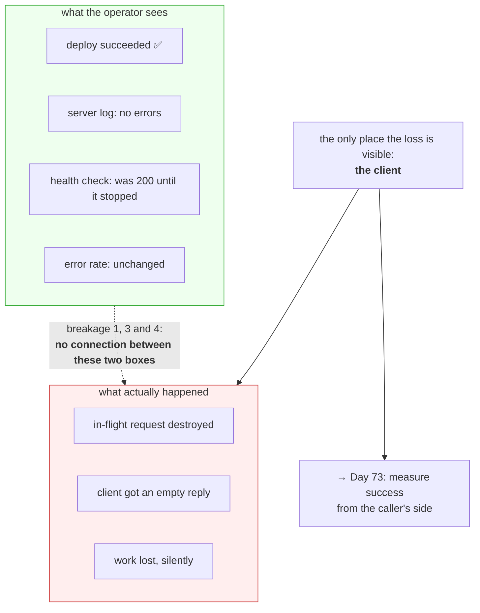

# 4.2 — The shutdown that dropped requests

## One-line answer

Today's deliberate failure: break graceful shutdown four different ways, watch a client lose a request
each time, and discover that **three of the four leave every log, every exit code and every health check
looking completely normal**.

---

## The story

🎬 **The scene.** A hotel with a night porter and a book by the front desk. Every guest who comes in
after midnight signs the book. Every morning, the manager reads it.

One night the porter is replaced at short notice. The new man does not know about the book. Four guests
arrive, are let in perfectly politely, shown to their rooms, and go to sleep.

😬 **The naive fix.** The manager reads the book in the morning, sees no entries, and concludes it was a
quiet night.

💥 **Why it fails.** It was not a quiet night. Nothing in the book is wrong — it is simply empty, and an
empty book and a quiet night look precisely identical. The manager's only instrument for knowing what
happened reports the same thing whether four people arrived or nobody did, and she has no way to tell
which, and no reason to suspect there is a question.

💡 **The insight.** **The dangerous failures are not the ones that produce a bad reading. They are the
ones that produce a normal reading.** A system where breakage is indistinguishable from health has not
just failed — it has removed your ability to notice, which is strictly worse than failing loudly.

---

## The idea in plain language

Part [4.1](4.1-graceful-shutdown-for-pulse.md) showed the four steps working. This part breaks each one
and watches what the client sees.

There are exactly four ways to lose an in-flight request during shutdown, and they map one-to-one onto
the four steps:

| # | What breaks | The step it breaks | What the client sees |
| --- | --- | --- | --- |
| 1 | the signal never reaches the process | none of them run | connection vanishes |
| 2 | the process is hard-killed outright | none of them run | connection vanishes |
| 3 | the grace period expires mid-drain | step 2 is cut short | connection vanishes |
| 4 | the socket is closed after draining, not before | step 1 happens too late | connection refused, or a hang |

**Look at the last column.** Three of the four produce an identical client-side symptom, and all four
produce it *without any error appearing in the server's own log*, because the server did not experience
an error. It experienced being stopped.

### What "the service died" actually meant, all along

The day's title asks what those four words mean. This part is the answer, and it is uncomfortable: for
three of these four failures, **the service did not die at all**. It was stopped, correctly, by
something that was entitled to stop it, in a way that lost work. From inside the process there is nothing
to log. From outside there is a deploy that succeeded.

The only place the loss is visible is at the **client**, which is why Day 73's service level objectives
measure request success from the caller's side rather than the server's. A server-side error rate cannot
see any of these, because none of them are server-side errors.

### Why you break it on purpose

Principle 11: every gate must be able to go red, and Principle 10: fail honestly and loudly. You cannot
know which of your signals would have caught a failure until you produce the failure and look at the
signals. Everything you are about to see stays green. **That is the finding, and it goes in
`docs/INCIDENTS.md` with the first symptom written down before the cause.**

---

## Why Kriya needs it

Day 19 is *"rollback is a feature — the undo you rehearse before you need it"*. A rollback that drops
in-flight requests is a partial outage you performed on yourself while believing you were fixing one.
Every breakage here is a rollback failure mode.

Day 30's container failure lab reproduces breakage 1 and 2 inside a container, where the causes are PID
1 being a shell and a memory limit respectively.

Day 41 configures the grace period, which is breakage 3 with a number attached.

Day 73 defines the first SLO and Day 76 the first alert. **The reason those days come after this one is
that you have to have watched a failure be invisible before an SLO feels necessary rather than
bureaucratic.**

---

## The mechanism

Use the drill server from [4.1](4.1-graceful-shutdown-for-pulse.md) —
`days/day-004-linux-for-operators-i/lab/slow_probe.py`, with its `/slow` route. Every breakage below is
the same setup with one thing changed, which is what makes the comparison meaningful.

The measurement harness, used identically for all four:

```bash
# days/day-004-linux-for-operators-i/lab/drop_drill.sh
#!/usr/bin/env bash
# Start the drill server, put one request in flight, break shutdown in the named way,
# and report what the CLIENT saw. Usage: ./drop_drill.sh {clean|nosignal|hardkill|shortgrace}
set -uo pipefail

MODE="${1:-clean}"
PORT=8010

uv run uvicorn slow_probe:app --host 127.0.0.1 --port "$PORT" >"server-$MODE.log" 2>&1 &
SERVER=$!
sleep 2

curl -sS -m 30 -o /dev/null \
  -w "client: http=%{http_code} exit=%{exitcode} after %{time_total}s\n" \
  "http://127.0.0.1:$PORT/slow?seconds=8" &
CLIENT=$!
sleep 1

case "$MODE" in
  clean)      kill -TERM "$SERVER" ;;
  nosignal)   kill -TERM "$SERVER" ;;   # the wrapper swallows it — see below
  hardkill)   kill -KILL "$SERVER" ;;
  shortgrace) kill -TERM "$SERVER"; sleep 3; kill -KILL "$SERVER" 2>/dev/null ;;
esac

wait "$CLIENT"
wait "$SERVER" 2>/dev/null
echo "server exit: $?"
echo "shutdown log lines: $(grep -c 'Shutting down\|Application shutdown complete' "server-$MODE.log")"
```

**Line by line:**

- `set -uo pipefail` — note the **absent `-e`**. This script deliberately runs commands that fail
  (`kill` on an already-dead process, `wait` on a signalled child), and aborting on the first one would
  defeat the purpose ([3.1](../03-exit-codes/3.1-the-exit-code-is-the-whole-return-value.md)). Leaving
  `-e` out here is a considered choice, not an omission — which is why the comment says so.
- `MODE="${1:-clean}"` — the first argument with a default. `${1:-clean}` means "use `$1`, or `clean` if
  unset", and it is what stops `-u` from aborting when the script is run with no arguments.
- `>"server-$MODE.log" 2>&1` — send both stdout and stderr to a per-mode file. **`2>&1` after the
  redirect, not before**: order matters, because `2>&1` means "make stderr go wherever stdout currently
  goes", so it has to come second.
- `seconds=8` — long enough that a three-second grace period cuts it off cleanly and short enough not to
  be tedious.
- `%{exitcode}` in the `-w` format — curl's own exit code, which is how you distinguish "connected and
  got nothing" from "could not connect at all"
  ([3.1](../03-exit-codes/3.1-the-exit-code-is-the-whole-return-value.md)).
- `wait "$CLIENT"` before `wait "$SERVER"` — collect the client first, so its line prints before the
  server's exit code and the output reads in causal order.
- `grep -c` on the log — **counting shutdown lines is the measurement**, exactly as in
  [2.2](../02-signals/2.2-sigterm-and-sigkill-the-request-and-the-order.md). Zero means no graceful
  shutdown occurred; two means it ran.

### Breakage 0 — the control

```bash
cd days/day-004-linux-for-operators-i/lab && chmod +x drop_drill.sh && ./drop_drill.sh clean
```

**Line by line:** `chmod +x` sets the execute bit so the file can be run directly — the permission bit
that produces exit code `126` when it is missing
([3.1](../03-exit-codes/3.1-the-exit-code-is-the-whole-return-value.md)), and the subject of Day 5,
section 2.

```text
client: http=200 exit=0 after 8.041s
server exit: 0
shutdown log lines: 2
```

**Everything correct.** The request completed, the server exited zero, both shutdown lines are present.
Keep these three numbers — every breakage below is read against them.

### Breakage 1 — the signal that never arrives

Wrap the server in a shell script that ignores `SIGTERM`, and let the disposition inherit across `exec`
([2.1](../02-signals/2.1-what-a-signal-actually-is.md): *"the dispositions of ignored signals are left
unchanged"*).

```bash
# days/day-004-linux-for-operators-i/lab/deaf_wrapper.sh
#!/usr/bin/env bash
# BREAKAGE 1. A wrapper that ignores SIGTERM and then starts the server.
# The ignore is inherited across exec, so the server is deaf through no fault of its own.
trap '' TERM
exec uv run uvicorn slow_probe:app --host 127.0.0.1 --port 8010
```

**Line by line:**

- `trap '' TERM` — set the disposition of `SIGTERM` to **ignore**. The empty string is the crucial
  detail: `trap 'something' TERM` installs a handler, and `trap '' TERM` installs *nothing*, which the
  shell implements as `SIG_IGN` ([2.1](../02-signals/2.1-what-a-signal-actually-is.md)).
- `exec` — replace this shell process with the server, rather than starting the server as a child.
  **This is the correct thing to do in a wrapper** ([1.2](../01-the-process/1.2-pid-parent-and-the-process-tree.md))
  and it is exactly what carries the ignore across, because ignored dispositions survive `exec` while
  handlers do not. The wrapper is doing one thing right and one thing wrong, which is why this bug is
  hard to spot.

Run the drill against it:

```bash
sed -i 's|uv run uvicorn slow_probe:app --host 127.0.0.1 --port "$PORT"|./deaf_wrapper.sh|' drop_drill.sh && chmod +x deaf_wrapper.sh && ./drop_drill.sh nosignal
```

**Line by line:** swap the start command for the wrapper. Doing it with `sed` rather than by hand keeps
the change reversible and visible in `git diff`; note it down, because you will undo it.

```text
client: http=200 exit=0 after 8.038s
server exit: 143
shutdown log lines: 0
```

**Read this one carefully — it is the most instructive of the four.** The client got its `200`, so no
request was lost. And **zero shutdown lines**: no graceful shutdown ran at all. The server exited `143`,
which is `128 + 15` ([3.2](../03-exit-codes/3.2-128-plus-n-when-a-signal-becomes-an-exit-code.md)).

How did the client succeed? Because the drill sends only one `SIGTERM` and nothing follows it — so the
server simply kept running to the end of the request and the shell reaped it later. **In production
something always follows**: a runtime that waits out its grace period and then sends `SIGKILL`. So the
production version of this breakage is *"every stop takes the full grace period and then hard-kills"*,
and the tell you have right now is the `143` and the zero.

**`143` is the signature of a process that never handled `SIGTERM`.** A healthy shutdown exits `0`
([4.1](4.1-graceful-shutdown-for-pulse.md)). If you ever see `143` in a termination state, this is what
happened.

### Breakage 2 — the hard kill

```bash
sed -i 's|./deaf_wrapper.sh|uv run uvicorn slow_probe:app --host 127.0.0.1 --port "$PORT"|' drop_drill.sh && ./drop_drill.sh hardkill
```

**Line by line:** restore the normal start command first — **always undo one breakage before you
introduce the next**, or you are testing a combination and will misattribute the result.

```text
client: http=000 exit=52 after 1.014s
server exit: 137
shutdown log lines: 0
```

**Three facts, all bad.** `http=000` means curl never received a status line at all. `exit=52` is curl's
*"empty reply from server"*. The duration is 1.014 seconds — the request died at the instant of the
kill, seven seconds short of completing. And `137` is `128 + 9`.

**This is the honest one.** It is destructive and it *looks* destructive: a non-zero exit code, no
shutdown lines, and a client error. Anything watching exit codes would notice.

### Breakage 3 — the grace period that is too short

```bash
./drop_drill.sh shortgrace
```

**Line by line:** `SIGTERM`, then three seconds, then `SIGKILL` — the exact algorithm every runtime uses
([2.2](../02-signals/2.2-sigterm-and-sigkill-the-request-and-the-order.md)), with a grace period
deliberately shorter than the eight-second request.

```text
client: http=000 exit=52 after 4.021s
server exit: 137
shutdown log lines: 1
```

**Compare with breakage 2 and find the single difference.** `shutdown log lines: 1`, not 0. The server
began its graceful shutdown — it logged `Shutting down` — and was killed part-way through, before it
could log `Application shutdown complete`. The client waited four seconds instead of one, and still lost
the request.

**Everything the process did was correct.** It received the polite signal, closed its socket, and began
draining. It was destroyed for being too slow at a job it was doing properly. **The bug is a number
configured somewhere else entirely**, which is exactly why Day 41's `terminationGracePeriodSeconds`
deserves its own argument.

### Breakage 4 — draining before closing the door

The one that cannot be produced with uvicorn, because uvicorn gets the ordering right — so reason about
it rather than running it, and know what it looks like.

A server that drains first and closes its listening socket afterwards accepts new connections throughout
the drain. Under continuous traffic the in-flight set never empties, so:

```text
INFO:     Waiting for application shutdown.
INFO:     Waiting for application shutdown.
...
```

— forever, until the grace period expires and everything open is hard-killed at once. **The failure is
not that some requests are lost; it is that the drain cannot terminate**, so the shutdown always ends in
a hard kill and the number of requests lost is proportional to your traffic rather than to your slowest
request.

You will meet this shape for real on Day 41 in a different guise: a Pod that is terminating but has not
yet been removed from the Service endpoints, so traffic keeps arriving at a process that is trying to
leave. Same problem, one layer up.



**Clean up, and prove you did:**

```bash
cd days/day-004-linux-for-operators-i/lab && rm -f server-*.log && git status --short
```

**Line by line:** remove the per-mode logs, then `git status --short` as the proof. A drill that leaves
files behind is the seventh `TODO(me)` from Day 3 repeating itself.

---

## When it breaks

The breakages above *are* the failures, so this section is about the failures of the **drill** — the
ways this experiment misleads you.

**The drill that reports a clean run because the request already finished.** The commonest mistake:

```text
client: http=200 exit=0 after 8.033s
server exit: 0
shutdown log lines: 2
```

— from a `hardkill` run.

**What it says:** the hard kill produced a perfect result.
**What it actually means:** your `sleep 1` before the kill was longer than the request, or the request
never started, so there was nothing in flight and nothing to lose. **The drill measured an empty
system.** This is the same class of error as the gate that is green because it checked nothing
([3.3](../03-exit-codes/3.3-the-exit-code-your-gate-already-reads.md)).
**The smallest fix:** check that `time_total` is *less* than `seconds=8`. If the client's duration equals
the full request duration, the kill did not land during the request.

**`kill: (33420) - No such process` in the `shortgrace` run.** Expected, and worth understanding rather
than suppressing:

```text
./drop_drill.sh: line 22: kill: (33420) - No such process
```

**What it says:** the second `kill` had nothing to kill.
**What it actually means:** the process finished draining *within* the grace period, so the `SIGKILL`
arrived after it had already exited. **That is the drill telling you the grace period was long enough** —
which is a successful outcome, reported as an error message.
**The smallest fix:** it is already there — `2>/dev/null` on that `kill`. But note what the suppression
costs: you can no longer tell "the grace period was sufficient" from "the kill was sent". The `shutdown
log lines` count is what disambiguates it, which is why the harness prints it.

**The wrapper breakage that does nothing at all.** If you write the wrapper without `exec`:

```text
client: http=200 exit=0 after 8.041s
server exit: 143
shutdown log lines: 2
```

**What it says:** two shutdown lines — the graceful shutdown ran.
**What it actually means:** without `exec`, the wrapper is a *parent* and uvicorn is a *child*. The
`SIGTERM` went to the wrapper, which ignored it; uvicorn never received it; and then the wrapper exited
and uvicorn was orphaned ([1.2](../01-the-process/1.2-pid-parent-and-the-process-tree.md)). The two
shutdown lines came later, from something else ending it. **A different bug entirely, with a
similar-looking output**, and it is the exact shape of the container-that-will-not-stop on Day 30.
**The smallest fix for the drill:** use `exec`, as written. **The lesson:** `exec` or not-`exec` in a
wrapper changes which process receives the signal, and both wrong answers are common.

---

## In production

**What a professional writes instead of the teaching version.** They run this drill as a test, not as a
one-off exercise. A deploy-time check that starts the service, issues a long request, sends `SIGTERM`,
and asserts that the request completed with a `200` is a handful of lines and catches every one of these
regressions permanently. **The reason it is worth automating is that graceful shutdown is exactly the
kind of thing that silently stops working**: someone adds a blocking call to a lifespan handler, or
wraps the entrypoint in a shell, and nothing in any normal test notices.

**What degrades at scale.** The loss becomes continuous rather than occasional. One instance, one
deploy, one dropped request is invisible. A hundred instances deployed several times a day, each
dropping whatever was in flight, is a persistent background error rate that correlates with deploys and
is routinely misattributed to "the deploy caused a blip" — which is true, and it is not a network blip,
it is this. **The characteristic signature is errors that appear at deploy boundaries and nowhere
else.**

**The failure that only shows with real traffic.** Breakage 4, which cannot be reproduced here. A server
that keeps accepting during the drain looks perfect under a single-request test and cannot ever finish
draining under continuous traffic. This is the strongest argument for load-testing the shutdown path
rather than only the request path, and Day 50's capacity work is where it comes back.

**The review comment a senior engineer leaves.** *"This is the third time we have shipped a broken
`SIGTERM` path. Add a test that starts the service, opens a slow request, sends `SIGTERM`, and asserts
the response arrives with a 200 and the process exits 0. It is ten lines and it would have caught all
three."*

**The signal you would alert on.** The signal this part reveals as *missing* is the important one:
nothing currently distinguishes a clean stop from a lossy one. The thing to emit is **the exit code and
the shutdown duration of every instance that stops**, and to alert on **the rate of non-zero exits at
deploy time** — specifically `143` (never handled the signal) and `137` (hard-killed). Both should be
zero and every occurrence means dropped work. You would **not** alert on a stop event itself, which
happens on every deploy. **And you would explicitly not rely on the server's error rate**, because
three of the four breakages produce no server-side error at all — which is the entire finding of this
part and the reason Day 73 measures from the client.

**Blast radius.** This part deliberately breaks shutdown, which is a real capability with real
consequences. Worst case on this machine: a drill server on port 8010 left running deaf to `SIGTERM`,
holding a port and about 60 MB, removable only with `SIGKILL`. **The worst case if this pattern reaches
`pulse` is much larger** — a service that cannot be stopped politely drops every in-flight request on
every deploy, forever, silently. Who can trigger it: anyone who wraps the entrypoint in a shell script,
which is an extremely common thing to do for apparently good reasons. What bounds it today: the drill
lives entirely in `lab/`, on a separate port, and nothing here touches `pulse/`. **What bounds it later
is the automated test named above** — the only durable bound, because the failure is invisible to
everything else.

**Cost.** `0` model calls, `0` tokens, `0` CI minutes. Each drill run holds one uvicorn at about
**60 MB of RAM** for roughly ten seconds; four runs, sequentially, so never more than one at a time.
Disk: four small log files, deleted at the end. **The cost this part is really about is the requests
lost**, and the unit is error budget (Day 73) — a hard kill during a deploy spends it exactly as if the
service had crashed, because from the client's side it did.

**The interview question.** *"You deploy and see a small spike of 5xx or connection errors every time,
but the application logs show nothing wrong. Where do you look?"* The answer that lands goes straight to
shutdown: *"At the terminating instances, not the new ones. A spike that lines up exactly with deploys
and leaves no server-side error is almost always in-flight requests being dropped during shutdown —
because there is no error to log, the process was just stopped. I would check the exit codes of the
terminated instances: `0` means it shut down cleanly, `143` means it never handled `SIGTERM` at all, and
`137` means it was hard-killed, usually because the grace period was shorter than the drain. Then I
would check whether PID 1 in the container is the app or a shell, because a shell wrapper is the usual
reason the signal never arrives."* Then the honest part: *"and the reason it took us a while to find is
that server-side error rate cannot see this at all — you need the client's view."*

---

## Check yourself

```bash
cd days/day-004-linux-for-operators-i/lab && for M in clean hardkill shortgrace; do ./drop_drill.sh "$M" 2>/dev/null | sed "s/^/[$M] /"; done
```

Three modes, one table, prefixed so the rows are attributable. **Read down the `shutdown log lines`
column: `2`, `0`, `1`.** Those three numbers are a complete graceful shutdown, no graceful shutdown at
all, and a graceful shutdown that was interrupted — and they are the fastest diagnostic you have for
telling the three apart in a real incident.

**Say out loud, without scrolling up:** *three of the four breakages leave the server's own logs and
error rate completely normal. Say why — what would the server have had to experience in order to log an
error? — and name the one place the loss is actually observable.*
