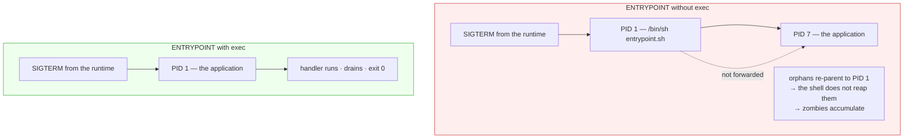

# 4.3 — Zombies, orphans, and why PID 1 is a job

## One-line answer

PID 1 has two duties nobody else has, which are adopting orphaned processes and collecting their exit
statuses, and forwarding signals to what it started. Putting the wrong program in that slot is the
single most common structural bug in containerised services.

---

## The story

🎬 **The scene.** In one street, every parcel that cannot be delivered goes to the woman at number 12.
It is not a glamorous job. She takes them in, keeps them on a shelf in the hall, and makes sure each one
reaches whoever it belongs to. She also passes on notes from the landlord to whoever is out at work.

She is the only one who does this. There is no second number 12.

😬 **The naive fix.** She moves out and a new tenant gets the house. He is perfectly capable and very
busy. Nobody tells him the house came with a job.

💥 **Why it fails.** Undelivered parcels begin to pile up in his hallway. They are not lost, exactly.
They are there, in a heap, taking up more room every week, and nobody can find anything. Meanwhile the
landlord drops off a note saying that the water is being turned off on Tuesday, and the new tenant, who
has no idea that he is supposed to pass it on, puts it on the table and goes back to work. Nobody on the
street is told.

💡 **The insight.** Some positions carry responsibilities that come with the position rather than with
the person. **If you put somebody in the position who does not know the responsibilities exist, nothing
announces the problem.** The parcels pile up quietly and the note simply does not arrive, and both
failures look like nothing happening at all.

---

## The idea in plain language

Part [1.2](../01-the-process/1.2-pid-parent-and-the-process-tree.md) established that every process has
a parent and that the tree has a root, which is PID 1, the first process the kernel starts. This part is
about what PID 1 is *for*, because it is a job rather than just a number.

### Duty one: adopt orphans and reap them

When a process ends, it does not immediately vanish. Verified against
`man7.org/linux/man-pages/man2/wait.2.html` on **2026-08-24**: *"A child that terminates, but has not
been waited for becomes a 'zombie'. The kernel maintains a minimal set of information about the zombie
process (PID, termination status, resource usage information) in order to allow the parent to later
perform a wait to obtain information about the child."*

So a finished process leaves a small record, and that record persists until the parent collects it by
calling `wait`. Collecting is called **reaping**. Until then the entry occupies a slot in the kernel's
process table and shows up in `ps` as state `Z`, from
[1.4](../01-the-process/1.4-process-states-and-the-d-that-will-not-die.md).

A zombie costs no memory and no processor, because it is a record rather than an activity. **The cost is
the table slot**, and the process table is finite. Enough unreaped zombies and the machine cannot create
new processes at all, which shows up as every command you type failing to start.

When a parent dies before its children, the orphans are re-parented, normally to PID 1. **So PID 1
inherits every orphan on the machine, and has to reap them.** A PID 1 that does not reap accumulates
zombies indefinitely, and there is no other process that will do it.

### Duty two: forward signals

PID 1 is also where signals arrive from outside. When a container runtime stops a container it sends
`SIGTERM` to PID 1 *inside* that container, and to nothing else, from
[2.2](../02-signals/2.2-sigterm-and-sigkill-the-request-and-the-order.md). If PID 1 is your application,
it receives the signal directly and shuts down. If PID 1 is a shell script that started your application
as a child, **the shell gets the signal and your application gets nothing**, which is breakage 1 from
[4.2](4.2-the-shutdown-that-dropped-requests.md), and it is the reason that part's wrapper is written
the way it is.

### The special protection, and why it makes things worse

PID 1 gets an extra rule from the kernel: signals with default actions are **not** applied to it unless
it has explicitly installed a handler. The reason is to stop a stray `kill -TERM 1` from taking the whole
machine down.

The consequence inside a container is unfortunate. A program that would normally die on `SIGTERM`, via
the kernel's default action, with no handler at all, **does not die when it is PID 1**. It just ignores
it. So a service that stops perfectly well when you run it in a terminal becomes unstoppable when it is
PID 1 in a container, and the only difference is the number.

### The word `exec`, and why it is the fix for both duties

`exec` replaces the current process with a new program **in the same process**, keeping the same PID.

```
without exec:  PID 1 = /bin/sh entrypoint.sh   →   PID 7 = python -m uvicorn ...
with exec:     PID 1 = python -m uvicorn ...
```

With `exec`, the application *is* PID 1. It receives signals directly. It has no children it forgot to
reap, because it has no shell above it. **One word fixes both duties**, and its absence causes both
failures.

---

## Why Kriya needs it

Day 23 writes the Dockerfile for `pulse`, which means choosing an `ENTRYPOINT`. That choice decides what
PID 1 is, and everything in this part applies from that day onward.

Day 26 sets a restart policy and a healthcheck, and Day 30's failure lab includes the container that
will not stop. Both of those are this part.

Day 33 introduces the Pod, and Day 41 gives it a grace period. The signal in that grace period goes to
PID 1 of each container.

Day 179 onward runs agents that shell out to tools. Every subprocess an agent spawns has to be reaped by
somebody, and an agent process that spawns and forgets is a zombie factory with a long uptime.

---

## The mechanism

Produce a zombie, watch it, and reap it.

```python
# days/day-004-linux-for-operators-i/lab/zombie.py
import os
import subprocess
import sys
import time

children = [subprocess.Popen([sys.executable, "-c", "pass"]) for _ in range(3)]
time.sleep(0.5)

print(f"[main] my pid={os.getpid()}; spawned {[c.pid for c in children]}", flush=True)
print("[main] NOT calling wait(). Look at ps in another terminal.", flush=True)
time.sleep(30)

for c in children:
    c.wait()
print("[main] reaped. Look at ps again.", flush=True)
time.sleep(15)
```

**Line by line:**

- `subprocess.Popen([sys.executable, "-c", "pass"])` starts a child that does nothing and exits
  immediately. It uses `sys.executable` rather than `"python"`, so that it is this interpreter and not
  whatever `PATH` finds, which is Day 0's interpreter lesson.
- There are three of them, so that the count in `ps` is unambiguous. One zombie could be a coincidence,
  and three is a pattern.
- `time.sleep(0.5)` lets them all exit. **They are dead within milliseconds, and the zombie is what is
  left.**
- There is **no `wait()` in the first half**, and that absence is the entire experiment. `Popen` starts
  the child and the parent is then obliged to collect it, and omitting the collection is what most people
  do by accident.
- `time.sleep(30)` gives you a window to look at `ps` from another terminal.
- `c.wait()` in the loop is the reaping. `Popen.wait()` calls the underlying `waitpid`, from
  [3.2](../03-exit-codes/3.2-128-plus-n-when-a-signal-becomes-an-exit-code.md), which collects the
  status word and frees the table slot.

Run it, and in a second terminal look.

```bash
uv run python days/day-004-linux-for-operators-i/lab/zombie.py &
sleep 2
ps -eo pid,ppid,stat,args | grep -E 'Z|defunct' | grep -v grep
```

**Line by line:**

- `grep -E 'Z|defunct'` matches either the state letter or the `<defunct>` marker, because different
  `ps` implementations show one, the other, or both.
- `grep -v grep` removes the grep's own line, which is the trap from
  [1.3](../01-the-process/1.3-reading-ps-and-finding-your-service.md).

Observed on **2026-08-24**:

```text
[main] my pid=34110; spawned [34112, 34113, 34114]
[main] NOT calling wait(). Look at ps in another terminal.
  34112   34110 Z    [python] <defunct>
  34113   34110 Z    [python] <defunct>
  34114   34110 Z    [python] <defunct>
```

**Three zombies, all with the same PPID.** The square brackets and `<defunct>` mean the command line is
gone, because there is nothing left of these processes but their exit records. Confirm that they cost
nothing.

```bash
ps -o pid,stat,rss,%cpu -p 34112
```

**Line by line:** ask for the two resource columns specifically. This is the check that turns "zombies
sound alarming" into a measured fact.

```text
    PID STAT   RSS %CPU
  34112 Z        0  0.0
```

**Zero memory, zero processor.** A zombie is genuinely not consuming anything except a table entry. Wait
for the program's second half and look again, and they are gone, because `c.wait()` collected them.

**Now the important half: kill the parent and watch adoption.**

```bash
uv run python days/day-004-linux-for-operators-i/lab/zombie.py &
Z=$!
sleep 2
kill -KILL "$Z"
sleep 1
ps -eo pid,ppid,stat,args | grep -E 'Z|defunct' | grep -v grep || echo "no zombies remain"
```

**Line by line:**

- `kill -KILL` goes to the parent, while its three zombies are outstanding. It is the uncatchable one, so
  the parent has no chance to reap on the way out, from
  [2.4](../02-signals/2.4-the-signals-you-cannot-catch.md).
- `|| echo "no zombies remain"` works because `grep` exits non-zero when it matches nothing, from
  [3.1](../03-exit-codes/3.1-the-exit-code-is-the-whole-return-value.md), so this turns an empty result
  into a readable statement rather than silence.

```text
no zombies remain
```

**The zombies vanished the instant their parent did.** They were re-parented to PID 1, which reaped them
immediately, because that is its job and it does it properly. **This is the system working**, and it is
why a zombie problem on a normal machine is nearly always temporary.

### Where it stops working: a PID 1 that is not an init

Show the signal-forwarding half without needing a container, using the same `exec` distinction.

```bash
# days/day-004-linux-for-operators-i/lab/no_exec.sh
#!/usr/bin/env bash
# The wrong shape: the shell stays alive as a parent and the server is a child.
uv run uvicorn slow_probe:app --host 127.0.0.1 --port 8010
```

**Line by line:** three lines, and the third is a plain command. The shell forks a child to run it and
then sits in `wait` until the child finishes, which means **two processes exist for the whole life of the
service**, and the shell is the one holding the PID that anything outside will signal.

```bash
# days/day-004-linux-for-operators-i/lab/with_exec.sh
#!/usr/bin/env bash
# The right shape: the shell is REPLACED by the server. Same PID, no wrapper left.
exec uv run uvicorn slow_probe:app --host 127.0.0.1 --port 8010
```

**Line by line:** the two files differ by exactly one word. `exec` replaces the shell process with the
command, and without it the shell forks a child and waits. **Everything below follows from that one
word.**

```bash
cd days/day-004-linux-for-operators-i/lab && chmod +x no_exec.sh with_exec.sh
./no_exec.sh & W=$!; sleep 3
ps -o pid,ppid,args --forest -p "$W" -p "$(pgrep -f 'uvicorn slow_probe' | head -1)"
```

**Line by line:** start the no-`exec` version, wait for startup, and then print both the wrapper and the
server together. `--forest` draws the relationship rather than making you match PIDs by eye, from
[1.2](../01-the-process/1.2-pid-parent-and-the-process-tree.md).

```text
    PID    PPID COMMAND
  34220   26902 /usr/bin/bash ./no_exec.sh
  34223   34220  \_ python .venv/Scripts/uvicorn slow_probe:app --host 127.0.0.1 --port 8010
```

**Two processes.** The wrapper at 34220, and the server as its child at 34223. Now signal the wrapper,
which is what a container runtime would do, because the wrapper is PID 1 inside the container.

```bash
kill -TERM "$W"
sleep 1
pgrep -af 'uvicorn slow_probe' || echo "server is gone"
```

**Line by line:** signal the wrapper only, and then check whether the server survived, using `pgrep -af`
with the `|| echo` idiom, as above.

```text
34223 python .venv/Scripts/uvicorn slow_probe:app --host 127.0.0.1 --port 8010
```

**The server is still there, and it is now an orphan.** The signal went to the shell, the shell died, and
the server was re-parented and continues serving, unaware that anything happened. In a container this is
the runtime waiting out the entire grace period and then hard-killing everything, which is
[4.2](4.2-the-shutdown-that-dropped-requests.md), breakage 1, with its real-world cause.

Now the corrected version.

```bash
pkill -f 'uvicorn slow_probe'
./with_exec.sh & W=$!; sleep 3
ps -o pid,ppid,args -p "$W"
```

**Line by line:** clear up the orphan first, having run `pgrep -af` above to see exactly what the pattern
matches, which is the discipline from
[2.2](../02-signals/2.2-sigterm-and-sigkill-the-request-and-the-order.md), and then start the `exec`
version and look at the single PID.

```text
    PID    PPID COMMAND
  34301   26902 python .venv/Scripts/uvicorn slow_probe:app --host 127.0.0.1 --port 8010
```

**One process, and it is the server.** The shell is gone, replaced rather than exited. `$W`, the PID the
shell reported for the script, *is* uvicorn's PID. Signal it.

```bash
kill -TERM "$W"; sleep 1; pgrep -af 'uvicorn slow_probe' || echo "server stopped cleanly"
```

**Line by line:** this is an identical command to the failing case, so the difference in outcome is
attributable entirely to `exec`.

```text
server stopped cleanly
```



---

## When it breaks

**`fork: retry: Resource temporarily unavailable`.** This is the end state of unreaped zombies.

```text
$ ls
bash: fork: retry: Resource temporarily unavailable
bash: fork: retry: Resource temporarily unavailable
bash: fork: Resource temporarily unavailable
```

**What it says:** the shell cannot create a process to run `ls`.

**What it actually means:** the process table or the per-user process limit is exhausted. Zombies are one
cause, and a runaway fork loop is the other. **The machine is now nearly impossible to debug**, because
every diagnostic command you want to run is itself a new process.

**The smallest fix:** you need a shell you already have. Use shell builtins, which fork nothing, so
`echo /proc/[0-9]*` expands with the shell's own globbing and gives you a process count without starting
anything. Then kill the parent of the zombies, and PID 1 will reap them all at once.

**The lesson:** the failure that removes your ability to run diagnostics is a category worth respecting,
and it is the same shape as a full disk, which is Day 5, section 3.

**`docker stop` takes the full grace period, every time.** This is the signal-forwarding failure in its
natural habitat.

```text
$ time docker stop pulse
pulse

real    0m10.318s
$ docker inspect pulse --format '{{.State.ExitCode}} {{.State.OOMKilled}}'
137 false
```

**What it says:** the stop took the full default grace period, and the exit code was 137 with no memory
involvement.

**What it actually means:** `SIGTERM` went to PID 1, PID 1 did not act on it, the grace period expired,
and `SIGKILL` ended everything. Either PID 1 is a shell that did not forward it, or PID 1 is your app
with no handler and it is protected by the PID 1 signal rule.

**The smallest fix:** find out which.

```bash
docker exec pulse ps -o pid,ppid,args
```

**Line by line:** this runs `ps` *inside* the container's process namespace, which is what `docker exec`
gives you. If PID 1 is `/bin/sh` or `/bin/bash`, that is your answer and `exec` is the fix. If PID 1 is
your application, the fix is a signal handler.

```text
    PID    PPID COMMAND
      1       0 /bin/sh -c uvicorn pulse.api:app --host 0.0.0.0
      7       1 python -m uvicorn pulse.api:app --host 0.0.0.0
```

**`/bin/sh -c` at PID 1 is the diagnosis.** It comes from writing `CMD uvicorn ...` in shell form rather
than in exec form in a Dockerfile, which is a distinction Day 23 makes carefully, and this is the reason
it matters.

**Zombies inside a container that never go away.** This is the version with no natural cure.

```text
$ docker exec pulse ps -eo pid,ppid,stat,args
    PID    PPID STAT COMMAND
      1       0 S    python -m uvicorn pulse.api:app
     42       1 Z    [ffmpeg] <defunct>
     51       1 Z    [ffmpeg] <defunct>
     63       1 Z    [ffmpeg] <defunct>
```

**What it says:** three zombies, parented to PID 1.

**What it actually means:** PID 1 is your application, orphans are re-parented to it as normal, and **it
does not reap**, because nobody writes reaping code in a web application. On a normal machine PID 1 is an
init system that does this automatically, and in a container PID 1 is whatever you put there. The count
only goes up.

**The smallest fix:** run a real init as PID 1. `docker run --init` inserts a minimal init process that
does nothing but reap and forward signals, which is exactly the two duties. In Kubernetes the equivalent
is a `shareProcessNamespace` arrangement, or simply ensuring that the application reaps its own children.
**The best fix is not to orphan them**, meaning wait for every subprocess you spawn.

---

## In production

**What a professional writes instead of the teaching version.** They write `ENTRYPOINT` in exec form, as
`ENTRYPOINT ["uvicorn", "pulse.api:app"]`, which is a JSON array rather than a shell string, so no shell
is involved at all and the application is PID 1 directly. When a shell genuinely is needed, in order to
expand a variable or run a migration first, the last line of the script is `exec` followed by the real
program, so that the shell disappears rather than lingering as a parent. And if the application spawns
subprocesses, they add `--init` or an equivalent, because a web framework is not an init system and
pretending otherwise accumulates zombies at whatever rate the application spawns.

**What degrades at scale.** Zombie accumulation becomes a function of uptime and spawn rate rather than a
curiosity. A service that shells out once per request and forgets to reap will exhaust a process table in
hours at real traffic and in months at development traffic, **so this bug ships, passes every test,
survives staging, and appears in production a week later** as a machine that suddenly cannot start
processes. The signal-forwarding bug degrades differently, because it costs the full grace period on
every instance of every deploy, which is pure wall-clock time and a batch of dropped requests each time.

**The failure that only shows with real traffic.** Both of them, for the same reason: neither depends on
the correctness of the request path, so no functional test can see them. A container with a shell PID 1
serves requests perfectly. A service that never reaps serves requests perfectly. **The failures are in
the lifecycle, and the lifecycle is exercised by deploys and by uptime, neither of which is a test
case.**

**The review comment a senior engineer leaves.** *"`CMD uvicorn pulse.api:app` in shell form means PID 1
is `/bin/sh -c`, so `SIGTERM` never reaches uvicorn and every rollout waits out the full grace period and
then hard-kills. Use the exec form, which is the JSON array, or, if you need the shell for the migration,
make the last line `exec uvicorn ...`."*

**The signal you would alert on.** **Zombie count per container**, which should be flat at zero and only
ever rises when something is broken, and it is one of the rare metrics where any sustained non-zero value
is actionable. And **time-to-terminate**, meaning the elapsed time between a stop being requested and the
process exiting, because a value that equals the grace period exactly, repeatedly, is the unmistakable
signature of a signal that is not being received. That second one is better than alerting on exit code
137, because it fires on the *pattern* rather than on each event. You would **not** alert on a single
zombie, which is a normal transient during process turnover.

**Blast radius.** This part introduces the ability to put an arbitrary program in the PID 1 slot, which,
from Day 23, you will do on every build. The worst case is a PID 1 that neither forwards signals nor
reaps, which produces a service that cannot be stopped politely *and* leaks process table entries, and
both failures are silent until either a deploy takes forever or the machine stops being able to fork.
Anybody who edits the Dockerfile's entrypoint can trigger it, with no runtime warning of any kind. What
bounds it is one command: `docker exec <container> ps -o pid,args`, and confirm that PID 1 is what you
expect. **Make that a checklist item on Day 23**, because there is no other signal that will tell you.

**Cost.** `0` model calls, `0` tokens, `0` CI minutes and `0` disk. A zombie costs zero memory and zero
processor, as measured above, plus one process table slot. `docker run --init` costs a few hundred
kilobytes of RAM for the init process. **The cost of getting it wrong is the grace period, on every
instance of every deploy, plus the requests dropped in it.**

**The interview question.** *"Why does everybody say `exec` in a Docker entrypoint?"* The answer that
lands names both duties: *"Because whatever is PID 1 in the container gets the `SIGTERM` when the runtime
stops it, and PID 1 also inherits and has to reap every orphaned process. A shell wrapper does neither.
It takes the signal and does not pass it on, so the app never shuts down cleanly and every stop waits out
the grace period and then hard-kills, and it does not reap, so any subprocess that outlives its parent
becomes a permanent zombie. `exec` replaces the shell with the app in the same process, so the app *is*
PID 1 and both problems disappear."* Then comes the detail that shows you have debugged it: *"the way I
check is `docker exec <container> ps -o pid,args`, and if PID 1 is `/bin/sh -c`, that is the bug, and it
usually comes from writing `CMD` in shell form rather than as the JSON array."*

---

## Check yourself

```bash
cd days/day-004-linux-for-operators-i/lab && for S in no_exec with_exec; do ./"$S".sh & W=$!; sleep 3; echo "[$S] pid $W is: $(ps -o args= -p "$W" | cut -c1-40)"; kill -TERM "$W"; sleep 1; pgrep -f 'uvicorn slow_probe' >/dev/null && echo "[$S] server SURVIVED the signal" || echo "[$S] server stopped"; pkill -f 'uvicorn slow_probe' 2>/dev/null; done
```

Both wrappers, back to back, printing what PID the script actually became and whether the server survived
a `SIGTERM` sent to it. **The `no_exec` line will say that the PID is a `bash` script and the server
survived, and the `with_exec` line will say that the PID is `python` and the server stopped.** One word
of difference, and it is the whole of Day 23's entrypoint decision.

**Say out loud, without scrolling up:** *name the two duties PID 1 has that no other process has, say
what breaks when each one is neglected, and give the single word that fixes both.*
