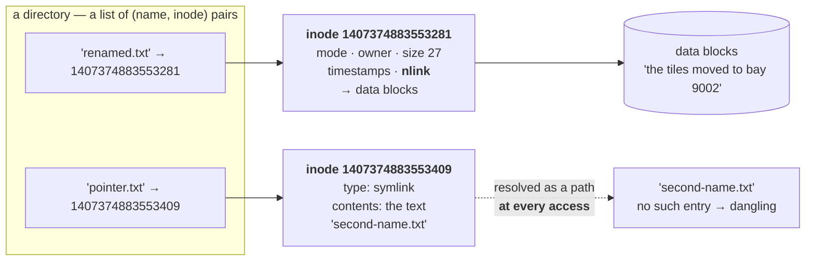

# 1.1 — A file is an inode; a name is a pointer

## One-line answer

The file is the numbered record holding the data and its metadata; the name in a directory is only a
pointer to that record — which is why deleting a name does not always delete a file, and why the disk
can stay full after you have removed the thing filling it.

---

## The story

🎬 **The scene.** A large warehouse with numbered bays. Bay 4471 holds a pallet of tiles.

At the front desk there is a book of names. One line says *"kitchen order — bay 4471"*. Another line,
written later by a different person, says *"Tuesday delivery — bay 4471"*. Two names, one pallet.

Somebody crosses out *"kitchen order"* because that job is finished.

😬 **The naive fix.** The warehouse manager, tidying up, assumes a crossed-out line means the bay is
free and marks bay 4471 as available.

💥 **Why it fails.** The pallet is still there. The tiles have not moved a centimetre, and the *"Tuesday
delivery"* line still points at them. The bay was never free. Now a forklift arrives to put something in
4471 and finds it occupied, and nobody can explain why, because the book says it is empty.

💡 **The insight.** The name and the thing are two separate objects, and the connection between them is
countable. **The thing goes away when the last name pointing at it goes away — not when any particular
name does.** A system that confuses "I removed the label" with "I removed the goods" will keep finding
occupied bays it believes are empty.

---

## The idea in plain language

On a Unix filesystem, what you think of as "a file" is actually two things.

**The inode** is the file. It is a numbered record on the disk holding the file's metadata and pointers
to the blocks containing the data. Verified against `man7.org/linux/man-pages/man7/inode.7.html` on
**2026-08-24**, it carries:

- `st_mode` — *"contains the file type and mode"*: whether this is a regular file, a directory, a
  symbolic link, a socket, and the permission bits (section [2](../02-permissions/2.1-user-group-other-and-three-bits.md));
- `st_nlink` — *"contains the number of hard links to the file"*;
- `st_size` — *"gives the size of the file ... in bytes"*;
- `st_blocks` — *"the number of blocks allocated to the file, 512-byte units"*;
- four timestamps: access, modification, status-change and creation;
- the owning user and group.

**The name is not in that list.** An inode does not know what it is called. It cannot, because it might
be called several things at once.

**The directory entry** is the name. A directory is a list of pairs: *(name, inode number)*. That is all
a directory is. `pulse/api.py` being "in" the `pulse` directory means the `pulse` directory's list
contains an entry pairing the text `api.py` with some inode number.

### What follows immediately

**A file can have several names.** Add a second entry pointing at the same inode number and you have a
**hard link**. There is no original and no copy — the two names are exactly equal, and `st_nlink` is 2.
Neither name is more real than the other.

**Deleting a name is not deleting a file.** The system call is called `unlink`, and the name is honest.
Verified against `man7.org/linux/man-pages/man2/unlink.2.html` on **2026-08-24**: *"unlink() deletes a
name from the filesystem. If that name was the last link to a file and no processes have the file open,
the file is deleted and the space it was using is made available for reuse."*

Read the conditions in that sentence. Two of them, both required:

1. it was the **last link** — `st_nlink` has reached zero, and
2. **no process has it open** — the kernel's count of open file descriptors for that inode is also
   zero.

Only then is the space reclaimed. The second condition is part
[3.2](../03-the-disk-that-fills/3.2-the-deleted-file-that-still-costs-you-a-gigabyte.md), and it is the
single most expensive misunderstanding on this day.

**Renaming is cheap and moving across disks is not.** `mv` within one filesystem changes a directory
entry — it writes a new name, removes an old one, and the inode is untouched. `mv` across filesystems
must copy every byte and then unlink, because the inode number is only meaningful within one filesystem
([1.2](1.2-paths-mounts-and-the-tree-that-is-not-one-disk.md)).

### The symbolic link, which is a different thing entirely

A **symbolic link** — or symlink — is a file whose contents are a *path*, as text. Following it means
resolving that text as a new path. It is not a second name for an inode; it is a small file that says
"look over there".

| | Hard link | Symbolic link |
| --- | --- | --- |
| What it is | another directory entry for the same inode | a file containing a path |
| Increments `st_nlink` | yes | no |
| Survives the target being renamed | yes — it never referred to the name | no — it becomes dangling |
| Can cross filesystems | no | yes |
| Can point at a directory | normally no | yes |
| Detectable with `ls -l` | no — it looks like an ordinary file | yes — shown as `->` |

**The last row is the practical one.** A hard link is invisible in ordinary listings; the only tell is
`st_nlink` being greater than one. A symbolic link announces itself.

---

## Why Kriya needs it

Day 22 is about container image layers, and a layer is a filesystem difference. Understanding that a
"deleted" file in an upper layer is a whiteout marker rather than reclaimed space — and that the bytes
are still in the layer below, still shipped, still downloaded — is this part applied to images. **This
is the reason a secret committed into an image is not removed by deleting it in a later layer**, which
is Day 29.

Day 15 pins the lockfile and computes hashes for reproducibility. Hashing is over inode contents; the
name is not part of the artifact.

Day 0 already depended on this and told you so: `pyproject.toml` sets `link-mode = "copy"` because uv
installs by *hardlinking* from its cache into `.venv`, and OneDrive placeholders break hardlinking with
`os error 396`. That comment in your own repository is this part's mechanism, and you accepted it on
trust four days ago.

Day 89 onward writes data artifacts, and the safe-write rule — write to a temporary file, flush, then
**rename** over the target — works precisely because rename is an atomic directory-entry operation.
A reader sees either the old inode or the new one, never a half-written file.

---

## The mechanism

Make an inode, give it two names, and watch the count.

```bash
mkdir -p days/day-005-linux-for-operators-ii/lab && cd days/day-005-linux-for-operators-ii/lab
printf 'the tiles are in bay 4471\n' > original.txt
ls -li original.txt
```

**Line by line:**

- `printf` rather than `echo`, so the trailing newline is explicit and the content is byte-for-byte
  predictable. `echo`'s handling of escapes varies between shells; `printf` does not.
- `ls -li` — the `-i` is the whole point of this command. It prints the **inode number** as the first
  column, which is normally hidden. `-l` gives the long format, and its second column is `st_nlink`.

Observed on **2026-08-24**:

```text
1407374883553281 -rw-r--r-- 1 nisha None 26 Aug 24 14:02 original.txt
```

**Read the first two numbers.** `1407374883553281` is the inode number — the identity of the file.
`1` is the link count: exactly one name currently points at this inode.

Now add a second name:

```bash
ln original.txt second-name.txt
ls -li original.txt second-name.txt
```

**Line by line:**

- `ln source target` with no flags creates a **hard link** — a second directory entry pointing at the
  same inode. `ln -s` would create a symbolic link instead, and the missing `-s` is the entire
  difference.
- Listing both together is what makes the shared identity visible; listing them separately would show
  two ordinary-looking files.

```text
1407374883553281 -rw-r--r-- 2 nisha None 26 Aug 24 14:02 original.txt
1407374883553281 -rw-r--r-- 2 nisha None 26 Aug 24 14:02 second-name.txt
```

**Identical inode numbers, and the link count is now `2` on both lines.** These are not two files. There
is one file with two names, and neither name is the original — the filesystem does not record which came
first.

Prove they are the same object by changing one and reading the other:

```bash
printf 'the tiles moved to bay 9002\n' > second-name.txt
cat original.txt
```

**Line by line:** `>` truncates and rewrites through the `second-name.txt` entry. Reading through
`original.txt` afterwards is the test — if these were copies, the first file would be unchanged.

```text
the tiles moved to bay 9002
```

**One write, visible through both names**, because there is only one inode and both names lead to it.

Now delete a name and watch what survives:

```bash
rm original.txt
ls -li second-name.txt
cat second-name.txt
```

**Line by line:** `rm` calls `unlink`, which removes a directory entry and decrements `st_nlink`. Then
list and read through the remaining name — the two checks together prove the data is intact and the
count has dropped.

```text
1407374883553281 -rw-r--r-- 1 nisha None 27 Aug 24 14:04 second-name.txt
the tiles moved to bay 9002
```

**Same inode number, link count back to `1`, contents untouched.** You deleted a file and lost nothing,
because the thing you deleted was a name.

### The symbolic link, for contrast

```bash
ln -s second-name.txt pointer.txt
ls -li second-name.txt pointer.txt
```

**Line by line:** `-s` makes this symbolic. Note the argument order is the same as the hard link —
target first, new name second — which is a common source of confusion because it reads backwards from
`cp`.

```text
1407374883553281 -rw-r--r-- 1 nisha None 27 Aug 24 14:04 second-name.txt
1407374883553409 lrwxrwxrwx 1 nisha None 15 Aug 24 14:06 pointer.txt -> second-name.txt
```

**Three differences from the hard link, all visible on that line.** A *different* inode number — this is
its own file. A leading `l` in the mode column instead of `-`, meaning "symbolic link". A size of 15,
which is the length of the text `second-name.txt`. And the `->` showing where it points.

Break it, to show what it actually holds:

```bash
mv second-name.txt renamed.txt
cat pointer.txt
ls -l pointer.txt
```

**Line by line:** rename the target — which, for a hard link, would have changed nothing at all. Then
read through the symlink and list it.

```text
cat: pointer.txt: No such file or directory
lrwxrwxrwx 1 nisha None 15 Aug 24 14:06 pointer.txt -> second-name.txt
```

**The symlink still exists and still says `second-name.txt`.** It never referred to the inode; it holds
a string, and the string no longer resolves. This is a **dangling symlink**, and it is the failure mode
that hard links cannot have.



### Counting what actually matters

```bash
stat renamed.txt
```

**Line by line:** `stat` prints the whole inode, which is what `ls` is summarising. Reading it once makes
`ls -l`'s columns stop being arbitrary — every one of them is a field in this record.

```text
  File: renamed.txt
  Size: 27              Blocks: 1          IO Block: 65536 regular file
Device: 8e2e5aeah/2384540330d  Inode: 1407374883553281  Links: 1
Access: (0644/-rw-r--r--)  Uid: (197609/   nisha)   Gid: (  197121/ None)
Access: 2026-08-24 14:04:11.000000000 +0530
Modify: 2026-08-24 14:04:11.000000000 +0530
Change: 2026-08-24 14:06:52.000000000 +0530
```

**Three things worth noticing.** `Links: 1` is `st_nlink`. `Size: 27` and `Blocks: 1` are different
numbers measuring different things — part
[3.1](../03-the-disk-that-fills/3.1-df-du-and-why-they-disagree.md) is built on that gap. And `Change`
is later than `Modify`, because the rename altered the inode's metadata without touching its contents:
**`Modify` is about the data, `Change` is about the inode.** People reach for `Modify` and occasionally
need `Change`.

---

## When it breaks

**`ln: failed to create hard link: Invalid cross-device link`.** The constraint that surprises people:

```text
$ ln /c/Users/nisha/data.csv /d/backup/data.csv
ln: failed to create hard link '/d/backup/data.csv' => '/c/Users/nisha/data.csv': Invalid cross-device link
```

**What it says:** the link could not be created across devices.
**What it actually means:** an inode number is only unique within one filesystem, so a directory entry on
one filesystem cannot point at an inode on another. There is nowhere to write the number that would
mean anything ([1.2](1.2-paths-mounts-and-the-tree-that-is-not-one-disk.md)).
**The smallest fix:** use `ln -s` for a symbolic link, which stores a path and therefore crosses
anything — or copy. **The lesson:** hard links are a within-filesystem optimisation, which is exactly why
uv uses them for its cache and why the cache and `.venv` must be on the same filesystem for it to work.

**`os error 396` from uv.** The one that is already in your repository:

```text
error: failed to hardlink file from C:\Users\nisha\AppData\Local\uv\cache\... to .venv\Lib\site-packages\...
  Caused by: The cloud operation cannot be performed on a file with incompatible hardlinks. (os error 396)
```

**What it says:** hardlinking failed because of cloud sync.
**What it actually means:** OneDrive Files On-Demand replaces file contents with placeholders, and a
placeholder cannot participate in a hard link — the second name would have to point at an inode whose
data is not local. **Whether it fires depends on the sync state of the moment**, which is the worst kind
of bug.
**The smallest fix:** it is already applied. `link-mode = "copy"` in `pyproject.toml`, added on Day 0
with a comment explaining exactly this. **Do not remove it** (`CLAUDE.md`). Copying costs a few hundred
milliseconds per install and removes the entire class.

**`rm` on a file that is open, and the space does not come back.** Previewed here, and part
[3.2](../03-the-disk-that-fills/3.2-the-deleted-file-that-still-costs-you-a-gigabyte.md) is the whole
story:

```text
$ ls -la /var/log/app.log
-rw-r--r-- 1 app app 8471203840 Aug 24 14:20 /var/log/app.log
$ rm /var/log/app.log
$ df -h /var
Filesystem      Size  Used Avail Use% Mounted on
/dev/sda1        20G   19G  380M  99% /var
```

**What it says:** the file is gone and the disk is still full.
**What it actually means:** the second condition of `unlink` is not met. A process still has the file
open, so `st_nlink` is zero but the open-descriptor count is not, and *"the file will remain in existence
until the last file descriptor referring to it is closed"*.
**The smallest fix:** restart or signal the process holding it. `lsof +L1` lists exactly these files.

**The dangling symlink that reports the wrong error.** Confusing because the error names the link:

```text
$ cat config/current.yaml
cat: config/current.yaml: No such file or directory
$ ls -l config/current.yaml
lrwxrwxrwx 1 nisha None 22 Aug 20 09:11 config/current.yaml -> ../releases/v3/app.yaml
```

**What it says:** `config/current.yaml` does not exist.
**What it actually means:** it exists perfectly well — `ls` found it and printed it. What does not exist
is its *target*. The error message names the path you asked for, not the path that was actually missing,
which sends people looking in the wrong directory.
**The smallest fix:** `readlink -f config/current.yaml` resolves the chain and shows you the final path
it was trying to reach. **This pattern — a symlink named `current` pointing at a versioned directory —
is how atomic deployments work**, and Day 10's promotion story uses it.

---

## In production

**What a professional writes instead of the teaching version.** They use the rename-over-target pattern
for anything that must never be seen half-written, and they know precisely why it works: `rename` is a
single atomic directory operation, so a concurrent reader resolves the name to either the old inode or
the new one and never to a partially-written file. The full form is write to a temporary file in **the
same directory** (so the rename cannot cross filesystems), `flush`, `fsync` the file, rename, and on
paranoid systems `fsync` the directory too. Day 89 makes this the standing rule for artifacts, and it is
one of the few pieces of filesystem advice that is genuinely non-negotiable.

**What degrades at scale.** Directory size. A directory is a list, and while modern filesystems index
that list, tooling frequently does not: `ls` sorts, globbing expands, and backup tools stat every entry.
A directory with a million files is technically fine and operationally miserable — `ls` takes an age,
`rm *` fails with an argument-list-too-long error, and any script that globs becomes a memory problem.
The standard remedy is sharding by prefix — `ab/cd/abcdef...` — which is why content-addressed stores,
including container image layer directories and git's own object store, all look like that.

**The failure that only shows with real traffic.** Concurrent readers of a file being rewritten in place.
With one reader and one writer you never notice. Under real traffic, some readers will open the file
mid-write and get a truncated or mixed-version document, intermittently, with no error anywhere — the
reader's parse fails on data that is valid five milliseconds later. **This is the strongest argument for
the rename pattern**, and it is invisible in every test that does not run reads and writes at the same
time.

**The review comment a senior engineer leaves.** *"This writes the config straight over the live file. A
reader that opens it mid-write gets a truncated document — and because we reload config on a timer, that
will happen. Write to `config.yaml.tmp` in the same directory, fsync, then rename over. Same directory
matters: a rename across filesystems is a copy, and it is not atomic."*

**The signal you would alert on.** Not inodes or link counts directly. The derived signal worth watching
is **inode utilisation on every filesystem** — `df -i` — because it is a completely separate exhaustion
axis from bytes, it produces `No space left on device` with gigabytes free, and almost nobody monitors
it until it has bitten them once (part
[3.3](../03-the-disk-that-fills/3.3-running-out-of-inodes-with-disk-to-spare.md)). Alert at the same
threshold you use for bytes. You would **not** alert on hard link counts or on symlink resolution
failures; those are application-level correctness issues that belong in tests.

**Blast radius.** This part introduces `rm` and `ln`, and the dangerous one is not the one people expect.
`rm` on a hard-linked file is *safe* — it removes one name of several. **`rm` on the last name, or on
something you believed was a link and was not, is unrecoverable**, because there is no undo and no
recycle bin. Worst case here: deleting a file that another name was your only remaining copy of. Who can
trigger it: anyone with write permission on the *directory* — note, on the directory, not on the file,
which is the surprising rule that part
[2.3](../02-permissions/2.3-the-permission-that-is-on-the-directory-not-the-file.md) is about. What
bounds it today: everything in this part happens inside this day's `lab/`, which is excluded from the
gate and contains nothing of value. **What bounds it in general is `ls -li` before `rm`** — look at the
link count, and know whether you are removing a name or the file.

**Cost.** `0` model calls, `0` tokens, `0` CI minutes, `0` measurable RAM. Disk: a few hundred bytes of
lab files, and **a hard link costs one directory entry and no data blocks at all** — which is the entire
reason uv uses them, and why `link-mode = "copy"` on this machine costs real disk that a Linux machine
would not spend.

**The interview question.** *"You deleted a large log file and `df` still shows the disk full. What
happened?"* The answer that lands states the two conditions: *"`unlink` only frees space when the link
count reaches zero **and** no process still has the file open. A running service holds an open descriptor
to its log, so the directory entry is gone — the file is invisible to `ls` — and the inode and its blocks
survive until that descriptor closes. `lsof +L1` lists files with zero links that are still open, and the
fix is to make the process close and reopen it, usually by signalling it or restarting it. Which is also
why log rotation uses `copytruncate` or a `postrotate` signal rather than just deleting the file."* Then
the detail that shows understanding: *"and this is the same reason a secret deleted in a later Docker
layer is still in the image — removing a name is not removing the data."*

---

## Check yourself

```bash
cd days/day-005-linux-for-operators-ii/lab && printf 'x\n' > a.txt && ln a.txt b.txt && ln -s a.txt c.txt && stat -c '%n  inode=%i  links=%h  type=%F' a.txt b.txt c.txt
```

Three names, and `stat -c` printing exactly the four facts that distinguish them: `a.txt` and `b.txt`
share an inode number and both report `links=2`; `c.txt` has its own inode, `links=1`, and type
`symbolic link`. **The `-c` format string is worth keeping** — it turns `stat` from a paragraph into a
line you can put in a script.

**Say out loud, without scrolling up:** *state the two conditions that both have to be true before
`unlink` actually frees disk space, and name a real situation in which the second one is false.*
