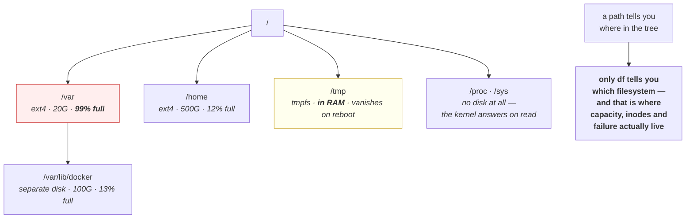

# 1.2 — Paths, mounts, and the tree that is not one disk

## One-line answer

Unix presents one continuous tree of directories starting at `/`, but that tree is stitched together
from several independent filesystems mounted at chosen points — so two paths that look adjacent can live
on different disks with different sizes, different fill levels and different rules.

---

## The story

🎬 **The scene.** A shopping centre. You walk in the front doors, past a coffee shop, through a
department store, out the other side of it into a bookshop, and up an escalator to a food court. It feels
like one building.

It is not one building. It is four, joined at the edges, built at different times by different owners.
The department store has its own security, its own opening hours and its own fire certificate. You
walked through a wall between two buildings and did not notice, because the wall had a nicely finished
doorway in it.

😬 **The naive fix.** The centre manager, planning a refurbishment, treats it as one building and budgets
one figure for new flooring based on total square metres.

💥 **Why it fails.** The department store's floor is not hers to replace and its owner has no intention
of paying. Meanwhile the bookshop's roof is leaking and its landlord is a different company again. The
seamless experience was for shoppers; **the ownership boundaries are invisible to walkers and decisive
for anyone who has to maintain the thing.**

💡 **The insight.** A unified surface can hide independent underlying units, and the seams are exactly
where responsibility, capacity and failure change. **Everything that matters operationally is a property
of the underlying unit, not of the seamless surface**, so the first question about any location is always:
which unit is this actually on?

---

## The idea in plain language

Windows shows you drive letters: `C:`, `D:`. Each disk is a separate root. Unix does not do this. There
is exactly one root, written `/`, and everything is somewhere below it.

But you still have several disks, or several partitions, or a network share, or a container volume. How
do they all fit under one root?

**They are mounted.** Mounting means: take this filesystem, and make it appear at this directory. The
directory is called the **mount point**. From then on, paths below that directory resolve into the
mounted filesystem, not into whatever was there before.

So `/var/log` might be on the same disk as `/`, or it might be a separate partition mounted at
`/var/log`. **You cannot tell by looking at the path.** The path is a location in the tree; the
filesystem is a property you have to ask about.

### The four consequences

**Capacity is per filesystem.** "The disk is full" is meaningless. `/var` can be at 100% while `/home` is
at 12%. A process writing to `/var/log` fails while a process writing to `/tmp` succeeds, on the same
machine, at the same instant. Part [3.1](../03-the-disk-that-fills/3.1-df-du-and-why-they-disagree.md)
is where you learn to ask per filesystem.

**Inode numbers are per filesystem.** An inode number identifies a file within one filesystem
([1.1](1.1-a-file-is-an-inode-a-name-is-a-pointer.md)), so the pair *(device, inode)* is what actually
identifies a file globally. This is why a hard link cannot cross a mount point, and why `Invalid
cross-device link` exists.

**`mv` is sometimes free and sometimes not.** Within one filesystem it rewrites a directory entry and
returns instantly regardless of file size. Across a mount point it must copy every byte and then unlink
— so `mv` on a large file is either instantaneous or takes minutes, depending on something invisible in
the command.

**Mount options change the rules.** A filesystem can be mounted read-only, or with execution forbidden,
or with special-device handling disabled. So a directory can be unwritable for a reason that has nothing
to do with permissions ([2.2](../02-permissions/2.2-reading-and-changing-a-mode.md)) — the whole
filesystem is read-only, and no `chmod` will help.

### The mount points that will matter to you

| Path | Typically | Why an operator cares |
| --- | --- | --- |
| `/` | the root filesystem | if this fills, the machine is barely usable |
| `/var` | often separate | logs, container images and databases live here; **it is what fills** |
| `/tmp` | sometimes a memory-backed filesystem | fast, and **its contents vanish on reboot** |
| `/home` | often separate | user data, usually not what your service writes |
| container volumes | always separate | the entire point is that they outlive the container |

**`/tmp` being memory-backed is worth flagging now.** On many systems `/tmp` is `tmpfs`, which stores
files in RAM. Writing a large file there consumes memory, not disk, and can trigger the out-of-memory
killer (Day 6) — a genuinely confusing failure, because the symptom is a memory kill from a program that
was writing a file.

### Special filesystems that are not storage at all

Some mounted filesystems have no disk behind them. `/proc` and `/sys` are the important ones: reading a
file under them makes the kernel produce an answer on the spot.

`/proc/<pid>/status` is not a file anybody wrote; it is the kernel describing that process
([Day 4](../../../day-004-linux-for-operators-i/parts/01-the-process/1.3-reading-ps-and-finding-your-service.md)
— this is where `ps` gets its data). `/proc/meminfo` and the cgroup files under `/sys/fs/cgroup` are how
Day 6 reads memory limits. **They cost no disk and their `st_size` is usually zero or a lie**, which is
why `du` skips them and why you read them with `cat` rather than trusting a listing.

---

## Why Kriya needs it

Day 25 mounts volumes into containers, and Day 26 discovers that data written to a container's own
filesystem disappears when the container is replaced. The whole distinction between "in the container"
and "on a volume" is a mount point.

Day 30's failure lab includes a full disk. Diagnosing it starts with *which* filesystem is full, because
Docker's storage is usually under `/var/lib/docker` and the remedy is completely different from a full
`/home`.

Day 42 sets resource requests in Kubernetes, and ephemeral storage is one of them — a limit on the
container's writable layer, which is a filesystem with a size you did not choose.

Day 68 configures log retention, and the number you can retain is bounded by the filesystem the logs are
on, not by the machine's total disk. Day 0 already recorded 45 GB free of 118 GB in
`docs/PACKAGES.md`; that is one filesystem's number, and knowing which one is the point.

---

## The mechanism

Ask the machine what filesystems it actually has.

```bash
df -hT
```

**Line by line:**

- `df` — "disk free". It reports **per mounted filesystem**, which is exactly the unit this part is
  about. It cannot report per directory, and part
  [3.1](../03-the-disk-that-fills/3.1-df-du-and-why-they-disagree.md) is about why that matters.
- `-h` — human-readable sizes (`45G` rather than `47185920`). Fine for reading, bad for scripting, where
  you want raw numbers you can compare.
- `-T` — **print the filesystem type**. This is the flag most people omit and it is the one that tells
  you `tmpfs` from a real disk, which changes what a large write costs.

Observed on **2026-08-24**:

```text
Filesystem     Type  Size  Used Avail Use% Mounted on
C:/Program Files/Git ntfs  118G   73G   45G  63% /
D:                   ntfs  466G  102G  364G  22% /d
C:                   ntfs  118G   73G   45G  63% /c
```

**This is Git Bash's view on Windows and it is a useful lie.** It presents the Windows drives as mount
points under a single root, which is exactly the abstraction this part describes — the seamless surface
over independent units. Note `/` and `/c` report identical numbers because they are the same underlying
volume seen twice.

**The `45G` matches `docs/PACKAGES.md` from Day 0.** That row said *"45 GB free of 118 GB"* and now you
know which filesystem it was about, and that `/d` has eight times as much free space that the number
never mentioned.

The same command on a Linux server, which is what you will actually operate:

```text
Filesystem     Type      Size  Used Avail Use% Mounted on
/dev/sda1      ext4       20G   19G  380M  99% /
tmpfs          tmpfs     3.9G     0  3.9G   0% /dev/shm
tmpfs          tmpfs     796M  1.1M  795M   1% /run
/dev/sdb1      ext4      100G   12G   84G  13% /var/lib/docker
overlay        overlay   100G   12G   84G  13% /var/lib/docker/overlay2/9f3c.../merged
```

**Five filesystems, three types, and two completely different fill levels.** The root is at 99% with
380 MB left; `/var/lib/docker` is at 13% with 84 GB. Saying "the disk is 99% full" would be true and
would send somebody to clear container images that are not the problem. The `overlay` line is a
container's own filesystem — Day 22's subject — mounted into the tree like anything else.

### Finding which filesystem a path is on

```bash
df -hT days/day-005-linux-for-operators-ii/lab
```

**Line by line:** give `df` a **path** rather than no argument, and it reports only the filesystem that
path resolves into. This is the question you actually have — "where does this end up?" — and it is one
argument away.

```text
Filesystem     Type  Size  Used Avail Use% Mounted on
C:/Program Files/Git ntfs  118G   73G   45G  63% /
```

The more precise form, which is what you want in a script:

```bash
stat -f -c '%T  avail=%a blocks of %s bytes' days/day-005-linux-for-operators-ii/lab
findmnt -T days/day-005-linux-for-operators-ii/lab 2>/dev/null || echo "findmnt not available here"
```

**Line by line:**

- `stat -f` — the `-f` switches `stat` from reporting the *file's* inode to reporting the **filesystem**
  containing it. Same command, entirely different subject, and the flag is easy to miss.
- `%T` is the filesystem type name, `%a` the free blocks available to an unprivileged user, `%s` the
  block size. **Free blocks times block size is the real number**; a single "free bytes" figure is
  always this multiplication done for you.
- `findmnt -T <path>` — on Linux, the direct answer to "which mount point does this path fall under". It
  is part of `util-linux` and is not present in Git Bash, hence the `|| echo` fallback rather than a
  confusing error ([Day 4, part 3.1](../../../day-004-linux-for-operators-i/parts/03-exit-codes/3.1-the-exit-code-is-the-whole-return-value.md)).

```text
ntfs  avail=11986812 blocks of 4096 bytes
findmnt not available here
```

### Proving the boundary exists

The `mv` timing difference is the cheapest demonstration:

```bash
cd days/day-005-linux-for-operators-ii/lab
head -c 200000000 /dev/urandom > big.bin
time mv big.bin big-renamed.bin
```

**Line by line:**

- `head -c 200000000 /dev/urandom` — read 200 MB of random bytes. `/dev/urandom` is a character device
  that produces an endless stream; `head -c` takes a fixed count from it. **Random rather than zeros
  deliberately** — zeros can be stored sparsely by some filesystems and would make the file cost less
  disk than its size claims, which would confuse part
  [3.1](../03-the-disk-that-fills/3.1-df-du-and-why-they-disagree.md).
- `time mv` — the measurement. A rename within one filesystem touches two directory entries and returns
  immediately regardless of size.

```text
real    0m0.011s
user    0m0.000s
sys     0m0.004s
```

**Eleven milliseconds for 200 MB.** No bytes moved. Now cross a boundary:

```bash
time mv big-renamed.bin /d/big-crossed.bin
```

**Line by line:** the identical command with a destination on a different filesystem — `/d` from the
`df` output above. Nothing else changes.

```text
real    0m1.842s
user    0m0.015s
sys     0m0.681s
```

**A hundred and sixty times slower**, because this was a full copy followed by an unlink. Same command,
same file, and the only difference is which side of an invisible seam the destination is on.

Clean up before you continue:

```bash
rm -f /d/big-crossed.bin && df -h /d | tail -1
```

**Line by line:** remove it and immediately confirm the space came back. **Always verify the reclaim
rather than assuming it** — part
[3.2](../03-the-disk-that-fills/3.2-the-deleted-file-that-still-costs-you-a-gigabyte.md) is entirely
about the case where it does not.



---

## When it breaks

**`No space left on device` on a machine with plenty of space.** The classic:

```text
$ python -c "open('/var/log/out.txt','w').write('x'*1000)"
Traceback (most recent call last):
  File "<string>", line 1, in <module>
OSError: [Errno 28] No space left on device
$ df -h
Filesystem      Size  Used Avail Use% Mounted on
/dev/sda1        20G   20G     0 100% /
/dev/sdb1       500G   43G  457G   9% /home
```

**What it says:** no space on the device.
**What it actually means:** no space on **the device this path resolves into**. There are 457 gigabytes
free on the same machine, on a different filesystem, and they are unreachable from `/var/log` no matter
how much you would like them to be.
**The smallest fix in the moment:** free space on the filesystem that is actually full — `df -h <path>`
tells you which one. **The real fix is a design decision:** put the thing that grows on a filesystem
sized for it, which is why `/var/lib/docker` is so often a separate disk.

**`Invalid cross-device link`, again.** Met in [1.1](1.1-a-file-is-an-inode-a-name-is-a-pointer.md), now
with the reason visible:

```text
$ ln /c/data/model.bin /d/backup/model.bin
ln: failed to create hard link '/d/backup/model.bin' => '/c/data/model.bin': Invalid cross-device link
```

**What it actually means:** the two paths are on different filesystems, so the inode number on one side
has no meaning on the other. `df -hT` on both paths shows different `Filesystem` columns, which is the
one-command diagnosis.

**`Read-only file system`, and `chmod` does not help.** The failure that looks like a permissions
problem and is not:

```text
$ touch /mnt/config/new.yaml
touch: cannot touch '/mnt/config/new.yaml': Read-only file system
$ ls -ld /mnt/config
drwxrwxrwx 3 root root 4096 Aug 24 09:02 /mnt/config
$ chmod 777 /mnt/config
chmod: changing permissions of '/mnt/config': Read-only file system
```

**What it says:** the filesystem is read-only.
**What it actually means:** the mount itself was made read-only, and permission bits are irrelevant —
`drwxrwxrwx` is as permissive as bits get and it changes nothing. **Even `chmod` fails**, which is the
tell.
**The smallest fix:** check the mount options with `mount | grep /mnt/config` and look for `ro`. In
Kubernetes this is a `readOnly: true` volume mount, which is a *deliberate* hardening choice you will
make yourself on Day 28 — so recognising this error as "working as configured" rather than "broken" is
the skill.

**The disk that filled because `/tmp` was RAM.** The confusing one:

```text
$ dd if=/dev/zero of=/tmp/scratch.bin bs=1M count=4000
dd: error writing '/tmp/scratch.bin': No space left on device
$ df -hT /tmp
Filesystem     Type   Size  Used Avail Use% Mounted on
tmpfs          tmpfs  3.9G  3.9G     0 100% /tmp
$ free -h
               total        used        free
Mem:            7.7Gi       6.9Gi       210Mi
```

**What it says:** no space in `/tmp`, and memory is nearly exhausted.
**What it actually means:** `/tmp` is `tmpfs` — stored in RAM — so writing a large temporary file
consumed memory. The disk is untouched. On a busier machine this would have triggered the out-of-memory
killer instead of a clean error (Day 6, section 4), and the process killed might not have been the one
writing.
**The smallest fix:** write large temporaries somewhere disk-backed, and check with `df -hT` first. **The
`-T` flag is what makes this diagnosable in one command**, which is why this part insists on it.

---

## In production

**What a professional writes instead of the teaching version.** They never say "the disk". Every
statement about capacity names a filesystem or a mount point, in monitoring, in runbooks and in
conversation — *"`/var/lib/docker` is at 89%"*, not *"we're low on disk"*. It sounds pedantic and it
prevents the single commonest wasted hour in an incident, which is somebody clearing space on a
filesystem that was never the problem.

**What degrades at scale.** The number of filesystems, and therefore the number of independent things
that can fill. A laptop has three; a container host has a root, a docker filesystem, several overlay
mounts per running container, and one mount per volume — dozens, each with its own fill level, most of
them ephemeral. Monitoring "disk usage" as a single number on such a host is worse than useless because
the aggregate hides the one that is about to fail. **The correct shape is a per-mount-point metric with
the mount point as a label**, which is exactly what Day 62's node exporter produces and Day 63's PromQL
groups by.

**The failure that only shows with real traffic.** The container writable layer filling. A container's
own filesystem is an overlay with a size limit you probably did not set, and a service that writes
temporary files per request will exhaust it under load and never in testing. The symptom is `No space
left on device` from a process whose data directory is a perfectly healthy volume — because the file it
was actually writing went to the container's layer, not the volume. **The discriminator is `df -hT`
inside the container**, and it is Day 30's failure lab.

**The review comment a senior engineer leaves.** *"The disk alert is on the root filesystem only. All the
growth on these nodes is container images and logs under `/var/lib/docker`, which is a separate mount and
completely unmonitored. Label the metric by mountpoint and alert per filesystem, or we will find out
about this when pods start failing to schedule."*

**The signal you would alert on.** **Free space per filesystem, as an absolute figure as well as a
percentage.** The percentage alone is misleading in both directions: 10% free on a 20 GB root is 2 GB and
comfortable for a while, while 10% free on a 200 GB filesystem receiving 30 GB of logs a day is under an
hour of runway. Better still is **projected time to full**, computed from the fill rate — Day 76 builds
this — because it converts a level into a deadline. You would **not** alert on total disk across the
machine, for the reason in *What degrades at scale*: the aggregate is the number that hides the failure.

**Blast radius.** This part introduces `mv` across filesystems and writing large files, both of which can
consume real resources. Worst case here: the 200 MB random file written to a filesystem with little
headroom, or a `mv` to `/tmp` on a machine where `/tmp` is RAM — turning a file operation into memory
pressure and potentially an out-of-memory kill of an unrelated process. Who can trigger it: anyone who
can write. What bounds it today: 45 GB free on `/` and 364 GB on `/d`
(`docs/PACKAGES.md`, Day 0), so 200 MB is safe by three orders of magnitude — **and the bound is that you
checked before writing**, which is the habit. `df -hT <target>` before any large write is one command and
it is the whole discipline.

**Cost.** `0` model calls, `0` tokens, `0` CI minutes, `0` RAM. Disk: **200 MB temporarily**, written and
then deleted in the mechanism above. That is the largest single write this curriculum has asked for so
far, and it is why the cleanup step is in the commands rather than left to you to remember.

**The interview question.** *"A service is failing with `No space left on device` but the monitoring says
disk usage is 40%. What is going on?"* The answer that lands lists the candidates in order of likelihood:
*"Most often the monitoring is aggregating across filesystems and one of them is full — I would run `df
-hT` on the exact path the service writes to, not on the machine. If that shows space, the next candidate
is inodes: `df -i`, because you can exhaust inodes with millions of small files while bytes are fine.
Then whether the path is inside the container's writable layer rather than the volume everyone assumes it
is on. And occasionally it is a deleted-but-open file — `lsof +L1` — where the space is held by a process
that still has the descriptor. Four different causes, same error string, and each one is one command
away."*

---

## Check yourself

```bash
for P in / /tmp days/day-005-linux-for-operators-ii/lab "$HOME"; do printf '%-40s' "$P"; df -hT "$P" 2>/dev/null | tail -1; done
```

Four paths, and the filesystem each one actually resolves into. **On a Linux server you will see
different `Filesystem` columns for at least two of them; on this Windows machine several will collapse to
the same volume** — and knowing which of those two worlds you are in is precisely the point of running
this before you write anything large.

**Say out loud, without scrolling up:** *`mv bigfile.bin /somewhere/else` returns instantly one day and
takes two minutes the next, with the same file. Explain the difference, and name the one command that
would have told you in advance.*
