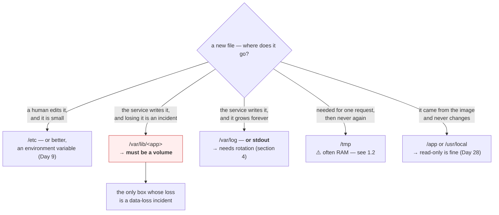

# 1.3 — Where things belong on a Unix system

## One-line answer

The Unix directory layout is a convention about **lifetime and ownership** — what is code, what is
configuration, what is data, what is disposable — and a service that puts its files in the conventional
places is one that backup, monitoring, packaging and containers all understand without being told.

---

## The story

🎬 **The scene.** A shared kitchen in a house of five people. Nobody wrote any rules, but everyone knows:
plates in the top-left cupboard, food in the pantry, cleaning things under the sink, post on the hall
table.

A new housemate arrives and puts his cereal under the sink because there was room.

😬 **The naive fix.** Somebody sticks a label on the cupboard: CEREAL.

💥 **Why it fails.** The labels multiply. Three months later there are nineteen labels, the cleaning
things are in two places, and nobody can find the spare fuses. Worse, the person who comes in to fix the
boiler — who has never been in this house before — looks under the sink for the stopcock, which is where
it always is in every house, and finds cereal.

**The convention was never for the people who live there.** They could have learnt any arrangement. It
was for the plumber, the house-sitter, the next tenant, and the person at three in the morning who does
not want to think.

💡 **The insight.** A convention's value is proportional to how many people did not agree to it. **Its
whole purpose is to be predictable to someone who has never seen your particular instance** — and every
deviation, however locally sensible, spends that.

---

## The idea in plain language

The Unix directory layout is described by the **Filesystem Hierarchy Standard**, and while no system
follows it exactly, everything follows it approximately, and the approximate version is what you need.

The organising question is not "what kind of file is this?" but **"what is its lifetime, and who owns
it?"**

| Directory | Holds | Lifetime | Who writes it |
| --- | --- | --- | --- |
| `/bin`, `/usr/bin` | executable programs | changes only when software is installed | the package manager |
| `/lib`, `/usr/lib` | shared libraries | same | the package manager |
| `/etc` | **configuration** — text, host-specific | changes when a human decides something | an administrator |
| `/var` | **variable data** — things that grow | changes constantly while running | the running services |
| `/var/log` | log files | grows forever unless rotated | the running services |
| `/var/lib` | persistent application state — databases, container images | must survive restarts | the running services |
| `/tmp` | scratch, may vanish at any time | **deleted on reboot**, often in RAM | anyone |
| `/home` | user data | as long as the user exists | users |
| `/opt` | self-contained third-party software | on install | whoever installed it |
| `/proc`, `/sys` | the kernel answering questions | not stored at all | nothing — reads are computed |

### The three distinctions that actually matter

**Configuration versus data.** `/etc` is small, text, human-edited, and belongs in version control or a
configuration management system. `/var` is large, machine-written, and belongs in a backup. Mixing them
means either backing up gigabytes of regenerable data or failing to back up the one file that says how
the system is set up. **Day 9's entire twelve-factor argument is a refinement of this line**, moving
configuration out of files and into the environment.

**Regenerable versus not.** `/var/lib/docker` is large and entirely regenerable — you can delete it and
re-pull. A database's data directory is also under `/var/lib` and is not regenerable at all. The
directory name does not distinguish them; you have to know. **The question "if I deleted this, what
would I lose?" is one you should be able to answer for every large directory on a machine you operate**,
and Day 2's blast-radius map was the first time you asked it.

**Fast-changing versus static.** This is why `/var` is so often a separate filesystem
([1.2](1.2-paths-mounts-and-the-tree-that-is-not-one-disk.md)): the directory that grows is isolated so
that when it fills — and it will — it does not take the root filesystem with it and render the machine
unusable.

### Why this matters more in containers, not less

The instinct is that containers make this irrelevant: the filesystem is disposable, so who cares where
things go?

The opposite is true, and Day 25 will make it concrete. In a container, **the layout is what tells you
which paths need to survive**. Everything not on a mounted volume is destroyed when the container is
replaced, which happens on every deploy. So:

- code in `/app` or `/usr/local/lib` — **fine to lose**, it comes from the image;
- config from environment variables — **fine to lose**, it is supplied at start;
- data in `/var/lib/<app>` — **must be on a volume**, or it is gone every deploy;
- logs to stdout, not to `/var/log` — because the container runtime collects stdout and nothing collects
  a file inside a dead container (Day 67).

**A service that scatters its files invents a new question for every deploy**: is this path one of the
ones that has to survive? A service that follows the convention has already answered it.

---

## Why Kriya needs it

Day 23 writes `pulse`'s Dockerfile and must choose where the application lives inside the image, which
directories are writable, and what goes on a volume. Every one of those is this part.

Day 25 adds Postgres, whose data directory is `/var/lib/postgresql/data`. Whether that is a volume or
part of the container's writable layer is the difference between a database and a very slow way to lose
data on every restart.

Day 28 hardens the container with a read-only root filesystem. That works **only if** you know exactly
which paths the process needs to write to, so you can mount those and nothing else. A service that
writes in unpredictable places cannot be hardened.

Day 58 handles secrets properly, and the conventional home for a mounted secret is a `tmpfs` under
`/run` — memory-backed, so it never touches disk. That choice is a lifetime decision, from this table.

Day 68 configures log rotation, which is a policy about `/var/log`, and its entire justification is the
"grows forever" cell in the table above.

---

## The mechanism

Look at where things actually are on this machine, then decide where `pulse` will live.

```bash
ls -F /
```

**Line by line:**

- `ls -F` — the `-F` appends a type indicator to each name: `/` for directories, `*` for executables,
  `@` for symbolic links. It turns an ambiguous list of words into a typed one, and it is the cheapest
  way to spot that something you assumed was a directory is actually a symlink.

Observed on **2026-08-24** (Git Bash presents a Unix-shaped view over the Git for Windows install):

```text
bin/  cmd/  dev/  etc/  git-bash.exe*  git-cmd.exe*  mingw64/  proc/  tmp/  usr/
```

On a Linux server, which is what these conventions are really about:

```text
bin@  boot/  dev/  etc/  home/  lib@  media/  mnt/  opt/  proc/  root/  run/  sbin@  srv/  sys/  tmp/  usr/  var/
```

**Notice the `@` markers on `bin`, `lib` and `sbin`.** On modern Linux those are symbolic links into
`/usr` — the "usr merge" — so `/bin/ls` and `/usr/bin/ls` are the same file reached two ways
([1.1](1.1-a-file-is-an-inode-a-name-is-a-pointer.md)). Without `-F` you would not know, and you would
be puzzled the first time a `find /` returned everything twice.

### Where the growth is

```bash
du -xh --max-depth=1 / 2>/dev/null | sort -h | tail -12
```

**Line by line:**

- `du` — "disk usage". Unlike `df`, it walks directories and adds up what it finds, so it answers "how
  much is *this subtree* using" ([3.1](../03-the-disk-that-fills/3.1-df-du-and-why-they-disagree.md)
  explains why the two disagree).
- `-x` — **stay on one filesystem.** Without it, `du /` descends into every mount point and you spend
  minutes walking a network share to answer a question about the root disk. This is the flag that makes
  `du /` a usable command rather than a mistake.
- `-h` — human-readable, and `sort -h` understands those suffixes, so `2.1G` sorts above `900M`. Using
  `sort -n` here would sort them as `2.1` and `900` and give you nonsense.
- `--max-depth=1` — one level only. You want to know which top-level directory is large, then descend
  deliberately; printing every file is unreadable.
- `2>/dev/null` — discard permission errors on directories you cannot read. **Note what this costs**:
  you lose the ability to see that a subtree was skipped, so a large unreadable directory reports as
  small. On a machine where you are not root, take the total with a pinch of salt.
- `tail -12` — the largest dozen after sorting ascending.

```text
1.1G    /home
2.3G    /usr
19G     /var
73G     /
```

**`/var` is 19 of the 73 gigabytes**, which is the expected shape and the reason it is so often on its
own filesystem. Descend one level to see what inside it:

```bash
du -xh --max-depth=1 /var 2>/dev/null | sort -h | tail -6
```

**Line by line:** the identical command aimed one level down. This drill-down — top level, then the
biggest thing, then the biggest thing inside that — is the standard way to find what is filling a disk,
and part [3.1](../03-the-disk-that-fills/3.1-df-du-and-why-they-disagree.md) turns it into a one-liner.

```text
340M    /var/cache
1.2G    /var/log
17G     /var/lib
19G     /var
```

**`/var/lib` at 17 GB is container images and databases; `/var/log` at 1.2 GB is growing forever until
something rotates it.** Two very different problems living in the same tree, and the first question about
each is "what would I lose if I deleted it?"

### Deciding where `pulse` lives

`pulse` today is a Python package in a git repository on your laptop, running from `.venv`. That is a
development layout and it does not survive containerisation. Day 23 has to choose, and the choice is
worth writing down now while it is cheap.

```bash
cat > days/day-005-linux-for-operators-ii/lab/layout.md <<'LAYOUT'
# Where pulse's files will live (decided Day 5, implemented Day 23)

| What | Path in the container | Lifetime | On a volume? |
| --- | --- | --- | --- |
| the application code | /app | comes from the image | no |
| the virtual environment | /app/.venv | comes from the image | no |
| configuration | environment variables only | supplied at start (Day 9) | n/a |
| logs | stdout / stderr | collected by the runtime (Day 67) | no |
| the model artifact | /var/lib/pulse/models | must survive a deploy (Day 109) | YES |
| scratch during a request | /tmp | per-request, disposable | no — but see Day 28 |

Rule applied: everything not on a volume is destroyed on every deploy.
Anything whose loss would be a data loss incident goes on a volume; everything else does not.
LAYOUT
cat days/day-005-linux-for-operators-ii/lab/layout.md
```

**Line by line:**

- `cat > file <<'LAYOUT' ... LAYOUT` — a heredoc, which writes multi-line text without an editor. **The
  quotes around `'LAYOUT'` matter**: they stop the shell expanding `$` and backticks inside the block, so
  the text lands verbatim. Without them, anything looking like a variable would be substituted.
- The table is the artifact, and the last two lines are the reasoning. **A layout decision without its
  rule is a list somebody will contradict in six weeks**; the rule is what makes the next path obvious.
- `cat` afterwards to confirm it wrote what you meant, rather than trusting the redirect.



---

## When it breaks

**The data directory that was not a volume.** The most expensive version of this mistake:

```text
$ docker compose down && docker compose up -d
$ docker compose logs db | head -3
PostgreSQL Database directory appears to contain a database; Skipping initialization
...
$ docker compose exec db psql -U pulse -c '\dt'
Did not find any relations.
```

**What it says:** the database started and there are no tables.
**What it actually means:** the data directory was inside the container's writable layer rather than on a
volume, so `down` destroyed it and `up` created a fresh empty one. **Nothing errored at any point** —
every log line is a normal startup line for an empty database.
**The smallest fix:** a named volume mounted at the data directory, before you put anything in it. **The
lesson is the ordering:** you cannot retrofit a volume onto data that has already been destroyed, so this
is a decision that must be right the first time, which is why Day 5 writes it down and Day 25 implements
it.

**A read-only root filesystem that will not start.** The consequence of not knowing your write paths:

```text
$ docker run --read-only pulse:latest
Traceback (most recent call last):
  File "/app/.venv/lib/python3.12/site-packages/uvicorn/main.py", line 579, in run
    server.run()
  ...
OSError: [Errno 30] Read-only file system: '/tmp/pulse-cache'
```

**What it says:** something tried to write to `/tmp` and the filesystem is read-only.
**What it actually means:** `--read-only` made the *entire* container filesystem read-only, including
`/tmp`, and some library — often not your code — needs scratch space. **The traceback names the library,
which is the useful part**: it tells you exactly which path to mount.
**The smallest fix:** `--read-only --tmpfs /tmp`, which restores a writable, memory-backed `/tmp` and
nothing else. Day 28 does this deliberately, and this error is the normal way you discover your write
paths — by forbidding writes and reading the tracebacks.

**Logs written to a file inside a container, and then lost.** Quiet, and you only notice afterwards:

```text
$ kubectl logs pulse-7c9f5d8b4-x2kpq
$ kubectl exec pulse-7c9f5d8b4-x2kpq -- ls -la /var/log/pulse/
-rw-r--r-- 1 app app 8471203 Aug 24 14:22 app.log
```

**What it says:** `kubectl logs` returns nothing, and there is an 8 MB log file inside the container.
**What it actually means:** the runtime collects **stdout and stderr**, and this service writes to a
file instead. The logs exist, in a container that will be destroyed on the next deploy, on a node you
would have to find, and nothing is shipping them anywhere.
**The smallest fix:** write to stdout. **This is not a preference, it is what makes logs collectable**,
and Day 67 builds `pulse`'s structured logging on exactly this rule.

**`du /` that never finishes.** A small operational annoyance with a one-character fix:

```text
$ du -h --max-depth=1 /
^C
```

— after several minutes with no output.

**What it says:** nothing, which is the problem.
**What it actually means:** `du` descended through every mount point, including network shares and
`/proc`, and is walking things that are not disk at all
([1.2](1.2-paths-mounts-and-the-tree-that-is-not-one-disk.md)).
**The smallest fix:** `-x` to stay on one filesystem. **On a machine with a slow or hung network mount,
`du` without `-x` can hang indefinitely in state `D`**
([Day 4, part 1.4](../../../day-004-linux-for-operators-i/parts/01-the-process/1.4-process-states-and-the-d-that-will-not-die.md))
— an unkillable diagnostic command, which is a memorable way to learn this flag.

---

## In production

**What a professional writes instead of the teaching version.** They declare their paths explicitly, in
the same place as the code, and keep the list short. A container with three writable paths that are all
named in the manifest is one you can harden, back up, monitor and reason about. The rule they apply is
the one in the lab file above: **anything whose loss would be an incident goes on a volume; everything
else is disposable and should be provably disposable** — which they test by destroying the container and
starting it again.

**What degrades at scale.** Convention becomes the only thing that scales. With one service you can
remember where it puts things. With fifty services from a dozen teams, nobody can, and the tooling has to
infer: a backup system that knows `/var/lib` matters, a log collector that reads stdout, a monitoring
agent that watches every mount point. **Every service that deviates becomes a special case in four
different systems**, and special cases are what fail silently during the incident where you needed them.

**The failure that only shows with real traffic.** Temporary files that are not cleaned up. Under test,
a service writes one scratch file per request and the disk never notices. Under real traffic it writes
thousands per minute, and if any code path fails to remove them — an exception before the cleanup, a
process killed mid-request ([Day 4](../../../day-004-linux-for-operators-i/parts/02-signals/2.4-the-signals-you-cannot-catch.md))
— they accumulate. The failure is a filesystem that fills over days, or an inode exhaustion that arrives
long before the bytes do (part [3.3](../03-the-disk-that-fills/3.3-running-out-of-inodes-with-disk-to-spare.md)).
**The reliable fix is not better cleanup code; it is `tmpfs` with a size limit**, so the accumulation is
bounded by construction and fails loudly and locally.

**The review comment a senior engineer leaves.** *"This writes uploads to `/app/uploads`, which is inside
the image layer. It works because the container has not been replaced yet. On the next deploy every
upload is gone, and because we do rolling updates it will be gone for some users and present for others
while both versions are running. Put it on the volume, and add a test that restarts the container between
write and read."*

**The signal you would alert on.** **Growth rate of each writable path, not just its size.** A directory
at 4 GB is a fact; a directory growing 400 MB an hour is a deadline, and the second one is what lets you
act before the failure. In practice this is a per-mount-point free-space metric with a projection
(Day 76). The one absolute alert worth having is **anything writing to a path that is supposed to be
read-only**, because that is a design violation that will break the moment somebody hardens the
container. You would **not** alert on `/tmp` usage, which is supposed to fluctuate — unless `/tmp` is
`tmpfs`, in which case it is a memory metric and belongs with Day 6's.

**Blast radius.** This part introduces `du` on large trees and writing a decision document — neither
destructive. **The blast radius is in the decision itself**, which is the largest on this day: choosing
that a path does not need a volume is a choice to accept losing whatever ends up there, on every deploy,
forever. Worst case: the data-loss incident above, which is unrecoverable and is discovered after the
fact. Who can trigger it: whoever writes the Dockerfile or the manifest — Day 23 and Day 36. What bounds
it: the rule written down in `lab/layout.md` today, plus the test named in the review comment — destroy
the container between writing and reading, and assert the data is still there. **A volume decision that
has never been tested by a restart is an untested backup.**

**Cost.** `0` model calls, `0` tokens, `0` CI minutes, `0` RAM. Disk: one small markdown file. **`du -x`
on a large tree costs real I/O and takes a while** — it stats every file — which is why it is a
diagnostic you run deliberately rather than something to put in a loop or a monitoring agent.

**The interview question.** *"How do you decide what goes on a volume?"* The answer that lands is a rule
rather than a list: *"I start from lifetime rather than from directory names. Everything not on a volume
is destroyed when the container is replaced, which is every deploy — so the question is only 'would
losing this be an incident?'. Application code and the virtual environment come from the image, so no.
Config comes from the environment, so there is nothing to persist. Logs go to stdout so the runtime
collects them, which means no file and no volume. What is left is genuine state — a database directory, a
model artifact, uploaded files — and that goes on a volume. Then I test it by destroying the container
between a write and a read, because a volume decision nobody has tested with a restart is just an
assumption."*

---

## Check yourself

```bash
du -xh --max-depth=1 / 2>/dev/null | sort -h | tail -6 && echo "---" && df -hT / | tail -1
```

The largest subtrees on your root filesystem, and then the filesystem's own total. **Compare the two
numbers.** They will not match — `du` sums what it could read and `df` reports what the filesystem says
— and part [3.1](../03-the-disk-that-fills/3.1-df-du-and-why-they-disagree.md) is entirely about the
gap between them. Noticing it now is the setup for that part.

**Say out loud, without scrolling up:** *your container writes uploads to `/app/uploads` and everything
works perfectly in testing. Say exactly when it breaks, what the user sees, and why no error appears in
any log.*
