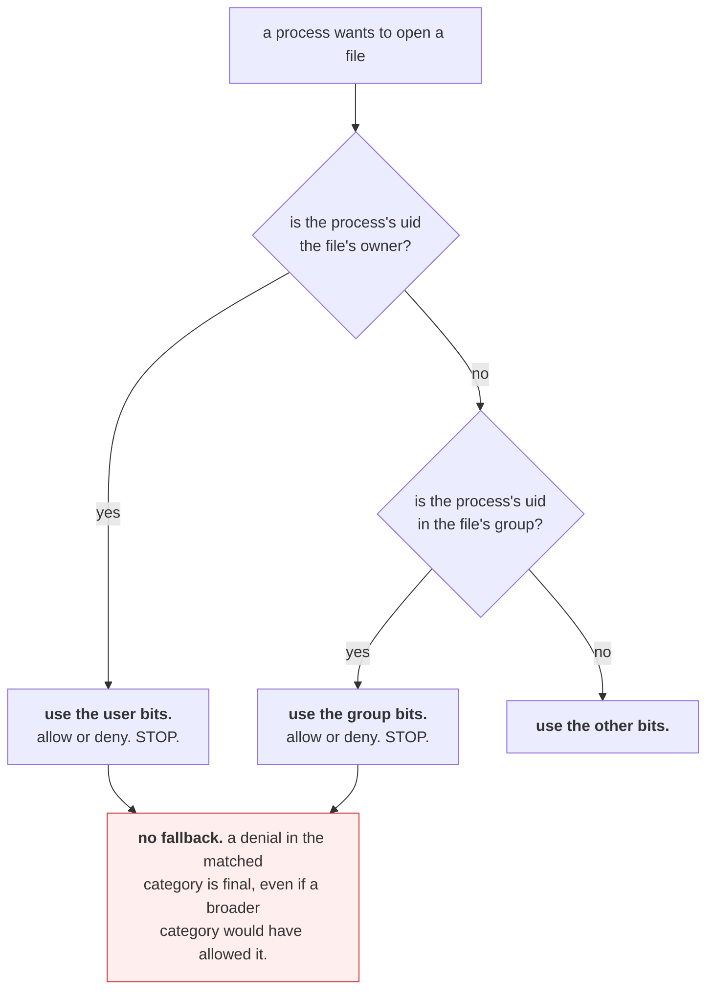

# 2.1 — User, group, other — and three bits

## One-line answer

Unix permissions are nine bits arranged as three groups of three, being read, write and execute, for the
owner, the group and everyone else, and the kernel picks **exactly one** of those three groups to apply,
based on who you are, and never falls back to another.

---

## The story

🎬 **The scene.** A gym with a card reader on the door. Members can get in during opening hours. Staff
can get in at any time. Somebody who has cancelled their membership cannot get in at all.

😬 **The naive fix.** To keep things simple, somebody proposes a rule: check each person against every
category they belong to, and let the *most generous* one win.

💥 **Why it fails.** A member of staff leaves. Her staff card is cancelled, which was the whole point.
But she is also still a paying member, and members can get in during opening hours. **The specific
removal is silently overridden by a general permission she holds in another category.** The person who
cancelled her card believes she has been locked out. She has not.

💡 **The insight.** When several rules could apply, "the most generous wins" and "the most specific wins"
give opposite answers, and only one of them lets you take access away. **A system where a specific denial
can be overturned by a general grant is a system where revoking access does not work**, which is why
Unix picks the most specific category and stops.

---

## The idea in plain language

Every file has an owner, who is a user, and a group. Every process runs as a user, who belongs to one or
more groups, from
[Day 4](../../../day-004-linux-for-operators-i/parts/01-the-process/1.1-a-process-is-not-a-program.md),
where this was one of the things recorded at process creation.

The inode's `st_mode` field, from
[1.1](../01-the-filesystem/1.1-a-file-is-an-inode-a-name-is-a-pointer.md), holds nine permission bits.

|  | read | write | execute |
| --- | --- | --- | --- |
| **user**, meaning the owner | `r` | `w` | `x` |
| **group**, meaning the file's group | `r` | `w` | `x` |
| **other**, meaning everyone else | `r` | `w` | `x` |

`ls -l` prints them as a string, such as `-rw-r--r--`. The first character is the file *type*, with `-`
for a regular file, `d` for a directory and `l` for a symbolic link, and the remaining nine are the bits,
in the order above.

### The rule that surprises everyone: exactly one group applies

When a process opens a file, the kernel asks three questions **in order** and stops at the first yes.

1. Is the process's user the file's owner? If so, **use the user bits, and stop.**
2. Is the process's user in the file's group? If so, **use the group bits, and stop.**
3. Otherwise, **use the other bits.**

**There is no fallback and no combining.** If you are the owner and the owner bits say no, you are
refused, even if the "other" bits would have allowed it. A file with mode `----rw-rw-` is readable by
everyone in the world *except* its owner, which sounds like a bug and is the rule working correctly.

This matters because it is what makes permissions *removable*. If access were the union of every
applicable rule, you could never revoke anything from somebody who also matched a broader rule, which is
the gym problem.

### What the three bits mean for a file

| Bit | On a regular file |
| --- | --- |
| `r` | you can read its contents |
| `w` | you can modify its contents |
| `x` | you can execute it as a program |

**Note what `w` is not.** It is not permission to delete the file. Deleting removes a *directory entry*,
from [1.1](../01-the-filesystem/1.1-a-file-is-an-inode-a-name-is-a-pointer.md), so it is governed by
permission on the directory rather than on the file. That is part
[2.3](2.3-the-permission-that-is-on-the-directory-not-the-file.md), and it is the single most
counter-intuitive rule in this section.

And `x` on a file is required and not sufficient, because the file also has to be something the system
can actually execute, whether that is a binary in a recognised format or a text file beginning with `#!`
naming an interpreter. Setting `x` on a text file that is not a script produces `Exec format error`
rather than a security hole.

### The numbers, and why everybody uses them

Each group of three bits is a number from 0 to 7, because three bits is one octal digit.

| Octal | Bits | Means |
| --- | --- | --- |
| `7` | `rwx` | read, write, execute |
| `6` | `rw-` | read, write |
| `5` | `r-x` | read, execute |
| `4` | `r--` | read only |
| `0` | `---` | nothing |

So `644` is `rw-r--r--`, meaning the owner can read and write and everybody else can read. `755` is
`rwxr-xr-x`, which is the standard for a program or a directory. `600` is `rw-------`, owner only, and it
is what a private key or a `.env` file should be.

**Four modes cover nearly everything you will ever set:** `644` for a normal file, `755` for something
executable or for a directory, `600` for a secret, and `700` for a private directory.

---

## Why Kriya needs it

Day 9 creates `.env` with real API keys in it. The correct mode is `600`, and Day 0 already recorded in
`docs/INCIDENTS.md` row 9 that this repository has *no* secret scanning, so the file's mode is one of the
few defences that exist before Day 17.

Day 28 runs the container as a non-root user and mounts the root filesystem read-only. That day's entire
failure mode is "the process cannot write where it needs to", diagnosed with the tools in
[2.2](2.2-reading-and-changing-a-mode.md).

Day 23 writes the Dockerfile, where a `COPY` brings files in with modes that depend on what they had on
your machine, so a script that is executable on your laptop and not in the image produces exit code
`126`, from
[Day 4, part 3.1](../../../day-004-linux-for-operators-i/parts/03-exit-codes/3.1-the-exit-code-is-the-whole-return-value.md).

Day 58 mounts secrets into the cluster, where the mode of the mounted file is a field you set, and
getting it wrong exposes a credential to every process in the container.

And you already depend on this, because `./o` runs only because it has the execute bit. Day 0 set it, and
part [2.2](2.2-reading-and-changing-a-mode.md) shows what happens when it is lost.

---

## The mechanism

Find out who you are first, because every permission decision is relative to that.

```bash
id
```

**Line by line:** `id` prints the current process's user identifier, its primary group, and every group
it belongs to. **This is the left-hand side of every permission check**, and it is the first thing to run
when something is unexpectedly denied, because very often the answer is that you are not who you thought
you were.

Observed on **2026-08-24**:

```text
uid=197609(nisha) gid=197121(None) groups=197121(None),4(INTERACTIVE),545(Users)
```

Now make three files with three modes and look at them.

```bash
cd days/day-005-linux-for-operators-ii/lab
printf 'ordinary content\n' > normal.txt        && chmod 644 normal.txt
printf 'SECRET=value\n'     > secret.env        && chmod 600 secret.env
printf '#!/usr/bin/env bash\necho hello\n' > script.sh && chmod 755 script.sh
ls -l normal.txt secret.env script.sh
```

**Line by line:**

- `chmod 644` sets the mode using the octal form. **`chmod` sets rather than adds**, because the three
  digits replace all nine bits at once, which is why the symbolic form, such as `chmod u+x`, exists for
  when you want to change one thing without restating the rest, in
  [2.2](2.2-reading-and-changing-a-mode.md).
- `#!/usr/bin/env bash` is the "shebang", the first line that tells the kernel which interpreter to run
  this file with. It uses `env bash` rather than a hard path, so that it uses whichever `bash` is on
  `PATH`, which is the portable form and the one `o` itself uses.
- `chmod 755` on the script and `600` on the secret are the two modes worth memorising, applied to the
  two kinds of file they are for.

```text
-rw-r--r-- 1 nisha None 17 Aug 24 15:02 normal.txt
-rw------- 1 nisha None 13 Aug 24 15:02 secret.env
-rwxr-xr-x 1 nisha None 32 Aug 24 15:02 script.sh
```

**Read the three strings against the table.** `-rw-r--r--` is `644`, so the owner reads and writes and
everyone else reads. `-rw-------` is `600`, so nobody but the owner has anything. `-rwxr-xr-x` is `755`,
with `x` in all three positions, which is what makes the next command work.

```bash
./script.sh
```

**Line by line:** the `./` is required, because the shell only searches `PATH` for bare names, and `.` is
deliberately not on `PATH`, since a directory containing a file called `ls` would then be a trap. The
leading `./` says "this exact path".

```text
hello
```

Now take the execute bit away and watch the exact error.

```bash
chmod 644 script.sh
./script.sh
echo "exit code: $?"
```

**Line by line:** `644` clears `x` in all three positions. Then run it and capture the exit code
immediately, before anything else clobbers `$?`, from
[Day 4, part 3.1](../../../day-004-linux-for-operators-i/parts/03-exit-codes/3.1-the-exit-code-is-the-whole-return-value.md).

```text
bash: ./script.sh: Permission denied
exit code: 126
```

**It is `126`, not `127`.** That is the distinction from Day 4: `127` means the shell could not find it,
and `126` means it found it and could not execute it. **Two different problems, two different numbers,
and the codes exist precisely so that a script can tell them apart.**

Put it back and confirm.

```bash
chmod +x script.sh && ./script.sh && ls -l script.sh
```

**Line by line:** `chmod +x` is the symbolic form, which **adds** the execute bit wherever the mode is
otherwise readable and leaves the other bits alone. It is chained with `&&` so that each step only runs
if the previous one succeeded, from
[Day 4, part 3.1](../../../day-004-linux-for-operators-i/parts/03-exit-codes/3.1-the-exit-code-is-the-whole-return-value.md),
which makes this a self-checking line rather than three hopeful commands.

```text
hello
-rwxr-xr-x 1 nisha None 32 Aug 24 15:02 script.sh
```

### Proving that exactly one category applies

Here is the counter-intuitive rule, demonstrated.

```bash
chmod 044 normal.txt
ls -l normal.txt
cat normal.txt
echo "exit code: $?"
```

**Line by line:** `044` is `---r--r--`, meaning **nothing for the owner**, read for the group, and read
for everyone else. You own this file. The world can read it and you cannot.

```text
----r--r-- 1 nisha None 17 Aug 24 15:02 normal.txt
cat: normal.txt: Permission denied
exit code: 1
```

**You are locked out of your own file while everyone else can read it.** The kernel matched you as the
owner, applied the owner bits, found no `r`, and stopped. It did not go on to consider the group or other
bits, because that is not how the check works.

**The one saving grace** is that you own it, so you can change the mode back, because `chmod` is governed
by ownership rather than by the read bit.

```bash
chmod 644 normal.txt && cat normal.txt
```

**Line by line:** restore, and immediately verify. The `&&` means a failed `chmod` would stop you drawing
the wrong conclusion from a failed `cat`.

```text
ordinary content
```



---

## When it breaks

**`Permission denied` on a file you own.** This is confusing until you know the rule.

```text
$ ls -l config.yaml
----rw-rw- 1 nisha None 812 Aug 24 15:20 config.yaml
$ cat config.yaml
cat: config.yaml: Permission denied
```

**What it says:** permission denied.

**What it actually means:** the owner bits are empty and you are the owner, so the check stopped there.

**The smallest fix:** `chmod u+r config.yaml`. **How to spot it instantly:** the first three characters
after the type are `---` while later ones are not. Any mode where the owner has *less* than the group or
other is almost certainly a mistake, and it is worth training your eye to flag it.

**`Permission denied` writing into a directory you can read.** This is the one that leads into part
[2.3](2.3-the-permission-that-is-on-the-directory-not-the-file.md).

```text
$ ls -ld /var/log
drwxr-xr-x 12 root root 4096 Aug 24 09:11 /var/log
$ touch /var/log/mine.log
touch: cannot touch '/var/log/mine.log': Permission denied
```

**What it says:** it cannot create the file.

**What it actually means:** creating a file writes a new entry into the **directory**, and you have `r-x`
on that directory rather than `rwx`. The file does not exist yet, so no file permission is involved at
all.

**The smallest fix:** write somewhere you own. **The general lesson:** whenever an error is about
creating, deleting or renaming, look at the directory's mode rather than the file's.

**`Exec format error` after setting `x`.** The bit is necessary and not sufficient.

```text
$ chmod +x notes.txt
$ ./notes.txt
bash: ./notes.txt: cannot execute binary file: Exec format error
```

**What it says:** it cannot execute this file.

**What it actually means:** the execute *permission* is granted, and the file is simply not executable
*content*. There is no `#!` line and it is not a binary the system recognises.

**The smallest fix:** add a shebang, or stop trying to execute a text file. **It is worth knowing because
it tells you what `x` does and does not do**, since it is a permission rather than a declaration of file
type.

**Everything is `-rw-r--r--` and `chmod` appears to do nothing.** This is specific to your machine, and
it will confuse you today.

```text
$ chmod 600 secret.env
$ ls -l secret.env
-rw-r--r-- 1 nisha None 13 Aug 24 15:24 secret.env
```

**What it says:** the mode did not change.

**What it actually means:** you are on an NTFS filesystem under Git Bash, where Unix permission bits are
emulated over Windows ACLs and the emulation is partial. Depending on the mount options, `chmod` is
either ignored or only partially honoured.

**The smallest fix on this machine:** there is none, and **this is important for Day 9**, when `.env`
gets a real key. `chmod 600` is not a reliable protection here. The real protections available to you
today are `.gitignore` from Day 0, never creating the file outside the repository, and, from Day 21,
doing this work inside WSL2 where the permission model is genuine. **Test it rather than assuming**,
because the check-yourself command below tells you which world you are in.

---

## In production

**What a professional writes instead of the teaching version.** They set modes explicitly at creation
rather than fixing them afterwards, because the window between "the file exists" and "the file is `600`"
is a window in which it was world-readable. In Python that means
`os.open(path, os.O_WRONLY | os.O_CREAT, 0o600)`, or `os.umask` set beforehand, rather than `open()`
followed by `os.chmod()`. For anything holding a credential this matters, because a secret written `644`
and corrected a millisecond later has still been readable, and on a shared machine that is enough.

**What degrades at scale.** The three-category model runs out. Nine bits can express "the owner, one
group, everyone" and nothing more nuanced, so as soon as you need two groups with different access you
are stuck. Real systems answer this in one of two ways. There are POSIX access control lists, through
`setfacl`, which extend the model and which almost nobody enjoys debugging, and, far more commonly, there
is **giving up on filesystem permissions as the access control mechanism entirely** and putting the
boundary somewhere else: a service with an API, a database with roles, a secrets manager with policies.
Day 58 and Day 215 take that route, and the reason is this limit.

**The failure that only shows with real traffic.** The umask race described above, plus permissions that
depend on which process created a file. When a service writes files that another service reads, the mode
is inherited from the creating process's umask, which is inherited from *its* parent, from
[Day 4](../../../day-004-linux-for-operators-i/parts/01-the-process/1.2-pid-parent-and-the-process-tree.md),
so the same code produces different modes depending on how the service was started. It works when started
by hand and fails under the supervisor, or the other way round, intermittently, with `Permission denied`
on a file that was fine yesterday.

**The review comment a senior engineer leaves.** *"This writes the token to disk with the default umask
and then chmods it to 600. Between those two calls it is world-readable, and on this host that is a real
exposure. Open it with mode 0600 in the first place: one call, no window."*

**The signal you would alert on.** Not file modes as a metric, because that is a scanning job rather than
a time series. What you alert on is **the result of a periodic check**: any file under a secrets
directory whose mode is more permissive than `600`, or any world-writable file in an application
directory. Run it as a scheduled scan and alert on a non-empty result. **The reason it is a scan and not
a metric is that the correct value is a constant, so what you want is a violation count, and it should be
zero.** You would **not** alert on individual `Permission denied` errors from applications, which are
usually a misconfiguration to fix rather than a page.

**Blast radius.** This part introduces `chmod`, which changes who can do what. The worst case is
`chmod -R 777` on a directory tree, which is a genuinely common "fix" for a permissions problem, and
which makes every file world-writable, including any credential in the tree, and cannot be undone because
the previous modes were not recorded anywhere. The owner of the files can trigger it, and root can
trigger it for anything. What bounds it today is that everything here is in this day's `lab/`, and this
machine's NTFS emulation limits the effect anyway. **What bounds it in general is refusing to use `777`
at all**, because it is never the right answer, and the correct fix for "permission denied" is to work
out which of the three categories applied, which is a one-command question, using `ls -l` plus `id`, and
takes less time than the wrong fix.

**Cost.** `0` model calls, `0` tokens, `0` CI minutes, `0` RAM and `0` disk beyond a few small files.
Permission bits are nine bits inside an inode that already exists. **Checking them costs one `stat`, and
the cost of getting them wrong is measured in exposure**, and unlike most costs on this day it is not
recoverable, because a key that was briefly world-readable has to be rotated rather than re-chmodded,
which is Day 9, part 3.4.

**The interview question.** *"A file is mode `----rw-rw-` and owned by you. Can you read it?"* The answer
that lands is "no", and then the reason: *"Unix picks exactly one of user, group or other, being the
first one that matches, and stops. I am the owner, so the owner bits apply and they are empty, and it
never falls through to the group or other bits, even though those would allow it. That is deliberate,
because if permissions were the union of everything that matched, you could never revoke access from
somebody who was also in a broader category. I can still fix it, because `chmod` is governed by ownership
rather than by the read bit."*

---

## Check yourself

```bash
cd days/day-005-linux-for-operators-ii/lab && printf 'x\n' > perm-probe && chmod 600 perm-probe && stat -c '%a %A %U %G  %n' perm-probe && id -un && rm -f perm-probe
```

Set a mode, and then print it back in both octal, with `%a`, and symbolic form, with `%A`, alongside the
owner and group. **If `%a` prints `600`, this filesystem honours Unix modes. If it prints `644`, it does
not**, which is the fact you need before Day 9 puts a real API key in a file on this machine, and it is
better to find out now than then.

**Say out loud, without scrolling up:** *you own a file, the world can read it, and you cannot. Explain
the exact sequence of checks the kernel performed, and say why the designers chose "stop at the first
match" over "most permissive wins".*
