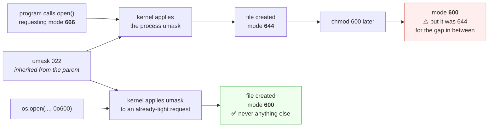

# 2.2 — Reading and changing a mode, and the umask that decided it for you

## One-line answer

`chmod` has two forms — octal, which replaces all nine bits, and symbolic, which adjusts some of them —
and the mode a new file gets when you did not specify one comes from an inherited setting called the
`umask`, which is why "the same code produces different permissions" is a real and confusing bug.

---

## The story

🎬 **The scene.** A print shop. Every job that comes in gets printed on whatever paper is loaded in the
machine at the time.

A customer orders business cards. They come out on thin paper. She complains. The operator loads card
stock and reprints them, and everyone is happy.

😬 **The naive fix.** From then on, whenever a job comes out wrong, the operator reprints it on the right
paper. It works every time.

💥 **Why it fails.** Nobody ever asks why the machine had thin paper loaded. Then a large overnight run
goes through unattended, on whatever was loaded at six in the evening, and four thousand items come out
wrong with nobody there to reprint them. The correction had become so routine that the *default* — the
thing that decides what happens when nobody is looking — was never examined.

💡 **The insight.** Fixing an output every time hides the setting that produced it. **The default is the
thing that governs the cases you are not watching**, and those are the cases that matter, because the
watched ones were going to be fine anyway.

---

## The idea in plain language

Part [2.1](2.1-user-group-other-and-three-bits.md) established the nine bits. This part is about
changing them, and about who chose them when you did not.

### Two forms of `chmod`, and when each is right

**Octal**, three digits, one per category: `chmod 644 file`. It sets **all nine bits at once**, replacing
whatever was there. This is what you want when you know the complete answer — a config file is `644`, a
secret is `600`, a script is `755`, and stating the whole thing is clearer than describing an
adjustment.

**Symbolic**, describing a change: `chmod u+x file`. Three parts — *who* (`u` user, `g` group, `o`
other, `a` all), *what* (`+` add, `-` remove, `=` set exactly), and *which bits* (`r`, `w`, `x`). It
touches only what you named and leaves the rest alone. This is what you want when you know the change
and not the destination — most often `chmod +x` on a script whose other bits are already correct.

| You want to | Use | Because |
| --- | --- | --- |
| set a file to a known standard mode | `chmod 644` | states the whole answer; no dependence on the current value |
| make a script runnable | `chmod +x` | you care about one bit and not the other eight |
| lock a secret down completely | `chmod 600` | absolute, not relative — you want a guarantee, not a delta |
| remove world access from a tree | `chmod -R o-rwx` | relative, preserves whatever owner and group had |

**The mistake worth naming:** using octal when you meant symbolic. `chmod 755` on a secret file that was
`600` is not "making it executable", it is publishing it. The octal form always says everything, and if
you only thought about one digit the other two came along anyway.

### The `umask` — who chose the mode you did not choose

When a program creates a file, it asks for a mode. Most programs ask for `666` (read and write for
everybody) for data files and `777` for executables — a deliberately permissive request, because they do
not know your policy.

The kernel then **removes** whatever bits are set in the process's `umask` before creating the file. The
umask is a mask of bits to *withhold*, and it is inherited from the parent process
([Day 4](../../../day-004-linux-for-operators-i/parts/01-the-process/1.2-pid-parent-and-the-process-tree.md)
— another thing copied at creation).

| Requested | umask | Result | Meaning |
| --- | --- | --- | --- |
| `666` | `022` | `644` | the common default: group and other lose write |
| `666` | `002` | `664` | group keeps write — common on collaborative servers |
| `666` | `077` | `600` | owner only — what you want for anything sensitive |
| `777` | `022` | `755` | the same mask applied to a directory or executable |

**So `644` is not a rule; it is `666` minus `022`.** Change the umask and the same program writing the
same file produces a different mode, with no code change anywhere. That is the whole of the print-shop
story, and it is why a service can write world-readable files on one host and correct ones on another.

### Why `chmod` after the fact is not the same as getting it right

For anything sensitive, `open()` then `chmod()` leaves a window — however brief — during which the file
existed with the wrong mode. On a busy machine with other users, a millisecond is enough. The correct
form is to specify the mode at creation, which both `os.open` and a tightened `umask` achieve. This
matters concretely on Day 9, when `.env` gets a real API key.

---

## Why Kriya needs it

Day 9 writes `.env`. Whether it lands as `600` or `644` depends on the umask of whatever created it, and
`docs/INCIDENTS.md` row 9 already established that this repository has no secret scanning — so the file's
mode is one of very few defences that exist before Day 17.

Day 23's Dockerfile uses `COPY`, which preserves modes from the build context. A script that is
executable on your laptop and not in the image gives exit code `126` at container start
([Day 4, part 3.1](../../../day-004-linux-for-operators-i/parts/03-exit-codes/3.1-the-exit-code-is-the-whole-return-value.md)),
and the fix is a `chmod` in the Dockerfile rather than a hope about the build machine.

Day 28 runs the container as non-root with a read-only root filesystem, and every `Permission denied` on
that day is diagnosed by comparing `id` in the container against `ls -l` on the path.

Day 58 mounts secrets into Kubernetes, where `defaultMode` on the volume is exactly this — an octal
number in a manifest, deciding who inside the container can read a credential.

---

## The mechanism

Watch the umask decide a mode you never specified.

```bash
cd days/day-005-linux-for-operators-ii/lab
umask
```

**Line by line:** `umask` with no argument prints the current mask, in octal. **This is a property of the
running shell process**, inherited from whatever started it, and every file that shell creates from now
on is affected by it.

Observed on **2026-08-24**:

```text
0022
```

Now create a file without saying anything about permissions:

```bash
printf 'a\n' > default-mode.txt
stat -c '%a %A %n' default-mode.txt
```

**Line by line:**

- `>` creates the file, and neither you nor the shell specified a mode — so this is entirely the umask's
  decision.
- `stat -c '%a %A %n'` — the mode in octal, the mode in symbolic form, and the name. **Printing both
  forms together is the habit worth having**, because you think in one and error messages talk in the
  other.

```text
644 -rw-r--r-- default-mode.txt
```

**`666` requested, `022` withheld, `644` created.** Change the mask and repeat, changing nothing else:

```bash
umask 077
printf 'a\n' > tight-mode.txt
stat -c '%a %A %n' tight-mode.txt
umask 022
```

**Line by line:**

- `umask 077` — withhold everything from group and other. `7` is `rwx`, so `077` removes all three bits
  from both non-owner categories.
- The identical `printf` as before. **This is the controlled experiment: same command, same shell, one
  setting changed.**
- `umask 022` at the end to restore the shell's original mask. Leaving a modified umask in an interactive
  shell means every file you create for the rest of the session is affected, which is exactly the kind of
  invisible state that causes "it worked yesterday".

```text
600 -rw------- tight-mode.txt
```

**Two files, same command, different modes.** Nothing in the `printf` mentions permissions. If you were
debugging why a service wrote a world-readable secret, the code would look innocent and the answer would
be in an environment setting three processes up the tree.

### The two forms of `chmod`, compared directly

```bash
printf 'x\n' > form-demo.sh && chmod 640 form-demo.sh && stat -c 'start:    %a %A' form-demo.sh
chmod +x form-demo.sh        && stat -c 'after +x: %a %A' form-demo.sh
chmod 755 form-demo.sh       && stat -c 'after 755: %a %A' form-demo.sh
```

**Line by line:**

- Start at `640` — `rw-r-----`: owner reads and writes, group reads, other has nothing. A reasonable
  mode for something semi-private.
- `chmod +x` — **the symbolic form adds execute where read is already permitted**, and leaves everything
  else untouched. Note it does not add `x` for "other", because "other" had no read bit and `+x` with no
  category is filtered by the umask.
- `chmod 755` — the octal form. It sets all nine bits, and in doing so **grants read to "other", which
  had nothing a moment ago.**

```text
start:    640 -rw-r-----
after +x: 750 -rwxr-x---
after 755: 755 -rwxr-xr-x
```

**Compare the last two lines carefully.** Both commands were "make it executable". The symbolic one
produced `750` and preserved the privacy; the octal one produced `755` and published it to everyone on
the machine. **On a file that was `600` and holds a credential, that is the difference between a script
and an incident.**

### Setting the mode at creation, the way that has no window

```python
# days/day-005-linux-for-operators-ii/lab/write_secret.py
import os
from pathlib import Path

target = Path("secret-safe.env")

fd = os.open(target, os.O_WRONLY | os.O_CREAT | os.O_TRUNC, 0o600)
try:
    os.write(fd, b"GROQ_API_KEY=not-a-real-key\n")
finally:
    os.close(fd)

print(f"{target}: {oct(target.stat().st_mode & 0o777)}")
```

**Line by line:**

- `os.open` rather than the builtin `open()` — the low-level call, which accepts a mode argument. The
  builtin does not, which is exactly why the `open`-then-`chmod` pattern exists and why it is wrong for
  secrets.
- `os.O_WRONLY | os.O_CREAT | os.O_TRUNC` — write only, create if absent, truncate if present. These are
  the flags the builtin's `"w"` expands to; spelling them out is the price of getting the mode argument.
- `0o600` — **the mode requested at creation**, so the file never exists with any other. Note it is still
  subject to the umask: a umask of `077` would leave `600` unchanged, but a hostile umask cannot make it
  *more* permissive, only less, which is the direction you want.
- `try` / `finally` with `os.close(fd)` — a raw file descriptor is not closed by garbage collection the
  way a file object is. **Leaking descriptors is how a long-running process eventually hits its open-file
  limit**, and it is the same class of resource leak as the unreaped zombies on Day 4.
- `target.stat().st_mode & 0o777` — mask off the file-type bits so you see only the nine permission bits
  ([1.1](../01-the-filesystem/1.1-a-file-is-an-inode-a-name-is-a-pointer.md): `st_mode` holds both).
  Printing it is the verification, not decoration.

```bash
uv run python days/day-005-linux-for-operators-ii/lab/write_secret.py
```

**Line by line:** run it through `uv run` so it uses the project's interpreter rather than whatever
`python` resolves to (Day 0's interpreter lesson). The path is given from the repository root, which is
where `uv run` anchors — running it from inside `lab/` would need a different path and is a common way to
get a confusing `No such file or directory`.

```text
secret-safe.env: 0o600
```

**On a filesystem that honours modes.** On this machine's NTFS it may print `0o644`
([2.1](2.1-user-group-other-and-three-bits.md), *When it breaks*) — and that result is itself the finding,
because it tells you this defence is not available here and Day 9 must not rely on it.



---

## When it breaks

**`chmod: cannot access 'file': No such file or directory` — on a file you can see.** A symlink problem
wearing a permissions costume:

```text
$ ls -l current.yaml
lrwxrwxrwx 1 nisha None 22 Aug 24 15:40 current.yaml -> releases/v3/app.yaml
$ chmod 600 current.yaml
chmod: cannot access 'current.yaml': No such file or directory
```

**What it says:** the file does not exist.
**What it actually means:** `chmod` follows symbolic links, so it tried to change the mode of
`releases/v3/app.yaml`, which is missing — a dangling link
([1.1](../01-the-filesystem/1.1-a-file-is-an-inode-a-name-is-a-pointer.md)). The error names the path
you typed, not the path that was actually absent.
**The smallest fix:** `readlink -f current.yaml` to see where it really points. **And note that a
symlink's own mode is always `lrwxrwxrwx` and is meaningless** — permission is decided by the target, so
"tightening the symlink" is not a thing you can do.

**`Operation not permitted` from `chmod` on a file you can write.** Ownership versus permission:

```text
$ ls -l /var/log/syslog
-rw-r----- 1 syslog adm 4194304 Aug 24 15:41 /var/log/syslog
$ chmod 644 /var/log/syslog
chmod: changing permissions of '/var/log/syslog': Operation not permitted
```

**What it says:** not permitted.
**What it actually means:** `chmod` requires **ownership**, not write permission. You might be in the
`adm` group and able to read it; changing its mode is a different capability entirely.
**The smallest fix:** you cannot, without being the owner or root. **The distinction is worth internalising**
— read, write and chmod are three separate authorities, and being able to modify a file's contents never
implies being able to modify its permissions.

**The service that writes world-readable files on one host and not another.** The umask bug in its
natural habitat:

```text
host-a $ ls -l /var/lib/pulse/cache/session.json
-rw-r--r-- 1 pulse pulse 2048 Aug 24 15:12 session.json
host-b $ ls -l /var/lib/pulse/cache/session.json
-rw-rw---- 1 pulse pulse 2048 Aug 24 15:12 session.json
```

**What it says:** the same service produced two different modes.
**What it actually means:** two different umasks, inherited from two differently-configured init systems
or login shells. **The application code is identical and is not the cause.**
**The smallest fix:** set the umask explicitly where the service starts, or — better — specify modes at
creation as in the mechanism above, so the umask can only tighten and never loosen. **The diagnostic is
one line**: read `/proc/<pid>/status` and look at the `Umask` field, which shows the mask of a *running*
process rather than of your shell.

**`chmod -R 777` and the aftermath.** The fix that becomes the incident:

```text
$ chmod -R 777 /var/lib/pulse
$ ls -l /var/lib/pulse/.env
-rwxrwxrwx 1 pulse pulse 312 Aug 20 11:02 .env
```

**What it says:** it worked. The permission error is gone.
**What it actually means:** every file in the tree is now writable by every user on the machine,
including the one holding credentials — and **the previous modes are not recorded anywhere**, so there is
no undo. Any user can now modify the application's data, and any credential in that tree must be treated
as disclosed.
**The smallest fix:** there is no small fix; that is the point. Rotate anything sensitive in the tree
(Day 9, part 3.4), then set modes deliberately. **The real remedy is never to run it**: the correct
response to `Permission denied` is `ls -l` plus `id`, which takes one line and identifies which of the
three categories applied ([2.1](2.1-user-group-other-and-three-bits.md)).

---

## In production

**What a professional writes instead of the teaching version.** They never `chmod` a secret after
creating it, and they set the umask once, explicitly, wherever the service starts — in the systemd unit,
the container image, or the entrypoint — rather than inheriting whatever the environment happened to
have. The reasoning is that an inherited default is invisible state: it does not appear in the
application's code, its config, or its logs, so when it differs between hosts nothing points at it.

**What degrades at scale.** Consistency. One machine you configured has the umask you chose; a hundred
machines built by three different processes over two years do not, and the divergence is silent until an
audit finds a world-readable credential on nine of them. This is one of the reasons configuration
management and immutable images won: **a property that is inherited rather than declared will drift**,
and drift in a security-relevant default is the expensive kind. Day 51's infrastructure-as-code work is
the general answer, and Day 23's image is the specific one — a container's umask comes from the image,
which is a build artifact under version control.

**The failure that only shows with real traffic.** The chmod window. Under low load, `open()` followed by
`chmod()` is a microsecond and nobody ever reads the file in between. Under real load on a shared
machine, with other processes scanning directories — a backup agent, a security scanner, another tenant —
the window is eventually hit. **It is unreproducible, it appears once in a million operations, and the
consequence is a disclosed credential**, which is why the advice is unconditional rather than
proportional to risk.

**The review comment a senior engineer leaves.** *"The deploy script does `chmod -R 755` on the app
directory to make the entrypoint executable. That also makes the config directory and everything in it
world-readable, including the file with the database URL. Use `chmod +x` on the one file, or better, set
the mode in the Dockerfile so the running host never has to touch it."*

**The signal you would alert on.** A scheduled **permission audit** rather than a metric: files under
secret directories with modes more permissive than `600`, and any world-writable file under an
application directory. The correct value is a constant, so the useful signal is a violation count that
should be zero, and any non-zero result is actionable. Emit it as a gauge so you can alert on it and see
its history. You would **not** alert on umask values themselves — that is a configuration check for
Day 51's tooling, not a runtime signal.

**Blast radius.** `chmod` changes who can do what, and `chmod -R` does it to a whole tree with no
confirmation and no record of the previous state. Worst case: `chmod -R 777` on a directory containing
credentials — every user on the machine gains read and write, the old modes are unrecoverable, and every
secret in the tree must be rotated. Who can trigger it: the owner of the files. What bounds it today:
this all happens in `lab/`, and this machine's NTFS emulation limits the real effect. **What bounds it in
practice is a rule with no exceptions — never `777`, never `-R` on a tree you have not listed first.**
`find <dir> -type f -perm /o+w` before and after any recursive change turns an irreversible action into a
reviewable one.

**Cost.** `0` model calls, `0` tokens, `0` CI minutes, `0` RAM, `0` disk beyond a few small files.
`chmod` writes one field in an inode. **The cost of the wrong mode is rotation** — a credential that was
briefly world-readable has to be replaced, not re-secured, and rotation is measured in coordination
rather than in bytes (Day 9, part 3.4).

**The interview question.** *"Your service writes a token file and it comes out world-readable in
production but not in staging. Where do you look?"* The answer that lands names the invisible input:
*"The umask of the process, not the code — the mode of a created file is the requested mode minus the
umask, and the umask is inherited from whatever started the service, so it differs between a systemd unit
and a login shell and a container. I would read `/proc/<pid>/status` for the `Umask` line on both hosts
rather than checking my own shell, because they are different processes. Then I would stop relying on it
entirely and open the file with an explicit mode — `os.open` with `0o600` — because the umask can only
take permissions away, so an explicit tight mode is safe on every host regardless of what it is set
to."* Then the detail: *"and I would never fix it with a later `chmod`, because that leaves a window
where the file existed world-readable, which is unreproducible and exactly the kind of thing that bites
once."*

---

## Check yourself

```bash
cd days/day-005-linux-for-operators-ii/lab && umask && for M in 022 077 002; do (umask "$M"; printf 'x\n' > "um-$M.txt"); stat -c "umask $M -> %a %A" "um-$M.txt"; done && rm -f um-*.txt
```

Three umasks, three identical file creations, three different modes — with the shell's own mask printed
first so you can see which of them is your default. **The subshell parentheses matter**: `(umask ...; ...)`
changes the mask only inside that subshell, so your interactive shell is left exactly as it was. Setting
`umask` without them is how you accidentally affect every file you create for the rest of the session.

**Say out loud, without scrolling up:** *`chmod +x script.sh` and `chmod 755 script.sh` both make a script
runnable. Name a starting mode where they give different results, and say which one you would rather have
typed on a file holding a credential.*
