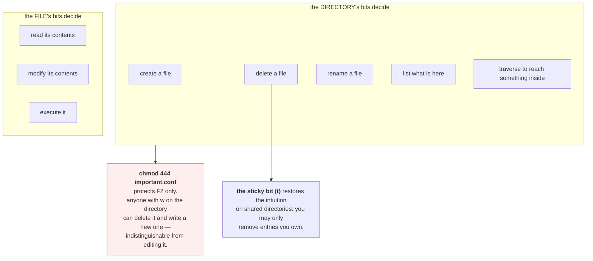

# 2.3 — The permission that is on the directory, not the file

## One-line answer

Creating, deleting and renaming a file are operations on the **directory**, not on the file — so write
permission on a directory lets you delete a file you cannot even read, and read-only permission on a file
does not protect it at all.

---

## The story

🎬 **The scene.** A pigeonhole rack in a college porter's lodge. Each slot has a name card slid into a
holder on the front, and letters inside.

The letters belong to their recipients. Nobody else may open them.

But the *rack* is in a public corridor, and the name cards slide in and out freely. Anyone walking past
can pull a card out, swap two of them, or put a new card in an empty slot.

😬 **The naive fix.** The college seals each envelope more securely and adds a rule that opening someone
else's post is a serious offence.

💥 **Why it fails.** Nobody opened anything. Someone swapped two name cards as a joke, and for three days
one student's letters went into another's slot and vice versa. A different card was simply removed, and
its owner's post accumulated in an unlabelled slot that the porter eventually cleared as abandoned.
**Every letter stayed sealed. Every letter went to the wrong place or into a bin.**

💡 **The insight.** Protecting the contents and protecting the *index* are different jobs, and people
consistently do the first and forget the second. **Whoever controls the labels controls where things go
and whether they still exist**, regardless of how well the contents are locked.

---

## The idea in plain language

A directory is a list of *(name, inode)* pairs
([1.1](../01-the-filesystem/1.1-a-file-is-an-inode-a-name-is-a-pointer.md)). That is genuinely all it
is. So the same three permission bits mean something different when applied to one:

| Bit | On a directory |
| --- | --- |
| `r` | you can **list** the names in it |
| `w` | you can **add, remove and rename** entries — that is, create, delete and move files |
| `x` | you can **traverse** it — use it as a component of a path to reach something inside |

**Read that `w` row again.** Deleting a file is removing an entry from a directory's list. It is a write
to the *directory*. The file's own permissions are not consulted at all — not read, not write, not
ownership.

So:

- **You can delete a file you cannot read.** If you have `w` on the directory, the file's mode is
  irrelevant.
- **You cannot delete a file you own** if you lack `w` on the directory containing it.
- **Making a file read-only does not protect it.** `chmod 444 important.conf` prevents modification of
  its contents through that name, and does nothing to prevent deletion or replacement.

That last point is the one that catches people. "I made it read-only so nobody can change it" is false:
anyone with write on the directory can delete it and create a new file with the same name, and the result
is indistinguishable from having edited it.

### `r` and `x` are genuinely independent

This is the second surprise. `x` without `r` means you can reach files inside if you already know their
names, but you cannot list what is there. That is a real and useful configuration — it is how you make a
directory that serves files without publishing an index — and it produces the odd experience of `ls`
failing while `cat dir/known-file` succeeds.

`r` without `x` is the opposite and is nearly useless: you can list the names and cannot reach any of
them, or even `stat` them, because every path component needs `x` to be traversed.

**Every directory on the path needs `x`.** To open `/var/lib/pulse/models/model.bin` you need `x` on
`/`, on `/var`, on `/var/lib`, on `/var/lib/pulse` and on `/var/lib/pulse/models`, and then permission on
the file. A single missing `x` anywhere along the chain produces `Permission denied` naming the full
path, with no hint about which component was the problem.

### The sticky bit — the fix for shared directories

The `w`-on-directory rule makes a world-writable shared directory like `/tmp` unusable: anyone could
delete anyone's files. The fix is a tenth bit, the **sticky bit**, shown as `t` in the last position:

```
drwxrwxrwt   /tmp
```

With it set, you can only delete or rename an entry if you own the entry, or own the directory, or are
root. It restores the intuition people already had, for exactly the case where the directory has to be
shared.

**If you ever see `drwxrwxrwx` without the `t` on a shared directory, that is a bug**, and it is one an
attacker can use — replace a file another process is about to read, and you have changed its behaviour
without ever touching its contents.

---

## Why Kriya needs it

Day 28 runs the container as a non-root user with a read-only root filesystem, and the failures on that
day are `Permission denied` on *directories* — the process cannot create its scratch file, cannot write
its socket, cannot make its lock. Diagnosing them requires knowing that "cannot create" is a directory
question.

Day 30's failure lab includes a container that starts and immediately exits, and one of the causes is a
mounted volume owned by the wrong user, so the application cannot create anything inside it. The file
does not exist yet, so no file permission is involved.

Day 58 mounts secrets. A secret file mounted `600` inside a directory that is `777` is not protected at
all — anyone can replace it — and that is a review comment worth being able to make.

Day 89 onward writes data artifacts with the write-then-rename pattern
([1.1](../01-the-filesystem/1.1-a-file-is-an-inode-a-name-is-a-pointer.md)). Rename is a directory
operation, so the whole safe-write pattern requires `w` on the target directory and nothing about the
target file.

---

## The mechanism

Delete a file you cannot read.

```bash
cd days/day-005-linux-for-operators-ii/lab
mkdir -p pigeonhole
printf 'private contents\n' > pigeonhole/letter.txt
chmod 000 pigeonhole/letter.txt
ls -ld pigeonhole && ls -l pigeonhole/letter.txt
```

**Line by line:**

- `mkdir -p` — create it, and do not error if it exists. `-p` also creates intermediate directories,
  which is why it is the form worth typing by default.
- `chmod 000` — **every permission bit off.** No read, no write, no execute, for anybody including the
  owner ([2.1](2.1-user-group-other-and-three-bits.md): the owner bits apply to the owner and there is no
  fallback).
- `ls -ld pigeonhole` — **the `-d` is essential.** Without it, `ls` lists the directory's *contents*;
  with it, `ls` describes the directory *itself*. Getting this wrong is why people think they cannot
  inspect a directory's own mode.

Observed on **2026-08-24**:

```text
drwxr-xr-x 1 nisha None   0 Aug 24 16:02 pigeonhole
---------- 1 nisha None  17 Aug 24 16:02 pigeonhole/letter.txt
```

The file has no permissions at all. Confirm you cannot read it:

```bash
cat pigeonhole/letter.txt
echo "read exit: $?"
```

**Line by line:** attempt the read and capture the code immediately
([Day 4, part 3.1](../../../day-004-linux-for-operators-i/parts/03-exit-codes/3.1-the-exit-code-is-the-whole-return-value.md)).

```text
cat: pigeonhole/letter.txt: Permission denied
read exit: 1
```

Now delete it:

```bash
rm pigeonhole/letter.txt
echo "delete exit: $?"
ls -l pigeonhole
```

**Line by line:** `rm` calls `unlink`, which removes an entry from `pigeonhole`. You have `rwx` on
`pigeonhole`. The file's mode of `000` is never consulted.

```text
delete exit: 0
total 0
```

**Gone.** A file you could not read, could not write and could not execute, deleted without a warning and
without an error. **The file's permissions were completely irrelevant to the operation.**

⚠️ On some systems `rm` prompts — *"remove write-protected regular empty file?"* — before doing it
anyway. That prompt is `rm` being polite, not the kernel refusing. `rm -f` skips it and the deletion
succeeds either way.

### The reverse: a file you own, in a directory you cannot write

```bash
mkdir -p locked && printf 'mine\n' > locked/ownfile.txt
chmod 555 locked
ls -ld locked && ls -l locked/ownfile.txt
rm locked/ownfile.txt
echo "delete exit: $?"
```

**Line by line:**

- `chmod 555` on the directory — `r-xr-xr-x`: readable and traversable, **not writable**. You still own
  both the directory and the file.
- The file is untouched at its default `644` and you own it outright.
- `rm` then fails, and the exit code is the proof rather than the message.

```text
dr-xr-xr-x 1 nisha None  0 Aug 24 16:05 locked
-rw-r--r-- 1 nisha None  5 Aug 24 16:05 locked/ownfile.txt
rm: cannot remove 'locked/ownfile.txt': Permission denied
delete exit: 1
```

**You own the file, you can read it, you can write it, and you cannot delete it** — because deletion is
a write to the directory and the directory says no. Restore and clean up:

```bash
chmod 755 locked && rm -rf locked pigeonhole && ls -d locked 2>/dev/null || echo "cleaned"
```

**Line by line:** restore write on the directory first — `rm -rf` on the tree would otherwise fail for
exactly the reason just demonstrated. Then verify the cleanup rather than assuming it.

```text
cleaned
```

### `x` without `r`: reachable but not listable

```bash
mkdir -p hidden && printf 'you can read me if you know my name\n' > hidden/known.txt
chmod 111 hidden
ls hidden
echo "list exit: $?"
cat hidden/known.txt
echo "read exit: $?"
```

**Line by line:**

- `chmod 111` — `--x--x--x`: execute only. **Traversable, not listable.**
- `ls hidden` needs `r` on the directory to enumerate names — it fails.
- `cat hidden/known.txt` needs `x` on `hidden` to traverse it, plus `r` on the file — both of which you
  have.

```text
ls: cannot open directory 'hidden': Permission denied
list exit: 2
cat: hidden/known.txt: Permission denied
read exit: 1
```

⚠️ **The `cat` failed here, on this machine.** On a filesystem with genuine Unix semantics it succeeds,
because `x` alone is enough to traverse. Git Bash's NTFS emulation
([2.1](2.1-user-group-other-and-three-bits.md), *When it breaks*) does not reproduce the distinction
faithfully. **Note this as a difference rather than a contradiction** — from Day 21, inside WSL2, you can
run the same three commands and see `cat` succeed while `ls` fails, which is the whole point of the
example.

```bash
chmod 755 hidden && rm -rf hidden
```

**Line by line:** restore and remove, in that order, for the reason above.



---

## When it breaks

**`Permission denied` and every component looks fine.** The missing `x` in the middle of a path:

```text
$ cat /var/lib/pulse/models/model.json
cat: /var/lib/pulse/models/model.json: Permission denied
$ ls -l /var/lib/pulse/models/model.json
-rw-r--r-- 1 pulse pulse 4096 Aug 24 16:11 /var/lib/pulse/models/model.json
```

**What it says:** denied, on a file that is world-readable.
**What it actually means:** one of the directories on the path lacks `x` for you. The error names the
full path and gives no hint which component failed, which is why this takes people a long time.
**The smallest fix — walk the path and find it:**

```bash
namei -l /var/lib/pulse/models/model.json
```

**Line by line:** `namei` resolves a path one component at a time and prints the mode and ownership of
each. `-l` gives the long listing per component. **This is the single best tool for this failure** and
almost nobody knows it exists; on a system without it, `ls -ld` on each ancestor in turn does the same
job by hand.

```text
f: /var/lib/pulse/models/model.json
 drwxr-xr-x root  root  /
 drwxr-xr-x root  root  var
 drwxr-xr-x root  root  lib
 drwx------ pulse pulse pulse
 drwxr-xr-x pulse pulse models
 -rw-r--r-- pulse pulse model.json
```

**`drwx------` on `pulse` is the answer**, four lines from the bottom. Everything above and below it is
permissive; one component in the middle is owner-only, and you are not `pulse`.

**`rm -rf` that fails part-way and leaves a mess.** The directory-write rule, encountered in bulk:

```text
$ rm -rf build/
rm: cannot remove 'build/artifacts/report.json': Permission denied
rm: cannot remove 'build/artifacts': Directory not empty
$ ls -ld build/artifacts
dr-xr-xr-x 2 nisha None 4096 Aug 24 16:14 build/artifacts
```

**What it says:** two errors, and a partially-deleted tree.
**What it actually means:** `build/artifacts` is not writable, so its entries cannot be removed, so the
directory cannot be emptied, so it cannot be removed either. **The failure cascades upward** and you are
left with a half-deleted tree.
**The smallest fix:** `chmod -R u+w build/` first, then `rm -rf`. **The order matters** and it is the
same order as the cleanup in the mechanism above — restore write on the directories before trying to
remove their contents.

**A read-only file that changed anyway.** The security assumption that does not hold:

```text
$ ls -l config/app.conf
-r--r--r-- 1 root root 512 Aug 20 09:00 config/app.conf
$ ls -ld config
drwxrwxrwx 2 root root 4096 Aug 24 16:18 config
$ mv /tmp/evil.conf config/app.conf
$ ls -l config/app.conf
-rw-r--r-- 1 nisha None 128 Aug 24 16:18 config/app.conf
```

**What it says:** a root-owned, read-only file has been replaced by a file you own.
**What it actually means:** nothing was written to the original file. The directory was world-writable,
so its entry was removed and a new one created. The original inode may still exist if something has it
open ([1.1](../01-the-filesystem/1.1-a-file-is-an-inode-a-name-is-a-pointer.md)) — the *name* now points
somewhere else.
**The smallest fix:** the directory's mode, not the file's. `chmod 755 config`. **This is the concrete
attack the sticky bit exists to prevent**, and the reason `drwxrwxrwx` with no `t` is always worth
flagging in a review.

**The container that cannot write to its own volume.** Day 30, previewed:

```text
$ docker run -v pulse-data:/var/lib/pulse --user 1000:1000 pulse:latest
PermissionError: [Errno 13] Permission denied: '/var/lib/pulse/cache.db'
$ docker run -v pulse-data:/var/lib/pulse --user 1000:1000 pulse:latest ls -ld /var/lib/pulse
drwxr-xr-x 2 root root 4096 Aug 24 16:20 /var/lib/pulse
```

**What it says:** cannot create a file in the volume.
**What it actually means:** the volume directory is owned by `root` with mode `755`, and the process runs
as uid 1000. It has `r-x` — it can list and traverse and **cannot create**. The file does not exist yet,
so no file permission is involved.
**The smallest fix:** make the directory owned by the running user, in the image or with an init step.
**The reason this is so common:** volumes are created by the runtime as root by default, and running as
non-root is the correct hardening (Day 28) — so the two good practices collide, and every team meets this
once.

---

## In production

**What a professional writes instead of the teaching version.** They think about the directory whenever
the operation is create, delete or rename, and about the file only when the operation is read or write.
It sounds like a small reframing and it converts a whole class of "mysterious permission error" into a
one-line diagnosis. Concretely: they set directory ownership deliberately in the image build rather than
at runtime, so a container starting as a non-root user finds directories it can already write to, and
they use `namei -l` or the equivalent as the first move on any `Permission denied` involving a path with
more than two components.

**What degrades at scale.** Shared writable directories become a liability rather than a convenience.
With one service on one machine, a `777` scratch directory is a shortcut nobody notices. On a shared
host, in a multi-tenant cluster, or in a container with several processes at different privilege levels,
it is a path for one workload to replace another's files — no privilege escalation required, no file
permission violated. **This is why hardened container images have a read-only root filesystem and exactly
one writable `tmpfs`** (Day 28): it reduces the number of directories where this is even possible to
one, sized and mounted deliberately.

**The failure that only shows with real traffic.** Rename collisions in a shared directory. The safe-write
pattern — write a temporary file, then rename over the target — is atomic and correct for one writer.
With several processes writing temporary files into the same directory, a fixed temporary name means two
processes racing to write the same file, and the "atomic" rename delivers a mixture. **The fix is a
unique temporary name per writer** (the process id, or `tempfile.mkstemp`, which also creates it with a
tight mode), and it only ever fails under concurrency, which is to say never in testing.

**The review comment a senior engineer leaves.** *"The config file is mounted read-only, which is good,
but the directory it is in is `777` because we needed the app to write a lock file there. That means any
process in the container can delete the config and put its own in place — read-only on the file buys us
nothing. Move the lock file to `/run` and set the config directory to `555`."*

**The signal you would alert on.** A scheduled scan, as in
[2.2](2.2-reading-and-changing-a-mode.md), extended to the case this part is about: **world-writable
directories without the sticky bit**, anywhere under application or configuration paths. The command is
`find <root> -type d -perm -0002 ! -perm -1000`, and the correct result is empty. Emit the count as a
gauge and alert on any non-zero value. You would **not** alert on `Permission denied` errors in
application logs, which are usually a misconfiguration that a human should fix during the working day
rather than a page — with one exception worth carving out: a *sudden* rise in them across many instances
usually means a volume or a mount changed underneath the fleet, and that is worth waking someone for.

**Blast radius.** This part introduces `chmod` on directories, which is more consequential than `chmod`
on files. Worst case: making a directory world-writable and thereby allowing any user to delete or
replace every file in it regardless of those files' own permissions — including credentials, including
config that another process is about to read. The affected files show no sign of it: their modes are
unchanged and their content is whatever the last writer put there. Who can trigger it: the directory's
owner. What bounds it today: everything is inside this day's `lab/`, on a machine with one user. **What
bounds it in production is the sticky bit on anything genuinely shared, and the discipline of asking
"who else can write here?" before mounting a directory into a container** — which is a Day 28 checklist
item and is why that day comes after this one.

**Cost.** `0` model calls, `0` tokens, `0` CI minutes, `0` RAM, `0` meaningful disk. `namei -l` costs one
`stat` per path component and returns instantly. **The cost of the wrong directory mode is the same as
the wrong file mode — rotation of anything exposed** — with the extra sting that the exposed files look
untouched, so there is nothing to notice.

**The interview question.** *"How can someone delete a file they do not have write permission on?"* The
answer that lands is one sentence plus its consequence: *"Deleting is removing an entry from a directory,
so it is governed by write permission on the directory, not on the file — the file's mode is never
consulted. Which means `chmod 444` on a config file does not protect it: anyone with write on the
directory can delete it and create a new file with the same name, and the result is indistinguishable
from an edit. That is what the sticky bit is for on shared directories like `/tmp`, and it is why the
first thing I check on a create-or-delete permission error is the directory, not the file."* Then the
practical detail: *"and for a `Permission denied` on a deep path I use `namei -l`, because every
component needs `x` to traverse and the error message never tells you which one failed."*

---

## Check yourself

```bash
cd days/day-005-linux-for-operators-ii/lab && mkdir -p pg && printf 'secret\n' > pg/f && chmod 000 pg/f && ls -l pg/f && rm -f pg/f && echo "deleted a file with mode 000, exit $?" && rmdir pg
```

Create a file with no permissions whatsoever, confirm its mode, delete it, and report the exit code.
**It succeeds.** The file's nine bits had no bearing on the operation at all — which is the single fact
this part exists to install.

**Say out loud, without scrolling up:** *you set a config file to `444` to stop anyone changing it. Give
the two-step procedure someone with write access to its directory would use to change it anyway, and say
what `ls -l` on the file would show afterwards.*
