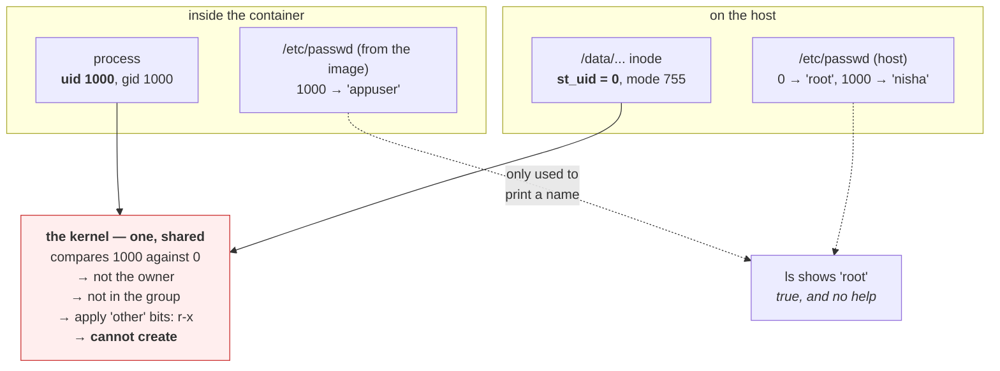

# 2.4 — The container user you will meet on Day 28

## One-line answer

A container does not have its own user database that matters, because the kernel checks numeric user and
group IDs and the names are only a convenience, so the same image running as uid 1000 can write to a
volume on one host and fail on another, for a reason that is invisible from inside the container.

---

## The story

🎬 **The scene.** One company, two office buildings, and the same brand of door-access system in both.
Every card is programmed by number. In both buildings, card number 1000 opens the third floor.

In building A, card 1000 was issued to the cleaning contractor, and the third floor there is a store
room.

In building B, the cards were numbered years earlier by a different office manager, and card 1000 belongs
to the head of finance. The third floor there is the finance department.

😬 **The naive fix.** A team moves from building A to building B, and the office manager reissues
everybody the same card numbers they already had, on the reasonable grounds that those numbers worked
fine.

💥 **Why it fails.** The cleaning contractor's card now opens the finance department. Nobody programmed
anything wrong, and both buildings are behaving exactly as configured. **The number was never the
person.** It was a position in a local list, and it was carried into a building with a different list.

💡 **The insight.** An identifier that only means something relative to a local table stops meaning
anything when it crosses a boundary. **The mistake is not in either table. It is in believing the number
was the identity**, and the failure appears exactly at the seam, which is the one place nobody is
looking.

---

## The idea in plain language

Every file has a numeric owner and a numeric group, which are `st_uid` and `st_gid` from
[1.1](../01-the-filesystem/1.1-a-file-is-an-inode-a-name-is-a-pointer.md). Every process runs with a
numeric uid and a set of numeric gids. **The kernel compares numbers.**

Names such as `nisha`, `pulse` and `root` live in `/etc/passwd` and `/etc/group`, which are ordinary text
files that map numbers to names for the benefit of humans and of `ls`. They are looked up when something
wants to *display* an identity, and never when the kernel is *deciding* one.

### Why this matters the moment containers arrive

A container has its own `/etc/passwd`, which comes from its image. The host has a different one. **The
kernel is shared**, because there is one kernel, and it does the permission check.

So when a container writes to a mounted volume, three things line up.

- Inside the container, the process is uid 1000, which the container's `/etc/passwd` calls `appuser`.
- On the host, the volume's files are owned by uid 1000, which the host's `/etc/passwd` might call
  `nisha`, or might not name at all.
- **The check succeeds**, because 1000 equals 1000, and the names were never involved.

And when the numbers do not line up, four things happen instead.

- The image was built with `USER appuser`, where `appuser` is uid 1000.
- The volume directory on the host is owned by uid 0, which is `root`, with mode `755`.
- The process has `r-x` and cannot create anything, from
  [2.3](2.3-the-permission-that-is-on-the-directory-not-the-file.md).
- From inside the container, `ls -l` shows the owner as `root`, which is true and unhelpful.

**Nothing is misconfigured. Two independently correct decisions produce a failure at the seam.**

### The name that appears when there is no name

If a uid has no entry in the relevant `/etc/passwd`, tools print the number instead.

```
drwxr-xr-x 2 1000 1000 4096 Aug 24 16:40 data
```

**That bare number is a useful signal rather than a broken listing.** It means "this identity is not
known here", which is exactly the situation you are in when a volume written by a container is inspected
on the host, or the other way round. Seeing a name means the number happened to exist in the local table,
and seeing a number means it did not. Neither tells you anything about permissions.

### Why running as root in a container is the default and is wrong

Unless an image says otherwise, the process runs as uid 0, which is root. Inside the container's
namespace that means it can write anywhere, which makes every permission problem disappear, which is why
it is the default and why so much software depends on it.

It is wrong for one reason that matters. **Uid 0 in the container is uid 0 on the host**, unless user
namespaces are in use, which is often not the default. A process that escapes its confinement, whether
through a kernel bug, a misconfigured mount or a shared socket, escapes as root. Running as a non-root
uid removes that, and the cost is precisely the permission problems this part is about.

Day 28 makes that trade deliberately. Today's job is to understand the mechanism, so that day is about
security rather than about confusion.

---

## Why Kriya needs it

Day 23 writes the Dockerfile and chooses whether to add a `USER` instruction. Day 28 makes non-root
mandatory and adds a read-only root filesystem, and every failure that day is a numeric-ownership
mismatch.

Day 25 mounts the first volume, which is where the host and container ownership tables first meet.

Day 30's failure lab includes a container that exits immediately on start, and one of its causes is a
volume the process cannot write.

Day 36 puts `pulse` in Kubernetes with a `securityContext`, using `runAsUser`, `runAsGroup` and
`fsGroup`. Those three fields are numbers, and `fsGroup` exists specifically to solve the mismatch
described here.

Day 58 mounts secrets, where the mounted file's ownership and mode decide which processes in the
container can read a credential.

---

## The mechanism

Look at the two tables, and then at what the kernel actually compares.

```bash
id
id -u
id -G
```

**Line by line:**

- `id` gives the human-readable summary, with names in brackets.
- `id -u` gives **just the numeric user id**, and nothing else. This is the form you use in scripts and
  in container arguments, because it is the thing the kernel uses.
- `id -G` gives every numeric group id this process belongs to, separated by spaces. A process is in all
  of them at once, and the file's group only has to match one.

Observed on **2026-08-24**:

```text
uid=197609(nisha) gid=197121(None) groups=197121(None),4(INTERACTIVE),545(Users)
197609
197121 4 545
```

Now look at the mapping table itself.

```bash
head -3 /etc/passwd 2>/dev/null || echo "no /etc/passwd on this system"
```

**Line by line:** `/etc/passwd` is a plain text file with colon-separated fields, being the name, a
placeholder, the uid, the gid, a description, the home directory and the shell. **Use `head -3` rather
than `cat`**, because on a real server it is long and you only want the shape. The `|| echo` fallback
keeps this readable on Windows, where the file is synthesised rather than stored.

On a Linux server:

```text
root:x:0:0:root:/root:/bin/bash
daemon:x:1:1:daemon:/usr/sbin:/usr/sbin/nologin
bin:x:2:2:bin:/bin:/usr/sbin/nologin
```

**The third field is the uid.** That is the entire mechanism by which `ls` turns `0` into `root`. Delete
this file and permissions keep working perfectly, and only the display breaks.

### Watching a name fail to cross a boundary

You do not need Docker to see the principle. Write a file, and then look at it as a numeric identity.

```bash
cd days/day-005-linux-for-operators-ii/lab
printf 'x\n' > owned.txt
stat -c 'name form:    uid=%U gid=%G' owned.txt
stat -c 'numeric form: uid=%u gid=%g' owned.txt
```

**Line by line:**

- `%U` and `%G` give the **names**, resolved through `/etc/passwd` and `/etc/group` at the moment `stat`
  runs.
- `%u` and `%g` give the **numbers**, which is what is actually stored in the inode.
- Printing both is the point, because the first pair is a rendering of the second pair, and only the
  second pair exists on disk.

```text
name form:    uid=nisha gid=None
numeric form: uid=197609 gid=197121
```

**Only `197609` is in the inode.** `nisha` was produced by a lookup that would give a different answer,
or no answer, on another machine.

### The container case, written out

Day 25 is the first day this is runnable. Today, reason through it precisely, because the reasoning is
what makes that day fast.

```bash
# 🅿️ PARKED until Day 25 — this needs a container runtime, which arrives then.
# Read it now; run it then.
#
# docker run --rm -v "$PWD/vol:/data" --user 1000:1000 alpine:3 sh -c 'id; ls -ldn /data; touch /data/x || echo FAILED'
```

**Line by line:**

- `--rm` removes the container when it exits, so an experiment leaves nothing behind.
- `-v "$PWD/vol:/data"` bind-mounts a host directory into the container at `/data`. **The files keep
  their host ownership**, because mounting does not change any inode.
- `--user 1000:1000` runs as uid 1000 and gid 1000, **numerically**. Note the form, which is numbers
  rather than names, because a name would have to exist in the container's `/etc/passwd` and might mean
  something different there.
- `ls -ldn` uses the `-n`, which is the flag that matters here, because it **prints numeric uid and gid
  instead of names**. Inside a container whose `/etc/passwd` does not know the host's users, names are
  noise and numbers are the truth. [2.3](2.3-the-permission-that-is-on-the-directory-not-the-file.md)
  explains why `-d` is needed.
- `touch /data/x || echo FAILED` is the actual test, with the `||` so that a failure produces a readable
  word rather than only a non-zero exit, as in
  [Day 4, part 3.1](../../../day-004-linux-for-operators-i/parts/03-exit-codes/3.1-the-exit-code-is-the-whole-return-value.md).

Here are the two outcomes, and the arithmetic that produces each.

```text
# host directory owned by uid 1000, mode 755:
uid=1000 gid=1000 groups=1000
drwxr-xr-x 2 1000 1000 4096 Aug 24 16:44 /data
# touch succeeds — 1000 == 1000, owner has w on the directory

# host directory owned by uid 0, mode 755:
uid=1000 gid=1000 groups=1000
drwxr-xr-x 2 0 0 4096 Aug 24 16:44 /data
# FAILED — 1000 != 0, so the "other" bits apply: r-x, no w, cannot create
```

**The same image, the same command and the same user flag. The only difference is a number on the host**,
which is invisible from inside the container until you run `ls -ldn`.



---

## When it breaks

**`Permission denied` on a volume, with `ls` showing an owner that does not exist.** This is the
canonical case.

```text
$ docker run --rm -v pulse-data:/var/lib/pulse --user 1000:1000 pulse:latest
PermissionError: [Errno 13] Permission denied: '/var/lib/pulse/cache.db'
$ docker run --rm -v pulse-data:/var/lib/pulse --user 1000:1000 pulse:latest ls -ldn /var/lib/pulse
drwxr-xr-x 2 0 0 4096 Aug 24 16:50 /var/lib/pulse
```

**What it says:** the directory is owned by uid 0 and the process is uid 1000.

**What it actually means:** Docker creates named volumes owned by root, and the image correctly runs as
non-root. Two right decisions, one failure.

**The smallest fix:** `chown` the directory to the running uid, either in an init step or by creating it
in the image before the volume is mounted. **In Kubernetes the purpose-built answer is `fsGroup` in the
`securityContext`**, which makes the kubelet set group ownership on the volume to that gid, which is
precisely a fix for this mismatch, and Day 36 configures it.

**A uid that has no name, and tools that behave differently because of it.** This is cosmetic until it is
not.

```text
$ ls -l /data
drwxr-xr-x 2 1000 1000 4096 Aug 24 16:52 shared
$ whoami
whoami: cannot find name for user ID 1000
```

**What it says:** the number has no name here.

**What it actually means:** the process is running as a uid with no `/etc/passwd` entry, which is common
when a container is started with `--user` naming a uid the image does not know about. **Permissions work
perfectly**, because names were never involved.

**What it actually breaks:** software that looks itself up. Anything calling `getpwuid()`, which includes
some shells, some SSH tooling and some libraries resolving a home directory, fails or falls back oddly,
so you get errors such as `No user exists for uid 1000` from a program that has nothing to do with
permissions.

**The smallest fix:** add the user to the image, or set `HOME` explicitly. **The diagnosis is that the
error mentions a *name* rather than a permission**, which is the tell that you are in the naming layer
rather than the checking layer.

**Files created inside the container appearing as `root` on the host.** This is the reverse direction.

```text
host $ ls -l ./vol
-rw-r--r-- 1 root root 512 Aug 24 16:55 output.json
host $ rm ./vol/output.json
rm: cannot remove './vol/output.json': Permission denied
```

**What it says:** you cannot delete a file your own container just produced.

**What it actually means:** the container ran as root, which is the default, so it created files as uid 0
on the host. Your unprivileged host user has `r-x` on the directory or lacks write, so by
[2.3](2.3-the-permission-that-is-on-the-directory-not-the-file.md) you cannot remove the entry.

**The smallest fix:** run the container as your own uid, with `--user "$(id -u):$(id -g)"`, so that its
output is owned by you. **This is the single most useful container flag for local development**, and it
is worth adopting from Day 25 rather than after the first time you need `sudo` to delete your own build
output.

**`fsGroup` set and the volume still unwritable.** This is the Kubernetes-specific sequel.

```text
$ kubectl exec pulse-0 -- ls -ldn /var/lib/pulse
drwxrwsr-x 2 0 2000 4096 Aug 24 17:01 /var/lib/pulse
$ kubectl exec pulse-0 -- id
uid=1000 gid=1000 groups=1000,2000
```

**What it says:** group 2000 owns the directory with `rwx` for group, and the process is in group 2000,
so it should work.

**What it actually means:** in this case it does work, and the interesting characters are `drwxrws`,
because the `s` is the **setgid bit** on the directory, which makes new files inside it inherit the
directory's group rather than the creating process's. That is what makes `fsGroup` durable for files
created later, and not only for the ones that existed at mount time.

**Worth knowing because when it does *not* work**, the discriminator is whether `id` inside the container
actually lists the supplementary group. Some volume types do not support ownership changes at all, and
`fsGroup` is silently ignored on those.

---

## In production

**What a professional writes instead of the teaching version.** They pin the numeric uid and gid in the
image, explicitly, and treat those numbers as part of the image's contract, with
`RUN groupadd -g 10001 app && useradd -u 10001 -g 10001 app` followed by `USER 10001:10001`. That is **a
number rather than a name in the `USER` instruction**, because a name is resolved at build time against a
table that may change, and because the orchestrator's `runAsUser` is a number anyway. They then create
and `chown` every directory the process needs to write, **in the image**, so that nothing has to be fixed
at runtime.

**What degrades at scale.** Collisions and drift. Numbers chosen ad hoc, whether 1000 because it is the
first non-system uid or 999 because a package picked it, collide across images that share a volume, or
across a host and its containers. The standard remedy is a deliberate allocation policy, with application
uids in a high, reserved range, documented, and used consistently. **This looks like bureaucracy until
two services sharing a volume both run as 1000 and can read each other's data**, at which point it is an
access control failure that neither service's configuration mentions.

**The failure that only shows with real traffic.** Files created at runtime with the wrong group. A
directory that was `chown`ed correctly at startup is fine for as long as nothing new is created in it.
Then the application writes a new subdirectory, which gets the *process's* primary group rather than the
volume's, and a sidecar or a later container in the same Pod cannot read it. It works for hours, and then
a rotation or a new partition creates the first new directory and something starts failing
intermittently. **The setgid bit on the parent directory is the durable fix**, which is what `fsGroup`
sets and why it exists.

**The review comment a senior engineer leaves.** *"`USER appuser` resolves at build time against the base
image's `/etc/passwd`. When we bump the base image and that uid shifts, every existing volume becomes
unwritable and we will not find out until a pod restarts. Pin the number with `USER 10001:10001`, and
create the user with that explicit uid in the same Dockerfile."*

**The signal you would alert on.** Not uids as a metric. Two checks belong in the deploy pipeline rather
than in monitoring. The first is **any image whose effective user is uid 0**, which should be zero
occurrences and is a policy question that Day 28 formalises and Day 211 enforces with an admission
controller. The second is **any container that fails to start with a permission error on a mounted
path**, which is worth distinguishing from other start failures because the remedy is completely
different. At runtime, the signal that matters is **container restart count with an exit code indicating
a startup failure**, which is Day 30, because the permission detail is in the logs rather than in a
metric.

**Blast radius.** This part introduces nothing runnable today, because the container commands are 🅿️
parked until Day 25. **The capability it prepares you for is choosing which identity a workload runs as**,
and that is one of the highest-consequence choices in the whole platform. The worst case is running as
uid 0, so that a container escape becomes host root, or assigning two workloads the same uid, so that one
can read and modify the other's data on a shared volume with no permission ever being violated. Whoever
writes the Dockerfile or the Pod spec can trigger it. What bounds it is an explicit non-root numeric
`USER` in the image, `runAsNonRoot: true` in the `securityContext` so that the platform refuses to start
a root container at all, and a deliberate uid allocation so that two workloads never share a number.
**Day 28 sets the first two and Day 211 enforces them, and today's contribution is knowing why they are
the right controls.**

**Cost.** `0` model calls, `0` tokens, `0` CI minutes, `0` RAM and `0` disk. Everything in this part is
reading identity, which costs a `stat` and a lookup in a text file. **The cost of getting it wrong is
either an outage at deploy time, in the form of a container that cannot write and will not start, or a
security finding, and the second one has no unit at all.**

**The interview question.** *"Your container writes to a mounted volume fine on your laptop and gets
permission denied in the cluster. Why?"* The answer that lands goes straight to numbers: *"Because the
kernel checks numeric uids and gids, and the names in the container's `/etc/passwd` have nothing to do
with the check. On my laptop the bind-mounted directory happens to be owned by my uid and the container
runs as root or as the same number, so it works. In the cluster the volume is provisioned owned by root
and the pod runs as a non-root uid from the securityContext, so the process falls into the 'other'
category and has `r-x`, meaning it can list and traverse and cannot create. I would confirm with
`ls -ldn` inside the container, because `-n` shows the numbers rather than names that mean nothing there,
and fix it with `fsGroup` or by creating and chowning the directory in the image."* Then comes the detail
that shows experience: *"and I would pin the uid as a number in the Dockerfile rather than a name, so
that a base image bump cannot silently change it and orphan every existing volume."*

---

## Check yourself

```bash
cd days/day-005-linux-for-operators-ii/lab && printf 'x\n' > idprobe && stat -c 'stored in the inode: uid=%u gid=%g   ·   displayed as: %U/%G' idprobe && id -u && rm -f idprobe
```

The numbers in the inode sit next to the names those numbers currently resolve to. **The left-hand pair
is what crosses into a container, and the right-hand pair does not exist there.** Run it once and hold
the distinction, because it is the whole of Day 28's debugging.

**Say out loud, without scrolling up:** *your image runs as uid 1000 and the mounted volume is owned by
uid 0 with mode 755. Walk the kernel's three checks in order, say which one matches, and state exactly
which operation fails and why the file's own permissions are irrelevant.*
