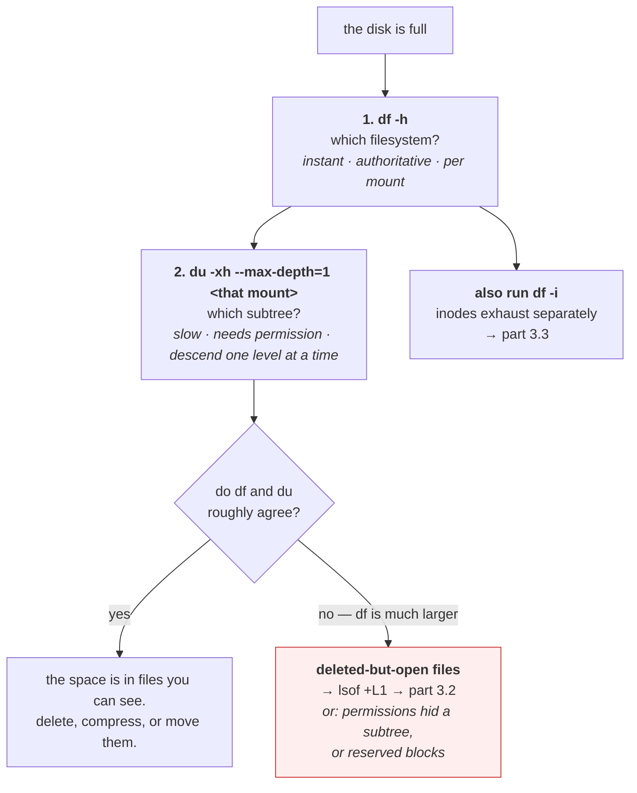

# 3.1 — `df`, `du`, and why they disagree

## One-line answer

`df` asks the filesystem how much space it has allocated and `du` walks directories adding up what it can
see — two different questions with two different answers, and **the size of the gap between them is
itself a diagnosis**.

---

## The story

🎬 **The scene.** A self-storage facility. The manager keeps two records.

The first is her allocation book: 200 units, 187 rented, 13 free. She can tell you this instantly and it
is always right, because it is her own bookkeeping.

The second is what you get if you walk the corridors with a clipboard and note what is in each unit you
can open. That takes an afternoon and gives you a different number — because some units are locked and
you skipped them, some are rented by people storing nothing at all, and one corridor has a padlocked
door you did not have the key for.

😬 **The naive fix.** Somebody notices the numbers disagree and concludes the allocation book is wrong.

💥 **Why it fails.** The book is right. It is answering *"how many units are rented"*. The clipboard is
answering *"how much stuff can I see"*. These are different questions and they were always going to give
different answers. The person who "corrects" the book has destroyed the only reliable record in the
building, in order to match a survey that was never trying to measure the same thing.

💡 **The insight.** When two measurements of "the same thing" disagree, the first move is not to decide
which is wrong. It is to work out **what question each one is actually answering** — because usually both
are correct, and *the difference between them is information you cannot get any other way.*

---

## The idea in plain language

**`df` asks the filesystem.** It reads the filesystem's own accounting — total blocks, blocks used,
blocks free — which the filesystem maintains as it allocates and releases them. It is instant, it covers
everything on that filesystem including things you cannot see, and it is the authority on whether a write
will succeed.

**`du` walks the tree.** It descends through directories, `stat`s every file, and adds up the space each
one occupies. It is slow on large trees, it can only count what you have permission to see, and it tells
you *which subtree* is large — which `df` fundamentally cannot.

| | `df` | `du` |
| --- | --- | --- |
| Asks | the filesystem's accounting | every file it can reach |
| Unit of answer | one filesystem | one directory subtree |
| Speed | instant | proportional to file count |
| Sees files you cannot read | yes | no |
| Sees deleted-but-open files | **yes** | **no** |
| Sees other mounted filesystems | no (per filesystem) | yes, unless you pass `-x` |
| Answers "will my write succeed?" | **yes** | no |
| Answers "what is taking the space?" | no | **yes** |

**You need both, for different questions, and in a fixed order:** `df` first to find *which* filesystem
is full, then `du` on that filesystem to find *what* is filling it.

### The four reasons they disagree

**1. Deleted-but-open files.** The big one, and part
[3.2](3.2-the-deleted-file-that-still-costs-you-a-gigabyte.md) is about nothing else. A file whose name
has been removed but which a process still has open still occupies blocks
([1.1](../01-the-filesystem/1.1-a-file-is-an-inode-a-name-is-a-pointer.md)). `df` counts those blocks;
`du` cannot see the file because it has no name to find. **A large `df`-minus-`du` gap almost always means
this.**

**2. Permissions.** `du` skips what it cannot read
([2.3](../02-permissions/2.3-the-permission-that-is-on-the-directory-not-the-file.md)) and, if you
redirect the errors away, does so silently. Running `du` as an unprivileged user on a system directory
undercounts, sometimes by a lot.

**3. Reserved blocks.** Many filesystems reserve a percentage — traditionally 5% — for the root user, so
that a full disk does not stop an administrator from logging in and fixing it. `df` shows this as used
capacity that is unavailable to you. It is why `Avail` plus `Used` often does not equal `Size`.

**4. Size versus allocation.** A file's `st_size` is how many bytes it logically contains; `st_blocks` is
how many blocks are actually allocated ([1.1](../01-the-filesystem/1.1-a-file-is-an-inode-a-name-is-a-pointer.md)).
These differ in both directions. **Small files round up** to a whole block, so a thousand one-byte files
occupy a thousand blocks, not a thousand bytes. **Sparse files round down** — a file with unwritten holes
reports a large size and occupies almost nothing.

`du` reports allocation by default and `du --apparent-size` reports logical size, which is why the same
command can give two answers depending on a flag most people never pass.

---

## Why Kriya needs it

Day 30's failure lab includes a full disk, and the first move is `df` to identify the filesystem and the
second is `du` to identify the subtree. Doing them in the other order wastes the time you have.

Day 68 sets log retention, and the retention number is arithmetic over the fill rate and the filesystem's
size — both of which come from `df`.

Day 76 builds the first capacity alert, which is a projection: free space now, rate of change, therefore
time until full. **A level alone is not actionable; a level plus a rate is a deadline.**

Day 89 onward writes data artifacts and Day 96 builds a data pipeline, at which point "how much does one
run cost in disk" becomes a real budget question against the 45 GB free that `docs/PACKAGES.md` recorded
on Day 0.

---

## The mechanism

Ask both questions about the same place and compare.

```bash
df -h .
```

**Line by line:** `df` with a path reports only the filesystem containing that path
([1.2](../01-the-filesystem/1.2-paths-mounts-and-the-tree-that-is-not-one-disk.md)), which is almost
always what you want. `-h` for human-readable.

Observed on **2026-08-24**:

```text
Filesystem      Size  Used Avail Use% Mounted on
C:/Program Files/Git  118G   73G   45G  63% /
```

Now `du`, on the repository:

```bash
du -sh .
```

**Line by line:**

- `-s` — **summarise.** Print one total for the whole tree instead of a line per subdirectory. Without
  it, `du` prints every directory it visits, which on a repository with a `.venv` is hundreds of lines.
- `-h` — human-readable, matching `df` so the numbers are comparable at a glance.

```text
412M    .
```

**Two numbers answering two questions.** `73G` used on the filesystem; `412M` in this directory. There is
no contradiction — the filesystem holds far more than this repository.

### The drill-down that finds what is actually large

```bash
du -xh --max-depth=1 . | sort -h | tail -8
```

**Line by line:**

- `-x` — stay on one filesystem. Essential on any tree that might contain a mount point
  ([1.3](../01-the-filesystem/1.3-where-things-belong-on-a-unix-system.md), *When it breaks* — `du /`
  without it can hang on a dead network mount).
- `--max-depth=1` — one level of detail. You want to know which child is big, then descend into that
  one; printing everything at once is unreadable.
- `sort -h` — sorts human-readable sizes correctly, understanding that `2.1G` is larger than `900M`.
  **`sort -n` here would give nonsense**, comparing `2.1` against `900` numerically.
- `tail -8` — the largest few after an ascending sort.

```text
1.2M    ./docs
2.4M    ./.git
8.1M    ./days
399M    ./.venv
412M    .
```

**`.venv` is 97% of this repository**, which is the expected shape and worth knowing before you ever
worry about the size of a checkout. Repeat with `--max-depth=1 ./.venv` to go one level further; that
two-step loop is the whole technique.

### Watching size and allocation disagree

```bash
cd days/day-005-linux-for-operators-ii/lab
printf 'a' > tiny.txt
du -h tiny.txt
du -h --apparent-size tiny.txt
stat -c 'size=%s bytes  blocks=%b  block size=%B' tiny.txt
```

**Line by line:**

- A one-byte file. `printf 'a'` with no `\n` so it is genuinely one byte.
- `du -h` — **allocated** space, which is what actually consumes the filesystem.
- `du -h --apparent-size` — **logical** size, the `st_size` field.
- `stat -c` printing all three raw numbers so the arithmetic is visible rather than asserted. `%b` is
  blocks allocated, `%B` is the size of each in bytes.

```text
4.0K    tiny.txt
1       tiny.txt
size=1 bytes  blocks=8  block size=512
```

**One byte of content occupies 4 KB of disk.** Eight 512-byte units. That is the filesystem's allocation
granularity, and it means **a directory of a million tiny files costs 4 GB regardless of their
contents** — which is exactly the situation that exhausts inodes as well (part
[3.3](3.3-running-out-of-inodes-with-disk-to-spare.md)).

The other direction, a sparse file:

```bash
truncate -s 1G sparse.bin
ls -lh sparse.bin
du -h sparse.bin
du -h --apparent-size sparse.bin
```

**Line by line:**

- `truncate -s 1G` — set the file's *length* to one gigabyte without writing any data. The filesystem
  records the size and allocates nothing, creating a **sparse file** with a hole where the data would be.
- `ls -lh` reports `st_size`, so it will say `1.0G`.
- The two `du` forms then disagree by the entire gigabyte, which is the point.

```text
-rw-r--r-- 1 nisha None 1.0G Aug 24 17:12 sparse.bin
0       sparse.bin
1.0G    sparse.bin
```

**A one-gigabyte file occupying zero blocks.** `ls` says 1 GB, `du` says 0, `df` is unchanged. All three
are correct. **This is why `ls -l` is not a capacity tool** — it reports what the file claims, not what it
costs.

```bash
rm -f sparse.bin tiny.txt
```

**Line by line:** clean up both probes. `-f` so a missing file is not an error, which keeps this safe to
re-run.



---

## When it breaks

**`df` says 100% and `du` says half that.** The gap that means something:

```text
$ df -h /var
Filesystem      Size  Used Avail Use% Mounted on
/dev/sda2        20G   20G     0 100% /var
$ du -shx /var
9.4G    /var
```

**What it says:** the filesystem is full with 20 GB used, and the files in it total 9.4 GB.
**What it actually means:** roughly 10 GB is held by something `du` cannot see. In order of likelihood:
deleted-but-open files (part [3.2](3.2-the-deleted-file-that-still-costs-you-a-gigabyte.md)), a subtree
your user cannot read, or a filesystem mounted *underneath* `/var` that `-x` correctly excluded from `du`
and `df` correctly included.
**The smallest fix — check the likely cause first:**

```bash
lsof +L1 2>/dev/null | head
```

**Line by line:** `lsof` lists open files; `+L1` restricts it to files whose **link count is less than 1**
— that is, files with no remaining name that are still open. This is the exact definition of the
deleted-but-open case, and it is one flag.

**`du: cannot read directory ...: Permission denied`, and the total is wrong.** The silent undercount:

```text
$ du -shx /var
du: cannot read directory '/var/lib/private': Permission denied
du: cannot read directory '/var/spool/cron': Permission denied
9.4G    /var
```

**What it says:** two directories were skipped, and here is a total.
**What it actually means:** the total excludes those directories entirely. **If you had redirected stderr
to `/dev/null` — as most people do, because the errors are noisy — you would have the same wrong number
with no indication.**
**The smallest fix:** run it with elevated privileges when you need an accurate total, or read the errors
rather than hiding them. **The general lesson:** `2>/dev/null` on a measurement command trades noise for
silent inaccuracy, and it is worth doing knowingly rather than reflexively.

**`Avail` plus `Used` does not equal `Size`.** Reserved blocks, and it looks like arithmetic failure:

```text
$ df -h /
Filesystem      Size  Used Avail Use% Mounted on
/dev/sda1        20G   18G  1.1G  95% /
```

**What it says:** 18 + 1.1 is 19.1, not 20.
**What it actually means:** about 1 GB — 5% — is reserved for the root user. An unprivileged process will
get `No space left on device` while `df` still shows `1.1G` available *and* while a root process can
still write. **The `Use%` column already accounts for this**, which is why it says 95% rather than 90%.
**The smallest fix in an emergency:** `tune2fs -m 1 /dev/sda1` reduces the reservation — but understand
what you are giving up, which is the administrator's ability to log in and fix a full disk.

**`du` on a directory with millions of files that never finishes.** A diagnostic that becomes the problem:

```text
$ du -shx /var/lib/app/cache
^C
```

**What it says:** nothing, for a long time.
**What it actually means:** `du` `stat`s every file, so its cost is proportional to file *count*, not to
bytes. A cache with several million small entries takes a very long time and generates heavy I/O on a
filesystem that is already struggling.
**The smallest fix:** count first, cheaply, before measuring:

```bash
find /var/lib/app/cache -maxdepth 1 -type d | head -20
```

**Line by line:** `-maxdepth 1` looks at one level only and `-type d` lists just directories, so this
returns quickly and tells you the shape — whether the cache is sharded into subdirectories you can sample,
or is one flat directory with millions of entries, which is itself the finding
([1.3](../01-the-filesystem/1.3-where-things-belong-on-a-unix-system.md), *What degrades at scale*).

---

## In production

**What a professional writes instead of the teaching version.** They automate the first step and keep the
second manual. `df` output per filesystem is a metric, collected continuously, alerted on with a
projection. `du` stays an interactive diagnostic, because it is expensive and because the question it
answers — *what is filling this?* — is one a human asks during an incident, not one a machine should ask
every minute. **Running `du` from a monitoring agent on a large filesystem is a way to cause the I/O
problem you were trying to detect.**

**What degrades at scale.** `du`'s cost, and `df`'s coverage. `du` becomes unusable on filesystems with
tens of millions of files exactly when you most need it, which is why filesystems that are expected to get
large — container storage, object caches — are given quotas and their own mount rather than being measured
after the fact. `df` scales fine but its per-filesystem nature means a host with dozens of mounts needs
per-mount metrics with the mount point as a label
([1.2](../01-the-filesystem/1.2-paths-mounts-and-the-tree-that-is-not-one-disk.md), *In production*),
which is exactly the shape Day 62's node exporter produces.

**The failure that only shows with real traffic.** The gap opening slowly. A service that rotates its log
by deleting the file rather than signalling the writer (part
[4.4](../04-logs-that-rotate/4.4-the-rotation-that-did-not-free-anything.md)) creates a deleted-but-open
file every rotation. Under low traffic the file is small and the gap is negligible. Under real traffic
each one is gigabytes, and `df` climbs while `du` stays flat — so **a dashboard built on `du` shows a
perfectly healthy disk right up to the moment writes start failing.** This is the single strongest
argument for `df` being the metric and `du` being the diagnostic.

**The review comment a senior engineer leaves.** *"The disk-usage metric is computed by shelling out to
`du -s` on the data directory every minute. On the production nodes that directory has four million
files, so we are doing a full tree walk sixty times an hour and it is showing up in the I/O latency. Use
the filesystem statistics — `statvfs` or the node exporter — which is what `df` reads and costs one system
call."*

**The signal you would alert on.** **Free space per filesystem, plus its rate of change**, alerting on
*projected time to full* rather than on a fixed percentage. The reason is in the arithmetic: 10% free on a
20 GB root is 2 GB and might be weeks of runway; 10% free on a filesystem taking 30 GB of logs a day is
under an hour. A projection collapses both into one comparable number — "this one fills before lunch and
that one fills next month" — which
is the thing a human can act on. Alert also on **the `df`-minus-`du` gap** if you can compute it cheaply,
because a growing gap is the deleted-but-open signature and nothing else looks like it. You would **not**
alert on `du` output directly, both because it is expensive and because a subtree growing is often
completely normal.

**Blast radius.** `df` and `du` are read-only and cannot damage anything directly. **The blast radius is
in what you do next**, and it is real: the standard response to a full disk is deleting files under time
pressure, at three in the morning, as root. Worst case: deleting the wrong thing — a database's write-ahead
log, the only copy of an artifact, a file a running process depends on — and turning a capacity incident
into a data-loss incident. Who can trigger it: whoever is holding the pager. What bounds it: **finding the
space before deleting anything, and deleting the largest single thing you are certain about rather than
many things you are not**. `du --max-depth=1` descending one level at a time is the discipline, because it
produces a small number of large candidates instead of a long list of small ones.

**Cost.** `0` model calls, `0` tokens, `0` CI minutes, `0` RAM to speak of. **`df` costs one system call
and is free. `du` costs one `stat` per file** — on a tree with a million files that is a million system
calls and real I/O, which is why it belongs in an interactive session and not in a loop. Disk: the sparse
file above costs nothing at all, which is the entire point of that demonstration.

**The interview question.** *"`df` says the disk is full and `du` says it is half empty. What is going
on?"* The answer that lands names the mechanism and the command: *"They are answering different questions.
`df` reads the filesystem's own block accounting; `du` walks the directory tree and adds up files it can
see. The usual cause of a big gap is a deleted-but-open file — something unlinked the file so it has no
name for `du` to find, but a process still holds the descriptor, so the blocks are not freed and `df`
still counts them. `lsof +L1` lists exactly those. The other possibilities are `du` silently skipping
directories it lacks permission to read, a filesystem mounted below the path that `du -x` excluded, and
the 5% reserved for root. I would check the deleted-but-open case first because it is both the most common
and the one with an instant fix — signal or restart the process holding the descriptor."*

---

## Check yourself

```bash
df -h . && du -shx . && echo "--- largest children ---" && du -xh --max-depth=1 . 2>/dev/null | sort -h | tail -5
```

The filesystem's answer, this tree's answer, and where this tree's space actually is — the three commands
in the order you would run them in an incident. **Note whether `df`'s `Used` is far larger than `du`'s
total**; on your laptop it will be, legitimately, because the filesystem holds everything else on the
machine as well. The gap only means something when you have pointed both at the same filesystem's root.

**Say out loud, without scrolling up:** *name the four reasons `df` and `du` can disagree, and say which
one you would check first and with which single command.*
