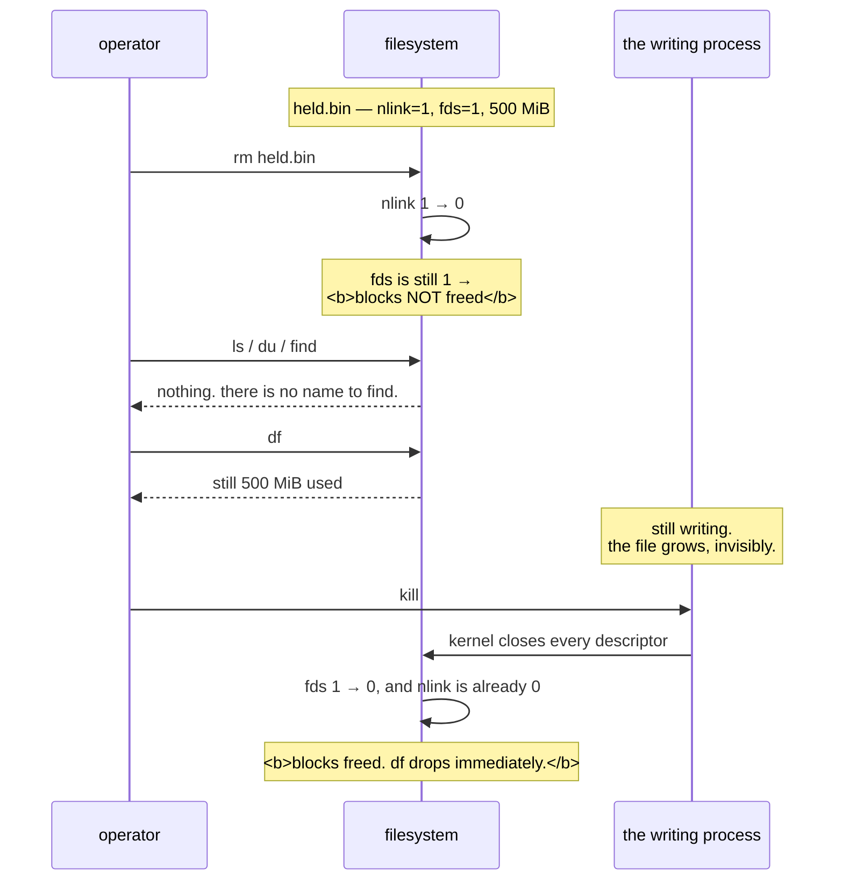

# 3.2 — The deleted file that still costs you a gigabyte

## One-line answer

This is today's first deliberate failure: delete a large file that a process still has open, watch the
disk stay full, and discover that the only way to reclaim the space is to act on the *process*, because
the file is not gone, it is merely nameless.

---

## The story

🎬 **The scene.** A school library. Every book has a record in the lending system, and the rule is that a
book which is out on loan cannot be removed from the system.

A librarian, tidying up the shelves, decides that one particular book is out of date and deletes its
record anyway. As far as the system is concerned, the book does not exist.

😬 **The naive fix.** She marks its shelf space as free and tells the head of department there is room
for something new.

💥 **Why it fails.** The book is in a student's bag. He is halfway through it and will bring it back in
three weeks, and when he does, he will put it back on the shelf he took it from, which is the shelf that
has now been promised to something else. Meanwhile the department has been told there is space that is
not there, and nobody can explain the difference, because the system is *definite* that the book does not
exist.

**And the shelf was never free.** The gap between the system and the building opened the moment the
record was deleted, and it stays open until the student is finished.

💡 **The insight.** Removing the record of a thing is not removing the thing. **The thing goes away when
the last person using it lets go**, and until then you have a resource that is occupied, invisible to
your inventory, and impossible to account for by looking at the inventory harder.

---

## The idea in plain language

Part [1.1](../01-the-filesystem/1.1-a-file-is-an-inode-a-name-is-a-pointer.md) quoted the rule, and this
part is what happens when the second half of it is false.

Verbatim, from `man7.org/linux/man-pages/man2/unlink.2.html`, verified **2026-08-24**:

> *"unlink() deletes a name from the filesystem. If that name was the last link to a file and no
> processes have the file open, the file is deleted and the space it was using is made available for
> reuse. If the name was the last link to a file but any processes still have the file open, the file
> will remain in existence until the last file descriptor referring to it is closed."*

So the space is reclaimed when **both** counts reach zero. Those are `st_nlink`, which is how many
directory entries point at this inode, and the kernel's count of **open file descriptors** referring to
it.

`rm` decrements the first. It has no effect whatsoever on the second.

### What the resulting object is like

A file with zero names and one open descriptor is a real, complete file with all of its data, and it
behaves like this.

- **`ls` cannot show it.** There is no name to list.
- **`du` cannot count it**, because `du` walks names, from [3.1](3.1-df-du-and-why-they-disagree.md).
- **`find` cannot find it**, for the same reason.
- **`df` counts it fully**, because the filesystem's block accounting is about blocks rather than names.
- **The holding process can still read and write it normally.** Its descriptor is unaffected, and from
  the process's point of view nothing happened at all.
- **It disappears the instant the last descriptor closes**, which usually means when the process exits.

**This is why `df` and `du` disagree**, and the size of the disagreement is the size of the problem.

### Why this happens constantly rather than rarely

It is not an exotic condition. It is the normal result of the most obvious way to deal with a log file
that has grown too large.

```
somebody notices /var/log/app.log is 40 GB
somebody runs: rm /var/log/app.log
the disk does not change
```

The application has that file open and is still writing to it. It will keep writing to it, into an inode
with no name, for as long as it runs. **The disk gets worse rather than better**, because the writing
continues and now nothing can even see the file.

Log rotation exists partly to make this correct, and part
[4.4](../04-logs-that-rotate/4.4-the-rotation-that-did-not-free-anything.md) is the same failure arriving
through a rotation tool that was configured wrongly.

### The two ways out, and why one of them is not "delete it again"

**Close the descriptor.** Restart the process, or signal it to reopen its files, and
[Day 4, part 2.1](../../../day-004-linux-for-operators-i/parts/02-signals/2.1-what-a-signal-actually-is.md)
notes that `SIGHUP` is the conventional "reopen" signal. The kernel frees the blocks immediately.

**Truncate through the descriptor.** If you cannot restart, you can empty the file in place by writing to
its `/proc/<pid>/fd/<n>` entry. The space comes back and the process keeps its descriptor, though it will
be writing at whatever offset it had reached, leaving a sparse gap, from
[3.1](3.1-df-du-and-why-they-disagree.md). This is the emergency move rather than the routine one.

There is no third option that involves the filesystem. **You cannot delete something that is already
deleted**, and no amount of `rm` on a nonexistent name will help.

---

## Why Kriya needs it

Day 30's container failure lab includes a full disk, and this is one of the shapes it takes, with the
extra twist that inside a container `lsof` is often not installed, so the diagnosis has to come from
`/proc` directly.

Day 68 configures log rotation for `pulse`. The whole design of `copytruncate` against a `postrotate`
signal, in part [4.3](../04-logs-that-rotate/4.3-copytruncate-and-the-lines-you-lose.md), is a response
to exactly this mechanism.

Day 76 builds a capacity alert. An alert on usage derived from `du` would be blind to this failure
entirely, which is the strongest possible argument for the `df` metric.

Day 84's incident lab gives you a symptom with no cause. "The disk is full and I deleted everything I
could find" is one of the scenarios, and it is unsolvable without this part.

---

## The mechanism

**This is a deliberate failure. Read the whole procedure before you start**, including the cleanup, and
do it in this day's `lab/` where nothing matters.

Write a program that holds a file open and keeps writing to it.

```python
# days/day-005-linux-for-operators-ii/lab/holder.py
"""Open a file, write to it forever, and never close it. The point is the descriptor."""

import os
import sys
import time
from pathlib import Path

target = Path(sys.argv[1] if len(sys.argv) > 1 else "held.bin")
chunk = b"x" * (1024 * 1024)  # one mebibyte

with target.open("wb") as fh:
    print(f"[holder] pid={os.getpid()} fd={fh.fileno()} writing to {target}", flush=True)
    written = 0
    while written < 500:
        fh.write(chunk)
        fh.flush()
        written += 1
    print(
        f"[holder] wrote {written} MiB; holding the descriptor open. Ctrl-C or kill to release.",
        flush=True,
    )
    while True:
        time.sleep(1)
```

**Line by line:**

- `sys.argv[1] if len(sys.argv) > 1 else "held.bin"` gives an optional path argument with a default, so
  that the script is usable twice without editing.
- `b"x" * (1024 * 1024)` is one mebibyte of a single repeated byte. **It is not zeros**, deliberately,
  because a filesystem may store a run of zeros sparsely, from
  [3.1](3.1-df-du-and-why-they-disagree.md), and the file would then cost far less disk than its size
  claims, which would ruin the demonstration.
- `with target.open("wb")` uses a context manager that holds the descriptor for the whole block. **The
  descriptor is the subject of this part**, and `with` is what keeps it open.
- `fh.fileno()` gives the numeric descriptor within this process. Printing it means you can find it under
  `/proc/<pid>/fd/` later without guessing.
- `fh.flush()` after each write pushes Python's buffer into the kernel each time, so that the file's size
  on disk grows steadily rather than in one jump at the end. Without it, `df` would not move until the
  buffer filled.
- `while written < 500` gives 500 MiB, which is large enough to be unambiguous in `df -h` and small
  enough to be safe against the 45 GB free recorded in `docs/PACKAGES.md` on Day 0. **Check your own free
  space before running this.**
- The final `while True: time.sleep(1)` stays alive holding the descriptor. This is the entire point,
  because a program that exited would release the file and there would be nothing to see.

Run it, and watch the disk from another terminal.

```bash
cd days/day-005-linux-for-operators-ii/lab
df -h . | tail -1
uv run python holder.py held.bin &
HOLDER=$!
sleep 8
df -h . | tail -1
du -sh held.bin
```

**Line by line:**

- `df -h . | tail -1` **before** anything is the baseline. Without a before-reading, the after-reading
  means nothing.
- Background it and capture the PID immediately, as in
  [Day 4, part 1.2](../../../day-004-linux-for-operators-i/parts/01-the-process/1.2-pid-parent-and-the-process-tree.md).
- `sleep 8` lets it finish writing 500 MiB.
- Then run `df` and `du` on the same thing, which currently agree.

Observed on **2026-08-24**:

```text
C:/Program Files/Git  118G   73G   45G  63% /
[holder] pid=35120 fd=3 writing to held.bin
[holder] wrote 500 MiB; holding the descriptor open. Ctrl-C or kill to release.
C:/Program Files/Git  118G   74G   44G  63% /
500M    held.bin
```

**Used went from 73G to 74G, and available from 45G to 44G.** `du` sees 500 MiB. Everything is
consistent.

### The failure

```bash
rm held.bin
ls -l held.bin
df -h . | tail -1
du -sh . 2>/dev/null
```

**Line by line:**

- `rm` is the deliberate mistake, and it is the exact thing a tired operator does at three in the
  morning.
- `ls -l` on the deleted name confirms that it really is gone from the directory, so the failure is not
  "the delete did not work".
- `df` and `du` follow immediately, in that order, so that the disagreement is visible in one screen.

```text
ls: cannot access 'held.bin': No such file or directory
C:/Program Files/Git  118G   74G   44G  63% /
1.2M    .
```

**The file is gone and the disk has not moved.** `ls` cannot find it. `du` on the whole directory now
reports 1.2 MiB, because it cannot see 500 MiB of data that is definitely still there. `df` is unchanged
from before the delete.

**You have just made 500 MiB invisible and unreclaimable.** Nothing you can do with `rm`, `find` or `du`
will help, because all three work through names and there is no name.

### Finding it

```bash
lsof +L1 2>/dev/null | head -5 || echo "lsof not available — use the /proc method below"
```

**Line by line:** `+L1` restricts `lsof` to files whose link count is **less than 1**, which is precisely
the deleted-but-open condition. One flag, and it is the whole diagnosis.

On a Linux server:

```text
COMMAND   PID  USER   FD   TYPE DEVICE  SIZE/OFF NLINK    NODE NAME
python  35120 nisha    3w   REG  253,1 524288000     0 1179654 /lab/held.bin (deleted)
```

**Read the two columns that matter.** `NLINK 0` means no names point at this inode. `SIZE/OFF 524288000`
is half a gigabyte, still allocated. And the `(deleted)` marker on the path is `lsof` telling you that
the name it is showing you no longer exists.

`lsof` is frequently absent, especially inside containers. **The method that always works**, because it
uses only `/proc`, is this.

```bash
ls -l /proc/"$HOLDER"/fd/ 2>/dev/null || echo "no /proc on this system (Windows) — see the note below"
```

**Line by line:** `/proc/<pid>/fd/` is a directory of symbolic links, one per open descriptor, each
pointing at what that descriptor refers to, and
[1.2](../01-the-filesystem/1.2-paths-mounts-and-the-tree-that-is-not-one-disk.md) established that
`/proc` is the kernel answering rather than storage. Listing it with `-l` shows the targets.

```text
lrwx------ 1 nisha nisha 64 Aug 24 17:40 0 -> /dev/pts/2
lrwx------ 1 nisha nisha 64 Aug 24 17:40 1 -> /dev/pts/2
lrwx------ 1 nisha nisha 64 Aug 24 17:40 2 -> /dev/pts/2
l-wx------ 1 nisha nisha 64 Aug 24 17:40 3 -> /lab/held.bin (deleted)
```

**Descriptor 3, which is the number the program printed at startup, points at a deleted file.** That
single line is the complete diagnosis: this process, this descriptor, this much space.

⚠️ **On this Windows machine there is no `/proc/<pid>/fd` and `lsof` is not installed.** Git Bash's
`/proc` is partial. **Run this section inside WSL2 from Day 21, or read it now and reproduce it then**,
and note in `docs/INCIDENTS.md` that the diagnosis step is not available on your primary machine, because
that is a genuine operational limitation worth recording rather than glossing over.

### Reclaiming it

```bash
kill "$HOLDER"
wait "$HOLDER" 2>/dev/null
df -h . | tail -1
```

**Line by line:** `kill` sends `SIGTERM`, from
[Day 4, part 2.2](../../../day-004-linux-for-operators-i/parts/02-signals/2.2-sigterm-and-sigkill-the-request-and-the-order.md),
the process exits, and **every descriptor a process holds is closed by the kernel when it exits**, which
is what releases the file. `wait` collects it so that the shell does not print a job message over your
`df` output.

```text
C:/Program Files/Git  118G   73G   45G  63% /
```

**Back to 73G and 45G available, instantly.** No filesystem command reclaimed that space, and ending a
process did.



---

## When it breaks

**The disk that got worse after you cleaned it up.** This is the failure this part exists for, in its
natural form.

```text
$ df -h /var
Filesystem      Size  Used Avail Use% Mounted on
/dev/sda2        50G   47G  600M  95% /var
$ ls -lh /var/log/app.log
-rw-r--r-- 1 app app 31G Aug 24 03:12 /var/log/app.log
$ rm /var/log/app.log
$ df -h /var
Filesystem      Size  Used Avail Use% Mounted on
/dev/sda2        50G   47G  600M  95% /var
```

And twenty minutes later:

```text
$ df -h /var
Filesystem      Size  Used Avail Use% Mounted on
/dev/sda2        50G   50G     0 100% /var
```

**What it says:** the delete freed nothing and the disk then filled completely.

**What it actually means:** the application still holds the descriptor and is still writing at its
previous offset. **You have removed your ability to see the file, monitor it or rotate it, and it is
still growing.** The situation is strictly worse than before you deleted it.

**The smallest fix:** run `lsof +L1` to confirm, and then restart the process or signal it to reopen.
**The lesson, which is worth more than the fix**, is that you should never `rm` an active log file.
Truncate it instead, with `: > /var/log/app.log`, which empties it in place and leaves the descriptor and
the name intact.

**`lsof: command not found` inside a container.** This is the diagnosis you cannot run.

```text
$ docker exec pulse lsof +L1
OCI runtime exec failed: exec failed: unable to start container process: exec: "lsof": executable file not found in $PATH
```

**What it says:** `lsof` is not in the image.

**What it actually means:** minimal images contain the application and nothing else, which is correct
practice, from Day 24, and inconvenient exactly now.

**The smallest fix** is to use `/proc`, which is always there.

```bash
docker exec pulse sh -c 'ls -l /proc/1/fd/ | grep deleted'
```

**Line by line:** PID 1 inside a container is the application, from
[Day 4, part 4.3](../../../day-004-linux-for-operators-i/parts/04-the-service-died/4.3-zombies-orphans-and-pid-1.md),
so `/proc/1/fd` is where its descriptors are. `grep deleted` filters to exactly the ones whose targets no
longer exist. **No tools are required beyond `ls` and `grep`**, which even a minimal image has.

**Truncating through `/proc` when you cannot restart.** This is the emergency move, and it has a cost.

```bash
: > /proc/35120/fd/3
```

**Line by line:** `:` is the shell's no-op builtin, which produces no output, and `>` truncates the target
to zero length. Together they empty a file without running any external command. **Pointed at
`/proc/<pid>/fd/<n>`, it truncates the file *through the descriptor***, reaching an inode that has no name
at all.

```text
$ df -h /var
Filesystem      Size  Used Avail Use% Mounted on
/dev/sda2        50G   19G   29G  40% /var
```

**The space comes back immediately and the process never notices.** The cost is that the process's write
offset is unchanged, so its next write lands at byte 31 billion and the file becomes sparse, from
[3.1](3.1-df-du-and-why-they-disagree.md), reporting an enormous size while occupying almost nothing.
**That is confusing to whoever looks next**, so record it. This is a genuine three-in-the-morning tool
and it leaves evidence that needs explaining.

**The gap that comes back every night at the same time.** This is the slow version.

```text
$ df -h /var; du -shx /var
/dev/sda2        50G   38G   12G  76% /var
14G     /var
```

**What it says:** there is a persistent 24 GB gap between the two.

**What it actually means:** something rotates logs by deleting rather than by truncating or signalling,
so every rotation leaves another orphaned descriptor. The gap grows by one day's logs every day and
resets only when the service restarts. **Nothing alerts**, because usage is still under threshold, until
one day it is not, and then it is not recoverable by deleting anything.

**The smallest fix** is part
[4.4](../04-logs-that-rotate/4.4-the-rotation-that-did-not-free-anything.md), which is this failure
arriving through a misconfigured rotation tool.

---

## In production

**What a professional writes instead of the teaching version.** They never delete a file a process is
writing to. The operations they use on an active log are **truncate in place**, with `: > file` or
`truncate -s 0 file`, which keeps both the name and the descriptor valid, and **rotate then signal**,
which renames the file and tells the process to reopen. The rename is safe because the process's
descriptor follows the inode, and the signal is what makes it let go, as
[4.2](../04-logs-that-rotate/4.2-rotation-the-mechanism.md) shows. `rm` on an active log is treated the
way you would treat pulling a disk out of a running array.

**What degrades at scale.** Detectability. On one host you can run `lsof +L1` and read the answer. Across
a fleet, nobody is running `lsof` anywhere, and the condition is invisible to every metric except the gap
between `df` and `du`, which almost nobody computes because `du` is too expensive to run continuously,
from [3.1](3.1-df-du-and-why-they-disagree.md)'s *In production*. **So the usual way this is discovered at
scale is a disk-full incident**, at which point it has already caused an outage. Teams that have been
bitten add a cheap periodic check for open-deleted files and alert on the aggregate size.

**The failure that only shows with real traffic.** The size. At development traffic a log file is
megabytes and an orphaned descriptor is a curiosity. At real traffic it is gigabytes an hour, so a single
mistaken `rm` during an incident converts "the disk is 90% full" into "the disk will be 100% full in
forty minutes and I have removed my ability to see why". **The failure mode scales with your traffic, and
the error is made under exactly the pressure that traffic creates.**

**The review comment a senior engineer leaves.** *"The cleanup script does `find /var/log -name '*.log'
-mtime +7 -delete`. Any of those files that a long-running process still has open will not free a byte,
and we will have lost the name so nothing can rotate or read it afterwards. Use `truncate -s 0` for
active files, and only delete files that have already been rotated out."*

**The signal you would alert on.** **The total size of open-deleted files**, gathered periodically from
`lsof +L1` or by walking `/proc/*/fd` and checking for missing targets. It should be near zero on a
healthy host, and any sustained non-trivial value is a defect, either a bad cleanup script or a rotation
that is not signalling. This is one of the rare signals where you can alert on "greater than a small
absolute number" rather than on a percentage, because the correct value is essentially zero. Secondarily,
alert on **the gap between `df` and `du`** if you compute it, since it is the same phenomenon seen from
the filesystem's side. You would **not** alert on `rm` invocations, which are normal and constant.

**Blast radius.** This part deliberately consumes half a gigabyte of disk and then makes it
unreclaimable by normal means. The worst case on this machine is 500 MiB held until you kill the process,
which against 45 GB free is harmless, **but the same procedure on a filesystem near its limit fills it,
and a full filesystem is a machine where you cannot write a log, save a file, or in some cases log in**.
Anyone who can write and delete can trigger it. What bounds it today is that the 500 MiB is a constant in
the script and the free space was checked before running it. **What bounds it in production is the rule
that `rm` is never the right command for an active file**, plus the knowledge that killing the holder is
always available as the recovery, which is why the mechanism above ends with that step rather than
leaving it to you.

**Cost.** `0` model calls, `0` tokens, `0` CI minutes and `0` RAM. **On disk it is 500 MiB, temporarily,
and deliberately held after deletion**, which is the largest and most pointed disk cost in this curriculum
so far. It returns the moment the holder process ends, and confirming that return is the last step of the
mechanism rather than an afterthought.

**The interview question.** *"You deleted a 30 GB log file and `df` still shows the disk full. What
happened and what do you do?"* The answer that lands states both conditions: *"`unlink` only frees blocks
when the link count reaches zero **and** no process still has the file open. The application holds a
descriptor to its log, so removing the name did nothing to the space, and worse, it is still writing to
it, so the disk keeps filling and there is no longer a name to rotate or truncate. I would confirm with
`lsof +L1`, or with `ls -l /proc/<pid>/fd | grep deleted` if `lsof` is not installed, which is normal
inside a container. The fix is to close the descriptor, by restarting the process or sending it the
reopen signal, or, if I cannot restart, to truncate through `/proc/<pid>/fd/<n>`, which frees the blocks
immediately at the cost of leaving a sparse file. And the real fix is not to `rm` active logs at all, but
to truncate in place, or rotate and signal."*

---

## Check yourself

```bash
cd days/day-005-linux-for-operators-ii/lab && df -h . | tail -1 && uv run python holder.py probe.bin & sleep 8; df -h . | tail -1; rm -f probe.bin; df -h . | tail -1; pkill -f 'holder.py probe.bin'; sleep 1; df -h . | tail -1
```

Four `df` readings: before, after writing, after deleting, and after killing the holder. **The third and
fourth are the lesson**, because the delete changes nothing and the kill changes everything. Run
`pgrep -af holder.py` first if you want to see exactly what `pkill` will match, which is the discipline
from
[Day 4, part 2.2](../../../day-004-linux-for-operators-i/parts/02-signals/2.2-sigterm-and-sigkill-the-request-and-the-order.md).

**Say out loud, without scrolling up:** *state the two counters that both have to reach zero before disk
space is reclaimed, say which command decrements each, and name the one command that will find a file
with no name.*
