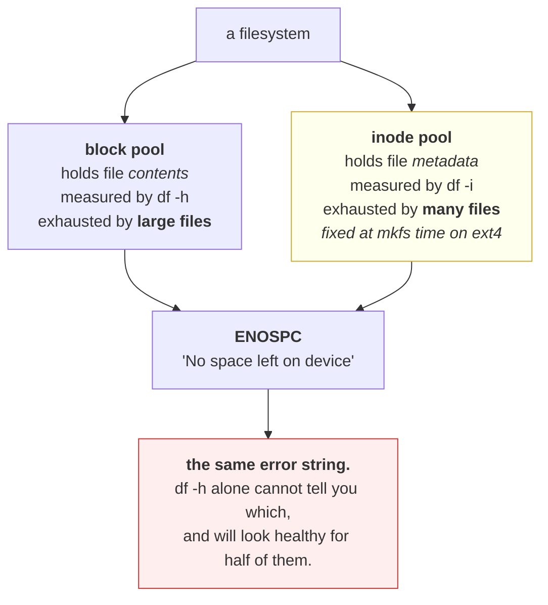

# 3.3 — Running out of inodes with disk to spare

## One-line answer

A filesystem has two separate finite resources, which are blocks for data and inodes for files, and
exhausting either one produces the identical error, so `No space left on device` with 80% of the disk
free is a real and routine failure that `df -h` cannot see.

---

## The story

🎬 **The scene.** The coat check at a theatre. Behind the counter there is a long rail with plenty of
room, and a box of numbered tickets on the desk. Two hundred tickets, printed at the start of the season.

It is a busy night. Coats come in. The rail is barely a third full.

The attendant reaches into the box and it is empty.

😬 **The naive fix.** The manager, told that the coat check is full, walks past, sees a mostly empty rail,
and tells the attendant to keep taking coats.

💥 **Why it fails.** A coat without a ticket is a coat nobody can claim. The attendant is not being
difficult, and the limit that has been reached is simply not the one anybody was looking at. **The rail
has room and the *system* does not**, and the manager's inspection measured the wrong thing while
appearing to measure the right one.

💡 **The insight.** A system usually has more than one finite resource, and it fails when the **first**
one runs out, which is not always the one you have a gauge for. **Measuring the obvious resource and
declaring capacity is how you get a confident answer that is wrong**, and the tell is that the reported
symptom and the observed capacity do not match.

---

## The idea in plain language

Every file needs an inode, from
[1.1](../01-the-filesystem/1.1-a-file-is-an-inode-a-name-is-a-pointer.md). The inode holds the metadata
and the data blocks hold the contents. **They are allocated from two separate pools.**

On the traditional Linux filesystems, meaning `ext4` and its relatives, the number of inodes is fixed
**when the filesystem is created** and cannot be increased afterwards. The default is roughly one inode
per 16 kibibytes of capacity, which is a bet that the average file on this filesystem will be at least 16
KiB.

When that bet is wrong, you run out of inodes long before you run out of blocks.

| Scenario | Blocks used | Inodes used | Which runs out |
| --- | --- | --- | --- |
| a few large database files | high | trivial | blocks |
| a few million session files of 200 bytes | trivial | **all of them** | **inodes** |
| a mail spool, one file per message | moderate | high | usually inodes |
| a build cache with millions of small objects | moderate | high | usually inodes |

**Both exhaustions produce exactly the same error**, which is `ENOSPC`, printed as `No space left on
device`. The kernel has one error code for "I cannot create that", and it does not distinguish which pool
was empty.

### Why this is not a rare curiosity

Look at the right-hand column of that table. Session files, cached objects, per-message files and
per-request temporary files that were not cleaned up, from
[1.3](../01-the-filesystem/1.3-where-things-belong-on-a-unix-system.md)'s *The failure that only shows
with real traffic*, are all ordinary application patterns, and every one of them consumes inodes far
faster than blocks.

**And a directory is a file too**, so a program that creates a deep tree of small directories consumes
inodes for the directories as well as for the contents.

### The filesystems that do not have this problem

Not all of them pre-allocate. `XFS` and `Btrfs` allocate inodes dynamically as needed, so they cannot
exhaust an inode pool in this way, and they run out of space once, for both reasons at the same time.

**This matters because it changes what you monitor**, and you do not get to assume. `df -Ti` tells you
both the type and the inode situation in one command, which is why that is the form worth typing.

---

## Why Kriya needs it

Day 30's failure lab includes a full disk, and inode exhaustion is one of the two forms it takes, being
the one where `df -h` looks healthy and the error is real.

Day 22 is about container image layers, and an image is thousands of small files. A node running many
containers accumulates enormous numbers of files under the container storage directory, which is one of
the classic real-world inode exhaustions.

Day 42 sets ephemeral storage limits in Kubernetes. Those limits are in bytes, so **they do not protect
against inode exhaustion at all**, because a pod writing millions of tiny files stays under its byte
limit and takes the node's inodes with it. Knowing that gap exists is the point.

Day 96 builds a data pipeline that writes partitioned output. "One file per partition per run" is a
design that consumes inodes linearly with runs, and it is worth costing before Day 96 rather than after.

---

## The mechanism

Look at both pools for the same filesystem.

```bash
df -h .
df -i .
```

**Line by line:**

- `df -h` shows **blocks**, which is the familiar view.
- `df -i` shows **inodes**, from the same command on the same filesystem, for a different resource. Note
  that `-i` and `-h` do not combine usefully, because inode counts are plain numbers and human-readable
  formatting of them is confusing.
- **Running both together is the habit worth forming**, because the whole point of this part is that one
  of them can be fine while the other is not.

Observed on **2026-08-24**:

```text
Filesystem      Size  Used Avail Use% Mounted on
C:/Program Files/Git  118G   73G   45G  63% /
Filesystem     Inodes IUsed IFree IUse% Mounted on
C:/Program Files/Git       0     0     0     - /
```

⚠️ **Zeros and a dash.** NTFS does not expose an inode count in the way `df` expects, so this machine
cannot show you the number. **That is itself the finding**, and it means the demonstration below must
wait for WSL2 on Day 21, or be read now and run then.

On a Linux server, which is what these numbers look like when they exist:

```text
Filesystem      Size  Used Avail Use% Mounted on
/dev/sda2        50G   11G   37G  23% /var
Filesystem       Inodes   IUsed   IFree IUse% Mounted on
/dev/sda2       3276800 3276794       6  100% /var
```

**Read the two `Use%` columns against each other.** Blocks are at 23%, and inodes are at **100%**. There
are 37 gigabytes free and six inodes left. The next `touch` fails.

### Exhausting a small pool on purpose

🅿️ **Parked until Day 21, which brings WSL2, because it needs a real Linux filesystem.** Read it now and
run it then. The procedure uses a small loopback filesystem so that nothing on the real machine is at
risk, and **you should never run an inode-exhaustion test against a filesystem anything depends on.**

```bash
# 🅿️ PARKED — needs Linux. A 32 MiB filesystem in a file, with deliberately few inodes.
# dd if=/dev/zero of=/tmp/tiny.img bs=1M count=32
# mkfs.ext4 -N 512 -F /tmp/tiny.img
# mkdir -p /tmp/tinyfs && sudo mount -o loop /tmp/tiny.img /tmp/tinyfs
# sudo chown "$(id -u):$(id -g)" /tmp/tinyfs
# df -h /tmp/tinyfs && df -i /tmp/tinyfs
```

**Line by line:**

- `dd if=/dev/zero of=/tmp/tiny.img bs=1M count=32` creates a 32 MiB file of zeros to act as a virtual
  disk, where `bs=1M count=32` is block size times count.
- `mkfs.ext4 -N 512` **makes a filesystem with exactly 512 inodes**, which is far fewer than the default
  for this size. `-N` is what makes the experiment fast, because the pool is small enough to exhaust in
  seconds. `-F` forces it, since the target is a file rather than a block device.
- `mount -o loop` attaches the file as if it were a disk, at `/tmp/tinyfs`. This is a **loop device**, and
  it is the standard way to experiment with filesystems safely, because nothing outside the image file
  can be affected.
- `chown` to your own uid means the rest of the experiment does not need elevated privileges, and
  [2.4](../02-permissions/2.4-the-container-user-you-will-meet-on-day-28.md) explains that the kernel
  checks numbers.

Then fill the inode pool without filling the disk.

```bash
# 🅿️ PARKED — Linux only.
# cd /tmp/tinyfs
# for i in $(seq 1 600); do printf 'x' > "f$i" 2>/dev/null || { echo "failed at $i"; break; }; done
# df -h /tmp/tinyfs | tail -1
# df -i /tmp/tinyfs | tail -1
```

**Line by line:**

- `for i in $(seq 1 600)` makes six hundred attempts against a pool of 512, so it is guaranteed to hit
  the limit rather than merely approach it.
- `printf 'x' > "f$i"` writes one byte per file. **The whole point is that the data is negligible**, and
  only the inode count grows.
- `|| { echo "failed at $i"; break; }` stops at the first failure and reports which iteration it was.
  Without this the loop runs 600 times printing 88 identical errors, and you learn less.

```text
touch: cannot touch 'f501': No space left on device
failed at 501
/dev/loop0       30M  348K   28M   2% /tmp/tinyfs
/dev/loop0        512   512     0  100% /tmp/tinyfs
```

**`No space left on device` with 28 megabytes free and 2% of the disk used.** The blocks column says
there is room for tens of thousands more of these files. The inode column says there is room for none.
**Same error, entirely different resource.**

Then clean up.

```bash
# 🅿️ PARKED — Linux only.
# cd / && sudo umount /tmp/tinyfs && rm -f /tmp/tiny.img && rmdir /tmp/tinyfs
```

**Line by line:** `cd /` comes first, because you cannot unmount a filesystem you are standing in, and
the error for that, which is `target is busy`, sends people looking for a phantom process. Then unmount,
remove the image, and remove the mount point.

### Finding what is consuming inodes

This works everywhere and is the diagnostic you actually need.

```bash
cd days/day-005-linux-for-operators-ii/lab
for d in ../../*/; do printf '%8d  %s\n' "$(find "$d" -xdev 2>/dev/null | wc -l)" "$d"; done | sort -rn | head -8
```

**Line by line:**

- `find "$d" -xdev` lists every filesystem entry under that directory. **`-xdev` stops it crossing mount
  points**, which is the same discipline as `du -x` in [3.1](3.1-df-du-and-why-they-disagree.md), and for
  the same reason.
- `| wc -l` counts the lines, which is the number of files and directories, which is the number of
  inodes. **This is the inode equivalent of `du`**, and it is the one people never think to run.
- `printf '%8d  %s\n'` prints a fixed-width count and then the name, so that the output aligns and
  `sort -rn` works on the first field.
- `sort -rn | head -8` puts the largest counts first and takes the top eight. **Note that this is
  `sort -rn` rather than `sort -h`**, because these are plain integers rather than human-readable sizes,
  so the numeric sort is correct here where it was wrong in part 3.1.

Observed on **2026-08-24**:

```text
   18244  ../../day-000-toolchain-skeleton-driver/
      21  ../../day-004-linux-for-operators-i/
      16  ../../day-003-pulse-v0/
      15  ../../day-002-shape-of-production-system/
```

**That is file count rather than size.** A directory with eighteen thousand entries is an inode consumer
regardless of how few bytes they contain, and that is the question `du` cannot answer.



---

## When it breaks

**`No space left on device` with the disk at 23%.** This is the headline failure.

```text
$ touch /var/lib/app/cache/new
touch: cannot touch '/var/lib/app/cache/new': No space left on device
$ df -h /var
Filesystem      Size  Used Avail Use% Mounted on
/dev/sda2        50G   11G   37G  23% /var
```

**What it says:** no space, on a filesystem that is three-quarters empty.

**What it actually means:** the inode pool is exhausted. `df -i` confirms it in one command and is the
first thing to run whenever the error and the free space disagree.

**The smallest fix in the moment:** delete files, **and it has to be a large *number* of files rather
than a large volume of data.** Deleting one 10 GB file frees one inode and changes nothing. Deleting a
million one-byte files frees a million inodes and almost no space, and that is the correct action.

**The real fix:** either the application is creating files it does not remove, or the filesystem was
created with the wrong ratio for its workload. On `ext4` the ratio cannot be changed without recreating
the filesystem, which is why the choice at `mkfs` time matters.

**`rm *` failing on the directory that caused it.** This is the cruel sequel.

```text
$ cd /var/lib/app/cache && rm *
bash: /usr/bin/rm: Argument list too long
```

**What it says:** the argument list is too long.

**What it actually means:** the shell expands `*` into every matching filename before running `rm`, and
the combined length exceeds the kernel's limit on arguments to a new process. With millions of files this
is guaranteed.

**The smallest fix:**

```bash
find /var/lib/app/cache -maxdepth 1 -type f -delete
```

**Line by line:** `find` does not build one enormous argument list, because it walks the directory and
acts on each entry as it goes. `-maxdepth 1` stays in this directory, `-type f` avoids trying to
`-delete` the directory itself, and `-delete` is `find`'s own removal, which avoids spawning a process
per file. **On millions of entries this still takes a long while**, because it is millions of `unlink`
calls, and that is unavoidable.

**Inodes exhausted by a directory nobody suspected.** Here the diagnosis is harder than the fix.

```text
$ df -i /var
Filesystem       Inodes   IUsed   IFree IUse% Mounted on
/dev/sda2       3276800 3276794       6  100% /var
$ du -shx /var
11G     /var
```

**What it says:** three million inodes used, and eleven gigabytes of data, which averages 3.5 KB per
file.

**What it actually means:** there are millions of small files somewhere, and `du`, which reports bytes,
gives you no help at all in finding them. **The tool you need counts files rather than bytes**, which is
the `find ... | wc -l` loop from the mechanism above.

**The smallest fix:** run that loop from the top of the filesystem, descend into the largest count, and
repeat. It is the same two-step drill-down as `du` in [3.1](3.1-df-du-and-why-they-disagree.md), with a
different measurement.

**A pod evicted for ephemeral storage while under its byte limit.** This is the Kubernetes-specific
version.

```text
$ kubectl describe pod pulse-7c9f5d8b4-x2kpq | grep -A3 Events
  Warning  Evicted  2m  kubelet  The node was low on resource: ephemeral-storage.
```

**What it says:** the node was low on ephemeral storage.

**What it actually means:** the *node's* filesystem hit a limit, which may be inodes rather than bytes.
**Pod ephemeral-storage limits are expressed in bytes and do not bound inode consumption at all**, so a
well-behaved pod under its declared limit can exhaust a node's inodes and cause evictions across every
workload on that node.

**The smallest fix:** find the workload creating files, and give it an `emptyDir` with a `sizeLimit` or a
`tmpfs` medium so that its file creation is bounded by something. **This is worth knowing before Day 42**
sets these limits, because it is a gap in the abstraction rather than a misconfiguration.

---

## In production

**What a professional writes instead of the teaching version.** They monitor both pools from the start,
because adding the inode metric after the first incident is the definition of learning the expensive way.
They also choose the filesystem for the workload, using `XFS` for anything expected to hold very many
small files, precisely because it allocates inodes dynamically and removes this failure mode entirely.
And when an application's design is "one file per unit of work", they cost it, because millions of units
means millions of inodes, and that is a capacity number that belongs in the design review rather than in
an incident.

**What degrades at scale.** The gap between what you measure and what fails. A single well-understood
host is easy, because you check both and alert on both. A cluster with dozens of nodes, each running
containers that create files at rates nobody has characterised, will exhaust inodes on one node at a
time, unpredictably, and the symptom will be pods failing to start on that node with an error nobody
associates with inodes. **The node-level metric is the only thing that makes this diagnosable**, and it
costs one extra scrape.

**The failure that only shows with real traffic.** The temporary-file leak, exactly as in
[1.3](../01-the-filesystem/1.3-where-things-belong-on-a-unix-system.md). Under test, a service that
creates one scratch file per request and occasionally fails to remove it leaks a handful of files and
nobody notices. At a thousand requests a second with a 0.1% failure rate, that is a file every second,
which is 86,000 a day, and inodes exhaust in weeks while byte usage stays trivially low. **The graph of
bytes is flat and reassuring throughout**, which is precisely why the incident is a surprise.

**The review comment a senior engineer leaves.** *"This writes one file per event into a single directory
and cleans up on a daily cron. At our event rate that is about four million files in that directory
before the cron runs, which will exhaust the node's inodes, and `ls` in there will be unusable long
before that. Shard by date and hour at minimum, and delete with `find -delete` rather than a glob."*

**The signal you would alert on.** **Inode utilisation per filesystem, alerted at the same threshold as
block utilisation**, and displayed next to it so that a human comparing them sees the divergence
immediately. This is the whole recommendation and it is cheap, because `df -i` is one system call and the
metric already exists in every standard node exporter, so the only work is deciding to alert on it.
Secondarily, track **file count in known-risky directories** as a gauge, for anywhere the application
creates files per unit of work. You would **not** alert on file count generally, which grows normally, or
on `ENOSPC` errors in application logs alone, because by the time those appear you are already failing.

**Blast radius.** The exhaustion procedure in this part is 🅿️ parked and, when run on Day 21, is confined
to a 32 MiB loopback file, so **the worst case is a filesystem that exists inside one file and can be
deleted**. That confinement is the entire reason the procedure uses a loop device rather than a real
directory. Any process creating files in a loop could trigger the unbounded version, which is the
production failure this part describes. What bounds it is the loop device today, and a filesystem quota,
a `tmpfs` with a size limit, or `XFS` in production. ⚠️ **Never reproduce inode exhaustion on a
filesystem anything else uses**, because the recovery is deleting millions of files, which takes a long
time and during which nothing on that filesystem can create anything.

**Cost.** `0` model calls, `0` tokens, `0` CI minutes and `0` RAM. On disk it is **32 MiB for the
loopback image when you run it on Day 21**, and nothing today, since the exhaustion is parked and the
diagnostic loop only reads. `df -i` costs one system call. **The file-counting loop costs one `stat` per
file** and is therefore as expensive as `du` on the same tree, making it a diagnostic to run deliberately
and never in a monitoring agent.

**The interview question.** *"A service is failing with `No space left on device` and the disk is 20%
used. What is it?"* The answer that lands is immediate and specific: *"Almost certainly inodes. Blocks
and inodes are separate pools and both exhaust with the same `ENOSPC` error, so `df -h` looks fine while
`df -i` shows 100%. On ext4 the inode count is fixed at filesystem creation, at roughly one per 16 KiB,
so any workload with a lot of very small files runs out of inodes long before bytes. I would confirm with
`df -i`, then find the offender by counting files rather than measuring bytes, because `du` is useless
for this. The fix in the moment is deleting a large *number* of files rather than a large volume, and the
real fix is either sharding and bounding the directory or putting that workload on XFS, which allocates
inodes dynamically."* Then comes the detail that shows you have hit it: *"and `rm *` will fail with
'argument list too long' at that scale, so it has to be `find -delete`."*

---

## Check yourself

```bash
df -h . | tail -1 && df -i . | tail -1 && echo "--- file counts, top 5 ---" && for d in */; do printf '%8d  %s\n' "$(find "$d" -xdev 2>/dev/null | wc -l)" "$d"; done | sort -rn | head -5
```

Both pools for this filesystem, and then the directories holding the most *files* rather than the most
bytes. **On this Windows machine the inode line will show zeros.** Record that, because it means one of
your two capacity gauges does not exist here and will not exist until WSL2 on Day 21. Knowing which
instruments you do not have is worth as much as reading the ones you do.

**Say out loud, without scrolling up:** *`df -h` shows 20% used and a write fails with "No space left on
device". Name the resource that is actually exhausted, the one command that confirms it, and say why
deleting your largest file would not help.*
