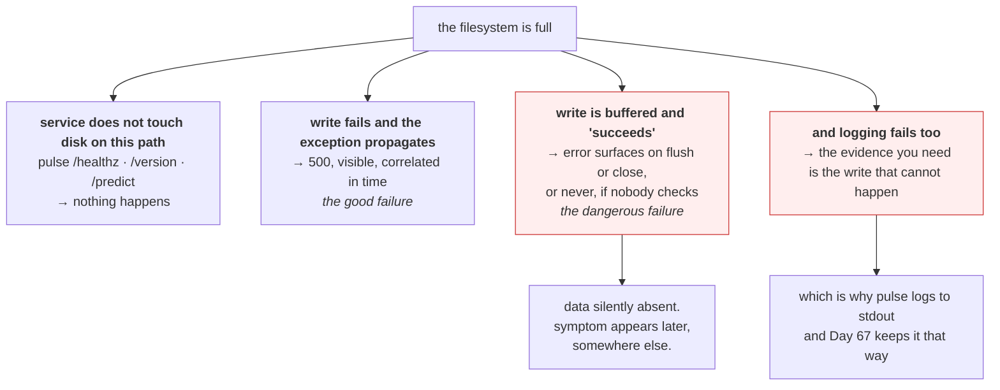

# 3.4 — What a full disk does to `pulse`

## One-line answer

A full disk does not stop a service. It makes the service fail in whichever specific place it happens to
touch the filesystem, which for `pulse` today is almost nowhere, and that near-immunity is a property of
this version that every later day will erode.

---

## The story

🎬 **The scene.** A power cut in a street of small shops, at four in the afternoon.

The fruit and vegetable shop keeps trading. There is daylight through the window, and the owner writes
the prices on a pad and takes cash in a tin, and he sells for three hours without noticing much.

The bakery next door stops instantly. The ovens are electric and the tills will not open.

The pharmacy is the interesting one. It keeps serving people for twenty minutes, because the front of the
shop runs on paper. Then somebody needs a prescription checked against the system, and it turns out that
the whole thing was resting on a computer that has been off since four. Nothing announced the failure. It
sat there, invisible, until the one transaction that needed it.

😬 **The naive fix.** The shopkeepers club together and buy a generator for the bakery, since the bakery
was obviously the one that failed.

💥 **Why it fails.** The bakery's failure was loud, immediate and honest. **The pharmacy's was silent and
delayed**, and it is the one that will hurt somebody. Fixing the visible failure leaves the dangerous one
exactly where it was.

💡 **The insight.** When a shared resource fails, each thing that depends on it fails differently:
instantly, not at all, or **at some later moment nobody can predict**. The third kind is the one worth
mapping in advance, because it is the one where the failure and the symptom are separated by enough time
that nobody connects them.

---

## The idea in plain language

Day 2 drew a blast-radius map for `pulse`, in
[Day 2, part 4.2](../../../day-002-shape-of-production-system/parts/04-blast-radius/4.2-drawing-the-blast-radius-map.md),
covering what breaks if each dependency goes away and, most valuably, how you would find out. The
filesystem was not on that map, because on Day 2 there was no code and nothing wrote anything.

This part adds it, and the useful thing is how small the entry is right now.

### Where `pulse` touches the filesystem today

Go through the routes from [Day 3](../../../day-003-pulse-v0/LESSON.md).

| Path | Filesystem access | Fails on a full disk? |
| --- | --- | --- |
| `GET /healthz` | none | **no**, because it returns a constant |
| `GET /version` | none | **no**, because it reads a value already in memory |
| `POST /predict` | none | **no**, because the stub answer is computed |
| uvicorn's access log | writes to stdout | **no**, because stdout is the terminal rather than a file |
| Python importing a module | reads, at startup only | **no**, once running |

**`pulse` v0 is almost immune to a full disk**, and that is not an achievement. It is a description of
how little it does. Every row in that table changes over the next two hundred days.

- **Day 25** adds Postgres, whose data directory is on disk and which will refuse writes when it fills.
- **Day 67** adds structured logging to a file in some deployments, which is the classic filler.
- **Day 71** adds traces, buffered and spooled.
- **Day 109** loads a model artifact from disk at startup, so a full disk becomes a **startup** failure,
  which is the worst kind, because it means a restart cannot recover you.
- **Day 118** writes prediction logs for drift detection, which is a per-request write and therefore a
  per-request failure mode.

### The three ways a service fails on a full disk

**Immediately and loudly.** The write fails, an exception propagates, and the request returns a 500. That
is bad, and it is the best of the three, because it is visible and correlated in time with the cause.

**Not at all.** The service does not touch the disk on that path, so nothing happens. That is `pulse` v0,
today.

**Later, and somewhere else.** This is the dangerous one. A buffered write appears to succeed and is lost
on flush. A background task fails silently and the data it should have written is simply absent. An
`fsync` fails and the application ignores the return code, which is a real and famous class of bug.
**The failure and the symptom are separated by time**, so whoever investigates is looking at a system
that has been full for two hours and a symptom that appeared thirty seconds ago.

### The one that catches everybody, which is that logging fails first

The cruellest property of a full disk is that **the thing that stops working first is often your ability
to find out what is wrong.** Logs go to disk. The log line that would have said `No space left on device`
is itself a write to a full filesystem.

This is why `pulse` logs to stdout, from [Day 3](../../../day-003-pulse-v0/LESSON.md), and why Day 67
keeps it that way. Stdout goes to the container runtime, which ships it elsewhere, so a full disk on this
node does not silence the evidence.

---

## Why Kriya needs it

Day 30's failure lab fills a disk deliberately and asks you to diagnose the resulting behaviour. Knowing
in advance which of the three shapes to expect turns that from a hunt into a check.

Day 41 configures liveness and readiness probes. **A full disk is precisely the condition where the
`/healthz` design from Day 3 pays off**, because the probe returns 200 since it touches nothing, so the
process is not restarted, which is correct, because restarting does not create disk space.

Day 73 defines the first service level objective, and Day 76 the first alert. The question "would this
alert have fired?" is asked against scenarios like this one.

Day 109 loads a model at startup. From that day, a full disk turns a running service into one that cannot
restart, which is a qualitative change worth anticipating now.

---

## The mechanism

Start `pulse`, then take away the resource and see what actually happens.

**Before anything, check your headroom.**

```bash
df -h . | tail -1
```

**Line by line:** this is the baseline, and the safety check. **Do not run the rest of this part if you
have less than a few gigabytes free**, because the procedure below deliberately consumes space, and doing
it on a nearly full filesystem turns a lesson into an incident on your own laptop.

```text
C:/Program Files/Git  118G   73G   45G  63% /
```

Rather than filling your real disk, which is genuinely risky and hard to undo cleanly, constrain the
service instead. The honest small-scale version is to make `pulse` write to a place that is already
bounded, and observe.

```bash
uv run uvicorn pulse.api:app --host 127.0.0.1 --port 8000 &
PULSE=$!
sleep 2
for R in healthz version; do
  curl -sS -o /dev/null -w "$R -> %{http_code}\n" "http://127.0.0.1:8000/$R"
done
curl -sS -o /dev/null -w "predict -> %{http_code}\n" -X POST http://127.0.0.1:8000/predict \
  -H 'content-type: application/json' -d '{"subject":"disk","body":"is full"}'
```

**Line by line:**

- Start `pulse` and capture the PID, which is the pattern from
  [Day 4](../../../day-004-linux-for-operators-i/parts/01-the-process/1.2-pid-parent-and-the-process-tree.md).
- A loop over the two `GET` routes means the two requests are demonstrably identical apart from the path.
- `-w "$R -> %{http_code}\n"` prints the route name and status and nothing else, which makes the output a
  table rather than three JSON bodies.
- The `POST` goes separately, because it needs a body and a content type, from
  [Day 3, part 2.4](../../../day-003-pulse-v0/parts/02-the-service/2.4-predict-the-contract-before-the-model.md).

```text
healthz -> 200
version -> 200
predict -> 200
```

**This is the baseline, with a healthy disk.** Now fill a bounded space and repeat.

```bash
cd days/day-005-linux-for-operators-ii/lab
uv run python holder.py fill.bin &
FILLER=$!
sleep 8
df -h . | tail -1
cd ../../..
for R in healthz version; do
  curl -sS -o /dev/null -w "$R -> %{http_code}\n" "http://127.0.0.1:8000/$R"
done
```

**Line by line:**

- Reuse `holder.py` from [3.2](3.2-the-deleted-file-that-still-costs-you-a-gigabyte.md), which writes 500
  MiB, a real consumption and nowhere near your 45 GB of headroom. **The point is not to actually fill
  the disk. It is to establish that consumption on the filesystem does not touch `pulse`.**
- `df` confirms that the space really moved.
- The identical two requests keep the comparison clean.

```text
C:/Program Files/Git  118G   74G   44G  63% /
healthz -> 200
version -> 200
```

**Unchanged, because `pulse` v0 never touches the disk on those paths.** That is the finding, and it is
worth stating in the affirmative: **the service is immune, today, for a reason you can point at.**

### The honest version, which is writing until it fails

To see the actual failure you need a bounded filesystem, which is a Linux facility.

```bash
# 🅿️ PARKED until Day 21 (WSL2) — needs a real Linux filesystem to bound safely.
# A 16 MiB filesystem in a file. Nothing outside the image can be affected.
# dd if=/dev/zero of=/tmp/small.img bs=1M count=16
# mkfs.ext4 -F /tmp/small.img
# mkdir -p /tmp/smallfs && sudo mount -o loop /tmp/small.img /tmp/smallfs
# sudo chown "$(id -u):$(id -g)" /tmp/smallfs
# python - <<'PY'
# from pathlib import Path
# p = Path("/tmp/smallfs/log.txt")
# n = 0
# try:
#     with p.open("w") as fh:
#         while True:
#             fh.write("x" * 4096); fh.flush(); n += 1
# except OSError as exc:
#     print(f"failed after {n} writes: {type(exc).__name__}: {exc}")
# PY
```

**Line by line:**

- The loopback filesystem comes from [3.3](3.3-running-out-of-inodes-with-disk-to-spare.md), sized at 16
  MiB so that it fills in seconds. **Confining the experiment to a file is what makes it safe**, and it
  is the only responsible way to reproduce a full disk.
- `fh.write(...)` and then `fh.flush()` in a loop matters, because the flush each time is essential, since
  a buffered write that never reaches the kernel cannot fail. **The buffering is the whole reason the
  third failure mode exists**, and forcing the flush is what makes the error appear at a predictable
  moment.
- `except OSError as exc` catches the specific exception rather than using a bare `except`, as `CLAUDE.md`
  requires. `ENOSPC` surfaces in Python as `OSError` with errno 28.
- Printing `n` shows **how many writes succeeded before the failure**, which is the number that tells you
  the failure was gradual rather than instant.

Here is the expected shape.

```text
failed after 3821 writes: OSError: [Errno 28] No space left on device
```

**That is the loud, immediate failure.** Now the silent one, which is the same code without the flush.

```bash
# 🅿️ PARKED until Day 21 — the same experiment WITHOUT flush(), which is the default.
# python - <<'PY'
# from pathlib import Path
# p = Path("/tmp/smallfs/log2.txt")
# n = 0
# with p.open("w") as fh:
#     for _ in range(5000):
#         fh.write("x" * 4096); n += 1
# print(f"wrote {n} times with no error")
# PY
```

**Line by line:** it is identical except that `flush()` is gone and the loop is bounded. The writes go
into Python's buffer, and the buffer is emptied when the `with` block closes the file.

```text
Traceback (most recent call last):
  File "<stdin>", line 8, in <module>
OSError: [Errno 28] No space left on device
```

**The error arrives on close rather than on write.** Every one of those `fh.write` calls returned normally
and claimed success. **A program that catches exceptions around its writes and not around its close will
report five thousand successful writes and have written nothing**, which is the delayed failure from the
pharmacy, in twelve lines.

Then clean up.

```bash
cd days/day-005-linux-for-operators-ii/lab && kill "$FILLER" 2>/dev/null; wait "$FILLER" 2>/dev/null; rm -f fill.bin; df -h . | tail -1
```

**Line by line:** kill the filler, wait for it so that the descriptor is genuinely closed, since
[3.2](3.2-the-deleted-file-that-still-costs-you-a-gigabyte.md) established that killing is what releases
the space, remove the file, and **confirm the space came back rather than assuming it.**

```text
C:/Program Files/Git  118G   73G   45G  63% /
```



---

## When it breaks

**`OSError: [Errno 28] No space left on device` from a request handler.** This is the loud version, once
`pulse` writes anything.

```text
INFO:     127.0.0.1:54912 - "POST /predict HTTP/1.1" 500 Internal Server Error
ERROR:    Exception in ASGI application
Traceback (most recent call last):
  File "/app/pulse/api.py", line 48, in predict
    log_path.write_text(json.dumps(record))
  File "/usr/lib/python3.12/pathlib.py", line 1044, in write_text
    return f.write(data)
OSError: [Errno 28] No space left on device
```

**What it says:** the write failed because the device is full.

**What it actually means:** exactly that, and **this is the best outcome available**, because the failure
is visible, the traceback names the line, and the timing correlates with the cause.

**The smallest fix:** free space. **The design lesson** is that the request failed because a *logging*
write failed, which means a non-essential operation took down an essential one. Day 67 makes prediction
logging best-effort for precisely this reason.

**The 500 that is not from your code at all.** This one happens at startup rather than request time, and
it arrives from Day 109.

```text
INFO:     Started server process [36012]
INFO:     Waiting for application startup.
ERROR:    Traceback (most recent call last):
  File "/app/pulse/model.py", line 22, in load
    joblib.load(MODEL_PATH)
OSError: [Errno 28] No space left on device
ERROR:    Application startup failed. Exiting.
```

**What it says:** the model could not be loaded and the application refused to start.

**What it actually means:** a full disk has turned a *degradation* into an *outage*, because the service
cannot come back. **Restarting does not help and will be the first thing anybody tries**, because a
container runtime will restart it repeatedly and produce `CrashLoopBackOff`, from Day 30, which looks
like an application bug and is a capacity problem.

**The smallest fix:** free space, and then restart. **The reason it is worth anticipating now** is that
from Day 109 the answer to "is a restart safe?" depends on disk, and that is a genuinely new dependency.

**A database that stops accepting writes and keeps accepting reads.** This is Postgres, from Day 25.

```text
PANIC:  could not write to file "pg_wal/xlogtemp.1234": No space left on device
FATAL:  the database system is in recovery mode
```

**What it says:** the write-ahead log could not be written and the database went into recovery.

**What it actually means:** a database that cannot write its transaction log cannot commit anything, and
most will stop the server rather than risk inconsistency. **This is the failure that turns a full disk
into a data-availability incident**, and it is why database filesystems are monitored more tightly than
anything else on a host.

**The smallest fix:** free space on that specific filesystem, which is why Postgres deployments so often
keep a deliberately sized ballast file that can be deleted in an emergency to buy room to recover.

**Everything looks fine and the data is not there.** This is the silent failure, in its natural form.

```text
$ ls -l /var/lib/pulse/predictions/
-rw-r--r-- 1 pulse pulse 0 Aug 24 18:02 2026-08-24.jsonl
$ grep -c . /var/lib/pulse/predictions/2026-08-24.jsonl
0
```

**What it says:** the file exists and is empty.

**What it actually means:** the process wrote into a buffer, the buffer never reached disk, and either
the close failed and the error was swallowed or the process was killed before flushing, from
[Day 4, part 2.4](../../../day-004-linux-for-operators-i/parts/02-signals/2.4-the-signals-you-cannot-catch.md).
**No error appears in any log**, because from the application's point of view every write succeeded.

**The smallest fix, which is a design rule:** check the return value of `close`, and call `fsync` before
declaring anything durable. **This is the same rule as Day 4's**, which is never to acknowledge work
before it is actually durable, arriving from the disk side rather than the signal side.

---

## In production

**What a professional writes instead of the teaching version.** They separate the filesystems by
consequence, putting logs on one, application data on another, and the operating system on a third, so
that a log flood, which is the commonest cause of a full disk, cannot stop the database or prevent an
administrator logging in. And they treat "can this service still start?" as a distinct question from "can
it still serve?", because a full disk that only degrades serving is recoverable at leisure, and one that
prevents startup is an outage with a restart loop on top.

**What degrades at scale.** Correlation. On one host a full disk breaks one service. In a cluster, the
node's filesystem is shared by every pod on it, so one workload's log flood evicts unrelated pods and the
symptom appears in three teams' dashboards at once. **The workload that caused it is often the least
affected**, because it may not be the one that needed to write next. This is why Kubernetes has ephemeral
storage limits, from Day 42, and why they are worth setting even though, as
[3.3](3.3-running-out-of-inodes-with-disk-to-spare.md) noted, they bound bytes and not inodes.

**The failure that only shows with real traffic.** The buffered write. Under low traffic, buffers fill
slowly and are flushed on close, so an error surfaces at a moment close enough to the cause to be
diagnosable. Under real traffic with long-lived file handles, a buffer may hold minutes of data and the
process may be killed or the file closed at an arbitrary later point, so the data loss is silent, its
extent is unknown, and it is discovered by someone noticing a gap in a dataset days afterwards. **The
extent is the worst part, because you cannot tell how much you lost**, given that the only record of it
was the thing that was lost.

**The review comment a senior engineer leaves.** *"This wraps `write` in a try/except and logs the error,
which is good, but the file is closed by the context manager outside the try, so an `ENOSPC` on flush at
close time propagates as an unhandled exception from a completely different line, and the partial data is
gone with no indication of how much. Either flush and check inside the loop, or accept the loss
explicitly and record how many records were dropped."*

**The signal you would alert on.** For this part specifically, **write errors by errno, from the
application**, as a counter, because a rising count of `ENOSPC` from the app is unambiguous and in some
cases arrives before the disk metric crosses a threshold. But the primary alert stays the one from
[3.1](3.1-df-du-and-why-they-disagree.md), which is **projected time to full, per filesystem**, because
it is the only signal that fires *before* the failure rather than during it. **The signal you would
deliberately not alert on is `/healthz` failing**, because it will not fail. `pulse`'s health check
touches nothing, which is a design choice from Day 3 and is correct here, because restarting a process
does not create disk space, so a probe that failed on a full disk would trigger a restart loop that makes
things worse.

**Blast radius.** This part deliberately consumes 500 MiB and, on Day 21, deliberately fills a 16 MiB
loopback filesystem. The worst case on this machine is that the 500 MiB is held until the filler process
is killed, against 45 GB of headroom, which is negligible **provided you ran the `df` check first**, which
is why that check is the opening command rather than an afterthought. You can trigger it. What bounds it
is the fixed 500 MiB in the script, the loopback confinement for the real filling, and the cleanup step
that verifies the space returned. ⚠️ **Never fill a real filesystem to demonstrate this.** A full root
filesystem can prevent you logging in to fix it, and the recovery is not always possible from where you
are standing.

**Cost.** `0` model calls, `0` tokens and `0` CI minutes. On RAM it is `pulse` at about 60 MB plus the
filler process. **On disk it is 500 MiB temporarily, and 16 MiB for the parked loopback image on Day
21.** All of it returns, and confirming the return is a step in the procedure.

**The interview question.** *"The disk filled up on a node. Walk me through what you would expect to
break."* The answer that lands sorts by failure shape rather than by component: *"Three categories.
Things that never touch the disk keep working, which is often more of the service than people expect,
since our health endpoint returns a constant, so it stays green and the process does not get restarted,
which is correct because a restart cannot create space. Things that write on the request path fail loudly
with `ENOSPC` and a traceback, which is the good case because it is visible and correlated in time. And
things that write through a buffer appear to succeed and lose data at flush or close, which is the
dangerous case, because there is no error at the time, a gap in the data is discovered days later, and
there is no way to know how much was lost. I would also expect logging to be among the first casualties,
which is why logs go to stdout rather than to a file on the node."*

---

## Check yourself

```bash
df -h . | tail -1 && uv run uvicorn pulse.api:app --host 127.0.0.1 --port 8000 & sleep 2; for R in healthz version; do curl -sS -o /dev/null -w "$R -> %{http_code}\n" "http://127.0.0.1:8000/$R"; done; pkill -f 'uvicorn pulse.api'
```

The disk's state and `pulse`'s state, side by side. **Both routes return 200 regardless of what the first
line said**, and being able to explain *why* that is true today, and to name the specific later day on
which it stops being true, is the whole of this part.

**Say out loud, without scrolling up:** *name the three ways a service can fail on a full disk, say which
one `pulse` exhibits today and why, and name the day on which a full disk starts preventing it from
starting at all.*
