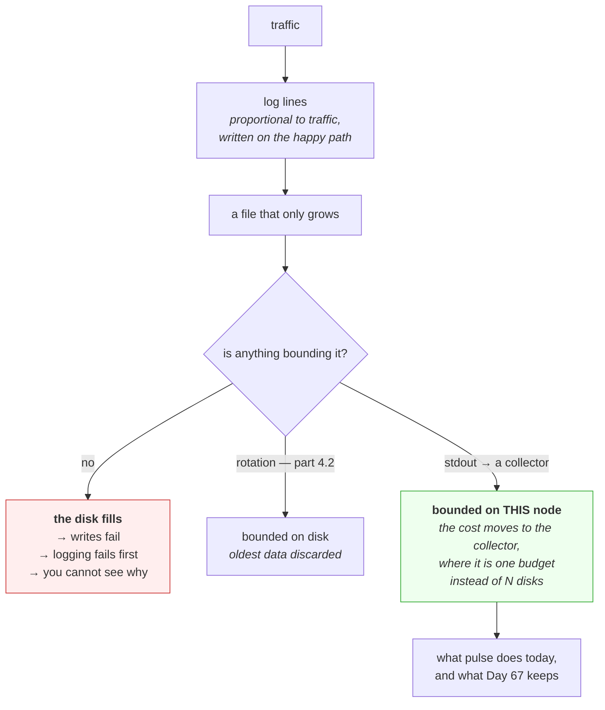

# 4.1 — Why a log file is an operational liability

## One-line answer

A log file is the only thing in a system that grows without bound by design, is written on the happy path
rather than the error path, and cannot be deleted while it is being written — which makes it the single
most common cause of a full disk.

---

## The story

🎬 **The scene.** A small business that keeps every piece of paper. Invoices, delivery notes, till rolls,
the lot. There is a filing cabinet, and when it fills there is a second one, and eventually a room.

Nobody ever decided to keep everything forever. Each individual piece of paper was obviously worth
keeping at the moment it arrived, and nobody was ever the person who decided to throw one away.

😬 **The naive fix.** They rent a bigger room.

💥 **Why it fails.** The room fills too, because the input rate never changed and nothing was ever
removed. Worse, the thing they actually needed — a delivery note from three weeks ago — is now
unfindable in nine years of paper. **They have been paying, continuously and increasingly, for a search
problem they made worse with every payment.**

And the moment it becomes an emergency is the moment the fire officer arrives and says the corridor is
blocked.

💡 **The insight.** Anything that accumulates and is never removed has an implicit policy of *keep
forever*, chosen by nobody. **The absence of a retention decision is itself a retention decision**, and
it is always the most expensive one available. The question is never "should we delete this?" — it is
"how long is this worth keeping?", and it has to be answered before the room fills, because during the
emergency there is no time to work out which papers matter.

---

## The idea in plain language

Logs are the record of what a system did. They are indispensable at three in the morning, and everything
about their storage is hostile.

**They grow on the happy path.** Almost everything else that consumes disk does so in proportion to
something you control — records stored, images built, artifacts kept. Logs grow in proportion to
*traffic*, which means the busier and more successful the service, the faster the disk fills. Success is
the failure mode.

**They grow without a natural bound.** A database has as many rows as you have data. A log has as many
lines as your service has had moments. There is no point at which it is "full" and stops.

**They are append-only and open.** The process holds the file open for its entire life
([3.2](../03-the-disk-that-fills/3.2-the-deleted-file-that-still-costs-you-a-gigabyte.md)), so you cannot
simply delete the file to reclaim space, and truncating it under the writer has consequences.

**They are needed most exactly when the disk is fullest.** A full disk is an incident; an incident is
when you read logs; logs are what filled the disk. The three facts point at each other.

### The arithmetic, which nobody does until afterwards

One log line is small — say 200 bytes with a timestamp, a level and a message. That feels free.

| Requests per second | Lines per request | Bytes per day | Days to fill 20 GB |
| --- | --- | --- | --- |
| 1 | 1 | ~17 MB | ~1,200 |
| 100 | 1 | ~1.7 GB | ~12 |
| 100 | 5 | ~8.6 GB | ~2 |
| 1,000 | 5 | ~86 GB | **under a day** |

**Read the bottom row.** A service at a thousand requests a second, logging five lines each — an access
line, a couple of application lines, a timing line — fills a twenty gigabyte filesystem before you finish
a working day. Nothing is wrong with any of those lines individually. The volume is a property of
multiplication, and multiplication is not intuitive.

**This is why log volume is a capacity number**, and it belongs in a design review beside memory and
processor, not in an incident review afterwards.

### The three properties a log needs to be operable

**Bounded.** There must be a maximum amount of disk it can occupy, enforced by something, not by hope.
That is rotation, and part [4.2](4.2-rotation-the-mechanism.md) is the mechanism.

**Rotatable without stopping the service.** You cannot take a production service down to tidy its log
file, so whatever bounds it must work while the process is running and writing
([4.3](4.3-copytruncate-and-the-lines-you-lose.md)).

**Shippable.** A log on the disk of a machine that has failed is a log you cannot read, and a log inside
a container that has been replaced is gone. The durable answer is to send lines somewhere else as they
happen, which is Day 67 for the format and Day 69 for the shipping.

### Why `pulse` writes to stdout, and what that actually buys

`pulse` logs to standard output ([Day 3](../../../day-003-pulse-v0/LESSON.md)). Today that is your
terminal. In a container it is the runtime, which collects it and can ship it. **The service writes no
file at all**, which means:

- there is no file to rotate, so `pulse` has no rotation configuration;
- there is no file to fill the disk, so a log flood consumes the *collector's* budget, not this node's;
- there is no file to lose when the container is replaced.

**This is not "we have not got round to logging properly yet".** It is the correct design, and the
reason Day 67 keeps it. What Day 67 adds is *structure* — one JSON object per line instead of prose — not
a file.

The rest of this section is about the world where a file does exist, because you will operate plenty of
software that has one, and because the failure modes are worth having met.

---

## Why Kriya needs it

Day 67 gives `pulse` structured logging, and the first decision on that day is stdout versus a file. The
argument is this part.

Day 68 configures retention, which is the numeric answer to "how long is this worth keeping?" — and the
arithmetic above is where that number comes from.

Day 30's container failure lab includes a full disk caused by container logs, which is this failure at
the runtime level rather than the application level.

Day 118 logs every prediction for drift detection. That is a per-request write of a structured record,
which multiplies exactly as the table above does — and unlike an access log, those records have a
retention requirement driven by the drift window rather than by convenience.

Day 223 costs the platform. Log volume is one of the largest line items in almost every real system, and
Day 223 asks you to compute it in quota units rather than dollars.

---

## The mechanism

Measure your own log volume rather than guessing at it.

```bash
uv run uvicorn pulse.api:app --host 127.0.0.1 --port 8000 > /tmp/pulse-vol.log 2>&1 &
PULSE=$!
sleep 2
for i in $(seq 1 200); do curl -sS -o /dev/null http://127.0.0.1:8000/healthz; done
sleep 1
wc -lc /tmp/pulse-vol.log
```

**Line by line:**

- `> /tmp/pulse-vol.log 2>&1` — capture stdout **and** stderr into one file. `2>&1` must come *after* the
  redirect: it means "send stderr wherever stdout currently goes", so the order is load-bearing
  ([Day 4, part 4.2](../../../day-004-linux-for-operators-i/parts/04-the-service-died/4.2-the-shutdown-that-dropped-requests.md)).
  Uvicorn writes its access log to stdout and its startup messages to stderr, so capturing only one gives
  you half the picture.
- `for i in $(seq 1 200)` — two hundred requests. Enough that the per-request cost dominates the startup
  lines and the arithmetic is meaningful.
- `-o /dev/null` — discard the response bodies. You are measuring the *server's* output, not the
  client's.
- `wc -lc` — **lines and characters**. `-l` alone gives you a count with no size; `-c` alone gives you a
  size with no rate. Together they give you bytes per line, which is the number the table above needs.

Observed on **2026-08-24**:

```text
     205    18455 /tmp/pulse-vol.log
```

**205 lines, 18,455 bytes.** Five of those lines are startup; two hundred are requests. So:

```bash
python -c "
lines, chars = 205, 18455
per_req = (chars - 5*60) / 200
print(f'{per_req:.0f} bytes per request')
for rps in (1, 10, 100, 1000):
    daily = per_req * rps * 86400
    print(f'{rps:>5} req/s -> {daily/1e9:7.2f} GB/day -> 20 GB lasts {20e9/daily:8.1f} days')
"
```

**Line by line:**

- Subtract an estimate for the five startup lines before dividing, so `per_req` is the marginal cost of a
  request rather than an average polluted by fixed overhead.
- `86400` — seconds in a day. The whole calculation is bytes-per-request times requests-per-second times
  seconds-per-day, and writing it out rather than quoting a number is the point.
- The loop over four traffic levels, because **the interesting thing is how fast the answer changes**,
  not any single value.
- `20e9` — twenty gigabytes, the size of a small server's `/var`.

```text
   90 bytes per request
    1 req/s ->    0.01 GB/day -> 20 GB lasts   2572.0 days
   10 req/s ->    0.08 GB/day -> 20 GB lasts    257.2 days
  100 req/s ->    0.78 GB/day -> 20 GB lasts     25.7 days
 1000 req/s ->    7.78 GB/day -> 20 GB lasts      2.6 days
```

**Ninety bytes per request, and the last row is under three days.** And that is `pulse` v0, which logs
*one* line per request and has no application logging at all. Day 67 will add several structured lines
per request, and Day 118 will add a full prediction record — so multiply this table by five or ten before
you believe it.

**Write these numbers into `docs/PACKAGES.md`.** They are the input to Day 68's retention decision, and
measuring them now, cheaply, beats estimating them later under pressure.

Clean up:

```bash
kill "$PULSE"; wait "$PULSE" 2>/dev/null; rm -f /tmp/pulse-vol.log
```

**Line by line:** stop the server, collect it so the shell does not print a job message afterwards, and
remove the capture file — which is itself a log file you created and would otherwise leave growing on
your machine.



---

## When it breaks

**The service that filled its own disk by succeeding.** The shape this part exists for:

```text
$ df -h /var
Filesystem      Size  Used Avail Use% Mounted on
/dev/sda2        20G   20G     0 100% /var
$ ls -lh /var/log/app.log
-rw-r--r-- 1 app app 18G Aug 24 18:40 /var/log/app.log
$ tail -1 /var/log/app.log
2026-08-24T18:39:58Z INFO request completed path=/predict status=200 duration_ms=41
```

**What it says:** an eighteen gigabyte log whose last line is a successful request.
**What it actually means:** nothing went wrong. The service worked, at volume, for long enough. **Every
line in that file is a line somebody thought was worth writing**, and the aggregate is an outage.
**The smallest fix in the moment:** truncate in place — `: > /var/log/app.log` — which reclaims the space
without breaking the writer's descriptor
([3.2](../03-the-disk-that-fills/3.2-the-deleted-file-that-still-costs-you-a-gigabyte.md)). **Do not
`rm` it.**
**The real fix:** rotation ([4.2](4.2-rotation-the-mechanism.md)), and a retention number chosen from the
arithmetic above.

**Logging that stopped and nobody noticed.** Quieter and worse:

```text
$ ls -lh /var/log/app.log
-rw-r--r-- 1 app app 20G Aug 24 14:02 /var/log/app.log
$ date
Mon Aug 24 18:44:11 UTC 2026
```

**What it says:** the log's last modification was several hours ago and the service is still running.
**What it actually means:** the disk filled at 14:02, the write failed, and **the application caught the
exception and carried on** — which is arguably correct behaviour for a logging failure. So the service
has been serving traffic blind for hours, and the record of everything since then does not exist.
**The smallest fix:** free space and confirm logging resumes.
**The thing worth internalising:** a log's *modification time* is a health signal. A log that has stopped
growing on a service that is still serving is one of the strongest indicators available that something is
wrong, and almost nobody monitors it.

**The log that made an incident impossible to diagnose.** The compound failure:

```text
$ journalctl -u pulse --since '18:00'
-- No entries --
$ df -h /var
Filesystem      Size  Used Avail Use% Mounted on
/dev/sda2        20G   20G     0 100% /var
```

**What it says:** no log entries for the period you care about, and a full disk.
**What it actually means:** the log system itself could not write, so the record of the incident is
missing precisely for the duration of the incident. **The evidence and the failure share a resource.**
**The smallest fix:** none, retrospectively — the data does not exist.
**The design answer:** ship logs off the node as they happen, so the record survives the node's disk. This
is the single strongest argument for stdout plus a collector over a file, and it is why Day 69 exists.

**A `du` that cannot find the space because of rotation.** Previewing
[4.4](4.4-the-rotation-that-did-not-free-anything.md):

```text
$ du -shx /var/log
2.1G    /var/log
$ df -h /var
Filesystem      Size  Used Avail Use% Mounted on
/dev/sda2        20G   19G  380M  95% /var
```

**What it says:** the log directory holds 2.1 GB and the filesystem is 95% full.
**What it actually means:** rotation ran and deleted old files that a process still had open, so their
blocks are still allocated and invisible
([3.2](../03-the-disk-that-fills/3.2-the-deleted-file-that-still-costs-you-a-gigabyte.md)). **The
rotation appeared to work and freed nothing**, which is part
[4.4](4.4-the-rotation-that-did-not-free-anything.md) in full.

---

## In production

**What a professional writes instead of the teaching version.** They do not write log files from
application code at all. The application writes structured lines to stdout; something else — a container
runtime, a systemd journal, a sidecar — decides where they go and how long they live. The reason is
separation of concerns with a very practical edge: **retention, rotation, shipping and compression are
operational policies that change without the application changing**, and baking them into the application
means a code deploy every time the policy does.

**What degrades at scale.** The cost moves from disk to ingestion. Once logs are shipped, the constraint
is no longer any single node's filesystem — it is the collector's throughput and the log platform's
storage bill, and a service that logs five lines per request across a hundred instances is producing a
volume that costs real money and real query latency. **This is why log level becomes a runtime control**
rather than a build-time constant: the ability to turn debug logging on for one instance for a few minutes
without redeploying is worth a great deal, and Day 67 builds it.

**The failure that only shows with real traffic.** The debug line left in. A log statement inside a loop,
or on a path that is rare in testing and universal in production, multiplies by traffic and turns a
service that filled its disk in a month into one that fills it in an hour. **The characteristic signature
is a sudden change in the fill rate that correlates with a deploy** — which is why the fill *rate*, not
the fill level, is the useful metric.

**The review comment a senior engineer leaves.** *"This logs the full request and response body at INFO
on every call. At our traffic that is about 40 GB a day per instance, it puts customer data in the log
platform where our retention policy is longer than our data policy allows, and the first we will know
about either is a disk alert or an audit. Log the size and a request id; log the body at DEBUG behind a
flag."*

**The signal you would alert on.** Three, in order of value. **Filesystem fill rate with a projection**
([3.1](../03-the-disk-that-fills/3.1-df-du-and-why-they-disagree.md)) — the one that fires before the
failure. **Log line rate per instance**, because a step change in it is a deploy that changed logging
behaviour and it is much easier to fix in the hour after the deploy than the week after. And **log file
modification age** for anything that writes a file: a log that has stopped growing on a live service is a
strong, cheap, almost-never-monitored signal that writes are failing. You would **not** alert on log file
size alone, which is meaningless without a rate, nor on individual log lines at ERROR — that is Day 76's
subject and it is a different question.

**Blast radius.** This part writes a log capture to `/tmp` and generates two hundred requests against a
local service. Worst case: a few tens of kilobytes and a file left behind in `/tmp` — negligible, and the
cleanup step removes it. **The blast radius worth naming is the one this part is about**: an unbounded
log is a slow-motion outage of the whole machine, triggered by nothing more than the service working
normally, and it takes down every other process on that filesystem with it. Who can trigger it: anyone
who adds a log statement. What bounds it: rotation ([4.2](4.2-rotation-the-mechanism.md)), a retention
number, and — most effectively — not writing a file at all.

**Cost.** `0` model calls, `0` tokens, `0` CI minutes. RAM: `pulse` at about 60 MB while running. **Disk:
about 18 KB** for the capture file, deleted at the end. The measurement itself is essentially free, which
is the argument for doing it now rather than estimating: **the arithmetic in this part cost eighteen
kilobytes and two hundred requests, and it produces the number Day 68 needs.**

**The interview question.** *"How do you stop logs filling the disk?"* The answer that lands starts with
the design and treats rotation as the fallback: *"Ideally the application does not write a file at all —
it writes structured lines to stdout and something else owns collection, retention and shipping, so those
are operational policies rather than code. Where there is a file, rotation with a size cap and a retention
count, and the number comes from arithmetic rather than a default: bytes per line times lines per request
times requests per second tells you how long any given filesystem lasts, and at a thousand requests a
second with a few lines each you are filling twenty gigabytes in a couple of days. The thing I actually
alert on is the fill rate with a projection rather than a threshold, because a percentage means nothing
without knowing how fast it is moving."*

---

## Check yourself

```bash
uv run uvicorn pulse.api:app --host 127.0.0.1 --port 8000 > /tmp/lv.log 2>&1 & sleep 2; for i in $(seq 1 100); do curl -sS -o /dev/null http://127.0.0.1:8000/healthz; done; sleep 1; wc -lc /tmp/lv.log; pkill -f 'uvicorn pulse.api'; rm -f /tmp/lv.log
```

A hundred requests, and the line and byte count they produced. **Divide the bytes by a hundred and hold
that number** — it is `pulse`'s log cost per request today, it is the smallest it will ever be, and it is
the multiplicand in every capacity conversation from Day 67 onward.

**Say out loud, without scrolling up:** *your service logs one 200-byte line per request and handles a
thousand requests a second. Say roughly how long a 20 GB filesystem lasts, and name the two things you
would change first.*
