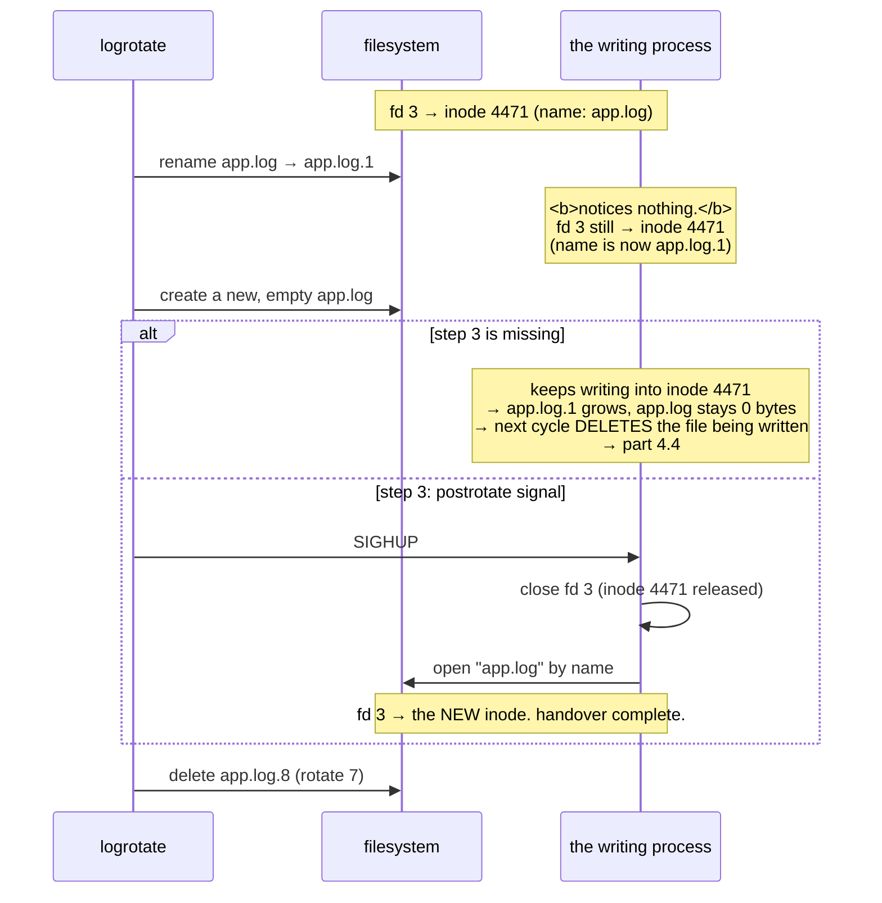

# 4.2 — Rotation — the mechanism

## One-line answer

Rotation renames the current log out of the way, starts a new one, and deletes the oldest, and the only
hard part is the handover, because the writing process is holding a descriptor that follows the *inode*
rather than the name.

---

## The story

🎬 **The scene.** A small tea shop with a notepad beside the till. The owner writes each order on the top
sheet.

At closing time she tears off the top sheet, files it in a drawer with five others, throws away the
oldest sheet in the drawer, and puts a fresh sheet on the pad. Tomorrow's orders go on the new sheet. She
has never once lost an order, and the drawer never holds more than six sheets.

😬 **The naive fix.** A new assistant is told to keep the drawer tidy. He picks the pad up to file it
properly, while a customer is halfway through ordering.

💥 **Why it fails.** The owner is still writing. Her pen is on a sheet that is now in a drawer in the back
room, and she does not notice for ten minutes, because the pen still works and the writing still goes
somewhere. Ten orders end up filed in yesterday's paperwork, and the new sheet on the counter is blank.

**Tearing the sheet off was never the difficult part.** The difficult part was that somebody was writing
at the moment it happened, and nobody told her to move her pen.

💡 **The insight.** Swapping a resource that is in use is a **handover** rather than a replacement. The
step everybody remembers is moving the old thing aside, and the step that actually matters is telling the
user to pick up the new one. If that step is missing, everything appears to work while the writing goes
somewhere nobody will look.

---

## The idea in plain language

Rotation is four steps, run periodically.

1. **Rename** `app.log` to `app.log.1`, and `app.log.1` to `app.log.2`, and so on.
2. **Create** a fresh, empty `app.log`.
3. **Tell the writer** to start using the new file.
4. **Delete** whatever fell off the end of the numbered chain.

Steps 1, 2 and 4 are trivial. **Step 3 is the whole subject.**

### Why step 3 is necessary at all

A process opens a file once and holds a descriptor, from
[3.2](../03-the-disk-that-fills/3.2-the-deleted-file-that-still-costs-you-a-gigabyte.md). That descriptor
refers to the **inode** rather than to the name, from
[1.1](../01-the-filesystem/1.1-a-file-is-an-inode-a-name-is-a-pointer.md).

So when rotation renames `app.log` to `app.log.1`, the writer notices nothing at all. Its descriptor
still points at the same inode, which now has a different name. **It carries on writing into
`app.log.1`**, which rotation believes is a finished, archived file.

Meanwhile the newly created `app.log` sits at zero bytes forever.

And when the numbered chain rolls round and rotation deletes `app.log.6`, that file may be the one the
process is still writing to, at which point the blocks are not freed, `df` and `du` diverge, and you have
part [4.4](4.4-the-rotation-that-did-not-free-anything.md).

### The two ways to do step 3

**Signal the writer to reopen.** By convention `SIGHUP` means *"reload"*, from
[Day 4, part 2.1](../../../day-004-linux-for-operators-i/parts/02-signals/2.1-what-a-signal-actually-is.md),
and for a program with a log file it conventionally means *"close your log and open it again by name"*.
The process closes the old descriptor, which releases the old inode, and opens the new `app.log`. **This
is the correct mechanism and it requires the program to support it.**

**Copy and truncate.** If the program cannot be signalled, rotation copies the file's contents to
`app.log.1` and then truncates the original to zero length **in place**. The inode is unchanged, so the
writer's descriptor stays valid and it keeps writing to the same file, which is now empty. No handover is
needed because nothing moved. **It has a cost**, and part
[4.3](4.3-copytruncate-and-the-lines-you-lose.md) is that cost.

| | rename plus signal | copytruncate |
| --- | --- | --- |
| Writer must support a reopen signal | **yes** | no |
| Data lost during rotation | none | **a small window** |
| Disk needed during rotation | one file | **two copies, briefly** |
| Inode changes | yes | no |
| Works for a process you cannot signal | no | **yes** |

### `logrotate`, the standard tool

Almost every Linux system runs `logrotate`, a program that reads configuration files describing which
logs to rotate and how. Verified against the `logrotate(8)` manual page on **2026-08-24**, these are the
directives you actually use.

| Directive | Means |
| --- | --- |
| `rotate <count>` | *"Log files are cycled `count` times before removal"*, and a count of 0 removes old versions immediately |
| `size <size>` | *"Log files are rotated only if they grow bigger then `size` bytes"*, and it accepts `k`, `M`, `G` |
| `daily` / `weekly` / `monthly` | rotate on a time schedule instead of, or as well as, a size |
| `compress` | *"Old versions of log files are compressed with gzip(1) by default"* |
| `delaycompress` | postpone compressing the most recent rotated file until the next cycle |
| `create <mode> <owner> <group>` | create the replacement immediately, with these permissions |
| `missingok` | *"If the log file is missing, go on to the next one without issuing an error message"* |
| `notifempty` | do not rotate an empty log |
| `copytruncate` | *"Truncate the original log file in place after creating a copy"* |
| `postrotate` … `endscript` | run these commands after rotating, and **this is where the signal goes** |
| `olddir <dir>` | move rotated logs into `dir`, which **must be on the same filesystem** |

**`olddir` needing the same filesystem is this day's section 1 showing up in a config file**, because a
rename cannot cross a mount point, from
[1.2](../01-the-filesystem/1.2-paths-mounts-and-the-tree-that-is-not-one-disk.md), so `olddir` pointing
at another disk turns every rotation into a full copy.

---

## Why Kriya needs it

Day 68 configures retention for `pulse`'s telemetry, and the retention count is exactly `rotate <count>`
with a number chosen from part [4.1](4.1-why-a-log-file-is-an-operational-liability.md)'s arithmetic.

Day 30's container failure lab includes a full disk from container logs. Container runtimes implement
their own rotation with a size and a count, and diagnosing it means knowing what rotation is trying to
do.

Day 26 adds a container `HEALTHCHECK`, and Day 41 a Kubernetes probe. Both are consumers of a signal, and
`SIGHUP`-to-reopen is the same shape, being **a convention where a signal's meaning is agreed rather than
enforced**, from
[Day 4, part 2.1](../../../day-004-linux-for-operators-i/parts/02-signals/2.1-what-a-signal-actually-is.md).

Day 118 writes prediction logs whose retention is driven by the drift detection window rather than by
disk. That is the first time in this curriculum that a retention number has a *correctness* justification
rather than a capacity one, and the mechanism for enforcing it is this.

---

## The mechanism

Build a rotation by hand before adopting the tool, which is Principle 4.

First, produce the failure that step 3 exists to prevent.

```bash
cd days/day-005-linux-for-operators-ii/lab
cat > writer.py <<'PY'
"""Write a numbered line every 200ms to the path given, holding the file open."""
import sys, time
from pathlib import Path

target = Path(sys.argv[1])
n = 0
with target.open("a") as fh:
    while True:
        n += 1
        fh.write(f"line {n}\n")
        fh.flush()
        time.sleep(0.2)
PY
uv run python writer.py app.log &
WRITER=$!
sleep 2
wc -l app.log
```

**Line by line:**

- `cat > writer.py <<'PY' ... PY` is a heredoc. **The quotes around `'PY'` stop the shell expanding `$`
  inside**, so `f"line {n}\n"` lands verbatim rather than being mangled, as
  [1.3](../01-the-filesystem/1.3-where-things-belong-on-a-unix-system.md) discussed.
- `target.open("a")` uses **append** mode, which is what every logger uses, because writes go to the end
  and existing content is preserved.
- `fh.flush()` after each write pushes it to the kernel immediately, so the file's size reflects reality
  rather than Python's buffer, from
  [3.4](../03-the-disk-that-fills/3.4-what-a-full-disk-does-to-pulse.md).
- `time.sleep(0.2)` gives five lines a second, which is slow enough to watch and fast enough not to wait.
- The `with` block never exits, so the descriptor is held for the process's life. **That is the whole
  premise.**

```text
      10 app.log
```

Now rotate it the naive way, with rename and create and no step 3.

```bash
mv app.log app.log.1
touch app.log
sleep 2
wc -l app.log app.log.1
```

**Line by line:**

- `mv` within one directory is a rename, which is a directory-entry change, instant, and **completely
  invisible to the writing process**, from
  [1.1](../01-the-filesystem/1.1-a-file-is-an-inode-a-name-is-a-pointer.md).
- `touch app.log` creates the fresh empty file that rotation expects the writer to move to.
- `sleep 2` gives the writer ten more lines to write, so that the next count is decisive.
- `wc -l` on both, together, puts the comparison in one output.

Observed on **2026-08-24**:

```text
       0 app.log
      20 app.log.1
      20 total
```

**The new file is empty and the "archived" file is still growing.** The writer never noticed. Rotation
believes it has archived a finished file and started a fresh one, both beliefs are wrong, and nothing
reported an error.

Leave it another moment and confirm that it keeps happening.

```bash
sleep 2 && wc -l app.log app.log.1
```

**Line by line:** the same count again after two more seconds. **Repeating a measurement to show a trend
rather than a state** is the difference between "it looked empty" and "it will always be empty".

```text
       0 app.log
      30 app.log.1
      30 total
```

### Step 3, done properly

Rewrite the writer to reopen on `SIGHUP`.

```bash
cat > writer_hup.py <<'PY'
"""Write a numbered line every 200ms, and reopen the log by name on SIGHUP."""
import os, signal, sys, time
from pathlib import Path

target = Path(sys.argv[1])
reopen = False


def on_hup(signum, frame) -> None:
    global reopen
    reopen = True


if hasattr(signal, "SIGHUP"):
    signal.signal(signal.SIGHUP, on_hup)
else:
    print("[writer] SIGHUP unavailable on this platform", flush=True)

print(f"[writer] pid={os.getpid()}", flush=True)
fh = target.open("a")
n = 0
try:
    while True:
        if reopen:
            fh.close()
            fh = target.open("a")
            reopen = False
            print("[writer] reopened", flush=True)
        n += 1
        fh.write(f"line {n}\n")
        fh.flush()
        time.sleep(0.2)
finally:
    fh.close()
PY
```

**Line by line:**

- `def on_hup(signum, frame)` **sets a flag and returns**, which is the whole discipline from
  [Day 4, part 2.3](../../../day-004-linux-for-operators-i/parts/02-signals/2.3-catching-a-signal-in-python.md).
  Closing and reopening a file inside a signal handler would run at an arbitrary bytecode boundary,
  possibly in the middle of a write.
- `global reopen` is needed, because without it the handler sets a local and the loop never sees it,
  which is the exact bug Day 4 named.
- `if hasattr(signal, "SIGHUP")` matters because **`SIGHUP` does not exist on Windows**, and
  [Day 4, part 2.3](../../../day-004-linux-for-operators-i/parts/02-signals/2.3-catching-a-signal-in-python.md)
  gives the documented Windows list as `SIGABRT`, `SIGFPE`, `SIGILL`, `SIGINT`, `SIGSEGV`, `SIGTERM` and
  `SIGBREAK`. Guarding with `hasattr` rather than checking `sys.platform` is the portable form, and the
  `else` branch says so out loud rather than failing silently.
- `fh.close()` and then `target.open("a")` means **close first.** That releases the old inode, and if you
  opened the new one first you would briefly hold two descriptors and, more importantly, the old inode
  would not be freed until the second close.
- Reopening **by name** is the point, because the name now resolves to the new, empty file, which is what
  rotation created.
- `try` and `finally: fh.close()` means the descriptor is closed on the way out even if the loop raises.
  Without it this is a leak, and leaks are how a long-running process hits its open-file limit.
- `print("[writer] reopened")` gives **observable evidence that step 3 happened.** A handover with no log
  line is a handover you cannot verify.

Now run the proper rotation.

```bash
kill "$WRITER" 2>/dev/null; rm -f app.log app.log.1
uv run python writer_hup.py app.log &
WRITER=$!
sleep 2
mv app.log app.log.1 && touch app.log && kill -HUP "$WRITER"
sleep 2
wc -l app.log app.log.1
```

**Line by line:**

- Clean up the previous experiment first, so that the counts are not contaminated.
- `mv && touch && kill -HUP` chained with `&&` means **the order is the algorithm**: rename, create,
  signal. Signalling before the new file exists would have the writer reopen a name that does not
  resolve.
- `kill -HUP` uses the name rather than `-1`, for the portability reason in
  [Day 4, part 2.1](../../../day-004-linux-for-operators-i/parts/02-signals/2.1-what-a-signal-actually-is.md).

```text
[writer] pid=37204
[writer] reopened
      10 app.log
      10 app.log.1
      20 total
```

**Ten lines in each, and the `reopened` line proving the handover.** The archived file stopped at the
moment of rotation, and the new file started from there. No lines were lost and none went to the wrong
place.

⚠️ **On this Windows machine `SIGHUP` does not exist**, so you will see `[writer] SIGHUP unavailable on
this platform` and the `kill -HUP` will fail. **That is the finding rather than a failure of the
exercise.** Record it, and run this properly inside WSL2 from Day 21. The naive-rotation half above works
everywhere and is the half that teaches the lesson.

### The tool, after the mechanism

```text
# 🅿️ PARKED until you operate a machine with logrotate — read it now.
# /etc/logrotate.d/pulse
/var/log/pulse/*.log {
    size 100M
    rotate 7
    compress
    delaycompress
    missingok
    notifempty
    create 0640 pulse pulse
    postrotate
        /bin/kill -HUP $(cat /run/pulse.pid 2>/dev/null) 2>/dev/null || true
    endscript
}
```

**Line by line:**

- `size 100M` rotates on size rather than on a schedule. **Size is the right trigger for a capacity
  problem**, because a daily rotation on a service that produces 40 GB a day rotates once, far too late.
- `rotate 7` keeps seven old files, so the on-disk maximum is bounded at roughly eight times 100 MB.
  **This is the number that makes the whole thing bounded**, and it comes from part
  [4.1](4.1-why-a-log-file-is-an-operational-liability.md)'s arithmetic.
- `compress` with `delaycompress` compresses old files, but **not the most recent one**, because a writer
  that has not yet reopened may still be appending to it. Compressing a file being written produces a
  corrupt archive, and `delaycompress` exists precisely for this race.
- `missingok` and `notifempty` mean do not error on a missing log and do not rotate an empty one. Both
  prevent noise rather than failure.
- `create 0640 pulse pulse` **creates the replacement with an explicit mode and owner**, rather than
  inheriting whatever the umask gives, from [2.2](../02-permissions/2.2-reading-and-changing-a-mode.md).
  `0640` keeps it unreadable by other users on the machine.
- `postrotate` … `endscript` is **step 3**, being the signal, sent to the pid read from a file.
- `2>/dev/null || true` means a missing pid file or a dead process must not fail the whole rotation run,
  because a rotation that aborts leaves logs unrotated forever. **This is a deliberate swallow, and it is
  the kind that needs the comment it has here**, since `CLAUDE.md` says never to swallow an exception
  silently. The cost is that a permanently broken signal is invisible, which part
  [4.4](4.4-the-rotation-that-did-not-free-anything.md) is about.

Then clean up.

```bash
kill "$WRITER" 2>/dev/null; wait "$WRITER" 2>/dev/null; rm -f app.log app.log.1 writer.py writer_hup.py; ls
```

**Line by line:** stop the writer, collect it, remove every file this part created, and list the
directory as proof rather than assuming.



---

## When it breaks

**The rotated log that keeps growing while the live one stays empty.** This is the missing-step-3
signature.

```text
$ ls -lh /var/log/pulse/
-rw-r----- 1 pulse pulse    0 Aug 24 03:00 app.log
-rw-r----- 1 pulse pulse  14G Aug 24 19:12 app.log.1
-rw-r----- 1 pulse pulse 120M Aug 23 03:00 app.log.2.gz
```

**What it says:** the current log is empty, and `app.log.1` is fourteen gigabytes and was modified a
minute ago.

**What it actually means:** rotation ran at 03:00, renamed the file, created a new one, and the writer was
never told. It has been appending to `app.log.1` all day. **Compare the modification times**, because
`app.log` at 03:00 and `app.log.1` at 19:12 is the whole diagnosis in one column.

**The smallest fix:** signal the process to reopen, or restart it. **The real fix** is to add the
`postrotate` block, and verify it by watching the modification times after the next rotation rather than
assuming.

**`logrotate` succeeded and nothing was rotated.** This is silent, because of `notifempty` and its
relatives.

```text
$ logrotate -d /etc/logrotate.d/pulse
reading config file /etc/logrotate.d/pulse
Handling 1 logs
rotating pattern: /var/log/pulse/*.log  104857600 bytes (7 rotations)
considering log /var/log/pulse/app.log
  log does not need rotating (log size is below the 'size' threshold)
```

**What it says:** it considered the log and decided not to rotate it.

**What it actually means:** `-d` is **debug and dry-run** mode, so it says what it *would* do and changes
nothing. This is the flag to use before trusting a new configuration, and it is why this output is
reassuring rather than alarming.

**Worth knowing:** if the real run also declines while the file is enormous, check that the *pattern*
matches. `/var/log/pulse/*.log` does not match `/var/log/pulse/app.log.1`, and it does not match a file
in a subdirectory.

**A corrupt `.gz` in the archive.** This is the race `delaycompress` prevents.

```text
$ zcat /var/log/pulse/app.log.1.gz | tail -1
gzip: /var/log/pulse/app.log.1.gz: unexpected end of file
```

**What it says:** the compressed file is truncated.

**What it actually means:** rotation compressed `app.log.1` while the writer was still appending to it,
because the handover had not happened yet, or happened after compression started. The archive is a
snapshot of a moving file.

**The smallest fix:** `delaycompress`, which defers compressing the newest rotated file by one cycle,
giving the writer time to let go. **This is one of those directives that looks like paranoia until you
have lost a day's logs to it.**

**`error: skipping "/var/log/app.log" because parent directory has insecure permissions`.** This is a
refusal that reads like a bug.

```text
error: skipping "/var/log/app.log" because parent directory has insecure permissions
(It's world writable or writable by group which is not "root")
Set "su" directive in config file to tell logrotate which user/group should be used for rotation.
```

**What it says:** the parent directory's permissions are unsafe.

**What it actually means:** `logrotate` runs as root and refuses to operate inside a directory that
non-root users can write to, because anyone with write on that directory could replace a log with a
symlink and have root truncate an arbitrary file, and
[2.3](../02-permissions/2.3-the-permission-that-is-on-the-directory-not-the-file.md) established that
**write on the directory is the authority that matters**. This is a genuine privilege-escalation defence.

**The smallest fix:** tighten the directory, or use the `su` directive to run that rotation as a
non-privileged user. **Not** to make the directory more permissive.

---

## In production

**What a professional writes instead of the teaching version.** For anything they control, they avoid the
handover entirely by writing to stdout and letting the runtime own rotation, from
[4.1](4.1-why-a-log-file-is-an-operational-liability.md). For third-party software that insists on a
file, they use rename-plus-signal where the program supports a reopen signal, and `copytruncate` only
where it does not, and they treat that choice as a documented compromise with a known cost, from
[4.3](4.3-copytruncate-and-the-lines-you-lose.md), rather than as a default.

**What degrades at scale.** Verification. On one host you can look at modification times and see whether
rotation is working. Across a fleet, a rotation that silently stopped signalling, whether because a pid
file moved, because a package upgrade changed the path, or because the `|| true` swallowed a permanent
failure, is invisible until a disk fills. **The `|| true` that makes rotation robust is the same
`|| true` that makes its failure silent**, which is a genuine and unavoidable tension. Teams that have
been bitten monitor the age of the current log file rather than trusting the rotation job's exit code.

**The failure that only shows with real traffic.** Rotation that cannot keep up. `logrotate` typically
runs from a scheduled job, so between runs the log grows unchecked, and a service producing gigabytes an
hour against a job that checks once a day will exceed any `size` threshold enormously before anything
looks at it. **The `size` directive is a condition checked at run time rather than a limit enforced
continuously**, and the difference only matters when the growth rate is high. The remedy is running the
check more often, or better, not writing the file.

**The review comment a senior engineer leaves.** *"The `postrotate` sends `SIGHUP` to the pid in
`/run/app.pid`, but we switched to systemd two months ago and nothing writes that file any more, so the
`|| true` has been swallowing a failure since then and every rotation has been leaving an orphaned open
file. Use `systemctl kill -s HUP app.service`, and add a check that the current log's mtime is recent."*

**The signal you would alert on.** **The age of the current log file's last modification**, which is
cheap, requires no cooperation from the rotation tool, and catches every variant of a failed handover,
because if `app.log` has not been written to in an hour on a service that is serving traffic, the writer
is elsewhere. Secondarily, **total bytes in the log directory against the configured maximum**, because
`rotate 7` times `size 100M` gives you a number the directory should never exceed, and exceeding it means
rotation is not doing what it says. You would **not** alert on the rotation job's exit code, precisely
because the `|| true` idiom means it usually succeeds even when the important part failed.

**Blast radius.** This part runs a process that writes to a file continuously, and renames files under
it. The worst case here is a writer left running that appends five lines a second to a file in `lab/`
forever, which is a slow disk leak on your own machine, invisible because the file is in a directory you
are not watching. You can trigger it by skipping the cleanup. What bounds it is that the cleanup step is
in the mechanism, and the writer produces about 500 bytes a minute, so even a forgotten one is harmless
for days. **The blast radius that matters is the production one**, which is a `postrotate` script running
as root, with a `kill` in it, targeting a pid read from a file that anyone might be able to write, from
[2.3](../02-permissions/2.3-the-permission-that-is-on-the-directory-not-the-file.md). That is why
`logrotate` refuses to work in world-writable directories, and why that refusal is a feature.

**Cost.** `0` model calls, `0` tokens and `0` CI minutes. On RAM it is one small Python process. **On
disk it is a few kilobytes**, removed at the end. In production the cost of rotation is a periodic burst
of I/O, especially compression, which reads and writes a whole file, and on a busy host it is worth
scheduling away from peak, because compressing a gigabyte while serving traffic is measurable.

**The interview question.** *"How does log rotation work, and what goes wrong?"* The answer that lands
leads with the handover: *"Rename the current log, create a fresh one, and then, which is the part
everyone forgets, tell the writer to reopen. The writer holds a file descriptor to the inode rather than
to the name, so renaming is completely invisible to it, and it carries on appending to the file that is
now called `app.log.1` while the new `app.log` stays at zero bytes. The tell is the modification times: an
empty current log and an archived one that was written to a minute ago. You fix it with a `postrotate`
that signals the process, usually `SIGHUP` by convention, or with `copytruncate` if the program cannot be
signalled, which trades a small window of lost lines for not needing cooperation. And `delaycompress`,
because compressing a file the writer has not let go of yet gives you a corrupt archive."*

---

## Check yourself

```bash
cd days/day-005-linux-for-operators-ii/lab && printf 'import sys,time\nfrom pathlib import Path\nfh=Path(sys.argv[1]).open("a")\nn=0\nwhile True:\n    n+=1; fh.write(f"l{n}\\n"); fh.flush(); time.sleep(0.2)\n' > w.py && uv run python w.py r.log & sleep 2; mv r.log r.log.1; touch r.log; sleep 2; wc -l r.log r.log.1; pkill -f 'w.py r.log'; rm -f w.py r.log r.log.1
```

Rotation without step 3, in one line. **`r.log` will be zero and `r.log.1` will still be growing**, so the
new file is empty and the archive is alive. That inversion is the single fact this part exists to install,
and seeing it once means you will read those modification times correctly for the rest of your career.

**Say out loud, without scrolling up:** *rotation renames `app.log` to `app.log.1` and creates a new
`app.log`. Explain precisely why the writing process does not notice, and name the two different ways of
making it notice.*
