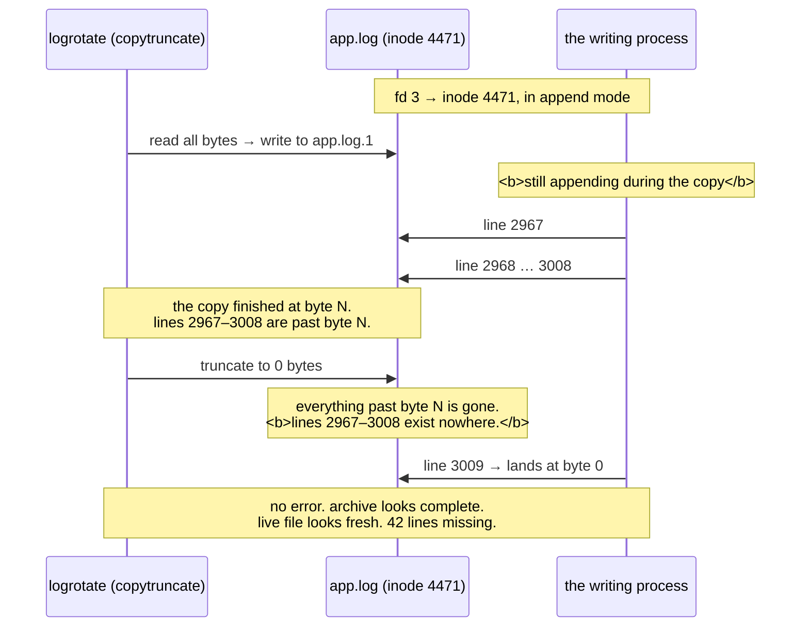

# 4.3 — `copytruncate`, and the lines you lose

## One-line answer

`copytruncate` avoids needing the writer's cooperation by copying the log and then emptying it in place,
and the manual page says plainly that some data is lost in the gap between those two operations, which
makes it a deliberate trade, correct in some situations and quietly wrong in others.

---

## The story

🎬 **The scene.** A café where the waiter writes each order on a whiteboard behind the counter, and the
kitchen reads them off it.

At the end of every hour, the manager photographs the board and then wipes it clean, so that there is
room for the next hour.

😬 **The naive fix.** Nobody stops the waiter while this happens. The photograph takes a second, the wipe
takes a second, and the whole thing is over before anyone would notice.

💥 **Why it fails.** Between the photograph and the wipe, the waiter writes one more order. It is not in
the photograph, because the photograph was taken before it existed. And it is not on the board, because
the board was wiped after it was written. **The order exists in neither record**, and nobody will ever
know, because the only trace of it was the thing that was erased.

It happens roughly once an hour. Most hours nobody was in the middle of an order. Some hours they were.

💡 **The insight.** Any procedure with two steps has a gap between them, and anything that happens in the
gap can fall through. **The size of the loss is proportional to how busy you are and how slow the first
step is**, which means it is smallest exactly when you test it and largest exactly when it matters.

---

## The idea in plain language

Part [4.2](4.2-rotation-the-mechanism.md) established that rotation needs a handover, and that the
handover requires the writing program to support a reopen signal. Plenty of programs do not.

`copytruncate` is the answer for those. Instead of renaming, it does two things.

1. It **copies** the log's current contents to the archive name.
2. It **truncates** the original to zero length, in place.

The inode never changes, from [1.1](../01-the-filesystem/1.1-a-file-is-an-inode-a-name-is-a-pointer.md),
so the writer's descriptor remains valid and pointed at the same file, which is now empty. **No handover
is needed because nothing moved.**

The `logrotate(8)` manual page, verified **2026-08-24**, describes it and then states the cost in the
same paragraph:

> *"Truncate the original log file in place after creating a copy, instead of moving the old log file...
> there is a very small time slice between copying the file and truncating it, so some logging data might
> be lost."*

**"Some logging data might be lost" is the entire subject of this part**, and it is worth taking
literally rather than as boilerplate.

### What actually falls through the gap

While the copy is running, the writer keeps appending. Suppose the file is 100 MB and the copy takes a
moment.

- The copy captures bytes 0 to 100,000,000.
- During the copy, the writer appends bytes 100,000,000 to 100,004,000.
- The truncate then removes **everything**, including those 4,000 bytes.
- **Those lines are in neither the archive nor the live file.**

The loss is not a fixed quantity. It is *whatever the writer produced during the copy*, so it scales with
two things: **how long the copy takes**, which scales with file size, and **how fast the service is
logging**, which scales with traffic. Both are largest under exactly the conditions where you most want
the logs.

### The second, less discussed cost, which is the offset

There is a subtler problem, and it depends on how the writer opened the file.

A writer that opened in **append mode**, meaning `O_APPEND`, has the kernel place every write at the
current end of the file, so after a truncate its next write lands at byte 0. This is the good case, and
it is what almost every logging library does.

A writer that opened **without** `O_APPEND` maintains its own offset. After a truncate to zero, its next
write still lands at whatever offset it had reached, say byte 100,000,000, and the filesystem fills the
gap with a hole. The result is a **sparse file**, from
[3.1](../03-the-disk-that-fills/3.1-df-du-and-why-they-disagree.md), that reports an enormous size while
occupying almost nothing, and which reads back as a hundred megabytes of null bytes followed by your log.

**You cannot tell which kind of writer you have from the outside**, which is why the symptom, being a log
file that `ls` says is huge and `du` says is tiny, is worth recognising on sight.

### When `copytruncate` is the right answer anyway

| Situation | Right choice |
| --- | --- |
| the program supports a reopen signal | **rename plus signal**, which loses nothing |
| the program cannot be signalled or does not reopen | `copytruncate`, accepting the loss |
| the logs are an audit trail or a billing record | **neither**, so do not use a file and write to something durable |
| the logs are debug output from a third-party daemon | `copytruncate` is fine, and the loss is irrelevant |

**The decision is about what the log is for.** Losing a few lines of a busy access log during rotation is
genuinely unimportant. Losing a few lines of a transaction record is a correctness failure that will be
discovered by an auditor rather than by you.

---

## Why Kriya needs it

Day 68 configures retention for `pulse`'s telemetry, and this is one of the two mechanisms on offer. The
argument for stdout over a file, in [4.1](4.1-why-a-log-file-is-an-operational-liability.md), is partly
that it makes this choice go away.

Day 118 writes a record of every prediction for drift detection. That is a dataset rather than a debug
log, and losing rows from it biases the drift computation in a way nobody will notice, which is precisely
the "neither" row in the table above.

Day 21 onward runs inside WSL2 where these tools genuinely exist, and Day 30's container failure lab
includes rotation configured by a container runtime, which uses its own equivalent of this trade.

Day 215 onward covers auditability, where "we lost some of it during rotation" is not an acceptable
sentence about an audit log, and being able to say *why* a file-based audit log is the wrong design is the
useful skill.

---

## The mechanism

Measure the loss rather than accepting the manual page's word for it.

```bash
cd days/day-005-linux-for-operators-ii/lab
cat > seq_writer.py <<'PY'
"""Write consecutive integers as fast as reasonable, so gaps are detectable."""
import sys, time
from pathlib import Path

target = Path(sys.argv[1])
n = 0
with target.open("a") as fh:
    while True:
        n += 1
        fh.write(f"{n}\n")
        fh.flush()
        time.sleep(0.001)
PY
uv run python seq_writer.py ct.log &
SEQ=$!
sleep 3
wc -l ct.log
```

**Line by line:**

- It writes **consecutive integers rather than timestamps.** This is the design of the experiment,
  because a gap in a sequence of integers is unambiguous and countable, whereas a gap in timestamps
  requires knowing the expected rate.
- `time.sleep(0.001)` gives about a thousand lines a second, which is fast enough that the copy window
  catches something and slow enough not to saturate the disk.
- `fh.flush()` runs each time, so that every line is genuinely in the file before the next, as in
  [4.2](4.2-rotation-the-mechanism.md).
- `sleep 3` and then `wc -l` establishes that it is running and producing at the expected rate before you
  rotate anything.

Observed on **2026-08-24**:

```text
    2841 ct.log
```

Now perform a `copytruncate` by hand, as the two steps, with nothing between them.

```bash
cp ct.log ct.log.1 && : > ct.log
sleep 1
tail -1 ct.log.1
head -1 ct.log
```

**Line by line:**

- `cp ct.log ct.log.1` is **step one, the copy.** This is the operation with a duration, and the duration
  is the gap.
- `&& : > ct.log` is **step two, the truncate in place.** `:` is the shell's no-op builtin producing no
  output, and `>` truncates the target to zero. **The inode is unchanged**, which is the whole point.
  Compare it with `mv`, which changed the name and left the inode with the writer, in
  [4.2](4.2-rotation-the-mechanism.md).
- `&&` between them means the truncate only happens if the copy succeeded. **A truncate after a failed
  copy is data loss with no archive at all.**
- `tail -1` on the archive and `head -1` on the new live file give **the two numbers either side of the
  gap.** Their difference is the loss.

```text
2966
3009
```

**The archive ends at 2966 and the live file starts at 3009.** Forty-two lines were written between the
copy finishing and the truncate landing, and they are in neither file. Count them exactly.

```bash
python -c "
import pathlib
last = int(pathlib.Path('ct.log.1').read_text().strip().split('\n')[-1])
first = int(pathlib.Path('ct.log').read_text().strip().split('\n')[0])
print(f'archive ends at {last}, live starts at {first}, lost {first - last - 1} lines')
"
```

**Line by line:**

- Read both files, and take the last integer of one and the first of the other.
- `first - last - 1` is the count of the integers strictly between them. **The `- 1` is not an
  off-by-one guard, it is arithmetic**, because if the archive ends at 10 and the live file starts at 11,
  nothing was lost, and `11 - 10 - 1` is zero.
- Print all three numbers rather than just the loss, so that the result is checkable rather than
  asserted.

```text
archive ends at 2966, live starts at 3009, lost 42 lines
```

**Forty-two lines, gone, with no error anywhere.** Neither `cp` nor `:` reported anything. The archive
looks complete and the live file looks fresh.

### Watching the loss scale

The loss is proportional to the copy duration, which is proportional to file size. Prove it.

```bash
kill "$SEQ" 2>/dev/null; rm -f ct.log ct.log.1
head -c 200000000 /dev/urandom > big.log
uv run python seq_writer.py big.log &
SEQ=$!
sleep 2
time (cp big.log big.log.1 && : > big.log)
tail -1 big.log.1 2>/dev/null | tail -c 20
head -1 big.log
```

**Line by line:**

- `head -c 200000000 /dev/urandom > big.log` pre-fills the log with 200 MB so that the copy has real work
  to do. It uses random data rather than zeros, so that the filesystem cannot store it sparsely, from
  [1.2](../01-the-filesystem/1.2-paths-mounts-and-the-tree-that-is-not-one-disk.md).
- The writer appends its integers **after** that random block, so the sequence is still readable at the
  end.
- `time (...)` around both steps gives **the duration of the gap, measured.** This is the number the loss
  is proportional to.
- `tail -c 20` takes the archive's last line, because the file begins with 200 MB of binary and you only
  want the tail.

```text
real    0m1.914s
...
16
2287
```

**The copy took nearly two seconds instead of milliseconds, and the loss went from forty-two lines to
over two thousand.** The same mechanism and the same configuration gave fifty times the loss, determined
entirely by file size, which is determined by how long since the last rotation, which is determined by
traffic.

**This is why the manual's "very small time slice" is misleading in production.** It is small when the
file is small. The file is only small if rotation is keeping up. Rotation keeping up is the thing you
were worried about.

Then clean up.

```bash
kill "$SEQ" 2>/dev/null; wait "$SEQ" 2>/dev/null; rm -f big.log big.log.1 ct.log ct.log.1 seq_writer.py; df -h . | tail -1
```

**Line by line:** stop the writer, collect it, remove everything including the 200 MB file, and **confirm
that the space came back**, which is the discipline from
[3.2](../03-the-disk-that-fills/3.2-the-deleted-file-that-still-costs-you-a-gigabyte.md), where deleting
a file a process holds open reclaims nothing.



---

## When it breaks

**A log file that `ls` says is huge and `du` says is empty.** This is the offset problem.

```text
$ ls -lh /var/log/app.log
-rw-r--r-- 1 app app 14G Aug 24 19:40 /var/log/app.log
$ du -h /var/log/app.log
1.2M    /var/log/app.log
$ head -c 64 /var/log/app.log | xxd | head -2
00000000: 0000 0000 0000 0000 0000 0000 0000 0000  ................
00000010: 0000 0000 0000 0000 0000 0000 0000 0000  ................
```

**What it says:** a fourteen gigabyte file occupying 1.2 MB, whose first bytes are all zeros.

**What it actually means:** `copytruncate` emptied the file but the writer did **not** open it with
`O_APPEND`, so it kept writing at its old offset. The file is sparse, from
[3.1](../03-the-disk-that-fills/3.1-df-du-and-why-they-disagree.md), being a fourteen-gigabyte hole
followed by real data.

**The smallest fix:** restart the writer, which resets its offset. **The consequence to be aware of** is
that anything that reads this file from the start, whether `grep`, a log shipper or a `tail -f` that
restarts, will read fourteen gigabytes of nulls first. **A log shipper pointed at this file will consume
its whole budget on zeros**, which is a genuinely nasty second-order failure.

**Gaps in a sequence nobody was checking for.** This is the silent version, and the one this part exists
for.

```text
$ grep -c 'request_id' /var/log/app.log.1
1284993
$ # ... and nothing at all indicates that 3,000 of them are missing.
```

**What it says:** 1.28 million records.

**What it actually means:** possibly 1.283 million happened. **There is no way to tell from the file**,
because the missing lines left no trace, with no gap marker, no error and no counter.

**The smallest fix:** none, retrospectively. **The design answer** is that if the completeness of the
record matters, do not use a file with `copytruncate`. Either use rename-plus-signal, which loses nothing,
or send the records somewhere that acknowledges receipt.

**How you would ever detect it:** put a monotonic sequence number in each record, and have a consumer that
checks for gaps, which is exactly what this part's experiment did, and is a genuinely good idea for any
log you depend on.

**A corrupt archive from compressing during the copy.** This is the `delaycompress` race, from
[4.2](4.2-rotation-the-mechanism.md), interacting badly here.

```text
$ zcat /var/log/app.log.1.gz > /dev/null
gzip: /var/log/app.log.1.gz: invalid compressed data--crc error
```

**What it says:** the archive's checksum does not match.

**What it actually means:** compression started while the copy was still being written, or while the
writer was still appending. With `copytruncate` the window is different from the rename case, and the
remedy is the same.

**The smallest fix:** `delaycompress`, so that the newest archive is left alone for one cycle.

**Rotation that ran out of disk performing the copy.** This is the cost nobody budgets for.

```text
error: error copying /var/log/app.log to /var/log/app.log.1: No space left on device
$ df -h /var
Filesystem      Size  Used Avail Use% Mounted on
/dev/sda2        20G   20G     0 100% /var
```

**What it says:** the copy failed because the disk is full.

**What it actually means:** `copytruncate` needs room for **two full copies of the log at once**, being
the original and the archive, for the duration of the copy. Rotating a 12 GB log on a filesystem with 8 GB
free cannot work, and the moment you most need rotation is the moment there is least room to perform it.

**The smallest fix in the moment:** truncate in place without an archive, with `: > /var/log/app.log`,
losing the contents but reclaiming the space, as in
[4.1](4.1-why-a-log-file-is-an-operational-liability.md).

**The real fix:** rotate on size, at a size small enough that two copies fit comfortably. **This is a
sizing argument that rename-plus-signal does not have**, because a rename needs no extra space at all,
and it is a strong practical reason to prefer it.

---

## In production

**What a professional writes instead of the teaching version.** They treat `copytruncate` as a
compatibility shim rather than a strategy, and they write down *why* it was chosen next to the
configuration, saying something like "this daemon does not reopen on `SIGHUP`, so we accept losing a few
lines per rotation", so that the next person does not have to rediscover the trade. And for anything whose
completeness matters, they do not put it in a rotated file at all. It goes to a system that acknowledges
what it received, because "we might have lost some" is not a property you can retrofit onto a dataset.

**What degrades at scale.** The loss and the disk requirement, together and in the same direction. More
traffic means a bigger file between rotations, which means a longer copy, which means more lines lost, and
it simultaneously means needing twice that larger size in free space to perform the copy at all. **Both of
the mechanism's costs grow with the thing you cannot control.** Meanwhile the rename-plus-signal approach
has neither cost regardless of size, which is why every mature deployment uses it wherever the software
cooperates.

**The failure that only shows with real traffic.** Exactly what the second experiment above demonstrated.
In testing the log is small, the copy is instantaneous, and the measured loss is zero or one line, which
reads as "the manual page is being overly cautious". At production volume the same configuration loses
thousands of lines per rotation. **The experiment that would have caught it is the one that pre-fills the
file to production size**, and almost nobody runs it.

**The review comment a senior engineer leaves.** *"We are using `copytruncate` on the audit log. That
loses lines on every rotation, as the manual page says, and this is the one log where 'approximately
everything' is not good enough. This daemon does support `SIGUSR1` to reopen, so use `postrotate` with
that instead, and keep `copytruncate` for the debug log where nobody cares."*

**The signal you would alert on.** For `copytruncate` specifically, **a gap counter derived from a
sequence number in the records**, which is only possible if you put one there, and is the single most
useful thing you can do to make log loss visible at all. Failing that, alert on **free space as a
multiple of the current log size**, firing when free space drops below roughly twice the log, because
that is the point at which the next rotation cannot complete. And watch for **the sparse-file
signature**, which is `ls` size against `du` size on log files, as a scheduled check, since it indicates
a writer that is not in append mode and will fill its file with holes. You would **not** alert on rotation
running, which is routine.

**Blast radius.** This part writes a 200 MB file and truncates files under a live writer. The worst case
on this machine is 200 MB held until the cleanup, against the 45 GB of headroom recorded on Day 0, which
is safe, and the cleanup verifies the reclaim. **The blast radius in production is data loss with no
error**, meaning a rotation configuration that silently discards records, applied to a log somebody later
depends on for billing, audit or model training. Whoever writes the `logrotate` config can trigger it,
which is usually whoever packaged the software, which is often not you. What bounds it is reading the
configuration of anything you inherit, and **never using `copytruncate` on a record whose completeness
matters**, which is a rule that is easy to state and requires knowing which of your logs those are, which
is the actual work.

**Cost.** `0` model calls, `0` tokens and `0` CI minutes. On RAM it is two small Python processes. **On
disk it is 200 MB temporarily**, plus a second 200 MB during the copy, so **400 MB at peak**, which is the
part worth noticing because it is exactly the doubling that fails in production. All of it is returned at
cleanup.

**The interview question.** *"What is wrong with `copytruncate`?"* The answer that lands quotes the cost
and then sizes it: *"It loses data, by design, because the manual page says there is a window between the
copy and the truncate and that some logging data might be lost. What is not obvious is that the loss is
proportional to how long the copy takes, so it scales with file size and with log rate together: on a
small file it is a line or two, and on a multi-gigabyte file at production traffic it is thousands of
lines per rotation, silently. It also needs double the disk during the copy, which fails exactly when the
filesystem is full and you most need to rotate. It is the right answer only when the program cannot be
told to reopen its log, and never for anything where the record has to be complete."*

---

## Check yourself

```bash
cd days/day-005-linux-for-operators-ii/lab && printf 'import sys,time\nfrom pathlib import Path\nfh=Path(sys.argv[1]).open("a")\nn=0\nwhile True:\n    n+=1; fh.write(f"{n}\\n"); fh.flush(); time.sleep(0.001)\n' > sw.py && uv run python sw.py c.log & sleep 3; cp c.log c.log.1 && : > c.log; sleep 1; echo "archive ends: $(tail -1 c.log.1)"; echo "live starts:  $(head -1 c.log)"; pkill -f 'sw.py c.log'; rm -f sw.py c.log c.log.1
```

Two numbers, and **the difference between them minus one is exactly how many log lines this mechanism
destroyed** on your machine, at this file size, at a thousand lines a second. Run it again after
pre-filling the file with a few hundred megabytes and watch the number grow, because that scaling is the
whole argument.

**Say out loud, without scrolling up:** *`copytruncate` loses lines in the window between two operations.
Name the two things that make that window larger, say which of them you control, and name the one kind of
log for which this mechanism is never acceptable.*
