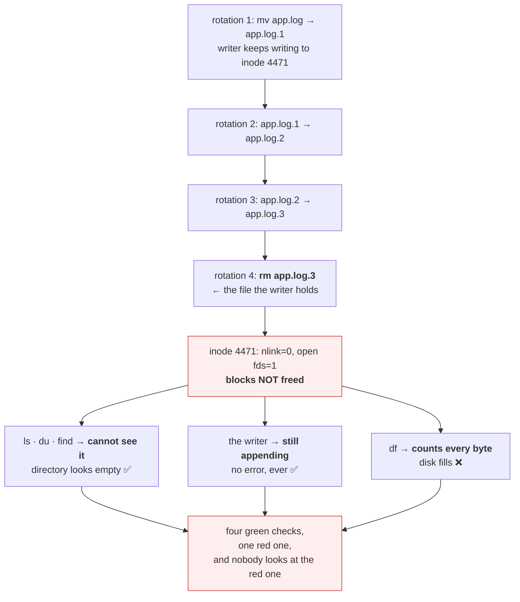

# 4.4 — The rotation that did not free anything

## One-line answer

Today's second deliberate failure, and the day's synthesis: a rotation that renames without signalling
eventually deletes the file the process is still writing to, so the disk keeps filling, the log directory
looks small, and **every mechanism in this day's four sections is required to explain it.**

---

## The story

🎬 **The scene.** A hotel with a laundry chute on every floor. Sheets go down the chute into a basket in
the basement; every morning the basket is emptied and the sheets are washed.

One morning a porter, tidying, decides the basement is untidy and moves the basket three metres to the
left. He does not tell anyone, because moving a basket is not the sort of thing you tell people about.

😬 **The naive fix.** For a week, the morning shift empties the basket. It is always empty, which they
take as good news — a quiet week.

💥 **Why it fails.** The chute still ends where it always did. Sheets have been piling on the basement
floor for seven days, out of sight behind a pillar. The basket is empty because nothing is going into it.
**Every observation was correct and every conclusion was wrong**, because everybody was measuring the
basket and the sheets were no longer using it.

By the time somebody walks round the pillar, the pile has blocked a fire door.

💡 **The insight.** When a process is diverted without anyone being told, the *measurements* keep working
perfectly and stop measuring the thing. An empty basket is consistent with "no sheets" and with "sheets
going somewhere else", and the difference is invisible from the basket. **The failures that last longest
are the ones where every instrument still reads normal.**

---

## The idea in plain language

This part combines four things you have already met, and the combination is worse than any of them:

- rotation renames the log and the writer does not notice
  ([4.2](4.2-rotation-the-mechanism.md));
- so the writer keeps appending to the renamed file, which rotation thinks is archived;
- eventually the numbered chain rolls over and rotation **deletes** that file
  (`rotate <count>`);
- but the writer still holds it open, so the blocks are not freed
  ([3.2](../03-the-disk-that-fills/3.2-the-deleted-file-that-still-costs-you-a-gigabyte.md));
- and the file has no name, so `ls` and `du` cannot see it
  ([1.1](../01-the-filesystem/1.1-a-file-is-an-inode-a-name-is-a-pointer.md));
- while `df` counts every byte ([3.1](../03-the-disk-that-fills/3.1-df-du-and-why-they-disagree.md)).

**The result is a system where the log directory is small, the rotation job succeeds, the log files look
recent, and the disk fills anyway.**

### Why this is the day's synthesis rather than just another failure

Every one of this day's four sections is load-bearing here. Remove any one and the failure is
inexplicable:

| Section | What it contributes |
| --- | --- |
| 1 — the filesystem | a descriptor follows the inode, not the name; `unlink` needs two counters at zero |
| 2 — permissions | the rotation job's ability to rename and delete comes from write on the *directory* |
| 3 — the disk that fills | `df` counts what `du` cannot see, and that gap is the diagnosis |
| 4 — rotation | the handover step, and what happens when it is missing |

**This is what a day's parts are for.** No single mechanism here is difficult; the difficulty is entirely
in the combination, and the combination is what you meet at three in the morning.

### Why it survives so long in real systems

Because every check a reasonable person would run comes back clean:

- `ls -lh /var/log/pulse/` — a handful of files, none enormous. ✅
- `du -sh /var/log/pulse/` — a couple of gigabytes. ✅
- `systemctl status logrotate` — succeeded this morning. ✅
- the rotation config — correct, with a sensible `rotate` count. ✅
- `df -h /var` — **95% and climbing.** ❌

Four green checks and one red one, and the four green ones are the ones people look at. The gap between
`df` and `du` is the only evidence, and computing it is not something anybody does by reflex until they
have been through this once.

---

## Why Kriya needs it

Day 30's container failure lab includes a full disk, and this is one of the two shapes it takes — the one
where nothing looks wrong.

Day 68 configures retention for `pulse`, and the verification step on that day is precisely "does the
rotation actually free space", which is a question this part teaches you to ask.

Day 76 builds the first capacity alert, and the design decision — alert on `df`, not on `du` — is
justified by this failure and by nothing else.

Day 84's incident lab hands you a symptom with no cause. "The disk is full and the log directory is
small" is one of them, and every step of the diagnosis is in this part.

---

## The mechanism

**This is a deliberate failure.** Read the whole procedure including the cleanup before you start. It
runs in this day's `lab/` and consumes a bounded amount of disk.

Build the broken rotation — the one with no step 3 — and run it repeatedly until the chain rolls over.

```bash
cd days/day-005-linux-for-operators-ii/lab
cat > chatty.py <<'PY'
"""A service-shaped log writer: holds the file open, appends steadily, never reopens."""
import os, sys, time
from pathlib import Path

target = Path(sys.argv[1])
line = "x" * 4000  # a fat log line, so the file grows visibly
print(f"[chatty] pid={os.getpid()} writing to {target}", flush=True)
n = 0
with target.open("a") as fh:
    while True:
        n += 1
        fh.write(f"{n} {line}\n")
        fh.flush()
        time.sleep(0.002)
PY
uv run python chatty.py app.log &
CHATTY=$!
sleep 3
ls -lh app.log && df -h . | tail -1
```

**Line by line:**

- `line = "x" * 4000` — a deliberately fat line, about 4 KB, so the file grows fast enough to see in
  `df -h` without waiting. Real structured log lines are a few hundred bytes; this is compressing the
  timescale, not misrepresenting the mechanism.
- `time.sleep(0.002)` — roughly 500 lines a second, so about 2 MB/s. **Check your free space** before
  running: this consumes a few hundred megabytes over the course of the exercise.
- `with target.open("a")` and no signal handling at all — **this is the whole point.** It is exactly the
  shape of software that does not support a reopen signal, which is most software.
- `ls -lh` and `df` together, as the baseline. **Without a before-reading the after-readings mean
  nothing.**

Observed on **2026-08-24**:

```text
[chatty] pid=38220 writing to app.log
-rw-r--r-- 1 nisha None 5.8M Aug 24 20:02 app.log
C:/Program Files/Git  118G   73G   45G  63% /
```

Now the broken rotation, run four times with a `rotate 3` chain:

```bash
cat > badrotate.sh <<'SH'
#!/usr/bin/env bash
# BREAKAGE: rename + create + delete the oldest. NO signal to the writer. rotate=3.
set -uo pipefail
LOG="$1"
rm -f "$LOG.3"
[ -f "$LOG.2" ] && mv "$LOG.2" "$LOG.3"
[ -f "$LOG.1" ] && mv "$LOG.1" "$LOG.2"
mv "$LOG" "$LOG.1"
touch "$LOG"
echo "rotated. on-disk log files:"
ls -lh "$LOG"* 2>/dev/null | awk '{print "  ", $5, $9}'
SH
chmod +x badrotate.sh
```

**Line by line:**

- `rm -f "$LOG.3"` — **delete the oldest first.** This is `rotate 3`: three archives kept, and the fourth
  falls off the end. **This line is where the failure becomes irreversible.**
- `[ -f "$LOG.2" ] && mv ...` — shift each archive up one, guarded so the first few runs do not error on
  files that do not exist yet. `&&` rather than `if` because it is one condition and one action.
- `mv "$LOG" "$LOG.1"` — the rename that the writer will not notice
  ([4.2](4.2-rotation-the-mechanism.md)).
- `touch "$LOG"` — create the fresh, empty log that nothing will ever write to.
- **No `postrotate`, no signal.** That absence is the breakage.
- `set -uo pipefail` without `-e`, because the `[ -f ... ]` tests legitimately fail on early runs
  ([Day 4, part 3.1](../../../day-004-linux-for-operators-i/parts/03-exit-codes/3.1-the-exit-code-is-the-whole-return-value.md)).
- `awk '{print "  ", $5, $9}'` — size and name only, so the output is a compact table rather than nine
  columns.

Run it four times, watching both instruments:

```bash
for i in 1 2 3 4; do
  echo "=== rotation $i ==="
  ./badrotate.sh app.log
  echo -n "  du of directory: "; du -sh . | cut -f1
  echo -n "  df of filesystem: "; df -h . | tail -1 | awk '{print $3" used, "$4" avail"}'
  sleep 4
done
```

**Line by line:**

- Four rotations with four seconds of writing between them, so the writer has time to add another 8 MB
  each cycle.
- **`du` on the directory and `df` on the filesystem, printed side by side every cycle.** That pairing is
  the entire diagnostic, and running them together is what makes the divergence visible rather than
  something you would have to notice retrospectively.
- `cut -f1` on `du -sh` output takes the size and drops the path; `awk` on `df` takes the used and
  available columns. **Trimming the output to the two numbers that change** is what turns four screens of
  text into a readable trend.

```text
=== rotation 1 ===
rotated. on-disk log files:
   0 app.log
   5.9M app.log.1
  du of directory: 5.9M
  df of filesystem: 73G used, 45G avail
=== rotation 2 ===
rotated. on-disk log files:
   0 app.log
   0 app.log.1
   14M app.log.2
  du of directory: 14M
  df of filesystem: 73G used, 45G avail
=== rotation 3 ===
rotated. on-disk log files:
   0 app.log
   0 app.log.1
   0 app.log.2
   22M app.log.3
  du of directory: 22M
  df of filesystem: 73G used, 45G avail
=== rotation 4 ===
rotated. on-disk log files:
   0 app.log
   0 app.log.1
   0 app.log.2
   0 app.log.3
  du of directory: 4.0K
  df of filesystem: 73G used, 45G avail
```

**Read rotation 4 and stop.** Every log file on disk is zero bytes. `du` reports four kilobytes for the
whole directory. The rotation script printed a tidy, plausible list.

**And the writer is still writing.** The file it holds — the one that was `app.log.3` until the fourth
`rm -f` deleted it — has no name at all now. It is invisible to `ls`, to `du` and to `find`, and it is
growing at 2 MB/s.

Confirm it is still growing, which is the fact the directory listing denies:

```bash
sleep 5
ls -lh app.log*
du -sh .
kill -0 "$CHATTY" && echo "writer is still alive and still writing"
```

**Line by line:**

- `kill -0 <pid>` — **send signal zero**, which sends nothing at all and merely checks whether the process
  exists and you may signal it. It is the standard "is this process alive" test and it costs nothing
  ([Day 4, part 2.1](../../../day-004-linux-for-operators-i/parts/02-signals/2.1-what-a-signal-actually-is.md)).

```text
-rw-r--r-- 1 nisha None 0 Aug 24 20:03 app.log
-rw-r--r-- 1 nisha None 0 Aug 24 20:03 app.log.1
-rw-r--r-- 1 nisha None 0 Aug 24 20:03 app.log.2
-rw-r--r-- 1 nisha None 0 Aug 24 20:03 app.log.3
4.0K    .
writer is still alive and still writing
```

**Four empty files, a four-kilobyte directory, and a process appending megabytes a second to something
none of these commands can see.** On this machine's 45 GB of headroom the `df` column does not move
perceptibly; on a 20 GB `/var` it would be climbing steadily with nothing to blame.

### Finding the invisible file

```bash
lsof +L1 2>/dev/null | grep -i chatty || ls -l /proc/"$CHATTY"/fd/ 2>/dev/null | grep -i deleted || echo "neither lsof nor /proc/fd available on this machine — see the note"
```

**Line by line:** try `lsof +L1` — files with a link count below one
([3.2](../03-the-disk-that-fills/3.2-the-deleted-file-that-still-costs-you-a-gigabyte.md)) — then fall
back to `/proc/<pid>/fd`, then to an honest message. **Chaining fallbacks with `||` rather than assuming
one exists** is what makes a diagnostic command usable on more than one kind of machine.

On Linux:

```text
python  38220 nisha    3w   REG  253,1  184320000     0 1180221 /lab/app.log.3 (deleted)
```

**`NLINK 0`, 184 MB, and `(deleted)` on a path that no longer exists.** One line, complete diagnosis.

⚠️ **On this Windows machine neither is available** — Git Bash has no `lsof` and a partial `/proc`
([3.2](../03-the-disk-that-fills/3.2-the-deleted-file-that-still-costs-you-a-gigabyte.md)). **Record that
in `docs/INCIDENTS.md`**: you can produce this failure here and you cannot diagnose it here, which is a
real limitation of your primary machine and one more reason WSL2 arrives on Day 21.

### The fix, and proving it

```bash
kill "$CHATTY"; wait "$CHATTY" 2>/dev/null
df -h . | tail -1
rm -f app.log app.log.1 app.log.2 app.log.3
```

**Line by line:** killing the writer closes every descriptor it holds, which is what actually frees the
space ([3.2](../03-the-disk-that-fills/3.2-the-deleted-file-that-still-costs-you-a-gigabyte.md)). Then
`df` to confirm the reclaim before removing the empty files. **Order matters**: check the reclaim while
the evidence is still fresh.

Then repeat the whole exercise with `writer_hup.py` from [4.2](4.2-rotation-the-mechanism.md) and a
`badrotate.sh` that ends with `kill -HUP`, and watch `du` and `df` stay in agreement through all four
cycles. **That comparison is the point of the day** — same script, one added line, and the failure
disappears.

```bash
rm -f chatty.py badrotate.sh && ls && git status --short
```

**Line by line:** remove the lab files and prove the tree is clean. A drill that leaves the system
modified is an incident you caused (Day 3, §4).



---

## When it breaks

**The disk that fills with an empty log directory.** The production form:

```text
$ df -h /var
Filesystem      Size  Used Avail Use% Mounted on
/dev/sda2        50G   47G  600M  99% /var
$ du -shx /var/log
1.4G    /var/log
$ ls -lh /var/log/pulse/
-rw-r----- 1 pulse pulse    0 Aug 24 03:00 app.log
-rw-r----- 1 pulse pulse    0 Aug 23 03:00 app.log.1
-rw-r----- 1 pulse pulse    0 Aug 22 03:00 app.log.2.gz
```

**What it says:** 47 GB used, 1.4 GB in the log directory, and every log file empty.
**What it actually means:** roughly 45 GB is in files with no names, held open by a process that has been
running since before the first rotation. **The `Aug 24 03:00` modification times are the second tell** —
every file was last touched at rotation time and never since, because the writer has not written to any
of them.
**The smallest fix:** restart the service. The space returns instantly.
**The real fix:** the `postrotate` signal ([4.2](4.2-rotation-the-mechanism.md)), or `copytruncate`
([4.3](4.3-copytruncate-and-the-lines-you-lose.md)) if the program cannot be signalled.

**The `postrotate` that has been failing silently for months.** How it gets into that state:

```text
$ grep -A3 postrotate /etc/logrotate.d/pulse
    postrotate
        /bin/kill -HUP $(cat /run/pulse.pid 2>/dev/null) 2>/dev/null || true
    endscript
$ ls -l /run/pulse.pid
ls: cannot access '/run/pulse.pid': No such file or directory
```

**What it says:** the config has a `postrotate` block, and the pid file it depends on does not exist.
**What it actually means:** `cat` produces nothing, `kill` is invoked with no argument and fails, `2>&
/dev/null` hides the error, and `|| true` makes the whole thing succeed. **Every rotation for however
long has renamed the log and told nobody**, and the rotation job has reported success every time.
**The smallest fix:** point it at the right pid source — `systemctl kill -s HUP pulse.service` if systemd
owns the process.
**The design lesson, which is uncomfortable:** the `|| true` exists for a good reason — a rotation that
aborts leaves logs unrotated forever, which is worse. **The robustness and the silence are the same
line**, and the only way out is to monitor the outcome rather than the exit code, which is the alert
below.

**`logrotate` reporting success while doing nothing.** The version where the config is wrong:

```text
$ logrotate -v /etc/logrotate.d/pulse
reading config file /etc/logrotate.d/pulse
Handling 1 logs
rotating pattern: /var/log/pulse/*.log after 1 days (7 rotations)
  log /var/log/pulse/app.log does not need rotating (log has already been rotated)
$ echo $?
0
```

**What it says:** it already rotated, exit zero.
**What it actually means:** `logrotate` tracks state in `/var/lib/logrotate/status` and will decline to
rotate twice in one period. **This is correct behaviour** and it means "success" from this command does
not imply "space was freed".
**Worth knowing:** `-v` is verbose and `-d` is dry-run
([4.2](4.2-rotation-the-mechanism.md)); `-f` forces a rotation regardless of the schedule, which is what
you want when testing a config change rather than waiting a day to find out.

**The container whose log filled the node.** The same failure one layer up:

```text
$ kubectl describe node worker-3 | grep -A2 DiskPressure
  DiskPressure     True    KubeletHasDiskPressure    kubelet has disk pressure
$ ls -lh /var/lib/docker/containers/9f3c*/9f3c*-json.log
-rw-r----- 1 root root 42G Aug 24 20:30 9f3c...-json.log
```

**What it says:** the node has disk pressure and one container's log file is 42 GB.
**What it actually means:** the container runtime's own log rotation was not configured, or its size limit
was not set, so the runtime has been collecting stdout into an unbounded file. **This is the failure
`pulse` avoids by writing to stdout only if the runtime is configured to bound it** — stdout moves the
problem to the collector, and the collector needs its own limit.
**The smallest fix:** set the runtime's log driver options — a maximum size and a maximum file count. On
Day 25 that is a `compose` setting; on Day 33 it is a kubelet configuration.
**Worth noting:** the pressure condition then causes the kubelet to *evict pods*, so one workload's log
volume becomes every workload's outage. Day 42's ephemeral storage limits exist for this.

---

## In production

**What a professional writes instead of the teaching version.** They verify rotation by its **effect**
rather than by its exit code: after a rotation, does the current log's modification time advance, and does
the filesystem's used figure drop? Both are one command and both are monitorable, and neither depends on
the rotation tool telling the truth about itself. The habit generalises well beyond logs — **check that
the outcome happened, not that the job ran** — and it is the difference between an alert that catches this
and one that would not have.

**What degrades at scale.** Detectability, in the same way as
[3.2](../03-the-disk-that-fills/3.2-the-deleted-file-that-still-costs-you-a-gigabyte.md) but worse,
because here the failure is *created by a scheduled job* and therefore recurs on every host that runs it.
A packaging change, a path change, a service manager migration — any of these can break the `postrotate`
across a whole fleet at once, and the fleet will fill its disks in a staggered fashion over the following
days as each host reaches its threshold. **The incident looks like a slow rolling failure with no common
cause**, which is the hardest shape to diagnose, and the common cause is a config file nobody edited
recently.

**The failure that only shows with real traffic.** The rate. At low volume the orphaned file grows slowly
and the machine reaches its disk threshold in months — by which time the service has been restarted for
unrelated reasons and the space has silently returned, so the bug is never observed. **Restarts hide
this**, and a service with a long uptime is the one where it surfaces. That is a genuinely perverse
property: the more stable your service, the more likely this is to bite you.

**The review comment a senior engineer leaves.** *"We have `rotate 7` and a `postrotate` that has not
worked since we moved to systemd, so for the last two months every rotation has orphaned a file and every
node is holding a week of logs it cannot see. The reason nobody noticed is that the nodes get replaced
every fortnight. Fix the signal, and add the check that actually catches this: alert when the current log
file's mtime is older than the rotation interval."*

**The signal you would alert on.** Three, and they are cheap:

- **Age of the current log file's last modification.** If `app.log` has not been written to in an hour on
  a service that is serving traffic, the handover failed. **This is the single best detector** — it fires
  on the cause rather than the consequence, hours or days before the disk fills.
- **`df` used, with a projection** ([3.1](../03-the-disk-that-fills/3.1-df-du-and-why-they-disagree.md)),
  which catches this along with every other capacity problem. Note it must be `df`; a `du`-derived metric
  is structurally blind to this failure, and that is the strongest argument for the choice.
- **Total size of open-deleted files** ([3.2](../03-the-disk-that-fills/3.2-the-deleted-file-that-still-costs-you-a-gigabyte.md)),
  which names this specific failure directly and should be approximately zero.

You would **not** alert on the rotation job's exit code, for the `|| true` reason above — it is the signal
most likely to be green during this exact failure.

**Blast radius.** This part deliberately creates an unreclaimable, invisible, growing file. Worst case on
this machine: a `chatty.py` left running writes about 2 MB/s into a file nothing can see, indefinitely —
which against 45 GB of headroom is roughly six hours to fill the disk **if you walk away from it**. Who
can trigger it: you, by skipping the cleanup. What bounds it: the kill step is in the procedure, and the
check-yourself command below ends with one. ⚠️ **Do not leave this running.** Verify with
`pgrep -af chatty.py` before you close the terminal — and note that this is the first exercise in this
curriculum whose forgotten remains get worse over time rather than merely persisting.

**Cost.** `0` model calls, `0` tokens, `0` CI minutes. RAM: one small Python process. **Disk: a few
hundred megabytes over the course of the exercise, all of it reclaimed by killing the writer** — and the
reclaim is a step in the procedure rather than a note, because the whole point of this part is that
deleting the files does not do it.

**The interview question.** *"Your disk is filling, the log directory is nearly empty, and log rotation
is running successfully every night. What is happening?"* The answer that lands walks the chain: *"The
rotation is renaming the log without telling the process to reopen. A file descriptor follows the inode,
not the name, so the writer keeps appending to the renamed file — which rotation now believes is an
archive. After `rotate N` cycles, rotation deletes that file, but the writer still has it open, so the
link count is zero and the descriptor count is not, and the blocks are never freed. `ls` and `du` cannot
see it because it has no name; `df` counts every byte. So the directory looks empty and the disk fills.
I would confirm with `lsof +L1` or `ls -l /proc/<pid>/fd | grep deleted`, restart the service to reclaim
the space immediately, and then fix the `postrotate` — which in my experience has usually been failing
silently because it reads a pid file that stopped existing when the service manager changed, and the
`|| true` that makes rotation robust also makes that failure invisible."*

---

## Check yourself

```bash
cd days/day-005-linux-for-operators-ii/lab && printf 'import sys,time\nfrom pathlib import Path\nfh=Path(sys.argv[1]).open("a")\nn=0\nL="x"*4000\nwhile True:\n    n+=1; fh.write(f"{n} {L}\\n"); fh.flush(); time.sleep(0.002)\n' > c.py && uv run python c.py a.log & C=$!; sleep 3; for i in 1 2 3; do mv a.log "a.log.$i" 2>/dev/null; touch a.log; sleep 2; done; rm -f a.log.1; echo "du: $(du -sh . | cut -f1)"; ls -lh a.log*; kill "$C"; sleep 1; rm -f c.py a.log*; pgrep -af c.py || echo "writer stopped, files removed"
```

Three rotations, then delete the oldest — and `du` reports a few kilobytes for a directory whose writer
has produced tens of megabytes. **The last command is the important one**: `pgrep -af c.py` returning
nothing is your proof that you have not left an invisible file growing on your machine.

**Say out loud, without scrolling up:** *walk the full chain from "rotation renamed the log" to "the disk
is full and the log directory is empty", naming the four separate mechanisms involved and which section of
today taught each one.*
