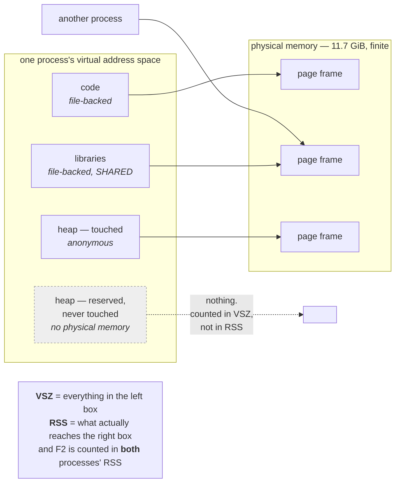

# 1.1 — Virtual memory, and why the number is a lie

## One-line answer

Every process sees a private, enormous address space that has almost nothing to do with the physical
memory in the machine — so "how much memory is this process using" has several different correct answers,
and choosing the wrong one is how people conclude a healthy service is about to fall over.

---

## The story

🎬 **The scene.** A hotel where every guest is given a room number on a card at check-in. Room 400.

The guest goes to the fourth floor and finds room 400. It is a real room with a real bed. As far as she
is concerned, the hotel has at least four hundred rooms and hers is one of them.

What she does not know is that the hotel has forty rooms. The card is not a room number; it is a *lookup*
that the porter resolves. Several guests have cards saying 400 — they are on different floors, in
different buildings, and the porter knows which is which. Two of them are shown to the same room, because
they are a couple and their cards happen to resolve to the same place.

😬 **The naive fix.** A new manager counts the room numbers on the cards issued today — 400, 1200, 890 —
and reports that the hotel is running at enormous capacity.

💥 **Why it fails.** The numbers on the cards were never a count of anything. They are addresses in a
scheme the porter maintains, deliberately sparse so that guests can be given memorable numbers, and
several of them point at the same room. **Adding them up produces a figure with no physical meaning at
all** — and the manager now believes the hotel is full when half the rooms are empty.

💡 **The insight.** An addressing scheme and an inventory are different things, and one of them tells you
about capacity. **The number a system shows you is often the address, because addresses are what the
system needs to work with** — and reading it as an inventory produces confident, precise, completely wrong
conclusions.

---

## The idea in plain language

Your machine has a fixed amount of physical memory — 11.7 GiB on this one, recorded in `docs/PACKAGES.md`
on Day 0. That is the real, finite thing.

Every process, meanwhile, is given its own **virtual address space**: a private range of addresses it can
use, which on a 64-bit system is astronomically larger than any real machine's memory. Verified against
`docs.kernel.org/admin-guide/mm/concepts.html` on **2026-08-24**: *"Each and every memory access uses a
virtual address. When the CPU decodes an instruction that reads (or writes) from (or to) the system
memory, it translates the virtual address encoded in that instruction to a physical address."*

The translation is done by hardware, using tables the kernel maintains. Which produces four consequences
that matter operationally.

**Processes cannot see each other's memory.** Two processes can both use address `0x7f0000000000` and be
referring to entirely different physical locations. This is the isolation everything else depends on.

**A process can have address space that has no physical memory behind it.** Asking for memory maps a range
of addresses; the physical pages are only attached when the process actually *touches* them. A program
that allocates a gigabyte and writes one byte occupies one page of real memory, not a gigabyte.

**Physical memory can be shared between processes.** Two processes running the same program share the
pages holding its code — one physical copy, two virtual mappings. So adding up what each process "uses"
double-counts.

**Physical memory can be reclaimed underneath a process.** A page can be written to swap, or — for pages
that came from a file — simply dropped, because the kernel can read it back from the file when needed. The
process notices nothing except a pause.

### The unit: the page

Memory is not managed byte by byte. It is managed in fixed-size chunks called **pages**, almost always
4 KiB. A mapping is a range of pages; the translation tables map virtual pages to physical page frames;
reclaim moves pages.

**This is why a one-byte allocation costs four kilobytes of real memory** — the same rounding you met on
Day 5 with filesystem blocks
([Day 5, part 3.1](../../../day-005-linux-for-operators-ii/parts/03-the-disk-that-fills/3.1-df-du-and-why-they-disagree.md)),
and for the same reason: managing a large resource in small units costs more bookkeeping than it saves.

### The two kinds of memory a process holds

**Anonymous memory** is not backed by any file — the heap, the stack, anything the program allocated. The
kernel documentation describes it as memory *"unattached to filesystems"*. If the kernel needs to reclaim
it, the only place to put it is swap; if there is no swap, it **cannot be reclaimed at all**. That last
clause is why Day 6 ends where it does.

**File-backed memory** came from a file: the program's own code, shared libraries, and anything read
through the page cache. It can always be dropped and re-read, so it is cheap to reclaim.

**The distinction is the whole of memory pressure.** A machine full of file-backed pages has slack; a
machine full of anonymous pages with no swap has none, and the next allocation that cannot be satisfied
invokes the out-of-memory killer (section [4](../04-the-oom-killer/4.1-what-the-oom-killer-actually-does.md)).

---

## Why Kriya needs it

Day 42 sets memory requests and limits for `pulse` in Kubernetes, and both are numbers you have to choose.
Choosing them from the wrong measurement — the address space rather than the resident set — produces a
limit ten times too large, which wastes capacity, or one too small, which produces exit code 137 on every
deploy.

Day 109 loads a model into `pulse`'s process. Three replicas means three copies in RAM unless the pages
are shared, and whether they are shared depends on how the model is loaded — which is this part.

Day 126 runs a local model on this machine, whose 11.7 GiB is the hard constraint. Addendum 02's profile
table is arithmetic over physical memory, and the day it does not fit is a capacity incident on your own
infrastructure.

Day 30's container failure lab produces `exit 137`, and Day 40 reads it from `kubectl describe`. Both are
downstream of a memory limit being reached, which requires knowing what "reached" is measured against.

---

## The mechanism

Ask the machine what it has, then ask a process what it thinks it has.

```bash
free -h 2>/dev/null || (echo "--- no free(1) here; using /proc/meminfo ---" && head -5 /proc/meminfo 2>/dev/null) || echo "neither available on this machine"
```

**Line by line:**

- `free -h` — total, used, free and available physical memory, human-readable. **The `available` column is
  the one to read**, not `free`: `free` excludes memory being used as cache, which is instantly reclaimable
  and therefore effectively available.
- The `||` fallback chain to `/proc/meminfo` and then to an honest message — the pattern from Day 5 for
  commands that do not exist everywhere. `free` is a Linux tool and Git Bash does not have it.

On a Linux machine:

```text
               total        used        free      shared  buff/cache   available
Mem:           7.7Gi       2.1Gi       1.2Gi       180Mi       4.4Gi       5.2Gi
Swap:          2.0Gi          0B       2.0Gi
```

**Read `used`, `buff/cache` and `available` together.** 2.1 GiB genuinely in use by processes, 4.4 GiB
held as page cache, and 5.2 GiB *available* — which is the used-plus-cache arithmetic done properly, because
most of that cache would be given up instantly if something needed it. **A machine showing 1.2 GiB "free"
and 5.2 GiB "available" is not short of memory**, and misreading that row is the single most common
memory-related false alarm.

Now a process. Start `pulse` and ask three different questions about it:

```bash
uv run uvicorn pulse.api:app --host 127.0.0.1 --port 8000 &
PULSE=$!
sleep 3
ps -o pid,vsz,rss,args -p "$PULSE"
```

**Line by line:**

- `vsz` — **virtual size**, in kibibytes: the total extent of the process's address space. Every mapping,
  whether or not any physical memory is behind it.
- `rss` — **resident set size**, in kibibytes: how much physical memory is actually attached right now.
- Asking for both in one command is the point — **the gap between them is the subject of this part.**

Observed on **2026-08-24**:

```text
    PID    VSZ   RSS COMMAND
  39120 412048 61284 python .venv/Scripts/uvicorn pulse.api:app --host 127.0.0.1 --port 8000
```

**402 MiB of address space and 60 MiB of physical memory.** A factor of nearly seven. Neither number is
wrong; they answer different questions.

**`VSZ` is not a capacity number.** It includes mappings for every shared library whether or not their
pages have been touched, address space reserved by the allocator and never used, and mappings of files
that are not in memory at all. A process with a 400 MiB `VSZ` on a machine with 11.7 GiB is not using 3%
of the machine — it is using 0.5%, and `VSZ` will tell you the wrong one.

### Watching virtual and resident diverge on purpose

```python
# days/day-006-resources-and-the-oom-killer/lab/allocate.py
"""Reserve a large address range, then touch it a page at a time, printing both numbers."""
import os
import sys
import time

MIB = 1024 * 1024
size_mib = int(sys.argv[1]) if len(sys.argv) > 1 else 512


def read_status() -> tuple[str, str]:
    """VmSize and VmRSS from /proc/self/status, or ('n/a', 'n/a') where /proc is absent."""
    try:
        text = open("/proc/self/status").read()
    except OSError:
        return ("n/a", "n/a")
    fields = dict(
        line.split(":", 1) for line in text.splitlines() if line.startswith(("VmSize", "VmRSS"))
    )
    return (fields.get("VmSize", "?").strip(), fields.get("VmRSS", "?").strip())


print(f"[alloc] pid={os.getpid()}", flush=True)
print(f"[alloc] before:      VmSize={read_status()[0]:>12}  VmRSS={read_status()[1]:>12}", flush=True)

buf = bytearray(size_mib * MIB)
print(f"[alloc] allocated:   VmSize={read_status()[0]:>12}  VmRSS={read_status()[1]:>12}", flush=True)

for i in range(0, len(buf), 4096):
    buf[i] = 1
print(f"[alloc] touched all: VmSize={read_status()[0]:>12}  VmRSS={read_status()[1]:>12}", flush=True)

time.sleep(20)
```

**Line by line:**

- `read_status()` reads `/proc/self/status` — **`/proc/self` is a symlink to the current process's own
  `/proc` directory**, so a program can inspect itself without knowing its own pid. `VmSize` is the virtual
  size and `VmRSS` the resident set, the same two numbers `ps` calls `vsz` and `rss`.
- `try` / `except OSError` returning `("n/a", "n/a")` — **`/proc` does not exist on Windows**, so this
  degrades honestly rather than crashing. Catching `OSError` specifically rather than bare `except`
  (`CLAUDE.md`).
- `bytearray(size_mib * MIB)` — **this is the interesting line.** In CPython a `bytearray` of this size is
  allocated and zero-filled, so it *does* become resident. Compare with `mmap` of an anonymous range,
  which would reserve address space and touch nothing.
- `for i in range(0, len(buf), 4096): buf[i] = 1` — touch one byte in every **page**. 4096 is the page
  size; touching one byte per page is the minimum work that forces every page to be backed by physical
  memory.
- Three prints at three moments, all with the same format string — **the comparison is the output**, and
  identical formatting is what makes it readable.
- `time.sleep(20)` so you can look at it from `ps` in another terminal.

```bash
uv run python days/day-006-resources-and-the-oom-killer/lab/allocate.py 512
```

**Line by line:** the argument is the size in mebibytes, so the number is visible in the command rather
than buried in the file. **Start at 512 and do not raise it without checking your free memory first** —
see this part's *Blast radius*.

On a Linux machine:

```text
[alloc] pid=39204
[alloc] before:      VmSize=    27204 kB  VmRSS=    11840 kB
[alloc] allocated:   VmSize=   551560 kB  VmRSS=   536852 kB
[alloc] touched all: VmSize=   551560 kB  VmRSS=   536908 kB
```

**`VmSize` jumped by 524 MB and `VmRSS` jumped with it**, because `bytearray` zero-fills. Now the version
that shows the divergence — reserve without touching:

```python
# days/day-006-resources-and-the-oom-killer/lab/reserve.py
"""Reserve address space with mmap and touch only part of it."""
import mmap
import os
import time

MIB = 1024 * 1024
SIZE = 1024 * MIB


def rss_kb() -> str:
    try:
        for line in open("/proc/self/status"):
            if line.startswith("VmRSS"):
                return line.split(":", 1)[1].strip()
    except OSError:
        pass
    return "n/a"


print(f"[reserve] pid={os.getpid()}  before: VmRSS={rss_kb()}", flush=True)
m = mmap.mmap(-1, SIZE)
print(f"[reserve] mapped 1 GiB:      VmRSS={rss_kb()}", flush=True)

for i in range(0, 64 * MIB, 4096):
    m[i] = 1
print(f"[reserve] touched 64 MiB:    VmRSS={rss_kb()}", flush=True)

time.sleep(20)
```

**Line by line:**

- `mmap.mmap(-1, SIZE)` — **`-1` as the file descriptor means an anonymous mapping**: a range of address
  space backed by no file. This is the raw form of "ask for memory", and unlike `bytearray` it does *not*
  write anything, so no physical pages are attached yet.
- `for i in range(0, 64 * MIB, 4096)` — touch only the first 64 MiB of the 1 GiB mapping, one byte per
  page. **The remaining 960 MiB stays untouched and unbacked.**
- `rss_kb()` at three points, so the trajectory is visible.

```text
[reserve] pid=39288  before: VmRSS=    11904 kB
[reserve] mapped 1 GiB:      VmRSS=    11908 kB
[reserve] touched 64 MiB:    VmRSS=    77452 kB
```

**Mapping a gigabyte cost four kilobytes of physical memory.** Touching 64 MiB of it cost 64 MiB. **The
address space is a promise; the resident set is the bill**, and only one of them is a capacity number.



---

## When it breaks

**A monitoring alert on a `VSZ` that means nothing.** The classic false alarm:

```text
$ ps -eo pid,vsz,rss,args --sort=-vsz | head -3
    PID    VSZ   RSS COMMAND
   4102 8412360 184320 java -Xmx4g -jar app.jar
   4890 2104880  61284 python -m uvicorn app:main
```

**What it says:** a process with 8.4 GB of virtual size on a machine with less memory than that.
**What it actually means:** the JVM reserves a large address range up front and populates it lazily. `RSS`
is 180 MB. **There is no problem of any kind**, and an alert on `VSZ` would fire continuously and be
ignored within a week.
**The smallest fix:** alert on `RSS`, or better, on RSS against a limit
([3.2](../03-limits/3.2-memory-max-versus-memory-high.md)).
**Why the mistake is so common:** `VSZ` is the first column in several tools and it is a bigger, more
alarming number.

**A memory limit set from the wrong measurement.** The expensive version of the same mistake:

```text
$ kubectl get pods
NAME                    READY   STATUS      RESTARTS   AGE
pulse-6d4f8b9c7-mn2xk   0/1     OOMKilled   4          3m
```

**What it says:** the container is being killed for exceeding its memory limit, repeatedly.
**What it actually means:** whoever set the limit measured it wrong in the *other* direction — often by
watching a process at startup before caches warmed, or by reading `free` on a machine and dividing.
**The smallest fix:** measure `RSS` under representative load, over time, and take a high percentile plus
headroom. **The right measurement is a distribution, not a number**, and Day 42 spends a day on it.

**The `free` column that caused a panic.** Misreading the machine rather than the process:

```text
$ free -h
               total        used        free      shared  buff/cache   available
Mem:           7.7Gi       2.1Gi       213Mi       180Mi       5.4Gi       5.2Gi
```

**What it says:** 213 MiB free out of 7.7 GiB.
**What it actually means:** 5.2 GiB **available**. The 5.4 GiB in `buff/cache` is page cache — file-backed
memory the kernel is holding because it had nothing better to do with it, and which it will drop the
instant anything needs the space.
**The smallest fix:** read the `available` column. **The general principle:** an operating system with
free memory is an operating system wasting memory, so "free is low" is the normal, healthy state of a
machine that has been running for a while. **Alert on `available`, never on `free`.**

**Two processes, and the memory adds up to more than the machine has.** The double-counting trap:

```text
$ ps -eo rss,args --sort=-rss | head -4
    RSS COMMAND
1258291 python -m worker
1251904 python -m worker
1249152 python -m worker
```

**What it says:** three workers at about 1.2 GiB each — 3.6 GiB total.
**What it actually means:** possibly much less. If those workers were forked from a common parent, or all
loaded the same large shared library or memory-mapped the same model file, **a large part of that
resident set is one physical copy counted three times.**
**The smallest fix:** `smem` or the `Pss` field in `/proc/<pid>/smaps_rollup`, which divides shared pages
between the processes sharing them and is the only number that legitimately adds up. Part
[1.2](1.2-rss-vss-and-shared-pages.md) is about exactly this.

---

## In production

**What a professional writes instead of the teaching version.** They never quote a single memory number
without saying which one it is. "The service uses 400 MB" is meaningless; "RSS at p95 is 400 MB against a
512 MB limit" is a capacity statement you can act on. And they measure under load rather than at startup,
because almost everything that matters — connection pools, caches, buffers, a loaded model — grows after
the process has been serving for a while.

**What degrades at scale.** Sharing stops being an optimisation and becomes the difference between fitting
and not. One instance of a service holding a 2 GB model is 2 GB. Ten instances on one machine is 20 GB —
unless the model is memory-mapped from a file, in which case it is 2 GB shared ten ways plus a small
per-process overhead. **That choice is invisible in the code and decisive in the capacity plan**, and it
is exactly the decision Day 109 will make for `pulse`.

**The failure that only shows with real traffic.** Memory that grows with concurrency rather than with
time. A service that buffers a request body uses one buffer per in-flight request, so its resident set is
a function of concurrency — fine at ten concurrent requests, and four hundred times larger at four
thousand. **It looks like a leak and is not**, and the discriminator is whether memory returns when the
load stops. A real leak does not.

**The review comment a senior engineer leaves.** *"The memory limit is set to the RSS we measured on a
freshly started pod. That is the smallest this process is ever going to be — the connection pool is empty
and no request has allocated anything. Measure it at p99 under load-test traffic and add headroom, or we
will be OOMKilled on the first busy afternoon."*

**The signal you would alert on.** **Resident set size as a fraction of the memory limit**, not as an
absolute figure — because the absolute figure means nothing without the limit, and the ratio is comparable
across services. Alert when it sustains above roughly 90%, because that is where the next allocation spike
becomes a kill. Secondarily, **`available` memory on the node** (never `free`), and **the rate of change
of RSS**, because a monotonic rise that never falls is a leak and is worth catching before it reaches the
limit. You would **not** alert on `VSZ`, for the reason in *When it breaks* — it is not a capacity number
and alerting on it teaches people to ignore alerts.

**Blast radius.** This part allocates memory on purpose — 512 MiB in one script, 1 GiB of address space in
another. Worst case on this machine: 512 MiB of real memory held for the duration of the script against
11.7 GiB total, which is safe, **and the same script with a larger argument is not** — `allocate.py 8000`
would attempt eight gigabytes and either fail, swap the machine into unusability, or invoke the
out-of-memory killer against something you care about. Who can trigger it: you, by changing one number.
What bounds it: the default of 512 in the script, and the arithmetic in `docs/PACKAGES.md` — 11.7 GiB
total, roughly 5 GB genuinely available with a browser and an editor running. **Check `free` or the
Windows equivalent before increasing that argument**, and never run the allocation exercises with the
observability stack running (Addendum 02 §4).

**Cost.** `0` model calls, `0` tokens, `0` CI minutes, `0` disk. **RAM: 512 MiB briefly, plus `pulse` at
about 60 MB** — the first meaningful RAM cost in this curriculum, and it returns entirely when the process
exits, unlike Day 5's disk. That contrast is worth noticing: **memory is reclaimed automatically at
process exit and disk is not.**

**The interview question.** *"How much memory is this process using?"* — a trap, and the answer that lands
refuses the premise: *"That depends which number you want. Virtual size is the address space, which
includes reservations that have no physical memory behind them and is not a capacity figure — a JVM with
`-Xmx4g` shows gigabytes of VSZ and might have a 200 MB resident set. Resident set is the physical memory
actually attached, which is closer, but it counts shared pages in full for every process sharing them, so
three workers at 1 GB RSS might be using well under 3 GB between them. If I need a number that adds up I
use PSS, which splits shared pages between the sharers. And whichever I use, I want it under load and over
time rather than at startup, because caches and pools grow."*

---

## Check yourself

```bash
uv run uvicorn pulse.api:app --host 127.0.0.1 --port 8000 & sleep 3; ps -o pid,vsz,rss,args -p "$!" | tail -1 | awk '{printf "VSZ=%d MiB  RSS=%d MiB  ratio=%.1fx\n", $2/1024, $3/1024, $2/$3}'; pkill -f 'uvicorn pulse.api'
```

`pulse`'s two memory numbers and the ratio between them, in one line. **Write the RSS figure down** —
Day 42 sets a memory limit against it, Day 109 will change it by an order of magnitude when a model is
loaded, and having the "before" number is what makes that change legible.

**Say out loud, without scrolling up:** *a process shows 8 GB of virtual size on a machine with 4 GB of
RAM and nothing is wrong. Explain how that is possible, and name the number you would have looked at
instead.*
