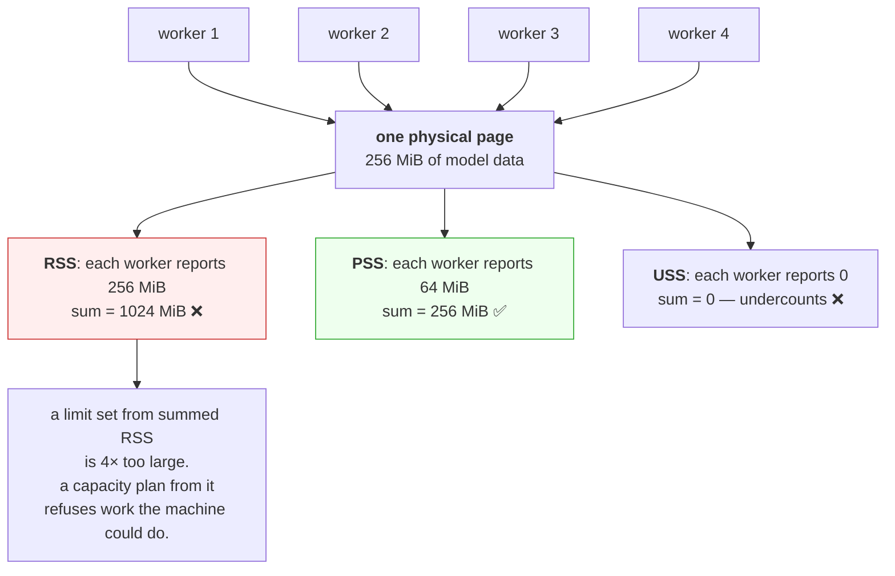

# 1.2 — RSS, VSZ and the shared pages that make them add up wrong

## One-line answer

Resident set size counts every physical page a process can reach, including pages it shares with other
processes, so summing RSS across processes overcounts, and the only figure that adds up correctly is PSS,
which divides each shared page between its sharers.

---

## The story

🎬 **The scene.** A block of six flats with one shared boiler in the basement. Each flat has its own
radiators and its own thermostat.

The landlord asks each tenant how much heating they use. Each one answers honestly: the boiler, plus my
radiators.

😬 **The naive fix.** He adds up the six answers and orders six boilers' worth of fuel.

💥 **Why it fails.** There is one boiler. Every tenant was truthful and every answer included it, so the
total counts it six times. He has now over-ordered by a factor of several, and, worse, when he tries to
work out whether the building can take a seventh flat, his arithmetic says no when the answer is yes.

**And the mirror-image mistake is just as easy.** If he instead decides that the boiler belongs to nobody
and counts only radiators, he under-orders and the building is cold.

💡 **The insight.** When a resource is genuinely shared, there is no honest way to attribute all of it to
any one user, and both obvious answers, which are to give it to everyone or to give it to no one, are
wrong in opposite directions. **The only arithmetic that adds up is to divide it**, and any measurement
that does not do that will mislead you the moment you try to sum it.

---

## The idea in plain language

Part [1.1](1.1-virtual-memory-and-why-the-number-is-a-lie.md) introduced two numbers. There is a third,
and it exists precisely because the second one does not add up.

| Name | Counts | Adds up across processes? |
| --- | --- | --- |
| **VSZ**, virtual size | every mapping, backed or not | no, and it is meaningless to sum |
| **RSS**, resident set size | every physical page mapped by this process | **no, because shared pages are counted in full, by each sharer** |
| **PSS**, proportional set size | private pages in full, and shared pages divided by the number of sharers | **yes** |
| **USS**, unique set size | private pages only | yes, but it undercounts |

### Why pages get shared

There are three common reasons, all of them normal and desirable.

**Shared libraries.** Every Python process on your machine maps the same `libc` and the same Python
runtime, so there is one physical copy and many mappings. This is why running twenty small processes
costs far less than twenty times one process.

**Copy-on-write after fork.** When a process forks, from
[Day 4, part 1.2](../../../day-004-linux-for-operators-i/parts/01-the-process/1.2-pid-parent-and-the-process-tree.md),
the child does not get a copy of the parent's memory. It gets the *same* physical pages, marked
read-only, and a page is copied only when one of them writes to it. **So a freshly forked worker's RSS is
almost entirely shared with its parent**, and drifts towards private as it runs.

**Memory-mapped files.** A file mapped into memory occupies page cache, and every process mapping it sees
the same pages. This is the mechanism that decides whether ten replicas holding a 2 GB model cost 2 GB or
20 GB, and it is the single most consequential sharing decision in this curriculum.

### Why this matters more than it sounds

The moment you have more than one process, whether that is a worker pool, several replicas on one node,
or a sidecar, the question "how much memory does this workload use" has a right answer and a much larger
wrong one that every default tool will give you.

**And the error is not small.** A pre-fork server with eight workers, each showing 500 MB RSS, might be
using 4 GB or might be using 900 MB, and the difference is entirely whether the 450 MB of shared runtime
and loaded data is counted once or eight times.

### Where the numbers come from

On Linux, `/proc/<pid>/status` gives you `VmSize` and `VmRSS`. The finer breakdown lives in
`/proc/<pid>/smaps_rollup`, which reports `Rss`, `Pss`, `Shared_Clean`, `Shared_Dirty`, `Private_Clean`
and `Private_Dirty` for the whole process in one read, and is the cheap summary of the much longer
`/proc/<pid>/smaps`.

**`Private_Dirty` is the number to watch for a leak**, because it is memory this process alone has
modified, which cannot be shared, cannot be dropped, and can only go to swap. It is the memory that is
genuinely, solely, this process's problem.

---

## Why Kriya needs it

Day 42 sets memory requests and limits for `pulse`. A limit applies to a cgroup, from
[3.1](../03-limits/3.1-cgroups-the-box-you-put-a-process-in.md), and the cgroup's accounting is closer to
PSS than to summed RSS, so a limit derived from summing RSS is systematically too large.

Day 109 loads a model into `pulse`, and Day 110 runs several workers. Whether that model is loaded per
worker or memory-mapped once and shared is a decision worth thousands of megabytes, and it is invisible
in the RSS column.

Day 126 runs a local model on this 11.7 GiB machine, where the difference between "shared" and "per
process" is the difference between working and swapping.

Day 223 computes unit economics. Memory is a cost, and attributing a shared page to one workload or
another is exactly the multi-tenant accounting problem that day is about.

---

## The mechanism

Fork a process and watch the sharing appear.

```python
# days/day-006-resources-and-the-oom-killer/lab/shared.py
"""Allocate a large buffer, then fork children. Compare RSS and PSS across the family."""

import os
import sys
import time

MIB = 1024 * 1024
SIZE_MIB = int(sys.argv[1]) if len(sys.argv) > 1 else 256
CHILDREN = 3


def mem_kb(pid: str = "self") -> dict[str, int]:
    """Rss, Pss and Private_Dirty for a pid, in kB. Empty dict where /proc is absent."""
    out: dict[str, int] = {}
    try:
        for line in open(f"/proc/{pid}/smaps_rollup"):
            key, _, rest = line.partition(":")
            if key in {"Rss", "Pss", "Private_Dirty", "Shared_Clean", "Shared_Dirty"}:
                out[key] = int(rest.strip().split()[0])
    except OSError:
        pass
    return out


buf = bytearray(SIZE_MIB * MIB)
for i in range(0, len(buf), 4096):
    buf[i] = 1

print(f"[parent {os.getpid()}] after allocating {SIZE_MIB} MiB: {mem_kb()}", flush=True)

kids = []
for _ in range(CHILDREN):
    pid = os.fork()
    if pid == 0:
        time.sleep(2)
        print(f"[child  {os.getpid()}] {mem_kb()}", flush=True)
        time.sleep(15)
        os._exit(0)
    kids.append(pid)

time.sleep(4)
print(f"[parent {os.getpid()}] after forking {CHILDREN}: {mem_kb()}", flush=True)

total_rss = sum(mem_kb(str(p)).get("Rss", 0) for p in [os.getpid()] + kids)
total_pss = sum(mem_kb(str(p)).get("Pss", 0) for p in [os.getpid()] + kids)
print(f"[parent] sum of RSS across {CHILDREN + 1} processes: {total_rss // 1024} MiB", flush=True)
print(f"[parent] sum of PSS across {CHILDREN + 1} processes: {total_pss // 1024} MiB", flush=True)

for p in kids:
    os.waitpid(p, 0)
```

**Line by line:**

- `mem_kb(pid="self")` reads `/proc/<pid>/smaps_rollup`, which is **the rolled-up summary**, being one
  small file rather than the per-mapping `smaps` that can be thousands of lines on a large process.
  Reading `smaps` for every process in a loop is a genuine performance problem, and `smaps_rollup` exists
  to avoid it.
- `line.partition(":")` is used rather than `split(":")`, because partition always returns three parts
  even when there is no colon, so a malformed line cannot raise. That is a small robustness choice in a
  parser that reads kernel output.
- `except OSError: pass` returning an empty dict matters because **`/proc` does not exist on Windows**,
  and every print below degrades to `{}` rather than crashing. It is the same honest-degradation pattern
  as [1.1](1.1-virtual-memory-and-why-the-number-is-a-lie.md).
- `bytearray` and then touching every page makes the memory genuinely resident before forking, so that
  there is something to share, from [1.1](1.1-virtual-memory-and-why-the-number-is-a-lie.md).
- `os.fork()` is **the low-level fork**, returning 0 in the child and the child's pid in the parent. It is
  used here rather than `multiprocessing` because the sharing behaviour is the subject and `fork` is
  where it comes from.
- `os._exit(0)` in the child matters, and **the underscore matters.** `os._exit` terminates immediately
  without running cleanup handlers or flushing buffers, whereas `sys.exit` raises an exception that would
  unwind through the parent's `try` blocks in a forked child, which is a classic source of confusing
  duplicate output.
- `os.waitpid(p, 0)` for each child reaps them, from
  [Day 4, part 4.3](../../../day-004-linux-for-operators-i/parts/04-the-service-died/4.3-zombies-orphans-and-pid-1.md),
  so that this script does not leave four zombies behind.
- The two `sum(...)` lines are **the point of the whole script**, because they use the same set of
  processes and two different accounting rules, and the gap between the answers is the double-counting.

```bash
uv run python days/day-006-resources-and-the-oom-killer/lab/shared.py 256
```

**Line by line:** 256 mebibytes, allocated once in the parent and then inherited by three children. **The
total this holds is 256 MiB rather than 1 GiB**, which is the claim the script's own output is about to
check.

On a Linux machine:

```text
[parent 40112] after allocating 256 MiB: {'Rss': 274512, 'Pss': 274180, 'Shared_Clean': 2960, 'Shared_Dirty': 0, 'Private_Dirty': 268544}
[child  40118] {'Rss': 274520, 'Pss': 69120, 'Shared_Clean': 2960, 'Shared_Dirty': 268544, 'Private_Dirty': 128}
[child  40119] {'Rss': 274520, 'Pss': 69120, 'Shared_Clean': 2960, 'Shared_Dirty': 268544, 'Private_Dirty': 128}
[child  40120] {'Rss': 274520, 'Pss': 69120, 'Shared_Clean': 2960, 'Shared_Dirty': 268544, 'Private_Dirty': 128}
[parent 40112] after forking 3: {'Rss': 274512, 'Pss': 69116, 'Shared_Dirty': 268544, 'Private_Dirty': 128}
[parent] sum of RSS across 4 processes: 1072 MiB
[parent] sum of PSS across 4 processes: 270 MiB
```

**Read the last two lines together.** Summed RSS says 1,072 MiB. Summed PSS says 270 MiB. **The truth is
270 MiB**, being one 256 MiB buffer plus four small Python runtimes, and the RSS sum is wrong by a factor
of four, which is exactly the number of processes.

Look at the parent's two lines to see the moment it happens. Before forking, its `Private_Dirty` is 268
MB, which is memory it alone has touched. **After forking, the same pages are `Shared_Dirty`** and its
PSS has dropped to a quarter of its RSS. Nothing was allocated or freed, and the accounting changed
because three more processes now map the same physical pages.

### The same effect without `fork`, using a shared file mapping

```python
# days/day-006-resources-and-the-oom-killer/lab/mapshare.py
"""Two processes mapping the same file share its pages. This is how a model gets shared."""

import mmap
import os
import sys
import time
from pathlib import Path

MIB = 1024 * 1024
path = Path(sys.argv[1])


def pss_kb() -> str:
    try:
        for line in open("/proc/self/smaps_rollup"):
            if line.startswith("Pss:"):
                return line.split(":", 1)[1].strip()
    except OSError:
        pass
    return "n/a"


with path.open("rb") as fh:
    m = mmap.mmap(fh.fileno(), 0, access=mmap.ACCESS_READ)
    for i in range(0, len(m), 4096):
        _ = m[i]
    print(f"[map {os.getpid()}] mapped and read {len(m) // MIB} MiB: Pss={pss_kb()}", flush=True)
    time.sleep(25)
```

**Line by line:**

- `mmap.mmap(fh.fileno(), 0, access=mmap.ACCESS_READ)` **maps an actual file**, read-only. A length of
  `0` means the whole file. `ACCESS_READ` is what makes the pages shareable, because a writable private
  mapping would copy on write and stop being shared the moment anything wrote.
- `for i in range(0, len(m), 4096): _ = m[i]` reads one byte per page, forcing every page to be brought
  into memory. It reads rather than writes, so the pages stay clean and shared.
- `_ = m[i]` uses the underscore, which is the conventional name for a value you are deliberately
  discarding, and it stops a linter complaining about an unused expression.
- `time.sleep(25)` lets both copies overlap so that they can be measured together.

```bash
cd days/day-006-resources-and-the-oom-killer/lab
head -c 268435456 /dev/urandom > blob.bin
uv run python mapshare.py blob.bin &
sleep 2
uv run python mapshare.py blob.bin &
wait
```

**Line by line:** create a 256 MiB file, using random data so that it cannot be stored sparsely, from
[Day 5, part 3.1](../../../day-005-linux-for-operators-ii/parts/03-the-disk-that-fills/3.1-df-du-and-why-they-disagree.md),
and then run two processes that both map it, staggered so that their output does not interleave
mid-line.

```text
[map 40402] mapped and read 256 MiB: Pss=  272008 kB
[map 40407] mapped and read 256 MiB: Pss=  147520 kB
```

⚠️ **The first process's PSS falls as soon as the second one maps the same file.** Take a second reading
of process 40402 while both are alive and it will have dropped to roughly the same figure. **256 MiB of
physical memory, two processes, and PSS splits it between them.** RSS would have reported 256 MiB twice.

**This is the mechanism that decides Day 109.** A model loaded into each worker's heap costs *N* times its
size. The same model memory-mapped from a file costs its size, once, however many workers map it.

Then clean up.

```bash
rm -f blob.bin && df -h . | tail -1
```

**Line by line:** remove the 256 MiB file and confirm that the space returned, which is the Day 5
discipline from
[Day 5, part 3.2](../../../day-005-linux-for-operators-ii/parts/03-the-disk-that-fills/3.2-the-deleted-file-that-still-costs-you-a-gigabyte.md),
where deleting a file a process holds open reclaims nothing.



---

## When it breaks

**A worker pool that appears to use more memory than the machine has.** This is the everyday form.

```text
$ ps -eo rss,args --sort=-rss | grep '[g]unicorn' | head -5
 512400 gunicorn: worker [app]
 511288 gunicorn: worker [app]
 510904 gunicorn: worker [app]
 509772 gunicorn: worker [app]
 498112 gunicorn: master [app]
```

**What it says:** five processes at around 500 MB, so 2.5 GB, on a machine with 2 GB of RAM.

**What it actually means:** the workers were forked from the master after it loaded the application, so
almost all of that 500 MB is copy-on-write pages shared with the master. **One copy, five mappings.** The
real total is closer to 600 MB.

**The smallest fix:** read PSS, with
`for p in $(pgrep gunicorn); do grep ^Pss /proc/$p/smaps_rollup; done` and sum, or use `smem -t`, which
does it for you.

**Why this matters beyond curiosity:** pre-fork servers deliberately load everything expensive *before*
forking, precisely so that it is shared. A change that moves the load into the worker turns 600 MB into
2.5 GB with no visible change in behaviour until the machine runs out.

**PSS that drifts upward with no allocation.** This is copy-on-write turning private.

```text
# ten minutes after start
Pss:  69120 kB
# an hour later, same process, no growth in allocations
Pss: 214800 kB
```

**What it says:** memory grew threefold with nothing allocated.

**What it actually means:** copy-on-write pages become private the first time the process **writes** to
them, and Python writes to a great deal of memory it did not allocate, because reference counts live
inside every object. **Touching an object to read it still writes its refcount**, so a forked Python
worker steadily un-shares its parent's heap simply by using it.

**The smallest fix:** none, because this is inherent to reference counting, and it is why `fork`-based
sharing is much less effective for Python than for languages without refcounts.

**Worth knowing because** it means "we fork so it is shared" is a weaker guarantee in Python than people
assume, and a memory-mapped file, which is read-only and never refcounted, shares far better.

**A container limit that seems to be enforced against the wrong number.** This is the accounting
mismatch.

```text
$ kubectl top pod pulse-6d4f8b9c7-mn2xk
NAME                    CPU(cores)   MEMORY(bytes)
pulse-6d4f8b9c7-mn2xk   12m          842Mi
$ kubectl exec pulse-6d4f8b9c7-mn2xk -- sh -c 'ps -eo rss,args --no-headers | head -3'
 512400 python -m uvicorn ...
 498112 python -m uvicorn ...
```

**What it says:** the pod is reported at 842 MiB while two processes inside it each show about 500 MB.

**What it actually means:** the cgroup's accounting counts each physical page **once**, no matter how many
processes in the cgroup map it, which is closer to PSS than to summed RSS, from
[3.1](../03-limits/3.1-cgroups-the-box-you-put-a-process-in.md). Summing RSS inside the container gives 1
GB, and the limit is enforced against 842 MiB.

**The practical consequence:** **set limits from the cgroup's own number rather than from `ps` inside the
container.** They differ, and only one of them is the one that will kill you.

**Memory that "leaks" and is not a leak.** This is the measurement artefact.

```text
$ # RSS over an hour, sampled every five minutes
 61284  71120  84408  96552 108224 118880 128104 136992 144608 151200 156848 161504
```

**What it says:** monotonic growth with no plateau.

**What it actually means:** possibly a leak, and possibly an allocator that does not return freed memory
to the operating system. Most allocators keep freed pages for reuse rather than giving them back, so RSS
rises to a working-set high-water mark and stays there. **The discriminator is whether it plateaus**,
because a curve that flattens is a working set and one that rises indefinitely is a leak.

**The smallest fix:** watch `Private_Dirty` rather than `Rss`, and watch it across a period of *falling*
load. **A working set shrinks when demand does, and a leak does not.**

---

## In production

**What a professional writes instead of the teaching version.** They quote PSS whenever they are summing
across processes, RSS when talking about a single process against a limit, and never VSZ. And when a
workload holds something large and read-only, such as a model, an index or a lookup table, they arrange
for it to be memory-mapped from a file rather than loaded into each process's heap, because that single
decision converts a per-worker cost into a per-machine one.

**What degrades at scale.** The error in summed RSS grows linearly with the number of processes, so it is
negligible at one and enormous at fifty. This is precisely why capacity planning based on "measure one
instance and multiply" fails in the safe direction for CPU and the *unsafe* direction for memory, because
you provision too much, refuse to schedule work the machine could do, and pay for capacity you are not
using. **Getting this wrong costs money continuously rather than causing an incident**, which is why it
goes unfixed for years.

**The failure that only shows with real traffic.** Copy-on-write un-sharing under load. At rest, forked
workers share almost everything and the memory figure is comfortable. Under traffic, each worker touches
more of the shared heap, including refcounts, caches and lazily initialised structures, and the shared
pages become private one by one. **Memory climbs with request volume and does not come back**, and it
looks exactly like a leak. The tell is that it plateaus at roughly the un-shared working set rather than
rising forever.

**The review comment a senior engineer leaves.** *"We moved the model load from module scope into the
worker startup hook, which means it happens after the fork now, so instead of one shared copy we have
eight private ones. That is why memory went from 2 GB to 14 GB with no code change to the model. Load it
before the fork, or mmap it."*

**The signal you would alert on.** For a single process against a limit, **RSS as a fraction of the
limit**, as in [1.1](1.1-virtual-memory-and-why-the-number-is-a-lie.md). For a workload with several
processes, **the cgroup's own memory usage**, from
[3.2](../03-limits/3.2-memory-max-versus-memory-high.md), because that is both correctly accounted and the
number the enforcement uses, and alerting on anything else means alerting on a number that cannot kill you
while the one that can goes unwatched. And for leak detection specifically, watch the **`Private_Dirty`
trend across a load trough**, because memory that does not fall when demand falls is the signature. You
would **not** alert on summed RSS, which is the metric most likely to be wrong in the most alarming
direction.

**Blast radius.** This part allocates 256 MiB, forks three children, and writes a 256 MiB file. The worst
case on this machine is about 350 MB of RAM and 256 MB of disk held for the duration, against 11.7 GiB
and 45 GB, which is safe. **The scaling hazard is the argument**, because `shared.py 4000` allocates four
gigabytes and then forks three children that inherit it, and while the pages are shared, **any write by
any child copies them**, so a workload that would fit at rest can quadruple under load and invoke the
out-of-memory killer, in section
[4](../04-the-oom-killer/4.1-what-the-oom-killer-actually-does.md). You can trigger it by changing one
number. What bounds it is the 256 default, and Addendum 02's arithmetic, which gives roughly 5 GB of
genuine headroom on this machine with a browser and editor running. **Do not run this with the
observability stack up.**

**Cost.** `0` model calls, `0` tokens and `0` CI minutes. **On RAM it is about 350 MB, briefly. On disk it
is 256 MiB for `blob.bin`, deleted at the end** with a `df` to confirm. Reading `smaps_rollup` costs one
small file read per process, which is cheap, unlike `smaps`, which on a large process is thousands of
lines and is genuinely expensive to parse in a monitoring loop.

**The interview question.** *"Your eight workers each show 1 GB RSS on a machine with 4 GB of RAM. Is the
machine about to die?"* The answer that lands refuses the arithmetic: *"Probably not, and summing RSS is
the wrong operation. RSS counts every physical page a process maps, including pages shared with other
processes, so a forked worker pool counts the parent's heap once per worker. The number that adds up is
PSS, which divides each shared page between its sharers, and `smaps_rollup` has it per process, while the
cgroup's own usage figure is both correctly accounted and the one the limit is enforced against. What I
would actually watch for a leak is `Private_Dirty` across a period of falling load, because a working set
comes back down and a leak does not."*

---

## Check yourself

```bash
for p in $(pgrep -f 'uvicorn|python' | head -5); do printf '%6s  ' "$p"; grep -E '^(Rss|Pss|Private_Dirty):' /proc/"$p"/smaps_rollup 2>/dev/null | tr '\n' ' ' || echo "no /proc — see part 1.1"; echo; done
```

Three numbers for each of up to five Python processes on your machine. **Compare `Rss` with `Pss` on any
process that shares pages.** If they are close, that process is mostly private, and if `Pss` is much
smaller, it is sharing heavily and summing its RSS with anything would double-count. On this Windows
machine `/proc` is absent and you will get the fallback message, which is the same finding recorded on
Day 5: **this diagnosis needs WSL2, from Day 21.**

**Say out loud, without scrolling up:** *four processes each report 500 MB RSS. State the smallest and
largest amounts of physical memory they could actually be using between them, and name the measurement
that would tell you which.*
