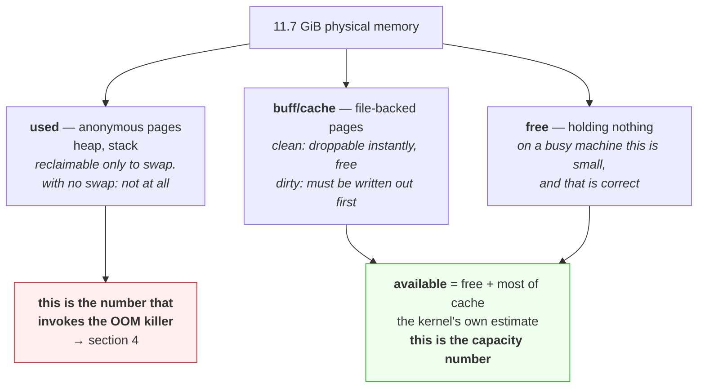

# 1.3 — The page cache that looks like a leak

## One-line answer

The kernel keeps every file it has read in spare memory, so a healthy machine always looks nearly full,
and telling that reclaimable cache apart from memory that is genuinely committed is the difference
between a real capacity problem and a metric that has never meant what people thought.

---

## The story

🎬 **The scene.** A cook with a large worktop. Over the course of a morning she brings out ingredients,
uses some, and leaves the rest on the surface because she will probably want them again.

By eleven the worktop is covered: flour, three kinds of oil, a bowl of chopped onions, and a chopping
board she has not touched in an hour.

😬 **The naive fix.** A new kitchen assistant, briefed on efficiency, reports that the worktop is at
capacity and the kitchen cannot take another order.

💥 **Why it fails.** She needs three seconds and one sweep of her arm to clear enough space for anything.
Nothing on that worktop is committed to anything. It is all *conveniently placed*, and its convenience is
the only reason it is there. **A clear worktop would be a worktop that had been doing no cooking.**

The report is not merely wrong, it is backwards. The fullness that was measured is a sign of a kitchen
that has been busy and is set up well.

💡 **The insight.** Some resources are held speculatively, because holding them is free until somebody
needs the space. **Measuring "how much is occupied" tells you nothing about capacity when most of the
occupation is voluntary.** The number you want is how much could be cleared instantly, and it is a
different number.

---

## The idea in plain language

Verified against `docs.kernel.org/admin-guide/mm/concepts.html` on **2026-08-24**: when files are read,
the data enters the **page cache** *"to minimize expensive disk access on future reads"*, and written
data sits in the cache before being synchronised to storage, with modified pages marked *dirty*.

So the kernel keeps copies of file contents in memory. Not because anyone asked, but because the memory
was otherwise idle and a cache hit is thousands of times faster than a disk read.

**And it keeps doing this until memory is full.** There is no reason not to, because an unused page of
RAM is wasted, and a page holding a cached file costs nothing, since it can be dropped instantly if
something needs the space.

This produces a machine that, after a few hours of ordinary work, reports almost no free memory. **That
is the designed and correct behaviour**, and it is the single most misread number in operations.

### Reclaimable and unreclaimable

The kernel documentation describes reclaim as freeing *"reclaimable pages (like page cache and anonymous
memory)"* when pressure rises. But those two categories are not equally reclaimable.

| Kind | Backed by | To reclaim it, the kernel must | Available if there is no swap? |
| --- | --- | --- | --- |
| **clean page cache** | a file, unmodified | drop it, because the file still has it | **yes, instantly, and free** |
| **dirty page cache** | a file, modified | write it out first, and then drop it | yes, but it costs I/O |
| **anonymous** | nothing | write it to swap | **no, because it cannot be reclaimed at all** |

**The last row is the entire reason the out-of-memory killer exists**, from
[4.1](../04-the-oom-killer/4.1-what-the-oom-killer-actually-does.md). A machine full of clean page cache
has effectively all its memory available. A machine full of anonymous memory with no swap, which is the
default configuration for most containers and many cloud instances, has none, and the next allocation
that cannot be satisfied kills something.

### The three numbers, and which one to believe

`free` gives you three columns that people conflate.

- **`free`** is memory holding nothing at all. On a machine that has been up for a while this is small,
  and **it does not matter.**
- **`buff/cache`** is memory holding page cache. It looks used, and it is mostly available.
- **`available`** is **the kernel's own estimate of how much a new workload could get** without swapping,
  accounting for how much of the cache is genuinely droppable. This is the number.

`available` is not simply `free` plus `buff/cache`. Some cache is pinned, some is dirty and needs writing
out first, and the kernel makes an estimate that is better than any arithmetic you would do yourself.

### Why this bites hardest in containers

Inside a container, memory accounting is per cgroup, from
[3.1](../03-limits/3.1-cgroups-the-box-you-put-a-process-in.md), and **page cache generated by that
cgroup counts against its limit.** A process that reads a large file has that file's pages charged to it,
so a container with a 512 MiB limit that reads a 2 GiB file will be pushed towards its limit by cache it
never asked for.

The kernel will reclaim that cache rather than kill the process, because clean cache is dropped before
anything dies. **But the memory metric climbs to the limit and sits there**, which looks alarming and is
usually fine, and telling the two apart is what part
[3.2](../03-limits/3.2-memory-max-versus-memory-high.md) is for.

---

## Why Kriya needs it

Day 42 sets memory limits for `pulse`, and the limit is enforced against a figure that includes page
cache. A limit chosen without knowing that is a limit that will be hit by file reads.

Day 62 exposes `pulse`'s first metrics and Day 63 writes the first PromQL. The node's memory metrics
include several of these fields, and a dashboard that plots `free` instead of `available` will show a
machine permanently in the red.

Day 76 builds the first capacity alert. An alert on used memory fires constantly on any healthy machine,
and an alert on available memory fires when something is genuinely wrong.

Day 109 loads a model from a file. That read populates the page cache with the model's size, on top of
the process's own copy, so a naive measurement immediately after startup double-counts it, which is a
real trap when you are choosing a limit.

---

## The mechanism

Watch the cache grow, and then watch it disappear on demand.

```bash
free -h 2>/dev/null || echo "no free(1) here — this part needs Linux; see the note below"
```

**Line by line:** this is the baseline. `free` is a Linux tool, Git Bash does not have it, and the `||`
fallback says so honestly rather than failing with a confusing error.

⚠️ **This entire part needs Linux.** On Windows the page cache exists but is not exposed this way. **Read
it now and run it in WSL2 from Day 21**, and note that this is the third day running with a diagnostic
gap on this machine, which is a pattern worth recording rather than shrugging at.

On a Linux machine, freshly booted:

```text
               total        used        free      shared  buff/cache   available
Mem:           7.7Gi       412Mi       7.0Gi        12Mi       291Mi       7.1Gi
```

**7.0 GiB free.** Now read a large file and look again.

```bash
head -c 2147483648 /dev/urandom > /tmp/big.bin
sync
cat /tmp/big.bin > /dev/null
free -h
```

**Line by line:**

- `head -c 2147483648 /dev/urandom > /tmp/big.bin` writes a 2 GiB file of random bytes. **It is random so
  that it cannot be stored sparsely**, from
  [Day 5, part 3.1](../../../day-005-linux-for-operators-ii/parts/03-the-disk-that-fills/3.1-df-du-and-why-they-disagree.md),
  and so that it compresses to nothing, which matters if `/tmp` is on a compressing filesystem.
- `sync` flushes pending writes to disk, so that the dirty pages from creating the file become clean.
  Without this the next measurement mixes "dirty cache from my write" with "clean cache from my read", and
  the two behave differently under pressure.
- `cat /tmp/big.bin > /dev/null` **reads the whole file and throws it away.** The reading is the point and
  the data is not. This pulls 2 GiB into the page cache.
- ⚠️ **Check `df -h /tmp` first.** If `/tmp` is `tmpfs`, this writes 2 GiB into *memory*, from
  [Day 5, part 1.2](../../../day-005-linux-for-operators-ii/parts/01-the-filesystem/1.2-paths-mounts-and-the-tree-that-is-not-one-disk.md),
  and the experiment measures something else entirely.

```text
               total        used        free      shared  buff/cache   available
Mem:           7.7Gi       418Mi       4.9Gi        12Mi       2.4Gi       7.0Gi
```

**`free` dropped by 2.1 GiB, `buff/cache` rose by 2.1 GiB, and `available` barely moved.** That last fact
is the whole part: the kernel took two gigabytes and the amount of memory a new workload could have is
essentially unchanged, because all of it is droppable.

### Proving that it is droppable

```bash
uv run python days/day-006-resources-and-the-oom-killer/lab/allocate.py 3000 &
ALLOC=$!
sleep 5
free -h
kill "$ALLOC"; wait "$ALLOC" 2>/dev/null
```

**Line by line:**

- `allocate.py 3000` is the script from [1.1](1.1-virtual-memory-and-why-the-number-is-a-lie.md), asking
  for 3 GiB and touching every page so that it is genuinely resident. **Check your free memory before
  choosing this number**, and on a smaller machine use a smaller one.
- `sleep 5` lets it finish touching, so that the measurement is of a settled state.
- `free -h` runs while the allocation is still held, and **this is the measurement**, because something
  now genuinely needs three gigabytes.
- `kill` and `wait` follow immediately, so that the machine is not left with 3 GiB committed.

```text
               total        used        free      shared  buff/cache   available
Mem:           7.7Gi       3.4Gi       3.9Gi        12Mi       331Mi       4.1Gi
```

**`buff/cache` collapsed from 2.4 GiB to 331 MiB.** Nobody asked it to. The allocation needed memory, the
kernel dropped clean cache to provide it, and no process anywhere noticed anything except that the next
read of `big.bin` will hit the disk.

**That is what "reclaimable" means, demonstrated in one command pair.** The cache was never a capacity
problem. It was memory doing something useful while nothing better was available.

### Making the distinction visible in one line

```bash
awk '/^(MemTotal|MemFree|MemAvailable|Cached|Dirty|SwapTotal|SwapFree):/ {printf "%-14s %8.0f MiB\n", $1, $2/1024}' /proc/meminfo
```

**Line by line:**

- It reads `/proc/meminfo` directly, which is the file `free` itself parses, and
  [Day 5, part 1.2](../../../day-005-linux-for-operators-ii/parts/01-the-filesystem/1.2-paths-mounts-and-the-tree-that-is-not-one-disk.md)
  established that `/proc` is the kernel answering rather than storage.
- The `awk` pattern selects six fields by name, anchored with `^` and ending in `:` so that `MemFree`
  does not also match something else.
- `$2/1024` converts from kibibytes to mebibytes, and `%-14s %8.0f` aligns the output into a readable
  column.
- **`Dirty` is the one people never look at.** It is cache that has been modified and not yet written to
  disk, so it is *not* instantly droppable, and a large value means a write-heavy workload with pending
  I/O.

```text
MemTotal          7876 MiB
MemFree           3987 MiB
MemAvailable      4198 MiB
Cached             338 MiB
Dirty                4 MiB
SwapTotal         2047 MiB
SwapFree          2047 MiB
```

**`SwapFree` equalling `SwapTotal` is a good sign and a warning at once.** Nothing has been swapped, which
means no pressure so far, **and it means that if pressure arrives, there is 2 GiB of runway before
anonymous memory becomes unreclaimable and the out-of-memory killer becomes the mechanism.** On a
container with no swap at all, that runway is zero, which is why `exit 137` is so much more common in
containers than on bare machines.

Then clean up.

```bash
rm -f /tmp/big.bin && free -h
```

**Line by line:** remove the file, and then check memory again. **The cache holding its contents is
dropped when the file is deleted**, so `buff/cache` falls, which is a second, independent demonstration
that the cache was never committed to anything.



---

## When it breaks

**"The server is out of memory", on a machine working exactly as designed.** This is the everyday false
alarm.

```text
$ free -h
               total        used        free      shared  buff/cache   available
Mem:            31Gi       4.2Gi       412Mi        88Mi        26Gi        26Gi
```

**What it says:** 412 MiB free out of 31 GiB.

**What it actually means:** **26 GiB available.** The machine has been up for weeks, has read a lot of
files, and is holding all of them in cache because it had nothing better to do with the memory.

**The smallest fix:** read the right column. **Why the mistake persists** is that `free` is the leftmost
of the two and the word means what people think it means. `available` was added to `/proc/meminfo`
precisely because so many tools and humans were reading `free` and drawing the wrong conclusion.

**A container whose memory metric sits at its limit forever.** This is the cgroup version.

```text
$ kubectl top pod ingest-7f9c-4kx2z
NAME                 CPU(cores)   MEMORY(bytes)
ingest-7f9c-4kx2z    41m          2047Mi
```

That is against a 2 GiB limit, steady, for days, with no restarts.

**What it says:** the pod is pinned at 100% of its memory limit.

**What it actually means:** it reads large files, and the page cache from those reads is charged to its
cgroup. The kernel keeps the cache right up to the limit and drops it whenever the process needs real
memory. **Nothing is wrong**, and the evidence is the absence of restarts, because if this were committed
memory it would have been OOM-killed long ago.

**The smallest fix:** look at `memory.stat` inside the cgroup and separate `file` from `anon`, from
[3.2](../03-limits/3.2-memory-max-versus-memory-high.md). **The alert to build instead** is on
`memory.events` `oom_kill`, or on working-set memory excluding cache, rather than on raw usage.

**Dropping caches to "fix" a problem, and making it worse.** This is a folk remedy.

```text
$ echo 3 > /proc/sys/vm/drop_caches
$ free -h
               total        used        free      shared  buff/cache   available
Mem:            31Gi       4.2Gi        26Gi        88Mi       412Mi        26Gi
```

**What it says:** it worked, because there is 26 GiB free now.

**What it actually means:** the `available` column **did not change**, because nothing was ever
unavailable. What has changed is that every file the system was caching must now be re-read from disk, so
the machine will be slower for the next several minutes while it rebuilds exactly the cache you just
discarded.

**The smallest fix:** do not do this. It is a debugging tool for benchmarking cold-cache performance
rather than a remedy. **The tell that it is folk medicine** is that the number it improves is the one that
did not matter.

**Memory that climbs and never falls, and is not a leak.** This is about distinguishing the two.

```text
# container working_set_bytes over six hours
 340Mi  512Mi  790Mi 1.1Gi 1.4Gi 1.7Gi 1.9Gi 1.98Gi 2.0Gi 2.0Gi 2.0Gi 2.0Gi
```

**What it says:** monotonic growth to the limit, and then flat.

**What it actually means:** almost certainly page cache filling to the limit and then being held there.
**A leak does not plateau, because it hits the limit and gets killed.** The flat tail at exactly the
limit, with no restarts, is the signature of cache.

**The smallest fix:** confirm by reading `memory.stat` and comparing `anon` against `file`. If `anon` is
flat and `file` grew, it is cache. **If `anon` is what grew, it is a leak and the kill is coming.**

---

## In production

**What a professional writes instead of the teaching version.** They monitor `available` on nodes and
**working set**, meaning usage minus reclaimable cache, inside containers, and they treat raw "memory
used" as a number that exists for historical reasons. When someone reports a memory problem, the first
question is "anonymous or cache?", because the two have completely different consequences: cache growing
to a limit is the system working, and anonymous memory growing to a limit is a countdown to `exit 137`.

**What degrades at scale.** The cost of getting it wrong becomes systematic. A fleet provisioned on "used
memory" rather than "working set" over-provisions every node by whatever the cache happens to be, often
tens of percent, and pays for it continuously. Conversely, a fleet alerting on used memory generates a
constant background of alerts that are never actionable, which trains everybody to ignore the memory
alert, **including on the day it is real.**

**The failure that only shows with real traffic.** Cache pressure competing with the working set. At low
traffic there is room for both the process's memory and a generous cache, and everything is fast. At high
traffic the working set grows, the kernel reclaims cache to make room, cache hit rates collapse, disk I/O
rises, and latency degrades, **without any memory metric crossing a threshold**, because the total was
never the problem. The observable is a latency rise correlated with a fall in cache size, and it is
invisible if you are only watching memory totals.

**The review comment a senior engineer leaves.** *"This alert fires when container memory usage exceeds
80% of the limit. That includes page cache, so it fires on every pod that reads files, which is all of
them, and it has been firing for three weeks. Use working set, or `container_memory_working_set_bytes`,
which excludes reclaimable cache. Otherwise we are paging on the kernel doing its job."*

**The signal you would alert on.** **`MemAvailable` on nodes** and **working set against the limit**
inside containers. Both exclude the reclaimable cache that makes raw usage useless. For catching real
trouble before it becomes a kill, **the `memory.events` `high` and `oom_kill` counters**, from
[3.2](../03-limits/3.2-memory-max-versus-memory-high.md), are better than any level-based alert, because
they fire on the kernel's own judgement that pressure occurred rather than on your guess about a
threshold. And watch **swap-in rate**, where swap exists, because sustained swapping is the state where a
machine is technically alive and practically useless. You would **not** alert on `MemFree`, on
`buff/cache`, or on raw container memory usage, because all three are normal at any value.

**Blast radius.** This part writes a 2 GiB file and allocates 3 GiB of memory. **This is the largest
resource consumption in this curriculum so far and it is genuinely capable of making your machine
unusable**, because on an 11.7 GiB machine with a browser and an editor running, 3 GiB is most of the
genuine headroom, from Addendum 02 §4. The worst case is that the machine begins swapping, everything
becomes unresponsive for a period, and in the extreme the out-of-memory killer chooses a victim that is
not the allocation script. You can trigger it by running the allocation without checking first. What
bounds it is **the `free -h` you run before choosing the number**, the `kill` immediately after the
measurement, and Addendum 02's rule that nothing else should be running. ⚠️ **Stop the browser before this
one**, and if you are unsure of your headroom, halve the numbers, because the demonstration works just as
well at 1 GiB.

**Cost.** `0` model calls, `0` tokens and `0` CI minutes. **On RAM it is up to 3 GiB, briefly and
deliberately. On disk it is 2 GiB for `big.bin`, deleted at the end.** Both are the largest figures in
this curriculum to date and both are fully reclaimed, the memory automatically at process exit and the
disk by the `rm`, each confirmed by a measurement rather than assumed.

**The interview question.** *"A server shows 200 MB free out of 64 GB. Do you have a problem?"* The answer
that lands inverts the premise: *"Almost certainly not, because that is what a healthy machine looks like
after it has been up for a while. The kernel uses spare memory as page cache because idle RAM is wasted
RAM, and clean cache is dropped instantly the moment anything needs the space. The number I would look at
is `MemAvailable`, which is the kernel's own estimate of what a new workload could get, and it will
usually be tens of gigabytes on that machine. Inside a container I would use working set rather than raw
usage, for the same reason. The distinction that actually matters is anonymous against file-backed:
file-backed cache growing to a limit is fine, and anonymous memory growing to a limit is a countdown to an
OOM kill."*

---

## Check yourself

```bash
awk '/^(MemTotal|MemFree|MemAvailable|Cached|Dirty|SwapTotal|SwapFree):/ {printf "%-14s %8.0f MiB\n", $1, $2/1024}' /proc/meminfo 2>/dev/null || echo "no /proc/meminfo — Windows; run this in WSL2 from Day 21"
```

Seven numbers, and the two to compare are `MemFree` and `MemAvailable`. **On any machine that has been
running for more than a few minutes they will differ by a lot, and the larger one is the truth.** If they
are close, the machine has done almost no file I/O, which is itself information.

**Say out loud, without scrolling up:** *a monitoring dashboard shows a node at 98% memory used and has
shown that for a month with no incidents. Say what is almost certainly happening, which number the
dashboard should be plotting instead, and the one distinction that decides whether high memory is
dangerous.*
