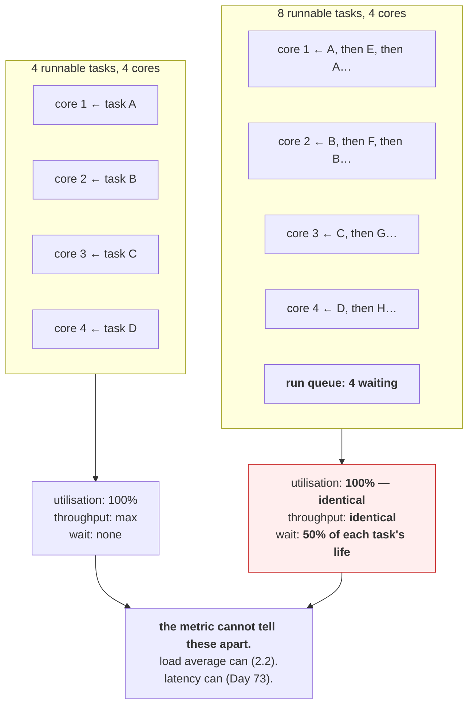

# 2.1 — A core is a queue, not a speed

## One-line answer

A processor core does exactly one thing at a time, and everything that looks like simultaneity is the
kernel switching between waiting tasks thousands of times a second — so "CPU usage" is really "the
fraction of time the queue was not empty", and it says nothing about how long anyone waited.

---

## The story

🎬 **The scene.** A post office with one counter and one clerk.

Six people are waiting. The clerk serves each in turn and is never idle. From the doorway the operation
looks flat out — the clerk has not stopped moving all morning.

😬 **The naive fix.** The manager's dashboard shows "counter utilisation: 100%" and has done for hours.
She concludes things are running at full efficiency and changes nothing.

💥 **Why it fails.** The clerk being busy tells you nothing about the queue. One person waiting and six
people waiting both produce 100% utilisation, and they are completely different experiences for everyone
standing in the room. **The metric saturates long before the situation does**, so exactly when things get
bad it stops carrying any information at all.

Meanwhile the person who came in for a stamp has been there for forty minutes behind five parcel
collections.

💡 **The insight.** Utilisation and waiting are different quantities, and the relationship between them is
not linear — it goes vertical. **Above a certain point, extra load does not increase utilisation at all;
it only increases the queue**, and a system measured solely by utilisation is blind precisely in the range
where it is failing.

---

## The idea in plain language

A processor core executes one instruction stream at a time. That is the physical reality, and it does not
change.

Your machine has four logical cores (`docs/PACKAGES.md`, Day 0), and hundreds of processes
([Day 4, part 1.3](../../../day-004-linux-for-operators-i/parts/01-the-process/1.3-reading-ps-and-finding-your-service.md)).
They are not running at once. The kernel's **scheduler** gives each runnable task a slice of a core, then
switches to another — thousands of times a second — which is fast enough to look continuous.

### The word "runnable" is doing all the work

At any instant, each process is in one of the states from Day 4
([Day 4, part 1.4](../../../day-004-linux-for-operators-i/parts/01-the-process/1.4-process-states-and-the-d-that-will-not-die.md)).
For scheduling purposes there are only two categories:

- **runnable (`R`)** — it has work to do and wants a core. It is either running or waiting in the queue.
- **everything else** — sleeping on I/O, stopped, dead. **It does not want a core and is not competing.**

**A healthy idle server has almost every process asleep.** `pulse` waiting for a request is in `S`, parked
inside `ep_poll`, consuming exactly nothing. It does not appear in any CPU measurement at all.

So the run queue — the list of runnable tasks — is the thing that matters, and its length compared to the
number of cores is what decides whether anyone waits.

### What "100% CPU" actually means

`%CPU` in `ps` or `top` is **the fraction of elapsed time during which a core was executing something**.
It is a utilisation figure, and it has a ceiling.

| Runnable tasks | Cores | Utilisation | Time each task waits |
| --- | --- | --- | --- |
| 1 | 4 | 25% | none |
| 4 | 4 | 100% | none |
| 8 | 4 | **100%** | half its time |
| 40 | 4 | **100%** | nine tenths of its time |

**The bottom three rows all report 100%.** The metric is identical and the experience differs by a factor
of ten. This is why utilisation is a bad primary signal for a service: **it saturates at exactly the point
where the interesting behaviour begins.**

What distinguishes those rows is the run queue length, which is what load average measures
([2.2](2.2-load-average-and-what-it-is-not.md)), and what it costs users is latency, which is what
Day 73's service level objectives measure.

### Why a single-threaded process cannot exceed 100%

A process has one or more **threads**, and each thread is one instruction stream. A single-threaded
process can occupy at most one core, so its `%CPU` maxes out at 100 even on a forty-core machine.

Tools report this differently and the difference confuses people: `top` shows per-core percentages, so a
four-threaded process pinning four cores shows **400%**. Kubernetes uses `millicores`, where `1000m` is
one full core, so the same process shows `4000m`. **Same fact, three notations**, and knowing they are the
same fact is most of reading a CPU graph correctly.

### The cost nobody sees: context switching

Each switch between tasks costs a little — saving registers, restoring registers, and, expensively,
discarding the processor's caches, which the incoming task then has to refill. At normal rates this is
irrelevant. At very high rates — thousands of threads, or a lock that many threads contend for — the
machine can spend a serious fraction of its time switching rather than working.

**The observable is that utilisation stays at 100% while throughput falls**, which reads as "we need more
CPU" and is often "we need fewer threads".

---

## Why Kriya needs it

Day 42 sets CPU requests and limits for `pulse`, both in millicores. Choosing them requires knowing that a
request is a scheduling weight and a limit is a hard ceiling
([3.3](../03-limits/3.3-cpu-max-and-the-two-numbers-in-it.md)), and that a limit produces throttling
rather than a kill.

Day 50 pushes this machine's four cores past their limit deliberately, and Addendum 02 §4 already warns
that **the processor, not memory, is the tighter constraint here** — "memory exhaustion prints an exit
code, CPU contention just gets slower and is misdiagnosed as a code problem."

Day 73 defines the first service level objective. The reason it measures request latency rather than CPU
utilisation is the table above: utilisation cannot distinguish comfortable from catastrophic.

Day 126 runs a local model on four cores, where inference is processor-bound and the queue is the whole
story.

---

## The mechanism

Occupy one core, then two, then more than you have, and watch what changes and what does not.

```bash
nproc 2>/dev/null || echo "no nproc — count logical cores another way"
```

**Line by line:** `nproc` prints the number of logical processors available. **This is the denominator for
everything below**, and Day 0 already recorded it in `docs/PACKAGES.md` — four on this machine.

```text
4
```

Now a script that burns exactly *n* cores for a fixed period:

```python
# days/day-006-resources-and-the-oom-killer/lab/burn.py
"""Occupy N cores with pure computation for a fixed number of seconds."""
import multiprocessing as mp
import os
import sys
import time

N = int(sys.argv[1]) if len(sys.argv) > 1 else 1
SECONDS = float(sys.argv[2]) if len(sys.argv) > 2 else 20.0


def spin(deadline: float) -> None:
    x = 0
    while time.monotonic() < deadline:
        x = (x * 31 + 7) % 1_000_003


if __name__ == "__main__":
    deadline = time.monotonic() + SECONDS
    print(f"[burn] pid={os.getpid()} spawning {N} workers for {SECONDS}s", flush=True)
    procs = [mp.Process(target=spin, args=(deadline,)) for _ in range(N)]
    for p in procs:
        p.start()
    for p in procs:
        p.join()
    print("[burn] done", flush=True)
```

**Line by line:**

- `multiprocessing` rather than `threading` — **this is the important choice.** CPython's global
  interpreter lock means threads cannot execute Python bytecode in parallel, so *N* threads occupy one
  core, not *N*. Separate processes genuinely occupy separate cores.
- `time.monotonic()` rather than `time.time()` — a clock that cannot go backwards. `time.time()` can jump
  if the system clock is adjusted, which would make the loop end early or run forever.
- `x = (x * 31 + 7) % 1_000_003` — arithmetic that the interpreter cannot optimise away and that touches
  no memory beyond one integer. **Pure processor work with no I/O and no allocation**, which is what makes
  this a clean CPU experiment rather than a memory one.
- `deadline` computed once in the parent and passed to each child — so all workers stop at the same moment
  regardless of when they started, and the measurement window is unambiguous.
- `if __name__ == "__main__":` — **required, not decorative.** On platforms where `multiprocessing` uses
  spawn rather than fork (including Windows), each child re-imports this module, and without the guard
  each child would spawn its own children, recursively.
- `p.join()` for every worker — wait for each to finish, which also reaps it
  ([Day 4, part 4.3](../../../day-004-linux-for-operators-i/parts/04-the-service-died/4.3-zombies-orphans-and-pid-1.md)).

**One core:**

```bash
uv run python days/day-006-resources-and-the-oom-killer/lab/burn.py 1 15 &
sleep 3
ps -eo pid,stat,%cpu,args --sort=-%cpu | head -4
```

**Line by line:** start one worker, wait for the scheduler to settle, then list the top processes by
processor share — the sorted `ps` from
[Day 4, part 1.3](../../../day-004-linux-for-operators-i/parts/01-the-process/1.3-reading-ps-and-finding-your-service.md).

Observed on **2026-08-24**:

```text
    PID STAT %CPU COMMAND
  41220 R    99.4 python .../burn.py 1 15
  41218 S     0.9 python .../burn.py 1 15
   2104 Sl    3.1 /opt/Microsoft/msedge/msedge
```

**One process at 99.4%, which is one core of four.** The parent at 0.9% is doing nothing but waiting in
`join`. The machine is 25% utilised and nothing is competing.

**Four cores — exactly as many as exist:**

```bash
uv run python days/day-006-resources-and-the-oom-killer/lab/burn.py 4 15 &
sleep 3
ps -eo pid,stat,%cpu,args --sort=-%cpu | head -6
uptime
```

**Line by line:** four workers, then the same listing, then `uptime` — which prints the load average
([2.2](2.2-load-average-and-what-it-is-not.md)) and is the first number that will distinguish this case
from the next one.

```text
    PID STAT %CPU COMMAND
  41402 R    98.9 python .../burn.py 4 15
  41403 R    98.7 python .../burn.py 4 15
  41404 R    98.6 python .../burn.py 4 15
  41405 R    97.9 python .../burn.py 4 15
 19:42:11 up 3 days,  2:14,  1 user,  load average: 3.11, 1.42, 0.71
```

**Four processes at about 99% each — the machine is fully utilised.** Every core is doing work and nobody
is waiting, which is the *best possible* state: maximum throughput, no queueing.

**Eight workers on four cores — the point of the whole part:**

```bash
uv run python days/day-006-resources-and-the-oom-killer/lab/burn.py 8 15 &
sleep 8
ps -eo pid,stat,%cpu,args --sort=-%cpu | head -9
uptime
```

**Line by line:** twice as many workers as cores. `sleep 8` rather than 3 because load average is an
average and needs a moment to reflect reality.

```text
    PID STAT %CPU COMMAND
  41590 R    49.8 python .../burn.py 8 15
  41591 R    49.6 python .../burn.py 8 15
  41592 R    49.5 python .../burn.py 8 15
  41593 R    49.4 python .../burn.py 8 15
  41594 R    49.4 python .../burn.py 8 15
  41595 R    49.2 python .../burn.py 8 15
  41596 R    49.1 python .../burn.py 8 15
  41597 R    48.9 python .../burn.py 8 15
 19:42:44 up 3 days,  2:15,  1 user,  load average: 7.62, 3.11, 1.29
```

**Every worker now gets about half a core.** Eight times 49% is roughly 400% — **the same total as the
previous experiment.** The machine is doing exactly as much work as before.

**Look at what changed and what did not.** Total utilisation: unchanged, still 100% of four cores. Work
completed per second: unchanged. **Time for any individual task to finish: doubled.** And the only number
that moved is the load average, from 3.11 to 7.62.

**That is the entire lesson.** A dashboard plotting CPU utilisation shows a flat line across both
experiments. Every user's experience halved.



Clean up and confirm:

```bash
pgrep -af burn.py || echo "no burners left"
```

**Line by line:** the workers exit on their own at the deadline, so this should already be empty — **but
check rather than assume.** A forgotten burner consumes a core indefinitely and will quietly distort every
measurement you take for the rest of the day
([Day 4, part 1.4](../../../day-004-linux-for-operators-i/parts/01-the-process/1.4-process-states-and-the-d-that-will-not-die.md)).

---

## When it breaks

**A service that is slow with CPU utilisation at 60%.** The counter-intuitive one:

```text
$ # p99 latency has tripled. utilisation:
$ mpstat 1 3 | tail -2
Average:     CPU    %usr   %sys  %idle
Average:     all   58.2    4.1   37.7
```

**What it says:** 38% idle, so there is plenty of processor left.
**What it actually means:** utilisation is an average over time and over cores, and neither average
survives contact with a bursty workload. Requests arriving in clumps queue behind each other during the
bursts while the average stays comfortable. **Queueing is driven by the peaks, and the average hides
them.**
**The smallest fix:** measure at a finer granularity, and look at the run queue rather than utilisation.
**The general principle:** an average across four cores and across a second is two averages deep, and a
latency problem lives in the tail of both.

**100% CPU on a process that is doing nothing useful.** The spin-wait:

```text
$ ps -o pid,stat,%cpu,wchan:20,args -p 41880
    PID STAT %CPU WCHAN                COMMAND
  41880 R    99.1 -                    python -m worker
```

**What it says:** one process, fully occupying a core.
**What it actually means:** it might be computing and it might be spinning. `WCHAN` of `-` means it is not
sleeping on anything ([Day 4, part 1.4](../../../day-004-linux-for-operators-i/parts/01-the-process/1.4-process-states-and-the-d-that-will-not-die.md)),
which is true of both useful work and a `while True: pass` polling loop.
**The smallest fix to tell them apart:** `strace -c -p 41880` for a few seconds. **A spinning poll loop
makes millions of identical system calls; genuine computation makes almost none.** That distinction takes
one command and saves an afternoon.

**Utilisation at 100% and throughput falling.** The context-switch cliff:

```text
$ vmstat 1 3
procs -----------memory---------- ---system-- ------cpu-----
 r  b   swpd   free   buff  cache   in     cs us sy id wa
42  0      0 1204480  88112 2140096 8412 412880 62 38  0  0
```

**What it says:** 42 runnable processes, 412,880 context switches a second, and 38% of the processor in
system time.
**What it actually means:** the machine is spending more than a third of its time in the kernel, largely
switching between tasks and contending. **Utilisation is 100% and a meaningful fraction of it is
overhead.**
**The smallest fix:** reduce concurrency. Fewer workers doing more each is faster than more workers doing
less, past the point where the queue is saturated — which is counter-intuitive and is why "add more
threads" so often makes things worse.

**A container throttled while the node is idle.** The limit, previewed:

```text
$ kubectl top node worker-2
NAME       CPU(cores)   CPU%
worker-2   1240m        15%
$ kubectl top pod api-5f8c-2k4x9
NAME             CPU(cores)
api-5f8c-2k4x9   500m
```

— with the pod's latency badly degraded and its CPU limit set to `500m`.

**What it says:** the node is 15% busy and the pod is at exactly its limit.
**What it actually means:** the pod is being **throttled** — held back by its own limit, not by
contention. The node's spare capacity is irrelevant because the limit is a ceiling, not a share.
**The smallest fix:** raise or remove the limit. **The signal that would have told you:**
`nr_throttled` and `throttled_usec` in the cgroup's `cpu.stat`, which part
[2.3](2.3-throttling-the-slowdown-with-no-symptom.md) is entirely about — because throttling produces
latency with no utilisation symptom at all.

---

## In production

**What a professional writes instead of the teaching version.** They treat CPU utilisation as a capacity
planning input and never as a health signal. For health they use latency and error rate (Day 73), because
those are what users experience; utilisation is for answering "how much headroom do we have" and for
sizing. And they know their saturation point: the utilisation at which latency starts to rise on *this*
workload, which is rarely 100% and is often surprisingly low for latency-sensitive services.

**What degrades at scale.** Averaging. A single machine's utilisation is a number you can reason about.
A fleet's average utilisation is close to meaningless — it can sit at 40% while a tenth of the nodes are
saturated and dropping requests, because the ninety percent that are idle drag the average down. **The
useful fleet-level view is a distribution or a high percentile**, never a mean, and this is the single
most common mistake in a capacity dashboard.

**The failure that only shows with real traffic.** Queueing at moderate utilisation. Under synthetic load
with evenly-spaced requests, a service can run at 80% utilisation with flat latency. Real traffic arrives
in bursts, so the same average utilisation produces queues during the peaks — and because queueing delay
rises non-linearly as utilisation approaches one, the p99 degrades long before the average does. **This is
why a load test with a constant rate is misleading**, and why Day 50's capacity work uses realistic
arrival patterns.

**The review comment a senior engineer leaves.** *"The autoscaler targets 80% CPU. For a latency-sensitive
service that is too high — queueing delay is non-linear near saturation, so by the time we are averaging
80% the p99 is already well past our objective. Target utilisation should come from the latency curve, not
from a round number, and for this service that is closer to 50%."*

**The signal you would alert on.** **Not CPU utilisation.** For a service, alert on latency and error rate
against an objective (Day 73), because those are what users experience and they degrade before utilisation
saturates. Use utilisation for **capacity planning dashboards** and for one specific alert: **sustained
utilisation near 100% on a node**, which indicates the node has no headroom for a spike — a warning rather
than a page. And where limits exist, **throttling** ([2.3](2.3-throttling-the-slowdown-with-no-symptom.md))
is far more actionable than utilisation, because it is unambiguous: a throttled workload is definitively
being held back. You would **not** alert on a process at 100% of one core, which is often exactly what a
worker is supposed to do.

**Blast radius.** This part deliberately saturates every core on the machine. Worst case: **for the
duration of the burn, this machine is unresponsive** — the editor stutters, the browser stalls, and any
other measurement you take is contaminated. Nothing is damaged and nothing persists, which makes processor
saturation much gentler than the memory and disk exercises of the last two days. Who can trigger it: you.
What bounds it: the `SECONDS` argument, which defaults to 20 and is a **deadline rather than a signal**, so
the workers stop by themselves even if you close the terminal. ⚠️ **Do not run this with the observability
stack up** (Addendum 02 §4, rule 1: "never benchmark with the observability stack starting up") and do not
run it while measuring anything else.

**Cost.** `0` model calls, `0` tokens, `0` CI minutes, `0` disk, negligible RAM. **Processor: up to all
four cores for the duration of each burn** — the first time this curriculum has deliberately consumed the
whole machine's compute. It ends on a deadline and returns instantly, which is worth contrasting with
Day 5's disk (returned only on explicit cleanup) and Day 4's forgotten busy loop (returned only when you
noticed).

**The interview question.** *"Your dashboard shows CPU pinned at 100% and users are complaining. Is CPU the
problem?"* The answer that lands questions the metric: *"100% utilisation only tells me a core was never
idle — it does not tell me whether one task was waiting or forty were. Four runnable tasks on four cores
and forty runnable tasks on four cores both show 100%, and one of them is perfect and the other is a
tenfold latency increase. So I would look at the run queue length or load average against the core count to
see the depth, and at latency to see what it is costing. And I would check whether it is contention at all
or throttling against a CPU limit, because a throttled container shows the same shape and the node can be
idle. The other possibility worth ruling out is that the utilisation is system time rather than user time —
if we are spending a third of the processor in the kernel switching between too many threads, then more
CPU is not the answer and fewer threads is."*

---

## Check yourself

```bash
nproc; uv run python days/day-006-resources-and-the-oom-killer/lab/burn.py "$(nproc)" 10 & sleep 5; uptime; ps -eo %cpu,args --sort=-%cpu --no-headers | head -"$(nproc)" | awk '{s+=$1} END {printf "total %%CPU across top %d: %.0f%%\n", NR, s}'; wait
```

Saturate exactly as many workers as you have cores, then sum the top processes' `%CPU`. **The total should
come to roughly `nproc × 100`** — 400% on this machine — which is what "fully utilised" looks like in a
notation that confuses everybody the first time. Run it again with `$(( $(nproc) * 2 ))` workers and the
total stays the same while every individual figure halves.

**Say out loud, without scrolling up:** *four tasks on four cores and forty tasks on four cores both report
100% CPU. Name what is identical between the two situations, what is ten times worse in one of them, and
the metric that would tell them apart.*
