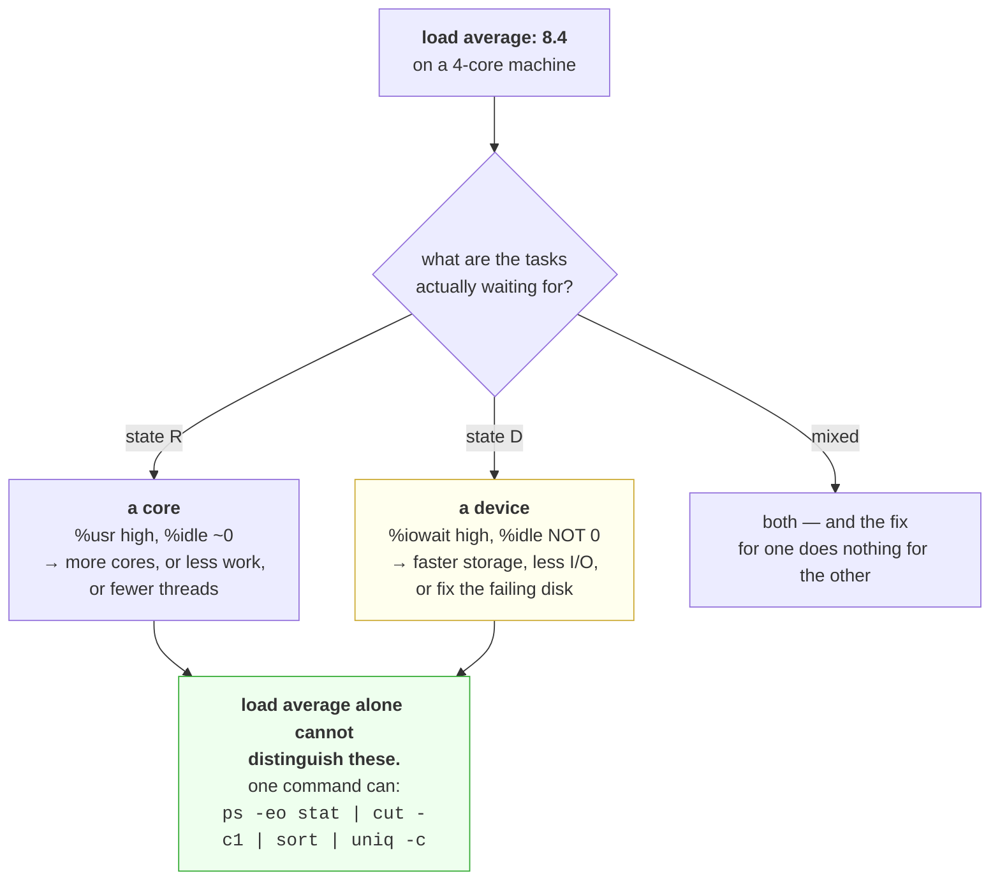

# 2.2 — Load average, and what it is not

## One-line answer

Load average counts runnable tasks — **and on Linux, tasks blocked in uninterruptible disk sleep as well**
— so it is not a percentage, it is not bounded by anything, and a load of 8 can mean a busy machine or a
failing disk with almost no processor use at all.

---

## The story

🎬 **The scene.** A GP surgery with one doctor. On the wall is a counter showing "people in the building".

Monday morning: the counter reads 12. Eleven patients waiting, one being seen. The doctor is working
flat out and the wait is long.

Wednesday afternoon: the counter reads 12 again. But this time one patient is being seen, one is waiting,
and **ten are sitting in the corridor waiting for blood test results from the lab across town.** The lab's
courier has not arrived. The doctor has nothing to do and is drinking tea.

😬 **The naive fix.** The practice manager, looking only at the counter, hires a second doctor.

💥 **Why it fails.** On Wednesday a second doctor changes nothing — nobody is waiting for a doctor. They
are waiting for a lab. The counter conflated two completely different kinds of waiting because both look
identical from the door: *a person in the building who is not finished.*

💡 **The insight.** A single number that counts "things not yet finished" is genuinely useful and cannot
tell you **what they are waiting for** — and the remedy for each kind of waiting is different. Reading it
as one thing produces confident action on the wrong bottleneck.

---

## The idea in plain language

`uptime` and `top` print three numbers: **load average over one minute, five minutes and fifteen minutes.**
They are exponentially-weighted moving averages, so recent activity counts more.

What they average is a **count of tasks**, not a percentage. On Linux that count is:

- tasks in state `R` — running or waiting for a core, plus
- tasks in state `D` — **uninterruptible sleep**, which on Linux almost always means blocked on disk or on
  a network filesystem
  ([Day 4, part 1.4](../../../day-004-linux-for-operators-i/parts/01-the-process/1.4-process-states-and-the-d-that-will-not-die.md)).

**That second category is Linux-specific and it is the whole reason this part exists.** Most other Unix
systems count only runnable tasks. Linux includes `D`, so a machine with a failing disk shows a very high
load average and an idle processor.

### Reading the number

The only useful comparison is **against the core count**. This machine has four (`docs/PACKAGES.md`,
Day 0):

| Load average | On 4 cores | Means |
| --- | --- | --- |
| 0.5 | 12% | almost idle |
| 4.0 | 100% | fully utilised, nobody waiting — **the ideal** |
| 8.0 | 200% | on average, half the runnable work is waiting for a core |
| 40 | 1000% | severe contention, or a stuck disk, or both |

**A load equal to your core count is not a warning; it is the target.** The machine is doing as much work
as it can with nobody queued. A load of 1.0 on a forty-core machine means the machine is asleep.

### The three numbers are a direction, not three measurements

The value of having one, five and fifteen minute figures is entirely in comparing them:

- `8.1, 4.2, 2.0` — **rising.** Something started recently and is getting worse.
- `2.0, 4.2, 8.1` — **falling.** Whatever it was has passed; you are looking at the tail.
- `4.1, 4.0, 4.2` — **steady.** This is the normal state of this machine, whatever the number.

**The shape is more actionable than the value**, because "is this getting worse?" determines whether you
act now, and the absolute number requires context you may not have.

### What it cannot tell you

It cannot distinguish processor contention from disk waiting. It cannot tell you which process is
responsible. It is not bounded, so there is no "100%" to be at. And it is an average over a window, so a
short severe spike barely moves the one-minute figure.

**It is a smoke alarm.** It tells you to look, and it does not tell you where.

---

## Why Kriya needs it

Day 50 pushes this machine's four cores past their limit deliberately, and Addendum 02 §4 already
identifies the processor as the tighter constraint here — "CPU contention just gets slower and is
misdiagnosed as a code problem." Load average is the cheapest instrument that says "this is contention".

Day 62 exposes node metrics and Day 63 writes PromQL against them. `node_load1` divided by
`node_cpu_seconds_total` core count is one of the first genuinely useful expressions you will write.

Day 76 builds the first alert. Load average is a classic bad alert — unbounded, ambiguous, and noisy — and
understanding *why* is how you learn to choose better signals.

Day 84's incident lab gives you a symptom and no cause. "Load is 40 and the processor is idle" is one of
the scenarios, and it is unsolvable without knowing that `D` counts.

---

## The mechanism

Produce a high load average two completely different ways and watch the number fail to distinguish them.

```bash
uptime
```

**Line by line:** `uptime` prints how long the machine has been up, how many users are logged in, and the
three load figures. **It is the cheapest possible first look at a machine** and costs one read of
`/proc/loadavg`.

Observed on **2026-08-24**:

```text
 20:14:03 up 3 days,  2:46,  1 user,  load average: 0.28, 0.41, 0.52
```

**0.28 on four cores — the machine is idle.** And note the three numbers are falling slightly, so whatever
was happening a quarter of an hour ago has subsided.

The raw source:

```bash
cat /proc/loadavg 2>/dev/null || echo "no /proc/loadavg — Windows; see the note in part 1.3"
```

**Line by line:** the file `uptime` reads. Five fields: the three averages, then **the number of currently
runnable tasks over the total number of tasks**, then the most recently created process identifier.

```text
0.28 0.41 0.52 1/842 42193
```

**`1/842` is the useful extra.** One runnable task right now out of 842 that exist — which is the
instantaneous version of what the averages smooth. Most of those 842 are asleep and cost nothing
([2.1](2.1-a-core-is-a-queue-not-a-speed.md)).

### Cause one: processor contention

```bash
uv run python days/day-006-resources-and-the-oom-killer/lab/burn.py 8 60 &
sleep 45
uptime
ps -eo stat --no-headers | cut -c1 | sort | uniq -c | sort -rn | head -4
```

**Line by line:**

- Eight workers on four cores — the over-subscription from
  [2.1](2.1-a-core-is-a-queue-not-a-speed.md).
- `sleep 45` — **long enough for the one-minute average to reflect reality.** An exponentially-weighted
  average over a minute needs most of a minute; measuring after three seconds shows you the past, not the
  present. This is the commonest mistake with load average.
- The state census from
  [Day 4, part 1.4](../../../day-004-linux-for-operators-i/parts/01-the-process/1.4-process-states-and-the-d-that-will-not-die.md),
  so you can see **which** state is inflating the count.

```text
 20:16:02 up 3 days,  2:48,  1 user,  load average: 7.84, 4.12, 1.88
    798 S
      8 R
     36 I
```

**Load 7.84, and eight tasks in `R`.** The number and the cause agree: eight runnable tasks, four cores,
half of them waiting for a core at any instant. The rising shape — 7.84, 4.12, 1.88 — says this started
recently.

**Processor utilisation here is 100%**, so the two signals tell a consistent story and either would have
led you to the same place.

### Cause two: blocked I/O, with an idle processor

This is the case load average alone cannot distinguish, and it is the reason for the part.

```bash
# 🅿️ PARKED until Day 21 (WSL2) — needs Linux, and a filesystem you can safely stall.
# Generate heavy synchronous disk I/O so tasks sit in D rather than R.
# for i in $(seq 1 8); do
#   dd if=/dev/urandom of=/tmp/io-$i.bin bs=1M count=800 oflag=direct 2>/dev/null &
# done
# sleep 45
# uptime
# ps -eo stat --no-headers | cut -c1 | sort | uniq -c | sort -rn | head -4
# mpstat 1 3 | tail -2
# rm -f /tmp/io-*.bin
```

**Line by line:**

- `dd if=/dev/urandom of=... bs=1M count=800` — write 800 MiB per worker. Random data so it cannot be
  compressed or stored sparsely
  ([Day 5, part 3.1](../../../day-005-linux-for-operators-ii/parts/03-the-disk-that-fills/3.1-df-du-and-why-they-disagree.md)).
- `oflag=direct` — **the flag that makes this an I/O experiment rather than a memory one.** It bypasses
  the page cache ([1.3](../01-memory/1.3-the-page-cache-that-looks-like-a-leak.md)), so each write goes to
  the device and the task genuinely blocks in `D` rather than returning immediately from a cache write.
- Eight of them in parallel, so the device is the bottleneck rather than any single writer.
- `mpstat 1 3` — per-core utilisation over three one-second samples. **This is the discriminator**: it
  will show high `%iowait` and low `%usr`.
- ⚠️ **Check `df -h /tmp` first** — this writes 6.4 GiB, and if `/tmp` is `tmpfs` it goes into memory
  ([Day 5, part 1.2](../../../day-005-linux-for-operators-ii/parts/01-the-filesystem/1.2-paths-mounts-and-the-tree-that-is-not-one-disk.md)).
  Reduce `count` if you have less headroom.

Expected shape on a machine with a slow disk:

```text
 20:22:10 up 3 days,  2:54,  1 user,  load average: 8.42, 5.10, 2.31
    791 S
      8 D
      2 R
Average:     CPU    %usr   %nice    %sys %iowait  %idle
Average:     all    2.1     0.0     3.8    71.4    22.7
```

**Load 8.42 — indistinguishable from the processor experiment. And the processor is 22.7% idle with 71.4%
iowait.**

Eight tasks in `D`, two in `R`. **Adding cores to this machine would change nothing whatsoever**, because
nothing is waiting for a core. The state census told you in one line what the load average could not tell
you at all.



Clean up:

```bash
pgrep -af burn.py || echo "no burners left"
```

**Line by line:** confirm nothing is still consuming cores. The burners exit on their deadline, but
**checking rather than assuming** is the habit — a forgotten burner distorts every measurement afterwards.

---

## When it breaks

**Load average of 40 with an idle processor.** The classic mystery:

```text
$ uptime
 03:14:22 up 89 days, load average: 41.28, 39.90, 37.11
$ mpstat 1 2 | tail -1
Average:     all    1.2     0.0     2.1    0.3    96.4
```

**What it says:** enormous load, 96% idle.
**What it actually means:** the tasks are in `D`, not `R`, and — because `%iowait` is *also* near zero —
they are blocked on something that is not making progress at all. This is the signature of a **hung**
device rather than a busy one: a network filesystem whose server has gone away, or a storage volume
detached underneath the machine.
**The smallest fix:** find what they are waiting on.

```bash
ps -eo pid,stat,wchan:24,args | awk '$2 ~ /^D/' | head
```

**Line by line:** filter to processes whose state starts with `D`, and print `wchan` — **the kernel
function they are sleeping inside**, which names the subsystem
([Day 4, part 1.4](../../../day-004-linux-for-operators-i/parts/01-the-process/1.4-process-states-and-the-d-that-will-not-die.md)).
`awk '$2 ~ /^D/'` rather than `grep D` so it matches the state column specifically and not any `D` in a
command line.

```text
   4412 D    nfs_wait_bit_killable    cp /mnt/share/model.bin /tmp/
   4498 D    nfs_wait_bit_killable    python -m worker
```

**`nfs_wait_bit_killable` is the answer**, and no amount of processor will help. **These processes cannot
be killed either** — not even with `SIGKILL`
([Day 4, part 2.4](../../../day-004-linux-for-operators-i/parts/02-signals/2.4-the-signals-you-cannot-catch.md)).

**A load average that looks fine during an outage.** The averaging window hiding a spike:

```text
$ uptime
 14:02:11 up 12 days, load average: 1.84, 1.62, 1.55
```

— taken during a period when p99 latency was fifty times normal.

**What it says:** an unremarkable machine.
**What it actually means:** the contention lasted a few seconds and the one-minute average barely
registered it. **An exponentially-weighted average over sixty seconds cannot see a three-second spike**,
and three seconds is long enough to time out every request in flight.
**The smallest fix:** do not use load average for anything sub-minute. **Use the run queue length sampled
frequently, or — better — measure latency directly**, which is what Day 73 does and why it does it.

**Load average on a container that reports the host's number.** A container-specific trap:

```text
$ kubectl exec api-5f8c -- uptime
 20:31:02 up 41 days,  load average: 38.20, 36.11, 34.88
$ kubectl exec api-5f8c -- nproc
2
```

**What it says:** load 38 on a two-core container.
**What it actually means:** `/proc/loadavg` is **not namespaced** — the container sees the *host's* load
average, across all its cores and all its other tenants. `nproc` may report the container's CPU limit, so
the two numbers are about different things entirely and dividing one by the other is meaningless.
**The smallest fix:** ignore load average inside containers. **Use the cgroup's own `cpu.stat`**
([2.3](2.3-throttling-the-slowdown-with-no-symptom.md)), which is namespaced and tells you about your
workload rather than about your neighbours.

**Load rising steadily with no change in traffic.** The slow-motion version:

```text
# load1 sampled hourly over a day
0.8  0.9  1.1  1.4  1.7  2.1  2.6  3.2  3.9  4.8  5.9  7.1
```

**What it says:** a machine getting steadily busier with no external cause.
**What it actually means:** most likely something is accumulating — threads that are never joined,
connections that are never closed, or processes that are never reaped
([Day 4, part 4.3](../../../day-004-linux-for-operators-i/parts/04-the-service-died/4.3-zombies-orphans-and-pid-1.md)).
**Zombies do not count towards load** (they are not runnable), but the processes leaking them often are.
**The smallest fix:** count tasks over time — the fourth field of `/proc/loadavg` — rather than watching
only the averages. **A rising total task count with steady traffic is a leak**, and it is visible hours
before the load average becomes alarming.

---

## In production

**What a professional writes instead of the teaching version.** They use load average as a triage
shortcut and never as an alert. It answers "should I look?" in one cheap command on a machine they have
just logged into, and it is followed immediately by a state census to find out which kind of waiting it
is. For anything automated they use signals that are unambiguous: run queue length for processor
contention, `%iowait` and device latency for storage, throttling counters for limits, and request latency
for user impact.

**What degrades at scale.** Comparability. Load 8 means "twice over-subscribed" on a four-core machine and
"almost idle" on a sixty-four-core one, so a fleet dashboard plotting raw load average across
heterogeneous machines is unreadable. The fix is to normalise — load divided by core count — which makes
the number comparable and is what any sensible fleet view does. **Even normalised, it still conflates `R`
and `D`**, so it remains a triage signal rather than a diagnosis.

**The failure that only shows with real traffic.** The mixed case. Under synthetic load you generate one
kind of pressure and the signals are clean. In production a busy machine is usually doing both — some
tasks queued for cores, some blocked on storage — and load average sums them into a number that suggests a
single bottleneck. **Acting on it picks one at random.** The state census costs one command and resolves
it, which is why it belongs in every runbook next to the load average that prompted it.

**The review comment a senior engineer leaves.** *"The alert fires when `node_load5 > 8`. These nodes have
sixteen cores, so that is half-utilised and completely normal — and it will also fire when a disk is
degraded and the CPU is idle, which needs a completely different response. Normalise by core count, and
alert on what users experience rather than on a proxy."*

**The signal you would alert on.** **Not load average.** For processor contention specifically, alert on
run queue length per core, or on the pressure stall information
([4.4](../04-the-oom-killer/4.4-pressure-the-signal-that-warns-you-first.md)) which the kernel computes
precisely to fix load average's ambiguity — `/proc/pressure/cpu` reports the share of time tasks spent
stalled waiting for a processor, and `/proc/pressure/io` the same for storage, **as separate numbers**.
That separation is exactly what load average lacks. If you must use load, **normalise it by core count and
treat it as a warning rather than a page**. And for user impact, always latency (Day 73). You would
**not** alert on any absolute load value across a heterogeneous fleet.

**Blast radius.** This part re-uses the burner from [2.1](2.1-a-core-is-a-queue-not-a-speed.md) and, in
its parked half, writes 6.4 GiB of data with direct I/O. Worst case for the processor half: the machine is
unresponsive for the burn's duration and recovers completely. **Worst case for the parked I/O half is more
serious**: 6.4 GiB written, and `oflag=direct` at that volume will make the machine feel broken while it
runs — every other process competing for the same device stalls. Who can trigger it: you, on Day 21. What
bounds it: the `count` argument, the `df -h /tmp` check before running, and the `rm` at the end. ⚠️ **Do
not run the I/O half on a machine anyone else is using**, and never on one whose storage you suspect is
already degraded — you would be adding load to a failing device.

**Cost.** `0` model calls, `0` tokens, `0` CI minutes. **Processor: all four cores for 60 seconds.
Disk: 6.4 GiB temporarily in the parked half, deleted at the end.** Reading `/proc/loadavg` is free —
one small file — which is why load average is the first thing every tool shows you and why it survives
despite its ambiguity.

**The interview question.** *"Load average is 40 on an eight-core box. What do you do?"* The answer that
lands refuses to assume the cause: *"First I check whether it is processor or I/O, because on Linux load
average counts both runnable tasks and tasks in uninterruptible disk sleep, and the fixes are opposite.
One command does it — a census of process states — and if I see a pile of `D` states then no amount of CPU
will help and I go and look at storage, reading `wchan` to find out which subsystem. If they are `R` then
it is genuine contention and I look at what is running and whether we have too many threads. I would also
check whether the load is rising or falling from the one, five and fifteen minute figures, because that
decides whether I act now. What I would not do is alert on load average — it is unbounded, it means
different things on different machines, and it conflates two problems. Pressure stall information reports
CPU and I/O stall separately, which is what load average should have been."*

---

## Check yourself

```bash
cat /proc/loadavg 2>/dev/null && nproc && ps -eo stat --no-headers | cut -c1 | sort | uniq -c | sort -rn | head -5 || echo "no /proc — Windows; run in WSL2 from Day 21"
```

The three averages plus the runnable/total task counts, the core count to divide by, and the state census
that says which kind of waiting it is. **Those three outputs together are a complete triage** — and
running them as one line is the habit, because the load average on its own is the half of the answer that
sends people to the wrong place.

**Say out loud, without scrolling up:** *load average is 8 on a four-core machine and the processor is 90%
idle. Say what state the tasks are in, why more cores would not help, and the single command that would
have told you.*
