# 2.3 — Throttling — the slowdown with no symptom

## One-line answer

A CPU limit is enforced by stopping the workload dead for the rest of each accounting period once it has
used its quota — so a throttled service is slow while the machine is idle, its utilisation looks
comfortable, and the only evidence is a counter almost nobody watches.

---

## The story

🎬 **The scene.** A shared office with a photocopier and a fair-use rule: two hundred pages per department
per hour, tracked by a card.

The design department has a hundred-page job. They copy it in three minutes, and everything is fine.

Next week they have a four-hundred-page job. They copy two hundred pages in six minutes, and then the
machine simply stops accepting their card until the hour turns. The remaining pages wait fifty-four
minutes for a machine that is standing idle in an empty corridor.

😬 **The naive fix.** The office manager, asked why design is missing deadlines, checks the copier's usage
log. It shows the machine idle for most of every hour. She concludes there is plenty of copier capacity
and the problem must be the design team's planning.

💥 **Why it fails.** The machine *is* idle, and design *is* blocked, and both are consequences of the same
rule. **Nothing in the copier's usage log records a refusal** — it logs pages copied, not cards declined —
so the only trace of the actual problem is a number nobody is keeping.

💡 **The insight.** A quota enforced by refusal produces a resource that is simultaneously idle and
unavailable. **Utilisation metrics measure what was used and are structurally incapable of measuring what
was denied** — so the whole failure is invisible unless something counts the refusals.

---

## The idea in plain language

A CPU limit is not a share and it is not a priority. It is a **hard quota per accounting period**, and the
enforcement mechanism is brutal in a way that surprises people.

Verified against `docs.kernel.org/admin-guide/cgroup-v2.html` on **2026-08-24**, the interface is
`cpu.max`: *"The maximum bandwidth limit. It's in the following format: $MAX $PERIOD which indicates that
the group may consume up to $MAX in each $PERIOD duration."*

So a limit is two numbers. The default period is 100 milliseconds. A quota of 50,000 microseconds within a
100,000-microsecond period is "half a core".

**The enforcement:** when a cgroup exhausts its quota part-way through a period, **every task in it is
descheduled until the next period begins.** Not slowed. Not deprioritised. Stopped.

### Why this is worse than it sounds

Consider a service limited to half a core, handling a request that needs 30 milliseconds of processor
time.

If the work is spread evenly, it fits. If it is not — and real work is bursty — the service can exhaust
its 50 ms quota in the first 50 ms of the period and then **sit idle for 50 ms**, mid-request, while every
core on the machine is free.

The user's latency for that request is now 80 ms instead of 30. **And nothing anywhere reports an error, a
saturation, or a high utilisation** — the container's average CPU usage is exactly 50%, which looks like
half the headroom is spare.

### The multi-threaded trap

This gets sharply worse with concurrency, and it is the single most common way people set a limit that
destroys their service.

**Quota is consumed by all threads together.** A container limited to `1000m` — one core — running four
threads that each want a core consumes its 100 ms of quota in **25 ms of wall-clock time**, and is then
frozen for the remaining 75 ms of every period.

**The service spends three quarters of its life stopped.** Its measured CPU usage is 100% of its limit,
which looks like "at capacity" and is actually "throttled to a quarter speed by arithmetic".

This is why a runtime that sizes its thread pool from the machine's core count — which most do by default
— behaves catastrophically inside a container with a low CPU limit: it creates sixty-four threads on a
sixty-four-core node and then runs them against a one-core quota.

### The one signal that sees it

Also from the cgroup v2 documentation, `cpu.stat` reports `usage_usec`, `user_usec`, `system_usec`, and —
when a limit is set — **`nr_throttled` and `throttled_usec`**.

- **`nr_throttled`** — the number of periods in which this cgroup hit its quota and was stopped.
- **`throttled_usec`** — the total microseconds spent stopped.

**These are the only direct evidence throttling exists.** Utilisation cannot show it, load average cannot
show it ([2.2](2.2-load-average-and-what-it-is-not.md)) because the tasks are neither runnable nor blocked
on I/O — they are simply not being scheduled — and the application sees nothing but time passing.

---

## Why Kriya needs it

Day 42 sets CPU requests and limits for `pulse`, and the argument on that day is whether to set a CPU
limit at all. This part is the case against, and `nr_throttled` is the evidence you will use.

Day 50 is capacity work on this four-core machine, where Addendum 02 §4 already warns that processor
contention "just gets slower and is misdiagnosed as a code problem". Throttling is that failure with a
configuration rather than contention behind it.

Day 73 defines the first service level objective, measured as latency. Throttling degrades latency without
touching any resource metric, which is the strongest possible argument for measuring what users experience
rather than what machines report.

Day 118 monitors a model server. Inference is bursty and processor-heavy, which is exactly the shape that
suffers most from a quota — and Day 126 runs one locally on four cores.

---

## The mechanism

🅿️ **Most of this part is parked until Day 21 (WSL2) and Day 25 (containers)**, because setting a CPU
quota needs cgroups and this machine cannot. **Read it now; the arithmetic is the part that matters and
you can do that here.**

First, see the shape of the interface on a Linux machine:

```bash
# 🅿️ PARKED — Linux with cgroup v2. Read your own cgroup's CPU settings.
# cat /sys/fs/cgroup/cpu.max
# cat /sys/fs/cgroup/cpu.stat
```

**Line by line:**

- `/sys/fs/cgroup/cpu.max` — the quota and period for the current cgroup
  ([3.1](../03-limits/3.1-cgroups-the-box-you-put-a-process-in.md)). `max 100000` means no limit;
  `50000 100000` means half a core.
- `/sys/fs/cgroup/cpu.stat` — the counters, including `nr_throttled` and `throttled_usec` **when a limit
  is set**. Without a limit those two lines are absent, which is itself informative.

```text
max 100000
usage_usec 8412990
user_usec 7211004
system_usec 1201986
nr_periods 0
nr_throttled 0
throttled_usec 0
```

**`max 100000` — no limit, so `nr_throttled` is zero and always will be.** A cgroup with no quota cannot
be throttled, which is why removing the limit is a legitimate fix rather than a cop-out.

### The demonstration, with a limit set

```bash
# 🅿️ PARKED until Day 25 — needs a container runtime.
# Run the same burn twice: once unlimited, once limited to half a core.
#
# docker run --rm -v "$PWD:/w" -w /w python:3.12-slim \
#   python days/day-006-resources-and-the-oom-killer/lab/burn_timed.py
#
# docker run --rm --cpus 0.5 -v "$PWD:/w" -w /w python:3.12-slim \
#   python days/day-006-resources-and-the-oom-killer/lab/burn_timed.py
```

**Line by line:**

- `--rm` so each experiment leaves nothing behind.
- `-v "$PWD:/w" -w /w` — mount the repository at `/w` and start there, so the container can see the script
  ([Day 5, part 2.4](../../../day-005-linux-for-operators-ii/parts/02-permissions/2.4-the-container-user-you-will-meet-on-day-28.md)
  has the ownership caveat).
- `--cpus 0.5` — **the only difference between the two runs.** Docker translates this into `cpu.max` of
  `50000 100000`.
- `python:3.12-slim` — a small official image. **Verified as a real tag before use**: `TODO(docker
  manifest inspect python:3.12-slim)` to confirm on the day you run it, per Principle 7.

The script that measures it — **this one you can write today**, even though you cannot yet run it under a
limit:

```python
# days/day-006-resources-and-the-oom-killer/lab/burn_timed.py
"""Do a fixed amount of computation and report how long the wall clock took.

With no CPU limit, wall time ~= CPU time. Under a quota, wall time is inflated by the
periods the cgroup spent descheduled - which is exactly the throttling this part is about.
"""
import os
import time

ITERATIONS = 30_000_000


def read_cpu_stat() -> dict[str, int]:
    """cpu.stat for the current cgroup. Empty where cgroup v2 is not mounted here."""
    out: dict[str, int] = {}
    try:
        for line in open("/sys/fs/cgroup/cpu.stat"):
            key, _, value = line.partition(" ")
            out[key] = int(value)
    except OSError:
        pass
    return out


before = read_cpu_stat()
wall_start = time.monotonic()
cpu_start = time.process_time()

x = 0
for _ in range(ITERATIONS):
    x = (x * 31 + 7) % 1_000_003

wall = time.monotonic() - wall_start
cpu = time.process_time() - cpu_start
after = read_cpu_stat()

print(f"[timed] pid={os.getpid()}", flush=True)
print(f"[timed] cpu time   : {cpu:6.2f}s", flush=True)
print(f"[timed] wall time  : {wall:6.2f}s", flush=True)
print(f"[timed] ratio      : {wall / cpu:6.2f}x  (1.0 = never descheduled)", flush=True)
if after:
    print(
        f"[timed] throttled  : {after.get('nr_throttled', 0) - before.get('nr_throttled', 0)}"
        f" periods, {(after.get('throttled_usec', 0) - before.get('throttled_usec', 0)) / 1e6:.2f}s",
        flush=True,
    )
else:
    print("[timed] throttled  : cpu.stat unavailable (no cgroup v2 here)", flush=True)
```

**Line by line:**

- `time.process_time()` — **processor time consumed by this process**, excluding time it was not running.
  This is the crucial pairing: it measures work done.
- `time.monotonic()` — **wall-clock time**, which includes every moment the process was descheduled. The
  difference between the two is the throttling.
- `wall / cpu` — **the ratio is the whole measurement.** Near 1.0 means the process ran essentially
  continuously; 4.0 means it spent three quarters of its life stopped.
- `read_cpu_stat()` before and after, subtracting — **deltas, not absolutes.** The counters are
  cumulative since the cgroup was created, so only the difference across your workload means anything.
- `except OSError: pass` returning `{}` — degrades honestly where cgroup v2 is not mounted, and the `else`
  branch says so out loud rather than printing zeros that look like "no throttling"
  ([1.1](../01-memory/1.1-virtual-memory-and-why-the-number-is-a-lie.md) uses the same pattern).
- `line.partition(" ")` — `cpu.stat` is `key value` per line, space-separated. `partition` is safe against
  a malformed line in a way `split()[1]` is not.
- `ITERATIONS = 30_000_000` — enough work to take a few seconds so the ratio is measurable, and pure
  arithmetic so no I/O or allocation contaminates the timing
  ([2.1](2.1-a-core-is-a-queue-not-a-speed.md)).

Run it unthrottled today, to establish the baseline you will compare against:

```bash
uv run python days/day-006-resources-and-the-oom-killer/lab/burn_timed.py
```

**Line by line:** no container, no limit — so this is the control. **Write the ratio down**; on Day 25 you
run the identical script under `--cpus 0.5` and the only thing that changes is that number.

Observed on **2026-08-24**:

```text
[timed] pid=42880
[timed] cpu time   :   4.18s
[timed] wall time  :   4.24s
[timed] ratio      :   1.01x  (1.0 = never descheduled)
[timed] throttled  : cpu.stat unavailable (no cgroup v2 here)
```

**Ratio 1.01 — the process ran essentially without interruption.** The expected shape under `--cpus 0.5`:

```text
[timed] cpu time   :   4.21s
[timed] wall time  :   8.47s
[timed] ratio      :   2.01x  (1.0 = never descheduled)
[timed] throttled  : 42 periods, 4.26s
```

**Same processor time, double the wall time, and 42 throttled periods accounting for exactly the
difference.** The work took the same effort and the user waited twice as long.

```mermaid
gantt
    title One 100ms period, quota = 50ms, four threads wanting a core each
    dateFormat SSS
    axisFormat %L
    section unlimited
    running                :done, 000, 100ms
    section quota 50ms · 1 thread
    running                :done, 000, 50ms
    descheduled            :crit, 050, 50ms
    section quota 50ms · 4 threads
    running (4x speed)     :done, 000, 12ms
    descheduled            :crit, 012, 88ms
```



**Read the third row.** Four threads consume the 50 ms quota in about 12 ms of wall-clock time, and the
cgroup is then frozen for the remaining 88 ms. **The more concurrency you add, the larger the frozen
fraction becomes** — which is the opposite of what adding threads is supposed to do.

---

## When it breaks

**A service that is slow while the node is idle.** The headline symptom:

```text
$ kubectl top node worker-2
NAME       CPU(cores)   CPU%   MEMORY%
worker-2   1240m        15%    42%
$ kubectl top pod api-5f8c-2k4x9
NAME             CPU(cores)   MEMORY(bytes)
api-5f8c-2k4x9   498m         610Mi
```

— with the pod's p99 latency four times its normal value, and its CPU limit set to `500m`.

**What it says:** the node is 15% busy and the pod is using 498 of its 500 millicores.
**What it actually means:** the pod is pinned at its limit and being throttled. **The node's 85% of spare
capacity is unreachable**, because a limit is a ceiling rather than a share.
**The smallest fix:** raise the limit, or remove it and rely on requests for scheduling.
**The confirmation, which takes one command:**

```bash
kubectl exec api-5f8c-2k4x9 -- cat /sys/fs/cgroup/cpu.stat
```

**Line by line:** read the cgroup's own counters from inside the container. **This is namespaced**, unlike
load average ([2.2](2.2-load-average-and-what-it-is-not.md)), so it reports on this workload and not the
host.

```text
usage_usec 184229104
user_usec 171882094
system_usec 12347010
nr_periods 1842900
nr_throttled 1284401
throttled_usec 41229880114
```

**`nr_throttled` is 1,284,401 out of 1,842,900 periods — the workload was frozen in 70% of them.** That
single ratio is the diagnosis, and no utilisation metric contains it.

**Throttling that got worse when the pod was given more replicas.** The counter-intuitive one:

```text
# before: 2 replicas, limit 1000m each, p99 = 180ms
# after:  6 replicas, limit 1000m each, p99 = 240ms
```

**What it says:** tripling the replicas made latency worse.
**What it actually means:** each replica's *own* limit is unchanged, so per-request processor availability
did not improve — and if the application's thread pool sizes itself from the node's core count, each new
replica creates dozens of threads against a one-core quota, burning the period faster
([the multi-threaded trap](#the-idea-in-plain-language)). More replicas, same per-replica ceiling, more
threads contending inside each one.
**The smallest fix:** cap the application's thread pool to match the CPU limit rather than the node.
**The general lesson:** **scaling out does not relieve throttling**, because throttling is per-container.

**A JVM or a Go runtime that ignored the limit.** The default that fights you:

```text
$ kubectl exec api-5f8c -- nproc
64
$ kubectl exec api-5f8c -- cat /sys/fs/cgroup/cpu.max
1000000 100000
```

**What it says:** the container thinks it has 64 processors, and its quota is ten cores' worth per period
— wait, no: `1000000 100000` is a quota of 1,000,000 µs per 100,000 µs period, which is **ten cores**.
Read it again carefully, because the units trip everyone: quota over period, both in microseconds.
**What it actually means with a `100000 100000` limit** — one core — is worse: the runtime sizes its
thread pools, garbage collector threads and connection pools from `nproc`, which reports the node's cores
and not the quota. **Sixty-four threads against one core of quota.**
**The smallest fix:** tell the runtime the truth. Modern JVMs and Go respect the cgroup quota when
configured to; older ones need `GOMAXPROCS` or `-XX:ActiveProcessorCount` set explicitly from the limit.
**Why it matters here:** Python's `os.cpu_count()` has the same problem, and Day 110's worker count for
`pulse` must come from the limit, not from `nproc`.

**Throttling with average CPU usage well below the limit.** The burstiness case:

```text
$ # average over 5 minutes:
$ # cpu usage: 210m against a 500m limit  (42%)
$ kubectl exec api-5f8c -- cat /sys/fs/cgroup/cpu.stat | grep throttled
nr_throttled 41288
throttled_usec 2884001220
```

**What it says:** 42% average utilisation and substantial throttling.
**What it actually means:** the quota is enforced **per 100 ms period**, and the average over five minutes
tells you nothing about any individual period. A workload that idles for 90 ms and then needs a full core
for 60 ms exhausts a 50 ms quota every time, while averaging 30%.
**The smallest fix:** raise the limit, or lengthen the period (`cpu.max` accepts a period, though most
orchestrators do not expose it). **The lesson worth keeping:** **an average utilisation below the limit is
not evidence of no throttling**, and this is the case people find hardest to believe.

---

## In production

**What a professional writes instead of the teaching version.** Many of them **do not set CPU limits at
all**, and set only requests. The reasoning: a request guarantees a share and drives scheduling, so a
workload is protected from its neighbours; a limit additionally prevents it using idle capacity that
nobody else wants, which is pure loss. The counter-argument is noisy-neighbour containment and
predictability, and it is a real argument — but the default of "always set both" causes far more latency
problems than it prevents, and Day 42 is where this gets decided for `pulse` with evidence rather than
by convention.

**What degrades at scale.** The blindness compounds. One throttled service is a latency mystery. A fleet
where CPU limits were applied uniformly by policy has a diffuse, permanent latency tax that nobody can
attribute, because every dashboard shows comfortable utilisation. **Teams frequently respond by scaling
out**, which does not help ([the replicas case above](#when-it-breaks)) and costs money, and the actual
cause survives for years because the only metric that shows it is one nobody scrapes.

**The failure that only shows with real traffic.** Burstiness. A load test with an even arrival rate
spreads work smoothly across periods and may never hit the quota. Real traffic arrives in clumps, and a
clump that needs a full core for 60 ms inside a 50 ms quota is throttled every single time. **So the
limit passes testing and fails in production**, with the difference being the arrival pattern rather than
the rate — which is why Day 50's capacity work uses realistic arrivals.

**The review comment a senior engineer leaves.** *"We set `limits.cpu: 500m` on everything as a policy.
For the API that means we throttle during every request burst while the nodes sit at 20%, and the p99 we
have been chasing for a month is this. Drop the CPU limit, keep the request, and add `nr_throttled` to the
dashboard so we can see it next time."*

**The signal you would alert on.** **`nr_throttled` as a fraction of `nr_periods`** — the proportion of
accounting periods in which the workload was frozen. It is unambiguous, it is namespaced to the workload,
and it has a natural threshold: **any sustained non-trivial fraction means the limit is costing you
latency.** Alert at something like 5% of periods, and put it on the dashboard next to CPU usage so the two
are read together — because usage at the limit plus throttling is a completely different situation from
usage at the limit with none. Secondarily, **`throttled_usec` per second**, which converts the count into
"how much time did we lose", the number you can put next to a latency objective. You would **not** alert
on CPU utilisation for this — it is structurally incapable of showing it, which is the entire point of the
part.

**Blast radius.** The runnable half of this part is one arithmetic loop for a few seconds — negligible,
one core. **The parked half sets CPU limits on containers**, which is a genuine production capability with
a genuine hazard: a limit set too low silently multiplies latency for every request, with no error, no
alert by default, and no utilisation symptom. Worst case: a service that meets its objective becomes one
that misses it permanently, and the cause is invisible to every dashboard anyone has built. Who can
trigger it: whoever writes the manifest — Day 42. What bounds it: **`nr_throttled` on the dashboard before
the limit is applied, not after the incident**, plus the discipline of measuring the wall-to-CPU ratio
before and after any limit change, which is exactly what `burn_timed.py` exists to do.

**Cost.** `0` model calls, `0` tokens, `0` CI minutes, `0` disk, negligible RAM. **Processor: one core for
a few seconds**, twice. The parked container runs cost a container image pull — a few tens of megabytes,
once, cached afterwards — on Day 25 when a runtime exists.

**The interview question.** *"Your service is slow, the pod is at its CPU limit, and the node is 20%
utilised. What is happening?"* The answer that lands names the mechanism and the counter: *"It is being
throttled. A CPU limit is a hard quota per accounting period — usually 100 milliseconds — and when the
cgroup exhausts it, every thread in it is descheduled until the next period starts. So the container is
frozen for part of every period while the node has cores sitting idle, because a limit is a ceiling and
not a share. Utilisation cannot show it: the container is using exactly 100% of its limit, which looks
like 'at capacity' rather than 'stopped'. The evidence is `nr_throttled` and `throttled_usec` in the
cgroup's `cpu.stat`, and it gets much worse with thread count, because all threads draw from the same
quota — four threads burn a one-core quota in a quarter of the period and then sit frozen for the rest.
I would check whether the runtime is sizing its thread pool from `nproc` rather than from the limit, and
I would seriously consider removing the CPU limit and keeping only the request."*

---

## Check yourself

```bash
uv run python days/day-006-resources-and-the-oom-killer/lab/burn_timed.py
```

The wall-to-CPU ratio on an unconstrained machine. **It should be very close to 1.0** — write it down.
On Day 25 you run the identical script inside a container with `--cpus 0.5` and the ratio becomes roughly
2.0, with `nr_throttled` accounting for the difference. **The script is the same; only the environment
changes**, which is what makes the comparison a measurement rather than an anecdote.

**Say out loud, without scrolling up:** *a container is limited to one core and runs four busy threads.
Say what fraction of each 100 ms period it spends frozen, what its CPU utilisation metric reports, and the
one counter that reveals the truth.*
