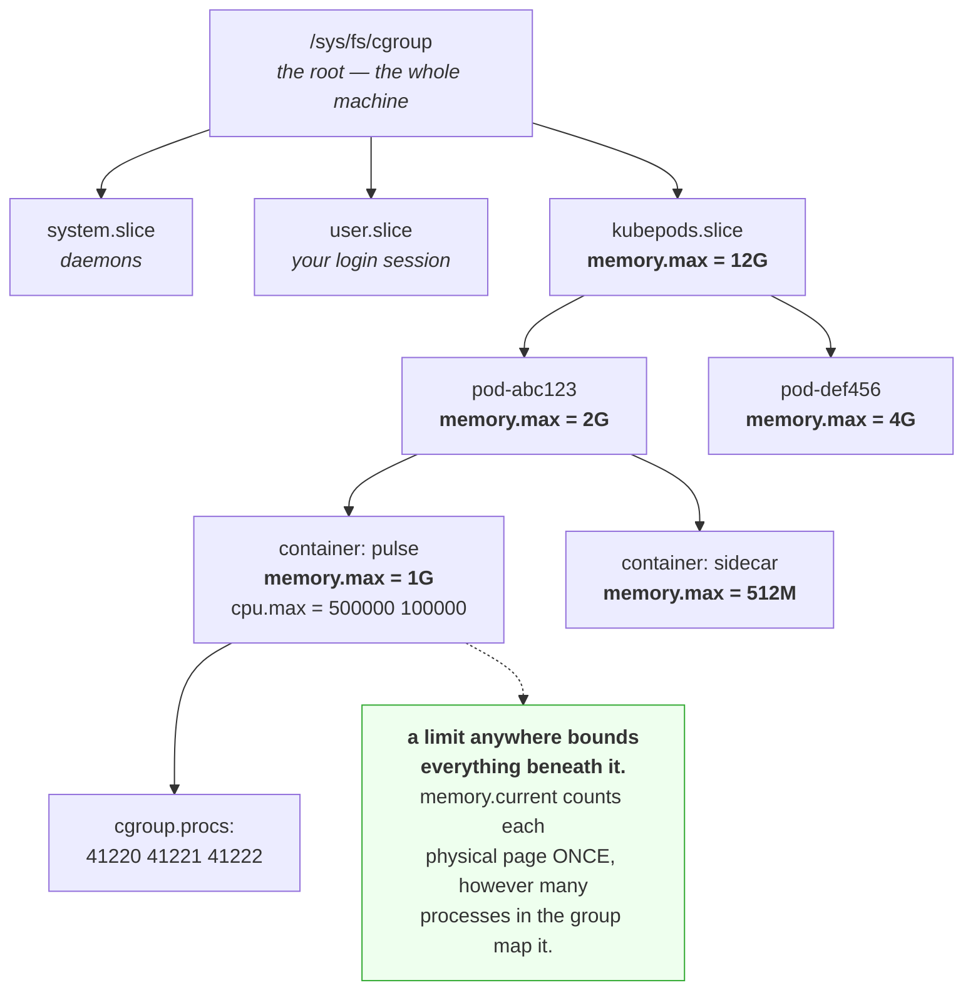

# 3.1 — cgroups — the box you put a process in

## One-line answer

A control group is a named box in a tree, holding a set of processes, with files that account for and
limit what everything inside it may consume, and it is the single mechanism behind every resource limit
you will set for the rest of this curriculum.

---

## The story

🎬 **The scene.** A workshop shared by four small businesses. One electricity meter, one water supply, one
loading bay.

For years they simply share. Then one business installs a kiln and the others start finding that the power
trips in the afternoons.

😬 **The naive fix.** A note on the wall: *"please be considerate with the power."*

💥 **Why it fails.** Everybody is being considerate, by their own reckoning. Nobody can see what anybody
else is drawing, so nobody can tell whether they are the problem, and the person who trips the supply is
usually not the person who was closest to the limit. It is whoever happened to switch on last.

**And when the power trips, all four businesses stop.** A shared resource with no accounting has no
fairness, no attribution and no containment, so one tenant's bad afternoon is everybody's outage.

💡 **The insight.** Sharing a finite resource requires three separate things, and goodwill supplies none
of them: **you must be able to measure per tenant, cap per tenant, and contain the consequences to the
tenant who caused them.** A polite note is a policy with no mechanism, and a policy with no mechanism is a
wish.

---

## The idea in plain language

A **control group**, or cgroup, is a set of processes that the kernel accounts for and constrains
together.

It is exposed as a directory. Creating a directory under `/sys/fs/cgroup/` creates a cgroup, the kernel
populates it with files, writing a process identifier into one of those files moves that process into the
group, and reading the other files tells you what the group is consuming.

**Version 2 is the one that matters.** Linux had two designs, and cgroup v2 replaced v1's separate
hierarchies per resource with a single unified tree, and it is what every modern distribution and
container runtime uses. Everything in this part is v2.

### The tree, and why it is a tree

cgroups nest. A parent's limit applies to everything beneath it, so the shape looks like this.

```
/sys/fs/cgroup/                     ← the root: the whole machine
├── system.slice/                   ← system daemons
├── user.slice/                     ← logged-in users
└── kubepods.slice/                 ← the kubelet's workloads
    ├── burstable/
    │   └── pod-abc123/             ← one Pod
    │       ├── container-pulse/    ← one container's processes
    │       └── container-sidecar/
```

**A limit on `pod-abc123` bounds both containers together**, and a limit on either container bounds only
its own processes. That nesting is exactly how a Pod's resources work, on Day 42, and how a machine can
guarantee that system daemons keep running even when workloads are starving.

### What the files are

Each cgroup directory contains files named `<controller>.<property>`.

| File | Reports or sets |
| --- | --- |
| `cgroup.procs` | the process identifiers in this group, and **you write a pid here to move it in** |
| `memory.current` | *"The total amount of memory currently being used by the cgroup and its descendants."* |
| `memory.max` | the hard memory limit, from [3.2](3.2-memory-max-versus-memory-high.md) |
| `memory.high` | the throttling threshold, from [3.2](3.2-memory-max-versus-memory-high.md) |
| `memory.stat` | *"breaks down the cgroup's memory footprint into different types of memory"* |
| `memory.events` | counters for `low`, `high`, `max`, `oom` and `oom_kill` |
| `cpu.max` | the quota and period, from [3.3](3.3-cpu-max-and-the-two-numbers-in-it.md) |
| `cpu.stat` | usage, plus `nr_throttled` and `throttled_usec`, from [2.3](../02-cpu/2.3-throttling-the-slowdown-with-no-symptom.md) |
| `pids.max` | a cap on the number of processes, which is the bound against fork bombs |
| `io.stat` | per-device read and write accounting |

All quotations verified against `docs.kernel.org/admin-guide/cgroup-v2.html` on **2026-08-24**.

**Reading is as important as limiting.** `memory.current` is the number a memory limit is enforced
against, and it is *not* the sum of the processes' RSS, from
[1.2](../01-memory/1.2-rss-vss-and-shared-pages.md), because the cgroup counts each physical page once,
however many of its processes map it. **So the cgroup's own figure is the only one that matters**, and
measuring with `ps` inside a container gives a different, larger, irrelevant number.

### Why this is the foundation of containers

A container is not a kernel object. It is a process with three things arranged around it: **namespaces**,
so that it sees its own filesystem, network and process tree; **a cgroup**, so that its resource use is
accounted and limited; and usually a **root filesystem** from an image.

**Every resource guarantee any orchestrator makes is a cgroup file.** `resources.limits.memory` in a
Kubernetes manifest becomes `memory.max`. `--cpus 0.5` in Docker becomes `cpu.max`. There is no other
mechanism, and knowing that turns a large amount of orchestrator behaviour from magic into arithmetic.

---

## Why Kriya needs it

Day 25 runs `pulse` in a container with `compose`, and Day 26 sets restart policies. Both are wrappers
over cgroups.

Day 42 sets requests and limits in Kubernetes, which is the day this part exists for. Every field on that
day maps to a file described here.

Day 30's failure lab produces `exit 137`, which is the out-of-memory killer acting **inside a cgroup**
rather than on the machine, from
[4.2](../04-the-oom-killer/4.2-exit-137-and-the-message-that-is-not-in-your-log.md).

Day 62 collects metrics, and the container metrics everybody uses, such as
`container_memory_working_set_bytes` and `container_cpu_cfs_throttled_periods_total`, are these files,
scraped.

Day 211 enforces resource limits with an admission policy. You cannot sensibly write a policy about
limits without knowing what a limit is.

---

## The mechanism

🅿️ **This part needs Linux with cgroup v2**, which this Windows machine does not have. **Read it now and
run it in WSL2 from Day 21**, and note that this is the fourth consecutive day with a diagnostic gap here,
which is a pattern that belongs in `docs/INCIDENTS.md` rather than in your memory.

Find out what cgroup you are in.

```bash
cat /proc/self/cgroup 2>/dev/null || echo "no cgroups here — Windows; see the note above"
```

**Line by line:** `/proc/self/cgroup` names the cgroup of the process reading it, and
[1.2](../01-memory/1.2-rss-vss-and-shared-pages.md) used `/proc/self` the same way. Under v2 the format is
`0::<path>`, where the path is relative to `/sys/fs/cgroup`.

On a Linux machine:

```text
0::/user.slice/user-1000.slice/session-3.scope
```

**You are inside three nested cgroups**, and the innermost one is your login session. Look at what it
reports.

```bash
CG=/sys/fs/cgroup$(awk -F: '{print $3}' /proc/self/cgroup)
ls "$CG" | head -20
```

**Line by line:**

- `awk -F: '{print $3}'` splits on colons and takes the third field, which is the path. **Building the
  full path from `/proc/self/cgroup` rather than hard-coding it** is what makes this work inside a
  container, where the path differs.
- `ls | head -20` shows the files the kernel created. **The set differs by which controllers are
  enabled**, which is itself informative, because a controller that is not enabled has no files.

```text
cgroup.controllers
cgroup.events
cgroup.procs
cgroup.stat
cpu.stat
io.stat
memory.current
memory.events
memory.high
memory.max
memory.stat
pids.current
pids.max
```

Now read the current values.

```bash
for f in memory.current memory.max memory.high pids.current pids.max cpu.max; do
  printf '%-16s %s\n' "$f" "$(cat "$CG/$f" 2>/dev/null || echo '(not present)')"
done
```

**Line by line:**

- A loop over the files that matter, with `printf` aligning them into a readable table rather than a wall
  of `cat` output.
- `2>/dev/null || echo '(not present)'` matters because **a missing file is meaningful rather than an
  error**, since it means that controller is not enabled for this cgroup. Saying so explicitly beats an
  error message that looks like a failure, as
  [Day 4, part 3.1](../../../day-004-linux-for-operators-i/parts/03-exit-codes/3.1-the-exit-code-is-the-whole-return-value.md)
  argued.

```text
memory.current   482344960
memory.max       max
memory.high      max
pids.current     94
pids.max         max
cpu.max          (not present)
```

**`max` means no limit.** Your login session is accounted and unconstrained, which is the normal state
outside a container. `memory.current` is 482 MB, which is everything you are running in this session,
counted once each.

### Making a cgroup by hand

**Principle 4 says to build the mechanism before adopting the tool.** A container runtime does this for
you, and doing it once by hand means the runtime is a convenience rather than a mystery.

```bash
# 🅿️ PARKED until Day 21 (WSL2). Needs Linux, cgroup v2, and root.
# sudo mkdir /sys/fs/cgroup/kriya-demo
# ls /sys/fs/cgroup/kriya-demo | head
```

**Line by line:** `mkdir` **is** the creation operation, because there is no `cgcreate` needed, since the
filesystem interface is the API. The kernel populates the new directory with the controller files
automatically, which is what the `ls` confirms.

```text
cgroup.controllers
cgroup.procs
cgroup.threads
cpu.max
cpu.stat
memory.current
memory.events
memory.high
memory.max
memory.stat
```

Now put a process in it and watch the accounting.

```bash
# 🅿️ PARKED until Day 21.
# uv run python days/day-006-resources-and-the-oom-killer/lab/allocate.py 256 &
# PID=$!
# echo "$PID" | sudo tee /sys/fs/cgroup/kriya-demo/cgroup.procs
# sleep 3
# cat /sys/fs/cgroup/kriya-demo/memory.current
# cat /sys/fs/cgroup/kriya-demo/cgroup.procs
```

**Line by line:**

- `allocate.py 256` is the script from
  [1.1](../01-memory/1.1-virtual-memory-and-why-the-number-is-a-lie.md), holding 256 MiB.
- `echo "$PID" | sudo tee .../cgroup.procs` matters because **writing a pid into `cgroup.procs` moves that
  process into the group.** It uses `tee` rather than `>` because the redirect would be performed by your
  unprivileged shell before `sudo` ran, whereas `sudo tee` puts the privileged part where it is needed.
  **This trips people up constantly** and produces a confusing `Permission denied` that looks like the
  cgroup rejecting you.
- `memory.current` afterwards gives the accounting, which now includes that process.
- `cgroup.procs` read back confirms that the move happened, rather than assuming it.

```text
43188
268845056
43188
```

**256 MiB, accounted to the box you created.** The process did not change, and only the group the kernel
counts it in did.

Then clean up.

```bash
# 🅿️ PARKED until Day 21.
# kill "$PID"
# sudo rmdir /sys/fs/cgroup/kriya-demo
```

**Line by line:** kill the process first, because **a cgroup with processes in it cannot be removed**, and
`rmdir` fails with `Device or resource busy`, which is the same "you are standing in it" shape as trying
to unmount a filesystem you are inside, from
[Day 5, part 3.3](../../../day-005-linux-for-operators-ii/parts/03-the-disk-that-fills/3.3-running-out-of-inodes-with-disk-to-spare.md).
Use `rmdir` rather than `rm -rf`, because cgroup directories are removed by removing the directory itself,
and `rm -rf` will fail on the kernel-created files inside.



---

## When it breaks

**`Permission denied` writing to `cgroup.procs` with `sudo`.** This is the redirect trap.

```text
$ sudo echo 43188 > /sys/fs/cgroup/kriya-demo/cgroup.procs
bash: /sys/fs/cgroup/kriya-demo/cgroup.procs: Permission denied
```

**What it says:** permission denied on a command you ran with `sudo`.

**What it actually means:** **the shell performs the redirect rather than `sudo`.** Your unprivileged
shell opens the file for writing before `sudo` is ever invoked, and it is your user that is refused.
`sudo` then runs `echo` with elevated privileges, pointlessly.

**The smallest fix:** `echo 43188 | sudo tee <file>`, which puts the privileged operation on the writing
side.

**Why it is worth knowing beyond cgroups:** this is the single most common `sudo` misunderstanding and it
appears any time you write to a privileged path.

**`Device or resource busy` removing a cgroup.** This is the nesting rule.

```text
$ sudo rmdir /sys/fs/cgroup/kriya-demo
rmdir: failed to remove '/sys/fs/cgroup/kriya-demo': Device or resource busy
$ cat /sys/fs/cgroup/kriya-demo/cgroup.procs
43188
```

**What it says:** the directory is busy.

**What it actually means:** there is still a process in it. **A cgroup cannot be removed while it holds
processes or child cgroups.**

**The smallest fix:** kill or move the processes, then remove any child directories, and then `rmdir`.
**The diagnosis is always `cat cgroup.procs`**, which lists exactly what is holding it.

**A container limit that does not appear to apply.** This is the nesting rule from the other side.

```text
$ docker run --rm --memory 256m python:3.12-slim cat /sys/fs/cgroup/memory.max
268435456
$ docker run --rm --memory 256m python:3.12-slim free -m | head -2
               total        used        free
Mem:            7876         412        3204
```

**What it says:** `memory.max` is 256 MiB and `free` reports 7.7 GiB.

**What it actually means:** **`free` reads `/proc/meminfo`, which is not namespaced**, so it reports the
host's memory, exactly as load average does in
[2.2](../02-cpu/2.2-load-average-and-what-it-is-not.md). The limit is real and `free` cannot see it.

**The consequence that bites:** any runtime that sizes a heap, a cache or a thread pool from "total system
memory" will size it for 7.7 GiB inside a 256 MiB box, and be OOM-killed on the first busy moment.

**The smallest fix:** read `memory.max` rather than `/proc/meminfo`, and configure runtimes explicitly.
**Modern JVMs do this correctly, and many libraries still do not.**

**`memory.current` much lower than the sum of RSS inside the container.** This is the accounting
difference.

```text
$ docker exec api sh -c 'ps -eo rss,args --no-headers | awk "{s+=\$1} END {print s/1024 \" MiB (summed RSS)\"}"'
1042 MiB (summed RSS)
$ docker exec api cat /sys/fs/cgroup/memory.current
684032000
```

**What it says:** processes sum to 1,042 MiB and the cgroup reports 652 MiB.

**What it actually means:** the processes share pages, and summed RSS double-counts them, from
[1.2](../01-memory/1.2-rss-vss-and-shared-pages.md), while the cgroup counts each page once. **Neither
number is wrong, and only one of them is the one the limit is enforced against.**

**The practical rule:** **set limits from `memory.current`, never from summed RSS.** A limit derived from
the larger number wastes capacity on every replica, forever.

**Everything under `/sys/fs/cgroup` looks different from these examples.** This is the version trap.

```text
$ ls /sys/fs/cgroup
blkio  cpu  cpuacct  cpuset  devices  freezer  memory  net_cls  perf_event  pids
```

**What it says:** a directory per controller rather than a unified tree.

**What it actually means:** **this is cgroup v1**, the older design, where each controller has its own
separate hierarchy. The file names differ too, with `memory.limit_in_bytes` rather than `memory.max`.

**The smallest fix for identification:** `stat -fc %T /sys/fs/cgroup` reports `cgroup2fs` for v2 and
`tmpfs` for v1. **This is worth checking before you follow any instructions from the internet**, because
half the material you will find describes v1 and the file names simply do not exist under v2.

---

## In production

**What a professional writes instead of the teaching version.** They never write to cgroup files by hand
on a production machine, because the orchestrator owns them, and hand-editing produces a state that
reconciles away or, worse, does not. What they *do* is read them constantly: `memory.current` against
`memory.max`, `cpu.stat`'s throttling counters, and `memory.events` for the kernel's own record of
pressure. **The files are the ground truth**, and every metric your monitoring shows for a container is a
scrape of one of them.

**What degrades at scale.** Attribution becomes the whole point. On one machine you can reason about
totals. On a node running thirty containers, "the node is out of memory" is useless and "this cgroup
exceeded its limit" is actionable, and the difference is entirely that cgroups make per-tenant accounting
possible. **This is why multi-tenancy is a cgroup story before it is a scheduling story**, and why the
first question about any noisy-neighbour complaint is whether limits were set at all.

**The failure that only shows with real traffic.** Hierarchy pressure. A container comfortably inside its
own `memory.max` can still be reclaimed or killed because its **parent** cgroup, whether the Pod or the
whole `kubepods.slice`, is at its limit. The container's own metrics look fine throughout. **The symptom
is a workload killed with no apparent reason at its own level**, and it is only visible by walking up the
tree, which almost no dashboard does.

**The review comment a senior engineer leaves.** *"This sets `memory.limit` from the sum of RSS we
measured inside the container, which double-counts the shared pages between the workers. The cgroup counts
each page once, so the real requirement is about 40% lower, and we are reserving that difference on every
replica across the fleet."*

**The signal you would alert on.** **`memory.current` as a fraction of `memory.max`**, and **`cpu.stat`'s
`nr_throttled` over `nr_periods`**, which are the two ratios that say "this box is being hit". Both are
namespaced to the workload, both come straight from these files, and both are the numbers the enforcement
actually uses. Add **`pids.current` against `pids.max`** where a limit is set, because process exhaustion
produces `fork: Resource temporarily unavailable` and is otherwise invisible, from
[Day 4, part 4.3](../../../day-004-linux-for-operators-i/parts/04-the-service-died/4.3-zombies-orphans-and-pid-1.md).
You would **not** alert on the *existence* of a cgroup or on raw `memory.current` without its limit,
because an absolute byte count means nothing without the ceiling it is measured against.

**Blast radius.** This part introduces the ability to create cgroups and move processes into them, which
is a genuine and sharp capability. The worst case is **writing a limit to a cgroup containing something
important**, such as a system daemon, the container runtime itself, or your SSH session, and either
killing it or throttling it into unresponsiveness. Moving a process into a constrained group is
instantaneous and irreversible from that process's point of view. Root can trigger it, which is what these
commands require. What bounds it is that **everything here is 🅿️ parked until Day 21**, and when you do
run it, you should create a new cgroup rather than writing into an existing one, put only a process you
started yourself into it, and `rmdir` it afterwards. ⚠️ **Never write to `/sys/fs/cgroup/system.slice/` or
anything the orchestrator owns**, because you will fight a reconciliation loop and lose confusingly.

**Cost.** `0` model calls, `0` tokens, `0` CI minutes and `0` disk. **On RAM it is 256 MiB briefly in the
parked demonstration.** Reading cgroup files is free, because they are generated on read like the rest of
`/sys` and `/proc`, from
[Day 5, part 1.2](../../../day-005-linux-for-operators-ii/parts/01-the-filesystem/1.2-paths-mounts-and-the-tree-that-is-not-one-disk.md),
which is why scraping them every fifteen seconds across a whole node is cheap and universal.

**The interview question.** *"What actually happens when I set a memory limit on a container?"* The answer
that lands names the mechanism rather than the abstraction: *"The runtime writes a number into
`memory.max` in that container's cgroup, which is a directory under `/sys/fs/cgroup` holding that
container's processes. The kernel accounts every page charged to the group, counting each physical page
once even if several processes in the group map it, which is why it is lower than summing RSS. When usage
reaches the limit the kernel first tries to reclaim, and if it cannot it invokes the OOM killer *inside
that cgroup*, so it kills a process in your container rather than something else on the node. There is
nothing else to it, because every resource guarantee an orchestrator makes is one of these files, and the
same tree is how a Pod's limit bounds all its containers together."*

---

## Check yourself

```bash
cat /proc/self/cgroup 2>/dev/null && CG=/sys/fs/cgroup$(awk -F: '{print $3}' /proc/self/cgroup) && for f in memory.current memory.max cpu.max pids.current pids.max; do printf '%-16s %s\n' "$f" "$(cat "$CG/$f" 2>/dev/null || echo '(not present)')"; done || echo "no cgroups — Windows; run in WSL2 from Day 21"
```

Your own cgroup and its five most useful files. **`max` in the limit fields means unconstrained**, which
is what you should see outside a container, and the point of running it now is that on Day 25 you run the
identical command *inside* a container and every one of those fields has a number in it.

**Say out loud, without scrolling up:** *a container's `memory.max` is 256 MiB and `free` inside it
reports 8 GiB. Explain why both are true, and name one concrete way a program can be harmed by believing
`free`.*
