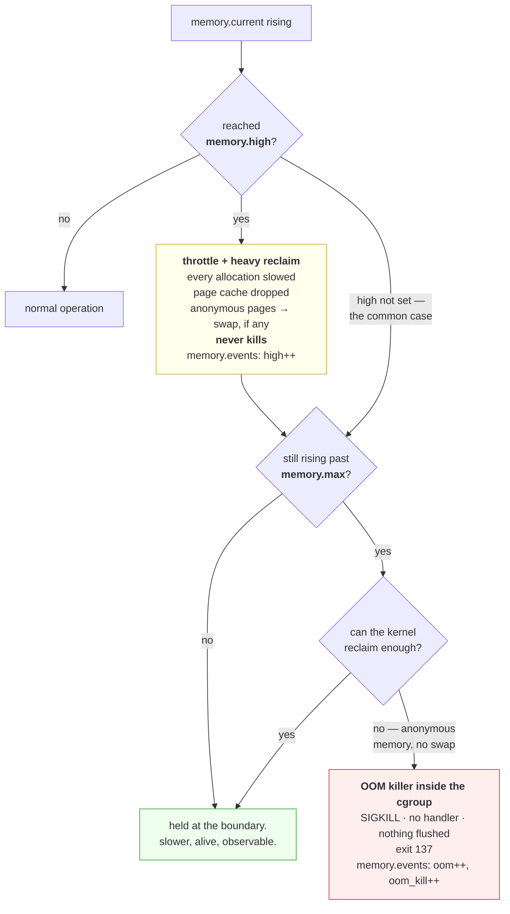

# 3.2 — `memory.max` versus `memory.high` — the cliff and the brake

## One-line answer

`memory.max` is a hard wall that invokes the out-of-memory killer when you reach it, and `memory.high` is
a throttle that slows a workload down under reclaim pressure and never kills anything, and almost every
container in the world sets only the first one, which is why `exit 137` is so much more common than it
needs to be.

---

## The story

🎬 **The scene.** A mountain road with a drop on one side.

Version one has no barrier at all. Drive too fast into the bend and you go over. There is no warning and
no second chance, because the road is fine right up until it is not.

Version two has a run-off lane, which is a long stretch of deep gravel before the edge. A car that comes
in too fast hits the gravel, slows hard, and stops. The driver has a bad afternoon and gets out and walks
away.

😬 **The naive fix.** The roads department, costing the two options, notes that the drop already stops
cars perfectly reliably. The barrier is expensive and the drop is free.

💥 **Why it fails.** Both mechanisms stop the car. Only one of them lets you find out that you were going
too fast **and still be there afterwards to do something about it**. The drop provides no signal, no
gradation and no recovery, because the first time you learn the speed was wrong is also the last.

💡 **The insight.** A hard limit and a soft limit are not two strengths of the same thing. **The soft one
converts a catastrophic failure into a degraded performance you can observe and act on**, trading
throughput for survivability, and that trade is almost always the one you want, because a slow service
tells you something and a dead one tells you nothing.

---

## The idea in plain language

cgroup v2 gives a memory cgroup four thresholds. Two of them are limits and two are protections. All
verified against `docs.kernel.org/admin-guide/cgroup-v2.html` on **2026-08-24**.

| File | Verbatim | In one sentence |
| --- | --- | --- |
| `memory.max` | *"Memory usage hard limit... If a cgroup's memory usage reaches this limit and can't be reduced, the OOM killer is invoked in the cgroup."* | **the cliff** |
| `memory.high` | *"Memory usage throttle limit. If a cgroup's usage goes over the high boundary, the processes of the cgroup are throttled and put under heavy reclaim pressure. Going over the high limit never invokes the OOM killer."* | **the brake** |
| `memory.min` | *"Hard memory protection. If the memory usage of a cgroup is within its effective min boundary, the cgroup's memory won't be reclaimed under any conditions."* | a floor nobody may take |
| `memory.low` | *"Best-effort memory protection... won't be reclaimed unless there is no reclaimable memory available."* | a floor taken only in desperation |

**Read the `memory.high` quotation twice.** *"Going over the high limit never invokes the OOM killer."*
That is an unconditional guarantee, and it is why the two files exist rather than one.

### What each one actually does when you reach it

**Reaching `memory.high`:** the kernel puts the cgroup under heavy reclaim pressure. Every allocation the
processes make is slowed while the kernel tries to free pages, by dropping page cache, from
[1.3](../01-memory/1.3-the-page-cache-that-looks-like-a-leak.md), writing dirty pages out, and swapping
anonymous pages if swap exists. **The workload gets slower and stays alive.** Usage can exceed `high`,
because it is a pressure threshold rather than a ceiling.

**Reaching `memory.max`:** the kernel tries to reclaim. If it cannot free enough, which for anonymous
memory with no swap means immediately, it invokes the out-of-memory killer **inside that cgroup**,
choosing a victim from the group's own processes, from
[4.1](../04-the-oom-killer/4.1-what-the-oom-killer-actually-does.md). The process is `SIGKILL`ed, so
nothing is flushed, no handler runs, and the exit code is 137, from
[Day 4, part 3.2](../../../day-004-linux-for-operators-i/parts/03-exit-codes/3.2-128-plus-n-when-a-signal-becomes-an-exit-code.md).

### Why almost nobody sets `memory.high`

Because orchestrators do not expose it. Kubernetes has `resources.limits.memory`, which becomes
`memory.max`, and there is no field for `memory.high` in a standard Pod spec. Docker's `--memory` is the
same. **So the default operational posture across most of the industry is a hard wall with no brake.**

That is a genuinely defensible choice for a container platform, because a hard limit is predictable and
enforceable, and a throttled workload that never dies can be worse than one that restarts, since it
degrades everything downstream while appearing healthy. But it means **the common failure mode is a kill
rather than a slowdown**, and that shapes what you monitor: you are watching for a cliff, so you need
warning *before* the edge rather than a gradient at it.

### `memory.events`, which is the kernel's own record

Also from the same page, `memory.events` is a read-only file counting `low`, meaning reclaim despite being
under protection, `high`, meaning throttling events, `max`, meaning usage hitting the limit, `oom`,
meaning an allocation about to fail, and `oom_kill`, meaning processes actually killed.

**`oom_kill` is the single most valuable number in this part.** It is the kernel's own count of times it
killed something in this cgroup, it is monotonic, and it is unambiguous, unlike an exit code, which
requires you to have been watching when the process died, from
[4.2](../04-the-oom-killer/4.2-exit-137-and-the-message-that-is-not-in-your-log.md).

### The number the limit is enforced against

`memory.current` includes page cache generated by this cgroup, from
[1.3](../01-memory/1.3-the-page-cache-that-looks-like-a-leak.md). So a container that reads large files
will approach its limit on cache alone, and the kernel will drop that cache rather than kill anything,
because clean cache is reclaimable.

**This is why raw `memory.current` is a bad alert and "working set" is the right one.** Working set is
usage minus the reclaimable cache, meaning the memory that genuinely cannot be given up, which is what
actually decides whether the next allocation kills you. `memory.stat` gives you the breakdown, as `anon`
against `file`, to compute it.

---

## Why Kriya needs it

Day 42 sets `resources.limits.memory` for `pulse`. That single field is `memory.max`, and this part is
what it does.

Day 30's failure lab produces `exit 137` deliberately, which is this limit being reached.

Day 40 reads `kubectl describe pod` and finds `Reason: OOMKilled`. That reason is derived from the
`oom_kill` counter described here, which is why it is a separate fact from the exit code.

Day 76 builds the first capacity alert, and the choice between alerting on `memory.current` and on working
set is decided by the page-cache argument above.

Day 109 loads a model into `pulse`, and Day 118 monitors it. A model server is the archetypal workload
where memory is large, mostly anonymous, and unreclaimable, which is precisely the shape that hits
`memory.max` rather than degrading gracefully.

---

## The mechanism

🅿️ **This part needs Linux with cgroup v2 and root**, which this Windows machine does not have. **Read it
now and run it in WSL2 from Day 21.** The arithmetic and the file semantics are the part that matters, and
you can reason about those here.

Set up a cgroup with a hard limit and drive a process into it.

```bash
# 🅿️ PARKED until Day 21 (WSL2).
# sudo mkdir -p /sys/fs/cgroup/kriya-mem
# echo "256M" | sudo tee /sys/fs/cgroup/kriya-mem/memory.max
# echo "max"  | sudo tee /sys/fs/cgroup/kriya-mem/memory.high
# cat /sys/fs/cgroup/kriya-mem/memory.max /sys/fs/cgroup/kriya-mem/memory.high
```

**Line by line:**

- `mkdir -p` creates the cgroup, from [3.1](3.1-cgroups-the-box-you-put-a-process-in.md), and the kernel
  populates the files.
- `echo "256M" | sudo tee` uses **`tee` rather than `>`**, for the redirect-runs-as-you reason from
  [3.1](3.1-cgroups-the-box-you-put-a-process-in.md). The value accepts suffixes, so `256M` is fine and
  clearer than `268435456`.
- `memory.high` is explicitly set to `max`, meaning **no brake.** Stating it rather than leaving the
  default makes the experiment's shape explicit, because this is the cliff-only configuration, which is
  what every container platform gives you by default.
- Both are read back rather than trusting the writes.

```text
268435456
max
```

Now run a process that will exceed it.

```bash
# 🅿️ PARKED until Day 21.
# uv run python days/day-006-resources-and-the-oom-killer/lab/allocate.py 400 &
# PID=$!
# echo "$PID" | sudo tee /sys/fs/cgroup/kriya-mem/cgroup.procs
# wait "$PID"; echo "exit code: $?"
# cat /sys/fs/cgroup/kriya-mem/memory.events
```

**Line by line:**

- `allocate.py 400` asks for 400 MiB against a 256 MiB limit, using the script from
  [1.1](../01-memory/1.1-virtual-memory-and-why-the-number-is-a-lie.md). **The script touches every
  page**, so the memory is genuinely resident and cannot be reclaimed.
- Move it into the constrained group, and then `wait` and print the exit code immediately, from
  [Day 4, part 3.1](../../../day-004-linux-for-operators-i/parts/03-exit-codes/3.1-the-exit-code-is-the-whole-return-value.md).
- `memory.events` afterwards gives **the counters, which are the evidence.** The exit code tells you it
  was killed, and this tells you the kernel did it and why.

```text
43502
exit code: 137
low 0
high 0
max 41
oom 1
oom_kill 1
```

**Read those five counters as a sentence.** `high 0` means the brake was never engaged, because there was
no brake. `max 41` means usage hit the hard limit 41 times, and each time the kernel reclaimed what it
could. `oom 1` means that once, it could not reclaim enough. `oom_kill 1` means it therefore killed
something.

**`137` is `128 + 9`**, from
[Day 4, part 3.2](../../../day-004-linux-for-operators-i/parts/03-exit-codes/3.2-128-plus-n-when-a-signal-becomes-an-exit-code.md),
and the process wrote nothing on the way out.

### The same workload with a brake

```bash
# 🅿️ PARKED until Day 21.
# echo "192M" | sudo tee /sys/fs/cgroup/kriya-mem/memory.high
# uv run python days/day-006-resources-and-the-oom-killer/lab/allocate.py 400 &
# PID=$!
# echo "$PID" | sudo tee /sys/fs/cgroup/kriya-mem/cgroup.procs
# sleep 10
# cat /sys/fs/cgroup/kriya-mem/memory.current /sys/fs/cgroup/kriya-mem/memory.events
# kill "$PID"
```

**Line by line:**

- `memory.high` is set to 192 MiB, which is **below `memory.max`**, so the brake engages before the cliff.
  The gap between the two is your warning zone.
- The workload and the limit are identical to before. **One file changed.**
- It uses `sleep 10` rather than `wait`, because with a brake the process may not die, so waiting for it
  would hang. **This difference in how you have to write the command is itself the lesson.**

```text
201326592
low 0
high 3812
max 0
oom 0
oom_kill 0
```

**`high 3812` and `oom_kill 0`.** The workload was throttled thousands of times, kept running, and was
never killed. `memory.current` settled at 192 MiB, because the kernel held it at the high boundary by
reclaiming under pressure, and `max 0` means it never even reached the hard limit.

**The same program, the same hard limit, and the opposite outcome.** The process is slower, noticeably so,
because every allocation now waits for reclaim, and it is alive, and `memory.events` records exactly what
happened.

Then clean up.

```bash
# 🅿️ PARKED until Day 21.
# kill "$PID" 2>/dev/null; sleep 1
# cat /sys/fs/cgroup/kriya-mem/cgroup.procs
# sudo rmdir /sys/fs/cgroup/kriya-mem
```

**Line by line:** kill, confirm that `cgroup.procs` is empty, and then remove, because **a cgroup with
processes in it cannot be removed**, from [3.1](3.1-cgroups-the-box-you-put-a-process-in.md), and checking
rather than assuming saves you a confusing `Device or resource busy`.

### Reading working set, which is what you should alert on

```bash
# 🅿️ PARKED until Day 21 — but the arithmetic applies everywhere.
# awk '/^(anon|file|slab) / {print}' /sys/fs/cgroup/kriya-mem/memory.stat
```

**Line by line:** `memory.stat` breaks the total into types, from
[3.1](3.1-cgroups-the-box-you-put-a-process-in.md). `anon` is anonymous memory, which is unreclaimable
without swap. `file` is page cache, which is reclaimable. `slab` is kernel structures. **Working set is
roughly the total minus the reclaimable part**, and `anon` is the number that decides whether the next
allocation kills you.

```text
anon 198311936
file 2703360
slab 4358144
```

**Anonymous memory is 198 MB of the 201 MB total.** Almost none of this is reclaimable, which is why this
workload sits at its high boundary rather than being reclaimed comfortably below it, and why a workload
whose memory is mostly page cache behaves completely differently at the same `memory.current`.



---

## When it breaks

**`exit 137` with no application error anywhere.** This is the everyday form.

```text
$ kubectl get pod pulse-6d4f8b9c7-mn2xk
NAME                    READY   STATUS      RESTARTS   AGE
pulse-6d4f8b9c7-mn2xk   0/1     OOMKilled   3          8m
$ kubectl logs pulse-6d4f8b9c7-mn2xk --previous | tail -3
INFO:     127.0.0.1:41290 - "POST /predict HTTP/1.1" 200 OK
INFO:     127.0.0.1:41291 - "POST /predict HTTP/1.1" 200 OK
```

**What it says:** the container was OOM-killed and its last log line is a successful request.

**What it actually means:** `memory.current` reached `memory.max`, the kernel could not reclaim enough,
and it `SIGKILL`ed the process, so **no shutdown ran, nothing was flushed, and the log simply stops
mid-stream**, from
[Day 4, part 2.4](../../../day-004-linux-for-operators-i/parts/02-signals/2.4-the-signals-you-cannot-catch.md).
The absence of an error is evidence rather than a gap.

**The smallest fix in the moment:** raise the limit.

**The right fix:** find out whether it is a leak or a legitimate working set, by looking at whether
`memory.current` plateaus or rises monotonically, from
[1.3](../01-memory/1.3-the-page-cache-that-looks-like-a-leak.md).

**A container pinned at its memory limit for weeks with no restarts.** This is the page-cache case, from
[1.3](../01-memory/1.3-the-page-cache-that-looks-like-a-leak.md), now with the counters to prove it.

```text
$ kubectl exec ingest-7f9c -- cat /sys/fs/cgroup/memory.events
low 0
high 0
max 2841002
oom 0
oom_kill 0
```

**What it says:** the limit was reached nearly three million times and nothing was ever killed.

**What it actually means:** every one of those was satisfied by reclaiming page cache. **`max` counting
high with `oom_kill` at zero is the signature of a cache-bound workload sitting against its limit**, and
it is healthy.

**The smallest fix:** none is needed, but **alert on `oom_kill` rather than on `max`**, or you will page
on this forever.

**Raising the limit and being killed again at the new limit.** This is the leak, diagnosed.

```text
# limit 512Mi -> OOMKilled after ~40 minutes
# limit 1Gi   -> OOMKilled after ~80 minutes
# limit 2Gi   -> OOMKilled after ~160 minutes
```

**What it says:** doubling the limit doubles the time to failure.

**What it actually means:** **a leak.** A legitimate working set plateaus, and a leak grows linearly with
time or with requests served, so the limit only buys proportional delay. The doubling relationship is the
diagnosis, and it is much faster to see than any profiler.

**The smallest fix:** stop raising the limit. **The evidence to gather** is `anon` in `memory.stat` over
time, because if it rises monotonically and never falls during quiet periods, it is a leak.

**A workload throttled to a standstill by `memory.high`.** This is the failure mode of the brake.

```text
$ cat /sys/fs/cgroup/workload/memory.events
low 0
high 88412990
max 0
oom 0
oom_kill 0
```

That is with the service alive and its latency a hundred times normal.

**What it says:** 88 million throttling events, and no kills.

**What it actually means:** the brake is working exactly as designed and the workload genuinely needs more
memory than `memory.high` allows. **It is alive and useless**, which is sometimes worse than dead, because
a dead container gets restarted and rescheduled, and a throttled one sits there passing health checks
while every request times out.

**The smallest fix:** raise `memory.high`, or accept that this workload needs a cliff so that something
restarts it.

**The honest lesson:** **the brake is not universally better.** It converts a fast, loud failure into a
slow, quiet one, and Day 41's health checks are what decide whether that is an improvement.

---

## In production

**What a professional writes instead of the teaching version.** They set `limits.memory`, because that is
what the platform offers, and then compensate for the missing brake with monitoring: an alert on working
set approaching the limit, with enough margin to act before the kill. Where the platform allows it, and
some runtimes and newer Kubernetes versions expose `memory.high` through configuration, they set it a
comfortable margin below `max`, so that the workload degrades observably before it dies. **The principle
is that you want a signal between "fine" and "dead"**, and if the platform will not give you one you build
it out of metrics.

**What degrades at scale.** Restart storms. One container OOM-killed is a blip. A fleet where the limit is
marginally too low for a traffic peak sees many containers killed at once, all of which restart, all of
which have cold caches and empty connection pools, and all of which then use *more* memory during warm-up
than they did in steady state, **so the restart makes the condition that caused it more likely.** This is
the memory version of a thundering herd, and it is why a limit set at exactly the observed peak is a limit
that will fail.

**The failure that only shows with real traffic.** Concurrency-driven memory. A service that buffers a
request body uses one buffer per in-flight request, so its memory is a function of concurrency rather than
of time, from [1.1](../01-memory/1.1-virtual-memory-and-why-the-number-is-a-lie.md). Under load-test
traffic at fixed concurrency it plateaus comfortably, and under a real burst the concurrency spikes and
memory spikes with it, hitting the limit at exactly the moment the service is busiest. **The limit that
passed testing kills you on your best day**, which is the same shape as the CPU throttling case in
[2.3](../02-cpu/2.3-throttling-the-slowdown-with-no-symptom.md).

**The review comment a senior engineer leaves.** *"The memory limit is set to the p99 we observed in the
load test with no headroom. Memory is not like CPU, because going over does not slow us down, it kills the
container with no cleanup and drops every in-flight request. Add at least 30% headroom, and put an alert
on working set at 80% of the limit so we hear about it before the kill rather than after."*

**The signal you would alert on.** **`oom_kill` from `memory.events`, on any increase**, because it is the
kernel's own record, it is monotonic, it requires no inference from exit codes, and any non-zero delta
means a container died without cleanup. And **working set as a fraction of `memory.max`**, alerting
somewhere around 80 to 85%, which is the warning the platform does not give you. Explicitly **not**
`memory.current` as a fraction of the limit, because page cache pushes it to 100% on healthy workloads,
from [1.3](../01-memory/1.3-the-page-cache-that-looks-like-a-leak.md), so that alert fires constantly and
gets muted, and then the real one is muted with it. Where `memory.high` is set, **`high` events per
second** is the equivalent of the throttling counter for CPU, being unambiguous evidence that the brake is
engaged.

**Blast radius.** This part sets memory limits and deliberately drives a process into being killed. The
worst case on a shared machine is **writing a limit to a cgroup containing something you did not
intend**, such as a system service, a database or your own session, and having the kernel `SIGKILL` a
process inside it with no warning and no cleanup, losing whatever it held in memory. Moving a process into
a constrained cgroup takes effect immediately. Root can trigger it, which these commands require. What
bounds it is that **everything here is 🅿️ parked until Day 21**, and when you run it you should create a
fresh cgroup, put only a process you started into it, and `rmdir` afterwards. ⚠️ **Never set `memory.max`
on an existing system cgroup**, and never on `user.slice`, because you will kill your own session and the
machine will not tell you why.

**Cost.** `0` model calls, `0` tokens, `0` CI minutes and `0` disk. **On RAM it is up to 400 MiB briefly
in the parked demonstration, bounded by the limit you set**, which is a pleasant property of this
experiment, because the cgroup enforces its own budget, so a mistyped argument cannot consume the machine.
Reading the counters is free.

**The interview question.** *"What is the difference between a memory request and a memory limit, and what
happens when you exceed each?"* The answer that lands separates scheduling from enforcement: *"The request
is a scheduling promise, because it reserves that much on a node and nothing enforces it at runtime. The
limit becomes `memory.max` in the container's cgroup, and when usage reaches it the kernel tries to
reclaim, and if it cannot, and anonymous memory with no swap cannot be reclaimed at all, it invokes the
OOM killer inside that cgroup and `SIGKILL`s a process, so there is no cleanup, nothing flushed, and exit
code 137. There is a third thing most people never use, which is `memory.high`, and it throttles under
reclaim pressure and is guaranteed never to invoke the killer, so it turns a fatal failure into a slow
one. Kubernetes does not expose it, which is why the common failure is a kill rather than a degradation,
and why I would put an alert on working set at around 80% of the limit to get the warning the platform
does not give me."*

---

## Check yourself

```bash
CG=/sys/fs/cgroup$(awk -F: '{print $3}' /proc/self/cgroup 2>/dev/null) && cat "$CG"/memory.events "$CG"/memory.max "$CG"/memory.high 2>/dev/null && awk '/^(anon|file) /' "$CG"/memory.stat || echo "no cgroup v2 here — Windows; run in WSL2 from Day 21"
```

Your own session's five event counters, both limits, and the anonymous-against-file split. **On an
unconstrained session every counter is zero and both limits read `max`**, which is exactly the baseline
you want in your head before Day 25 puts `pulse` inside a box where they are not.

**Say out loud, without scrolling up:** *a container's memory metric has been pinned at 100% of its limit
for three weeks with no restarts. Say what is almost certainly happening, which counter proves it, and
which counter you should have been alerting on instead.*
