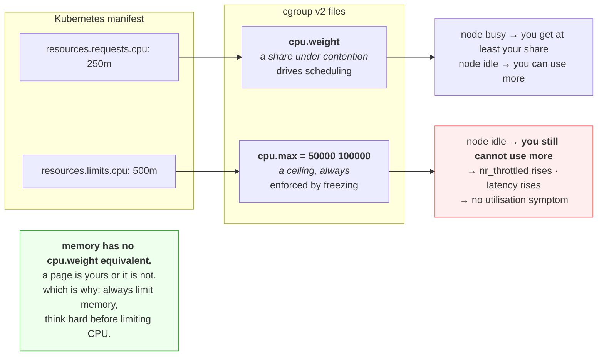

# 3.3 — `cpu.max`, and the two numbers in it

## One-line answer

A CPU limit is a quota and a period, not a percentage — and because the period is what decides how bursty
a workload can be before it is frozen, the second number matters as much as the first and almost nobody
knows it exists.

---

## The story

🎬 **The scene.** A pocket-money arrangement. A child gets six pounds a week.

She spends it on Saturday and has nothing until the following Saturday. Six days of nothing.

Her cousin has the same allowance expressed differently: a pound a day. He is never flush and he is never
broke, and on any given day he can buy what he wants.

😬 **The naive fix.** A parent, comparing the two, says they are obviously equivalent — six pounds a week
either way.

💥 **Why it fails.** They are equivalent in total and completely different in experience, and the
difference is entirely about **when** the money is available relative to when things are wanted. A book
that costs four pounds is buyable on Saturday under one scheme and never buyable under the other. **The
total was never the interesting number.**

And the arrangement that looks more generous — the whole six at once — is the one that produces six days
of being stuck.

💡 **The insight.** A quota has two halves: how much, and over what window. **Only the ratio is the
"amount"; the window decides whether the amount is usable when it is needed.** Two schemes with identical
ratios can produce completely different behaviour for anything that arrives in bursts — and real work
always arrives in bursts.

---

## The idea in plain language

Verified against `docs.kernel.org/admin-guide/cgroup-v2.html` on **2026-08-24**: `cpu.max` is *"The
maximum bandwidth limit. It's in the following format: $MAX $PERIOD which indicates that the group may
consume up to $MAX in each $PERIOD duration."*

Both numbers are in **microseconds**. The default period is 100,000 µs — 100 milliseconds.

| `cpu.max` | Reads as | Equivalent |
| --- | --- | --- |
| `max 100000` | no quota | unlimited |
| `100000 100000` | 100 ms per 100 ms | **1 core** · `1000m` · `--cpus 1` |
| `50000 100000` | 50 ms per 100 ms | **half a core** · `500m` · `--cpus 0.5` |
| `400000 100000` | 400 ms per 100 ms | **4 cores** · `4000m` · `--cpus 4` |
| `50000 50000` | 50 ms per 50 ms | **1 core, tighter window** |

**Note the last row.** Same ratio as `100000 100000` — one core — but the accounting window is half as
long, so the workload can burst for at most 50 ms rather than 100 ms before being frozen. **Same average
capacity, less tolerance for burstiness.**

### Why the period matters

Part [2.3](../02-cpu/2.3-throttling-the-slowdown-with-no-symptom.md) established the enforcement: exhaust
the quota and every task in the cgroup is descheduled until the next period.

So the period is the **maximum length of a burst** you can serve at full speed:

- With `100000 100000` — one core, 100 ms period — a single-threaded request needing 80 ms of processor
  fits inside one period and is never throttled.
- With `50000 50000` — one core, 50 ms period — the same request exhausts the quota at 50 ms, waits, and
  finishes at 130 ms wall-clock. **Sixty percent slower, at the identical average limit.**

A **longer** period tolerates burstiness better and makes the enforcement less precise moment to moment. A
**shorter** period is smoother and punishes bursts harder. Most orchestrators fix the period at 100 ms
and expose only the quota, so this dial exists and you usually cannot turn it.

### Requests versus limits — two different controls

Kubernetes has two CPU fields and they map to two different cgroup files, which is the single most
under-explained thing about resource management.

| Kubernetes field | cgroup file | What it does |
| --- | --- | --- |
| `requests.cpu` | `cpu.weight` | **a share.** Decides how contended time is divided, and drives scheduling — the node must have this much unreserved. |
| `limits.cpu` | `cpu.max` | **a ceiling.** Caps consumption even when the machine is idle. |

**A request is a floor under contention; a limit is a wall regardless of contention.** With a request and
no limit, a workload gets at least its share when the machine is busy and can use idle capacity when it is
not — which is usually what you want. With a limit, the idle capacity is unreachable
([2.3](../02-cpu/2.3-throttling-the-slowdown-with-no-symptom.md)).

**Memory has no equivalent of `cpu.weight`.** You cannot give memory in shares, because memory is not
time-sliced — a page is either yours or it is not. This asymmetry is why the advice differs so sharply
between the two: *always set memory limits, think hard before setting CPU limits.*

### Why memory limits are safe and CPU limits are dangerous

Because of what happens when you exceed them.

- **Exceeding a memory limit kills you.** So a limit is protection: without it, one workload's leak takes
  the whole node down, including every other tenant
  ([4.1](../04-the-oom-killer/4.1-what-the-oom-killer-actually-does.md)).
- **Exceeding a CPU limit slows you down.** So a limit is a cost: it makes your own workload worse and
  protects the node from something the scheduler was already handling via shares.

**Memory is not time-shareable and CPU is.** That single physical fact drives the whole difference in
advice, and it is worth being able to say out loud, because "set both limits" is repeated as a best
practice far more often than it is justified.

---

## Why Kriya needs it

Day 42 sets requests and limits for `pulse`, and this part is the mapping from those manifest fields to
what the kernel actually does.

Day 50 pushes this machine's four cores past their limit, where the difference between "contended" and
"throttled" determines what the fix is.

Day 110 chooses a worker count for `pulse`. The right number comes from the CPU limit, not from `nproc`
([2.3](../02-cpu/2.3-throttling-the-slowdown-with-no-symptom.md)) — and getting that wrong multiplies the
throttling.

Day 211 writes an admission policy about resource limits. Knowing that a CPU limit is frequently the wrong
default is what stops that policy from institutionalising a latency tax.

---

## The mechanism

🅿️ **Setting a quota needs Linux with cgroup v2 and root**, which this machine does not have. **Read it
now and run it in WSL2 from Day 21.** The conversions below you can do anywhere, and they are the part you
will use most often.

Convert between the three notations, because you will meet all three:

```bash
python3 - <<'PY'
def to_cpu_max(cores: float, period_us: int = 100_000) -> str:
    """Kubernetes/Docker cores -> the cgroup v2 cpu.max string."""
    return f"{int(cores * period_us)} {period_us}"


def from_cpu_max(spec: str) -> str:
    """cpu.max -> cores and millicores."""
    quota, period = spec.split()
    if quota == "max":
        return "unlimited"
    cores = int(quota) / int(period)
    return f"{cores:g} cores = {int(cores * 1000)}m"


for c in (0.1, 0.5, 1, 2.5, 4):
    print(f"{c:>4} cores -> cpu.max '{to_cpu_max(c)}'")
print()
for s in ("max 100000", "50000 100000", "100000 100000", "250000 100000", "50000 50000"):
    print(f"cpu.max '{s:<16}' -> {from_cpu_max(s)}")
PY
```

**Line by line:**

- `int(cores * period_us)` — the quota is the fraction of a period you may consume, so 0.5 cores over a
  100,000 µs period is 50,000 µs. **The period cancels out of the ratio**, which is why "cores" is a
  meaningful unit at all.
- `if quota == "max"` — **`max` is a literal string, not a number**, and any parser that does `int(quota)`
  first crashes on the unlimited case. This is a real bug in a lot of tooling.
- `cores:g` — general format, so `0.5` prints as `0.5` and `4.0` prints as `4` rather than `4.000000`.
- Printing both directions, because you will read `cpu.max` from a container and write millicores into a
  manifest, and confusing them is how a limit ends up a thousand times too small.

Observed on **2026-08-24**:

```text
 0.1 cores -> cpu.max '10000 100000'
 0.5 cores -> cpu.max '50000 100000'
   1 cores -> cpu.max '100000 100000'
 2.5 cores -> cpu.max '250000 100000'
   4 cores -> cpu.max '400000 100000'

cpu.max 'max 100000     ' -> unlimited
cpu.max '50000 100000   ' -> 0.5 cores = 500m
cpu.max '100000 100000  ' -> 1 cores = 1000m
cpu.max '250000 100000  ' -> 2.5 cores = 2500m
cpu.max '50000 50000    ' -> 1 cores = 1000m
```

**The last two lines have the same ratio and different behaviour**, which is the entire argument of this
part in two rows of output.

### Setting one and watching it bite

```bash
# 🅿️ PARKED until Day 21 (WSL2).
# sudo mkdir -p /sys/fs/cgroup/kriya-cpu
# echo "50000 100000" | sudo tee /sys/fs/cgroup/kriya-cpu/cpu.max
# uv run python days/day-006-resources-and-the-oom-killer/lab/burn_timed.py &
# PID=$!
# echo "$PID" | sudo tee /sys/fs/cgroup/kriya-cpu/cgroup.procs
# wait "$PID"
# cat /sys/fs/cgroup/kriya-cpu/cpu.stat
```

**Line by line:**

- `50000 100000` — half a core.
- `burn_timed.py` from [2.3](../02-cpu/2.3-throttling-the-slowdown-with-no-symptom.md), which reports the
  wall-to-processor ratio. **The script already reads `cpu.stat` itself**, so its output and the file
  below should agree — and checking that they do is how you know you are reading the right cgroup.
- Moving the pid **after** starting it means the first fraction of a second runs unconstrained, which
  slightly understates the effect. A container runtime sets the limit before the process starts, which is
  cleaner; doing it this way is the price of building the mechanism by hand.

```text
[timed] cpu time   :   4.19s
[timed] wall time  :   8.44s
[timed] ratio      :   2.01x  (1.0 = never descheduled)
[timed] throttled  : 42 periods, 4.24s
usage_usec 4192880
user_usec 4180112
system_usec 12768
nr_periods 84
nr_throttled 42
throttled_usec 4241009
```

**Half a core, and the ratio is exactly 2.0.** `nr_throttled 42` out of `nr_periods 84` — frozen in half
the periods, which is precisely what a 50% quota means. `throttled_usec` of 4.24 s accounts for the entire
gap between processor time and wall time.

**The arithmetic closes**, and that is worth noticing: 4.19 s of work plus 4.24 s of being frozen is
8.44 s of wall clock. Nothing is unexplained.

### The period, changed

```bash
# 🅿️ PARKED until Day 21.
# echo "25000 50000" | sudo tee /sys/fs/cgroup/kriya-cpu/cpu.max   # same ratio, half the window
# uv run python days/day-006-resources-and-the-oom-killer/lab/burn_timed.py &
# PID=$!; echo "$PID" | sudo tee /sys/fs/cgroup/kriya-cpu/cgroup.procs; wait "$PID"
# cat /sys/fs/cgroup/kriya-cpu/cpu.stat | grep -E 'nr_periods|nr_throttled'
```

**Line by line:** `25000 50000` is the same half a core, in a 50 ms window instead of 100 ms. **Only the
window changed.**

```text
[timed] ratio      :   2.02x
nr_periods 168
nr_throttled 84
```

**Twice as many periods, twice as many throttling events, the same ratio.** For a steady workload this
changes nothing. **For a bursty one it changes everything**, because the maximum uninterrupted run is now
25 ms instead of 50 — and a request needing 40 ms of processor now gets chopped in two where before it
fitted.

Clean up:

```bash
# 🅿️ PARKED until Day 21.
# cat /sys/fs/cgroup/kriya-cpu/cgroup.procs
# sudo rmdir /sys/fs/cgroup/kriya-cpu
```

**Line by line:** confirm the group is empty before removing it, for the `Device or resource busy` reason
in [3.1](3.1-cgroups-the-box-you-put-a-process-in.md).



---

## When it breaks

**A limit a thousand times smaller than intended.** The units trap:

```text
resources:
  limits:
    cpu: 500      # intended half a core
```

**What it says:** a CPU limit of 500.
**What it actually means:** **500 cores**, not 500 millicores. In Kubernetes a bare number is *cores*; the
`m` suffix is millicores. This particular error is harmless — the limit is far above anything achievable —
but the reverse is not:

```text
resources:
  limits:
    cpu: 0.5m     # intended 500m
```

**That is half a millicore**, or `500 100000` in `cpu.max`: five hundred microseconds per hundred
milliseconds. **The workload runs for half a millisecond and is frozen for the rest of every period**, and
it will appear completely hung while its utilisation reads a rounding error.
**The smallest fix:** always write millicores with the `m`, and read `cpu.max` back from a running
container to confirm what you actually got.

**A container that behaves worse after being given more CPU.** The thread-pool interaction:

```text
# limit 1000m, GOMAXPROCS unset, node has 64 cores
$ kubectl exec api -- cat /sys/fs/cgroup/cpu.stat | grep throttled
nr_throttled 1284401
throttled_usec 41229880114
```

**What it says:** massive throttling on a container with a whole core.
**What it actually means:** the runtime sized its parallelism from the **node's** 64 cores, so 64 threads
draw from a one-core quota and burn it in about 1.5 ms of every 100 ms period
([2.3](../02-cpu/2.3-throttling-the-slowdown-with-no-symptom.md)). **Raising the limit to 2000m helps
much less than you would expect**, because the thread count is still wrong.
**The smallest fix:** set the runtime's parallelism from the limit — `GOMAXPROCS`,
`-XX:ActiveProcessorCount`, or an explicit worker count for `pulse` on Day 110.
**The general rule:** **any code calling `os.cpu_count()` inside a container is asking the wrong
question.**

**`cpu.max` present but `cpu.stat` has no throttling lines.** Reading the wrong cgroup:

```text
$ cat /sys/fs/cgroup/cpu.stat
usage_usec 8412990
user_usec 7211004
system_usec 1201986
```

**What it says:** no `nr_throttled` or `nr_periods`.
**What it actually means:** **those fields only appear when a quota is set on *this* cgroup.** You are
probably reading a parent or a sibling. Inside a container, `/sys/fs/cgroup/` is the container's own
cgroup root and the fields will be there if the limit is set; on a host, you need the specific container's
path.
**The smallest fix:** derive the path from `/proc/self/cgroup`
([3.1](3.1-cgroups-the-box-you-put-a-process-in.md)) rather than assuming, and check `cpu.max` in the same
directory — if it says `max`, there is nothing to throttle and the absence is correct.

**Setting requests and limits to the same value, and being surprised by the throttling.** The "guaranteed"
trap:

```text
resources:
  requests: {cpu: 500m, memory: 512Mi}
  limits:   {cpu: 500m, memory: 512Mi}
```

**What it says:** a Guaranteed quality-of-service pod, which sounds like the best tier.
**What it actually means:** the memory half is excellent — request equals limit means no surprise
eviction. **The CPU half means this workload can never use idle capacity**, so its p99 is set by its quota
even on an empty node.
**The smallest fix:** consider keeping the memory equality and dropping the CPU limit. **The tension is
real** — Guaranteed QoS requires both to be equal, and that class has real scheduling benefits — which is
why Day 42 makes it a decision with evidence rather than a default.

---

## In production

**What a professional writes instead of the teaching version.** They set memory requests equal to memory
limits, so there is no surprise, and they set CPU requests carefully and CPU limits either generously or
not at all. The reasoning is the asymmetry above: **exceeding a memory limit kills you and exceeding a CPU
limit only slows you**, so a memory limit is protection and a CPU limit is a self-inflicted ceiling. Where
a CPU limit is required — a genuinely untrusted tenant, a batch job that must not starve interactive work
— they set it with `nr_throttled` on the dashboard from day one.

**What degrades at scale.** The compounding of small misconfigurations. One container with a slightly
tight CPU limit is a latency curiosity. A platform policy that applies limits uniformly across hundreds of
services imposes a diffuse latency tax that nobody can attribute, because each service's utilisation looks
comfortable ([2.3](../02-cpu/2.3-throttling-the-slowdown-with-no-symptom.md)). **And the usual response —
scaling out — costs money and does not help**, because the ceiling is per-container.

**The failure that only shows with real traffic.** The period versus the request duration. Under an even
synthetic load, work spreads across periods and the quota is never exhausted within one. Real requests
arrive in clumps and some are long, so a request needing more processor time than a single period's quota
is **guaranteed** to be throttled, every time, regardless of the average. This is why a load test at
constant rate can pass while production p99 is terrible, and why the useful number is not average
utilisation but **the ratio of per-request processor demand to per-period quota.**

**The review comment a senior engineer leaves.** *"`limits.cpu: 200m` on a service whose p50 request needs
about 40 ms of CPU means we exhaust the quota in the first fifth of every period and spend the rest frozen.
That is the p99 we have been chasing. Either raise it well above the per-request demand or drop the CPU
limit entirely and rely on the request for scheduling — and put `nr_throttled` on the dashboard so we can
see it next time."*

**The signal you would alert on.** **`nr_throttled` divided by `nr_periods`**, exactly as in
[2.3](../02-cpu/2.3-throttling-the-slowdown-with-no-symptom.md) — the proportion of accounting periods in
which the workload was frozen. It is the only signal that sees this, it is namespaced, and any sustained
non-trivial value means the limit is costing latency. Pair it on the dashboard with CPU usage, because
**usage at the limit with no throttling and usage at the limit with heavy throttling are completely
different situations** that look identical in a utilisation graph. You would **not** alert on `cpu.max`
itself — a configuration value is a thing to review, not a thing to page on — nor on CPU utilisation, which
is structurally blind here.

**Blast radius.** This part sets CPU quotas on cgroups. Worst case: **writing a small quota to a cgroup
containing something important** — the container runtime, a system daemon, your own login session — which
does not kill it but slows it to a crawl, and because throttling produces no error and no utilisation
symptom, the machine simply becomes mysteriously unresponsive with everything reporting healthy. **This is
arguably nastier to diagnose than the memory equivalent**, which at least leaves an exit code. Who can
trigger it: root. What bounds it: **everything here is 🅿️ parked until Day 21**, and when you run it,
create a fresh cgroup and put only your own test process in it. ⚠️ **Never set `cpu.max` on `user.slice`
or `system.slice`** — you will throttle your own shell and every recovery command you then try to type.

**Cost.** `0` model calls, `0` tokens, `0` CI minutes, `0` disk, negligible RAM. **Processor: one core for
a few seconds per run of `burn_timed.py`** — and note the pleasant property that the quota bounds it: a
process in a constrained cgroup cannot consume more than you allowed, so unlike the unconstrained burns of
[2.1](../02-cpu/2.1-a-core-is-a-queue-not-a-speed.md) this experiment cannot make the machine
unresponsive.

**The interview question.** *"Would you set a CPU limit on a latency-sensitive service?"* The answer that
lands takes a position and justifies it from the mechanism: *"Usually not. A CPU request is a share — it
guarantees you get at least that much when the node is contended and lets you use idle capacity when it is
not. A limit is `cpu.max`, a hard quota per 100 ms period, and when you exhaust it every thread in the
cgroup is descheduled until the next period — so you sit frozen while the node has idle cores, and nothing
in the utilisation metrics shows it. For memory it is the opposite: I always set a limit, because
exceeding memory kills the container rather than slowing it, and without a limit one leak takes down every
tenant on the node. The asymmetry is that CPU is time-shareable and memory is not. If I do set a CPU
limit — for an untrusted tenant, say — I put `nr_throttled` over `nr_periods` on the dashboard before the
limit goes on, not after the incident."*

---

## Check yourself

```bash
python3 -c "
for spec in ('max 100000','50000 100000','100000 100000','50000 50000','500 100000'):
    q,p = spec.split()
    print(f'{spec:<16} -> ' + ('unlimited' if q=='max' else f'{int(q)/int(p):g} cores = {int(int(q)/int(p)*1000)}m, burst window {int(p)/1000:g} ms'))
"
```

Five `cpu.max` strings decoded into cores, millicores and burst window. **Compare rows three and four:
identical capacity, half the burst window.** And look at row five — `500 100000` is the mistyped `0.5m`
from *When it breaks*, and seeing it rendered as `0.005 cores = 5m` is how you would catch it in a review.

**Say out loud, without scrolling up:** *`cpu.max` reads `50000 100000` and `25000 50000` on two
containers. Say what is identical, what differs, and which workload shape cares about the difference.*
