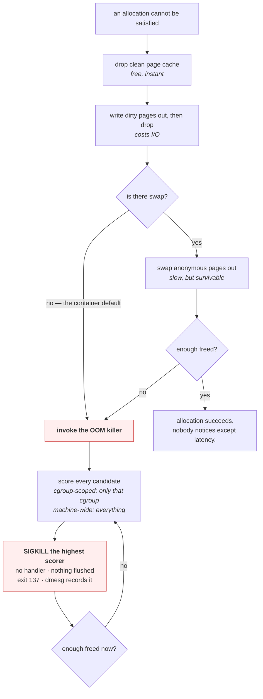

# 4.1 — What the OOM killer actually does

## One-line answer

When the kernel cannot free enough memory to satisfy an allocation, it picks one process and destroys it
with an uncatchable signal — deliberately, to save the rest of the system — and the process it picks is
scored rather than chosen, which is why it is so often not the one you would have chosen.

---

## The story

🎬 **The scene.** A lifeboat leaving a sinking ship. It holds thirty and there are thirty-four people
already aboard, with water coming over the gunwale.

The officer in charge has seconds. Nobody volunteers. If he does nothing, the boat swamps and all
thirty-four die.

😬 **The naive fix.** Wait, and hope somebody sorts it out.

💥 **Why it fails.** There is no version of waiting where the boat gets bigger. Every second of delay
makes the outcome worse for everyone, and the delay is not neutral — it is a choice, with a known result.

So he chooses. Not by merit, not by who deserves it, but by a rule he can apply in seconds: the four who
came aboard last and are nearest the side. It is arbitrary in the sense that it is not *just*. It is not
arbitrary in the sense that it is *unprincipled* — the rule exists precisely because deliberation is a
luxury this moment does not have.

💡 **The insight.** Some systems must have a rule for the case where every option is bad, decided in
advance, applied without deliberation. **The rule's job is not to be fair; it is to be fast and to leave
something alive.** And the thing everybody underestimates is that having no rule is itself a rule, with a
worse outcome.

---

## The idea in plain language

Verified against `docs.kernel.org/admin-guide/mm/concepts.html` on **2026-08-24**, verbatim:

> *"It is possible that on a loaded machine memory will be exhausted and the kernel will be unable to
> reclaim enough memory to continue to operate. In order to save the rest of the system, it invokes the
> OOM killer. The OOM killer selects a task to sacrifice for the sake of the overall system health. The
> selected task is killed in a hope that after it exits enough memory will be freed to continue normal
> operation."*

Every clause of that paragraph is worth pulling apart.

**"unable to reclaim enough memory"** — the killer is a last resort, not a first response. Before it fires,
the kernel drops clean page cache, writes dirty pages out, and swaps anonymous memory if swap exists
([1.3](../01-memory/1.3-the-page-cache-that-looks-like-a-leak.md)). **The killer only runs when reclaim
has failed**, which is why it is so much more common in containers with no swap: anonymous memory there is
simply not reclaimable at all.

**"In order to save the rest of the system"** — this is a *decision*, not a malfunction. The alternative is
a machine that cannot allocate, which means it cannot log, cannot schedule, and cannot be logged into to
fix. **The killer trades one process for the machine.**

**"selects a task to sacrifice"** — one. Not the biggest allocation, not the one that asked. One task,
chosen by score.

**"in a hope that"** — the kernel's own documentation says *hope*. If killing the chosen task does not free
enough, it runs again and kills another.

### How the victim is chosen

Every process has an OOM score, exposed at `/proc/<pid>/oom_score`. It is driven primarily by **how much
memory the process is using** as a fraction of what is available, adjusted by `oom_score_adj` — a value
from −1000 to +1000 that you can set to bias the choice.

- `oom_score_adj = -1000` — **never kill this**. Used for critical system processes.
- `oom_score_adj = 0` — the default.
- `oom_score_adj = +1000` — **kill this first**. Used for sacrificial workloads.

**The practical consequence is that the killer targets the largest consumer**, which is usually — and not
always — the culprit. A service using 6 GB legitimately will be chosen over a leaking one at 400 MB, and
that is the single most common complaint about the mechanism.

### Cgroup-scoped versus machine-wide

There are two completely different situations that produce the same log message and need different fixes.

**Machine-wide OOM.** Physical memory is exhausted across the whole node. The kernel scores every process
on the machine and kills one. **Anything on that node might be the victim**, including something entirely
unrelated to whatever caused the pressure.

**Cgroup OOM.** A cgroup reached `memory.max`
([3.2](../03-limits/3.2-memory-max-versus-memory-high.md)). The kernel scores **only the processes in that
cgroup** and kills one of them. The rest of the machine is unaffected.

**This is the single best argument for setting memory limits.** Without limits, one workload's leak causes
a machine-wide OOM and the victim is chosen from everything running. With limits, the blast radius is
exactly one cgroup — which is Principle 13 implemented in the kernel.

### Why it uses `SIGKILL` and nothing else

Because the machine is out of memory *now*, and a graceful shutdown might need to allocate in order to
run. A handler that logs, flushes and closes connections needs buffers, and there are no buffers.

So the killer uses the uncatchable signal
([Day 4, part 2.4](../../../day-004-linux-for-operators-i/parts/02-signals/2.4-the-signals-you-cannot-catch.md)):
no handler runs, nothing is flushed, no shutdown line is written, and the exit code is 137
([Day 4, part 3.2](../../../day-004-linux-for-operators-i/parts/03-exit-codes/3.2-128-plus-n-when-a-signal-becomes-an-exit-code.md)).

**The silence is the mechanism working, not evidence of a missing log.**

---

## Why Kriya needs it

Day 30's failure lab produces `exit 137` deliberately, and Day 40 reads `Reason: OOMKilled` from
`kubectl describe`. Both are this mechanism.

Day 42 sets memory limits for `pulse`, which decides whether an out-of-memory event is contained to one
container or takes the node.

Day 109 loads a model into `pulse`. Model servers are the archetypal victim: large, anonymous,
unreclaimable memory, which is precisely the highest-scoring shape.

Day 126 runs a local model on this 11.7 GiB machine, where Addendum 02 §4's profile arithmetic is
literally about not triggering this.

Day 84's incident lab hands you a symptom and no cause, and "the process disappeared with no error" is
among them.

---

## The mechanism

🅿️ **Producing a real out-of-memory kill needs Linux**, and doing it machine-wide would make this machine
unusable. **The safe version is cgroup-scoped and is parked until Day 21 (WSL2)**; what you can do today is
read the scoring and reason about the choice.

Look at the scores on your own machine:

```bash
for p in $(pgrep -f 'python|uvicorn' | head -5); do
  printf 'pid %-7s score %-6s adj %-6s  %s\n' \
    "$p" \
    "$(cat /proc/"$p"/oom_score 2>/dev/null || echo n/a)" \
    "$(cat /proc/"$p"/oom_score_adj 2>/dev/null || echo n/a)" \
    "$(ps -o args= -p "$p" 2>/dev/null | cut -c1-40)"
done 2>/dev/null || echo "no /proc — Windows; run in WSL2 from Day 21"
```

**Line by line:**

- `/proc/<pid>/oom_score` — **the kernel's current score for this process**, recomputed on read. Higher is
  more likely to be chosen.
- `/proc/<pid>/oom_score_adj` — the bias, from −1000 to +1000. **Reading it tells you whether anyone has
  protected or sacrificed this process**, which is a configuration decision usually made somewhere you
  would not think to look.
- `cut -c1-40` on the command line so the table stays readable
  ([Day 4, part 1.3](../../../day-004-linux-for-operators-i/parts/01-the-process/1.3-reading-ps-and-finding-your-service.md)).
- `|| echo` fallback for this machine.

On a Linux machine:

```text
pid 41220   score 12     adj 0       python .venv/bin/uvicorn pulse.api:app
pid 41880   score 148    adj 0       python -m worker
pid 1       score 0      adj -1000   /sbin/init
```

**`init` has `adj -1000` — it is exempt**, permanently, because killing PID 1 would take the machine down
([Day 4, part 4.3](../../../day-004-linux-for-operators-i/parts/04-the-service-died/4.3-zombies-orphans-and-pid-1.md)).
The worker at score 148 is the largest consumer and would be chosen first.

### Producing a cgroup-scoped kill safely

```bash
# 🅿️ PARKED until Day 21 (WSL2). Confined to one cgroup — the machine is never at risk.
# sudo mkdir -p /sys/fs/cgroup/kriya-oom
# echo "128M" | sudo tee /sys/fs/cgroup/kriya-oom/memory.max
# echo "max"  | sudo tee /sys/fs/cgroup/kriya-oom/memory.high
#
# uv run python days/day-006-resources-and-the-oom-killer/lab/allocate.py 512 &
# PID=$!
# echo "$PID" | sudo tee /sys/fs/cgroup/kriya-oom/cgroup.procs
# wait "$PID"; echo "exit code: $?"
# cat /sys/fs/cgroup/kriya-oom/memory.events
# sudo dmesg | tail -20
```

**Line by line:**

- `memory.max` of 128 MiB against a process asking for 512 — **guaranteed to fail**, which is what makes
  this a demonstration rather than a gamble.
- `memory.high` explicitly `max` — no brake ([3.2](../03-limits/3.2-memory-max-versus-memory-high.md)), so
  the cliff is reached rather than the workload being throttled.
- **The confinement is the safety property.** A 128 MiB cgroup cannot affect the machine, however badly
  the process inside it behaves. Compare with a machine-wide OOM, which you should never produce
  deliberately on a machine you care about.
- `wait` then the exit code on the very next line
  ([Day 4, part 3.1](../../../day-004-linux-for-operators-i/parts/03-exit-codes/3.1-the-exit-code-is-the-whole-return-value.md)).
- `dmesg` — **the kernel's own log**, which is where the killer records what it did and is the subject of
  [4.2](4.2-exit-137-and-the-message-that-is-not-in-your-log.md).

Expected:

```text
44012
exit code: 137
low 0
high 0
max 63
oom 1
oom_kill 1
```

**`oom 1, oom_kill 1`** — the kernel hit a point where an allocation could not be satisfied, and it killed
something. `max 63` says it reached the limit 63 times and reclaimed successfully 62 of them; the
sixty-third had nothing left to reclaim.

And in the kernel log:

```text
[194523.881204] allocate.py invoked oom-killer: gfp_mask=0x1100cca(GFP_HIGHUSER_MOVABLE), order=0, oom_score_adj=0
[194523.881219] memory: usage 131072kB, limit 131072kB, failcnt 63
[194523.881236] Memory cgroup stats for /kriya-oom: cache:0KB rss:130800KB
[194523.881290] Tasks state (memory values in pages):
[194523.881291] [  pid  ]   uid  tgid total_vm      rss pgtables_bytes swapents oom_score_adj name
[194523.881301] [  44012]  1000 44012   168442    32700   401408        0             0 python
[194523.881318] Memory cgroup out of memory: Killed process 44012 (python) total-vm:673768kB, anon-rss:130800kB, file-rss:0kB, shmem-rss:0kB, UID:1000 pgtables:392kB oom_score_adj:0
```

**Read `Memory cgroup out of memory`** — that phrase distinguishes a cgroup-scoped kill from a machine-wide
one, and it is the single most important word in the block. `usage 131072kB, limit 131072kB` shows the
limit was exactly reached. **The task table lists every candidate the kernel considered**, which on a real
cgroup with several processes tells you why it chose the one it did.

### Biasing the choice

```bash
# 🅿️ PARKED until Day 21.
# uv run python days/day-006-resources-and-the-oom-killer/lab/allocate.py 512 &
# VICTIM=$!
# echo 1000 | sudo tee /proc/"$VICTIM"/oom_score_adj
# cat /proc/"$VICTIM"/oom_score
```

**Line by line:**

- `oom_score_adj` of 1000 — **kill this first, whatever else is running.** The score is recomputed
  immediately and will be at or near its maximum.
- Writing to `/proc/<pid>/oom_score_adj` requires privilege to *lower* it below its current value, and any
  user may raise it for their own processes. **Raising is always allowed; protecting is not**, which is a
  sensible asymmetry — anyone may volunteer, only root may exempt.

Clean up:

```bash
# 🅿️ PARKED until Day 21.
# kill "$PID" 2>/dev/null; cat /sys/fs/cgroup/kriya-oom/cgroup.procs; sudo rmdir /sys/fs/cgroup/kriya-oom
```

**Line by line:** confirm the group is empty before `rmdir`, for the `Device or resource busy` reason in
[3.1](../03-limits/3.1-cgroups-the-box-you-put-a-process-in.md).



---

## When it breaks

**The killer chose the wrong process.** The commonest complaint, and it is working as designed:

```text
[194523.881318] Out of memory: Killed process 3312 (postgres) total-vm:8412992kB, anon-rss:6104880kB
```

— when the actual culprit was a leaking worker at 400 MB.

**What it says:** the database was killed.
**What it actually means:** the database was the **largest** consumer, and the score is driven by size.
The leaking worker was small and blameless-looking. **The killer targets consumption, not causation**, and
it has no way to know which process was behaving badly.
**The smallest fix:** `oom_score_adj` — protect the database with a negative value, or bias the workload
positively.
**The real fix:** memory limits per cgroup
([3.2](../03-limits/3.2-memory-max-versus-memory-high.md)), so a leaking workload hits its own ceiling and
is killed inside its own box before the machine ever reaches a global out-of-memory condition. **This is
the single strongest operational argument for always setting memory limits.**

**The process disappeared and nothing was logged.** The silence:

```text
$ systemctl status myservice
● myservice.service
     Active: failed (Result: signal) since Mon 2026-08-24 20:41:02; 2min ago
    Process: 41880 ExecStart=/usr/bin/myservice (code=killed, signal=KILL)
$ journalctl -u myservice -n 5
Aug 24 20:40:58 host myservice[41880]: request completed in 41ms
```

**What it says:** killed by signal KILL, and the last log line is an ordinary success.
**What it actually means:** `SIGKILL` is not delivered to the process
([Day 4, part 2.4](../../../day-004-linux-for-operators-i/parts/02-signals/2.4-the-signals-you-cannot-catch.md)),
so no shutdown ran and the log simply stops. **The application cannot log its own death** — by definition.
**The smallest fix for diagnosis:** `dmesg` or `journalctl -k`, where the *kernel* logged what it did
([4.2](4.2-exit-137-and-the-message-that-is-not-in-your-log.md)). **The application log is the wrong
place to look and will always be empty.**

**A machine-wide OOM that killed the SSH daemon.** The worst outcome:

```text
[891204.112889] Out of memory: Killed process 892 (sshd) total-vm:14882kB, anon-rss:5992kB
```

**What it says:** the SSH daemon was killed.
**What it actually means:** a machine-wide out-of-memory condition with no limits anywhere, so every
process on the node was a candidate — including the one you would use to log in and fix it. **The machine
is now unreachable and the actual culprit is still running.**
**The smallest fix:** out-of-band console access, or a reboot.
**The prevention:** `oom_score_adj = -1000` on the SSH daemon and the container runtime — which most
distributions and every Kubernetes node already do, precisely because of this failure.

**The killer ran repeatedly and never fixed anything.** The loop:

```text
[194523.881318] Memory cgroup out of memory: Killed process 44012 (python)
[194528.114420] Memory cgroup out of memory: Killed process 44119 (python)
[194532.887201] Memory cgroup out of memory: Killed process 44226 (python)
```

**What it says:** three kills in nine seconds, with rising pids.
**What it actually means:** something is restarting the process — a supervisor, a restart policy
([Day 4, part 1.2](../../../day-004-linux-for-operators-i/parts/01-the-process/1.2-pid-parent-and-the-process-tree.md))
— and each new instance immediately exceeds the same limit. **This is `CrashLoopBackOff` in its memory
form** (Day 30), and the killer is doing its job perfectly each time.
**The smallest fix:** stop restarting it until the limit is right. **The diagnostic value:** the *rate*
tells you it is deterministic rather than a rare peak — a workload killed once an hour is a headroom
problem, and one killed every three seconds cannot start at all within its limit.

---

## In production

**What a professional writes instead of the teaching version.** They set memory limits on everything, so
that every out-of-memory event is cgroup-scoped and the blast radius is one container. They protect the
things that must survive — the container runtime, the node agent, SSH — with negative `oom_score_adj`,
which every managed Kubernetes node already does. And they treat any machine-wide OOM as a serious
finding rather than a capacity blip, because it means something on that node had no limit.

**What degrades at scale.** Correlation. One container killed is a restart. A fleet where the limit is
marginally too low for a traffic peak kills many containers at once — and each restart begins with cold
caches and empty pools, using *more* memory during warm-up than in steady state, which makes the next kill
more likely ([3.2](../03-limits/3.2-memory-max-versus-memory-high.md)). **The mechanism that protects the
node can amplify the incident across the fleet**, and the remedy is headroom rather than a better killer.

**The failure that only shows with real traffic.** The scoring choosing your most important process. Under
test, one workload is running and the choice is trivial. In production a node runs a mixture, and the
highest-scoring process is whichever legitimately holds the most memory — usually a cache, a database, or
a model server, which are exactly the things whose restart is most expensive. **The leaking process that
caused the pressure is frequently not the one that dies**, and without per-cgroup limits there is nothing
in the mechanism that would make it so.

**The review comment a senior engineer leaves.** *"This DaemonSet has no memory limit, so when it leaks it
causes a node-level OOM and the kernel picks whatever is biggest — which on these nodes is the model
server, not the leaking agent. Set a limit on it so it dies in its own cgroup, and give the model server a
negative `oom_score_adj` while we are at it."*

**The signal you would alert on.** **`oom_kill` from `memory.events`, on any increase**
([3.2](../03-limits/3.2-memory-max-versus-memory-high.md)) — the kernel's own count, per cgroup,
unambiguous, requiring no inference. At the node level, **any machine-wide OOM event at all**, from
`dmesg` or the node exporter's `node_vmstat_oom_kill`, because a machine-wide OOM means some workload has
no limit and that is a configuration defect rather than a capacity event. And **container restart count
with reason `OOMKilled`**, which distinguishes memory kills from crashes and tells you which service to
size. You would **not** alert on `oom_score` values, which fluctuate constantly and mean nothing until the
killer actually runs.

**Blast radius.** This part reads scores — harmless — and, in its parked half, deliberately triggers a
kill. **The confinement is the entire safety design**: a 128 MiB cgroup means the machine is never at
risk, however large the allocation inside it. Worst case if you ignore the confinement and produce a
machine-wide out-of-memory condition instead: **the kernel kills something you did not choose, which may
be your editor, your shell, or the SSH daemon on a remote machine, and there is no undo.** Who can trigger
it: anyone who allocates enough. What bounds it: the cgroup limit, the parked status of these commands,
and the rule that follows. ⚠️ **Never produce a machine-wide OOM deliberately on a machine you care about
or cannot physically reach** — always confine it to a cgroup, which is one `mkdir` and one `echo`.

**Cost.** `0` model calls, `0` tokens, `0` CI minutes, `0` disk. **RAM: bounded by the cgroup limit — 128
MiB in the parked demonstration**, which is the pleasant property of doing this inside a box: the
experiment cannot exceed the budget you gave it, even though the script asks for four times as much.
Reading `oom_score` is free.

**The interview question.** *"Your pod was OOMKilled. What actually happened inside the kernel?"* The
answer that lands walks the sequence and names the scope: *"The cgroup's memory usage reached
`memory.max`, the kernel tried to reclaim — dropping page cache, writing dirty pages, swapping if there is
swap, which in a container there usually is not — and could not free enough. So it invoked the OOM killer
scoped to that cgroup, scored the processes in it, and `SIGKILL`ed the highest scorer. `SIGKILL` is not
delivered to the process, so no handler ran, nothing was flushed, and the exit code was 137 with the
application log just stopping mid-stream — the silence is expected, and the record is in the kernel log
rather than the app's. The important distinction is cgroup-scoped versus machine-wide: with a limit, only
that container is a candidate; without one, the kernel scores everything on the node and picks the
biggest, which is usually the database rather than whatever was actually leaking."*

---

## Check yourself

```bash
for p in $(pgrep -f 'python|uvicorn|node' 2>/dev/null | head -5); do printf 'pid %-7s score %-5s adj %-6s %s\n' "$p" "$(cat /proc/$p/oom_score 2>/dev/null)" "$(cat /proc/$p/oom_score_adj 2>/dev/null)" "$(ps -o comm= -p $p 2>/dev/null)"; done 2>/dev/null || echo "no /proc — Windows; run in WSL2 from Day 21"
```

The kernel's current ranking of which of your processes it would kill first. **The one with the highest
score is the one that dies**, and noticing that it is your largest rather than your worst-behaved process
is the whole point of this part.

**Say out loud, without scrolling up:** *your database was OOM-killed and the actual leak was in a small
worker process. Explain why the kernel chose the database, and name the one configuration change that
would have made the worker die instead.*
