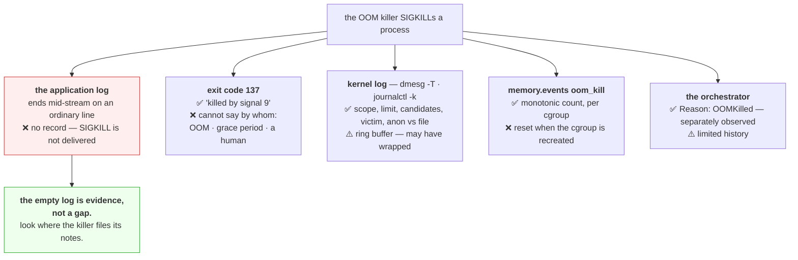

# 4.2 — Exit 137, and the message that is not in your log

## One-line answer

A process killed for memory writes nothing about it, because `SIGKILL` is never delivered — so the record
exists only in the kernel's log and in the cgroup's counters, and knowing to look there is the whole
difference between a five-minute diagnosis and a week of reading application code.

---

## The story

🎬 **The scene.** A house fire, and afterwards an insurance assessor walking through the remains.

The homeowner keeps a meticulous diary. The assessor asks to see it and is handed a book whose last entry
is *"Tuesday: replaced the kitchen tap."* Nothing about a fire.

😬 **The naive fix.** The assessor concludes the diary is unreliable and starts questioning the
homeowner's account of everything.

💥 **Why it fails.** The diary is perfectly reliable. It stops at Tuesday because **the person writing it
was not in a position to write on Wednesday.** Expecting an account of the fire from the thing the fire
consumed is a category error, and pursuing it wastes the afternoon.

The fire brigade's incident log, meanwhile, is three streets away in a filing cabinet, and it records the
time of the call, the cause, and which room it started in.

💡 **The insight.** When something is destroyed, the record of its destruction is never kept by the thing
destroyed. **It is kept by whatever did the destroying** — and knowing which external party that is, and
where they file their notes, is the difference between an investigation and a shrug.

---

## The idea in plain language

Part [4.1](4.1-what-the-oom-killer-actually-does.md) established what happens. This part is about finding
out that it happened, which is harder than it should be for one reason: **the process cannot tell you.**

`SIGKILL` is not delivered
([Day 4, part 2.4](../../../day-004-linux-for-operators-i/parts/02-signals/2.4-the-signals-you-cannot-catch.md)),
so no handler runs, no `finally` block executes, no buffer is flushed and no final line is written. **The
application log ends mid-stream on an ordinary line.**

### The four places the record does exist

| Source | What it gives you | Survives a restart? |
| --- | --- | --- |
| **exit code 137** | that it was signal 9 — not *why* | only if something recorded it |
| **the kernel log** (`dmesg`, `journalctl -k`) | the full account: which process, how much, which cgroup | until the ring buffer wraps |
| **`memory.events`** `oom_kill` | a monotonic count, per cgroup | **no — reset when the cgroup is recreated** |
| **the orchestrator** (`kubectl describe`, `docker inspect`) | `Reason: OOMKilled` plus the exit code | for a limited history |

**Each has a gap, and the gaps do not overlap**, which is why you learn to check more than one.

### Why `137` alone is not enough

`137` is `128 + 9`, so it says "killed by signal 9"
([Day 4, part 3.2](../../../day-004-linux-for-operators-i/parts/03-exit-codes/3.2-128-plus-n-when-a-signal-becomes-an-exit-code.md)).
Three things send signal 9:

1. the out-of-memory killer;
2. an orchestrator whose termination grace period expired
   ([Day 4, part 2.2](../../../day-004-linux-for-operators-i/parts/02-signals/2.2-sigterm-and-sigkill-the-request-and-the-order.md));
3. a human, or a script.

**These need completely different fixes** — more memory, a longer grace period, or a conversation — and
the exit code cannot distinguish them. **The `OOMKilled` reason can**, and it is a separately-sourced fact:
the runtime reads the cgroup's `oom_kill` counter rather than inferring it from the number.

### The kernel log, and its one weakness

`dmesg` is a **ring buffer**: fixed size, oldest entries discarded. On a busy machine it can hold minutes
rather than days. So the definitive record of an out-of-memory kill is also the one most likely to have
been overwritten by the time somebody investigates.

**`journalctl -k` persists it** where systemd's journal is configured to store to disk, which is the
common case on servers and the reason `journalctl -k --since` is more useful than `dmesg` for anything
older than the last few minutes.

### Reading the kernel's block

The block from [4.1](4.1-what-the-oom-killer-actually-does.md) contains four facts worth extracting every
time:

- **`invoked oom-killer`** on the first line names the process **that was allocating** — which is often
  not the process that was killed.
- **`Memory cgroup out of memory`** versus plain `Out of memory` — **cgroup-scoped or machine-wide**, the
  single most important distinction ([4.1](4.1-what-the-oom-killer-actually-does.md)).
- **the task table** lists every candidate the kernel scored, with each one's resident pages — so you can
  see why it chose what it chose.
- **`Killed process N (name) ... anon-rss:...`** names the victim and how much it was holding.

---

## Why Kriya needs it

Day 30's failure lab produces `exit 137` and asks you to diagnose it, and Day 40 reads it from `kubectl
describe pod`. Both days are this part applied.

Day 42 sets memory limits, and the feedback loop for whether a limit is right is `oom_kill` counts over
time.

Day 67 gives `pulse` structured logging, and one of that day's constraints comes from here: **a log the
process writes cannot record the process's own death**, so anything you need to survive a kill must be
written before it, not on the way out.

Day 76 builds the first alert. Alerting on `oom_kill` rather than on exit codes is the choice this part
justifies.

---

## The mechanism

Establish what each source shows, using a kill you produce deliberately.

**On this Windows machine you can produce the exit code and not the kernel log**, because there is no
`dmesg` and no cgroup accounting. Do the half you can, and note the gap:

```bash
uv run python days/day-006-resources-and-the-oom-killer/lab/allocate.py 256 &
VICTIM=$!
sleep 3
kill -KILL "$VICTIM"
wait "$VICTIM" 2>/dev/null
echo "exit code: $?"
```

**Line by line:**

- `allocate.py 256` from
  [1.1](../01-memory/1.1-virtual-memory-and-why-the-number-is-a-lie.md), so there is a real process
  holding real memory.
- `kill -KILL` — **the same signal the out-of-memory killer sends**, sent by hand. From the process's
  point of view these are indistinguishable, which is exactly the point: **the exit code cannot tell them
  apart either.**
- `wait` then `$?` on the next line
  ([Day 4, part 3.1](../../../day-004-linux-for-operators-i/parts/03-exit-codes/3.1-the-exit-code-is-the-whole-return-value.md)).

Observed on **2026-08-24**:

```text
[alloc] pid=44880
[alloc] before:      VmSize=         n/a  VmRSS=         n/a
[alloc] allocated:   VmSize=         n/a  VmRSS=         n/a
[alloc] touched all: VmSize=         n/a  VmRSS=         n/a
exit code: 137
```

**`137`, and the process wrote nothing about being killed.** Its last output is the ordinary
`touched all` line it was going to print anyway. **This is what every out-of-memory kill looks like from
the application's side**, and you have just produced it with a hand-sent signal — proving that the exit
code carries no information about *why*.

### The kernel's account

```bash
# 🅿️ PARKED until Day 21 (WSL2) — needs Linux and a kernel log.
# Trigger a cgroup-scoped kill (part 4.1) and then read all four sources:
#
# sudo dmesg -T | grep -i -A2 'oom' | tail -20
# journalctl -k --since '5 min ago' | grep -i 'out of memory'
# cat /sys/fs/cgroup/kriya-oom/memory.events
```

**Line by line:**

- `dmesg -T` — **`-T` converts the kernel's seconds-since-boot timestamps into human-readable dates**,
  which is the difference between `[194523.881204]` and something you can correlate with an incident
  timeline. Almost nobody knows this flag exists and everybody wants it.
- `grep -i -A2 'oom'` — case-insensitive, with two lines of context after each match, because the
  interesting line is usually the one following the first mention.
- `journalctl -k --since ...` — **`-k` restricts to kernel messages**, the same content as `dmesg`
  but from the persistent journal rather than the ring buffer, so it survives longer.
- `memory.events` — the cgroup's own counters
  ([3.2](../03-limits/3.2-memory-max-versus-memory-high.md)), which are the machine-readable version.

Expected shape, annotated:

```text
[Mon Aug 24 20:41:02 2026] allocate.py invoked oom-killer: gfp_mask=0x1100cca, order=0, oom_score_adj=0
[Mon Aug 24 20:41:02 2026] memory: usage 131072kB, limit 131072kB, failcnt 63
[Mon Aug 24 20:41:02 2026] Memory cgroup stats for /kriya-oom: cache:0KB rss:130800KB
[Mon Aug 24 20:41:02 2026] Tasks state (memory values in pages):
[Mon Aug 24 20:41:02 2026] [  pid  ]   uid  tgid total_vm      rss ... oom_score_adj name
[Mon Aug 24 20:41:02 2026] [  44012]  1000 44012   168442    32700 ...             0 python
[Mon Aug 24 20:41:02 2026] Memory cgroup out of memory: Killed process 44012 (python) total-vm:673768kB, anon-rss:130800kB, file-rss:0kB, UID:1000 oom_score_adj:0
```

**Four extractions, in the order you make them:**

1. **`Memory cgroup out of memory`** — cgroup-scoped. The rest of the machine was never at risk. Had this
   said plain `Out of memory:`, the scope would be the whole node and the fix would be "something has no
   limit".
2. **`usage 131072kB, limit 131072kB`** — usage reached the limit exactly. Not close: reached.
3. **The task table** — one candidate here; on a real cgroup it lists all of them with their `rss`, and
   you can see the scoring.
4. **`anon-rss:130800kB, file-rss:0kB`** — **the victim's memory was entirely anonymous.** No page cache,
   so nothing was reclaimable ([1.3](../01-memory/1.3-the-page-cache-that-looks-like-a-leak.md)) and the
   kill was inevitable. **If `file-rss` had been large, reclaim would probably have saved it**, and the
   right response would be different.

### The orchestrator's view

```bash
# 🅿️ PARKED until Day 25 (containers) and Day 33 (Kubernetes).
# docker inspect <container> --format '{{.State.OOMKilled}} {{.State.ExitCode}} {{.State.FinishedAt}}'
# kubectl describe pod <pod> | grep -A6 'Last State'
```

**Line by line:**

- `.State.OOMKilled` is a **boolean the runtime observed**, not derived from the exit code — which is
  precisely why it can distinguish a memory kill from a grace-period kill when the number cannot
  ([Day 4, part 3.2](../../../day-004-linux-for-operators-i/parts/03-exit-codes/3.2-128-plus-n-when-a-signal-becomes-an-exit-code.md)).
- Printing all three together — the flag, the code, and the time — gives you the fact, the corroboration
  and the timestamp to correlate against everything else.
- `grep -A6 'Last State'` on `kubectl describe` — six lines of context covers reason, exit code, started
  and finished times.

```text
true 137 2026-08-24T20:41:02.184291Z
```

```text
    Last State:     Terminated
      Reason:       OOMKilled
      Exit Code:    137
      Started:      Mon, 24 Aug 2026 20:38:41 +0000
      Finished:     Mon, 24 Aug 2026 20:41:02 +0000
```

**`Reason: OOMKilled` next to `Exit Code: 137` is the complete answer in two lines** — and note that
`Started` and `Finished` are barely two minutes apart, which tells you this workload cannot survive its
limit rather than occasionally exceeding it.



---

## When it breaks

**`exit 137` and `OOMKilled: false`.** The distinction that saves a week:

```text
$ docker inspect pulse --format '{{.State.OOMKilled}} {{.State.ExitCode}}'
false 137
```

**What it says:** killed by signal 9, and not for memory.
**What it actually means:** somebody or something else sent `SIGKILL` — almost always a `docker stop` or
a kubelet whose grace period expired because the process did not handle `SIGTERM`
([Day 4, part 4.2](../../../day-004-linux-for-operators-i/parts/04-the-service-died/4.2-the-shutdown-that-dropped-requests.md)).
**Raising the memory limit would change nothing.**
**The smallest fix:** check the shutdown path, not the memory. **The reason this matters so much:** teams
routinely spend days raising memory limits to fix what is a shutdown-handler bug, because `137` looked
like a memory problem and nobody checked the boolean.

**`dmesg` shows nothing at all.** The ring buffer:

```text
$ sudo dmesg | grep -i oom
$ echo $?
1
```

**What it says:** no out-of-memory messages.
**What it actually means:** either there was no kill, or **the buffer wrapped.** A busy machine can cycle
`dmesg` in minutes, and an investigation started an hour after the event finds nothing.
**The smallest fix:** `journalctl -k --since <a window that covers the event> | grep -i 'out of memory'`, which reads the
persistent journal rather than the volatile buffer. **And the durable fix is not to rely on either** —
`oom_kill` from `memory.events` is a counter you can scrape, and a scraped counter has history that a
ring buffer does not.

**`memory.events` reads zero after a kill you know happened.** The counter reset:

```text
$ kubectl exec pulse-6d4f8b9c7-nm4pq -- cat /sys/fs/cgroup/memory.events | grep oom_kill
oom_kill 0
$ kubectl get pod pulse-6d4f8b9c7-nm4pq
NAME                    READY   STATUS    RESTARTS   AGE
pulse-6d4f8b9c7-nm4pq   1/1     Running   3          12m
```

**What it says:** three restarts and no recorded kills.
**What it actually means:** **you are reading a different cgroup.** The container was recreated, which
means a new cgroup with fresh counters; the three kills belong to cgroups that no longer exist.
**The smallest fix:** the counter must be **scraped continuously** to be useful, which is what a monitoring
agent does. Reading it after the fact tells you only about the current incarnation.
**The general lesson:** **counters that live with the thing being counted die with it**, so they are only
useful when something outside is recording them over time.

**A machine-wide OOM with no obvious culprit.** The scope question:

```text
[891204.112889] Out of memory: Killed process 3312 (postgres) total-vm:8412992kB, anon-rss:6104880kB
```

— note the absence of the words `Memory cgroup`.

**What it says:** a machine-wide out-of-memory event.
**What it actually means:** **something on that node had no memory limit**, so the kernel scored every
process on the machine and picked the largest — the database — rather than the workload that was actually
growing.
**The smallest fix:** find the process with no limit. On Kubernetes, that is any container without
`resources.limits.memory`, and the task table in the kernel log lists every candidate with its `rss`, so
comparing that table against your expected footprints usually identifies it.
**The prevention:** limits on everything, so that every out-of-memory event is cgroup-scoped and names its
own culprit ([4.1](4.1-what-the-oom-killer-actually-does.md)).

**The last log line is a successful request and the incident report says the service crashed.** The
narrative problem:

```text
2026-08-24T20:41:01.882Z INFO  request completed path=/predict status=200 duration_ms=38
2026-08-24T20:41:02.104Z INFO  request completed path=/predict status=200 duration_ms=41
```

— and nothing after.

**What it says:** two successful requests and then silence.
**What it actually means:** exactly what it appears to: the service was working normally until the instant
it ceased to exist. **"It crashed" is the wrong word** — nothing crashed, nothing threw, nothing was
wrong with the code. It was removed.
**The value of getting the language right:** "crashed" sends somebody to read stack traces that do not
exist. "Was killed for memory" sends them to the limit and the working set, which is where the answer is.

---

## In production

**What a professional writes instead of the teaching version.** They stop reading application logs for
this class of failure entirely, because the application is structurally incapable of reporting it. Their
first three commands are the orchestrator's termination reason, the cgroup's `oom_kill` counter as a
scraped time series, and the kernel log — in that order, because the first is fastest and the last is most
detailed. **And they scrape `oom_kill` continuously**, precisely because the counter dies with the cgroup
and after-the-fact reads are worthless.

**What degrades at scale.** Attribution across restarts. One container killed once is easy. A fleet where
containers are killed, restarted, rescheduled onto other nodes and killed again produces a scatter of
events with no obvious owner — and every one of the per-cgroup counters resets. **The only thing that
survives is what your monitoring recorded at the time**, which makes the choice of what to scrape a
decision about what you will be able to diagnose six months from now.

**The failure that only shows with real traffic.** The kill that happens once a week. Under test the
workload either fits or does not. In production it fits on ordinary days and exceeds the limit during the
weekly peak, so you get one kill a week with a restart that succeeds — **and every diagnostic source has
rotated, wrapped or reset by the time anybody notices the pattern.** The only evidence is a restart count
that crept up, and the only fix is to have been scraping `oom_kill` all along.

**The review comment a senior engineer leaves.** *"The runbook for this alert says 'check the application
logs for the error'. There will not be one — `SIGKILL` is not delivered, so the log just stops. Change the
first step to `kubectl describe pod` and look at `Last State: Reason`, because that is a separately
observed fact and it distinguishes an OOM kill from a grace-period kill, which need completely different
fixes."*

**The signal you would alert on.** **`oom_kill` from `memory.events`, scraped continuously, alerting on
any increase.** It is the kernel's own count, it is per cgroup so it names its own owner, and it requires
no inference. Second, **container terminations with reason `OOMKilled`**, which is the same fact from the
orchestrator and is what your dashboard should group by. Third, and specifically **not** the exit code:
`137` conflates three causes and alerting on it produces pages for grace-period expiry that will be
diagnosed as memory problems. And at node level, **any machine-wide OOM event at all**, because that means
a workload without a limit and is a configuration defect rather than a capacity event.

**Blast radius.** This part sends `SIGKILL` to a process you started — the same capability introduced on
Day 4 ([Day 4, part 2.2](../../../day-004-linux-for-operators-i/parts/02-signals/2.2-sigterm-and-sigkill-the-request-and-the-order.md))
— and reads logs. Worst case: killing the wrong pid, since pids are recycled
([Day 4, part 1.3](../../../day-004-linux-for-operators-i/parts/01-the-process/1.3-reading-ps-and-finding-your-service.md)),
and destroying an unrelated program with unsaved state. Who can trigger it: you. What bounds it: capturing
`$!` into a named variable immediately rather than reusing it later, and the habit of
`ps -o pid,lstart,args -p <pid>` before any kill. **The parked half runs entirely inside a 128 MiB cgroup**
and cannot affect the machine.

**Cost.** `0` model calls, `0` tokens, `0` CI minutes, `0` disk. **RAM: 256 MiB briefly** for the victim
process. Reading `dmesg`, `journalctl -k` and `memory.events` is free — and note that the kernel ring
buffer costs a fixed small amount of memory permanently, which is why it is small enough to wrap.

**The interview question.** *"A container exited with 137 and the application log has no errors. Where do
you look?"* The answer that lands starts by explaining the silence: *"The empty log is expected, not a
gap — `SIGKILL` is never delivered to the process, so no handler runs and the log just stops mid-stream.
The record is kept by whatever did the killing. First I check the orchestrator's termination reason,
because `OOMKilled` is a separately observed boolean and it distinguishes a memory kill from a
grace-period kill, which is the same exit code and a completely different fix. Then the kernel log with
`dmesg -T` or `journalctl -k`, which tells me whether it was cgroup-scoped or machine-wide — machine-wide
means something has no limit — and shows the victim's anonymous versus file-backed memory, because if it
was mostly page cache reclaim should have saved it. And the durable answer is to scrape `oom_kill` from
`memory.events` continuously, because that counter resets when the cgroup is recreated, so reading it
after the incident tells you nothing."*

---

## Check yourself

```bash
uv run python days/day-006-resources-and-the-oom-killer/lab/allocate.py 128 & V=$!; sleep 3; kill -KILL "$V"; wait "$V" 2>/dev/null; echo "exit code: $?  — and note the process logged nothing about it"
```

A hand-sent `SIGKILL`, the resulting `137`, and the silence. **This is byte-for-byte what an out-of-memory
kill looks like from the application's side** — which is why the exit code alone can never tell you
whether it was memory, a grace period, or a person, and why the reason has to come from somewhere else.

**Say out loud, without scrolling up:** *name the three different things that produce exit code 137, say
which single field distinguishes the memory one, and explain why that field is not derived from the exit
code.*
