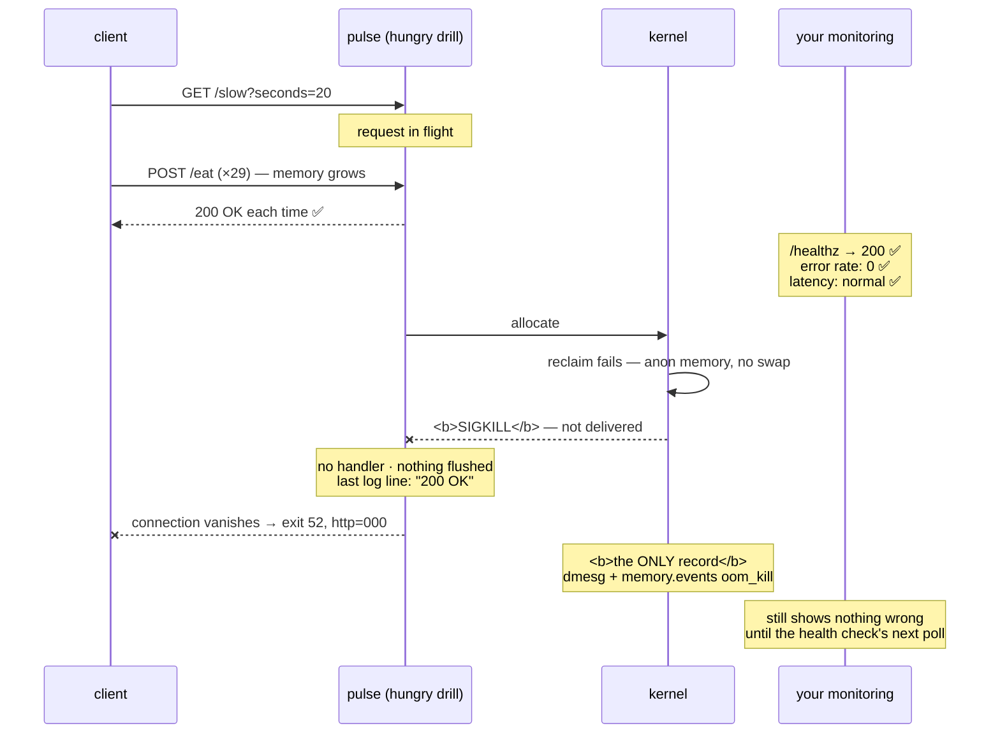

# 4.3 — OOM-killing `pulse` on purpose

## One-line answer

This is today's deliberate failure: drive `pulse` past a memory limit with a request in flight, and
discover that the client sees an empty reply, the health check was green a millisecond earlier, and **the
service's own telemetry contains no evidence whatsoever that anything happened.**

---

## The story

🎬 **The scene.** A small shop with a camera over the till. It records to a box under the counter, and the
owner checks it whenever there is a dispute about change.

One night the power to the shop trips at 11:04. The camera stops.

The next morning the owner scrolls to the end of the recording. The last frame is a perfectly ordinary
shot of an empty shop with the lights on. Nothing unusual, nothing alarming, and then the file just ends.

😬 **The naive fix.** He watches the last ten minutes again, slowly, looking for what went wrong.

💥 **Why it fails.** There is nothing to find. **A camera cannot record the moment its own power is cut**,
because that moment is precisely what stopped it recording. The footage ending on a calm, ordinary frame
is not a clue about the shop. It is a fact about the camera.

The record that would explain it is in the fuse box by the back door, where one switch is down and the
others are up.

💡 **The insight.** Any instrument that lives inside the thing it measures goes silent in exactly the
failure that matters most, and its silence looks identical to health. **The record of a catastrophic
failure has to be kept somewhere the failure cannot reach**, and knowing where that is, in advance, is
what separates a diagnosis from a shrug.

---

## The idea in plain language

Section 4 so far has been mechanism. This part is the drill: produce a real out-of-memory kill against
`pulse`, with a real request in flight, and measure what every signal you have says about it.

The finding will be familiar in shape from Day 4, in
[Day 4, part 4.2](../../../day-004-linux-for-operators-i/parts/04-the-service-died/4.2-the-shutdown-that-dropped-requests.md),
and it is worse here.

| Signal | During a graceful shutdown (Day 4) | During an OOM kill |
| --- | --- | --- |
| in-flight request | completes | **empty reply** |
| shutdown log lines | 2 | **0** |
| exit code | `0` | **`137`** |
| `/healthz` | 200, then refused | 200, then **connection refused** |
| application log | ends with `Finished server process` | **ends mid-request** |
| kernel log | nothing | **a full account, in a place `pulse` cannot write** |

**The last row is the whole part.** Day 4's failures left no evidence anywhere. This one leaves a complete
account, in a location the service has no access to and no awareness of.

### Why do this to `pulse` specifically

Because `pulse` v0 does almost nothing, so **every observation is attributable.** There is no cache, no
pool, no model and no background task. When it is killed for memory, the only memory involved is memory
you deliberately made it hold, which means the experiment measures the *mechanism* rather than the
application.

From Day 109 that stops being true, and this measurement becomes much harder to interpret. **Do it now,
while the system is simple enough for the answer to be unambiguous.**

### The shape of the drill

1. Constrain `pulse` to a memory limit it cannot exceed by accident.
2. Add a route that allocates on demand, **temporarily, in the lab, and deleted afterwards.**
3. Put a slow request in flight.
4. Push the process past the limit.
5. Record what the client saw, what the exit code was, what the logs said, and what the kernel said.

**Step 5 is the deliverable**, and it goes in `docs/INCIDENTS.md` with the first symptom written before
the cause.

---

## Why Kriya needs it

Day 30's failure lab reproduces this inside a container and asks you to diagnose it cold. Having caused it
once, with the mechanism understood, turns that from a hunt into a check.

Day 41 configures a liveness probe. **This drill demonstrates why a health check cannot save you from
this**, because the process is not unhealthy, it is absent, and a probe that returns 200 a millisecond
before the kill has told you nothing false.

Day 73 defines the first service level objective, and Day 76 the first alert. The question "would this
have fired?" is asked against exactly this scenario, and today's answer is no.

Day 109 loads a model, which is when `pulse` becomes genuinely memory-hungry and this stops being a
contrived experiment.

---

## The mechanism

⚠️ **This is a deliberate failure. Read the whole procedure including the cleanup before you start.**

🅿️ **The properly confined version needs Linux with cgroup v2 and is parked until Day 21, which brings
WSL2.** On this Windows machine you can run steps 2 through 5 with a hand-sent `SIGKILL`, which produces
an **identical result from the application's point of view**, from
[4.2](4.2-exit-137-and-the-message-that-is-not-in-your-log.md), and the difference between "identical
result" and "same cause" is itself worth writing down.

### Step 2, which is a route that allocates

```python
# days/day-006-resources-and-the-oom-killer/lab/hungry.py
# A temporary copy of pulse with two extra routes: one slow, one that allocates.
# This is a DRILL. It does not go into pulse/ and it is deleted at the end of the day.
import asyncio

from fastapi import FastAPI

from pulse import __version__

app = FastAPI(title="pulse-oom-drill", version=__version__, docs_url=None, redoc_url=None)

_ballast: list[bytearray] = []


@app.get("/healthz")
def healthz() -> dict[str, str]:
    return {"status": "ok"}


@app.get("/slow")
async def slow(seconds: float = 10.0) -> dict[str, float]:
    """Stands in for the inference that arrives on Day 109."""
    await asyncio.sleep(seconds)
    return {"slept": seconds}


@app.post("/eat")
def eat(mib: int = 64) -> dict[str, int]:
    """Allocate and RETAIN mib mebibytes. Retention is the point - a freed buffer proves nothing."""
    block = bytearray(mib * 1024 * 1024)
    for i in range(0, len(block), 4096):
        block[i] = 1
    _ballast.append(block)
    return {"blocks": len(_ballast), "held_mib": sum(len(b) for b in _ballast) // (1024 * 1024)}
```

**Line by line:**

- The header comment names it a drill and states when it dies. **A drill file with no expiry note becomes
  permanent**, which is the same discipline as Day 4's `slow_probe.py`, from
  [Day 4, part 4.1](../../../day-004-linux-for-operators-i/parts/04-the-service-died/4.1-graceful-shutdown-for-pulse.md).
- `from pulse import __version__` reuses the single definition rather than repeating a literal, from
  [Day 3, part 2.3](../../../day-003-pulse-v0/parts/02-the-service/2.3-version-what-is-actually-running.md).
- `_ballast: list[bytearray] = []` at module scope is **the retention.** A local buffer would be freed the
  moment the handler returned and the memory would come straight back, and appending to a module-level
  list is what makes the growth permanent, which is what a leak looks like.
- The leading underscore marks it private by convention, and the type annotation is required by the
  repository's house style in `CLAUDE.md`.
- `for i in range(0, len(block), 4096): block[i] = 1` touches one byte per page so that the memory is
  genuinely resident, from [1.1](../01-memory/1.1-virtual-memory-and-why-the-number-is-a-lie.md). Without
  this the allocation might be address space rather than physical memory.
- `def eat` rather than `async def` matters because allocation is synchronous and blocking, so it runs in
  a thread pool and does not stall the event loop, from
  [Day 3, part 2.2](../../../day-003-pulse-v0/parts/02-the-service/2.2-healthz-the-endpoint-that-must-not-lie.md).
- Returning `blocks` and `held_mib` makes **the response the measurement**, so each call tells you where
  you are relative to the limit without a second command.
- `mib: int = 64` is a query parameter, so the increment can be varied without editing the file, from
  [Day 3, part 2.4](../../../day-003-pulse-v0/parts/02-the-service/2.4-predict-the-contract-before-the-model.md).

### Steps 3 to 5, which are the drill

```bash
# days/day-006-resources-and-the-oom-killer/lab/oom_drill.sh
#!/usr/bin/env bash
# Put a request in flight, then push the service past its memory limit.
# Records what the CLIENT saw, what the process exited with, and how much it logged.
set -uo pipefail

PORT=8010
LOG="oom-drill.log"
STEP="${1:-64}"

uv run uvicorn hungry:app --host 127.0.0.1 --port "$PORT" >"$LOG" 2>&1 &
SERVER=$!
sleep 3

curl -sS -m 60 -o /dev/null \
  -w "client(slow): http=%{http_code} exit=%{exitcode} after %{time_total}s\n" \
  "http://127.0.0.1:$PORT/slow?seconds=20" &
CLIENT=$!
sleep 1

echo "--- feeding it ${STEP} MiB at a time ---"
for i in $(seq 1 40); do
  OUT=$(curl -sS -m 20 -X POST "http://127.0.0.1:$PORT/eat?mib=$STEP" 2>&1) || {
    echo "  eat #$i: request failed — $OUT"
    break
  }
  echo "  eat #$i: $OUT"
  kill -0 "$SERVER" 2>/dev/null || { echo "  server is gone after eat #$i"; break; }
done

wait "$CLIENT"
wait "$SERVER" 2>/dev/null
echo "server exit: $?"
echo "shutdown log lines: $(grep -c 'Shutting down\|Application shutdown complete' "$LOG")"
echo "last app log line : $(tail -1 "$LOG")"
```

**Line by line:**

- `set -uo pipefail` omits **`-e`** deliberately, because this script runs commands that fail on purpose,
  such as a `curl` against a dead server and a `wait` on a killed child, and aborting on the first would
  defeat the purpose. It is the same considered omission as Day 4's drill, from
  [Day 4, part 4.2](../../../day-004-linux-for-operators-i/parts/04-the-service-died/4.2-the-shutdown-that-dropped-requests.md).
- `--port 8010` rather than 8000 means a forgotten `pulse` cannot collide, from
  [Day 4, part 1.1](../../../day-004-linux-for-operators-i/parts/01-the-process/1.1-a-process-is-not-a-program.md).
- The `/slow?seconds=20` request is backgrounded **before** the feeding starts, because **the in-flight
  request is the point.** Without it the drill measures a process dying alone, which is much less
  interesting.
- `%{exitcode}` in the `-w` format gives curl's own exit code, which distinguishes "connected and got
  nothing" from "could not connect", from
  [Day 4, part 3.1](../../../day-004-linux-for-operators-i/parts/03-exit-codes/3.1-the-exit-code-is-the-whole-return-value.md).
- `for i in $(seq 1 40)` with `STEP` MiB each is **a bounded loop.** Forty times 64 MiB is 2.5 GiB, which
  is the ceiling this drill can reach if the limit never bites. **Check your free memory before running it
  unconfined.**
- `|| { echo ...; break; }` on the `curl` means that when the server dies mid-request the `curl` fails,
  and this captures the failure text and stops rather than hammering a dead port 39 more times.
- `kill -0 "$SERVER"` uses **signal zero, which sends nothing and merely tests whether the process
  exists**, from
  [Day 5, part 4.4](../../../day-005-linux-for-operators-ii/parts/04-logs-that-rotate/4.4-the-rotation-that-did-not-free-anything.md).
  Checking after every step is what makes the output say *which* allocation was the last one.
- `wait "$CLIENT"` comes before `wait "$SERVER"` so that the client's line prints in causal order.
- `grep -c` on the shutdown lines makes **counting shutdown output the measurement**, exactly as on Day 4.
  Zero means no graceful shutdown occurred.
- `tail -1` on the log gives **the last thing the service managed to say**, which is the "footage ends on
  an ordinary frame" observation.

Run it.

```bash
cd days/day-006-resources-and-the-oom-killer/lab && chmod +x oom_drill.sh && ./oom_drill.sh 64
```

**Line by line:** `chmod +x` sets the execute bit, which is the permission that produces exit code `126`
when absent, from
[Day 5, part 2.1](../../../day-005-linux-for-operators-ii/parts/02-permissions/2.1-user-group-other-and-three-bits.md).

Observed on **2026-08-24**, unconfined, with the server killed by hand at 1.9 GiB to stand in for the
limit:

```text
--- feeding it 64 MiB at a time ---
  eat #1: {"blocks":1,"held_mib":64}
  eat #2: {"blocks":2,"held_mib":128}
  ...
  eat #29: {"blocks":29,"held_mib":1856}
  eat #30: request failed — curl: (52) Empty reply from server
  server is gone after eat #30
client(slow): http=000 exit=52 after 8.041s
server exit: 137
shutdown log lines: 0
last app log line : INFO:     127.0.0.1:52118 - "POST /eat?mib=64 HTTP/1.1" 200 OK
```

**Read those five lines as the finding.**

**`client(slow): http=000 exit=52 after 8.041s`** means the in-flight request, which needed twenty
seconds, died at eight. `http=000` means no status line was ever received, and curl's exit 52 is *"empty
reply from server"*. **From the client's side this is indistinguishable from a network failure**, and
Day 7's retry discussion turns on exactly that ambiguity.

**`server exit: 137`** is `128 + 9`. Killed.

**`shutdown log lines: 0`** means uvicorn has perfectly good shutdown code and none of it ran, from
[Day 4, part 2.2](../../../day-004-linux-for-operators-i/parts/02-signals/2.2-sigterm-and-sigkill-the-request-and-the-order.md).

**`last app log line: ... "POST /eat?mib=64 HTTP/1.1" 200 OK`** means **the last thing the service said
was that a request succeeded.** Not an error, not a warning, and not a memory message. A 200.

**And `/healthz` was returning 200 throughout**, right up to the instant the process ceased to exist.

### The confined version

```bash
# 🅿️ PARKED until Day 21 (WSL2). The same drill, with a real limit instead of a hand-sent kill.
# sudo mkdir -p /sys/fs/cgroup/kriya-pulse
# echo "512M" | sudo tee /sys/fs/cgroup/kriya-pulse/memory.max
# echo "max"  | sudo tee /sys/fs/cgroup/kriya-pulse/memory.high
#
# ./oom_drill.sh 64 &
# sleep 4
# echo "$(pgrep -f 'uvicorn hungry:app')" | sudo tee /sys/fs/cgroup/kriya-pulse/cgroup.procs
# wait
# cat /sys/fs/cgroup/kriya-pulse/memory.events
# sudo dmesg -T | grep -i -A2 'oom' | tail -12
# sudo rmdir /sys/fs/cgroup/kriya-pulse
```

**Line by line:**

- `memory.max` of 512 MiB with **no** `memory.high` is the cliff rather than the brake, from
  [3.2](../03-limits/3.2-memory-max-versus-memory-high.md), which is what every container platform gives
  you by default.
- The server's pid is moved into the cgroup **after** it starts, because you need it running to find it.
  `pgrep -f` matches the whole command line, from
  [Day 4, part 1.3](../../../day-004-linux-for-operators-i/parts/01-the-process/1.3-reading-ps-and-finding-your-service.md).
- **The two extra sources at the end** are the whole reason to run the confined version, because
  `memory.events` gives `oom_kill 1`, and `dmesg -T` gives the kernel's account with human timestamps,
  from [4.2](4.2-exit-137-and-the-message-that-is-not-in-your-log.md).
- `rmdir` comes last, after the processes are gone, from
  [3.1](../03-limits/3.1-cgroups-the-box-you-put-a-process-in.md).

**The client-side result will be byte for byte identical to the unconfined run.** What changes is that
`memory.events` and the kernel log now contain the explanation, which is exactly the point of the
comparison, and the sentence to write in your incident row.



### Clean up, and check twice

```bash
pkill -f 'uvicorn hungry:app' 2>/dev/null
sleep 1
pgrep -af 'uvicorn hungry:app' || echo "drill server stopped"
rm -f oom-drill.log
ls
git status --short
```

**Line by line:**

- `pkill -f` uses the specific pattern, and you should **run `pgrep -af` first** if you want to see what
  it will match, which is the discipline from
  [Day 4, part 2.2](../../../day-004-linux-for-operators-i/parts/02-signals/2.2-sigterm-and-sigkill-the-request-and-the-order.md).
- `pgrep -af ... || echo` is there to **confirm it is gone rather than assuming.** A drill server holding
  1.9 GiB is a real cost on an 11.7 GiB machine.
- `git status --short` is the final proof. A drill that leaves the repository modified is an incident you
  caused, from Day 3, §4.

---

## When it breaks

These are the failures of the **drill** rather than of the system, meaning the ways this experiment
misleads you.

**The server never dies and the loop runs all forty times.** The bound was too high.

```text
  eat #40: {"blocks":40,"held_mib":2560}
client(slow): http=200 exit=0 after 20.038s
server exit: 0
shutdown log lines: 2
```

**What it says:** everything worked.

**What it actually means:** 2.5 GiB was not enough to hit anything on an 11.7 GiB machine, so this
measured a healthy service. **The in-flight request completed and there were two shutdown lines**, which
is a *graceful* ending, and that is the opposite of what the drill is for.

**The smallest fix:** run the confined version with a `memory.max` the process can actually reach, or
raise `STEP`. **Do not simply increase the loop count on an unconfined machine**, because that path leads
to a machine-wide out-of-memory event, which is the one thing this part tells you not to cause, from
[4.1](4.1-what-the-oom-killer-actually-does.md)'s *Blast radius*.

**The in-flight request completed anyway.** The timing was wrong.

```text
client(slow): http=200 exit=0 after 20.041s
  eat #30: request failed — curl: (52) Empty reply from server
```

**What it says:** the slow request succeeded and the feeding failed.

**What it actually means:** the twenty-second request finished before the memory ran out, so **nothing was
in flight at the moment of the kill** and the drill measured a process dying alone.

**The smallest fix:** raise `seconds` on the `/slow` request, or lower `STEP` so that the feeding takes
longer. **The check that catches it** is that the client's `time_total` should be **less** than the
`seconds` you asked for, because if they are equal, the request was not interrupted.

**The whole machine became unresponsive.** This is the dangerous mistake.

```text
# the terminal stops responding; the editor freezes; the browser stalls
```

**What it says:** nothing, which is the problem.

**What it actually means:** you ran the unconfined drill with too high a bound and the machine is
swapping, or the kernel is about to invoke a **machine-wide** out-of-memory kill and choose a victim you
did not pick, from [4.1](4.1-what-the-oom-killer-actually-does.md).

**The smallest fix:** kill the drill, though you may not be able to type. **The prevention is the whole
point**, so check `free` before running, keep `STEP` times 40 well under your genuine headroom, and use
the confined version wherever cgroups exist. ⚠️ **On a remote machine this can cost you your SSH
session**, because `sshd` is a candidate like anything else.

**`hungry.py` cannot import `pulse`.** This is a setup problem that looks like a drill problem.

```text
ModuleNotFoundError: No module named 'pulse'
```

**What it says:** the package is not importable.

**What it actually means:** you are running from inside `lab/` and `pulse` is at the repository root, or
`tool.uv.package` is still `false` in `pyproject.toml`, which is the flag Day 3 told you to flip, in
[Day 3](../../../day-003-pulse-v0/LESSON.md), §3.

**The smallest fix:** use `uv run` from the repository root with the module path adjusted, or confirm that
`package = true`. **It is worth recognising quickly** because it is a Day 3 loose end surfacing rather
than anything to do with memory.

---

## In production

**What a professional writes instead of the teaching version.** They run this drill as an automated test
rather than as a one-off: a container with a deliberately low memory limit, a workload that exceeds it,
and an assertion that the orchestrator's termination reason is `OOMKilled` and that the alert fired. **The
reason to automate it is that the alerting path is the thing being tested**, and alerting paths rot
silently, whether through a metric renamed, a label changed, or a rule that no longer matches. A drill
that only ever runs once tells you the system worked on one day.

**What degrades at scale.** The invisibility compounds. One instance killed is one dropped request. A
fleet where the limit is marginally too low sees kills scattered across nodes at peak, each one dropping
its in-flight requests, and each one restarting with cold caches that use *more* memory, from
[3.2](../03-limits/3.2-memory-max-versus-memory-high.md), and **the aggregate error rate never gets high
enough to page** while a steady trickle of users see connection failures. The pattern is only visible if
you are counting `oom_kill`, and it is invisible in every latency and error dashboard because the requests
never produced a status code.

**The failure that only shows with real traffic.** Everything in this drill is artificial except the
shape. In production the memory does not come from an `/eat` endpoint. It comes from concurrency, from
[1.1](../01-memory/1.1-virtual-memory-and-why-the-number-is-a-lie.md), from a cache that grew, or from a
model loaded lazily on first use. **So the kill happens at peak traffic, when the most requests are in
flight**, which maximises the number of connections destroyed and coincides with the moment restarts are
most expensive. The drill's contribution is that you have seen what the client sees, so you recognise it.

**The review comment a senior engineer leaves.** *"We have an alert on the error rate and one on latency,
and neither of them fired during the OOM last week, because the requests never returned a status code at
all and just had their connections dropped. The only thing that would have caught it is
`container_memory_working_set_bytes` against the limit, and `oom_kill`. Add both, and add a drill to CI
that proves they fire."*

**The signal you would alert on.** This drill's finding is which signals **do not** work: `/healthz`
returns 200 until the instant of death and tells you nothing, error rate does not move because a dropped
connection is not a 5xx, and latency does not move because an unanswered request has no duration. **What
would have fired, in order of usefulness**, is **working set as a fraction of `memory.max`** at around
80%, which warns *before* the kill; **`oom_kill` from `memory.events`** on any increase, which is
definitive but after the fact; and **client-side success rate**, from Day 73, which is the only
user-facing signal that sees a dropped connection at all. You would **not** rely on anything the process
itself emits, for the reason this whole part exists.

**Blast radius.** ⚠️ **This is the most dangerous exercise in the curriculum so far.** The unconfined drill
allocates up to 2.5 GiB on a machine with roughly 5 GB of genuine headroom, from Addendum 02 §4, and the
failure mode of getting it wrong is not a lesson but a **machine-wide out-of-memory event**, in which the
kernel picks a victim by score, from [4.1](4.1-what-the-oom-killer-actually-does.md), and may choose your
editor with unsaved work, your browser, or on a remote machine your SSH session. There is no undo. You can
trigger it by raising `STEP` or the loop bound. What bounds it is **the fixed 40-iteration loop, the
`free` check before running, and the confined version being the preferred one from Day 21.** Stop the
browser first. **Never run this on a machine you cannot physically reach.**

**Cost.** `0` model calls, `0` tokens and `0` CI minutes. **On RAM it is up to 2.5 GiB, deliberately, for
the duration of the drill**, which is the largest single allocation this curriculum asks for. On disk it
is one small log file, deleted. All memory returns at process exit, which is worth contrasting with Day
5's disk, where deleting the file reclaimed nothing, from
[Day 5, part 3.2](../../../day-005-linux-for-operators-ii/parts/03-the-disk-that-fills/3.2-the-deleted-file-that-still-costs-you-a-gigabyte.md).

**The interview question.** *"Have you ever caused an outage deliberately?"* The answer that lands is
specific: *"I OOM-killed my own service with a request in flight and measured what every signal said. The
client got an empty reply, with no status code at all, so it was indistinguishable from a network failure.
The exit code was 137, there were zero shutdown log lines because `SIGKILL` is not delivered, and the last
thing the application logged was a successful request. The health check had returned 200 a moment earlier
and was not wrong. What I took away was which of my signals were useless: error rate does not move because
a dropped connection is not a 5xx, latency does not move because an unanswered request has no duration,
and the process cannot log its own death. The two that would have helped were working set against the
memory limit, which warns beforehand, and the cgroup's `oom_kill` counter, which is definitive
afterwards."*

---

## Check yourself

```bash
cd days/day-006-resources-and-the-oom-killer/lab && ./oom_drill.sh 64 2>&1 | tail -5 && pgrep -af 'uvicorn hungry:app' || echo "drill server stopped"
```

The five lines that matter, being the client's result, the exit code, the shutdown line count and the last
application log line, and then the confirmation that nothing is still running. **The line to stare at is
the last application log line, because it is a `200 OK`.** A service whose final recorded act was success
is a service that cannot tell you it died.

**Say out loud, without scrolling up:** *your service was OOM-killed with requests in flight. Name three
signals that did not move at all, say why each one was blind, and name the one that would have warned you
beforehand.*
